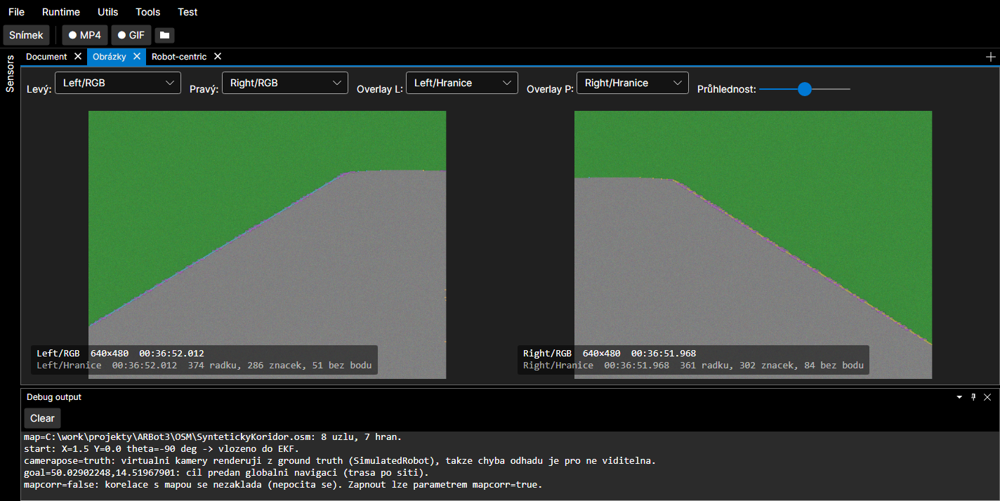
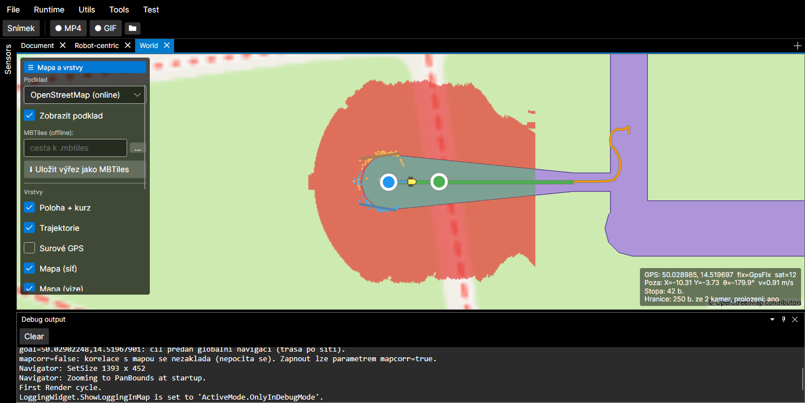

# Dokovatelné dokumenty a nástroje (Avalonia + Dock + MVVM)

Tento adresář obsahuje **prezentační `UserControl`y** (Views) pro dokovatelné dokumenty
a nástroje aplikace ARBot. Aplikace používá **Avalonia 12 + Dock.Avalonia +
CommunityToolkit.Mvvm** (žádné WPF).

## Princip

Každý dokovatelný prvek má oddělený **ViewModel** (ve `ViewModels/`) a **View**
(`UserControl` ve `Views/`). ViewModel zná typ svého View přes vlastnost `ViewType`:

- Dokumenty dědí z **`DocumentBase`**, nástroje z **`ToolBase`**
  (viz [`ViewModels/DockableBase.cs`](../ViewModels/DockableBase.cs)).
  Obě implementují `IViewProvider` s `Type ViewType`.
- [`ViewLocator`](../ViewLocator.cs) podle `ViewType` vytvoří instanci View. (Když prvek
  není `IViewProvider`, použije se fallback konvence názvu `...ViewModel` → `...View`.)
- **`App.axaml` NEobsahuje žádné inline `DataTemplate`y** pro dokumenty/nástroje —
  vše řeší `ViewLocator` + samostatné `UserControl`y. Díky tomu jde každý View
  **navrhovat s design-time náhledem**.

## Jak přidat nový dokument (nebo nástroj)

1. **ViewModel** ve `ViewModels/Xxx(Document|Tool).cs`:
   ```csharp
   public partial class XxxDocument : DocumentBase   // nebo : ToolBase
   {
       public override Type ViewType => typeof(ARBot.Views.XxxDocumentView);
       // ... [ObservableProperty] vlastnosti, konstruktor, ...
   }
   ```
2. **View** ve `Views/XxxDocumentView.axaml` (+ `.axaml.cs` s `InitializeComponent()`):
   ```xml
   <UserControl xmlns="https://github.com/avaloniaui"
                xmlns:x="http://schemas.microsoft.com/winfx/2006/xaml"
                xmlns:vm="using:ARBot.ViewModels"
                x:Class="ARBot.Views.XxxDocumentView"
                x:DataType="vm:XxxDocument">
       <Design.DataContext><vm:XxxDocument/></Design.DataContext>
       <!-- obsah, bindingy proti vlastnostem XxxDocument -->
   </UserControl>
   ```
   `x:DataType` zapíná compiled bindings (kontrola názvů při buildu) a IntelliSense;
   `Design.DataContext` dává náhled v návrháři.

Žádná úprava `App.axaml` není potřeba.

## Design-time bezpečnost

`Design.DataContext` vytvoří ViewModel i v návrháři, proto konstruktory ViewModelů
**hlídají `Avalonia.Controls.Design.IsDesignMode`** a v návrhovém režimu nespouští
hardware/časovače/přístup k `ARBotHW` (např. `D435TestDocument` nezakládá kameru,
`SensorStatusTool` nespouští časovač, `DebugOutputTool` neregistruje Trace listener).
Nový ViewModel, který v konstruktoru dělá vedlejší efekty, musí totéž.

## Otevírání dokumentů z panelu Sensors

Panel **Sensors** ([`SensorStatusToolView`](SensorStatusToolView.axaml)) vypisuje
`ARBotHW.Current.Sensors`. Dvojklik na řádek vyvolá `SensorStatusTool.ActivateCommand`
→ event `SensorActivated(ISensor)` → `MainWindowViewModel.OpenSensorDocument`, který
podle typu senzoru vytvoří dokument ve **`CreateSensorDocument`** (switch) a přidá ho do
doku (deduplikace podle `Id`). Nový typ senzoru = přidat větev do `CreateSensorDocument`.

> **Pozor na pořadí větví.** `CreateSensorDocument` je `switch` *expression* — vyhrává **první**
> odpovídající vzor. Speciálnější typ proto musí být **výš** než obecné rozhraní: `VirtualCamera`
> stojí nad `ICamera`, jinak by se `VirtualCameraDocument` nikdy nevytvořil.

### Stop/Start jednotlivého senzoru (21. 8. 2026)

Na řádku je tlačítko **Stop/Start** — `SensorRow.ToggleCommand` nad
[`IControllableSensor`](../../ARBot.Common/Devices/IControllableSensor.cs). Stav řádku je
`OK` (běží) / `STOP` (zastavený, indikátor zešedne) / `CHYBA`; obnovuje ho sekundový časovač
panelu a po kliknutí se překreslí hned.

Tři věci, které je potřeba vědět:

- **Příkaz je na `SensorRow`, ne na `SensorStatusTool`** — šablona binduje `{Binding ToggleCommand}`
  bez hledání předka. Cesta přes `$parent[ItemsControl].DataContext` by při přejmenování selhala
  **tiše**: view má `CompileBindings="False"` a hlášky oblasti `Binding` jsou ve `FilteredTraceLogSink`
  odfiltrované, takže by se chyba neobjevila ani v Debug outputu.
- **Vypnutí nepřežije Run.** Pipeline si senzory spouští sama
  (`SensorMessageSource(controlSensor: true)`), takže start runtime zastavený senzor zapne zpátky —
  vypínat se má až za běhu. Vědomé rozhodnutí: zámek, který by Run přebil, by byl další skrytý stav.
- **Tlačítko se u některých řádků neukáže.** `MD23` (motory po I2C) ani `DummyMotors` žádnou smyčku
  na pozadí nemají, takže `IControllableSensor` neimplementují a `CanControl` je `false`.
  U motorů s vlastní smyčkou (UART) Stop zastaví **jen odometrii** — kola to nezastaví, poslední
  příkaz jízdy v řídicí jednotce platí dál. Proto se před zastavením posílá `Drive(0,0)`; když ale
  běží řídicí smyčka, ta si za svůj tik pošle vlastní příkaz a nulu přebije. **Není to
  bezpečnostní funkce.**

> **Souvisí:** kvůli tomuhle přestalo `SensorBase.GetLastMeasurement()` senzor spouštět. Dřív tam
> bylo `Start()`, takže zastavený senzor kdokoli vyzvednutím měření zapnul zpátky (pull kamer
> v runtime, detailní okno) a zastavit se nedal vůbec. Redundantní to bylo i tak — **každý senzor
> se spouští ve svém konstruktoru**.

## Vzhled tlačítek — jeden společný styl (26. 8. 2026)

[`Styles/Buttons.axaml`](../Styles/Buttons.axaml), zapojený v `App.axaml` **za** Fluent tématem
(aby ho přebil). **Nestyluj tlačítka na místě** — používej třídy. Třída **`btn` musí být vždy**,
ostatní jsou modifikátory:

| zápis | k čemu |
|---|---|
| `Classes="btn"` | běžné tlačítko (padding 12,6; MinHeight 30) |
| `Classes="btn compact"` | toolbary, transportní lišta, tlačítka v řádcích tabulek |
| `Classes="btn action"` | hlavní akce panelu (vyšší, tučné, MinWidth 110) |
| `Classes="btn action accent"` / `info` / `danger` | + zelená / modrá / červená |

> ⚠️ **Styl je POJMENOVANÝ schválně, ne globální na typ.** První verze mířila na
> `Selector="Button"`, tedy na **všechna** tlačítka v aplikaci — a přebarvila i **chrom dokovacího
> systému** (zavírací křížky tabů a další tlačítka uvnitř `Dock.Avalonia` šablon); nahlásil to autor
> tentýž den. Globální selektor na typ je v aplikaci s cizími tématy vždycky přestřelka: nemá jak
> odlišit „naše" tlačítko od tlačítka uvnitř šablony třetí strany. Nové tlačítko proto musí
> `btn` dostat výslovně — a když ho zapomene, vypadá jako Fluent default, což je viditelné, ne tiché.

**Proč to vzniklo:** tlačítka se stylovala na místě, takže měla **čtyři různé paddingy**
(8,3 / 8,2 / 8,0 / 7,4), nahodilé `MinWidth` a barvy jen tam, kde si na to někdo vzpomněl. Autor to
nahlásil jako **nečitelná tlačítka** (26. 8. 2026) a byly na tom dvě věci:

- **Obsah nebyl na středu.** U tlačítek s `MinWidth` se text lepil k okraji, takže široké tlačítko
  vypadalo jako prázdná plocha s textem v koutě. Styl to nastavuje explicitně na oba směry.
- **Zakázaný stav byl skoro neviditelný.** Výchozí Fluent má u `:disabled` velmi nízký kontrast — a
  u ovládání mise je zakázaný stav **nejčastější** (Start jde zmáčknout jen v `Idle`, Potvrdit jen
  v servisním okně). Styl mu dává čitelnou, jen zjevně neaktivní barvu.

## Znovupoužitelné controly (`Views/Controls/`)

Vlastní vykreslované controly (Avalonia `Control` + `Render` + `StyledProperty` +
`AffectsRender`):

- `SensorStatusControl` — indikátor stavu `ISensor` (tečka + jméno + OK/CHYBA), poll
  `DispatcherTimer` 1 s (protože `ISensor.IsError` nenotifikuje). Dej do záhlaví každého
  dokumentu senzoru: `<ctl:SensorStatusControl Sensor="{Binding Sensor}"/>`.
- `CompassControl`, `ArtificialHorizonControl` — kompas a umělý horizont pro IMU
  (kompas využívá i `GpsDocument` pro kurz/azimut).

## Hotové dokumenty senzorů

- `IMUDocument` (`IIMU`) — kompas (yaw) + umělý horizont (pitch/roll), orientace,
  úhlová rychlost, akcelerace, magnetometr, kvaternion, nejistota. Obnova událostí
  `MeasurementArived`.
- `GpsDocument` (`IGPS`) — kompas (kurz/azimut), poloha, výška, kvalita fixu, satelity,
  HDOP, rychlost. Obnova událostí `MeasurementArived` (jako IMU).
- `MotorControlDocument` (`IMotorControl`) — indikátor nouzového zastavení, rychlosti kol,
  enkodéry, proudy motorů, napětí. Obnova událostí `MeasurementArived`.
- `CameraDocument` (`ICamera`) — RGB / hloubkový stream (WriteableBitmap, Bgra8888) s přepínačem
  `ToggleSwitch` (RGB/Hloubka) + overlay s rozlišením a snímkem/Hz/časem. Hloubka (Gray16, ~mm)
  se normalizuje do grayscale (blízko světlé, daleko tmavé). Obnova událostí `MeasurementArived`.
  Kameru **NEvlastní** (je sdílená z `ARBotHW.Sensors`) — v `Dispose` se jen odhlásí. (Odlišné od
  `D435TestDocument`, který si vlastní kameru vytváří a zavírá — ten slouží jako samostatný test D435.)
- `VirtualCameraDocument` (`VirtualCamera`) — **dědí z `CameraDocument`** (celý stream i backpressure
  se znovupoužívá; view vkládá `CameraDocumentView` a přidá panel vedle něj) a doplňuje **umělou
  chybu pózy**: vpřed / vlevo / kurz v rámci robotu, vynulování, a **očekávané hodnoty vedle
  naměřených** z `MapCorrelationMsg` (odběr ze `Stream`). Slouží k ověření korelace occupancy gridu
  s mapou — viz [doc/virtual-hw.md](../../../doc/virtual-hw.md#umělá-chyba-pózy-poseerror).
  Chyba je sdílená oběma kamerami (`ARBotHW.VirtualPoseError`), takže panel je pro Left i Right tentýž.
  Vlastnosti navázané na `NumericUpDown` jsou **`decimal`** (`NumericUpDown.Value` je `decimal?` —
  `double` by selhal až za běhu); stejný vzor jako `WorldViewDocument.DefaultRoadWidthMeters`.

- `RobotourMissionDocument` — panel **Tools → Mise Robotour**: fáze automatu, **na co se čeká**, stav
  nouzového zastavení, přečtený kód s odvozeným cílem (souřadnice, vzdálenost od depa, délka trasy),
  zapamatované cíle, čítače a tlačítka Start / Potvrdit / Přerušit. Viz
  [doc/robotour-mission.md](../../../doc/robotour-mission.md).

  Tři věci, které z něj dělají, co je:
  - **Stav se čte ze `MissionMsg` na Streamu, ne z instance mise** — panel tím funguje i při
    přehrávání záznamu (celá soutěžní jízda se dá přehrát fázi po fázi). Příkazy naopak potřebují
    živou misi (`ARBotRuntime.RobotourMission`); když neběží, panel to **napíše přímo v UI** a
    tlačítka zakáže. Tlačítko, které tiše nic nedělá, je horší než zakázané — tatáž lekce jako
    u prázdné vrstvy hranic cesty.
  - **„Na co se čeká" je vlastní řádek**, ne odvozeninka z názvu fáze: nouzové zastavení je signál
    mise **jen ve stavech, které na něj čekají**, takže obsluha, která ho zmáčkne za jízdy, by jinak
    čekala, že tím něco odemkla.
  - **Bez panelu se mise nedala spustit** (čeká na `StartMission()`), a bez přepínače nouzového
    zastavení ve `VirtualSensorsDocument` se v simulaci nedalo projít servisní okno.
  - **Náhled kamery běží po celou dobu servisního okna** tam, kde se čte kód — ne jen ve stavu
    `Servicing`. Mířit kódem se musí **už před** stisknutím stopu (tedy v `AwaitingEStop`), a po
    zrušení potvrzování se `Servicing` opouští hned po přečtení, takže vázat náhled na něj by dalo
    okno viditelnosti dlouhé jeden okamžik. Skenování to nerozšiřuje: `QrScanner.Enabled` řídí mise
    a zapíná ho výhradně pod drženým stopem. Řádek pod obrazem říká, co se právě děje.

  > ⚠️ **Past: `ARBotRuntime.Current` existuje dřív než jeho stupně.** Runtime je singleton, který
  > vzniká už při prvním přístupu (a `Stream` je jeho `readonly` pole, takže **přežije Run/Stop**),
  > ale stupně jako `RobotourMission` se zakládají teprve v `Build()`, tedy při **Run**. ViewModel,
  > který si referenci na stupeň uloží **v konstruktoru**, ji při otevření panelu před Runem uloží
  > jako `null` **natrvalo** — a projeví se to zrádně: zprávy ze `Stream`u chodí a panel se plní
  > správně, jen ovládání zůstane mrtvé. Nalezeno v běžící aplikaci 26. 8. 2026.
  > **Stupně proto hledej znovu při každém použití**, ne jednou v konstruktoru; `Stream` naopak
  > stačí připojit jednou.

- `VirtualSensorsDocument` — panel **Tools → Virtuální senzory** (není to dokument senzoru, nevzniká
  dvojklikem v Sensors). Nastavení šumu, **systematických chyb** simulovaných senzorů (prokluz kol,
  bias kurzu a gyra) a **nouzového zastavení** nad sdílenou instancí `ARBotHW.VirtualSensors`
  + **živé měření skutečné chyby lokalizace**: páruje `GroundTruthMsg` s `RobotStateMsg` podle shodného časového razítka a počítá
  statistiku (n, průměr, RMS, max). Odběr ze `Stream`, backpressure „latest-wins".
  Viz [doc/virtual-hw.md](../../../doc/virtual-hw.md#systematické-chyby-prokluz-kol-a-bias-imu-22-8-2026).
  Prokluz kol se po změně musí přenést do `SimulatedRobot` (`ARBotHW.ApplyVirtualSensorOptions`) —
  nastavení žije v `HAL`, simulovaný robot v `Common`, takže o sobě nevědí.

## Vrstvy pro kontrolu detektoru hranic cesty (22. 8. 2026)

Hranice cesty (`CameraFrame.PathEdges`) jdou zobrazit **ve dvou pohledech současně** — statistika
nad záznamem řekla, že vzdálená část hranice je vedle, ale ne proč; to je vidět až na obraze.

- **Obrázky** — overlay vrstva `"<kamera>/Hranice"` nad barevným snímkem (sloupce `Left`/`Right`
  jsou v souřadnicích barevného obrazu, tam je hledá detektor — `CameraFrameProcessor` je tam
  přepočítává měřítkem `ImageRGB/ImageProbability`). **Modrá** = levá hranice, **oranžová** = pravá,
  **fialová** = sloupec detekovaný, ale metrický bod nevznikl (chybí hloubka). Vybírá se ručně
  v comboboxu overlaye; automaticky se nenabízí, protože `FindOverlayFor` dává přednost
  probability. V popisce je počet řádků, **počet vykreslených značek** a **počet výpadků**
  (sloupec bez metrického bodu) — čísla zodpoví otázku „je tam něco?" bez zírání do pixelů.

  Výpadky se kreslí jako **široká vodorovná čára**, ne tečka: nad záznamem jich je 18–36 % všech
  sloupců, ale rozstříkané po celé hranici, a 3px tečka jiné barvy je při 50% průhlednosti overlaye
  okem nerozeznatelná — vypadalo to, že žádné nejsou (nahlásil autor 23. 8. 2026).

  Pozor na výklad: **35 % řádků `PathEdge` nemá ani jeden sloupec**, takže značek je vždy citelně
  míň než řádků (383 řádků ≈ 280 značek). Není to chyba vrstvy.

  
- **World** — vrstva „Hranice cesty" (výchozí **vypnuto**, je to ladicí vrstva). Kreslí dvoje data:
  **body** z rámce robotu promítnuté pózou do mapy (modrá levá, oranžová pravá) a přes ně
  **proložené přímky z koridoru** jako úsečky (`RoadCorridorMsg` verze 4) — přijatý cyklus plnou
  tlustou čarou, zamítnutý tenčí a průhlednější. Zamítnuté se kreslí **schválně**: statistika řekne
  že přímky nejsou rovnoběžné, ale teprve obrázek ukáže, že ta „pravá" hranice je ve skutečnosti
  příčná hrana křižovatky. Přednost má **ground truth** (`GroundTruthMsg`, virtuální HW) — jinak by
  se do obrázku přičetla i chyba lokalizace a nebylo by poznat, jestli je vedle detektor, nebo
  odhad pózy.

  > **Body jedou vždycky, přímky jen s `corridor=true`.** Hraniční body nese `CameraFrame`, ale
  > proložení počítá až stupeň hranové lokalizace — a ten se při výchozím `corridor=false` vůbec
  > nezakládá. Vypadá to pak jako vada vrstvy (nahlášeno 23. 8. 2026), proto je v rámečku vpravo
  > dole řádek `Hranice: <n> b. ze <k> kamer, prolozeni: ano / ceka se / NENI (corridor=false)`.
  > Prázdná vrstva má mít vysvětlení přímo v UI, ne v Debug outputu.

  > **Past při slučování kamer** (nalezeno 23. 8. 2026 — ve World byla vidět jen jedna hranice,
  > v Obrázcích obě). `Flush` běží z `Dispatcher`u a mezi dva snímky téže kamery se klidne vejde,
  > takže ve frontě je často **jen jedna kamera**. Původní `edgesByCam.Clear()` proto tu druhou
  > pokaždé smazal. Správně je **přepisovat per kameru**; zastaralé záznamy (kamera přestala
  > dodávat) se zahodí až při kreslení — proti času **nejnovějšího snímku**, ne proti hodinám,
  > aby to fungovalo i při přehrávání záznamu. Počet kamer je vidět v rámečku
  > (`… ze 2 kamer`), takže se to příště pozná hned.

Čtyři věci, na které se dá narazit (na první tři jsem narazil):

- **Pořadí v `Ingest` rozhoduje.** Hranice se musí zpracovat **až za** rozkladem na vrstvy
  (`MessageImageLayers.Extract`). Když se `AssignBaseLayer("<kamera>/RGB")` zavolá dřív, než ta
  vrstva vůbec je v `Layers`, combobox si `SelectedItem` mimo `ItemsSource` srazí na `null` —
  a zhasne i podkladový panel. Vrstva se pak tvářila jako nefunkční.
- **Líné rendrování potřebuje dorenderování při výběru.** Když se rendruje jen pro vybranou vrstvu,
  je při **prvním** výběru `prerendered` prázdný a `RenderFromRegistry` by slot vyprázdnil; ve View
  (pauza) už žádný další snímek nemusí přijít, takže by zůstal prázdný natrvalo. Proto se
  z posledních hranic dorenderuje na místě.
- **`MemoryLayer` má výchozí styl.** Bez `Style = null` kreslí pod každou featuru ještě své bílé
  kolečko — u stovek bodů z toho je nečitelná kaše.
- **Snímky jsou poolované.** `WorldViewDocument.Post` proto body kopíruje **hned**; držet referenci
  na `CameraFrame` po návratu z `Post` je cesta k přepsaným datům. (`PathEdges` je naopak per snímek
  čerstvý seznam — `CameraFramePool` ho jen přenáší referencí — takže na něj `ImageDocument` držet
  referenci smí.)

Póza se bere **poslední známá**, ne póza v čase snímku — za jízdy je tedy o jeden takt pozadu.
Na vizuální kontrolu to stačí, na měření ne.



## Dokumenty nad `Stream` (ne senzory)

- `ImageDocument` — obrazové vrstvy (ImageMsg/CameraFrame), odběr `ARBotRuntime.Stream`. Umí i overlay
  gridu sjízdnosti jako vrstvu `"<kamera>/Traversability"` (rasterizace z `PolarTraversabilityGridMsg`
  do velikosti depth snímku, per-pixel alfa) — vybere se do overlay slotu nad `"<kamera>/Depth"`.
- `RobotCentricDocument` (`RobotCentricControl`) — robot-centrický (ptačí) pohled na robot-centrická
  měření. Robot dole, vpřed nahoru; sdílené scaffolding (dosahové kružnice, osa, tvar robotu v měřítku)
  + vrstvy. Zatím vrstva: polární grid sjízdnosti (`PolarTraversabilityGridMsg`) — buňky obarvené dle
  třídy, průhlednost dle důvěry. Výhledově další vrstvy (RGB sjízdnost, okraje vozovky…). Odběr `Stream`
  (Run i View), backpressure „latest-wins". Menu **Tools → Robot-centric**.
  Viz [doc/traversability-grid.md](../../../doc/traversability-grid.md).
- `WorldViewDocument` (Mapsui `MapControl`) — world (geo) pohled: mapa s přepínatelným podkladem
  (OSM online / MBTiles offline / žádný) a vypínatelnými vrstvami dat ze `Stream` (poloha+kurz z `GPSState`/
  `RobotStateMsg`, trajektorie z GPS, trasa/graf a značky z `GraphNavigationMsg`). Podklad lze úplně vypnout ⇒
  **na OrangePI žádné pokusy o internet** (na ARM je i výchozí podklad `None`). ViewModel vlastní Mapsui `Map`,
  View mu ho přiřadí do `MapControl.Map` v code-behind (mimo design-time). Odběr `Stream` (Run i View),
  backpressure „latest-wins". Menu **Tools → World**. Viz [doc/world-view.md](../../../doc/world-view.md).

Pozn.: dokumenty senzorů se obnovují **událostí `MeasurementArived`**, ne časovačem —
data se tak zobrazují rovnoměrně, jak chodí z driveru. Rozhraní `IIMU`/`IGPS`/`IMotorControl`/`ICamera`
proto událost vystavují (implementace ji dědí ze `SensorBase`).

## Backpressure: aktualizace z `MeasurementArived` / `Post` (POVINNÝ vzor)

`MeasurementArived` (i `IMessageSink.Post` u `ImageDocument`) běží **na vlákně producenta**
(`SensorBase.Process`, resp. `RelaySource` fan-out — ten nemá vlastní frontu). Při vysoké
frekvenci (kamera ~30 Hz, IMU/motor ~100 Hz, backproject) by naivní
`Dispatcher.UIThread.Post(() => Apply(x))` na **každou** zprávu zahltil dispatcher frontu →
UI ztratí responzivitu a zpracovává staré framy (typicky „stall → dávka stovek Hz → zpět").

Všechny dokumenty přijímající data proto MUSÍ použít jednotný vzor **„latest-wins + Background
flush"**:

1. Handler (na vlákně producenta) je **neblokující**: pod zámkem uloží jen **nejnovější**
   payload (starší zahodí) a když `!updateQueued`, naplánuje jednu aktualizaci:
   `Dispatcher.UIThread.Post(Flush, DispatcherPriority.Background)`.
2. `Flush` (na UI vlákně) pod zámkem vyzvedne + vynuluje pending a zavolá `Apply`/render.

```csharp
private readonly object pendingGate = new();
private TState? pendingState;              // nebo Dictionary<klíč,zpráva> pro víc zdrojů
private volatile bool updateQueued;

private void OnMeasurement(object? sender, TState state)
{
    if (state == null) return;
    lock (pendingGate) pendingState = state;       // nejnovější vyhrává (drop stale)
    if (updateQueued) return;
    updateQueued = true;
    Dispatcher.UIThread.Post(Flush, DispatcherPriority.Background);  // vstup/render mají přednost
}

private void Flush()
{
    updateQueued = false;
    TState? s; lock (pendingGate) { s = pendingState; pendingState = null; }
    if (s != null) Apply(s);
}
```

Aplikováno v: `CameraDocument`, `D435TestDocument`, `IMUDocument`, `GpsDocument`,
`MotorControlDocument`, `ImageDocument` (ten drží `Dictionary` pending per zdroj —
`C:<kamera>` / `B:<blob>` — aby se nestarval žádný slot). `DebugOutputTool` má obdobnou
koalescenci nad řádky. **Každý nový dokument aktualizovaný z eventu/streamu musí tenhle vzor
dodržet.**

## Gate renderu na viditelnost tabu (DocumentBase.IsActive)

`DocumentBase.IsActive` (nastavuje `DockFactory` z `ActiveDockableChanged` = aktivní tab
`DocumentDock`) umožňuje dokumentu **gatovat drahý render, když není vidět**. Nutné pro
vizualizace, jejichž render **neběží přes Avalonia `Control.Render`** (ten framework gatuje
viditelností sám) — typicky tvorba `WriteableBitmap` ve ViewModelu. `ImageDocument`: nejnovější
zprávu si **vždy pamatuje** (`pending`, poolovaná kopie), ale renderuje **jen když je aktivní**;
při zviditelnění (`OnActiveChanged`) hned vyrenderuje zapamatovaný snímek. Bez toho skrytý tab
chrlí `WriteableBitmap` (GC gen2) na pozadí — viz [devlog 2026-08-01](../../../doc/devlog.md).
`RobotCentricControl` gate nepotřebuje (renderuje přes `Control.Render`).

> ⚠️ **Past (nalezeno 27. 8. 2026): `IsActive` zamrzlo dokumentům mimo `DocumentDock`.**
> `DockFactory.OnActiveDockableChanged` procházel **jen** `DocumentDock.VisibleDockables`. Jakmile si
> uživatel dokument vytáhl do **vlastní dokovací skupiny** (nebo plovoucího okna), přestal v tom
> seznamu být — a `IsActive` mu zůstalo na **poslední hodnotě před přetažením**. Když byl tehdy
> aktivní jiný tab, měl natrvalo `false`, takže gate render **navždy vypnul**: panel zůstal prázdný
> a vypadalo to jako vada té vizualizace, ne doku. Nahlásil autor jako „mise Robotour přestala
> ukazovat kameru".
>
> Handler teď prochází **celý dokovací strom** a dokument je aktivní, když je `ActiveDockable`
> **svého vlastního** doku. Platí to pro každý panel, který na `IsActive` gatuje (náhled kamery
> v misi, `ImageDocument`).

Možné další optimalizace obrazových dokumentů (zatím neuděláno): recyklace `WriteableBitmap`
místo alokace na každý frame **když je dokument viditelný** (skrytý už díky IsActive nerenderuje);
přesun `MessageImageLayers.Extract` (JPEG dekód / barevný převod) na worker vlákno mimo UI — viz
TODO v [build-and-platforms.md](../../../doc/build-and-platforms.md).
