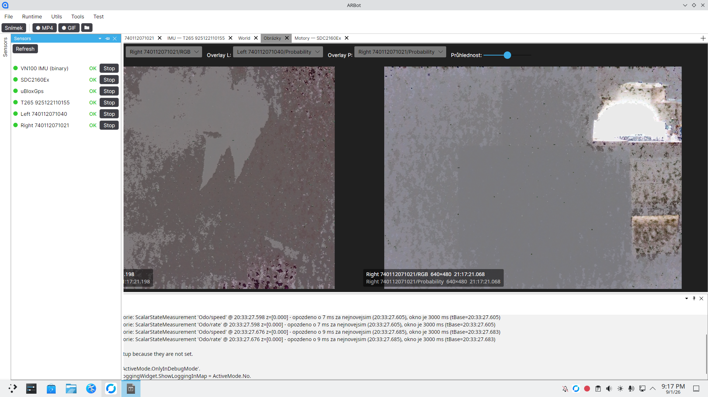
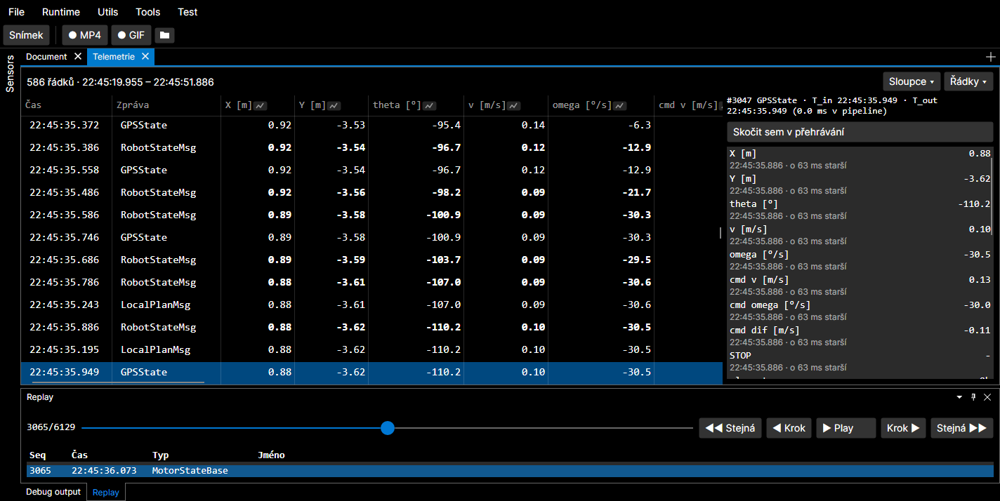
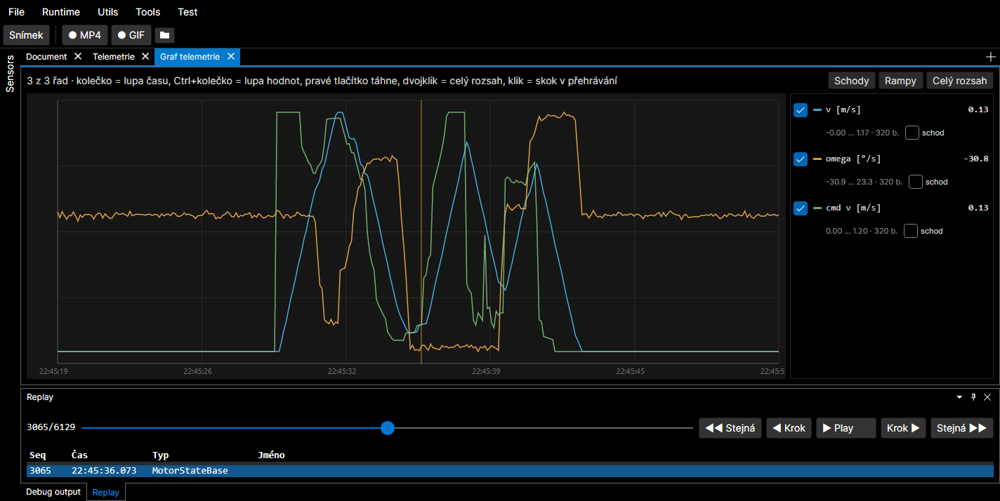

# DevLog — deníček vývoje

Chronologický **záznam postupu vývoje den po dni** — stručné shrnutí, *co* se ten den dělalo,
*proč* a *v jakém stavu* to skončilo. Slouží jako souvislý příběh projektu napříč sezeními
i lidmi (viz [CLAUDE.md](../CLAUDE.md), pravidlo „vše v repozitáři").

**Vztah k [decisions.md](decisions.md):** deník rozhodnutí drží *proč* u netriviálních
rozhodnutí (trvalé odůvodnění). DevLog drží *časovou osu* — co se který den udělalo, na čem se
pokračuje, co je otevřené. **Neduplikuj** — když den přinesl zásadní rozhodnutí, shrň ho jednou
větou a **odkaž** do `decisions.md`; detaily domény odkaž do příslušného `doc/*.md`.

## Jak psát záznamy (pravidla)

- **Jeden nadpis `## RRRR-MM-DD` na den práce.** Absolutní datum (ne „včera"). **Nejnovější nahoru**
  (nad tuto sekci s pravidly to nepatří — přidávej pod čáru níže, na začátek seznamu dnů).
- **Zapisuj na konci pracovního sezení** (nebo když dokončíš smysluplný kus). Když už dnešní
  datum má nadpis, **připiš k němu** další odrážku, nezakládej druhý.
- **Formát dne:** krátký souhrn v odrážkách. Doporučené položky (vynech, co nedává smysl):
  - **Hotovo:** co se dokončilo a ověřilo (build/testy/na zařízení).
  - **Rozpracováno / další krok:** kde se pokračuje příště.
  - **Rozhodnutí:** jedna věta + odkaz do [decisions.md](decisions.md), pokud padlo zásadní rozhodnutí.
  - **Odkazy:** dotčené soubory, `doc/*.md`, commit (`git` hash), issue.
- **Stav ověření uváděj pravdivě** — co je odsimulované vs. co je nutné ověřit na HW (viz CLAUDE.md).
- **Obrázky: nový záznam = nový soubor.** Obrázek v `doc/media/`, na který se odkazuje starší záznam,
  se **nepřepisuje** (pokud o to není výslovně požádáno) — každý den/záznam má vlastní název souboru
  (např. `world-view-road-width.png`, ne znovu `world-view.png`). *Proč:* přepsáním se odkaz pod
  starším datem začne odkazovat na pozdější práci — stalo se, že pod 6. 8. byl `world-view.png`,
  který po úpravě 7. 8. ukazoval šířky cest, jež k 6. 8. neexistovaly. Když jeden obrázek sdílí víc
  záznamů, rozdělit na dva.
- **Čeština**, věcně a stručně (deník, ne esej). Nezapisuj to, co se dá vyčíst z gitu jedním
  příkazem — přidávej *kontext a záměr*, který v diffu není.

> **Pokyn pro Claude / asistenta:** DevLog průběžně **sám udržuj**. Na konci sezení, ve kterém
> vznikla smysluplná změna, přidej (nebo doplň) záznam pro dnešní den dřív, než skončíš. Starší
> sezení mohou být požádána o zpětné doplnění — chybějící dny klidně dorekonstruuj z git historie
> a označ je `(zpětně z gitu)`.

---

## 2026-09-01

- **Profil pro FreeRun na Orange Pi — a cestou se ukázalo, že profily na zařízení vůbec
  nefungovaly.** Vzniklo [`config/pi-freerun.cfg`](../config/pi-freerun.cfg); doména:
  [mission-freerun.md](mission-freerun.md), [configuration.md](configuration.md).
  - **Vlastní profil je krátký** (`mission=freerun`, `record=true`) a hlavní obsah jsou komentáře
    o tom, **co se záměrně nenastavuje**: `map=` mise nepotřebuje, `corridor=` je hranová
    lokalizace **proti mapě** (mise má vlastní `CorridorSource` a na tom stupni nezávisí),
    `mapcorr=` bez mapy nemá co dělat, `start=` bez mapy není z čeho hádat. Ověřeno v kódu
    (`ARBotRuntime`, case „freerun"), ne odhadnuto — navigátor se navíc zakládá bezpodmínečně,
    takže mise opravdu naskočí.
  - **Nový parametr `record=`** (na žádost autora): `true` založí při startu režimu Run
    `records/yyyyMMdd-HHmmss.rec`, jinak se hodnota bere jako cesta. Do té doby se záznam dal
    zapnout **jen ručně z UI**, což na zařízení pouštěném přes SSH nešlo — a bez záznamu nejde
    běh rozebrat přes `ARBot.Analyze`. Řeší to jedno místo (`ARBotRuntime.Start`), takže platí
    bez ohledu na to, odkud se Run spustil; cesta předaná volajícím (tlačítko *Run + záznam*)
    profil přebíjí.
  - ⚠️ **Profily na zařízení do dneška nefungovaly a doc to tvrdil opačně.** `configuration.md`
    psal, že fallback na `AppContext.BaseDirectory` znamená „totéž zadání funguje na vývojovém
    stroji i na zařízení". Na Pi ale v `~/arbot` **není `.git` ani `config/` ani `OSM/`** (ověřeno),
    takže `config=config/pi-freerun.cfg` ukazovalo na neexistující soubor = **chyba při startu**.
    Léčba: `ARBot.csproj` kopíruje `config/*.cfg` **a `OSM/*.osm`** (na výzvu autora) do build
    outputu. OSM je ~30 MB v 17 souborech — poznamenáno, jak to případně zúžit.
  - **Nový strážný test `ProfilyVRepuTests`:** každý `config/*.cfg` musí projít registrem a každá
    hodnota typu `Path` musí ukazovat na existující soubor (registr kontroluje jen **tvar** cesty).
    Že test skutečně chytá, jsem ověřil dočasným vadným profilem — spadl na neznámém klíči,
    neplatné hodnotě výčtu i na neexistující mapě.
  - **Ověřeno:** build x64 i OrangePI zelený, testy **1065 zelených**. Profil jsem načetl
    **v prostředí Pi bez repa** malým programem nad ARM knihovnou: `RootOrBase()` spadl na adresář
    aplikace, profil se našel a `ParamStore.Build` ho vzal s nulou varování
    (`mission=freerun`, `record=true` z profilu, ostatní z defaultů).
  - **Nový parametr `autorun=`** (druhá žádost autora): spustí režim **Run** sám po startu
    aplikace, po `WaitReady` a ~3 s ustálení — stejným postupem jako self-test, takže se v UI
    neklikne nic. Skládá se s `record=` (autostart volá `RunMode()`, záznam řeší
    `ARBotRuntime.Start`), a při `selftest=true` se **ignoruje** a zapíše proč (self-test si Run
    spouští sám, druhý start by první zastavil).
    ⚠️ **Se zapnutou misí se robot rozjede sám**, bez dalšího pokynu; zastaví ho jen nouzové
    zastavení nebo *Stop*. Ta prodleva je na **ustálení, ne bezpečnostní** — a je to tak napsané
    i v profilu a v dokumentaci, aby si to nikdo nevyložil jako pojistku.
  - **Nový parametr `maxspeed=` a odstranění mrtvého pole** (třetí žádost autora, který se ptal,
    jestli jde omezit rychlost).
    - **Nešlo.** Rychlost drží `Profile.MaxAllowedSpeed = 1,2 m/s`, statické pole v kódu;
      `Profile` v registru [záměrně není](configuration.md) kvůli odvozeným statickým polím.
    - ⚠️ **`FreeRunConfig.MaxSpeedMps` byl mrtvý.** Měl popis „strop rychlosti mise" i validaci,
      ale **nikdo ho nečetl** — a číst ho ani nešlo: šev do lokální vrstvy je
      `SetGoal(worldX, worldY, corridorWidthM)` a kanál pro rychlost tam není. Vypadalo to jako
      hotová funkce, přitom nastavit ho nedělalo nic. **Odstraněno** i s řádkem v dokumentaci.
    - **`maxspeed=` nastavuje `Profile.MaxAllowedSpeed` v `Program.Main`**, tedy před složením
      runtime. Musí to být tam: hodnotu čtou tři místa **při vzniku objektu** (driver motoru
      a `TrapezoidMotionProfile` v konstruktoru, `LocalPlannerConfig.MaxSpeed` inicializátorem
      pole), takže cokoli vzniklé dřív by drželo starou hodnotu a strop by platil jen zčásti —
      u bezpečnostního omezení nejhorší možný výsledek. Test to drží doložené.
    - **Past s odvozenými poli se tím neotvírá** — z `MaxAllowedSpeed` nic nederivuje
      (`MaxTheoreticalSpeed` se počítá z obvodu kola a otáček); i na to je test. Zbytek `Profile`
      zůstává mimo registr.
    - **Nekladnou hodnotu odmítne registr** (nový parser `ParamParsers.Kladne`), hodnota nad
      technicky dosažitelnou rychlost se **ořízne s hláškou** — odmítnout kvůli optimistickému
      číslu start robota v terénu by bylo horší než ho zpomalit.
    - **V profilu je `maxspeed=0.1`** (na pokyn autora), tedy ~1/10 kroku chůze: robota jde
      dohnat a zastavit rukou. V kódu zůstává 1,2.
    - **Falešný poplach, který se cestou vyloučil:** `LocalPlannerConfig.PrefDist` (odstup, od
      kterého se rychlost neomezuje) **nepochází** z `MaxSpeed`, ale z `Profile.PrefDist` — nízký
      strop tedy odstupy od překážek neposouvá. Zbývá jen mírný vedlejší efekt: `MinCostSpeed`
      (0,05) je pevná a při stropu 0,1 je to polovina maxima místo ~4 %, takže se v ceně plánování
      smrskne rozdíl mezi „sotva průjezdné" a „volné". Neřešeno, jen zaznamenáno.
  - **Neověřeno:** že s tím profilem aplikace na Pi skutečně nastartuje a FreeRun pojede —
    to chce nasadit nový build (**starý build profil odmítne**, protože `record=` a `autorun=`
    jsou pro něj neznámé klíče, a to je tvrdá chyba při startu; totéž `maxspeed=`). A hlavně: **FreeRun na HW nikdy
    neběžel**, robot se s ním rozjede. Doporučený první pokus je `autorun=false` na příkazové
    řádce a Run naklikat ručně, až senzory hlásí OK a kurz se usadil.
- **Hláška fúze „zahozeno mereni starsi nez okno historie" byla zavádějící — opraveno.** Autor si
  na snímku všiml, že fúze zahazuje odometrii **zpožděnou o 7 ms**, přestože okno je **3000 ms**,
  a správně pojal podezření na hlášku. Podezření potvrzeno testem, ne úvahou
  ([DroppedTooOldReasonTests](../Src/ARBot.Common.Tests/Fusion/DroppedTooOldReasonTests.cs)):
  - **V ustáleném běhu se měření 7 ms za nejnovějším nezahodí** — projde, je hluboko uvnitř okna.
  - **Po inicializaci se zahodí** — a to **stejně při okně 3 s jako 60 s**. Rozhoduje totiž
    podmínka `m.TimeStamp <= tBase`, tedy **základ filtru**, ne okno. Před základ se dostat nejde,
    protože tam není stav; velikost okna na tom nic nezmění.
  - **Není to vada fúze, chování je správné.** Vadná byla jen hláška — a hned ve dvou věcech.
    (a) Vinila **okno**, které s rozhodnutím nemělo co dělat; nově obě situace rozlišuje
    (`starsi nez okno historie … merenie doslo POZDE` vs. `starsi nez zaklad filtru …
    OKNO ZA TO NEMUZE`). (b) **Na druhou vadu upozornil autor:** slovo „opozdeno" tvrdí, že
    měření došlo pozdě — ve druhém případě ale opožděné být vůbec nemuselo, jen **základ filtru
    byl postaven až za ním**. Tím se hledání chyby posílalo do doručování měření místo k `tBase`.
    Teď se píše „je o N ms starsi nez tBase … Merenie NEMUSELO byt opozdene" a test na to slovo
    přímo hlídá zákaz.
  - **Proč to chodí v párech `Odo/speed` + `Odo/rate`:** `SDC2160Ex` bere razítko na začátku
    `GetMeasurement` a pak čte čtyři řádky, takže jeho měření je o ~7–9 ms starší než okamžik
    zařazení. Hned po inicializaci pózy tedy první motorový rámec nutně propadne.
  - **Dvě různá `tBase` v jednom výpisu nejsou reinicializace:** `AsyncFusionEngine` se zakládá
    při každém Start a panel *Debug output* se mezi běhy nemaže. Skutečný signál problému by bylo,
    kdyby hlášky chodily i po prvních sekundách běhu s krátkou historií.
  - **Ověřeno:** 5 nových testů (včetně dvou na znění hlášky přes `Trace`), celá sada
    **1062 zelených** 2× po sobě, build x64 i OrangePI čistý. Upraven i
    `TraceInfoBridgeTest` — opíral se o staré znění, které bylo nesprávné i v jeho vlastním
    scénáři (2 s před `tBase` při prázdném bufferu). Doména: [ekf-fusion.md](ekf-fusion.md).
- **Problémová pravá D435 dořešená: vada byla na fyzické vrstvě, plus dvě vady v našem kódu.**
  Navázáno na hlášení z 31. 8. („T265 naběhla a pravá kamera se odmlčela"). Rozbor:
  [decisions.md](decisions.md), fyzická stránka [POSTUP.md](../OrangePi5Ultra/POSTUP.md).
  - **Co je naopak zdravé:** dvě D435 na jednom USB3 hubu jely **120 s i 375 s na 30/30 fps,
    nula timeoutů**. Hub je tedy neuškrtil. **T265 do toho měřitelně zasahuje**, ale zásek
    sama nezpůsobí: `CLEAR_HALT` vyskočí z 1 na ~72 a kamery prvních ~100 s kolísají na
    20–30 fps. Zásek po ~75 minutách pod plnou zátěží aplikace se reprodukovat **nepodařilo**.
  - **Vada 1 (náš kód): zaseknutá kamera se tvářila zdravě navždy.** Při timeoutu se ptáme
    `DevicePresent()`; kamera ale z USB nezmizela (v `dmesg` žádné odpojení), takže se pipeline
    nezbourala, `connected` zůstalo true a `IsError` hlásil **OK**. Nově se počítají po sobě
    jdoucí timeouty a po třech (~3 s bez snímku při požadovaných 30/s) se pipeline restartuje;
    `Teardown` shodí `connected`, takže panel poctivě ukáže CHYBA. Přidána diagnostická
    vlastnost `StallRestarts`.
  - **Vada 2 (náš kód, našla se až při ověřování): selhání dotazu na USB se vydávalo za
    odpojení.** `DevicePresent()` volá `ctx.QueryDevices()`, a to nad běžícími streamy umí samo
    spadnout na `failed to set power state` — což se hlásilo jako „kamera odpojena", takže by se
    šlo hledat kabel u kamery, která je na místě. `DevicePresent()` je teď **`bool?`**
    (`null` = nepodařilo se zjistit) a ptá se **až po překročení prahu**, ne při každém timeoutu.
  - **Vada 3 (fyzická, ta hlavní): port 4 hubu měl vadné spojení.** Pravá D435 nepřežila USB
    reset — `device not accepting address, error -71` pro adresy 4 až 8, pak `USB disconnect`,
    a rebind hubu skončil `unable to enumerate USB device`. Softwarově se vrátit nedala.
    **Autor kamery fyzicky přepojil** (tutéž kameru do jiného portu hubu) a od té chvíle jsou
    obě na 5 Gbps a 40 s streamu bez jediné chyby. **Vada tedy jde za portem 4 nebo za kabelem,
    který v něm byl, ne za kamerou.** `-71` je zároveň rozlišovací znak: dřívější problém
    s řetězem dvou hubů se projevoval *bez* jakékoli chyby kernelu.
  - **Co jsem cestou rozbil, ať se to neopakuje:** ten USB reset měl jen napodobit zásek
    (na zdravém zařízení zůstane zařízení vyčtené) — tady vyhodil pravou kameru ze sběrnice
    natrvalo a následný unbind/rebind hubu dostal do nefunkčního stavu i levou. Bez fyzického
    přepojení se z toho nešlo dostat. Zapsáno do POSTUP.md jako varování.
  - **T265 se po nabootování hlásí jiným USB ID** (`03e7:2150` Movidius před bootem →
    `8087:0b37` po něm). Proto ta střídavá hlášení „Error booting T265" / „T265 naběhla" —
    není to porucha, je to fáze.
  - **Ověřeno:** build x64 i OrangePI zelený. Na zařízení: nová větev proběhne (s uměle
    zkráceným timeoutem `StallRestarts` roste, `IsError` = CHYBA, pipeline se znovu chytne),
    s produkčním nastavením obě kamery 40 s na 30 fps a nula zásekových restartů.
    **Neověřeno:** že to zachrání skutečný zásek v běžící aplikaci — ten se nepodařilo vyvolat.
  - **První stabilní běh všech senzorů na OrangePi** (snímek od autora):

    

    Panel *Sensors* hlásí **OK u všech šesti** — VN100 IMU, SDC2160Ex, uBloxGps, **T265** i
    **obě D435**; poprvé tedy jede i T265 zároveň s oběma kamerami. Vpravo dokument *Obrázky*
    s RGB a překryvem pravděpodobnosti z obou kamer (640×480). Mimochodem je na snímku vidět
    i **potvrzení opravy času**: razítko snímku `21:17:21.068` sedí na systémové hodiny 21:17 —
    před opravou `TimeBase` byl čas o hodiny napřed (viz [decisions.md](decisions.md), 31. 8.).
  - **Potvrzeno autorem týž den: aplikace běží stabilně.** Nasazený build opravu **obsahuje**
    (ověřeno v DLL), takže to je skutečný test opraveného driveru. V `dmesg` od přepojení
    **nula** `-71` i odpojení, `CLEAR_HALT` jen 21 při rozjezdu. Nejpravděpodobnější čtení:
    skutečnou vadu odstranilo **fyzické přepojení**, kód je záchranná síť, která zatím nemusela
    zasáhnout.
  - **Zbývající slepé místo:** `StallRestarts` ani hlášky driveru **nejsou nikde vidět** —
    `Debug.WriteLine` jde do panelu *Debug output*, ne do souboru (dnešní `~/*.log` mají 0 B),
    takže zpětně nelze zjistit, jestli záchrana někdy zasáhla. Kdyby se zásek vrátil, stálo by
    za to `StallRestarts` vystavit v panelu senzorů nebo do `PerfMsg`.

- **Hotovo: měření výkonu řízení, fáze 1 a 2** podle
  [plan-perf-monitoring.md](plan-perf-monitoring.md) — 23 nových testů, celkem **1040 zelených**
  (baseline 1017), build x64 i OrangePI čistý. Doména: [perf-monitoring.md](perf-monitoring.md).
- **Měření sedí ve `Scheduler`u, ne v časovači, který ho pumpuje.** Je to jediné místo, které zná
  *plánovaný* i *skutečný* čas taktu, takže zpoždění spočítá zadarmo; a protože callback samo volá,
  změří na témže místě i dobu práce a jádro (`Thread.GetCurrentProcessorId`). Časovač o svém
  zpoždění neví nic. Bez nastaveného odběratele (`Metrics == null`) je cena měření jeden test na
  null za takt.
- **Sběrač má vlastní časovač, ne řídicí mřížku.** Kdyby visel na scheduleru, přestal by posílat
  přesně ve chvíli, kdy se nestíhá — tedy když je nejvíc potřeba; nezávislý časovač navíc zachytí
  i případ, kdy řízení stojí úplně. Posílá `PerfMsg` 1×/s do streamu, takže totéž jde současně
  do UI i do záznamu a nic se nemusí párovat.
- **Zahozené zprávy stupňů se do dneška nepočítaly vůbec** — stupeň s politikou
  `DropOldest`/`DropNewest` mohl tiše ztrácet data a nikdo to nepoznal. Počítat je přímo nejde:
  `TryWrite` vrací **`true` i když se něco zahodilo** (kanál zahodí *jinou* zprávu). Odvozuje se
  proto z bilance `zapsané − vyzvednuté − délka fronty`, v pořadí odečtů, které může jen
  podhodnotit — měření zahození nikdy nevymyslí.
- ⚠️ **První měření hned něco našlo, a je to nález, ne uklizený řádek:** 10 s simulace na Windows
  → **3–4 zameškané takty za sekundu**, zpoždění taktu avg 65–86 ms a max ~108 ms při periodě
  100 ms, **zatímco vlastní práce taktu trvá pod 1 ms**. Brzdí tedy *časovač*, ne řídicí kód.
  Tím **padla podmínka, kterou si spec sama položila** pro dva odložené nálezy (dohánění
  zameškaných taktů; krok rampy dobrzdění počítaný z periody místo ze skutečného odstupu) —
  „pokud naměříme nulu, je to akademické". Nula to není.
- **Rozpracováno / další krok:** ani jeden z těch dvou nálezů se **neopravuje**. Číslo je
  z Windows, kde hrubé rozlišení `System.Threading.Timer` samo stačí jako vysvětlení, a měnit
  politiku dohánění (tedy brzdné chování robota) podle čísla z vývojového stroje by byla táž chyba
  jako měnit ji podle domněnky. **První krok je přeměřit totéž na OrangePi** a teprve podle toho
  nastavit `perfwarn` (dnes odhad 70 %). Pak fáze 3 (teplota, frekvence, CPU stroje — přes HAL)
  a fáze 4 (`ARBot.Analyze perf`).
- **Panel *Tools → Výkon* autor proklikal** (téhož dne, „zdá se to být OK") — tím je plán
  odškrtaný celý. Automatem ověřený panel není; bez člověka šel ověřit jen build se statickou
  kontrolou bindingů (všechny šablony a sloupce mají `x:DataType`).
  - **Verdikt je na Windows červený (`NESTÍHÁ`) a je to správně** — plyne ze zameškaných taktů
    níž, ne z vady panelu. Zapsáno i do specu, aby to příště nikoho nezmátlo: plán u toho kroku
    čekal „verdikt je zelený", což na tomhle stroji nastat nemůže.
- **Neověřeno:** běh na zařízení; cena měření (že `perf=true` sama nezhorší obsazenost);
  rozpad po jádrech (big.LITTLE je vlastnost cílového HW, test pokrývá jen agregaci).
- ⚠️ **Mapa se načítala profilem CHODCE, a mýlila se v obou směrech naráz.** Našel to autor v
  náhledu: „parsování OSM vynechá modrou čárkovanou cestu". Modře čárkovaně kreslí OSM
  `highway=cycleway` — a ten `TravelProfile.Pedestrian()` neměl v `AllowedHighways`, takže ho
  `AcceptsWay` tiše zahazoval. Netýkalo se to jen náhledu: **týmž profilem se sestavovala
  navigační mapa z `map=`**, podle které robot jede. Detail: [osm-nav.md](osm-nav.md).
  - **Změřeno, ne odhadnuto:** `haje.osm` má 387 cest a zahazovalo se z nich **9 cyklostezek**
    (plus 1 `service` s `access=private`, což je správně) — tedy **jediná systematická ztráta**.
    Jinde totéž: `HajeRovne.osm` 21, `Piestany.osm` 13, `modrany.osm` 36. Ostatní zahozené
    (dálnice, přivaděče, nástupiště) jsou vyloučené právem.
  - **Opačný směr téže vady:** `steps` se naopak **přijímal** (9 cest na `haje.osm`, 37 na
    `HajeRovne.osm`), takže plánovač mohl vést trasu po schodech, které kolový robot nevyjede.
    Pro robota nebezpečnější než chybějící cyklostezka.
  - **Seznam bariér u chodce míří vedle dat** (na dotaz autora, jestli parsování řeší závory
    a betonové pilíře). `BlocksNode` se dívá **jen na uzly**, ale `Pedestrian().BlockingBarriers`
    obsahuje `wall` a `fence` — a ty jsou v obou změřených souborech **výhradně cesty**. Nad těmi
    daty tedy neblokoval nic (není to vlastnost kódu — `fence` na uzlu by zablokoval), zatímco
    bodové bariéry, které tam skutečně jsou, v seznamu chybí: `gate` (11 na `haje.osm`, 19 na
    `HajeRovne`), `bollard`, `block`, `lift_gate`.
    - **Pozor na formulaci, na kterou autor upozornil:** chybět v grafu **není totéž co nevidět je**.
      Fyzickou překážku robot vnímá kamerami a řeší lokální vyhýbání; z grafu plyne jen to, že přes
      ten uzel plánovač trasu vést *smí*. A `barrier=gate` neznamená „zavřeno" — spousta bran je
      průchozích.
  - **Léčba: nový `TravelProfile.Robot()`** (6 testů), kterým načítají **obě** cesty —
    `ARBotRuntime.ReadNetwork` i náhled ve World pohledu. Cyklostezky dovnitř, schody ven, bariéry
    jen ty **opravdu nepřekonatelné** (`stile`, `turnstile`, `kissing_gate`, `cycle_barrier`).
    `Pedestrian()`/`Car()`/`Bicycle()` zůstávají beze změny.
  - **Závory a sloupky se ZÁMĚRNĚ neblokují** — rozchod robota je 0,41 m, takže mezerou projede;
    `gate` navíc neznamená „zavřeno"; a blokovat je všechny by v parku plném bran síť rozpojilo.
    Cena je opačná: plánovač může vést trasu skrz opravdu zavřenou bránu a robot tam dojede
    a zastaví. **Je to úsudek, ne měření** — na skutečném místě patří ověřit, že se robot brankami
    protáhne, a případně `gate` doplnit.
  - **Dopad, se kterým se počítá:** přibyly hrany, takže se změnilo i to, proti čemu koreluje
    occupancy grid (`RoadScene.IsRoad`) — čísla v
    [map-correlation-localization.md](map-correlation-localization.md) se můžou posunout.
- **World pohled: mapa načtená z panelu je nově NÁHLED, ne přepis navigační sítě.** Vyšlo to
  z otázky „co znamená ten starý úkol *sjednotit mapu s WorldViewDocument*". Odpověď: mapa se do
  aplikace dostávala dvěma nezávislými cestami — runtime (`map=` → `RoadNetwork` → `MapMsg` do
  streamu) a tlačítko *Načíst OSM mapu…*, které si soubor parsovalo samo. Detail:
  [world-view.md](world-view.md).
  - ⚠️ **Skutečná vada byla šířka cest:** runtime bere `roadwidth=` (výchozí **3 m**), panel měl
    natvrdo **2 m**. Týž soubor tedy měl v panelu jinak široké pásy než mapa, podle které robot
    jede — a komentář u `ARBotRuntime.ReadNetwork` přitom slibuje opak („tatáž pro navigační
    i vizuální mapu"). Panel teď čte `roadwidth=` a **použitou šířku píše do stavového řádku**,
    takže je vidět, když si ji člověk přetočí.
  - **Zadání upřesnil autor:** smyslem tlačítka je **„vizualizovat to, co dostane robot, dřív než
    to dostane"**. To rozhodlo zbytek — náhled musí být vidět **vedle** navigační sítě, ne místo ní,
    jinak nejde porovnat. Vznikla proto **čtvrtá mapová vrstva** (zelený obrys, `SetPreviewMap`)
    souměrná s „Mapa (vize)": mimo stream i mimo záznam. *Načíst* navigační síť nepřepisuje,
    *Smazat* maže jen náhled.
  - **Panel přeuspořádán** (zadání autora): *Podklad* nahoru, *Mapa (OsmNav)* dolů, cesta k MBTiles
    a *Uložit výřez* se ukazují podle volby v nabídce. Z nabídky podkladu zmizelo **„Bez podkladu"** —
    dělalo přesně totéž jako odškrtnutý checkbox, tedy dvě ovládání pro jeden stav.
  - **Ověřeno:** build bez `AVLN2000` (nové bindingy `OfflineBaseMapSelected` /
    `OnlineBaseMapSelected` se přeložily), testy 1046/1046, a **autor panel proklikal** — nové
    uspořádání i načtení mapy vypadá OK. **Na zařízení to neběželo.**
  - **Část se ověřila strojově** headless testem přes `Avalonia.Headless.NUnit` (jednorázově,
    mimo repozitář): že se šířka bere z `roadwidth=`, že v nabídce podkladu není „Bez podkladu",
    že se podmíněné sekce řídí volbou v combu a že náhled jde načíst i smazat. Bez toho by to
    všechno musel proklikat člověk — viz „Avalonia umí headless testy" níž.
- **Konfigurace: *Uložit a restartovat* je funkční** (ověřil autor, na Windows). Byla to poslední neověřená
  položka panelu z 31. 8., takže **panel Konfigurace je proklikaný celý**.
  - **Na zařízení to pořád neběželo** a zrovna u restartu na tom záleží: **systemd jednotka
    aplikace neexistuje**, takže větev „pod systemd jen skonči" nemá na Pi jak nastat a chování
    tam může být jiné než na Windows. Zůstává otevřené.
- **Odchylka od plánu:** práh `perfwarn` **nečte `PerfCollector` sám** přes `ParamStore`, jak plán
  navrhoval, ale předává se mu konstruktorem z `ARBotRuntime`. Plánovaná varianta by nechala
  `ParamRegistryGuardTests` trvale červený (strážce skenuje jen `Src/ARBot`) a porušila konvenci,
  že `ARBot.Common` na konfiguraci nesahá.
- **Avalonia umí headless testy a na našem kódu to funguje — zatím jen ověřeno, nic zavedeno.**
  Otázka autora zněla, jestli by to zmenšilo nutnost jeho účasti při testování UI. Ověřeno spikem
  mimo repozitář (`Avalonia.Headless.NUnit` **12.0.3**, přesně na naši Avalonii 12.0.3):
  - **Vykreslí se skutečný vizuální strom.** Panel *Výkon* nakrmený `PerfMsg` vydal
    `NESTÍHÁ | Obsazenost periody | 32 % (max 92 %) | …` — tedy přesně to, co jinak ověřuje člověk.
  - **`DataGrid` se plně materializuje** (řádky, hlavičky, `StringFormat`) a **je dosažitelná
    i RECYKLACE kontejnerů**: 53 řádků *Konfigurace* v nízkém okně → materializovaných 5–7, po
    `ScrollIntoView` **5 kontejnerů znovupoužitých**. To je mechanismus vady z 31. 8. (skrytý
    ComboBox v recyklovaném řádku přepisoval `Value`) — takový test by ji chytil a hlídal.
  - **Cena:** `Avalonia.Headless.NUnit` chce **NUnit ≥ 4.5.1**, projekt pinuje 4.3.2; a je potřeba
    nový projekt s referencí na `ARBot`.
  - ⚠️ **Past, na kterou jsem sám narazil:** první pokus o scroll (`ScrollViewer.Offset`) **neudělal
    nic** a test přesto prošel, protože porovnával seznamy různé délky. Hlavní riziko celého směru
    jsou **UI testy, které projdou naprázdno**. Léčba: asertovat i předpoklad („recyklovaných > 0").
    Kdyby se to zavádělo, patří to jako pravidlo do [Views/README.md](../Src/ARBot/Views/README.md).
  - **Neumí:** skutečné pixely, chování okenního správce, HW. World pohled s Mapsui se ale headless
    postavil, což předem jisté nebylo.
- **Upřesnění stavu ověření na Pi (od autora).** Při rekapitulaci otevřených úkolů jsem dva
  z nich uvedl jako otevřené neprávem — **oba už byly zavřené a jen o tom nebyla zmínka tam, kde
  jsem četl**:
  - **Oprava `TimeBase` (100× rychlý čas) je ověřená v běžící aplikaci na Pi a funguje.**
  - **`T265` už v chybě není** (naběhla 31. 8.). Otevřený je místo toho jiný jev: **pravá D435 se
    po ~4600 s odmlčí** (`USBDEVFS_CLEAR_HALT`, sedí na dřív zapsaný řetěz dvou USB hubů).
  - **Kde jsem se spletl:** obojí stálo v záznamu **31. 8.**, jenže uprostřed — a **pozdější
    odrážky téhož dne to zavíraly**. Přečetl jsem odrážku „Rozpracováno / další krok" jako
    aktuální stav, ačkoli byla vyřešená o pár odstavců níž ve stejném dni. (Napoprvé jsem ji
    dokonce datoval do 28. 8.; celý blok je jeden den, řádky 95–385.)
  - **Poučení pro příště:** „Rozpracováno / další krok" **není** seznam otevřených úkolů — je to
    stav k okamžiku zápisu, a přebít ho může i **odrážka o kus níž v témže dni**. Rekapitulace
    otevřených věcí se musí číst **celá a odshora dolů**, ne grepem na „další krok". Do obou
    dotčených míst je proto dopsáno, čím se to uzavřelo.
- **Odkazy:** `Src/ARBot.Common/Diagnostics/*`, `Logs/PerfMsg.cs`, `Runtime/Scheduler.cs`,
  `Communication/MessageTarget.cs`, `Configuration/ParamRegistry.cs` (`perf`, `perfwarn`),
  `Src/ARBot/Robot/ARBotRuntime.cs`, `Src/ARBot/ViewModels/PerformanceDocument.cs`,
  `Src/ARBot/Views/PerformanceDocumentView.axaml`.

## 2026-08-31

- **Konfigurace aplikace: registr parametrů, profily ze souboru a panel.** Dosud se aplikace
  konfigurovala **výhradně z příkazové řádky** a klíč nikde neexistoval jako věc — byl to string
  literál na místě čtení, takže nešlo vypsat, co lze nastavit, a překlep tiše propadl na výchozí
  hodnotu. Nové `ARBot.Common/Configuration`: `ParamDef` + `ParamRegistry` (51 klíčů s typem,
  popisem a kategorií), `ParamFile` (profil `klíč=hodnota`), `ParamStore` (precedence
  **default → profil → příkazová řádka**, evidence **původu** hodnoty). Spec:
  [configuration.md](configuration.md), postup: [plan-configuration.md](plan-configuration.md).
  - **Zadání upřesnil autor:** ladění za běhu ani kalibrace (`Profile`) **nejsou cílem** — bolelo
    „nechci psát dlouhou příkazovou řádku přes SSH" a „nevím, jaké parametry existují". Tím odpadla
    nejdražší část (živé přepínání) i past s odvozenými statickými poli v `Profile`.
  - **`Program.GetParam*` si nechalo signaturu** a jen uvnitř přestalo sahat na
    `Environment.GetCommandLineArgs()`. Důsledek: **žádné z ~50 míst čtení se neměnilo** — migrace
    je tím levná a nemá kde se tiše rozejít.
  - **Tvrdé chyby místo tichého defaultu.** Neznámý klíč nebo neplatná hodnota v profilu zastaví
    aplikaci **před startem GUI** (`Environment.Exit(2)`); na příkazové řádce je neznámý klíč jen
    varování, protože mezi `args` jsou i cizí argumenty Avalonie. Ověřeno za běhu.
  - **Strážný test** skenuje `Src/ARBot` a porovnává klíče se seznamem **obousměrně**. Musel umět
    **šest vzorů, ne čtyři**: `ARBotRuntime` má vlastní `ReadDouble`/`TryReadMeters`, které
    `GetParam` volají s **proměnnou**. Třetí test hlídá, aby se ta nepřímost nerozšířila jinam.
    Prošel napoprvé — registr byl úplný.
  - **Tři výchozí hodnoty se daly snadno uhodnout špatně**, protože nejsou u volání, ale
    v konfiguračních třídách: `freerunlook` je **3,0** (ne 2), `depotfix` **5,0** (ne 10) a
    `depthnoise` **0,003** — ne nula, jak název svádí. Kontrola shody defaultu (`CheckDefault`)
    je proto v Debug buildu **výjimka**; zároveň musí přeskakovat volání, která default nepředávají
    vůbec (`GetParam("mission")`), jinak by aplikace v Debug vůbec nenastartovala.
  - **Sloupce `DataGrid`u dostaly `x:DataType`** — bez něj se binding resolvuje až za běhu a překlep
    ve jménu by byl **tichý**, protože hlášky oblasti `Binding` jsou ve `FilteredTraceLogSink`
    odfiltrované. Ověřeno schválným překlepem: build padne na `AVLN2000`.
  - **Nález mimo zadání:** `ARBotHW.cs` slibovala v komentáři parametr `hw=real`, který v kódu
    **nikdy neexistoval** (režim určuje `virtualhw=`) — opraveno. A **systemd jednotka aplikace
    neexistuje** (`setup-orangepi.sh` řeší jen síť), takže větev „pod systemd jen skonči" v tlačítku
    *Uložit a restartovat* zatím nikdy nenastane; je to obrana do budoucna.
  - **Vedlejší oprava:** nový namespace `ARBot.Common.Tests.Configuration` zastínil zkratku
    `Configuration.Profile` v `SyntheticSceneTraversabilityTests` — tam se plně kvalifikovalo.
  - **Validace výčtů a složených hodnot** (návrh autora: „lambda `Parse` na `ParamDef`, vracející
    kromě hodnoty i případnou chybu"). Vzniklo z toho, že profil uložený z panelu obsahoval
    `start=asd` — typ `String` přijme cokoliv, takže nesmysl prošel až do runtimu, kde se zahodil
    s hláškou. `ParamDef` teď umí **`AllowedValues`** (výčet: `mission`, `mapcorrgate`,
    `camerapose` — nese i informaci pro UI, panel z něj může udělat rozbalovací seznam)
    a **`Parse`** vracející důvod odmítnutí.
    - **Podmínka, bez které by to nic neřešilo:** lambda musí volat **týž kód, jaký použije
      runtime**, jinak by jen přesunula dvojí definici formátu jinam. Proto vzniklo
      `ARBot.Common/Configuration/ParamParsers.cs` a `ARBotRuntime.TryParsePair` i rozbor `start=`
      na něj **delegují**. Regex (původní úvaha) by tuhle vlastnost mít nemohl a navíc by neuměl
      meze — `wheelslip` chce dvě **kladná** čísla.
    - **Změna chování:** hodnota, kterou runtime dosud jen zahodil s hláškou (`wheelslip=0,1`),
      teď zastaví start. Záměr — tiše ignorovaná hodnota je tatáž past jako překlep v klíči.
      Ověřeno na běhu: tři vady naráz, každá s tím, co se čekalo. Platné složené hodnoty
      (`goal=`, `poseerror=`, `imubias=`, `wheelslip=1.0,0.98`) prošly bez regrese.
    - **Rozbalovací seznamy v panelu** (dokončeno tentýž den): sloupec *Hodnota* je
      `DataGridTemplateColumn`, který u parametru s výčtem ukáže `ComboBox` a jinak `TextBox`
      (přepíná se viditelnost dvou prvků, ne dva sloupce — jinak by tabulka měla dva sloupce
      „Hodnota", z nichž je vždy jeden prázdný).
      - **Podmínkou byla kanonizace** (`ParamDef.Canonical`), a našla se právě až tady: validace
        výčtu je case-insensitive, takže `mission=NONE` z profilu projde, ale seznam porovnává
        **přesně** — nevybral by nic, ukázal prázdno a při uložení by se hodnota **ztratila**.
        Ověřeno za běhu profilem s `mission=FREERUN` a `camerapose=TRUTH`.
    - **Směr, který tím vznikl** (autorův): až se bude `Program.GetParam*` upravovat, jde ho
      opustit a číst přes `ParamStore` — parsování, validace i prezentace by pak byly na jednom
      místě pro celou aplikaci.
  - **Chyby ve vstupních polích jako STANDARD APLIKACE** (zadal autor): vadné pole má **červený
    rámeček** a důvod řekne **bublina** u něj; sloupec „Chyba" z tabulky zrušen (bral místo
    a odsouval hlášku daleko od pole, kterého se týkala). Vzhled drží nový
    `Styles/Validation.axaml` zapojený v `App.axaml`; ViewModel jen hlásí chyby přes
    **`INotifyDataErrorInfo`** — Avalonia zbytek udělá sama. Konvence zapsána do
    [Views/README.md](../Src/ARBot/Views/README.md).
    - `INotifyDataErrorInfo`, ne `IDataErrorInfo` (autorův námět): ten druhý neumí oznámit změnu
      chyby, takže by rámeček zůstal viset i po opravě hodnoty.
    - Tři věci se musely ověřit ve zdroji, ne odhadnout: pseudotřída **`:error` existuje**
      a nastavuje se **na pole**, ne na `DataValidationErrors` (dokumentace tvrdila opak);
      `DataValidationErrors.Errors` je `IEnumerable`, takže `[0]` v XAML **neprojde překladem**
      (odtud `ValidationErrorsConverter`); a **prázdná `ErrorTemplate` na poli nestačí** k potlačení
      textu pod polem — nastavuje se na pole, ale vnitřní `InlineDataValidationContentControl` si ji
      odtud nevezme, takže se přepisuje celá `ControlTemplate` (zbude jen `PART_ContentPresenter`).
      Nahlásil autor snímkem, když text pod polem zůstal.
    - Bublina vyskočí i při **zaostření** pole, ne jen při najetí myší (na žádost autora). Stálo to
      dvě mylné hypotézy a rozhodl až diagnostický výpis:
      - **Ne setterem ve stylu** (`:error:focus` → `ToolTip.IsOpen`): služba bublin nastavuje
        `IsOpen` jako **lokální hodnotu** (při odjetí myši zapíše `false`) a ta má vyšší prioritu
        než setter ze stylu. Proto `Views/ValidationToolTip.cs`, které `IsOpen` nastavuje také
        lokálně.
      - **Doladění vzhledu podle autora:** chyba mění jen **barvu** rámečku, ne jeho tloušťku —
        `BorderThickness="2"` zvyšovalo pole o 2 px a řádky tabulky při psaní **poskakovaly**.
        A `ToolTip.VerticalOffset` (výchozí **20**) se dal na nulu, aby bublina seděla horní hranou
        na spodku pole místo aby překrývala další řádek.
      - **Podmínka zobrazení je jeden výraz nad stavem, ne řetěz událostí** (na námět autora):
        `HasErrors && (IsFocused || IsPointerOver)`. První verze dělala `GotFocus → ukaž` /
        `LostFocus → schovej` **vedle** vestavěné služby bublin, která totéž dělala pro myš, a ty
        dva mechanismy si stav přepisovaly — odjetí myši zavřelo bublinu i u zaostřeného pole.
        Vestavěná služba je proto na těch polích vypnutá (`ToolTip.ServiceEnabled`).
      - ⚠️ **Skutečná příčina byla `ToolTip.Placement`.** Výchozí hodnota je `PlacementMode.Pointer`
        — bublina se otevírá **u kurzoru myši**, ne u prvku. Při hoveru to sedí, při zaostření se
        otevřela tam, kde zrovna byla myš (jinde v tabulce nebo mimo okno), takže to vypadalo, že
        se neotevřela vůbec. Diagnostika přitom hlásila `IsFocused=True HasErrors=True Tip=je ->
        IsOpen:=True` — celý řetěz fungoval. Léčba: `BottomEdgeAlignedLeft`, tedy pod polem;
        stejně u hoveru i u focusu.
  - **Tlačítka na standardní *Uložit* / *Uložit jako…*** (na žádost autora). *Uložit* zapíše do
    známé cesty bez ptaní a zeptá se jen tehdy, když žádná není; *Uložit jako…* se ptá vždy.
    Zavření dialogu ukládání **zruší** — nespadne na náhradní cestu, jinak by „Zrušit" tiše někam
    zapsalo. Pole s cestou zůstalo: je to informace, kam *Uložit* půjde, a zároveň jediný způsob,
    jak profil určit v prostředí bez správce souborů.
  - **Načtení profilu z panelu** (na žádost autora). Dialogem vybraný `.cfg` naplní tabulku; nic
    nespouští. Dvě rozhodnutí, která nejsou samozřejmá: co v profilu **není**, se vrací na výchozí
    (jinak by tabulka ukazovala směs neodpovídající žádné skutečné konfiguraci), a *Původ* se
    přepíše na **„profil (načteno)"** — běžící aplikace jede pořád se starou konfigurací, takže
    „profil" by tiše lhal.
    - Při tom se vytáhla **validace profilu do `ParamRegistry.Validate()`** — panel si ji nejdřív
      zduplikoval, což je past: kdyby se pravidla rozešla, panel by načetl profil, který start
      odmítne. Vedlejší zisk: profil teď hlásí **všechny vady naráz**, ne první
      (`neznamy parametr 'mapcor'; 'mapcorr=ano' neni platna hodnota typu Bool`), takže se
      neopravuje po jedné se startem mezi tím.
  - **Bublina s popisem na řádku tabulky** (na žádost autora: sloupec *Popis* je úzký a delší popis
    v něm není vidět celý). Je na **celém řádku**, ne jen nad tím sloupcem — popis je potřeba
    zrovna při psaní do sloupce *Hodnota*. Vedle popisu nese i **typ**, který v tabulce vlastní
    sloupec nemá. Binding je opět staticky kontrolovaný (`x:DataType` na `Style`) a ověřený
    schválným překlepem; při té příležitosti nahrazen zastaralý `TextBox.Watermark`
    za `PlaceholderText`.
- **Stav:** 1015 testů zelených (bylo 941, přibylo 74), build `ARBot` i `ARBot.Common` pod `x64` bez
  chyb. Aplikace ověřena bezobslužným self-testem s profilem.
- **Panel autor proklikal** týž den: tabulka, rozbalovací seznamy u výčtů, editace hodnot,
  *Načíst profil…* i *Uložit* — vzniklý profil má komentáře s popisy, nadpisy kategorií a jen
  hodnoty odlišné od výchozích.
  - ⚠️ **Nalezena vada, která ZTRÁCELA DATA** (nahlásil autor snímkem: `virtualhw` měl prázdnou
    hodnotu, přestože *Původ* hlásil „prikazova radka" a aplikace s virtuálním HW běžela).
    Buňka *Hodnota* měla **dva prvky nad sebou** (`ComboBox` + `TextBox`) přepínané `IsVisible`,
    oba obousměrně navázané na tutéž `Value`. Když `DataGrid` při **virtualizaci** recykloval
    kontejner z řádku *s* výčtem na řádek *bez* něj, dostal skrytý `ComboBox` prázdný
    `ItemsSource`, svou hodnotu v něm nenašel, nastavil `SelectedItem = null` — a binding to
    **zapsal zpátky do `Value`**. Uložený profil pak tu hodnotu už neobsahoval.
    - **Léčba:** dva typy řádků (`ChoiceParamRow` / `TextParamRow`) a šablona vybíraná Avalonií
      podle typu, takže v buňce je vždy **právě jeden** prvek a `ComboBox` nikdy nedostane
      prázdný seznam.
    - **Reprodukci našel autor:** *nemaximalizované* okno + scroll na dotčený řádek; v
      maximalizovaném se recyklace nekoná a vada se neprojeví. Bez toho pozorování by se hledala
      dlouho — dvě předchozí hypotézy (editační režim bez šablony; poškozená data ve `ParamStore`)
      **snímky i testem vyvrátil**. Rozhodl až diagnostický výpis v setteru `Value`, který ukázal
      `:= '<null>'` až po scrollu.
    - **Ověřit proklikem** — automatický test na to není (UI chování při virtualizaci).
- **Autor vše proklikal a potvrdil** („super vše funguje k mé spokojenosti") — včetně opravy ztráty
  hodnoty při scrollu a nového hlášení chyb ve vstupních polích.
- **Rozpracováno / další krok:** neověřené zůstává jediné ***Uložit a restartovat*** (jen build se
  statickou kontrolou bindingů). Nic z toho neběželo **na zařízení**. *(Tlačítko ověřil autor
  1. 9. 2026 — funguje. Na zařízení to pořád neběželo, viz záznam 1. 9.)*

- **Sériové porty periferií na Orange Pi — změřeno na zařízení.** Do dneška byl v `ARBotHW.Init`
  pro ARM64 jen odhad `PortAHRS = "/dev/ttyS0"` a **motor s GPS neměly port vůbec** (`null`), takže
  by je `SetRealHW` na Pi nezaložil. Nový skript
  [`OrangePi5Ultra/find-serial-ports.sh`](../OrangePi5Ultra/find-serial-ports.sh) je najde pasivně
  (inventura `by-id`/`lsusb`/živých `ttyS*` + posluch bez zápisu do portů) a vypíše hotové
  `Uart*=` parametry. Výsledek a souvislosti: [hardware.md](hardware.md).
  - **Všechny tři visí na USB, žádný onboard UART se nepoužívá:** VN100 přes převodník CP2102
    (`ttyUSB0`, skutečný UART 115200), Roboteq a u-blox mají vlastní USB CDC (`ttyACM0`/`ttyACM1`).
    **`/dev/ttyS0` na RK3588 vůbec neexistuje** — jediný živý `ttyS*` je `ttyS7` a drží si ho
    bluetooth. Odhad byl tedy nejen neověřený, ale rovnou špatný.
  - **Do kódu se zapsala jména z `/dev/serial/by-id`, ne `ttyACM0`.** Čísla uzlů se přidělují
    podle pořadí enumerace USB, takže prohození GPS a motoru je reálné — a bylo by **tiché**,
    protože oba jsou `ttyACM*` a oba se otevřou.
  - **Motor po startu pasivně mlčí** (0 B na všech rychlostech) — Roboteq začne posílat telemetrii
    `DI= / C= / V= / A=` teprve po prvním přijatém bajtu. Není to závada a reálný driver to
    nepozná, protože `SDC2160Ex` hned v konstruktoru posílá `^ECHOF 1`. Ověřeno dotazem `?FID`
    (`Roboteq v1.7 SDC2XXX 10/13/2016`, baterie 12,0 V).
  - **VN100 potvrzen dekódováním, ne jen přítomností dat:** 177 z 199 rozestupů mezi synchronizačním
    `0xFA` je přesně **80 B**, což na bajt sedí na konfiguraci driveru (mag+accel+gyro 36 B +
    ypr+yprU+yprRate 36 B + 8 B hlavička a CRC), při ~100 Hz tedy 8000 B/s — naměřeno 7988 B/s.
  - **Dvě chyby v prvním běhu skriptu, obě opravené a okomentované:** (a) `stty ... speed 115200`
    je **dotaz**, ne nastavení, takže celý příkaz padal na „invalid argument" a *všechny* porty se
    tvářily jako mrtvé — baud se zadává holým číslem; (b) detekce VN100 podle **četnosti** `0xFA`
    zamítala i platný stream (práh „aspoň 1 z 60" proti skutečnému rozestupu 80). Teď se hledá
    **periodicita**, ne četnost — četnost je nepoužitelná z obou stran, protože v náhodném šumu
    je `0xFA` jeden z 256 a v platném streamu se navíc vyskytuje uvnitř floatů.
  - **Ověřeno:** build x64 i OrangePI zelený, testy 1026/1026. **Na zařízení** je ověřená detekce
    portů a navíc to, že je `System.IO.Ports` přes `by-id` cestu **skutečně otevře a čte** (stejná
    cesta jako v `Uart`: 8060 B/s z IMU, 12,4 kB/s z GPS, telemetrie z motoru) — to byla reálná
    past, protože `SerialStream` na Unixu jméno portu validuje. Neověřené zůstává, že s nimi
    **nastartuje celá aplikace** a senzory pojedou v běhu; app se schválně nespouštěla, aby
    nemohla dát povel motorům.

- **Aplikace poprvé běžela na Orange Pi — a rovnou vydala vážnou vadu: čas šel 100× rychleji.**
  Po nasazení hlásily všechny tři UART senzory OK (VN100, SDC2160Ex, uBloxGps), takže porty výše
  sedí; kamery `Left`/`Right` taky OK, `T265` CHYBA. Autor si všiml, že levá kamera hlásí **0,3 Hz,
  ale čísla snímků přibývají desítkami za sekundu**.
  - **Příčina není v kameře:** `TimeBase.Now` sčítalo `Stopwatch.ElapsedTicks` (surové tiky
    v jednotkách `Stopwatch.Frequency`) s tiky `DateTime` (100 ns). Na Windows je QPC shodou
    okolností 10 MHz, takže se to nikdy neprojevilo; na Linux/ARM64 je Frequency **1 GHz**.
    Změřeno na zařízení: stará varianta postupuje **100,0×**, opravená **1,0×**, a „kamera 30 Hz
    by se hlásila jako 0,30 Hz". Rozbor a důsledky: [decisions.md](decisions.md).
  - **Druhá stopa vedla ke stejnému místu:** overlay ukazoval čas snímku **07:12** proti systémovým
    22:46 — po ~5 minutách běhu byla razítka o ~8 hodin napřed. Sedí to na 100× i časově.
  - **Opraveno** v `TimeBase` (`sw.Elapsed.Ticks`) a stejná záměna i v `Performance.ToString()`
    (převod přes `Stopwatch.Frequency` místo `new TimeSpan(surové_tiky)`).
  - **Dosah:** z `TimeBase` se razítkuje na 45 místech včetně všech senzorů, takže hodiny byly
    aspoň konzistentní — ale `dt` mezi měřeními bylo 100× větší, což rozbíjí predikci EKF,
    integraci rychlosti i regulaci. **Záznamy pořízené na Pi před opravou nejsou použitelné
    jako měření.**
  - **Ověřeno:** build x64 i OrangePI zelený, testy **1028/1028** (dva nové v
    `TimeBaseTests.cs`). Oprava je proměřená na zařízení jako izolovaný kód; **v běžící aplikaci
    na Pi ověřená není** — chce to nasadit znovu a podívat se, jestli kamera hlásí ~30 Hz.
    - ✅ **Doplněno 1. 9. 2026: ověřeno, běží.** Oprava času je potvrzená **v běžící aplikaci
      na Pi** (autor). Tahle věta zachycuje stav uprostřed dne a **nesmí se číst jako otevřený
      úkol** — přečetl jsem ji tak 1. 9. a odvodil z ní neexistující vadu.
  - **Rozpracováno / další krok:** znovu nasadit na Pi a ověřit frekvence a časy v běhu; zvlášť
    zůstává **`T265` v chybě**. *(Obojí vyřešeno ještě **týž den**, viz odrážky níž: aplikace na Pi
    běžela s reálnými drivery — `uBloxGps` 9,99 Hz, IMU 8022 B/s, motor 386 řádků/s — a `T265`
    naběhla. Otevřená je místo toho pravá D435, která se po ~4600 s odmlčí.)*
    Nedořešená je i souvislost s poolem snímků: `CaptureFramePool`
    recykluje 3 sloty bez evidence vlastnictví, takže UI drží referenci na objekt, který jí
    vlákno kamery přepisuje — po opravě času je potřeba zkontrolovat, jestli se čísla v overlayi
    ještě rozcházejí.

- **Tři pozorování autora z běhu na Pi — dvě vady, jedno normální chování.**
  - **Motor blikal napětím mezi 12 V a 0 V.** Dvě příčiny nad sebou. (a) `SDC2160Ex.GetMeasurement`
    má na sesbírání čtveřice řádků rozpočet **500 ms měřený přes `TimeBase`** — se stonásobně
    rychlým časem to bylo **5 ms reálných**, takže skoro každý cyklus skončil jako `fail`. Řeší to
    oprava `TimeBase` výše. (b) **Nezávisle na tom to špatně zobrazoval panel:** chybový rámec má
    podle kontraktu `IMotorState.HasMeasurement` platný **jen `IsEmergencyStop`**, všechno ostatní
    jsou nuly, které nikdo neměřil — `MotorControlDocument` je ale vypisoval jako hodnoty. Teď
    poslední naměřené hodnoty zůstávají a chybějící měření se přizná v řádku „Snímek". Bez (b)
    by 0 V problikávalo dál při každém vypadlém řádku.
  - **Řádek „Snímek" (číslo, Hz, čas) motoru opravdu chyběl** — `MotorControlDocument` tu vlastnost
    vůbec neměl. Doplněn jednotně s kamerou, IMU a GPS; údaje drží `SensorStateBase`, ne rozhraní
    `IMotorState`, takže se na něj přetypovává. **GPS ho naopak má** (`GpsDocumentView.axaml`,
    řádek „Snímek") — jen není ve spodním pruhu jako u kamery, ale jako další řádek tabulky.
  - **GPS ~1 Hz není závada:** `uBloxGps` rychlost přijímače **vůbec nenastavuje**, takže jede
    podle svého flashe a u-blox má ve výchozím stavu 1 Hz. Kdyby bylo potřeba víc, musí se poslat
    `CFG-RATE` (nebo přenastavit přijímač zvlášť) — dnes to kód neumí.
  - **Ověřeno:** build x64 i OrangePI zelený, testy 1028/1028; binding nového řádku ověřen
    schválným překlepem (build padne na `AVLN2000`). **Na zařízení neověřeno** — chce to nasadit
    a podívat se, jestli napětí drží a řádek se plní.

- **Panely senzorů: slepené údaje rozpadnuty do vlastních buněk + sdílený control „Snímek".**
  Autor hlásil, že údaje na obrazovce **poskakují a špatně se čtou**, protože jich je víc
  v jednom `TextBlock`u. Příčina není font — je neproporcionální; mění se **počet znaků**
  (číslo snímku přeteče o řád, frekvence z „0.8" na „30.0"), takže se posune všechno za tím
  údajem. Léčba: každá hodnota má vlastní buňku **pevné šířky** se zarovnáním doprava.
  - Rozpadnuto: `IMUDocument` (vektory X/Y/Z a kvaternion byly po třech i čtyřech chlpech
    v jednom bloku, teď mají sloupce se záhlavím), `GpsDocument` (lat+lon, kvalita+fix,
    kurz+zdroj, m/s+km/h), `CameraDocument` (rozlišení+režim v overlayi).
  - **Řádek „Snímek" je nově sdílený control** `SensorFrameInfoControl` (na návrh autora) —
    kreslí číslo, frekvenci a čas na **pevné souřadnice**, takže se sloupce nemohou posunout
    z principu, a je na jednom místě místo čtyřikrát opsaného gridu. ViewModel předává
    **syrové** hodnoty (`FrameNum`/`FramePeriod`/`FrameTime`) a Hz i formátování si dělá
    control. Používají ho všechny čtyři dokumenty senzorů; `Label=""` skryje popisek pro
    overlay v kameře, `Note` nese „bez měření" u motoru. Konvence zapsána do
    [Views/README.md](../Src/ARBot/Views/README.md).
  - **Ověřeno:** build x64 i OrangePI zelený, testy 1028/1028, bindingy jsou staticky
    kontrolované (`x:DataType`). **Vzhled na zařízení neproklikán.**
  - **Oprava po zpětné vazbě z běhu (GPS panel poskakoval dál):** pevné šířky samy nestačily,
    layout jsem si rozbil dvěma způsoby. (a) `SensorFrameInfoControl` seděl **uvnitř** tabulky
    přes `Grid.ColumnSpan="4"`, takže se jeho šířka rozpouštěla do `Auto` sloupců a při každé
    změně textu vpravo se dorovnávala v **prvním** sloupci — tom s popisky — a posunula celý
    sloupec hodnot. Control teď stojí mimo tabulku, ve `StackPanel`u (v `MotorControlDocument`
    totéž preventivně). (b) Sloupce s jednotkou a doplňkem byly `Auto` a obsahují proměnlivý
    text (`(4.4 km/h)` → `(12.3 km/h)`, název kvality fixu) — dostaly pevnou šířku. `Auto`
    zůstalo jen u popisků, které se nemění. Obě pasti zapsány do
    [Views/README.md](../Src/ARBot/Views/README.md). **Opět neproklikáno na zařízení.**
  - **Můj `TimeBase` test byl náhodně červený** (jednou z pěti běhů celé sady) — startoval
    `Stopwatch` zvlášť od prvního čtení `TimeBase.Now`, takže pauza plánovače mezi nimi se
    započítala jen jedněm hodinám. Teď se obojí čte těsně za sebou, měří se pětkrát a bere se
    medián; 3× celá sada po sobě zelená (1028/1028).
- **GPS ztrácela 92 % měření — nalezeno, změřeno a opraveno.** Autor hlásil většinou 0,8 Hz
  a občasný skok na 3,2 Hz se skokem v čísle snímku. Autor aplikaci vypnul, takže šlo změřit
  přijímač i driver proti sobě na volném portu. Rozbor: [decisions.md](decisions.md).
  - **Přijímač jede na 10 Hz, ne na 1 Hz:** NAV-PVT **9,90 Hz** (rozestupy medián 100 ms,
    min 92, max 107) plus **199 NMEA vět/s** (13,1 kB/s), z toho ~170/s jsou GSV/GSA
    o viditelných družicích, které driver vůbec nepoužívá. Předchozí odhad „1 Hz je u-blox
    default" byl **mimo** — bylo to hádání z počtu `b5 62` v odposlechu, ne měření.
  - **Příčina:** `Uart.Read(int)` sahal na port po **jednom bajtu** a při prázdném portu spal
    10 ms — takže se za jedno probuzení zpracoval jeden bajt. UBX parser přitom čte po bajtech
    i všechny ty nepoužité NMEA věty.
  - **Změřeno vedle sebe na zařízení:** staré čtení **0,88 NAV-PVT/s**, s bufferem **10,09/s**.
    To „0,88" sedí na autorem pozorovaných 0,8 Hz na desetinu. Občasný skok na 3,2 Hz byl týž
    jev z druhé strany — parser se občas trefil do naplněného bufferu a dodal dvě měření hned
    za sebou.
  - **Oprava:** `Read(int)` si při probuzení vezme všechno, co v portu je, do vnitřního
    bufferu (8 kB); smyčka i spánek zůstaly. **Skutečný driver `uBloxGps` po opravě dodává
    9,99 Hz** (ověřeno na zařízení reálnými DLL, ne replikou).
  - **Past, která se tím zavedla a je ošetřená:** co leží ve vnitřním bufferu, už není v portu.
    `Read(buf,off,len)`, `ReadLine()` i `ReadAll()` proto nejdřív vybírají jeho obsah — jinak
    by `ReadLine()` přečetl řádek bez začátku. Dnes styly nikdo nemíchá (u-blox `Read(int)`,
    VN100 `Read(buf,off,len)`, motor `ReadLine()`), ale tiše se to rozejít nesmí.
  - **Ověřeno na zařízení, že se zbylé dvě cesty nerozbily:** IMU 8022 B/s s rozestupem `0xFA`
    po 80 B, motor 386 řádků/s včetně `DI=`. **Unit test není** — `Uart` je natvrdo nad
    `SerialPort`; testovatelné by to bylo až po zavedení švu.
  - **Nabízí se navíc, neuděláno:** vypnout v přijímači NMEA (ušetřilo by 87 % dat). Je to ale
    konfigurace cizího zařízení v jeho flash, kdežto vada byla v našem čtení.
- **Kamery:** T265 naběhla a pravá D435 se odmlčela. V `dmesg` je vidět, že `usb 2-1.4`
  (pravá) po t≈4608 s přestala hlásit cokoli, zatímco `2-1.2` (levá) jede dál; **odpojená
  není**, obě ale opakovaně dostávají `USBDEVFS_CLEAR_HALT` (zaseknutý stream endpoint).
  Sedí to na dřív zapsanou příčinu „řetěz dvou USB hubů" ([decisions.md](decisions.md),
  29. 8.) — jen teď přibyla zátěž od T265. Neřešeno.

## 2026-08-30

- **Sdílené připojení už nebere notebooku internet.** Nález autora: po zapojení robota kabelem
  přišel počítač o internet. Příčina: `ipv4.method=shared` posílá v DHCP i volby 3 (router)
  a 6 (DNS), takže notebook dostal **druhou výchozí trasu** přes robota — a Windows si ji vybraly,
  protože drátový adaptér má nižší metriku (WiFi měla 50). Provoz pak skončil na robotu, který
  v režimu `eth-direct` žádný uplink nemá. Ta brána tam přitom nemá co dělat **nikdy**:
  `eth-direct` se aktivuje právě tehdy, když v síti není DHCP.
  - Léčba: `/etc/NetworkManager/dnsmasq-shared.d/no-default-route.conf` s `dhcp-option=3`
    a `dhcp-option=6` (prázdná hodnota = neposílat). NM ten adresář předává sdílenému `dnsmasq`
    jako `--conf-dir` (ověřeno v binárce), `dnsmasq --test` konfiguraci bere.
    Zapsáno i do `setup-orangepi.sh`.
  - AP `arbot` se to **netýká** — má vlastní `dnsmasq`, a tam brána smysl dává (mobil jde přes
    robota na internet, když má robot uplink kabelem).
  - **Neověřeno:** vlastní účinek. Robot byl v tu chvíli v `eth-dhcp` (zapojený do routeru),
    takže se to projeví až při dalším přepojení kabelu do notebooku.

- **`RizeniDiffPodvozku.mbs` nahrán do motorové jednotky** — tím padá první půlka staršího úkolu
  („nahrát a ověřit na zařízení", viz 26. 8.). Skript dostal na začátku `print("Version 2.0\r")`
  jako značku, podle které jde poznat, co v jednotce běží. Ověřeno, že hostiteli nevadí:
  zapojený `SDC2160Ex` se resynchronizuje na `DI=`, starší `SDC2160` navíc dělá `ReadAll()`.
  **Zbývá ověřit chování na robotu** — hlavně nouzové zastavení z 11. 8. (rotace se nuluje až při
  `curSpeed = 0`, watchdog odlišen od e-stopu). Změna `.mbs` zatím není commitnutá.

- **RealSense: vyřešeno — v cestě D435 nesmí být řetěz dvou hubů.** Příznaky (T265 se nezobrazí vůbec,
  D435 hlásí „no frames received") vypadaly na softwarovou vadu, ale hardware byl v pořádku.
  Obě D435 visely za řetězem **dvou** USB3 hubů; `rs-enumerate-devices` se zaseklo
  (`futex_wait_queue`) dřív, než se dostalo na T265, v logu `failed to claim usb interface,
  RS2_USB_STATUS_NO_DEVICE/IO` → `acquire_power failed` a v `dmesg` opakované odpojení obou
  kamer i reset hubu — **bez jediné chyby kernelu**.
  - **Změřeno** (`rs-bench`, 5 běhů, počítá se výpis všech 3 kamer + návratový kód):
    obě za řetězem dvou hubů **0/5**, jedna přímo a druhá za řetězem **0/5**, obě přímo
    na kořenových portech **10/10**, a nakonec **obě za jedním napájeným hubem 10/10**.
    V obou funkčních zapojeních nula událostí odpojení v `dmesg`. T265 zůstala na USB2.
    **Vadí tedy až dva huby za sebou, ne hub sám** — což je dobře, protože přímé zapojení
    do desky se do konstrukce robota nevešlo. Robot jede na jednom napájeném hubu.
  - **Obraz ve vieweru potvrzen autorem** po přepojení na jeden napájený hub. Souběžný stream
    tím pádem funguje; propustnost sdílené 5Gb/s linky ale **změřená není** (z příkazové řádky
    to nesestavíš — `rs-data-collect` neumí vybrat kameru podle sériového čísla a Python
    bindings jsou v buildu vypnuté). Kdyby propustnost někdy nestačila, řešením je rozdělit
    D435 na dva různé kořenové porty, ne vracet se k řetězu hubů.
  - **Klíčové vodítko:** selhávala pokaždé **jiná** D435 (`...021` / `...040`), takže to nebyl
    vadný kus, ale souboj o zdroj při současné inicializaci. A `rs-hello-realsense` přitom
    z jedné kamery **snímky dostával** — jednotlivě fungovaly celou dobu.
  - **Dvě zamítnuté hypotézy, obě moje:** *napájení* (kernel nehlásil nadproud ani chyby linku
    a smyčka běžela jen za běhu librealsense) a *`uvcvideo`* — odpojení jeho rozhraní, a i
    celého zařízení od `usb` ovladače, dalo jen **1 úspěšný běh z 5**, což byla náhoda, ne
    oprava; ohlásil jsem ji předčasně kvůli chybě v měřicím skriptu (`kod=0` četl výsledek
    `grep`, ne `rs-enumerate-devices`). `uvcvideo` je v tomhle kernelu `builtin`.
  - Diagnostický skript zůstal na desce jako `/usr/local/sbin/rs-bench`; postup i tabulka
    měření jsou v [POSTUP.md](../OrangePi5Ultra/POSTUP.md) kroku 9.

## 2026-08-29

- **Síť robota přestavěna na soutěžní provoz: vlastní AP + ethernet s pádem na přímé spojení.**
  Zadání: na soutěži není router, ale je potřeba se k robotu dostat z notebooku i z mobilu,
  a zároveň stahovat velké objemy dat (na WiFi pomalé). Přestavba měla proběhnout tak, aby
  se neztratila všechna spojení najednou.
  - **Hotovo a ověřeno rebootem:** WiFi `wlan0` je AP **`arbot`** (2,4 GHz kanál 6, WPA2-CCMP,
    robot `192.168.7.1`, NM `shared` → vlastní `dnsmasq` s rozsahem `.10–254` a MASQUERADE).
    Ethernet má dva profily podle priority: `eth-dhcp` (100) vezme adresu z místní sítě,
    a když DHCP do 20 s nepřijde, NM spadne na `eth-direct` (50) — `shared` na `192.168.66.1`,
    tedy **robot rozdává adresu notebooku**, v terénu se nic nenastavuje ručně.
    Po rebootu naskočilo obojí správně (AP aktivní v 15,9 s od startu).
  - **Postup byl vedený přes ethernet**, aby zásah do WiFi nemohl přeříznout spojení; profily
    se nemazaly, jen přečíslovaly priority, a před každým riskantním krokem běžela
    `systemd-run --on-active` pojistka na návrat ethernetu. Zálohy v `/root/net-backup/`.
  - **Rozhodnutí:** AP vylučuje klientský režim — deska umí jen jedno podle backendu NM
    (`iwd` neumí AP, `wpa_supplicant` 2.11 neumí klienta s `bcmdhd`). Obojí na desce vyzkoušeno,
    viz [decisions.md](decisions.md). Robot proto bere internet po kabelu.
  - **Past, která by se projevila až po rebootu:** systém je řízený **netplanem** a ten
    u AP profilu zahodil `ipv4.method: shared` — AP by vysílalo, ale klient by nedostal adresu.
    Doplněno ručně do `passthrough:`, ověřeno po restartu.
  - **Ověřeno dodatečně týž den: `eth-direct` funguje end-to-end** — po přepojení kabelu
    do notebooku dostal notebook `192.168.66.71` z robotího `dnsmasq`, robot je na `192.168.66.1`.
  - **AP nakonec běží na `hostapd`, ne přes NetworkManager.** Přes NM to vypadalo hotově
    (`type AP`, SSID vidět), ale klient se nepřipojil: `WLC_E_DEAUTH_IND(6) reason=17`.
    V logu se našlo přiznání samotného `wpa_supplicant` — *„nl80211 driver interface is not
    designed to be used with ap_scan=2; this can result in connection failures"*. Jeho AP režim
    je náhražka; pro nl80211 (a pro tenhle Broadcom čip i v Androidu) je určený `hostapd`.
    Po přepnutí prošel mobil handshake i DHCP **na první pokus** (`AP-STA-CONNECTED`,
    `pairwise key handshake completed (RSN)`, `DHCPACK 192.168.7.240`).
    **Slepá ulička cestou:** vypnutí PMF (`wifi-sec.pmf 1`) odstraní z logu
    `wl_cfg80211_external_auth`, ale `reason=17` zůstává — nepomůže.
    Uspořádání: `wlan0` je z NM vyjmuté (`unmanaged-devices`), `hostapd` má drop-in
    čekající na SDIO zařízení, a adresu + DHCP + NAT drží `arbot-ap-net.service`.
    Zaplatila se tím i pojistka z dopoledne — `hostapd` se instaloval, dokud byl internet.
  - **Regulační doména vyřešena mimochodem:** `hostapd` přijal `country_code=CZ`
    (`iw reg get` → `country CZ: DFS-ETSI`), takže odpadla výchozí world doména `country 00`.
  - **Dvě pasti navíc:** dnsmasq v `arbot-ap-net.service` musí mít `--except-interface=lo`,
    jinak si vezme i `127.0.0.1:53`. A **restart NetworkManageru nechá viset jeho vlastní
    `dnsmasq`**, který pak drží `192.168.66.1:53` — `eth-direct` se kvůli tomu točil ve smyčce
    (32 aktivací za minutu) a spravilo to až zabití osiřelého procesu.
  - **Test rebootem s `hostapd` prošel:** `hostapd` i `arbot-ap-net` naskočily samy
    (`enabled`/`active`), `wlan0` je `unmanaged` s `192.168.7.1`, ethernet spadl na `eth-direct`.
    **AP je k dispozici 9,8 s po startu** — to je ta cesta, na které na soutěži záleží.
  - **Ethernet trval po startu 74 s, zkráceno na 12 s.** Původní `dhcp-timeout 20` + `retries 2`
    znamenaly dva marné pokusy. Samotné zkrácení timeoutu nestačilo — profil čeká i na
    **IPv6 RA (~30 s)**, který ten IPv4 timeout přebije, takže pokus stál 32 s. Teprve
    `ipv6.method ignore` (IPv6 tu k ničemu není) srazilo pád na **12 s**. Výsledná trojice je
    `dhcp-timeout 10`, `retries 1`, `ipv6.method ignore`. **Cena:** v síti s pomalým DHCP může
    robot spadnout na `eth-direct`, i když měl dostat adresu — vrací se to `nmcli con up eth-dhcp`.
    *Pozor na měření:* první pokus vyšel „1 s", ale to byl artefakt — `eth-dhcp` byl po startu
    už zablokovaný jako selhavší, takže se vůbec nezkusil.
  - **`setup-orangepi.sh` přepsán podle nové konfigurace.** Krok 3 dělá AP na `hostapd`
    (config, `unmanaged-wlan0.conf`, drop-in čekající na SDIO, `arbot-ap-net.service`),
    krok 4 zakládá ethernetové profily s doladěnými parametry a ošetřuje **obě pasti** —
    kontrolu `ipv4.method: shared` v netplan YAMLu a zabití osiřelého `dnsmasq` po restartu NM.
    Ethernetové zařízení se detekuje (`nmcli`), ne hardcoduje. `ufw` teď pouští Sambu i z podsítí
    AP a přímého kabelu — jinak by přes ně sdílení nešlo. Klientský profil VatNet skript jen
    **připraví a nezapíná**. Heslo k AP se zadává interaktivně, v repu není.
    **Ověřeno jen staticky** (`bash -n` + vygenerování `arbot-ap-net.service` a `hostapd.conf`
    ze skriptu a porovnání s tím, co na robotu běží — shoda). Celý běh ověří až reinstalace.
  - **Rozpracováno / další krok:** ty tři ethernetové parametry jsou ověřené za běhu a v uloženém
    keyfilu (`[ipv6] method=ignore`), ale **ne rebootem** — těch 12 s je zatím měřeno vynuceným
    pokusem, ne startem.
  - **Odkazy:** [OrangePi5Ultra/POSTUP.md](../OrangePi5Ultra/POSTUP.md) kroky 3 a 4 (přepsané),
    [decisions.md](decisions.md).

## 2026-08-27

> ### 📌 PŘEDÁNÍ STAVU (konec sezení 27. 8. 2026)
>
> **Poslední commit: `af9649a`** (Mise Robotour: UI panel, QR do virtuální kamery, GPSState
> v radiánech). **Vše z 27. 8. je NEZACOMMITOVANÉ** — 19 změněných souborů + 1 nový
> (`Src/ARBot.Common.Tests/OsmNav.Tests/Routing/GoalFieldSplitLengthTests.cs`). Autor commity
> schvaluje sám (viz CLAUDE.md), takže **první věc na začátku dalšího sezení je se ho zeptat, jestli
> to commitnout** — než se na to začne nabalovat další práce.
> > ✅ **Vyřízeno v navazujícím sezení téhož dne:** autor commit schválil (jedním commitem, dělit
> > nechtěl) → `898202a`.
>
> **Stav ověření (platí pro pracovní kopii, ne pro commit):** `ARBot.Common.Tests` 929 prochází,
> `ARBot.HAL.Tests` 47, build `Src/ARBot.slnx -p:Platform=x64` i `ARBot.Common -p:Platform=OrangePI`
> bez chyb, bezobslužný běh `mission=robotour` projde. **Vše nad simulací, na HW NEOVĚŘENO.**
>
> **Mise Robotour: fáze 2–5 hotové**, celý průchod se dá v simulaci proklikat (panel *Tools → Mise
> Robotour* + přepínač stopu ve *Virtuálních senzorech* + „Postavit QR kód"). Zbývá **fáze 6**
> (přežití restartu: stavový soubor `logs/mission-state.json` + opt-in obnovení depa) a **fáze 7**
> (ověření na HW). Zadání obojího je v [robotour-mission.md](robotour-mission.md).
> > ❌ **Fáze 6 zrušena** v navazujícím sezení téhož dne — autor: „mise nemusí přežít restart".
> > Zbývá tedy jen fáze 7 (HW). Viz [decisions.md](decisions.md).
>
> **Otevřené úkoly, které vznikly během sezení** (v pořadí, jak bych je bral):
> 1. **Chybová větev driveru se tváří jako měření.** `SDC2160Ex` při selhání parsování vyrábí
>    `MotorStateBase(true, 0, 0, …)`, takže fúze dostane „stojím", i když se robot může pohybovat.
>    Rozlišovat se má „měření vs. zástupný rámec po chybě", ne stop → chce příznak v
>    `MotorStateBase` (a verzi zprávy). Projeví se **jen na reálném železe**.
> 2. ~~**Zkouška dosažitelnosti neověřuje vzdálenost cíle od sítě.**~~ ✅ **Hotovo v navazujícím
>    sezení téhož dne** (pokyn autora) — cíl se přichycuje na cestu a odstup se porovnává
>    s `MaxTargetOffRoadM`. Viz záznam níže.
> 3. **Délka trasy je na začátku nadhodnocená** o část první hrany (`Router.Plan` vrací celé hrany).
>    U cíle je od 27. 8. přesná. Popsáno u `GlobalNavMsg.RouteLengthM`.
> 4. **Úspěšnost čtení QR na skutečném stanovišti není naměřená** — testy dokazují cestu, ne
>    čitelnost (kód kóduje týž ZXing, který ho čte). Patří do fáze 7.
> 5. **`MaxSpreadM = 2,5 m` je jediná hodnota v armování volená úsudkem.** Panel naměřený rozptyl
>    vypisuje, takže stačí odečíst číslo z běhu a nastavit ho z dat.
> 6. **QR kód se čte v depu, ale podle zadání tam nikdo neinteraguje** — nezodpovězená otázka
>    autorovi z 26. 8. Možná má být kód s místem nakládky až u odesílatele; to by změnilo
>    posloupnost zastavení.
>
> **Dvě pasti, na které se dá v tomhle kódu narazit znovu** (obojí zapsáno i u kódu):
> `ARBotRuntime.Current` existuje dřív než jeho stupně (stupeň hledej znovu, ne v konstruktoru), a
> `GPSState.Latitude/Longitude` jsou **radiány** — `LLA.FromDegrees` na ně je tichá vada, která už
> dvakrát prošla.

- **Projití seznamu otevřených úkolů bez vazby na HW** (autor si ho vyžádal a rozhodl o položkách):
  - **Chybový rámec driveru se odlišuje příznakem, ne stopem — opraveno.** `IMotorState` má
    `HasMeasurement`, `MotorStateBase` je verze 3, oba drivery ho v chybové větvi staví na `false`
    a mapper z takového rámce nevyrobí měření. Stop z něj platí dál (fail-safe). Ověřeno i tím, že
    **bez opravy ten test padá**; projeví se to ale jen na železe (virtuální motory chybovou větev
    nemají). Viz [decisions.md](decisions.md).
  - **„Koridor trasy jako cena v A\*" byl v seznamu popsaný zavádějícím způsobem** (podnět autora:
    *„to se mi nezdá, při odbočování jsem viděl, jak se vyhýbá"*). Má pravdu: robot se cesty **drží
    sám** — hlídá to semantický kanál z vize (mimo cestu = `Blocked`) a cena neznáma (3×), a jsou
    na to testy už od dřív. Přibyly dva, které to přibíjejí přesněji: zkratka přes neznámo se
    nebere, i když je kratší — a **bez semantiky z vize plán nemá důvod držet se cesty**, což je
    ten zbytek úkolu. Otevřené tedy zůstává jen „kde vize okraj cesty nevidí, mapa se ho nezastane".
  - **„Nerovnoběžnost ~11° za jízdy" žádná vada nebyla** (domněnka autora: *„nebyl to problém
    trychtýře?"* — a sedí). Je to **nálevka v testovací mapě**: rozšíření 1 → 3 m na délce 10 m dává
    přesně 11,42°, naměřeno 11,3°. V dokumentu to bylo vyřešené už od 24. 8., jenže **hlavička
    úkolu pořád tvrdila „neopraveno"** a já ji vzal za bernou minci. Hlavička přepsaná, u bodu je
    teď varování — je to **potřetí**, co v tomhle souboru nadpis přežil vlastní vyřešení.
  - **Rozhodnuto k dalším třem:** `NoRoute` na cíl z QR = neplatný cíl → číst znova (dnes `Abort`,
    **zbývá naimplementovat**); QR v depu ukazuje obsluha, takže současný průběh je v pořádku
    (uzavřená otázka z 26. 8.); `FitMode = OrthogonalL1` **čeká na měření na HW** — to zešikmení je
    artefakt drsnosti trávy v simulaci a na skutečné kameře se může ztratit v šumu; recovery manévr
    zůstává na seznamu s **nízkou** prioritou.

- **Fáze 6 (přežití restartu) zrušena** — autor: „mise nemusí přežít restart". Nic z ní nebylo
  napsané, takže se jen škrtl plán; původní návrh zůstal v dokumentu složený, kdyby se to vracelo.
  **Zbývá tedy jen fáze 7 (HW).** Důsledek, se kterým se počítá: po restartu se jede od začátku a
  `ArmingAtDepot` postaví **nové** depo tam, kde robot stojí — kdo restartuje uprostřed trasy, musí
  s robotem nejdřív zpátky do depa. Viz [decisions.md](decisions.md).

- **Průchod misí v simulaci proklikán autorem — „vše funguje jak má"** (27. 8. 2026), a z toho tři
  drobnosti do UI:
  - **QR kód se staví na 1,0 m místo 1,2 m.** Naměřeno, ne zvoleno: z 1,2 m se kód **nepřečetl**.
    Vzdálenost řídí, kolik pixelů na modul zbyde po projekci a podvzorkování scanneru, takže dál =
    menší modul = dekodér neuspěje. Když se kód nedaří přečíst, tohle je první věc, kterou zkusit.
  - **Tlačítka s hotovými kódy stanovišť** (nakládka `geo:50.029,14.5208`, vykládka
    `geo:50.029,14.5214`) — vypisovat je pokaždé ručně byla jediná zdlouhavá část průchodu. Kód se
    jen zapíše do pole, **staví se pořád zvlášť**: jinak by tlačítko dělalo dvě věci naráz a překlep
    by nešel opravit. Jsou vázané na současnou testovací mapu, proto pole zůstává editovatelné.
  - **Nouzové zastavení je červené tlačítko, ne zaškrtávátko.** Funkčně beze změny (`ToggleButton`
    nad touž vlastností) — je to jediné ovládání v simulaci, které má protějšek na skutečném stroji,
    takže má vypadat jako on. **Aretaci ukazuje tvar, ne jen text:** uvolněná hlava je vystouplá
    (větší, světlejší, vrhá stín), zaaretovaná zapuštěná (menší, tmavší, vnitřní stín). Šablona je
    minimální (jen `ContentPresenter`), aby z Fluent tlačítka nezbyl zaoblený obdélník kolem houby.
  - **Zástupný prázdný dokument z doku pryč** (`Document1` s titulkem „Document"). Byla to prázdná
    záložka, kterou nešlo ničím naplnit a jen překážela vedle World / Images / mise. Dok teď začíná
    prázdný a plní se tím, co obsluha otevře; `AddDockable` s prázdným seznamem počítá. Ověřeno
    bezobslužným během (`selftest=true`, 12 s, 8094 snímků, čistý konec).
  - **Mimochodem se tím opravilo předvyplnění kódu:** počítalo cíl „50 m severně od depa", což je na
    rovné testovací mapě 50 m **od cesty** — dnešní limit `MaxTargetOffRoadM` (15 m) by ho zamítal
    pokaždé. Předvyplňuje se teď kód nakládky. Předvyplnění, které vždycky selže, je horší než
    hodnota vázaná na mapu.

- **„Cíl 50.029,14.5204 je zamítnutý, ale podle mapy vypadá dosažitelně" — a autor měl pravdu.**
  Hlášku vyrobila zkouška dosažitelnosti, ne dnešní limit odstupu od cesty.
  - **Naměřeno:** cíl je **49,5 m západně** a 0,9 m od osy cesty — tedy na cestě, ale **za robotem**
    (θ = −0,2°, míří na východ).
  - **Příčina:** `NearestNode` mapmatchne polohu na nejbližší **orientovanou** hranu; na obousměrné
    cestě jsou oba směry geometricky totožné, takže rozhoduje pořadí hran, **ne kurz robota**. Když
    padne na směr od cíle, je cost-to-goal nekonečná, protože otočka na téže cestě není v grafu
    přechod (`GraphBuilder` U-turn vynechává).
  - **Jenže jet se tam dá** — `Navigator.Update` i `Router` obě orientace zkoušejí a berou levnější.
    Ověřeno testem: táž pozice a týž cíl daly `Driving` a mrkev správným směrem, zatímco zkouška
    hlásila „nedosažitelné". **Zkouška byla pesimističtější než jízda, kterou má předpovědět** —
    nejhorší možný směr chyby, protože zamítne dobrý cíl a obsluha nemá co opravit.
  - **Léčba:** `Probe` bere minimum cost-to-goal přes hranu **i její reverzní**. Vážené porovnání
    jako v `Navigator` tu netřeba — to řeší, *kterým* směrem jet, ne jestli to jde.
  - Vada je z 26. 8., kdy `Probe` vznikla; s přichycováním níže nesouvisí. Regresní test
    `Probe_GoalBehindRobot_IsReachable`, rozhodnutí v [decisions.md](decisions.md).

- **Cíl mise se přichycuje na cestu; co je daleko od sítě, je nedosažitelné** (pokyn autora,
  navazující sezení). Uzavírá to otevřený úkol č. 2 z předání výše.
  - **Nebyla to jen chybějící kontrola — byl to zásek.** `GoalField.InsertGoal` si cíl na hranu
    přichytil vždycky (rozřízl ji průmětem), ale `GoalField.GoalPoint` zůstával **surový** a právě
    proti němu měří `Navigator` dojezd. Cíl odsazený od osy cesty víc než o `ArrivalRadiusMeters`
    (3 m) by tedy **nikdy** neohlásil `Arrived`: robot dojede na cestu, zastaví se u průmětu a čeká
    — a jízda k cíli nemá timeout, takže napořád. QR kód na stanovišti bude odsazený skoro vždycky.
  - **Řešení:** `Probe` vrací `SnappedTarget` + `OffRoadM`, mise jezdí na průmět a odstup porovnává
    s novým `MaxTargetOffRoadM` (15 m). Měří síť, **posuzuje mise** — stejné dělení jako u parseru
    `geo:`: „co je ještě přijatelné" je pravidlo úlohy, ne vlastnost grafu.
  - **Proč samotné přichycení nestačí:** `NearestEdge` limit nemá, takže se přichytí i cíl 300 m
    od silnice a vyjde jako dosažitelný — robot by odjel jinam, než kde člověk stojí, a **ohlásil
    dojezd**. To je horší než zásek, protože to vypadá jako úspěch.
  - **15 m je z úsudku, ne z dat** (druhá taková hodnota vedle `MaxSpreadM`) — proto odstup teď jde
    do záznamu (`MissionMsg` **verze 6**) a vypisuje ho panel; nastavit se má z prvních běhů.
  - **Verze 6 mění význam** `AcceptedLatDeg/LonDeg`: od ní je to cíl **přichycený**, ve verzích 2–5
    surový. Bajty tytéž → pozná se to jen podle čísla verze; surová souřadnice zůstává
    v `AcceptedCodeText`.
  - **Vědomě neřešeno:** `goal=lat,lon` z příkazové řádky a depo se nepřichycují, takže `goal=` mimo
    cestu má pořád starý problém s dojezdem. Změnit `GoalPoint` na průmět by změnilo význam dojezdu
    všem uživatelům `GoalField` naráz.
  - **7 nových testů** (936 celkem), oba buildy čisté. Rozhodnutí: [decisions.md](decisions.md).

- **„Robot na mapě zběsile poskakuje po přijetí QR kódu" — a nebyla to mise.** Autorova úvaha byla
  správná: přijetí cíle se pózy nemá dotýkat a nedotýká se. Naměřeno, že fúze je při jízdě zdravá
  (běh s `goal=`, bez mise: chyba pózy p50 **0,164 m**, 2 skoky ze 399), takže problém byl jen tam,
  kde se drží stop.
  - **Příčina:** `DefaultMeasurementMapper` pod nouzovým zastavením odometrii **zahazoval**. Fúze tak
    v servisním okně neměla **žádnou vazbu na rychlost** (stav má `v` i `ω`), rychlost driftovala
    a polohu tahal šum GPS (σ 1,5 m). Za desítky sekund stání se odhad rozešel o metry.
  - **Autor to zdůvodnění vyvrátil** a měl pravdu: řídicí jednotka má pod stopem příkaz **stát**
    a motory jsou řízené pozičně ve zpětné vazbě, takže kola nemohou hlásit nic než nulu; a odnesení
    robota je stejně možné bez stopu, takže se tím ty dva stavy nerozliší. K tomu ještě upřesnil, že
    **tlačení robota na tom nic nemění** — poziční smyčka se s tlakem pere a polohu dorovnává, takže
    enkodéry ukážou výchylku a návrat, ne čistý posun (mé první znění tvrdilo, že odometrie posun
    odhalí, což je nepřesné; opraveno v kódu i v decisions.md). Výjimka **zrušena** —
    odometrie teče normálně. Ušetřilo to i mnou navrhované zero-velocity update s novou σ k ladění:
    reálná odometrie nulu hlásí sama a svou σ už má. Viz [decisions.md](decisions.md).
  - **Zbývající děra, kterou to odhalilo:** chybová větev driveru vyrábí `MotorStateBase(true, 0, …)`,
    takže po selhání parsování dostane fúze „stojím". Není to regrese (před zavedením té výjimky to
    platilo taky), ale rozlišovat se má „měření vs. zástupný rámec po chybě", ne stop. Otevřený úkol.
  - **Mimochodem nalezeno:** `WorldViewDocument` měl jedno přehlédnuté `LLA.FromDegrees(lastGps…)`
    z přechodu na radiány. Opraveno — ale symptom to nevysvětlovalo (je to záložní počátek pro běh
    bez mapy, a ten se s načtenou mapou nepoužije).

## 2026-08-26
- **„Mise Robotour přestala ukazovat kameru" — dvě příčiny, jedna z nich obecná** (hlásil autor
  27. 8.):
  - **`IsActive` zamrzlo dokumentům mimo `DocumentDock`.** `DockFactory` procházel při změně
    aktivního tabu jen `DocumentDock.VisibleDockables`, takže dokument vytažený do **vlastní
    dokovací skupiny** už aktualizaci nedostal a zůstal na poslední hodnotě — když byl tehdy aktivní
    jiný tab, měl `IsActive == false` **natrvalo** a gate render navždy vypnul. Handler teď prochází
    **celý dokovací strom**. Týká se každého panelu, který na `IsActive` gatuje (i `ImageDocument`),
    takže to nebyla vada mise.
  - **Okno viditelnosti náhledu bylo moc úzké.** Vázal jsem ho na `Servicing`, tedy na držený stop —
    ale mířit kódem se musí **už předtím** (`AwaitingEStop`), a zrušením potvrzování se `Servicing`
    zkrátil na okamžik. Náhled teď běží po celou dobu servisního okna tam, kde se čte kód, a řádek
    pod obrazem říká, co se právě děje. Skenování se nerozšířilo — to řídí mise, výhradně pod stopem.
- **Opraveny délky hran u cílového splitu** (dotaz autora „jak přesně funguje dosažitelnost v mapě?"
  — při odpovědi se to našlo). `GoalField.InsertGoal` rozřízne hranu nejbližší cíli a vloží dočasný
  uzel; obě půlky dostávaly správnou **cenu**, ale `LengthMeters` **nulu**. Délka trasy se přitom
  počítá jako součet `LengthMeters`, takže **poslední úsek k cíli se nezapočítal vůbec** a chyba
  rostla s délkou rozříznuté hrany. Test: robot u `n1`, cíl 30 m za `n2` → dřív 100 m, teď 130 m.
  - **Nebyla to vada mise** — týž součet dělá `GlobalNavMsg.RouteLengthM`, takže „vzdálenost do cíle"
    byla v záznamu podhodnocená odjakživa. Oprava platí pro všechny.
  - **Zbývá známá nepřesnost na druhém konci:** `Router.Plan` vrací **celé** hrany, takže první se
    započítá i tou částí, která je už za robotem. Je to vlastnost toho, že trasa je seznam hran, ne
    polyline; zapsáno u `RouteLengthM`.
  - Při čtení se ukázalo i to, že **dosažitelnost neověřuje vzdálenost cíle od sítě** (`NearestEdge`
    nemá limit), takže cíl uprostřed pole projde. Autor to zatím řešit nechtěl → otevřený úkol.
- **Zrušeno potvrzování cíle — mise běží bez operátora** (rozhodnutí autora). Úloha je simulace
  autonomního delivery procesu: jediní, kdo s robotem interagují, jsou odesílatel a odběratel, a to
  jen **QR kódem a stop tlačítkem**. Potvrzovací tlačítko tedy modelovalo někoho, kdo v úloze není.
  - Změna se nezastavila u UI: **uvolnění stopu se stalo plnohodnotným signálem**. U vykládky
    znamená „vyloženo" (do `Servicing` se tam vůbec nechodí), a uvolnění **bez** přečteného kódu
    znamená „člověk odešel" → zpět na `AwaitingEStop`. **Nikdy neodjede bez cíle.**
  - Zesílit musel i invariant „skenuje se výhradně pod drženým stopem": dřív se `Servicing` opouštěl
    potvrzením, teď v něm jde stop pustit, takže se scanner vypíná na tom přechodu. Má vlastní test.
  - **Váha pojistek se přesunula na strojové kontroly** — proto je dobře, že těsně předtím vznikl
    `RejectReason`; bez viditelného zamítnutí by teď nebylo jak poznat, že kód neprošel.
  - `MissionMsg` verze 5: totéž kolo polí dřív znamenalo „nabídnutý cíl", teď „**přijatý**". Bajty
    tytéž, takže se stará verze pozná jen podle čísla. Detail: [decisions.md](decisions.md).
- **Autor panel používal dál a našel, že „kód se nepřečte"** — přečetl se, ale **zamítl**:
  - **Zamítnutí bylo neviditelné.** Autor zkusil cíl ~71 km daleko, mise ho správně zamítla
    (`MaxTargetDistanceM` = 2000 m) — a protože to panel nikde neřekl, vypadalo to, že se kód vůbec
    nepřečetl. **Tatáž vada jako u GPS fixu**, jen o dva stavy dál: `MissionMsg` je verze 4 a nese
    **důvod zamítnutí** (nesrozumitelný / příliš daleko / bez trasy) i text, který se zamítl. Tři
    důvody se z pohledu obsluhy chovají stejně, ale znamenají úplně jiné řešení. Přijatý kód důvod
    maže, aby nestrašil.
  - **Deska s kódem se mazala hned po postavení** (zelený text probliknul, kód se v obraze mihl).
    Auto-odebrání se spouštělo, kdykoli *existoval* nějaký nabídnutý cíl — takže s jedním
    nepotvrzeným cílem každý nový kód zmizel do sekundy (perioda `MissionMsg`). Teď se porovnává
    **text** té konkrétní desky, a odebírá se i po **zamítnutí** (jinak by ji scanner čtl a zamítal
    dál a čítač by rostl). „QR skáče v různých vzdálenostech" byl důsledek: každé nové kliknutí
    stavělo desku podle aktuální (mezitím posunuté) pózy.
- **Autor panel používal a nahlásil další tři věci** (26. 8. pozdě odpoledne):
  - **Kód sice byl vidět, ale zkosený.** Stavěl jsem desku „1,5 m vpravo" a normálou ji mířil na
    **střed robota** — ale pravá kamera je stočená o **29° vpravo** a skloněná o 18,6° dolů, takže
    deska přesně 90° vpravo byla nejdřív **mimo výhled** a po přiblížení zkosená. Směr se teď bere
    z **montážní matice kamery** (`QrBillboard.InFrontOfCamera`), takže je deska kolmá na pohled.
    Test s **reálnou** `Profile.RightCameraTransform` by tu vadu byl chytil — ten původní používal
    vlastní, dopředu koukající kameru. Deska zůstává svislá: sklon 18,6° zkrátí obraz o 5 %, což je
    proti 13 % z vodorovného zkosení zanedbatelné.
  - **Tlačítka nečitelná a obsah nebyl na středu.** Vznikl jeden společný styl
    (`Src/ARBot/Styles/Buttons.axaml`) a všechna tlačítka v `Views/` na něj přešla — do té doby měla
    **čtyři různé paddingy** a barvy jen tam, kde si na to někdo vzpomněl. Zvlášť řešený je
    **zakázaný stav**: výchozí Fluent má u `:disabled` skoro nulový kontrast, a u ovládání mise je
    to nejčastější stav.
  - **A hned na to moje přestřelka:** styl mířil na `Selector="Button"`, tedy na **všechna** tlačítka
    v aplikaci, a přebarvil i **chrom dokovacího systému**. Nahlásil autor. Teď je to **pojmenovaný**
    styl (`Classes="btn …"`) — globální selektor na typ nemá jak odlišit naše tlačítko od tlačítka
    uvnitř šablony třetí strany.
- **Tři úpravy panelu podle autora, který s ním pracoval** (26. 8. večer):
  - **Tlačítka nahoru a výrazná.** Obsluha je mačká se stopem v ruce; hledat je na konci dlouhého
    panelu (a ještě šedá na šedé) nešlo.
  - **Náhled kamery, ze které se čte kód** — jen v servisním okně a jen když je panel vidět
    (gate na `IsActive`, jinak by skrytý tab choval `WriteableBitmap` na pozadí). Bez obrazu se
    nedá poznat, jestli je kód vůbec ve výhledu.
  - **QR kód do virtuální kamery** (autorův návrh: „nějaký příkaz virtuální kameře — zobraz image na
    tomhle místě, a až se přečte, zruší se"). Vznikl `SyntheticBillboard` = svislá deska s texturou;
    renderer je paprskový, takže to je jen průsečík se svislou rovinou a parametr podél paprsku jde
    **přímo porovnat** s vodorovnými rovinami. `QrBillboard.Create` z textu vyrobí kód.
    **Uzavírá to poslední mezeru v průchodu misí v simulaci** — vedený otevřený úkol z původního
    návrhu. Test jde celou cestou: scéna → render → dekodér kód **přečte zpátky**.
    - **Kreslí se jen do barvy, ne do hloubky** (rozhodnutí): je to vizuální značka, ne překážka —
      jinak by se objevila v occupancy gridu a zkreslila přesně to, co se v simulaci měří. Hlídá to
      test (hloubka se přidáním desky nesmí změnit).
    - Při tom jsem vystavil `ARBotHW.ActiveVirtualScene`: kamery renderují z instance, která
      **nemusí** být `VirtualScene`, a psaní do té druhé je tichá vada — už jednou stála půl dne
      (24. 8.). Nechtěl jsem na to sázet.
- **Mise uvízla v armování a odhalilo to záměnu jednotek — `GPSState` je teď v RADIÁNECH.**
  Autor pustil misi a ohlásil „robot se nedočká GPS fixu". Příčina: `GPSState.Latitude/Longitude`
  byly ve **stupních**, ale mise z nich stavěla `new LLA(...)`, což čeká **radiány**. Body v okně
  fixů pak byly desítky radiánů od sebe, rozptyl vyšel astronomický a okno se **vždy** zamítlo.
  - **Moje testy vadu potvrzovaly**, protože si jejich pomocník `Gps()` převáděl na radiány taky —
    zakódoval tutéž domněnku jako testovaný kód. Po opravě pomocníka padlo **12 testů** naráz.
  - **Rozhodnutí autora: změnit jednotku na radiány** místo opravy jednoho volajícího. Podstata
    není „radiány jsou lepší", ale *ať je nejpřirozenější zápis správný* — `DefaultMeasurementMapper`
    na tu past musel mít varovný komentář a já do ní stejně spadl. Převod se přesunul na okraje
    (drivery dovnitř, UI/telemetrie zpátky na stupně), dotčeno 8 souborů, `VirtualGps` se
    zjednodušila. `GPSState` verze 2, staré záznamy se převádějí. Viz [decisions.md](decisions.md).
  - **Změna jednotky je zrádnější než přidání pole** (bajty se nemění, takže starý záznam se pozná
    jen podle verze, a `50` „radiánů" je platné číslo) — zapsáno jako pravidlo do
    [record-replay.md](record-replay.md).
- **A z toho vyplynulo, co v panelu opravdu chybělo: PROČ se nepokračuje.** Autor se musel zeptat,
  protože panel umí jen „čeká se na kvalitní fix". `MissionMsg` verze 3 proto nese kvalitu fixu
  (družice, HDOP, rozptyl okna, jeho limit i počet vzorků) a panel z toho skládá větu — a rozlišuje
  tři různé důvody: fix nedorazil / nesplňuje kritéria / fixy jsou rozházené. Rozptyl se počítá
  **průběžně**, ne teprve u plného okna, aby obsluha 5 s nehádala.
- **Autor panel pustil a hned našel dvě moje vady** (26. 8. odpoledne) — obojí vidět na první
  obrazovce, ani jednu by testy nenašly:
  - **Panel tvrdil „mise neběží“, i když běžela, a tlačítka zůstala mrtvá.** ViewModel si uložil
    `ARBotRuntime.Current.RobotourMission` **v konstruktoru**, ale runtime je singleton, který
    existuje už při prvním přístupu, zatímco stupně vznikají teprve v `Build()`, tedy při **Run**.
    Panel otevřený dřív si uložil `null` natrvalo. Zrádné je, že `Stream` je `readonly` pole
    singletonu a Run přežije, takže **zprávy chodily a panel se plnil správně** — nefungovalo jen
    ovládání. Léčba: stupeň se hledá znovu při každém použití. Zapsáno jako past do
    `Src/ARBot/Views/README.md`.
  - **„čas mise 63923354561 s“** — `now − default(DateTime)`, protože nespuštěná mise nemá od čeho
    měřit. **Není to kosmetika:** ta hodnota tekla i do `MissionMsg`, takže by ji měl v sobě záznam.
    Opraveno u zdroje (0, dokud mise nezačala) a panel v `Idle` ukazuje „—“. Dva nové testy.
- **A ještě jednou tentýž flaky vzor v mém testu** (jako 25. 8. u šumu kurzu): test virtuálního stopu
  tvrdil, že přepnutí platí „hned v nejbližším měření". Motory ale běží na vlastním vlákně, takže ve
  frontě může ležet vzorek vyrobený *před* přepnutím — assert byl závod a napodruhé spadl. Teď tvrdí
  „do jednoho vzorkovacího období s rezervou", což je to, na čem na tom kódu skutečně záleží.
- **Vada, kterou našel test: mise by se v depu nezarmovala NIKDY.** `MaxSpreadM` z návrhu (1,0 m) je
  **pod nominálním šumem GPS** (σ = 1,5 m v simulaci i u spotřebního přijímače ve stoje), takže by
  i normální fix okno zamítl. A statistika byla špatná sama o sobě: brala **největší** odchylku, a ta
  s rostoucím *n* **roste** i u dokonalého gaussovského šumu — delší čekání by kritérium
  *přitvrzovalo*. Teď je to **RMS** (konverguje k σ senzoru) s prahem 2,5 m; tatáž veličina se hlásí
  filtru jako `std`, a to vědomě jako šum **jednoho vzorku**, ne `σ/√n` — průměrování stahuje
  náhodnou část šumu, ne bias fixu. Viz [decisions.md](decisions.md).
- **Rozpracováno / další krok:** ⚠️ **celý průchod misí v UI zatím nikdo neproklikal** — panel je
  napsaný, aplikace s ním běží (bezobslužný 15s běh, 15× `MissionMsg`, nic nespadlo) a automat má
  27 testů, ale samotné UI je ověřené jen kompilací (aplikace nemá testovací projekt). A hlavně:
  **QR kód ve virtuální kameře není**, takže krok se čtením kódu se v simulaci neprojde — vedený
  otevřený úkol, který zmiňoval už původní návrh. Pořadí dál: **fáze 6** (přežití restartu),
  **fáze 7** (HW). Neuzavřené drobnosti: ROI scanneru vědomě nepostaveno (spekulativní parametr),
  změření dekódování na OrangePI, a **úspěšnost čtení kódu na skutečném stanovišti není naměřená**.
  Mise se vědomě **nedá spustit z příkazové řádky** — robot, který vyrazí bez člověka, je
  nebezpečný (tatáž úvaha jako u obnovení po restartu).
- **Odkazy (fáze 5):** `Src/ARBot/ViewModels/RobotourMissionDocument.cs`,
  `Src/ARBot/Views/RobotourMissionDocumentView.axaml`, `Src/ARBot.HAL/Devices/VirtualSensorOptions.cs`,
  `Src/ARBot.HAL/Devices/MotorDriver/VirtualMotors.cs`, [virtual-hw.md](virtual-hw.md),
  `Src/ARBot/Views/README.md`.
- **Odkazy:** `Src/ARBot.Common/Missions/` (`RobotourMission`, `RobotourConfig`, `RobotourPhase`,
  `MissionState`, `MissionSeams`, `GeoUriTargetParser`, `IMissionTargetParser`),
  `Src/ARBot.Common/Vision/Qr/`, `Src/ARBot.Common/Logs/{MissionMsg,QrCodeMsg}.cs`,
  `Src/ARBot.Common.Tests/Missions/`, `Src/ARBot.Common.Tests/Vision/`,
  [robotour-mission.md](robotour-mission.md), [decisions.md](decisions.md).

## 2026-08-26

- **Mise Robotour: naimplementováno jádro** (fáze 2–4 z [robotour-mission.md](robotour-mission.md)).
  Návrh byl hotový a rozhodnutý od 11. 8., takže se nic nevymýšlelo znovu — jen se realizoval, a
  na dvou místech se ukázalo, že návrh nešel dodržet doslova.
  - **Fáze 2 — čtení QR:** `QrScanner` jako samostatný stupeň (`DropOldest`, kapacita 1) vedle mise,
    **vypnutý dokud ho mise nezapne**, `QrCodeMsg` do záznamu, převod BGR32 → Y800 bez
    `System.Drawing` s podvzorkováním výběrem pixelů.
  - **Fáze 3 — `geo:` parser:** `GeoUriTargetParser` podle ARBot2. Sanity checky zůstaly **v misi**,
    parser je čistě `string → LLA?`. Dosažitelnost cíle počítá nová `GlobalNavigator.Probe` nad
    **vlastním, zahoditelným** `GoalField`, takže zkouška nesahá na aktivní cíl.
  - **Fáze 4 — automat:** `RobotourMission` (depo → nakládka → vykládka → depo), servisní okno
    jako opakovaně použitý podautomat, dvoufázové zastavení na stanovišti, timeouty jen u stavů bez
    člověka, `MissionMsg` při každé změně fáze i periodicky. Napojeno na `mission=robotour`.
  - **54 nových testů**, celá sada `ARBot.Common.Tests` zelená (877). Build x64 i **OrangePI** čistý.
- **Rozhodnutí: dekodér je ZXing.Net, ne ZBar** — jedna věta: binding `zbar-sharp` z ARBot2 nebyl
  na stroji k dispozici a ZXing je čistě managed, takže **fáze 1 („nativní `libzbar` na obě
  platformy" + její ověření na zařízení) celá zmizela**. Detail a co se tím platí:
  [decisions.md](decisions.md), 26. 8. 2026.
- **Dvě vady, které našly testy a kompilátor** (obojí by se za jízdy hledalo mnohem hůř):
  - **Mísení hodin:** `Start()` bral `DateTime.UtcNow`, ale automat měří v časech **zpráv** — při
    přehrávání záznamu i v testech se hodiny rozejdou a `ArmingAtDepot` vypršel *okamžitě*. Léčba:
    čas se **ukotví až prvním údajem**, a dokud ukotvený není, žádný timeout neběží.
  - **Kolize `Start()`/`Stop`** se zděděnými `MessageTarget.Start()`/`Stop()`, které spouští
    **vlákno stupně** (CS0114/CS0108 po prvním buildu aplikace). Splést je = buď mise, která se sama
    rozjede, nebo stupeň, který nikdy nezačne odebírat zprávy. Odtud `StartMission()` a `CurrentStop`.
- **Převod na šedou se přesunul z mise na `Image`** (podnět autora). Vznikl jako `QrImage.ToGray`
  pro čtení QR, ale nic na něm není QR-specifické, takže je to teď `Image<T>.ToGray(downscale)`;
  `QrImage` zrušeno (byl by to jen průchod). 11 testů v `ImageToGrayTests`, mimo jiné pixel typy,
  které scanner nikdy nevidí.
- **A na to navázalo: `IPixel` dostal kanály `R`/`G`/`B`** (druhý podnět autora). Zobecněný `ToGray`
  nejdřív čtl barvu z `Values` jako „`[0]` je R" — a to pro dnešní typy **náhodou vychází**, protože
  `Values` se plní z pojmenovaných vlastností, takže `BGR` i `RGB` dávají `[R,G,B]` navzdory
  obrácenému rozložení v paměti. Rozhraní ale u `Values` neslibuje ani délku, ani pořadí, takže by
  YUV/HSV pixel podstrčil `[Y,U,V]`, jas by z toho vyšel jako nesmysl a **nikde by to nespadlo**.
  Detail a proč ne `Color` (alokuje na každý pixel): [decisions.md](decisions.md).
  - **Přitom se našla existující konvence, kterou jsem měl poprvé špatně:** `Gray16.Color` /
    `Gray32.Color` berou **nejvyšší bajt** (škálování), ne saturaci na 255. Kanály se s tím srovnaly
    — jinak by tentýž pixel hlásil jinou barvu přes `R` a jinou přes `Color.R`. `ToGray` je tím
    o větev kratší a **šedý zdroj projde přesně**, protože váhy BT.601 dávají rovných 1000.
- **Fáze 5 — UI panel mise** (*Tools → Mise Robotour*), a tím **je mise poprvé spustitelná**.
  Panel ukazuje fázi, **na co se čeká**, stav stopu, přečtený kód s odvozeným cílem (souřadnice,
  vzdálenost od depa, délka trasy), zapamatované cíle, čítače, a má Start / Potvrdit / Přerušit.
  Stav čte ze `MissionMsg` na Streamu, ne z instance mise — panel tím funguje i **při přehrávání
  záznamu**; příkazy potřebují živou misi a když neběží, panel to řekne v UI a tlačítka zakáže.
  - **`MissionMsg` verze 2:** přidán **nabídnutý cíl** včetně délky trasy. Bez toho by se do záznamu
    nikdy nedostal údaj, na základě kterého obsluha cíl potvrdila — délku počítá zkouška
    dosažitelnosti a nikde jinde v záznamu není.
  - **Nouzové zastavení v simulaci** (`VirtualSensorOptions.EmergencyStop`, přepínač v panelu
    virtuálních senzorů): `VirtualMotors` hlásily příznak **natvrdo `false`**, takže servisní okno —
    na kterém stojí celý handshake — se v simulaci nedalo projít vůbec. Kola to nezastavuje samo,
    o to se stará `ControlLoop`, takže robot dobrzdí rampou jako na železe.

## 2026-08-25

- **Otevřený úkol č. 1 „honestní σ" poprvé ZMĚŘEN — a opraven.** Dosud se vědělo *že* je σ korelace
  s mapou nepoctivá, ne *o kolik*. Autor to vybral jako věc, kterou dotáhnout, protože gatuje celou
  funkci: dokud σ lže, je ladění zbytku leštění vypnuté věci.
  - **Přístroj: `ARBot.Analyze sigma`.** Kamery renderují z **tuze posunuté** mapy
    (`visionmap=SyntetickyRovnyPosunuty.osm`), takže korelátor má **známou odpověď** a jde spočítat
    skutečný rozptyl jeho chyby. To je test č. 1 z fáze 4, který nikdy nikdo neudělal — a přesně
    k tomu ta tuhá dvojnice včera vznikla.
  - **Tři kontroly, bez kterých by čísla nic neznamenala** (poučení z včerejška): robot za běh
    nikam neujel (příčně 0,027 m), takže vnucený posun byl stálý; těsná osa vyšla přesně **90°**,
    tedy tam, kam patří; a `Dx` je vždy 0,000 — podélná složka je správně nepozorovatelná.
  - **Naměřeno:** hlášená σ je **1,43× optimističtější** než skutečný rozptyl. A inverze
    z 20. 8. se potvrdila: nejmenší oblak (2 000–5 000 buněk) hlásil σ **0,0838 m**, tedy největší
    jistotu ze všech, zatímco jeho skutečná chyba byla 0,225 m proti 0,100 m u velkého oblaku.
    **Byl si nejjistější tam, kde se nejvíc mýlil.**
  - **Oprava — váha informativního důkazu.** Skóre je normovaný podíl, takže o velikosti vzorku neví
    nic a σ z jeho zakřivení × konstantní `α` taky ne. Doplněn počet buněk, které při posunu o krok
    derivace **změní verdikt** (`CorrelationScorer.InformativeWeight`); `α` se jím škáluje, takže
    `σ ~ 1/√w_inf` — přesně jak se chová směrodatná odchylka podílu. Naměřeno, že `w_inf` je jen
    **33 %** buněk a kolísá **374 až 17 436** (47×), tedy přesně ta veličina, ke které byla σ slepá.
  - **Výsledek:** inverze **pryč** — slabý důkaz teď hlásí σ 0,1954 m proti 0,1036 u silného, a ty
    patologicky malé oblaky (3 724 buněk) zahodí strop σ sám, jak 20. 8. předvídáno. Celková
    optimističnost 1,43× → **1,28×**.
  - **Není to další ruční práh** (čehož se dokumentace bojí právem): je to přeparametrizování té
    konstanty, která tam už byla. `α` bylo implicitně považováno za nezávislé na množství důkazu,
    což je u podílu chyba; součin `α · w_ref` je jedna konstanta stejně jako bylo `α`.
  - **Co to neřeší:** zbylých 1,28× je **časová korelace mezi cykly** (sousední cyklus koreluje
    z téhož nahromaděného oblaku) — chyba není jen v hodnotě σ, ale i v počtu měření, kterými se
    dělí. A odhalilo se **systematické vychýlení +0,10 m** (medián 0,50 proti pravdě 0,40), což je
    přesnost, ne nejistota — samostatná, dosud nezkoumaná vada.
  - **Nezapnuto** (`ReferenceInformativeWeight = 0`, zapíná se `mapcorrref=15000`): reference je
    kalibrovaná na tuhle scénu a rozlišení gridu. `MapCorrelationMsg` verze 3 nese `InformativeWeight`.
- **Vyřešen otevřený úkol z 22. 8.** — „sbíhající se hranice na rovném úseku, koridor se tam vypne
  stoprocentně", vedený jako *skutečná vada*. Vadou nebyl: ten úsek rovný není. Počátek ENU je střed
  obálky uzlů (`mapX = −11,5`), takže `appX −2..−8` je celé uvnitř **nálevky** (úsek D, 1 → 3 m na
  10 m), která předpovídá 11,42° proti naměřeným 11,3° — shoda na 1 %. Vysvětluje to i to, proč tam
  bylo *víc* inlierů než u přijatých cyklů.
- **Ověřeno:** `dotnet build Src/ARBot.slnx -p:Platform=x64` bez chyb, **799 + 43 testů** prochází
  (nově `HonestniSigma_ReferenceSkalujeSigmuOdmocninou`). Vše nad simulací, **na HW neověřeno**.

- **Večer, druhé sezení: reference je fyzikální veličina a honestní σ je výchozí.**
  **Odemčen výchozí stav — a bez jediného nového magického čísla.** Ranní oprava se nemohla zapnout,
  protože reference byla v **počtech buněk**, a ten počet je vázaný na rozlišení gridu. Měřeno na
  téže scéně, jen jinak hustou mříží nad **týmž výřezem světa** (to je celý trik toho měření):
  surová váha **1 536 proti 6 144** (přesně 4×), takže σ by při jiném rozlišení vyšla **poloviční**.
  Buněk je čtyřikrát víc, ale robot nevidí ani o kousek víc — jsou to tytéž hloubkové pixely
  rozkrájené jemněji. Léčba: násobit **plochou buňky**, tedy měřit důkaz v **m²·log-odds**
  (`InformativeEvidence`, dřív `InformativeWeight`). Po opravě 15,36 m²·log-odds a σ 0,1768 m
  v obou rozlišeních — **shoda na tři desetinná místa**, ne „v toleranci".
- **Spadla u toho druhá, dávno přiznaná past — sama.** Dokumentace kovariance dosud varovala, že
  `α` a `HessianStepM` „se ladí spolu a změna kroku přepočítá všechny sigmy" (skóre je „tent", takže
  `σ ~ √h`). Se škálováním podle informativního důkazu to **mizí**: pásmo informativních buněk má
  šířku `2h`, takže důkazu je taky ~`h` a obě závislosti se vykrátí. Naměřeno: bez škálování
  σ 0,1342 → 0,1897 m při kroku 0,30 → 0,60 (přesně √2), se škálováním **0,1768 m v obou**.
  Proto se důkaz plochou buňky **násobí**, ale krokem derivace se **schválně nenormuje** — to `h`
  v něm je nosný člen, ne nedodělek.
- **Rozhodnutí: zapnout naostro** (`ReferenceInformativeEvidence = 37,5`; autorovo rozhodnutí na
  doporučení). Odůvodnění: součin `Alpha · reference` nastavuje jen absolutní škálu, přesně jako
  předtím `Alpha` sama, takže zapnutím **nevzniká žádná nová vazba na scénu** — jen σ začne vědět
  o množství důkazu. Nechat to za přepínačem by znamenalo, že kdo zapne `mapcorr=true` a zapomene
  `mapcorrref=`, měří **známo rozbitý** estimátor. Detail v
  [decisions.md](decisions.md#2026-08-25--honestní-σ-korelace-je-výchozí-a-její-reference-je-fyzikální-veličina).
- **Dvě pasti zavřené naschvál**, protože obě by byly tiché: `Validate()` odmítne referenci nad
  1 000 m²·log-odds (stará hodnota `15000` z příkazové řádky by jinak dala dvacetkrát větší σ a
  všechna měření by spadla pod strop), a `MapCorrelationMsg` **verze 4** hodnotu z verze 3 při čtení
  **zahodí** — bajty jsou tytéž, jednotky ne.
- **Ověřeno:** build `x64` bez chyb, **803 + 43 testů** prochází (nově
  `HonestniSigma_ReferenceNezavisiNaRozliseniGridu`, `…NaKrokuDerivace`,
  `Validate_ReferenceVeStarychJednotkach_Vyhodi`,
  `InformativniDukaz_PrezijeSerializaci_AVerze3SeZahodi`). **Bez jediného nového záznamu** — změna
  je při 5 cm exaktní přeparametrizování, takže se dala celá změřit syntetickými scénami. Nad
  simulací, **na HW neověřeno**.
- **Rozpracováno / další krok** *(k tomuto bodu viz pokračování níž — časová korelace i to vychýlení
  se týž den změřily)*:
  - Volitelně **druhá scéna** pro absolutní škálu: `Alpha · reference` je pořád kalibrované na
    syntetické rovné scéně.
  - `MinEvidenceCells` (400) a `SigmaFloorM` (0,05 m) zůstávají vázané na rozlišení gridu — tatáž
    vada, jen v prahu, kde nic neškáluje.
- **Odkazy:** `Src/ARBot.Analyze/SigmaReport.cs` (nový),
  `Src/ARBot.Common/Localization/CorrelationScorer.cs`, `EvidenceCloud.cs`,
  `CorrelationCovariance.cs`, `MapCorrelatorConfig.cs`, `Src/ARBot.Common/Logs/MapCorrelationMsg.cs`,
  [map-correlation-localization.md](map-correlation-localization.md), [decisions.md](decisions.md).

- **Pozdě večer, třetí sezení: časová korelace změřena — a našla se past v samotném měřidle.**
  Úkol byl „zbylých 1,28× je časová korelace, potřeba efektivní počet nezávislých měření". Skončilo
  to jinak a lépe: **korelace je krátká a vyřešitelná odstupem, a to „zbylé" optimističnosti vůbec
  nebylo korelátorovo.**
- **Past: měřidlo účtovalo korelátoru vlastní chybu fúze.** Korelátor hlásí posun proti **odhadu**
  pózy („skutečná poloha = odhad + `d`"), takže správná odpověď proti tuze posunuté mapě není
  konstantní posun mapy, ale `(−posun mapy) + (pravda − odhad)`. Druhý člen v `sigma` chyběl — a není
  malý: podél těsné osy p50 **0,105 m**, max 0,61 m. Po jeho odečtení (tři běhy): systematický posun
  **0,191 → 0,018 / 0,025 / 0,024 m**, poměr skutečný/hlášený **1,43× → 1,03 / 1,10 / 1,17×**.
  Padají tím **dvě dosud vedené vady** — „σ je optimistická" a „systematické vychýlení +0,10 m"
  (otevřený úkol č. 3). To vychýlení bylo vychýlení **fúze**, které korelátor hlásil **správně**.
  Vodítkem byla reprodukovatelnost surového čísla na čtyři desetinná místa (0,1911–0,1917 na třech
  bězích): takhle se chová systematický jev pipeline, ne šum estimátoru.
- **Lepší metrika poctivosti: `sd(z)`, `z = chyba / σ TOHO cyklu`.** Poměr souhrnného rozptylu
  k *mediánu* σ míchá hrušky s jabky — σ se cyklus od cyklu mění 3× (0,095–0,296 m) a velké chyby
  padají právě na cykly s velkou σ. Naměřeno **0,78–0,87**, tedy σ je o ~15 % **konzervativní**.
  Opačné znaménko, než se celý den věřilo.
- **Časová korelace: krátká a fyzikální.** ρ(1) = 0,44–0,66, ρ(2) už kolem nuly. Činitel nadsazení
  informace 1,88–2,44, **dekorelační čas 2,85 / 2,93 / 3,31 s** — a to při periodách cyklu
  lišících se o 42 % (1,17 / 1,56 / 1,66 s). **Stejný čas při různém vzorkování** je ten důkaz, že
  je to konstanta scény (paměť gridu ~2,5 s), ne artefakt měření.
- **Rozhodnutí: `MinPeriod` 400 ms → 3 s** (autorovo rozhodnutí na doporučení). Každé měření je pak
  nezávislé **konstrukcí**, ne opravným součinitelem — ověřeno dvěma běhy: ρ(1) **záporná**
  (−0,23 / −0,29), činitel nadsazení **1,00**. Detail v
  [decisions.md](decisions.md#2026-08-25--odstup-korelací-je-dekorelační-čas-3-s-ne-ochrana-proti-hustým-snapshotům).
- **Mimochodem se opravil o řádek špatný údaj o ceně:** cyklus korelace stojí **1,31 s** (medián,
  oblak 45 000 buněk), tedy **celé jádro** — nikoli „~126 ms, čtvrt jádra", jak stálo v CLAUDE.md
  i v komentáři runtime. Při odstupu 3 s je to ~40 %. A ta 400ms hranice byla v praxi **mrtvá**:
  cyklus trvá 1,3 s, takže se nikdy neuplatnila.
- **Dvě pasti v mém vlastním přístroji, opravené hned:** autokorelace se utínala na hranici okna
  a tvářila se jako hotové číslo (teď hlásí „DOLNÍ HRANICE", když se korelace v okně nerozpadla),
  a efektivní počet měření při záporné ρ̄ dělil skoro nulou a vypsal 1,3·10¹⁰.
- **Ověřeno:** build `x64` bez chyb, **806 + 43 testů** prochází (nově
  `Vychozi_OdstupKorelaciPokryvaDekorelacniCas`,
  `PozaProtiKtereSeKorelovalo_JdeDoZpravy_AStaryZaznamJiNema`,
  `Process_NeseSPozouProtiKtereKoreloval`). Osm záznamů po ~1 GB vyrobeno a **po analýze smazáno**
  (3× před změnou odstupu, 2× po, 3× s pózou ve zprávě). Nad simulací, **na HW neověřeno**.
- **Póza cestuje ve zprávě (verze 5), a ta aproximace byla v pořádku.** Dohledávat odhad pózy podle
  razítka byla ta past, tak se odstranila u zdroje: `MapCorrelationMsg` nese `PoseX/PoseY/PoseTheta`
  + `HasPose` — pózu, **proti které se korelovalo**. Konvence i odůvodnění stejné jako u
  `RoadCorridorMsg.PoseX` (párování podle razítka nepřežije seek; `GetStateAt` vrací pózu
  z fixed-lag smootheru). Report teď tiskne rozdíl obou cest, takže se dá říct, o kolik se dřív
  lhalo: **p50 0,000–0,004 m, max 0,035 m** — tedy skoro nic, závěry platí beze změny. Tři běhy
  s exaktní pózou: vychýlení 0,007 / 0,023 / 0,007 m, `sd(z)` 0,70 / 0,86 / 0,81, činitel nadsazení
  1,00. *(Poučení: než se stará aproximace vymění, vyplatí se nechat obě cesty vedle sebe a nechat
  přístroj vytisknout rozdíl — jinak se nikdy nedozvíš, jestli to za tu práci stálo.)*
- **σ je 1,25× konzervativní — a vědomě se to neopravuje.** Přes pět běhů `sd(z) = 0,70–0,87`
  (~0,80), takže by se `Alpha` formálně mělo vynásobit 0,64. Neděláme to: zmenšit σ znamená
  **zvětšit autoritu** korelátoru proti GPS, a přesně tu ty tři podmínky gatují — utahovat ji těsně
  před „pustit naostro" je opačný směr. Navíc `|z| > 2` vyšlo u 0–8 % cyklů (čeká se ~5 %), tedy
  **chvosty jsou v pořádku**, jen jádro je užší. **Podmínka č. 1 „honestní σ" je tím splněná**
  v konzervativním směru; naostro dál gatují podmínky 2 a 3.
- **Ještě později: korekce poprvé pustit naostro a změřit, co dělají.** Nový přístroj
  `ARBot.Analyze corrections` (aplikovaný krok pózy provozním `PoseJumpDetector`em, gating a NIS
  podle zdroje včetně σ z `DiagR`, chyba pózy proti ground truth). Cíl byl dát podmínkám 2 a 3
  **naměřený základ** místo odhadu. Vyšly z toho tři věci, jedna z nich zásadní.
- **⚠️ Tvrdý gate byl VADA — korekce dělaly výsledek horší, než když se nekorigovalo vůbec.**
  Scéna, kde je co opravovat (mapa vidění = mapa jízdy, `wheelslip=1.03,0.97 imubias=3,0.2`), dva
  běhy na variantu, příčná chyba pózy p50: **bez korekcí 0,674 / 0,675 m → tvrdý gate 0,847 /
  0,816 m → soft gate 0,589 / 0,636 m.** Tvrdý gate zamítal **42–46 %** korekcí (NIS p50 3,6, p90
  až 124).
  **Není to vada korelátoru** — ověřeno zvlášť, že chybu pózy hlásí správně (vlastní chyba
  0,02–0,06 m, `sd(z)` 0,74). Innovace je velká, protože **chyba pózy je velká**; tvrdý gate ale
  zamítá podle velikosti innovace, takže vyhodí právě ty velké korekce, které jsou potřeba, a co
  projde, je vybrané podle toho, že už souhlasí. `GateMode.Soft` je teď výchozí
  (`mapcorrgate=reject` vrátí staré chování). Dokumentace to navrhovala už od rozvahy o přímé
  korekci — jen to nikdo nezměřil.
- **Podmínka 2 (rychlostní limit) nemá naměřenou naléhavost.** Přetok pózy nad to, co vysvětlí
  rychlost: p50 0,000 m, **p90 0,016 m**, a max 0,780 m i oba „skoky" `PoseJumpDetector`u jsou
  **totožné s během bez korekcí** — je to usazování po startu, ne korekce. Pozor ale: ten scénář
  netestuje **velké `P`** (GPS tepe každých 200 ms), tedy právě případ, kterého se návrh bál.
- **Podmínka 3 je naopak naměřeně NUTNÁ.** Nad tuze posunutou mapou se zapnutými korekcemi se póza
  odtáhla **o velikost lži v mapě** (příčná chyba 0,098 → 0,367 m) a **GPS si toho vůbec nevšimla**:
  NIS 1,46 → 1,36 (oboje na mediánu χ²(2) = 1,386, tedy dokonale konzistentní) a nezamítla ani jedno
  z 210 měření. **Proč být nemohla:** σ z `DiagR` je **GPS 1,500 m proti MapCorr 0,088 m** — 290×
  ve váze, a submetrový odtah je čtyřikrát menší než šum GPS. „Nezávislá kontrola" je slepá právě
  na té škále, na které korelace pracuje. Strop musí být na **kumulovaném** nesouhlasu, ne na
  jednotlivém měření.
  *(Ten trojnásobek chyby v posunuté mapě NENÍ vada — tam je správné chování odejít od pravdy o
  posun mapy. Proto se „pomohly korekce?" nedá měřit nad posunutou mapou; to už je druhá past
  téhož druhu za den.)*
- **Strop je nízký, dokud se neopraví kurz.** Zisk soft gatingu je jen 6–13 % a zbytková chyba
  ~0,6 m. Chyba kurzu zůstala **3,0°** ve všech variantách, tedy přesně na vnuceném `imubias=3` —
  kurzový bias drift znovu vyrábí rychleji, než ho příčná korekce stahuje.
- **Ověřeno:** build `x64` bez chyb, **807 + 43 testů** prochází (nově `Vychozi_KorekceSeGatujiSoft`).
  Deset dalších záznamů vyrobeno a po analýze smazáno. Nad simulací, **na HW neověřeno**.
- **Rozpracováno / další krok:**
  - **Bezmocná korekce kurzu** je teď na řadě: je to strop celé funkce, ne detail. Naměřeno, že
    kurz zůstává na vnuceném biasu i se zapnutými korekcemi.
  - **Podmínka 3** (strop na kumulovaný nesouhlas s GPS) — se soft gatingem její váha vzrostla.
  - **Podmínka 2** — proměřit v běhu **bez GPS**, tedy s velkým `P`; jen tam má šanci se ukázat.
  - **`sd(z)` na víc scénách** (odbočka, šikmá cesta) — dosud jen syntetická rovná.
  - **`TightAxisAngle` vychýlená ~6,3°** zůstává nedotčená.
- **Podnět autora: „odhadovat chyby jednotlivých senzorů jako stavy v EKF".** Souvisí s tím, že
  dnešní strop je bezmocná korekce kurzu. První námitka byla, že bias kompasu potřebuje absolutní
  referenci kurzu, a tou by byla korelace s mapou — která má vlastní vadu, takže by ten stav mohl
  pojíst chybu korelátoru. **Autor tu námitku zrušil jednou větou:** „IMU vrací absolutní směr
  a GPS při dostatečné rychlosti taky, už z toho musí jít detekovat, že ty reference nesedí."
  Sedělo to, a ukázalo to čtyři věci:
  - `GPSState.Orientation` / `DynamicOrientation` **existuje** a reálné drivery ho plní (`NmeaGps`
    z VTG, `uBloxGps` jako `atan2` z vektoru rychlosti).
  - **Fúze ho nepoužívala vůbec** — mapper z GPS bral jen polohu a rychlost.
  - **Virtuální GPS ho nehlásila vůbec**, takže v simulaci to nešlo ani detekovat. Chyběl vysílač,
    ne detektor.
  - `TelemetryColumns` přitom `theta` / `IMU yaw` / `GPS kurz` už řadí vedle sebe jako jeden typ
    úhlu. Někdo to zamýšlel.
- **Doplněno: virtuální GPS hlásí kurz nad zemí.** Šum se přidává do **příčné složky rychlosti**,
  ne jako konstantní „šum kurzu ve stupních" — kurz je `atan2` z vektoru rychlosti, takže jeho
  nejistota klesá s rychlostí. Naměřeno **12,2° při 0,5 m/s a 3,7° při 3,0 m/s**. Bere se **pravý**
  kurz (ground truth), ne odhad — jinak by to byla kruhová reference, tatáž past jako
  `camerapose=fusion`.
- **Změřeno, že rozpor JDE poznat bez mapy** (`ARBot.Analyze heading`, nový): IMU yaw je od pravdy
  **+2,99°**, GPS kurz **+0,20°** (šum 5,02°), rozpor `IMU − GPS` **+2,87°**. Na rozlišení 3σ stačí
  **~30 vzorků, tedy 6 s jízdy**. A hlavně: **odhad sedí na IMU na 100 %** — kompas kurz
  *definuje*, ne váží.
- **Zapojeno `GPS/heading` do fúze** (varianta A: druhá reference, žádné nové stavy).
  `σ = max(GpsHeadingStd, atan2(GpsCrossTrackStd, v))`, práh na rychlost, přednost má dvouantenový
  kurz vozidla. Jízda vzad je vyloučená — kurz nad zemí je při ní o 180° jinde a rychlost z NMEA je
  bez znaménka.
- **⚠️ A samo NESTAČÍ, a je to změřené.** `GPS/heading` teče (204 měření za běh, všechna přijatá),
  ale chyba kurzu zůstala **2,98°** a odhad na IMU **100 %**. Poměr vah: σ 0,017 rad při 100 Hz
  proti 0,245 rad při 5 Hz = **208× na vzorek × 20× v kadenci ≈ 4 000:1**; i při σ srovnané
  s naměřeným šumem (5,0°) zbývá **~520:1**. **Jádro je v tom, co σ kompasu popisuje** — 0,017 rad
  je jeho krátkodobý šum, ne jeho bias. Filtr proto věří kompasu na 1°, i když se trvale mýlí o 3°,
  a žádné množství nevychýlené ale hlučnější reference to nepřeváží. **Sčítat víc referencí problém
  neřeší; musí se změnit, co ta σ znamená.** Rozbor: [ekf-fusion.md](ekf-fusion.md).
- **Past, která stála hodinu:** `GPSState` nebyl v katalogu zpráv `ARBot.Analyze`, i když `IMUState`
  tam je. `types` hlásilo 225 GPS zpráv, ale `Read` vracel `null` — tvářilo se to jako chybějící
  senzor v simulaci, a málem jsem hledal vadu ve `VirtualGps`, která tam nebyla. Opraveno
  a okomentováno.
- **Ověřeno:** build `x64` bez chyb, **812 + 46 testů** prochází (nově pět testů mapperu na
  `GPS/heading` a tři na kurz virtuální GPS). Nad simulací, **na HW neověřeno**.
- **Varianta B (bias senzorů jako stavy EKF) zapsána jako otevřený úkol — s gatem „nejdřív potvrdit
  na HW".** Autorovo rozhodnutí, a je správné: ten 3° bias kompasu **vnutil člověk** parametrem
  `imubias=3`, takže jestli ho skutečný VN100 v téhle montáži má, je empirická otázka o tom železe.
  Když ne, je celý úkol zbytečná složitost ve stavovém vektoru, na kterém visí všechno ostatní.
  Zadání i postup měření: [ekf-fusion.md](ekf-fusion.md).
- **Kvůli tomu gatu doděláno, aby přístroj fungoval i BEZ ground truth** — tedy na zařízení, kde
  pravda neexistuje. `heading` pak tiskne rozpor `IMU yaw − GPS kurz`: střední hodnotu, šum a kolik
  vzorků je potřeba na 3σ. Pravdu k tomu nikdo nepotřebuje, stačí dvě nezávislé absolutní referencie.
  Bez téhle úpravy by report na HW skončil hned první větou — a to je právě ten běh, pro který má
  smysl. **Podmínka pořízení: smyčka nebo aspoň dva různé kurzy**, protože bias magnetometru se
  s kurzem otáčí (je vázaný na tělo), zatímco chyba v převodu rámců ne (je vázaná na svět) — bez
  otočení se to nerozliší.
- **A ta HW cesta je ověřená proti známé odpovědi**, ne jen napsaná: přepínač `--nogt` zahodí pravdu
  ze simulačního záznamu a pustí tentýž kód, co poběží na zařízení. Ohlásil střední rozpor **2,78°**
  proti vnucenému **2,99°** (shoda do 0,2°) a potřebu 29 vzorků = 5,8 s. *Jinak by na HW jel kód,
  který nikdo nikdy neproměřil — a to je přesně ten druh věci, kterou se pak hledá den.*
- **Mise FreeRun hotová.** Autor vybral misi jako další věc (reálné HW zatím nefunguje, takže
  HW-gatované úkoly jsou zaparkované) a vložil před `RobotourMission` jednodušší misi: držet se
  v **pravé polovině** koridoru, překážkám se vyhýbat lokální mapou, **bez mapové navigace**; když
  koridor není, držet kurz. Pro homologaci a přesun mezi stanovišti. Zadání i rozbor:
  [mission-freerun.md](mission-freerun.md).
  - **Klíč k tomu, proč je ta mise malá:** je to **producent mrkve** a šev už existoval —
    `ILocalGoalSink.SetGoal`. Occupancy grid, A\*, odstupy i rychlostní obálka se použily
    **nezměněné**. Navíc `SetGoal` má parametr `corridorWidthM`, na který dosud nikdo nebyl zdrojem;
    FreeRun ho má přirozeně.
  - **Musel se ale vytáhnout `CorridorSource`.** `CorridorLocalizer` mapu **vyžaduje** (výjimka na
    null `RoadNetwork`), ale párování dvou kamer, kompenzace pohybu mezi snímky a `CorridorFinder`
    v něm jsou mapově nezávislé — a FreeRun potřebuje právě je. Duplikovat párování by bylo špatně:
    je to ta nejchytřejší část toho kódu a stála nejvíc měření. Extrakce prošla **bez změny chování**
    (existující testy koridoru zelené bez úpravy).
  - **Naměřeno proti pravdě, dva běhy.** Na `SyntetickyRovny.osm` je osa `y = 0` a šířka 2 m, takže
    pravda říká −0,5 m. Vyšlo **−0,502 / −0,503 m** (poslední čtvrtina běhu −0,503 / −0,505,
    rozptyl ±2 cm), koridor dostupný u **618 z 619** a **578 z 579** cyklů.
  - **Konfigurace: selektor `mission=none|freerun|robotour`**, ne booleovský přepínač — mise se
    vylučují a dvě zapnuté zároveň by si přepisovaly mrkev. Neznámá hodnota **skončí hlášením**, ne
    tichým ignorováním. Jediná ladicí konstanta je lookahead (`freerunlook=`).
  - **Rozhodnutí autora, která formovala návrh:** koridor je *preference* (překážka vyhraje, do
    plánovače se nesahá); odsazení *proporcionální* (`Width/4`, ne pevný odstup od hrany — ten by na
    1m cestě poslal robota vlevo od osy); bez koridoru *hned* držet kurz (ne podržet poslední
    koridor — to je zapsané jako známá léčba, kdyby to cukalo); ukončení jen obsluhou.
  - **`MissionController` se bude jmenovat `RobotourMission`** a dělá se po FreeRunu. Společnou
    abstrakci misí nezavádíme, dokud existuje jedna — až vznikne druhá, teprve se ukáže, co je
    opravdu společné.
  - **Dva profily v `launchSettings.json`** (na autorovu žádost): rovná mapa pro měření proti pravdě
    a `SyntetickyKoridor.osm` jako těžší scéna. Ta druhá je tam schválně — koridor je dostupný jen
    u **53 % cyklů** (281 z 534), takže se protestuje i záložní cesta „drž kurz", a přesnost je o řád
    horší (odchylka p90 0,44 m proti 0,001 m p50 na rovné mapě). Šířka se tam mění 0,78–3,45 m, takže
    se s ní hýbe i požadovaná čára. **Je to jediné místo, kde má smysl ladit lookahead** — na rovné
    mapě je regulační odchylka pod centimetrem. *(Pozn.: `map=` je potřeba i bez mapové navigace,
    protože z ní renderuje virtuální kamera; na HW ne.)*
  - **Vlastní vada, opravená hned:** můj test šumu kurzu virtuální GPS tvrdil *přesný* poměr 6× při
    ~40 vzorcích a navíc sbíral vzorky během rozjezdu, kdy je při nízké rychlosti šum obrovský —
    tedy tatáž chyba „měřit transient", jakou jsem ráno našel u σ. Realizovaný poměr kolísal 2,8–3,3
    a assert byl flaky. Test teď tvrdí **směr** (rychleji je výrazně přesněji); přesnou σ hlídá
    mapper, kde na ní záleží.
- **Odkazy (FreeRun):** `Src/ARBot.Common/Missions/` (nové: `FreeRunMission`, `FreeRunConfig`,
  `FreeRunResult`), `Src/ARBot.Common/Localization/CorridorSource.cs` (nový),
  `Src/ARBot.Common/Logs/FreeRunMsg.cs` (nový), `Src/ARBot.Analyze/FreeRunReport.cs` (nový),
  `CorridorLocalizer.cs`, `ARBotRuntime.cs`, [mission-freerun.md](mission-freerun.md).
- **Odkazy:** `Src/ARBot.Analyze/HeadingReferencesReport.cs` (nový), `RecordFile.cs`,
  `Src/ARBot.Common/Runtime/DefaultMeasurementMapper.cs`, `Src/ARBot.Common/Fusion/FusionConfig.cs`,
  `Src/ARBot.HAL/Devices/GPS/VirtualGps.cs`, `Src/ARBot.HAL/Devices/VirtualSensorOptions.cs`,
  [ekf-fusion.md](ekf-fusion.md), [record-replay.md](record-replay.md).
- **Odkazy (časová korelace):** `Src/ARBot.Analyze/TimeCorrelationReport.cs` (nový), `SigmaReport.cs`,
  `Src/ARBot.Analyze/Program.cs`, `Src/ARBot.Common/Localization/MapCorrelatorConfig.cs`,
  `Src/ARBot/Robot/ARBotRuntime.cs`,
  [map-correlation-localization.md](map-correlation-localization.md), [decisions.md](decisions.md),
  [record-replay.md](record-replay.md).

## 2026-08-24

- **Podnět „RANSAC má méně vážit vzdálené a odlehlé body“ — z třech kandidátů obstál jeden.**
  Otázka přišla z jiné session, autor u ní hned správně odhadl, že problém bude spíš v lineární
  regresi nad inliery ve `CorridorFinder.Fit` než v RANSACu samém. Vážení podle *vzdálenosti* už
  propadlo 23. 8., takže se prověřovaly tři jiné hypotézy — a ta formulace míchá dvě různá
  kritéria: „vzdálený“ (dálka od robotu) a „odlehlý“ (velké rezidum) nejsou totéž.
  - **Přehradlování konsenzuální sady (LO-RANSAC) — potvrzeno, zapnuto.** Sada vznikala proti
    hypotéze ze tří bodů a po proložení se s lepší přímkou už nepřehradlovala. Dvě iterace
    `přelož → přehradluj` srazily chybu šířky proti mapě v **p90 o 8–15 %** na **čtyřech záznamech
    ze čtyř**, bez selekčního efektu (počet přijatých cyklů totožný) a za 0,072 → 0,087 ms na
    dvojici. Nové výchozí `CorridorConfig.RegatePasses = 2`.
  - **Ortogonální regrese (TLS) — zamítnuto.** Vada je skutečná (osová regrese minimalizuje rezidua
    podél osy, hradlování i sigma měří kolmou vzdálenost, a ta osová větev je u ±45° nespojitá), ale
    **numericky bezvýznamná**: chyba šířky o chlup *horší* ve třech ze čtyř záznamů, na sweepu
    35–55° rozdíl nejhorší chyby směru 0,021° vs 0,018°. Při základně řádu metrů a šumu řádu
    centimetrů dají oba estimátory skoro tutéž přímku. Přepínač `FitMode` v kódu zůstal.
  - **Huberova váha na reziduu — zamítnuto, a našla se u toho vada mého vlastního návrhu.** Rezidua
    se normalizují vlastní tolerancí bodu (aby se netrestala dálka), ale hradlování pouští do sady
    jen body pod 1,0 násobku tolerance — takže při `k = 1,5` je Huber **principiálně no-op**. Měření
    to potvrdilo (k nerozeznání od neváženého, 1,4× dražší). Pod 1,0 už zabere, ale `k = 0,4` dalo
    nerovnoběžnost 1,75° místo 3,39° **za cenu 90 přijatých cyklů místo 112** — výměna výtěžku za
    self-konzistenci, na záznamech s mapou žádné zlepšení přesnosti.
- **Nový přístroj `ARBot.Analyze corridorfit`.** `corridor` čte hotové `RoadCorridorMsg` (měří tedy,
  co běželo tehdy), takže se s ním změna estimátoru měřit nedá. `corridorfit` koridor **počítá
  znovu** z metrických bodů, které v záznamu už jsou (`CameraFrame.PathEdges`, formát ≥ 5) — bez
  spouštění aplikace a bez přepočtu z hloubky. Umí i `--synth` proti známé pravdě.
- **Tři metodické věci, které stály čas a platí obecně** (podrobně v
  [map-correlation-localization.md](map-correlation-localization.md)):
  - **Rezidua nejsou přesnost.** Přehradlování rezidua mírně **zhorší** (0,0713 → 0,0720 m) a
    přesnost proti mapě zlepší. Kdyby se ladilo na rezidua, tahle změna by se zamítla.
  - **Méně přijatých při lepší geometrii není zlepšení**, dokud to nepotvrdí nezávislá reference —
    přísnější filtr vybere snadné snímky a self-konzistenční čísla se zlepší „sama“.
  - **Poolované percentily lžou.** Přes všechna opakování ukazovaly u přehradlování na syntetice
    „−12 % chyby směru“; po rozpadu na jednotlivá opakování se rozpětí překryla a zbylo nic.
    Syntetika navíc vůbec nediskriminovala (práh 3σ pustí prakticky vše, 300/300 `Ok`) — rozdíly
    se objevily až nad záznamem.
- **Gate rovnoběžnosti: prošetřeno, zůstává jak je — ale zjistilo se, že `20260822-100403` je
  vychýlený benchmark.** Autor se ptal, jestli se měření nezahazuje právě na rozšiřujícím se úseku
  syntetického koridoru. Zahazuje: úsek D je násypka 1 m → 3 m na 10 m, hranice se rozbíhají o
  `2·atan(1/10)` = **11,42°** proti prahu 10°, takže se zamítne vždy. Nad `20260822-100403` je to
  pásmo 10–14° celých **51 z 258 cyklů** a má rezidua **0,0376 m proti 0,0778 u přijatých** — nejsou
  to špatná proložení. **Rozhodla ale druhá autorova výhrada: reálné cesty jsou typicky konstantní
  šířky**, takže násypka je vlastnost testovací mapy, ne případ k ladění. Ověřeno číselně —
  rozšíření 0,25 / 0,5 / 1,0 m na 10 m dá 1,4 / 2,9 / 5,7°, tedy projde s rezervou; zamítne to až
  syntetických 2 m na 10 m. Na cestě konstantní šířky je navíc nerovnoběžnost **čistý signál kvality
  proložení** (konstantní úseky dávají p50 1,0–2,4°, práh 10° je volná pojistka), takže gate dělá
  přesně to, co má. **Můj předchozí návrh gate uvolnit beru zpět** — dokumentace opravena, aby
  příští sezení nešlo po slepé stopě.
  - **Co z toho zůstává užitečné:** 20 % cyklů toho záznamu je nemeasurovatelných z důvodu, který
    v realitě nenastane, takže **statistiky nad ním jsou vychýlené** a nemá se používat jako „těžký"
    referenční záznam. Tím padá i otevřená výhrada u `RegatePasses` (zhoršení nerovnoběžnosti
    3,45° → 4,7° bylo měřeno právě tam, a na násypce není nerovnoběžnost metrikou kvality).
  - **Kruhová varianta zapsána jako past:** gatovat proti `RoadAxisMatch.HeadingRelRad` znamená
    gatovat proti odhadnutému kurzu, tedy proti tomu, co má koridor opravovat.
- **Nová testovací mapa `OSM/SyntetickyRovny.osm` — 5× víc měření a 60 s bez jediného zamítnutí.**
  Krok „delší rovná testovací mapa", odložený od 23. 8. Jeden rovný úsek, **160 m, konstantní
  šířka 2,0 m**, žádná křižovatka, žádný slepý konec, žádná změna šířky — takže cokoli, co nad ní
  vyjde jako nerovnoběžnost hranic, je chyba proložení, ne geometrie cesty.
  - **Naměřeno** (70s bezobslužný běh, `selftest=true st_record=true`, záznam `20260824-113019`):
    **921 přijatých koridorů z 962 cyklů (95,7 %)**, z toho **0–60 s je 100 % Ok** (822 cyklů, ani
    jeden zamítnutý). Chyba šířky proti mapě p50 **0,002 m** (p90 0,007), příčný nesouhlas p50
    **0,001 m**, nerovnoběžnost p50 **0,086°**, rezidua 0,027 m, inlierů ~267/270. Proti staré mapě
    (178 měření za 40 s, nerovnoběžnost p50 1,0–2,4°) je to 5× víc měření, nerovnoběžnost o řád níž
    a hlavně **statistika, která není vybíraná**. Záznam navíc nese `GroundTruthMsg`, takže je vidět
    i skutečná chyba lokalizace: poloha p50 0,074 m, kurz p50 0,119°.
  - **Netriviální věc, kterou to odhalilo:** robot startuje ve **středu obálky uzlů** — počátek
    lokální ENU roviny zakládá `ARBotRuntime.BuildOriginFromMap` jako střed bounding boxu sítě.
    Z mapy dlouhé *L* je tedy ve směru jízdy k dispozici jen *L/2*. První verze byla 80 m a robot
    vždy dojel přesně na 40 m a otočil se — což vypadalo jako vada navigace, ale byl to korektní
    příjezd do cíle. Pravidlo pro další mapy: na *N* sekund čisté jízdy při rychlosti *v* je potřeba
    cesta dlouhá `2·(N·v + 10 m)` (těch 10 m je dohled kamery za konec).
  - **Dvojnice `OSM/SyntetickyRovnyPosunuty.osm` je TUHÁ translace** (+0,60 m východ, −0,40 m sever)
    pro `visionmap=`. Tím se **zavírá otevřený bod z 20. 8.**: `SyntetickyKoridorPosunuty.osm` má
    posun náhodný per uzel, takže `MapCorrelator` nad ním nemá jednu správnou odpověď. Tady ji má:
    korelace musí najít `(dx, dy) = (−0,60, +0,40) m, φ = 0`. To je falsifikovatelná předpověď.
  - **Mapy jsou hlídané testem** (`SyntetickeMapyTests`, 7 testů): že je cesta přesně rovná,
    konstantní šířky **i mezi uzly** (přes `RoadScene.IsRoad`, tedy tak, jak ji vidí kamera), že má
    zadanou délku, žádnou křižovatku, a že posunutá dvojnice je od originálu **tímtéž vektorem
    u všech uzlů**. Souřadnice se čtou přes `OsmXmlReader` + `GeoReference`, ne ručním přepočtem.
    Mapa je měřicí přístroj, takže si zaslouží hlídání jako kód — obě vlastnosti se u staré mapy
    nedodržely a stálo to práci.
  - Souřadnice spočítány přes `GeoReference.ToLLA` na 9 desetinných míst (zpětný převod
    zaokrouhlených hodnot sedí na **0,05 mm**; při 8 místech by to bylo 0,53 mm).
  - Přidány profily v `launchSettings.json` a časová pásma v `ARBot.Analyze corridor` se už berou
    **z délky záznamu** — bylo tam natvrdo 40 s, takže se u 70s jízdy posledních 30 s netisklo,
    a právě tam koridor propadal.
- **Přeměření estimátorů nad novou mapou: rozdíl je NULOVÝ, a odhalilo to +18 mm chybu šířky.**
  Nová mapa umožnila zpřesnit i referenci: dosud se přesnost šířky měřila proti
  `RoadCorridorMsg.MapWidth`, což **není šířka z mapy**, ale výstup `RoadWidthFilter.Estimate` —
  filtr, který se z měření **učí**. Nad rovnou mapou je šířka známá (2,000 m) a osa je `y = 0`, takže
  `corridorfit --truewidth=2.0 --axisy=0` měří **proti pravdě** (příčně a kurz proti
  `GroundTruthMsg`; kamery renderují z ground truth, takže chyba proti pravdě je chyba *měření*).
  - **Všech šest variant estimátoru vyšlo bit za bit stejně** (Ok 921, |šířka−pravda| 0,0176 /
    0,0238 m, |příčně−pravda| 0,0030 / 0,0055 m, |kurz−pravda| 0,079°). Není to vada nástroje —
    s `--huberk=0.25` se čísla pohnou. Mechanismus: **inlierů 270 při 265–270 bodech**, takže inliery
    jsou *všechny* body, konsenzuální krok je no-op a každá varianta se redukuje na „prolož přímku
    všemi body". Ze stejného důvodu **zmizel nedeterminismus RANSACu** (`Ok` 921–921 přes
    12 opakování) — disciplína „12 opakování" je potřeba jen na těžkých datech.
  - **Tím se oslabuje podpora pro `RegatePasses = 2`**, kterou jsem dopoledne zapsal: jeho jediné
    příznivé měření (−8 až −15 % v chvostu) bylo proti tomu **filtru**, tedy proti mírně kruhové
    referenci. Necháno zapnuté — koncepčně správnější algoritmus, na čistých datech neškodí a stojí
    ~0 — ale v `CorridorConfig` i dokumentaci je teď napsané, že podložené to tak není.
  - **Nový nález: šířka má systematickou odchylku +18 mm** (měřeno 2,018 m proti pravdě 2,000).
    Proti filtru přitom vycházelo 0,002 m, takže **filtr tu odchylku schoval devítinásobně** —
    přesně ta kruhovost, teď vyčíslená. Příčná poloha a kurz jsou naopak v pořádku: 3,0 mm a 0,079°.
  - ~~**Negativní zjištění:** hlučnější proložení se simulačními parametry nevyrobí.~~ **Neplatí** —
    ty parametry se vůbec neuplatňovaly, viz záznam o `VirtualHWOptions.Scene` níž. Sweep šumu je
    potřeba zopakovat; o jeho vlivu na rezidua se zatím neví nic.
- **Těch +18 mm dohledáno: nejmenší kvadráty sledují průměr, medián sedí správně.** Nový analyzátor
  `ARBot.Analyze edgebias` převede každý hranový bod přes ground truth pózu do ENU a porovná ho se
  známým okrajem `y = ±1,0 m` (256 302 bodů).
  - **Surové body chybu nemají**: součet mediánů −0,9 mm, tedy implikovaná šířka 1,999 m. Ale
    rozdělení je **zešikmené** (p10 −0,011, p90 +0,046, dlouhý chvost *ven* z cesty), takže součet
    **průměrů** je **+13,3 mm** — a proložení nejmenšími kvadráty sleduje průměr, ne medián. Zbytek
    k +18 mm dodá hradlování, které ustřihne vnitřní chvost. Proto se to dřív nenašlo: měřilo se
    mediánem („medián sedí na okraji v každé vzdálenosti", 23. 8.) a to platí — proložení ale medián
    nepoužívá.
  - **Ověřeno opravou.** Huber s měřítkem z **MAD** (ne z tolerance): chyba šířky proti pravdě
    0,0176 → **0,0061 m** (−65 %), p90 0,0238 → **0,0098** (−59 %), kurz 0,079 → 0,072°, a přijatých
    cyklů o 4 **víc** (žádný selekční efekt). Replikuje se nad starou mapou: `104759` 0,0369 →
    **0,0231** m a nerovnoběžnost 2,40° → **1,07°**; `105031` 0,0072 → **0,0046** m. Tři záznamy ze
    dvou map. Cena 0,087 → 0,302 ms na dvojici.
  - **Proč původní Huber nezabral — moje chyba v návrhu z rána.** Normalizoval rezidua **tolerancí**
    inlieru, a ta je záměrně volná (na 5 m 0,85 m), takže centimetrová rezidua v jejích jednotkách
    vyjdou ~0,05 — hluboko pod jakýmkoli `k`, váha nikdy nezabere. Odtud nový přepínač
    `CorridorConfig.HuberUsesTolerance`. Mechanismus fixuje test
    `ZesikmenySum_vychyliNejmensiKvadraty_aleNeHuberSMAD` (LS 11,6 mm, Huber s tolerancí 11,6 mm,
    Huber s MAD 0,7 mm).
  - **A zase totéž poučení:** rezidua se přitom **zhoršila** (0,0271 → 0,0280), zatímco přesnost se
    ztrojnásobila. Kdo ladí na rezidua, tuhle opravu zamítne.
  - **Nezapnuto** — `FitMode` zůstává `LeastSquares`. Není to o ceně (0,3 ms je ~0,2 % jádra při
    7 Hz), ale o tom, že je to změna aktivního estimátoru na základě tří záznamů z jednoho
    simulátoru. Čeká na rozhodnutí.
- **Dotažení: proložení, které cílí medián (L1), je výrazně nejlepší.** Autorova otázka „nebylo by
  tedy lepší použít proložení, které respektuje medián?" — ano, a měřením o hodně. Huberova váha má
  v chvostu vliv **omezený, ale nenulový** (`k·s/|r|`), takže jednostranný chvost pořád tahá; proto
  u ní zbylo 6 mm. Přidány `LineFitMode.OrthogonalL1` (IRLS s vahou `1/|r|`, tedy minimalizace
  součtu absolutních odchylek) a `OrthogonalTukey` (redescendující, chvost utne úplně).
  - **Proti pravdě** (`20260824-113019`): vychýlení šířky LS **+17,6 mm** → Huber MAD +6,1 →
    **L1 +1,4 mm** (−92 %). A proti učebnicové intuici **klesl i rozptyl** (0,0111 → 0,0029), takže
    to není výměna vychýlení za rozptyl — u zešikmeného těžkochvostého šumu je L1 lepší v obojím.
    Příčná poloha 3,0 → **0,8 mm**, kurz 0,079 → 0,069°, nerovnoběžnost 0,082 → 0,064°, přijatých
    o 5 víc. Cena 0,14 → 0,66 ms na dvojici (~0,5 % jádra při 7 Hz).
  - **Zbytek 1,4 mm je předpovězený:** mediány odchylek bodů jsou −1,8 a +0,9 mm, součet −0,9 mm,
    takže dokonalé mediánové proložení má skončit ~0,9 mm od pravdy. Mechanismus je tím uzavřený
    kvantitativně.
  - **Tukey není lepší** — vychýlení o chlup nižší (0,9 mm), ale utne chvost úplně, takže stojí na
    méně bodech a je nestabilnější: rozptyl 0,0056 proti 0,0029 a nerovnoběžnost 0,113° proti 0,064°.
    Pro tenhle šum je Huber příliš mírný a Tukey příliš tvrdý; L1 je mezi nimi správně.
  - **Nad starými záznamy vypadá L1 „horší"**, ale referencí je tam filtr šířky, který se to
    vychýlení naučil — opravený estimátor se s ním musí rozejít právě o těch ~18 mm, a přesně to se
    stalo. Rozptyl je i tam u L1 nejmenší z celé sady.
  - Test `L1_cili_median_ne_prumer`: na sadě, kde je průměr odchylek 14 mm a medián 0, dá LS 15,5 mm
    a L1 **0,0 mm**.
- **🐞 Nalezena a opravena vada: celá scéna simulace byla z UI i z příkazové řádky MRTVÁ.**
  Autor hlásil, že sjízdnost nevidí trávu — nejdřív při 1 m, pak ani při 0,15 m, ani při 0,25 m.
  Tři moje hypotézy padly (tráva nad výškou kamery, fit referenční roviny prokládaný trávou,
  nativní SIMD transform); u druhé mě autor správně zastavil, že si mechanismus domýšlím —
  měření pak ukázalo, že do fitu jde 591 buněk z cesty proti 162 z trávy, tedy cesta dominuje.
  - **Skutečná příčina:** `VirtualHWOptions.Scene` měla výchozí `new SyntheticSceneOptions()`, takže
    `options.Scene ?? VirtualScene` v `ARBotHW.SetVirtualHW` **nikdy** nespadl na sdílenou instanci.
    Kamery renderovaly s výchozí scénou, zatímco `grassheight=` / `grassrough=` / `depthnoise=` se
    tiše zapisovaly do `ARBotHW.VirtualScene`, ze kterého nikdo nerenderoval. Parser přitom hodnotu
    přijal a vypsal, takže to vypadalo funkčně. `Sensors` tu vadu nemá (výchozí hodnotu nemá), proto
    prokluz kol a biasy IMU z panelu fungovaly.
  - **Jak se to našlo:** až měřením toho, co v běhu skutečně vzniklo. Nový `ARBot.Analyze grid` čte
    polární grid **serializovaný ve snímcích**, tedy přesně to, co vidělo UI. Buňky v trávě měly
    `MeanZ` p50 **−0,001 m** při nastavené trávě 0,25 m — což vyloučilo klasifikaci a ukázalo výš,
    do renderu. Po opravě `MeanZ` **0,247 m** a v trávě **90 163 `Obstacle` proti 456 `Free`**
    (dřív 547 proti 120 501).
  - **Poučení, které stálo nejvíc:** tři hypotézy jsem postavil na úvaze a všechny byly špatné.
    Rozhodlo teprve měření *výstupu běžící aplikace*, ne knihovny — moje testy celou dobu procházely,
    protože renderer si options berou přímo a tu vadu v zapojení minou.
  - `SetVirtualHW` teď vypisuje, **s čím se opravdu renderuje** (sdílená vs. vlastní instance
    + efektivní hodnoty), aby taková regrese byla vidět hned. Unit test nejde — na `ARBot.csproj`
    neodkazuje žádný testovací projekt.
- **Opraveno taky: `RenderColor` se choval, jako by tráva byla papír bez výšky.** Na podnět autora
  („za vysokou trávou se může schovat sjízdná cesta") — protínal jen rovinu vozovky `z = 0`, takže
  vyvýšená tráva **nezakrývala cestu za sebou** a `grassheight=` neměla na vizuální cestu
  (probability → `PathEdges` → koridor) žádný vliv. Teď používá tentýž `Trace` jako hloubka (obě
  roviny včetně svislé stěny), jen bez omezení dosahu — barevná kamera vidí až k horizontu.
  Na křižovatce je zaclonění odbočky vidět na snímku [grass-occlusion.png](media/grass-occlusion.png).
  - **Cena: 2,2× pomalejší render** (89 → 40 snímků za 15 s). Proto je pro `grassheight=0` **a**
    `grassrough=0` rychlá cesta s jedním průsečíkem, ekvivalentní původnímu kódu — výchozí stav
    nestojí nic navíc (136 snímků za 15 s), platí jen ten, kdo trávu zvedne.
  - **Past při psaní testu:** na rovné cestě zaclonit nelze (paprsek podél osy trávu nikdy nemine)
    a tráva musí být **pod** úrovní kamery. Test proto staví robota 4 m vedle 2m cesty; první verze
    testu selhala právě na tomhle (128 pixelů vozovky → 0 až po opravě geometrie).
  - **Opravena i ta hláška** „Scéna je dokonalá rovina" — počítala se jen ze šumu hloubky a drsnosti,
    takže tvrdila „dokonalá rovina" i při metr vysoké trávě. Není to kosmetika: při vyvýšené trávě
    **není** zpětná projekce hranic exaktní, protože hraniční pixel může trefit svislou stěnu trávy
    místo okraje vozovky. Opraveno na obou místech (banner v panelu `IsIdealPlane` i `Trace` z
    `ApplySceneParams`, kde je nově i druhá varianta hlášky „vozovka rovná, ale tráva vyvýšená"),
    plus `OnGrassHeightMChanged` teď banner přepočítá — dřív se při změně výšky neaktualizoval.
    Stejné tvrzení opraveno i v komentářích u `ARBotHW.VirtualScene` a v `virtual-hw.md`.
  - **Vizuální potvrzení celého řetězu:** [grass-traversability.png](media/grass-traversability.png)
    — robot-centrický pohled s trávou 0,40 m: tráva po obou stranách červená (překážka), koridor
    cesty zelený (sjízdný). Přesně to, co autor od `grassheight=` čekal a co půl dne nešlo.
- **Vliv šumu scény doměřen — a vysvětluje to těch +18 mm.** Sweep nad `SyntetickyRovny.osm` proti
  pravdě (`--truewidth=2.0 --axisy=0`), 30s běhy, tráva v rovině. Rezidua p50 / znaménkové vychýlení
  šířky u LS / u L1:
  - `0 / 0` → 0,0093 m, **−0,0017**, −0,0005
  - `0,003 / 0,03` (výchozí) → 0,0269 m, **+0,0170**, +0,0012
  - `0,02 / 0,03` → 0,0296 m, +0,0166, +0,0098
  - `0,003 / 0,12` → 0,0856 m, **+0,0542**, **+0,0009**
  - `0,02 / 0,12` → 0,0866 m, +0,0549, +0,0143
  - **Drsnost trávy je dominantní, šum hloubky téměř nic.** `depthnoise` 6,7× nahoru změní rezidua
    z 0,0269 na 0,0296; `grassrough` 4× nahoru je vyhodí na 0,0856. Podlaha přesnosti koridoru je
    tedy daná **tvarem okraje trávy**, ne hloubkovým senzorem.
  - **Vychýlení šířky je způsobené drsností a škáluje s ní** (−1,7 / +17,0 / +54,2 mm), šum hloubky
    na něj nemá vliv. Tím se uzavírá kauzální řetěz z dopoledne: drsná tráva → zešikmené rozdělení
    odchylek → LS sleduje průměr → šířka větší. **Bez šumu je vychýlení −1,7 mm**, takže v geometrii
    samotné žádné není.
  - **L1 to sráží tím víc, čím je hůř:** +54,2 → **+0,9 mm** (60×), nerovnoběžnost 0,427° → 0,068°.
    Jediné, co neopraví, je šum hloubky — ten je symetrický, tedy to není zešikmení; při
    `depthnoise=0.02` vychýlení L1 stoupne na +9,8 až +14,3 mm.
  - **Důsledek:** ono „+18 mm" je **velikost artefaktu simulace** při výchozí drsnosti, ne předpověď
    pro HW. Přenáší se mechanismus a léčba, ne to číslo. Argument pro `OrthogonalL1` je tím ale
    výrazně silnější — při realistické drsnosti je to rozdíl 54 mm vs 1 mm.
  - **Vedlejší efekt mé opravy `RenderColor`:** se zapnutou drsností jde barva pomalejší dvourovinnou
    cestou, takže běh dá ~350–370 dvojic proti 560 při nulovém šumu. Rychlá cesta se uplatní jen při
    `grassheight=0` **a** `grassrough=0`.
- **Rozpracováno / další krok:**
  - **Rozhodnout o `FitMode = OrthogonalL1`** (vychýlení šířky −92 %, rozptyl −74 %, příčně −73 %,
    a všechno ostatní taky lepší). Nezapnuto — je to změna aktivního estimátoru podložená jedním
    simulátorem; skutečná hranice trávy se může chovat jinak. `OrthogonalHuber` +
    `HuberUsesTolerance = false` je slabší varianta téhož.
  - ~~**Odkud je zešikmení** hranových odchylek~~ — **dohledáno**: z **drsnosti trávy**, vychýlení
    s ní škáluje a bez šumu je nulové. Zbývá jen to, jestli se skutečná tráva chová stejně.
  - ~~**Doměřit `RegatePasses`**~~ — **doměřeno a vráceno na 0.** Nad hlučnými daty
    (`grassrough=0.12`, rezidua 0,0853 m), tedy přesně tam, kde mělo smysl mít, je to **no-op**:
    LS vychýlení 0,0544 vs 0,0544, L1 0,0010 vs 0,0010, Tukey 0,0016 vs 0,0016. A je jasné proč —
    práh inlieru `0,10 + 0,15·r` je **10× volnější než rezidua** (na 5 m 0,85 vs 0,085 m), takže
    hradlování nemá co vyloučit a sada je vždy 266 z ~270 bodů. Zabralo by to jen při hrubých
    outlierech nebo po utažení prahu. **Moje dopolední zapnutí bylo chybné** — stálo na měření proti
    filtru šířky, tedy na kruhové referenci. Přepínač v kódu zůstává.
  - **Přehradlování je podložené na konstantních úsecích** (čtyři záznamy, šířka z mapy 2,00 m).
    Původní výhrada — zhoršení nerovnoběžnosti nad `20260822-100403` — padá: ten záznam je vychýlený
    násypkou a na násypce není nerovnoběžnost metrikou kvality. Doměřit to na **konstantním, ale
    skutečně těžkém** záznamu (dropouty, stín, tráva) s mapovou referencí zůstává otevřené.
  - Zůstávají priority z 23. 8.: **delší rovná testovací mapa** a tři podmínky, než se korekce
    pustí naostro. `corridor=` i `mapcorr=` jsou pořád vypnuté.
- **Ověřeno:** `dotnet build Src/ARBot.slnx -p:Platform=x64` bez chyb, **783 testů prošlo** (nově
  `LineFitTests`, 9 testů, plus tři testy přehradlování v `CorridorFinderTests`). Vše měřeno nad
  záznamy, **na HW neověřeno** (a nemá to tam co změnit — koridor je vypnutý).
- **Odkazy:** `Src/ARBot.Common/Common/LineFit.cs` (nový),
  `Src/ARBot.Common/Localization/CorridorFinder.cs`, `CorridorConfig.cs`,
  `Src/ARBot.Analyze/CorridorFitReport.cs` (nový),
  [map-correlation-localization.md](map-correlation-localization.md),
  [record-replay.md](record-replay.md).

## 2026-08-23

- **Hranice se kreslily jednou pózou pro obě kamery — a stálo to až 2 m.** Autor se ptal, proč
  kreslený koridor nesedí s lokální mapou. Odpověď měla tři části a jen jedna z nich byla vada.
  - **Vada:** vrstva promítala *všechno* „poslední známou" pózou a čas snímku (`Ts`) používala
    jen k vyřazení zastaralé kamery. Kamery přitom nejsou svázané a jejich snímky jsou až 400 ms
    od sebe. Naměřeno (pózy dohledané z `RobotStateMsg`, tedy **podhodnoceně**): posun mezi pózami
    obou kamer p50 0,037 m, ale rozdíl **kurzu** p90 3,2° a max 12,3° — a kurz se s dálkou násobí,
    takže na dosahu proložení 8 m dělá chyba kreslení **p50 0,15 m, p90 0,61 m, max 2,03 m**.
  - **Ne vada, ale past:** vrstva promítala **ground truth**, kdykoli byla k dispozici, zatímco
    occupancy grid se plní **odhadem z fúze**. Ty dvě vrstvy se tedy nemohly krýt ani principiálně,
    a na reálném robotu by se to chovalo jinak než na virtuálu. Autorův návrh (EKF podle razítka
    a pózu do zprávy) tohle řeší v obojím — ground truth zůstává jako volitelný přepínač.
  - **Ne vada, ale mez:** hraniční body jdou zpětnou projekcí přes **měřenou hloubku**, semantický
    kanál gridu dopředu na **rovinu země**. Dvě různé geometrie; splynou až s `depthnoise=0`.
  - **Seek rozhodl, kam póza patří.** Autor upozornil, že po seeku může být problém dohledat
    zprávy, které k sobě patří — a je to horší, než to znělo: rekonstrukce stavu dodá poslední
    zprávu pro každý klíč `(MsgName, Name)`, tedy dva snímky s **různými časy**, ale jen **jednu**
    `RoadCorridorMsg` a jeden `RobotStateMsg`. Párování podle razítka je tím strukturálně nemožné
    a historie póz ve view taky (není z čeho interpolovat). A runtime pole nestačí: nalezené rámce
    se čtou náhodně z offsetu a emitují přímo na `Stream`, takže neprojdou zpracováním. **Póza tedy
    musí být serializovaná ve zprávě.**
  - **Hotovo:** `CameraFrame` verze 6 (`PoseAtCaptureX/Y/Theta` + `HasPose`), `RoadCorridorMsg`
    verze 5 (táž trojice), lambda `ICamera.EstimatedPoseAt` pro **obě** kamery (autorův návrh —
    `VirtualCamera` už takovou lambdu měla, jen renderovací), World vrstva promítá per snímek,
    přepínač „Hranice ze skutečné pózy". Plus CLI `depthnoise=` / `grassrough=` / `grassheight=`
    a tytéž tři posuvníky v panelu *Virtuální senzory* (platí hned, renderer čte tutéž instanci).
  - **Dvě lambdy, ne jedna** — a to je podstatné: `camerapose=` je **renderovací** póza (výchozí
    ground truth), `EstimatedPoseAt` je **metadatum** a vždy odhad z fúze. Kdyby se to slilo,
    stampovala by se na virtuálu skutečnost a na reálu odhad.
  - **Odmítnuté kroky, ať se nezkouší znovu:** *vyřadit hloubku z integrátoru* — hranice v mapě je
    už dnes čistě semantická (z 35 097 blokovaných buněk blokuje geometrie **0**, všech 65 přechodů
    `Free↔Blocked` je semantických), a navíc `Free` vyžaduje **oba** kanály pod prahem, takže bez
    geometrie by robot neměl po čem jet (na to přišel autor). *Párování zpráv podle razítka*
    a *historie póz ve view* — obojí zabíjí seek.
  - **Ověřeno:** build celého řešení pod `x64`, testy 782 (Common) + 43 (HAL) zelené; nové testy na
    stampování pózy (5), serializaci (3) a nesení pózy u zamítnutého cyklu (2). **Běh aplikace
    ověřený není** — plumbing je pokrytý testy, ale nový záznam s verzí 6 jsem nepořídil.
  - **Odkazy:** [virtual-hw.md](virtual-hw.md#póza-v-metadatech-snímku--jiná-lambda-než-renderovací-23-8-2026),
    [record-replay.md](record-replay.md#seek-určuje-kde-smí-póza-být-23-8-2026),
    [world-view.md](world-view.md#vrstva-hranice-cesty-póza-z-každého-snímku-23-8-2026).

- **Šířkový nesouhlas: žádná regrese — měřilo se proti filtru, ne proti mapě.** První bod
  rozcestníku vyřešen, a vyšel jinak, než jak byl zapsán.
  - **Kamera proti mapě souhlasí na centimetry.** První přijaté měření na každé cestě je jediné,
    kde `MapWidth` je opravdu mapová hodnota (dál už je to filtr): way 105 mapa 2,000 / kamera
    1,971; way 103 1,000 / 0,993; way 104 1,482 / **1,489**. Šířku tedy kamera měří správně.
  - **Celý nesouhlas je z jedné cesty.** `way 104` dala \|šířka\| p50 **0,266 m** (90 měření),
    `way 103` 0,043 a `way 105` 0,030. Na way 104 se koridor **skutečně rozšiřuje** (měřená šířka
    roste monotónně 1,489 → 3,049 m): šířka uzlu je v `GraphBuilder` **maximum** ze šířek okolních
    cest, takže na styku 1m a 3m cesty se úzká cesta rozevírá. Render i mapová strana to
    interpolují stejně, proto souhlasí — jenže **filtr** (`α = 0,05`) za rampou trvale zaostává
    o `Δ/α`, tady 0,35 m, a naposled naměřeno 0,347 m. Zapsáno jako test
    `NaRozsirujiciSeCeste_filtrTrvaleZaostava`.
  - **Proč to mezi běhy skočilo:** změnil se jen **podíl** cyklů uvnitř toho rozevření —
    33/159 (21 %) proti 90/178 (51 %). Oba běhy měly okno 400 ms i kompenzaci pohybu; lišila se
    rychlost kamer (6,8 vs 10 Hz).
  - **Dvě slepé uličky vyvráceny**, ať se nezkouší znovu: *cena širšího okna* — trend jde naopak
    (0–20 ms: 0,213 m, 200–300 ms: 0,014 m) a zlom u 120 ms je ostrý, tedy podpis zavádějící
    proměnné (fáze kamer se přes běh posouvá, takže pásma rozestupu jsou pásma místa na trase);
    *chyba `Reproject`* — pak by chyba s rozestupem rostla, a pásmo 0–20 ms se nekompenzuje vůbec
    a je stejně špatné jako kompenzovaná.
  - **Menší, než to vypadalo:** šířkový nesouhlas slouží jen jako gate, do fúze nejde — chyba
    polohy zůstala p50 0,027 m. Zaostání filtru jen ukrajuje z rozpočtu gate.
  - **Opraveno i pojmenování:** `RoadCorridorMsg.WidthDisagreement` a `CorridorFix` tvrdily
    „kamera minus mapa"; je to kamera minus **filtr**. Přesně tohle to číslo dva dny mystifikovalo.
  - **Poučení, které stojí za víc než ten nález:** osm běhů téže konfigurace z téhož dopoledne
    dalo \|šířka\| p50 v rozsahu **0,028–0,259 m**. Rozptyl mezi běhy byl větší než rozdíl, který
    se zkoumal — jedno číslo z jednoho běhu tady nerozhoduje o ničem.
  - **Odkazy:** [map-correlation-localization.md](map-correlation-localization.md#šířkový-nesouhlas-byl-zaostávání-filtru-ne-regrese-23-8-2026).

- **Analyzátory záznamu jsou od teď v repozitáři** (`Src/ARBot.Analyze`, v `ARBot.slnx` pro `x64`).
  Předchozí sezení je psalo ve scratchpadu a zapsalo do devlogu „recept", jak je postavit znovu —
  což je přiznání, že to bylo špatně: pravidlo „vše v repozitáři" platí i na měřicí nástroje.
  U `RANSAC`u, který je nedeterministický, je opakovatelnost měření podmínka, ne komfort.
  - `corridor` = rozbor hranové lokalizace (důvody, přesnost, rozpad po rychlosti, po čase na
    trase, po OSM cestě a po párovacím rozestupu), `dump` = CSV řádek za cyklus, `types` = co
    záznam obsahuje.
  - `RecordFile` drží to, co na čtení záznamu není zřejmé: **čte se přes index** (sekvenční
    `Read()` skončí na prvním `CameraFrame`, protože neznámá zpráva vrátí `null`, ale stream se
    už posunul) a **katalog musí `CameraFrame` doregistrovat** (`CommonDefaults()` ho nemá).
    Index navíc nese jméno kamery i čas pořízení, takže **párování snímků jde zrekonstruovat**
    bez čtení gigabajtů obrazu — na tom stojí celý rozpad podle rozestupu.
  - **Odkazy:** [record-replay.md](record-replay.md#offline-analýza-záznamu-arbotanalyze).

- **Kamery jely 6,8 Hz místo 30, protože 71 % času generovaly šum.** Autor si vyžádal prozkoumat
  pomalost snímků — a číslo bylo překvapivě jednoznačné.
  - **Měření jednoho snímku** (hloubka 480×270 + barva 640×480): vše zapnuto **93 ms**, bez
    barevného šumu 37 ms, **bez veškerého šumu 27 ms**. Šum tedy stál 66 z 93 ms. Největší
    položkou barevný šum — volá se **třikrát na pixel**, celkem ~1,5 M normálních vzorků na snímek.
  - **`DeterministicNoise.Gaussian` počítal Box–Mullera ze dvou hashů** (8× `Mix` + `Log` + `Sqrt`
    + `Cos`) = **38 ns na vzorek**. Nahrazeno **kvantilovou tabulkou** (prvek *i* = inverzní
    distribuční funkce v (i+0,5)/N, Acklam, staví se jednou při startu): jeden hash + čtení z pole.
    4096 položek = 16 kB kvůli L1 — s 65536 (256 kB) to bylo 12 ns místo 7 kvůli výpadkům cache.
  - **Výsledek:** `Gaussian` 38 → **7 ns**, snímek 93 → **51 ms**, kamery **6,8 → 10,0 Hz**.
    Na hranové lokalizaci (táž 40s trasa): `NoPair` **20 → 1**, přijatých měření **159 → 178**,
    chyba polohy p50 0,046 → **0,036 m**, chyba kurzu 0,40 → **0,23°**.
  - **Pozor:** `Gaussian` vrací jiné hodnoty než dřív (jiná realizace téhož rozdělení), takže
    starší záznamy mají jiný šum. Vlastnost, na které záleží — čistá funkce vstupů — platí dál.
  - **Slepá ulička, kterou stojí za to zaznamenat:** nejdřív jsem podezíral `RoadScene.IsRoad`
    (101 ns/volání, 2× na pixel). Zmenšení buňky mřížky ho zlevnilo skoro na polovinu, ale render
    se **vůbec nezměnil** — extrapolace „2 volání × 101 ns = 88 ms" byla špatně, protože paprsky
    nad horizontem se dotazu vůbec nedočkají. Mřížka vrácena na 10 m.
  - **Zbývá:** ani 10 Hz není 30; render bez šumu je pořád 27 ms. Nabízí se paralelizace po řádcích
    (na OrangePI ale bere výkon řídicí smyčce) a líné počítání drsnosti trávy (~7 ms).
  - **Odkazy:** [virtual-hw.md](virtual-hw.md#rychlost-renderu-šum-byl-71--práce-23-8-2026).

- **`NoPair` vyřešen kompenzací pohybu mezi snímky — a měření se ztrojnásobilo.** Autor zkusil
  léčit 56% `NoPair` oknem 500 ms: *„v cca 50 % případů nepřijdou snímky do 60 ms, to je
  nepoužitelný"*. Měření ukázalo, že příčina je jinde.
  - **Snímky jsou blízko sebe:** k *nejbližšímu* snímku druhé kamery je p50 **21 ms**, max 136 ms,
    do 60 ms se vejde 86 %. Jenže `TryPair` se dívá **jen dozadu** (`lastByCamera`), takže
    rozhoduje rozestup k *předchozímu* snímku — při periodě 147 ms a náhodné fázi rovnoměrně
    0–147 ms, tedy do 60 ms jen ~40 %. Odtud těch 56 %.
  - **Širší okno samo je past:** při 1,2 m/s a 400 ms je to 0,48 m posunu mezi snímky, takže by se
    nerovnoběžnost vyrobila z ničeho — přesně ta veličina, kterou zkoumáme.
  - **`CorridorLocalizer.Reproject`** převede body druhé kamery do rámce aktuálního snímku podle
    **rozdílu** obou póz. Vstupuje jen relativní pohyb za desetiny sekundy (prakticky odometrie),
    takže měření zůstává nezávislé na chybě lokalizace. Tři testy (stojící světový bod, identita
    při stejné póze, tam a zpět).
  - **Výsledek** (táž 40s trasa): `NoPair` 260 → **20**, `Ok` 76 → **159** (16 % → 55 % cyklů),
    a `NotParallel` **kleslo** 110 → 81 — dvojice jsou po přepočtu konzistentnější. Šířka 1,98 m
    proti mapovým 1,98, příčný nesouhlas 0,010 m.
  - **Vedlejší nález, neřešeno:** kamery dodávají jen **6,8 Hz**, ačkoli `VirtualCameraOptions`
    říká 30 Hz. Na plný takt by byl rozestup ≤ 17 ms a párování by nebyl problém vůbec.
  - **Pád vrstvy hranic při přehrávání — odloženo jako nereprodukovatelné.** Diagnostika doplněná
    do `catch` dala v okamžiku pádu `featur=395 null=0 bezExtentu=0 nekonecnych=0`, takže obsahem
    featur to není. Tytéž featury z téhož záznamu prohnané **skutečným Mapsui** offline: 322 cyklů,
    nula pádů — takže ani daty. Rozbor IL `GetExtent` (74 B) ukazuje **jediné nechráněné
    dereferencování — argument**; ten přichází z `MemoryLayer._localFeatures`, kam se zapisuje jen
    výsledek `ToArray()` a nikdy null. Chování navíc **není deterministické**: na témž místě
    záznamu jednou nastane a jednou ne, a objevilo se i jinde. Vypadá to na **souběh na straně
    Mapsui**. Po dohodě s autorem odloženo; platí pojistka (`try/catch` → vrstva se vypne a důvod
    je v rámečku). Detail: [world-view.md](world-view.md).
  - **Odkazy:** [map-correlation-localization.md](map-correlation-localization.md#nopair-kamery-nejsou-svázané-párování-se-dívalo-jen-dozadu-23-8-2026).

- **Proložené přímky vidět v mapě — a ukázalo se, že většina zamítnutí je správně.** Autor:
  „furt tomu pořádně nerozumím, nedokážu si to představit" — a navrhl kreslit detekované
  linearizace ve World pohledu **bez ohledu na to, jak dopadlo jejich vzájemné vyhodnocení**.
  - `RoadCorridorMsg` verze 4 nese obě proložení jako **úsečky v rámci robotu**
    (`LeftFrom/LeftTo`, `RightFrom/RightTo`, konce dané rozsahem inlierů). Plní se **hned po
    proložení**, ještě před jakoukoli kontrolou — u zamítnutých cyklů jsou nejzajímavější.
    Starší záznamy se čtou dál.
  - Ve World pohledu je kreslí vrstva „Hranice cesty": přijatý cyklus plnou tlustou čarou,
    zamítnutý tenčí a průhlednější.
  - **Přijaté** vypadají jak mají: `L (0,4; 1,0) → (4,8; 1,1)`, `P (0,2; −1,0) → (7,9; −1,2)`,
    nerovnoběžnost 2,5°. **Zamítnuté jsou skoro kolmé:** `L (1,7; 3,3) → (9,0; 0,3)` proti
    `P (0,8; −0,1) → (2,1; 2,2)`, 83,5°. Ta „pravá" hranice běží od osy doleva — je to **příčná
    hrana křižovatky**, ne okraj koridoru.
  - **Rozpad podle polohy na trase to potvrdil:** křižovatka (X 0..+4) 29 zamítnutí, slepý konec
    (X −12..−10) 49, tedy **78 ze 110 tam, kde koridor prostě neexistuje**. Na rovném úseku
    (X −8..−10) je nově **0 zamítnutí** — předtím tam bylo 100 %.
  - **Přeformulování problému:** není to „koridor za jízdy nefunguje", ale „**testovací trasa je
    ze ~40 % křižovatka a slepý konec**". Na měření kvality lokalizace je potřeba delší rovný
    úsek, nebo statistiku počítat jen tam, kde koridor podle mapy existovat může.
  - **Hned nato: „žádnou linearizaci nevidím".** Autor měl vrstvu zapnutou, body viděl, přímky ne —
    a měl pravdu, že to vypadá jako vada. Příčina: běžel bez `corridor=`, které je výchozí `false`,
    takže se stupeň hranové lokalizace vůbec nezaložil. Body nese `CameraFrame` a tečou pořád,
    proložení počítá až ten stupeň. **Prázdná vrstva musí mít vysvětlení v UI**, ne jen řádek
    v Debug outputu — proto je v rámečku vpravo dole
    `Hranice: <n> b. ze <k> kamer, prolozeni: ano / ceka se / NENI (corridor=false)`.
    Ověřeno oběma běhy: [bez corridor=](media/road-edges-nocorridor-20260823.png) hlásí
    `NENI (corridor=false)`, [s corridor=true](media/road-edges-fitlines-20260823.png) `ano`
    a přímky jsou vidět.
  - **A hned další vada, kterou autor našel:** ve World byla vidět jen **jedna** hranice, zatímco
    v Obrázcích obě. Prozradil to řádek v rámečku — `ze 1 kamer`. `Flush` běží z `Dispatcher`u
    a mezi dva snímky téže kamery se vejde, takže ve frontě je často jen jedna; moje
    `edgesByCam.Clear()` tu druhou pokaždé smazalo. Teď se přepisuje **per kameru** a zastaralé
    záznamy se zahazují až při kreslení, proti času nejnovějšího snímku (ne proti hodinám — kvůli
    přehrávání). Ověřeno: `ze 2 kamer`, obě hranice i proložení vidět.
  - **Odkazy:** [map-correlation-localization.md](map-correlation-localization.md#jak-ty-proložené-přímky-vypadají-23-8-2026).

- **Práh inlieru RANSACu úměrný vzdálenosti bodu.** Autorův návrh: `NotParallel` neřešit ořezáním
  dosahu, ale upravit vyhodnocovací funkci `Distances` — RANSAC měřil všechny body týmž metrem,
  což platí jen kdyby měly stejnou nejistotu.
  - **Implementováno** jako přetížení `RANSAC.LinearRegresion` s `Func<Point2D, double>` místo
    konstanty; `CorridorConfig.InlierThresholdPerMeter` (výchozí 0,05 m/m), nula = původní chování.
    Za běhu `corridortol=konstanta,přírůstek`.
  - **⚠️ RANSAC je nedeterministický** — `Compute` používá neseedovaný `new Random()`, takže tentýž
    vstup dá pokaždé jiný výsledek (±8 přijatých ze 421 dvojic). Než mi to došlo, vyvodil jsem
    z jednotlivých běhů **dva závěry, které neplatily**. Všechna čísla níž jsou průměr z 12
    opakování. Vedlejší důsledek: **replay hranové lokalizace není reprodukovatelný**, což jde proti
    zbytku projektu (`DeterministicNoise`, `ComparisonTarget`). Neopraveno, jen zapsáno.
  - **Se správným měřením práh funguje, jen ho bylo málo.** Optimum je **0,15 m/m**, ne 0,05:
    `Ok` 158,9 → **175,8**, `NotParallel` 244,8 → **230,9**, a rozpětí se s původním stavem
    nepřekrývají. Nad 0,20 se to prudce láme (práh projde i nesmysl).
  - **Velikost vzorku pro hypotézu je bez vlivu.** Autor upozornil, že je to parametr RANSACu
    (v `Fit` byl natvrdo 3). Vzorek 2 až 50: `Ok` 162,2 při 20 bodech, tedy plný překryv s původním
    stavem. Má to důvod — výsledná přímka se prokládá **přes celou konsenzuální sadu**, takže šum
    vzorku se do ní nepromítne. Parametr zůstal (bylo to magické číslo) a hlídá to test.
  - **Vážené proložení 1/σ² taky ne — a vím proč.** Autor se ptal, jestli jsem zkoušel srazit vliv
    vzdálených bodů na finální regresi. Zkoušel, dvakrát: poprvé slabě (jako σ jsem vzal práh, poměr
    vah 1 m : 8 m jen 11:1), podruhé se sweepem síly až 54:1. **Žádné nastavení nepomohlo, silnější
    vážení naopak škodí.** Vzdálené body jsou sice nejistější, ale jsou to zároveň jediné, co určuje
    **směr** přímky — jejich potlačením se zkrátí efektivní základna a směr zašumí víc, než kolik se
    získá. Implementace vrácena, poznatek zapsán.
  - **Závěr:** funguje jen práh (+11 % přijatých), zbytek ne. `NotParallel` tím neizmizí — vstupní
    množiny bodů v ~55 % dvojic skutečně popisují nerovnoběžné přímky. Další krok je podívat se na
    konkrétní selhávající pózu těmi novými vrstvami.
  - **Dva testy:** hranice s rostoucím rozptylem — škálovaný práh udrží víc vzdálených bodů než
    jednotný; a nula se musí chovat přesně jako dřív.
  - **Odkazy:** [map-correlation-localization.md](map-correlation-localization.md#otevřené-úkoly).

- **Oprava mého tvrzení o levé kameře + výpadky jsou vidět.** Autor poslal snímek z běhu, kde obě
  kamery vidí cestu srovnatelně (383 vs 361 řádků), a namítl, že žádné výpadky na levé kameře
  nevidí. Měl pravdu v obojím.
  - **Zobecnění „levá kamera často nevidí cestu" bylo z jednoho snímku** a neplatí. Přes celý
    záznam (221 vs 216 snímků) dávají obě kamery **343 a 311 řádků na snímek** — rozdíl je
    zanedbatelný. Ta jedna póza, ze které jsem to vyvodil, byla výjimka, ne pravidlo.
  - **Výpadky ale existují a je jich hodně:** **18–36 %** detekovaných sloupců nemá metrický bod
    (`LeftPoint.A == 0`), a to na obou kamerách stejně (levá 17,6 / 32,1 %, pravá 19,3 / 30,8 %).
    Nejsou u horizontu, jak by se čekalo — medián řádku výpadku 230 proti 243 u platných, tedy
    rozprostřené po celém obraze.
  - **Proč nebyly vidět:** kreslily se jako 3px tečka jiné barvy, při 50% průhlednosti overlaye
    okem nerozeznatelná od sousedních platných značek. **Není to chyba dat ani vrstvy, ale
    čitelnosti.** Výpadky se teď kreslí jako **široká vodorovná čára** a hlavně je jejich **počet
    v popisce panelu** („374 řádků, 286 značek, **51 bez bodu**"). Číslo v popisce je to, co
    otázku zodpoví bez zírání do pixelů.
  - **Mimochodem se tím vysvětlil i nižší počet značek než řádků:** 35 % řádků `PathEdge` nemá ani
    jeden sloupec, takže na 383 řádků vyjde ~280 značek. Souřadnice jsou přitom v pořádku —
    probability i RGB jsou 640×480 (měřítko 1:1) a **žádný sloupec ani řádek nepadne mimo obraz**.
  - **Dohledáno týž den: šev na hranici dělá drsnost trávy.** `SyntheticFrameRenderer.Trace`
    přijme zásah roviny vozovky jen když bod leží **na cestě**, a zásah roviny trávy jen když
    **není** — a `GrassRoughnessM` (3 cm) obě roviny rozdvojí, takže u paprsků mířících na hranici
    padne zásah vozovky těsně ven a zásah trávy těsně dovnitř. Neprojde ani jeden →
    `Surface.None` → hloubka 0 v tenké čáře podél celé hranice. Izolováno měřením: s drsností 0
    je pod horizontem **0 nul**, s 3 cm jich je **744**; šum hloubky s tím nemá nic společného.
    Rozpad příčin přes celý záznam (103 503 sloupců): platný bod 75,5 %, **hloubka 0 22,9 %**,
    dál než 8 m 1,6 %, zbytek nula. Je to **vada simulace**, ne detektoru — skutečná kamera tenhle
    šev nemá, vozovka a tráva jsou táž rovina.
  - **Opraveno — chyběla svislá stěna.** Můj první návrh („vzít bližší zásah") autor zamítl: vedl by
    k tomu, že se tráva rendruje blíž, než je. Správně je fyzika — tráva má výšku, takže na okraji
    cesty stojí **svislá stěna** a paprsek do ní narazí. `Trace` ji dopočítá bisekcí na `IsRoad`
    mezi oběma průsečíky; zásah leží **vždy mezi nimi**, takže se tráva blíž rendrovat nemůže.
  - **Výsledek** (tentýž běh, 40 s): sloupců s platným bodem **75,5 % → 96,7 %**, chybějící hloubka
    **22,9 % → 1,3 %**, příčný nesouhlas přijatých koridorů 0,024 → **0,007 m**, naměřená šířka
    2,02 → **1,98 m** (mapa 1,99), `TooFewInliers` 18 → 4, chyba polohy p50 0,151 → **0,055 m**.
  - **Ale `NotParallel` stoupl ze 79 na 115.** Zaplněné díry přidaly body i ve vzdálené —
    rozptýlené — části hranice. Odstranění artefaktu je správně, hlavní problém (vážit body podle
    vzdálenosti) to ale neřeší, spíš ho vytáhlo na světlo.
  - **Musel jsem upravit jeden starší test:** `RenderDepth_OffRoad_UnprojectsOntoGrassPlane` tvrdil,
    že každý platný pixel leží na jedné ze dvou rovin. To platilo jen dokud stěna neexistovala —
    teď leží tenká čára pixelů mezi nimi. Přidány dva nové testy (žádné díry z drsnosti; stěna leží
    mezi rovinami, ověřeno analytickou mezí `s(h)/s(0) = (eye.Z − h)/eye.Z`).
  - **Odkazy:** [virtual-hw.md](virtual-hw.md#svislá-stěna-na-rozhraní-cesty-a-trávy-23-8-2026).
  - **Odkazy:** [media/road-edges-image-20260823.png](media/road-edges-image-20260823.png),
    [Src/ARBot/Views/README.md](../Src/ARBot/Views/README.md).

- **⚠️ Nedodělek z posledního měření: šířkový nesouhlas vyskočil.** V běhu po zrychlení kamer je
  `|šířkový nesouhlas| p50 = 0,230 m`, zatímco před rozšířením párovacího okna to bylo **0,046 m**.
  Ostatní ukazatele se přitom zlepšily (příčný nesouhlas 0,007 m, chyba polohy 0,036 m). **Je to
  buď reálná cena okna 400 ms, nebo chyba v kompenzaci pohybu** — nezkoumáno, protože došel čas.
  Zaznamenáno záměrně: je to regrese po mé vlastní změně a nesmí zapadnout.
  - **Dořešeno téhož dne (viz záznam nahoře): ani jedno.** Měří se proti filtru šířky, ne proti
    mapě, a to, co vyskočilo, je jeho zaostávání na cestě, která se skutečně rozšiřuje. Obě
    hypotézy v této odrážce jsou vyvrácené — nechávám je tu, protože ta úvaha byla rozumná
    a stojí za to vidět, čím se vyvrátila.

- **Rozpracováno / další krok** (pořadí je doporučení, ne dogma):
  1. ~~**Ověřit ten šířkový nesouhlas**~~ — **hotovo**, nebyla to regrese (viz záznam výše).
     Vedlejší produkt: analyzátory jsou teď v repozitáři, takže krok 2 se dá měřit hned.
  2. **Udělat delší rovnou testovací mapu.** `SyntetickyKoridor.osm` je ze ~40 % křižovatka
     a slepý konec, takže se statistika pořád počítá i nad místy, kde koridor existovat nemá
     (viz [map-correlation-localization.md](map-correlation-localization.md#jak-ty-proložené-přímky-vypadají-23-8-2026)).
     Práce na půl hodiny, zpřesní všechno další měření.
  3. **Tři podmínky, než korekce pustit naostro** (honestní σ, rychlostní limit, strop na nesouhlas
     s GPS — viz [decisions.md](decisions.md)). Tohle gatuje celou funkci: dokud se nesplní,
     zůstává `corridor=false` a všechno ostatní je leštění vypnuté věci.
  4. **Kurz do EKF** — odloženo. Korekce kurzu z koridoru je bezmocná (IMU ji přehlasuje ~200:1),
     ale příčnou složku fúze bere a poloha se drží na 3,6 cm, takže to nemusí být potřeba.
  5. **Reálný HW** — nic z hranové lokalizace není ověřené na D435, extrinsiky neměřené.

  Drobnosti kdykoli: **naseedovat `RANSAC`** (dnes `new Random()` → replay není reprodukovatelný
  a měření potřebuje 12 opakování; **navíc je testovací sada nestabilní** — z pěti plných běhů
  23. 8. jeden spadl s jedním selháním a čtyři byly zelené 777/777. Který test to byl, se nezjistilo:
  tichý logger jméno nevypsal a znovu se to neobjevilo. Zaseedování je nejpravděpodobnější léčba),
  **kamery z 10 na 30 Hz** (render bez šumu je pořád 27 ms/snímek;
  nabízí se paralelizace po řádcích, na OrangePI ale bere výkon řídicí smyčce) a odložený
  [pád Mapsui](world-view.md).

- **Jak se to všechno měřilo** (aby to příště nebylo od nuly). Analyzátory záznamů jsou jednorázové
  ve scratchpadu, mimo repozitář — nová session je nemá. Recept:
  - čtení záznamu: `MessageIndex.Read(idx, Encoding.UTF8)` → pro každý `IndexEntry` nastavit
    `stream.Position = e.Offset` a `MessageReader.Read()`. **Sekvenční čtení nefunguje** —
    `Read()` vrátí `null` u neznámého typu a skončí na prvním `CameraFrame`.
  - katalog: `MessageCatalog.CommonDefaults()` **plus `c.Register(new CameraFrame())`** (tu
    registruje jinak až HAL/app).
  - chyba lokalizace = `GroundTruthMsg − RobotStateMsg` se **shodným razítkem** (obojí z téhož tiku).
  - `RoadCorridorMsg` verze 4 nese i úsečky proložení, takže jde offline pouštět skutečný
    `CorridorFinder` nad zaznamenanými body a porovnávat varianty na **týchž datech**.
  - **RANSAC je nedeterministický** → každou variantu měřit aspoň 12× a porovnávat rozpětí,
    ne jedno číslo. Rozptyl je ±8 přijatých ze 421 dvojic.
  - živé A/B mezi běhy je zavádějící: přijaté cykly padnou pokaždé jinam po trase.

## 2026-08-22

- **Hranice cesty vidět v UI — a tím i vysvětlení, proč koridor padá.** Autor navrhl zobrazit
  detekované hranice v pohledu Obrázky i ve World, aby šla vizuálně ověřit konkrétní problémová
  póza; k tomu jsem přidal svou variantu (porovnat body proti mapě přes ground truth). Obojí
  ukázalo na totéž.
  - **Obrázky:** overlay `"<kamera>/Hranice"` nad barevným snímkem (modrá = levá, oranžová = pravá,
    fialová = sloupec detekovaný, ale bez metrického bodu). Rendruje se **jen když je vrstva
    vybraná** — jinak by každý snímek alokoval ~1 MB bitmapu pro nikoho.
  - **World:** vrstva „Hranice cesty" (výchozí vypnuto). Body se promítají **ground truth pózou**,
    když je k dispozici — jinak by se do obrázku přičetla i chyba lokalizace a nebylo by poznat,
    jestli je vedle detektor, nebo odhad pózy. Ověřeno snímkem
    ([media/road-edges-world-20260822.png](media/road-edges-world-20260822.png)): stopy se s dálkou
    viditelně rozbíhají a vzdálené konce vypadávají z vozovky.
  - **Měření proti mapě (12 631 bodů z rovného úseku) rozhodlo:** medián odchylky od okraje
    vozovky **sedí na nule v každé vzdálenosti** (+0,01 m na 1 m, +0,01 m na 5 m, −0,07 m na 10 m),
    ale **rozptyl roste** — p10/p90 z ±0,05 m na 1 m na −0,63/+0,40 m na 10 m. **Není to ohyb, je
    to rostoucí rozmazání.** Tím padá i „symetrické sbíhání" jako geometrický jev: bylo to jen
    volba RANSACu mezi rozptýlenými vzdálenými body.
  - **Proč to shodí koridor:** RANSAC má jeden práh inlierů (0,10 m) pro celou hranici. Do 1 m je
    uvnitř skoro všechno, nad 3 m většina bodů mimo. S dost vzdálenými body se chytí náhodného
    zarovnání a směr je pak libovolný — odtud „delší hranice = víc zamítnutí".
  - **Náprava, která z toho plyne:** vážit hraniční body podle vzdálenosti (nebo dosah omezit).
    Blízké pásmo je přesné na 2 cm, vzdálené na půl metru, a dnes se s nimi zachází stejně.
  - **Overlay v Obrázcích byl napoprvé rozbitý** (nahlásil autor: „ve world body vidím, v image
    ne") — dvě chyby v mé větvi. (a) Hranice se zpracovávaly **před** rozkladem na vrstvy, takže
    `AssignBaseLayer("<kamera>/RGB")` běžel dřív, než ta vrstva byla v `Layers`; combobox si
    `SelectedItem` mimo `ItemsSource` srazí na `null` a zhasne i podklad. (b) Při líném rendrování
    je při **prvním** výběru `prerendered` prázdný, takže slot zůstal prázdný až do dalšího snímku
    — a ve View už žádný přijít nemusí. Opraveno: ingest až za rozkladem + dorenderování
    z posledních hranic při výběru. Do popisky přibyl **počet vykreslených značek**, aby bylo hned
    poznat, jestli je prázdno kvůli vrstvě, nebo kvůli datům.
    Ověřeno snímkem ([media/road-edges-image-20260822.png](media/road-edges-image-20260822.png)):
    pravá kamera 373 řádků / 594 značek přesně na okraji vozovky, levá v tom okamžiku jen 22 řádků
    (mířila do trávy). **Pozor, to je jedna póza, ne vlastnost levé kamery** — viz oprava 23. 8.
  - **Další dvě věci, na které jsem narazil:** `MemoryLayer` kreslí pod každou featuru svůj výchozí
    bílý symbol (nutné `Style = null`, jinak je z toho kaše) a snímky jsou poolované, takže `Post`
    musí body kopírovat hned.
  - **Odkazy:** [Src/ARBot/Views/README.md](../Src/ARBot/Views/README.md),
    [map-correlation-localization.md](map-correlation-localization.md#otevřené-úkoly).

- **Ohyb hranice: test hypotézu vyvrátil.** Na autorův podnět („ohyb by mělo jít ověřit nějakým
  testem") vznikl `BoundaryStraightnessTests` — dokonale rovná hranice na rovné zemi, promítnutá
  skutečnou montáží kamer a zpětně přepočtená přes `ColorPixelTo3D`.
  - **Projekce neohýbá nic:** směr do 1°, body do 5 cm od přímky, směr nezávisí na dosahu
    (blízká část vs. celá se liší o < 1°) a `CorridorFinder` z toho udělá koridor s nerovnoběžností
    pod 2° a šířkou 2,00 m. **Moje včerejší „vedoucí hypotéza" (systematická chyba zpětné projekce
    rostoucí s dosahem) tím padá.**
  - **Kde selhání skutečně je:** ne u křižovatky — tam to funguje (36 z 39 přijato) — ale na
    **rovném otevřeném úseku**, a to stoprocentně (0 z 29 přijato, ustáleně 11,3°). Slepý konec
    cesty dává 55° a zamítá se správně.
  - **Syrová data ze záznamu** (`PathEdge.LeftPoint/RightPoint` v `CameraFrame`): body **neleží na
    přímce** — odchylka p50 0,45 m u stojícího robota a 1,28 m za jízdy. Hranice se vějířovitě
    rozbíhá; na rovném úseku je pravá v pásmu 5–6 m na Y = −4,0 m, ačkoli cesta je 2 m široká.
    Chyba dosahu by bod posunula *podél* paprsku, tady se mění směr → **špatný sloupec z detektoru
    hran**, ne špatná hloubka.
  - **Omezení dosahu vypadá slibně, ale zatím to důkaz není:** offline přepočet skutečným
    `CorridorFinder`em dá se stropem 3 m nerovnoběžnost 1,1° proti 3,6° bez stropu, jenže tentýž
    přepočet **nereprodukuje ostrý běh** (36 % přijatých proti 0 % naživo, šířka 3,0 m proti
    mapovým 2,0 m). Než se z toho udělá závěr, musí offline dávat tatáž čísla jako běh.
  - **Další krok:** porovnat sloupce z detektoru hran s pravdivým okrajem syntetické scény po
    řádcích — ukáže se, od kterého řádku se rozchází.
  - **Odkazy:** `Src/ARBot.Common.Tests/Vision/BoundaryStraightnessTests.cs`,
    [map-correlation-localization.md](map-correlation-localization.md#otevřené-úkoly).

- **Proč koridor za jízdy skoro nic nepošle.** Za 40 s jízdy dalo měření jen 35 ze 411 cyklů (8 %).
  Rozpad ukázal, že se za tím číslem schovávají **tři různé věci** a jen jedna je vada.
  - **`NoPair` ~60 %** — druhá kamera nemá snímek v okně 60 ms. Zdaleka největší ztráta a **není
    specifická pro jízdu**, stejný podíl má i stojící robot.
  - **Stání v cíli na konci cesty** (18 z 40 s běhu) — hranice se symetricky **rozbíhají**
    (levá −29°, pravá +27°), málo inlierů. Zamítnutí je správně, cesta tam končí; do statistiky
    „za jízdy" to ale nepatří, protože robot nejede. Časová osa to oddělila okamžitě.
  - **Vada: symetrické sbíhání ~11° za plné rychlosti.** V úseku 12–20 s (1,2 m/s, rovná cesta)
    sedí nerovnoběžnost ustáleně na 10,8–11,4° — **těsně nad prahem 10°** — a koridor se vypne
    úplně. Levá +5,1°, pravá −6,2°, mapa hlásí cestu rovně vpřed. Inlierů je přitom **víc** než
    u přijatých cyklů (231/226 proti 167/126).
  - **Hypotéza:** hraniční body se s dálkou ohýbají dovnitř (chyba zpětné projekce hloubky na zem).
    Nasvědčuje tomu závislost na délce hranice: 4,4° a 20 % zamítnutí při 60–119 inlierech proti
    **11,2° a 69 %** při 240–299. Vyšlo by z toho, že **koridor selhává právě když vidí cestu
    nejlépe**. Párovací okno 60 ms to vysvětlit nemůže — posun vpřed směr přímky nemění a otočení
    mezi snímky je ~0,1°.
  - **Doplněná diagnostika:** `RoadCorridorMsg` v2 nese `ParallelErrorRad`, v3 i
    `DirectionLeftRad`/`DirectionRightRad` (starší záznamy se čtou dál, chybějící pole = 0).
    Telemetrie: `kor nerovnobeznost`, `kor hranice L`, `kor hranice P`. Bez nich se ze záznamu
    nedalo zjistit ani jak moc, ani která strana — otázka by se jinak nedala zodpovědět.
  - **Další krok:** omezit dosah hraničních bodů a zjistit, jestli sbíhání zmizí. Zvednout práh
    `MaxParallelErrorRad` by byla jen zametení pod koberec — sbíhavost by se promítla do měřené
    šířky a osy.
  - **Odkazy:** [map-correlation-localization.md](map-correlation-localization.md#otevřené-úkoly).
    Záznamy `20260822-230119`, `20260822-230538`.

- **`goal=lat,lon` — a první měření za jízdy.** Přímý důsledek rozboru kurzu: cíl šel dosud zadat
  jen Ctrl+klikem ve World pohledu, takže **každý bezobslužný běh měřil stojící robot**. Parametr
  jde stejnou cestou jako klik (`GlobalNavigator.SetGoal(LLA)`); bez mapy padne přímo lokálnímu
  plánovači, nesmysl se ignoruje s hláškou.
  - **Ověřeno:** bez parametru ujeto 0,00 m, s ním **16,3 m** po síti k zadanému uzlu.
  - **Prokluz kol je tím konečně ověřený za běhu:** při `wheelslip=1.0,0.98` hlásí enkodéry
    **17,89 m** proti skutečně ujetým **17,71 m** — odometrie o ~1 % přestřeluje, přesně jak má.
  - **A/B za jízdy vyšlo zašuměné.** Medián chyby polohy 0,268 m bez korekcí vs. **0,130 m** s nimi,
    jenže po třetinách je obrázek smíšený (v poslední třetině je běh *bez* korekcí lepší) a obě
    jízdy ujedou jinou dráhu, takže v tomtéž čase nejsou na tomtéž místě. Silnější tvrzení než
    „korekce za jízdy neškodí a nejspíš pomáhají" z těch dvou běhů netahám; na čisté měření by se
    muselo srovnávat proti ujeté dráze, ne proti času.
  - **Nový otevřený úkol:** za jízdy propadne většina cyklů koridoru — `FixReason=Ok` jen 34 z 426
    (8 %) proti ~90 u stojícího robota. Neprozkoumáno.
  - **Odkazy:** [virtual-hw.md](virtual-hw.md#ab-za-jízdy-22-8-2026),
    [map-correlation-localization.md](map-correlation-localization.md) (fáze 4 přestala být
    blokovaná). Záznamy `20260822-224847` (jen cíl), `20260822-224944/225028` (A/B s prokluzem).

- **Rozbor kurzu — a oprava vlastního chybného závěru.** Autor si vyžádal prozkoumat, proč korekce
  z koridoru chybu kurzu nezmenšila. Vyšly z toho tři věci, jedna z nich nepříjemná.
  - **Robot v žádném z těch běhů nejel.** Ujetá dráha podle ground truth i podle enkodérů je
    **0,00 m**: self-test spustí Run, ale cíl navigace nikdo nezadá (`goal=lat,lon` **neexistuje**),
    takže `Regulator` zůstane `null` a robot stojí. Tvrzení z dopoledního zápisu, že „chybu vyrábí
    prokluz pravého kola o 2 % a bias gyra", je **chybné** — stojící kolo nemá jak proklouznout.
    Chyba polohy 0,30 m je čistě šum GPS; prozradilo to, že vychází ve všech bězích na tři desetinná
    místa **stejně**, ať se nastaví cokoli. **Prokluz kol tím zůstává za běhu neověřený.**
  - **Kurz nebylo co opravovat.** `VirtualImu` hlásí **absolutní** kurz s bílým šumem σ = 1° při
    100 Hz → efektivní σ = 1/√100 = **0,1°**, a naměřeno 0,12°. Bias gyra se v kurzu neprojeví,
    protože absolutní měření přehlasuje integrovanou rychlost.
  - **A když je co opravovat, koridor je přehlasovaný ~200:1.** Běh s `imubias=5,0`: koridor chybu
    změří správně (4,8° proti skutečným 5°) a pošle ji, ale fúze zůstane na **4,96°**. Sedí to na
    dvě desetinná místa přes informační toky, když se započítá, že **`GateMode.Soft` nafoukne σ
    koridoru z 0,5° na 2,45°** (NIS 92, práh χ²(1) = 3,84 → `w ≈ 24`). **Soft gating je u velkých
    chyb sebemařící:** čím větší skutečná chyba, tím slabší korekce.
  - **Důkaz, že korekce kurzu funguje:** tentýž bias 5° s oslabeným kompasem (`imunoise=10,0.5`)
    → chyba kurzu **4,76° bez korekcí vs. 0,58° s nimi**, a dál klesá. Rozbité není nic, jen váhy.
  - **Důsledek pro HW:** VN100 dává yaw taky absolutně, ale jeho chyba je bias korelovaný v čase,
    ne bílý šum. Aby korekce kurzu měla na robotu šanci, musí být σ kompasu podstatně větší než
    jeho krátkodobý šum, nebo musí bias kurzu přibýt do stavu EKF.
  - **Přidáno:** `imunoise=` a `gpsnoise=` (šum z příkazové řádky — bez nich nejde bezobslužně
    měřit, které měření které přehlasuje).
  - **Odkazy:** [virtual-hw.md](virtual-hw.md#kurz-proč-ho-koridor-neopraví-22-8-2026),
    [map-correlation-localization.md](map-correlation-localization.md).
    Záznamy `20260822-222733/222807` (bias kurzu), `20260822-223146/223220` (slabý kompas).

- **Simulace konečně umí driftovat — a měření chyby je v záznamu.** Autorova diagnóza: „spousta
  problémů plyne z mého rozhodnutí přišpendlit virtuální kameru a GPS na EKF; nevyřešilo by to
  spojení se `SimulatedRobot`?". Zčásti seděla: **GPS na odhadu nikdy nevisela** (`VirtualGps` čte
  ground truth od začátku), na odhadu visela jen kamera — a léčba (`camerapose=truth`) vznikla
  ráno téhož dne, jenže jako nevýchozí volba.
  - **`camerapose=truth` je nově default.** Výchozím režimem simulace byl do teď ten, ve kterém
    lokalizaci **změřit nelze**; kamera přišroubovaná k odhadu je navíc fyzikální nesmysl. Starší
    běhy jely na `fusion` — kdo je reprodukuje, zadá to explicitně.
  - **Samotné přepnutí nestačilo.** Model pohybu je ideální (žádný prokluz, odometrie hlásí přesné
    rychlosti kol) a IMU hlásí **absolutní** kurz + bílý šum. Všechny chyby měly nulovou střední
    hodnotu → odhad kolem pravdy jen šumí a **nikam nedriftuje**. Případ, který má hranová
    lokalizace léčit, v simulaci vůbec nevznikal. Doplněn **prokluz kol** (`wheelslip=vlevo,vpravo`)
    a **bias kurzu a gyra** (`imubias=`); oba jsou systematické, neprůměrují se pryč.
  - **`SimulatedRobot` nově rozlišuje nominál od skutečnosti:** enkodéry a rychlosti kol hlásí, co
    kolo udělalo (to je vstup odometrie), poloha / `Speed` / `AngularSpeed` jsou po prokluzu (to měří
    GPS a gyro). Rozdíl mezi nimi *je* ta chyba, kterou má fúze najít. Asymetrický prokluz dělá drift
    kurzu, i když odometrie tvrdí, že se jede rovně.
  - **Ground truth do záznamu (`GroundTruthMsg`).** Bez něj by se konvergence dala posoudit zase jen
    proti vnucené známé hodnotě — odhad v záznamu byl, skutečnost nikde. Emituje ho `ControlLoop`
    na témže tiku a se **stejným razítkem** jako `RobotStateMsg`, takže rozdíl obou zpráv v jednom
    taktu je přímo chyba odhadu. V telemetrii přibylo 6 sloupců (`truth …`, `prokluz L/P`).
  - **Panel Tools → Virtuální senzory:** šum, systematické chyby a **živá chyba lokalizace**
    (skutečnost, odhad, rozdíl, n / průměr / RMS / max). Klesající RMS = korekce konvergují.
  - **A/B za běhu:** dva self-testy po 30 s se záznamem, jediný rozdíl `corridorsend=`. Chyba
    polohy (ze záznamu jako `GroundTruthMsg − RobotStateMsg`) **p50 0,304 m bez korekcí vs.
    0,027 m s nimi**. Chyba kurzu zůstala v obou bězích stejná (0,12°).
    Záznamy `20260822-124317.rec` (s) a `20260822-124551.rec` (bez).
  - **Ověřeno:** `ARBot.Common.Tests` 764/0, `ARBot.HAL.Tests` 38/0 (+1 přeskočený), build `x64`
    i `OrangePI`, dva běhy aplikace. **Panel „Virtuální senzory" za běhu neotevřen** (self-test ho
    neotevírá) — jen překlad.
  - **Rozhodnutí:** [decisions.md](decisions.md) 2026-08-22.
  - **Odkazy:** [virtual-hw.md](virtual-hw.md#systematické-chyby-prokluz-kol-a-bias-imu-22-8-2026),
    `Src/ARBot.Common/Simulation/SimulatedRobot.cs`, `Src/ARBot.Common/Logs/GroundTruthMsg.cs`,
    `Src/ARBot/ViewModels/VirtualSensorsDocument.cs`.

- **Hranová lokalizace za běhu: dvě vady a jedna vlastnost testovacího rigu.** Autor se zeptal,
  jestli jsou ta měření vidět v telemetrii (v okně filtru řádků `RoadCorridorMsg` nenašel). Filtr se
  staví z toho, co v záznamu opravdu je, takže chyběl proto, že `corridor=` je default `false` —
  ale při ověřování vyplavaly dvě skutečné vady.
  - **Chybělo počítadlo `kor zahozeno fuzi`** (`RoadCorridorMsg.DroppedByFusion`) — příznak
    „poslali jsme" není totéž jako „došlo to". Stejná past, kvůli které se počítadlo dělalo
    u plošné korelace. Plní se u každého cyklu, i neúspěšného.
  - **Gating zahazoval 77 % korekcí.** S `Reject` prošlo 65 z 280 měření (NIS p50 10, max 196)
    a nesouhlas s mapou neklesal vůbec. Není to vada gatingu — měření tvrdí 3 cm jistoty a přitom
    nesouhlasí o 55 cm. Přepnuto na **`GateMode.Soft`**, jak předepisuje rozhodnutí z 20. 8.:
    268 z 268 přijato.
  - **Chyběl gate „jsem uvnitř koridoru".** Stupeň hlásil platné měření i při příčné poloze 2,1 m
    od osy koridoru **širokého 2 m** — metr mimo cestu. Doplněn `MaxOutsideCorridorM`
    → `CorridorFixReason.OutsideCorridor` (v tom běhu 137 cyklů).
  - **A/B `corridorsend=`, které to vysvětlilo:** bez korekcí se robot od osy vzdálí na 0,87 m
    (to dělá lokální plánovač), s korekcemi na 1,44 m (bez gatu 2,11) a vypadne z cesty. **Není to
    chyba znaménka:** kamery renderují z posunuté mapy, korekce posadí pózu na *vizní* mapu
    a plánovač pak jede vedle skutečné cesty přesně o rozdíl map. Rozdíl proto zůstává konstantní.
  - **Důsledek pro testování:** ani dvě mapy, ani `poseerror=` nemohou ověřit **konvergenci** —
    oba rigy vkládají chybu do *pozorování*, ne do pózy. Na to je potřeba jedna mapa + posunutý
    `start=`. **Zatím neuděláno.**
  - **Nastane totéž na reálné trase?** (dotaz autora) Ano, v jednom ze dvou případů. Při **chybě
    pózy** (drift) je rozdíl skutečně chyba pózy a korekce konverguje — pro to estimátor je. Při
    **chybě mapy** (OSM osa vedle o metry, `width` odhad — na reálném OSM normální stav) rozdíl
    chyba pózy *není*, korekce posadí pózu do mapového rámce a mrkev pak míří vedle skutečné cesty.
    Rig dvou map je věrný model právě toho druhého případu. Estimátor je rozlišit nemůže (rozdíl je
    *chyba pózy + chyba mapy*, jedno pozorování to neoddělí) — umí to jen něco nezávislého na mapě,
    tedy GPS, čímž přestává být třetí podmínka z decisions.md volitelná. Bezpečnostní důsledek:
    konstantní posun rámce lokálnímu plánování nevadí (grid i póza jsou posunuté stejně), vadí až
    to, když globální mrkev přebije lokální vrstvu — a přesně to se v tom běhu stalo.
  - **Ověřeno:** `ARBot.Common.Tests` **744/0** (3 nové testy: gate mimo koridor, robot u kraje
    ještě smí, výchozí gating je Soft), registr telemetrie 83 sloupců s unikátními záhlavími,
    4 běhy aplikace v Release.
  - **Odkazy:** [map-correlation-localization.md](map-correlation-localization.md#za-běhu-22-8-2026-dvě-vady-a-jedna-vlastnost-rigu).

- **`camerapose=truth`: rig, který konečně umí měřit lokalizaci — a oba testy vyšly.** Virtuální
  kamera renderovala z **odhadu fúze**, takže chyba odhadu pro ni byla neviditelná (posun odhadu
  posune i obraz — dokumentace to věděla, viz „Co virtuální HW ukázat NEMŮŽE"). Reálná kamera je
  ale přišroubovaná k robotu, ne k odhadu. Nový parametr `camerapose=fusion|truth` (default
  `fusion`, aby se nezměnil význam dřívějších experimentů) renderuje ze `SimulatedRobot`.
  - **Test 1 — konverguje korekce na chybu pózy?** Jedna mapa, chybu vyrobí sám šum GPS a drift.
    Bez korekcí odhad ujede na −0,30 m (sd 0,21); s korekcemi drží **0,001 m (sd 0,007)**. Robot
    přitom fyzicky jede středem koridoru. **Ano, konverguje.**
  - **Test 2 — udrží lokální vrstva robota na cestě při špatné mapě?** Dvě mapy + `camerapose=truth`,
    takže měřená příčná poloha je fyzická. Robot jede 0,56 m mimo osu (mrkev sleduje osu špatné
    mapy), ale uvnitř dvoumetrového koridoru, a korekce na tom nezmění nic (0,560 → 0,561 m);
    `OutsideCorridor` nepadl ani jednou. **Ano, udrží** — v rámci chyby mapy 0,56 m proti pološířce
    1 m. Při chybě OSM v řádu metrů to ověřené není.
  - **Oprava mého dřívějšího čtení:** v dvoumapových bězích s `camerapose=fusion` vypadalo, že
    korekce robota vytlačují z cesty (příčná poloha 2,1 m v koridoru širokém 2 m). To nebyla fyzická
    poloha — kamera byla ukotvená k odhadu, takže to číslo měřilo posun *pohledu*. S fyzikálně
    správným rigem robot na cestě zůstává.
  - **Odkazy:** [virtual-hw.md](virtual-hw.md#z-které-pózy-kamery-renderují-camerapose-22-8-2026),
    [map-correlation-localization.md](map-correlation-localization.md#camerapose-a-dva-testy-které-díky-němu-jdou-22-8-2026).

## 2026-08-21

- **Cesty k mapám v `launchSettings.json` jsou relativní.** Profily měly absolutní
  `C:\work\projekty\ARBot3\OSM\...` (viz past popsaná dříve dnes), což je nepřenositelné mezi
  pracovními kopiemi. Řešení není v JSONu, ale v runtime: `map=` a `visionmap=` čtou novou
  `Program.GetParamPath`, která **relativní cestu řeší proti kořenu repa** (složka s `.git`,
  stejný postup jako u `logs/` a `records/`); absolutní cesta se nechá. Profily teď mají
  `map=OSM\SyntetickyKoridor.osm`.
  - **Ověřeno za běhu:** self-test (`st_seconds=6`, `virtualhw=true`, relativní `map=` +
    `visionmap=`) spuštěný z `%USERPROFILE%` — tedy z pracovního adresáře mimo repo — rozjel
    virtuální kamery (33/34 snímků), takže mapa se našla. Build `x64` bez chyb.
  - **Dluh:** hledání kořene repa je teď ve čtyřech kopiích (`Program`, `SelfTest.LogsDir`,
    `ARBotRuntime.DiagCsvPath`, `MainWindowViewModel.RepoRootOrBase`) — sjednotit na
    `Program.RepoRootOrBase` při nejbližším doteku těch míst.

- **Spike: korelace z hran místo z plochy.** Autorův podnět — plošná korelace platí za informaci,
  kterou vnitřek cesty nenese; stačí detekovat hranici cesty a porovnat ji s mapou. Autor doplnil,
  že `PathMapCorelator` se na starém robotu **odladit nepodařilo**, ale spolehlivě fungovalo
  RANSAC proložení hranic přímkou + kolmice v místě robotu (šířka, příčná poloha, odchylka osy) —
  což je přesně to, co `PathEdgeFinder` umí a co dnes nikdo nevolá. Spike nad
  `records/20260821-095328.rec`: **příčná poloha sd 3 cm, směr sd 0,77°, rezidua 4 cm**, koridor na
  50 % snímků (277 z 559). Proti plošné variantě (σ 0,150 m / 1,85–4,34° *odvozené ze zakřivení
  skóre*) je to naměřená opakovatelnost, ne odhad.
  - **Tři překážky, které spike odkryl:** rovinná projekce hloubku ignoruje a u horizontu vyhodí
    body na stovky metrů; `ColorPixel23D` **na ARM neexistuje** (vyhazuje `NotSupportedException`),
    takže je potřeba managed přepočet hloubky; a každá kamera vidí jen jednu stranu cesty, takže
    koridor se musí skládat z obou.
  - **Krok 2 (znaménková geometrie + mapa) vyšel.** Podezření na chybu znaménka se potvrdilo;
    po opravě čísla sednou **absolutně**: naměřená šířka koridoru 2,01 m ± 0,06 proti 2,00 m
    v mapě, rezidua proti **vizní** mapě p50 −0,01 m / −0,59° (sd 0,03 m / 0,71°), a vnucený
    rozdíl map se najde jako **0,51 m ± 0,03 m**. Plošná korelace tutéž veličinu hlásila jako
    `dx` 0,35–0,50 m se σ 0,150 m — pětkrát horší rozptyl a 8× nižší kadence. Cena **~0,1 ms
    na snímek** (projekce 0,02 + dva RANSACy 0,06) proti 62–104 ms plošného skenu.
  - **Krok 3: kód v repozitáři.** `ColorPixelTo3D` (managed náhrada `ColorPixel23D`, které
    **v NativeLib vůbec není** — cesta byla mrtvá na všech platformách, ne jen na ARM; extrinsiky
    color↔depth jsou vstup, ne vynechaná věc, ale HAL je do Common nepouští, takže na reálném HW
    neověřeno), `PathEdge.LeftPoint/RightPoint` s metrickým bodem v rámci robotu (počítá vlákno
    kamery, `CameraFrame` layout **v5**, starší záznamy se čtou dál) a nový bezstavový
    `CorridorFinder` → `RoadCorridor`.
  - **Dvě věci, které vyplavaly z testů:** po RANSACu je potřeba proložit přes inliery — RANSAC
    hledá *konsenzus* a vrací model z minimálního vzorku, proložení konsenzuální sady je práce
    volajícího (bez něj nesla přímka šum tří bodů, nad šumem 5 cm to dělalo 5 cm chybu). Doplnění
    nejmenších čtverců zpřesnilo šířku na sd 0,023 m a směr na 0,31°. A σ se **záměrně nedělí √n**:
    sousední hraniční body si chybu detekce sdílejí, takže dělením by vyšla milimetrová jistota —
    přesně ta vada, kterou má estimátor nahradit.
  - **Extrinsiky color↔depth protaženy HALem.** Kamera je znala, ale neměly kudy vylézt: Windows
    `D435CameraProjection` je držel v privátních polích jen pro nativní `ColorPixel23D`, **ARM
    varianta je v konstruktoru zahazovala úplně** (prázdné tělo) a oba předávaly bázi
    `Matrix4x4.Identity`, takže i serializovaný popis projekce tvrdil „žádná transformace".
    `CameraProjectionInfo` teď nese `ColorIntrinsics` + `ColorToDepth`/`DepthToColor`
    (`CameraProjection.SetColorAlignment`), plní to Windows i ARM D435 (konverze `Extrinsic2Transform`
    už v repu byla) a virtuální kamera (identita = zarovnané streamy). Jde to i do záznamu, takže
    offline přepočet nepotřebuje živou kameru.
  - **`D435CameraProjection` zrušena v obou variantách.** Autorův postřeh: podtřídy neobsahovaly nic
    než konstruktor a `override TransformBack(points, depth)`, a ten nefungoval nikde (Windows volal
    `ColorPixel23D`, které v `NativeLib` není; ARM vyhazoval `NotSupportedException`). Místo tichého
    propadu na bázi — která hloubku **ignorovala** a promítala na rovinu země, u horizontu stovky
    metrů — se podle autorova návrhu **opravila báze**: `CameraProjection.TransformBack(points, depth)`
    hloubku používá (báze má tabulku směrů, montáž i nově barevnou intrinsiku s extrinsikami),
    přepočet drží `ColorPixelTo3D` a báze si ho cachuje. Vedlejší efekt: `PathEdgeFinder` tím
    přestal být závislý na nativní knihovně (neoživujeme ho, ale už není mrtvý z tohoto důvodu).
    Zkompilováno pro `x64` i `OrangePI`.
  - **Ověřeno:** `CorridorFinder` z repa nad `20260821-095328.rec` dává 277 koridorů z 560, šířka
    p50 1,986 m (sd 0,023), σ příčně 0,030 m, cena 0,072 ms/snímek. Sady **709/0** a **35/0**,
    build `x64` bez chyb.
  - **Krok 4: napojení na mapu a měření do fúze.** `ColorEdgeProjector` přejmenován na
    **`ColorPixelTo3D`** (autorův postřeh — nedělá nic „edge", a od opravy báze ho používá i obyčejný
    `TransformBack`; nový název drží vazbu na původní nativní `ColorPixel23D`). Nové:
    `RoadAxis` (mapová protistrana — odstup pózy od osy hrany, sklon, šířka, normála),
    `RoadWidthFilter` (odhad šířky per hrana) a stupeň `CorridorLocalizer`, který páruje kamery,
    srovná koridor s mapou a pošle **dvě skalární měření** — příčné podél normály mapové osy
    a kurz. Podélná složka se neposílá vůbec, takže žádné stropy σ ani test nejednoznačnosti.
    Zpráva `RoadCorridorMsg` + **16 telemetrických sloupců**. Přepínače `corridor=` (default false)
    a `corridorsend=` pro A/B se stejnou zátěží.
  - **Doplněno na dotaz „jsou ta měření vidět v telemetrii?"** — chybělo počítadlo
    `kor zahozeno fuzi` (`RoadCorridorMsg.DroppedByFusion`), tedy přesně ta past, kvůli které se
    počítadlo dělalo u plošné korelace: příznak „poslali jsme" není totéž jako „došlo to". Plní se
    u každého cyklu, i neúspěšného. Registr sloupců ověřen (83 sloupců, unikátní záhlaví, hodnoty
    se ze zprávy skutečně čtou); verdikty jednotlivých měření jsou za `measdiag=Corridor`.
  - **Jedna past, na kterou je test:** hrany sítě jsou orientované, takže bez srovnání směru hrany
    s kurzem robotu by se levá a pravá strana občas prohodily a znaménko příčné korekce by
    přeskakovalo.
  - **Ověřeno:** celý řetěz z repa nad `20260821-095328.rec` (póza ze záznamu vložená do fúze,
    `corridorsend=false`): 286 měření z 562 snímků, **rozdíl příčně p50 0,541 m** (spike offline
    dával 0,51), směr 0,84°, šířka −0,028 m. Sady **741/0** a **35/0**, build `x64` bez chyb.
  - **Neověřeno:** kvalita hranice na reálných datech (záznam je z virtuálních kamer), křižovatka
    (koridor tam zaniká), jednostranná viditelnost, extrinsiky reálné D435 a **běh za provozu** —
    stupeň je napojený, ale s `corridor=true` jsem aplikaci nespouštěl.
  - **Odkazy:** [map-correlation-localization.md](map-correlation-localization.md#směr-z-hran-místo-z-plochy--spike-21-8-2026).
    Kód spiku je jednorázový, mimo repozitář (scratchpad).

- **Stop/Start jednotlivého senzoru v panelu Sensors** — a k tomu zrušené skryté `Start()`
  v `SensorBase.GetLastMeasurement()`.
  - **Jádro problému:** vyzvednutí měření senzor **spustilo**, takže zastavit senzor nešlo vůbec —
    pull kamer v runtime nebo detailní okno v UI ho do jednoho tiku zapnuly zpátky. Návrh na to
    měl zámek („vypnuto" jako stav, který `Start()` respektuje); autorův dotaz *„co zrušit Start
    v GetLastMeasurement?"* byl lepší. Při ověřování se ukázalo, že to `Start()` bylo **redundantní**:
    každý senzor (virtuální i reálný, u kamer přes `Init()`) se spouští ve svém konstruktoru. Můj
    odhad, že to rozbije čtyři dokumenty a čtyři testy, byl mylný — nerozbilo to nic.
  - **Hotovo:** `IControllableSensor` (Start/Stop/IsRunning) implementuje `SensorBase`; `MD23`
    a `DummyMotors` ho zámyslně nemají (žádná smyčka na pozadí), takže se u nich tlačítko neukáže.
    Řádek panelu má `ToggleCommand`, stav `OK` / `STOP` / `CHYBA`. U motorů se před zastavením
    posílá `Drive(0,0)`.
  - **Rozhodnutí:** vypnutí **nepřežije** start runtime (pipeline si senzory spouští sama) — na
    žádost autora, aby nevznikal další skrytý stav. Vypínat se má až za běhu.
  - **Ověřeno:** `ARBot.Common.Tests` **686 prošlo / 0 selhalo** (6 nových testů na životní cyklus
    senzoru), `ARBot.HAL.Tests` 35/0 bez úprav, build `x64`. Logika řádku ověřena headless proti VM
    z aplikace (11 kontrol: Stop→STOP, nulová rychlost jen při zastavení, znovuspuštění,
    neovladatelný senzor bez tlačítka). **Neověřeno za běhu: vykreslení tlačítka v panelu** —
    panel je připnutý a kliknutí v Avalonii nejde zautomatizovat, potřebuje jeden pohled.
  - **Odkazy:** [Views/README.md](../Src/ARBot/Views/README.md#stopstart-jednotlivého-senzoru-21-8-2026).

- **Přístroje do fúze + A/B: gating není zácpa, korekce se přijímají a přesto nekonvergují.**
  Doplněny tři věci, které při ranním rozboru chyběly (zadání „pusť se do toho"):
  - **`MeasurementDiagMsg` se konečně publikuje** (verze 2, `FusionProcessor` za parametrem
    `measdiag=`; `true`/`*` = vše, jinak seznam podřetězců zdroje, typicky `measdiag=MapCorr`).
    Nese navíc **verdikt** `Accepted` / `GatedOut` / `TooOld` — samo „nepřijato" nerozliší „přišlo
    pozdě" od „zamítl gating", a to jsou dvě různé diagnózy. Verdikt se hlásí až když uzel vypadne
    z okna historie (do té doby se přepočítává), `TooOld` hned.
  - **`MapCorrelationMsg.DroppedByFusion`** (verze 2, vždy, bez parametru) + telemetrický sloupec
    „korel zahozeno fuzi" — kumulativní počet korekcí zahozených pro stáří. Právě proto, že past
    byla „`Reason = Ok` svítí a do fúze nedojde nic".
  - **`mapcorrsend=`** — přepínač posílání korekcí z příkazové řádky, aby šlo měřit A/B se stejnou
    zátěží. Drát `fusion.Output → stream` mimochodem nikdy neexistoval (fúze dosud neemitovala nic),
    takže první A/B běh byl naprázdno; doplněno.
  - **Výsledek A/B** (2× 30 s, Release, dvě mapy, jediný rozdíl `mapcorrsend=`): 146 korekcí,
    **126 přijato (86 %)**, 20 zamítl gating (NIS až 11,3), **0 zahozeno pro stáří**. Hlášený
    posun přitom klesl jen z 0,411 na 0,376 m (8 %), zatímco bez korekcí drží 0,40 m; trajektorie
    se mezi běhy rozešla o 1,9 m. Takže: **gating to nebrzdí** a korekce **autoritu mají**, ale
    hlášený posun nekonverguje — zbývá vysvětlení, že důkazní oblak je z devíti desetin historie
    zapsaná staršími pózami. Lék je stejný jako na rostoucí cenu cyklu: omezit paměť důkazů
    (okno kolem robotu). 14 % zamítnutých gatingem je navíc třetí nezávislý doklad, že σ korelace
    je moc optimistická.
  - **Ověřeno:** sada `ARBot.Common.Tests` **680 prošlo / 0 selhalo** (13 nových testů, jeden
    z nich rovnou opravil můj chybný model prahu zahození — `tBase` není „nejnovější mínus okno",
    viz doc), `ARBot.HAL.Tests` 35/0, build `x64` Debug i Release bez chyb, telemetrická tabulka
    postavena nad záznamem (4 947 řádků) — nové sloupce registr nerozbily.
  - **Odkazy:** [map-correlation-localization.md](map-correlation-localization.md#přístroje-verdikt-měření-a-zpětná-vazba-o-zahození),
    záznamy `records/20260821-095328.rec` (A) a `…-095415.rec` (B).

- **Rozbor záznamu `20260821-085733.rec`: zahazování korekcí a poměr vlivu proti GPS.** Autorův
  odhad („zahazuje se to kvůli latenci, 1:400 nebude reálné, korelace chodí řídce") vyšel ve všech
  třech bodech, ale první má jinou příčinu, než to vypadá. Měřeno nad indexem záznamu a dekódovanými
  `MapCorrelationMsg`/`Info`, plus kontrolní běh v Release (`20260821-090853.rec`).
  - **Zahazování potvrzeno:** 12 měření z 5 posledních 6 cyklů, opoždění 3 031–3 225 ms proti oknu
    3 000 ms. **Ale ten záznam je Debug build** (pozná se po hlášce `Run + zaznam do:` z
    `Debug.WriteLine`), a skórovací smyčka je v Debugu ~6,8× dražší na buňku (36 vs 5,3 µs).
    V Release stejná scéna: 53 cyklů, latence p50 179 ms, **0 zahozených**.
  - **Co zůstává i v Release:** důkazních buněk je 17 400 (v Debug běhu 48 800) a roste s ujetou
    dráhou — devět desetin důkazu je historie zapsaná staršími pózami. Na ARM to je právě to pásmo,
    kde latence přeskočí o celou periodu snapshotu. Strop na počet buněk je potřeba bez ohledu na build.
  - **1:400 → ~35:1** (těsná osa; ~18:1 volná): σ GPS 2,12 m je 2D radiální proti 1D osovému měření
    korelace (per osu je 1,5), naměřená σ korelace je 0,150 ne 0,105, a hlavně se nepočítala kadence
    (GPS 5 Hz vs korelace 1,74 Hz). Oprava zapsána do [decisions.md](decisions.md).
  - **Otevřené:** 158 přijatých měření za 30 s a hlášený posun přesto neklesá (`dx` drží 0,35–0,50 m).
    Nejde rozhodnout, jestli je to dlouhý chvost historie v gridu, nebo gating — protože
    `MeasurementDiagMsg` se **nikde nepublikuje** (jen je v katalogu), `DroppedTooOld` není
    v telemetrii a `SendCorrections` nemá parametr, takže A/B „stejná zátěž bez korekcí" nejde spustit.
  - **Odkazy:** [map-correlation-localization.md](map-correlation-localization.md#naměřeno-21-8-2026-debug-vs-release-nad-dvěma-záznamy).

- **Korelátor zapnutý v profilech virtuálního HW** (`mapcorr=true` i v profilu bez `visionmap=`).
  Default v kódu zůstává `false` — rozhodnutí z 20. 8. platí (korelátor nic neřídí a stojí ~čtvrt
  jádra), zapnuto je to jen tam, kde se právě testuje. `SendCorrections` je `true` už z defaultu,
  takže korekce jdou do fúze; **pozor, tři podmínky z [decisions.md](decisions.md) pro pouštění
  korekcí naostro nejsou splněné** — v simulaci je to na testování, ne k jízdě na reálném HW.
  - **Ověřeno za běhu:** self-test 10 s s `mapcorr=true` a záznamem → v indexu **16
    `MapCorrelationMsg`** (proti 18 `OccupancyGridMsg`), tj. stupeň se opravdu zakládá a publikuje.
    Testovací záznam smazán.

- **Posunutá kopie syntetické testovací mapy.** Nový soubor
  [OSM/SyntetickyKoridorPosunuty.osm](../OSM/SyntetickyKoridorPosunuty.osm) — kopie
  `SyntetickyKoridor.osm`, ve které je každý uzel náhodně posunutý proti originálu
  (rovnoměrně v kruhu o poloměru **max 1 m**, skutečný posun 0,66–0,99 m). Šířky uzlů ani
  topologie cest se nemění, mění se jen geometrie — koridor už tedy nemá přesně pravoúhlé
  zlomy ani přesně zadané délky.
  - **Načpak to je:** druhá mapa pro testovací sestavu korelace (jedna mapa do renderu
    virtuální kamery, druhá do korelátoru) — místo vnucené chyby pózy, viz záznam 19. 8.
  - **Jak je to spočítané:** posun se aplikuje v lokálních metrech a zpět do LLA se převádí
    přesnou kopií `GeoReference.ToLLA` (WGS84 přes ECEF), aby souřadnice seděly na to, co
    počítá aplikace. Generátor byl jednorázový skript mimo repozitář; **tabulka posunů
    (orig x/y → dx/dy → nové x/y) i seed jsou zapsané v hlavičce vzniklého `.osm`**, takže
    soubor je reprodukovatelný a jde z něj odečíst zavedená chyba.
  - **Ověřeno:** validní XML, `<way>` bloky bit-shodné s originálem, posun každého uzlu po
    zaokrouhlení lat/lon na 8 desetinných míst stále ≤ 1 m. **Nezkoušeno za běhu aplikace.**

- **Dvě mapy pro test korelátoru: `visionmap=`** (dokončení návrhu z 20. 8. — [virtual-hw.md](virtual-hw.md#dvě-mapy--vnucená-chyba-do-mapy-pro-kameru)).
  Virtuální kamery renderují z mapy z nového parametru `visionmap=<cesta.osm>`, když je zadaný, jinak
  dál z `map=`. Vnucená chyba je tím **v datech**, ne v pozorovateli — tedy to, co `poseerror=` dát
  nemohl (posunutí odhadu posune i obraz, smyčka je kruhová).
  - **Jak:** `ARBotRuntime.VisionRoadNetwork` / `VisionMapMessage` vedle navigační sítě;
    `CameraRoadNetwork = VisionRoadNetwork ?? RoadNetwork` jde do `VirtualHWOptions.Network`, odkud si
    ho bere `RoadScene`. Do fúze, navigace ani korelace vizuální síť **nevstupuje**.
  - **Proti návrhu:** návrh počítal s posunutým počátkem téže sítě (jeden řádek); vyšlo z toho
    **druhý `.osm`**, protože umí libovolnou deformaci, ne jen translaci, a vnucená chyba je pak
    zapsaná v souboru (reprodukovatelná, odečitatelná). Dvojice
    `SyntetickyKoridor.osm` + `SyntetickyKoridorPosunuty.osm` je tím rovnou hotová sestava.
  - **Počátek lokální ENU roviny určuje dál jen `map=`.** `visionmap=` na něj nesahá — jinak by se
    lišil počátek, ve kterém se počítá, od toho, který se zaznamená. Důsledek: `visionmap=` bez `map=`
    virtuální HW nerozjede, a to je záměr.
  - **Do streamu ani do záznamu nejde** (žádost). Záznam má popisovat, co robot věděl a viděl, ne
    kulisu; druhá `MapMsg` ve streamu by navíc přepsala navigační (odběratelé drží poslední podle typu)
    a ve View by z ní vyšel jiný počátek. World view si ji proto bere přímo z runtime
    (`WorldViewDocument.SetVisionMap`) — při otevření a při změně sezení, takže ji dostane i pohled
    otevřený před Startem.
  - **Nová vrstva „Mapa (vize)"** ve World pohledu: navigační síť fialový pás, vizuální mapa **oranžová
    kontura** nad ním; mezera *je* vnucená chyba. Obrázek: [visionmap-world-view.png](media/visionmap-world-view.png).
  - **Narazil jsem na to, že Mapsui 5.1 výplň polygonu nevypne** — `VectorStyle.Fill = null` ani
    `new Brush(alfa 0)` nepomůže, ploška se vykreslí **bíle** a navigační síť pod ní zmizí (dvě verze
    snímku to ukázaly). Řešení: z tvaru se bere `Geometry.Boundary` a kreslí se jako `VectorStyle.Line`.
  - **Přidán `st_world=true`** do self-testu (otevře World a nechá ho aktivní), aby se mapové vrstvy
    daly ověřit a nasnímat bezobslužně — jinak by na to nebyla cesta.
  - **Ověřeno za běhu** (`x64`, self-test, žádný HW): A/B se stejným `map=`, jednou bez `visionmap=`
    a jednou s ním → robot-centrický grid se prokazatelně liší, zopakované A je identické (takže to
    není šum renderu). Snímek World pohledu ukazuje obě mapy s rozestupem ≈ 1 m. Build `x64` i `OrangePI`.
  - **Po prvním spuštění hlásilo `virtualni HW: mapa neni k dispozici (parametr map=) -> zadny HW`** —
    nešlo o vadu kódu, ale o **argumenty**: v `launchSettings.json` se slepily dva příkazové řádky, takže
    `map=` bylo dvakrát a `Program.GetParam` bere **první** výskyt (cesta `D:\Work\...` z jiného stroje);
    druhá, relativní `map=OSM/...` se navíc řeší proti pracovnímu adresáři, ne proti repu. Reprodukováno
    (0 snímků proti 21 s opravenými argumenty). Opraveno: absolutní cesty + samostatný profil
    „virtualni HW + dve mapy (visionmap)". A hláška teď říká, **co přesně** chybí
    (`DescribeMissingMapReason`) — nenalezená `map=` vs. `visionmap=` bez `map=` vs. žádná mapa.
  - **Otevřené:** posun uzlů v `SyntetickyKoridorPosunuty.osm` je **náhodný per uzel**, ne tuhá
    translace — `MapCorrelator` hledá jedno 3-DOF `(dx, dy, φ)` na celý grid, takže tady nemá jednu
    správnou odpověď a dostane vážený kompromis podle úseků právě v gridu. Na falsifikovatelnou
    předpověď „`d` → vnucený posun" je potřeba mapa posunutá **jako celek**; posunuté uzly zkoušejí
    spíš robustnost proti deformaci. Viz [map-correlation-localization.md](map-correlation-localization.md).

## 2026-08-20

- **„Při řídkém důkazu propustí hlídač volnou osu" — dohledáno a rozhodnuto NEOPRAVOVAT zvlášť.**
  Vypadalo to na samostatnou vadu; po změření je to **třetí stopa téhož problému** jako otevřený
  úkol č. 1. Beze změny kódu, jen měření a dokumentace.
  - **Co se změřilo:** profil skóre podél volné osy nad skutečnými snapshoty gridu ze záznamu
    (stejným kódem jako robot, nástroj mimo repozitář). Skóre podél volné osy **není ploché** —
    klesá vždy, ale u malého oblaku výrazně strměji: při posunu 2,5 m spadne na 0,58 (2 214 buněk)
    proti 0,82 (18 465 buněk).
  - **Není to o řídkosti.** Hustota je ve všech případech shodná (~230 buněk/m², ~57 % zaplnění)
    a podíl buněk mimo cestu taky (59–65 %). Rozhoduje **prostorový rozsah**, hlavně napříč:
    2,20 m proti 10,84 m — a 2,20 m je *méně než šířka cesty*. Pojmenování „řídký důkaz" bylo tedy
    od začátku špatné.
  - **Mechanismus:** u velkého oblaku leží většina buněk daleko od okraje cesty. Ty souhlasí
    u každého kandidáta, nic neurčují a jen **ředí procento** — posun s ním hne málo, konkurent
    zůstane u vrcholu, hlídač správně zhasne. Malý oblak žádnou nudnou buňku nemá, takže posun
    procentem hne hodně a hlídač propustí. Skóre se nezhoršilo proto, že by malý oblak věděl víc,
    ale proto, že nemá co ředit.
  - **Proč je to tentýž problém:** skóre je **normalizované**, takže o množství důkazu za sebou
    neví nic — a σ z jeho zakřivení (× konstantní `α`) to nemůže vědět taky. Proto vyjde pro malý
    oblak σ **menší** (0,1412 proti 0,23–0,29 m): větší jistota tam, kde je podkladu nejmíň. Jako
    s anketou — tři dotázaní se stoprocentní shodou vypadají lépe než tři tisíce s 94 %.
  - **Rozhodnutí (autor):** připsat k úkolu č. 1 a neřešit zvlášť. Až se σ naučí počítat, kolik
    informativního důkazu za ní stojí, případ zmizí sám (velká σ → strop σ podélnou osu potlačí →
    hlídač marže není potřeba). Opravovat to teď zvlášť by znamenalo přidat další ruční práh, což
    dokumentace projektu sama zakazuje. Naléhavost nízká: korekce vypnuté, nastane to jednou za pět
    běhů na jediný cyklus, hodnota byla správná — *ale* ve virtuálním HW je hodnota přišpendlená
    cirkularitou renderu, takže to není důkaz správnosti, jen absence protidůkazu.
  - **Vyzkoušeno a nefunguje:** poměrové přeformulování hlídače (marže volné osy proti marži určené
    osy na tomtéž oblaku, aby se ředění vykrátilo) — poměr vyjde 0,27 proti 0,10–0,13, takže rozumný
    práh problémový cyklus pustí taky. Zapsáno, ať se to nezkouší znovu.
  - **Odkazy:** [map-correlation-localization.md](map-correlation-localization.md) →
    „Proč malý oblak obelže hlídač" (obrázky obou oblaků, tabulka, mechanismus, nejlevnější pojistka
    kdyby byla potřeba dřív). Bez commitu.

- **Latence korekce proti oknu historie EKF** (podnět autora: „v .rec jsem viděl, že korelace trvá
  cca 800 ms, vzhledem k 1s oknu u EKF je to dost na hraně"). Měl pravdu a to číslo situaci ještě
  podceňovalo. Beze změny kódu, jen měření a dokumentace.
  - **Naměřeno** z indexu záznamu (`ArrivalTicks − CaptureTicks`): celá latence korekce je
    v **Debugu p50 1 427 ms** (max 1 807), tedy **51 z 55 korekcí by EKF zahodil** jako starší než
    okno 1 s. V Release p50 194 ms (max 294), nic nad oknem — rezerva ~3,4×.
  - **⚠️ Zahození je neviditelné:** `Enqueue` starší měření zahodí a jen zaloguje `Debug.WriteLine`,
    což je `[Conditional("DEBUG")]` → v Release neprojde nikam a počítadlo neexistuje. Telemetrie
    přitom dál hlásí `Reason = Ok`, takže by to vypadalo, že funkce jede. Před měřením na OrangePI
    je potřeba to zviditelnit, jinak měření nic nerozliší.
  - **Proč je Debug/Release rozdíl tak velký:** izolovaně (tentýž snapshot, shodné skóre) trvá
    `CorrelationScorer.Scan` 523–583 ms v Debugu proti 118–131 ms v Release = **4,3×**. Je to
    vlastnost tvaru práce: horká smyčka udělá ~10–12 M iterací a v každé třikrát sáhne do pole přes
    property a zavolá `TryIsRoad`. Release to inlinuje a drží lokály v registrech, Debug má
    z každého přístupu skutečné volání (`DisableOptimizations`).
  - **Důležitější než ten poměr:** latence se zhorší **víc** než výpočet (7,4× proti 5,5×), protože
    v Debugu cyklus (696 ms) přeteče periodu snapshotu (500 ms) → využití 1,39 → fronta se zasytí.
    Ověřeno aritmeticky: 228 + 696 = 924 ms proti naměřeným 1 427, rozdíl ≈ jedna perioda čekání.
    **Návrhový důsledek:** cíl není „cyklus pod 1 s", ale „cyklus pohodlně pod 500 ms" — při
    přiblížení k periodě snapshotu se okno prolomí skokem, ne postupně.
  - **Odkazy:** [map-correlation-localization.md](map-correlation-localization.md) → „Latence korekce
    proti oknu historie EKF". Bez commitu.

- **Zviditelnění zahazovaných měření ve fúzi** (rozhodnutí autora po předchozí odrážce). Sada
  **666 prošlo, 4 skipy, 0 selhalo**, build 0 chyb.
  - **Hotovo:** `AsyncFusionEngine.DroppedTooOld` a `DroppedTooOldBySource()` — počítadlo měření
    zahozených jako starší než okno historie, rozpadlé podle `Source` (aby šlo odlišit podezřelé
    „MapCorr" od běžného opozdělého GPS fixu). `Diagnostics()` to ukázat nemůže: zahozené měření do
    bufferu nikdy nevstoupí. Hláška o zahození jde nově přes **`Trace.WriteLine`**, takže dorazí do
    záznamu i v Release. +5 testů na počítadlo, +1 integrační (zahození → `Info` v proudu).
  - **`ARBotRuntime.Log` NEvznikla** — autor to zamítl správně: nepřidávala by mechanismus, jen
    jméno, a `ARBot.Common` na aplikační vrstvu sahat nesmí, takže právě tam, kde to bylo potřeba,
    by se použít nedala. Platí jedno pravidlo pro obě vrstvy: `Trace.WriteLine`. Zapsáno do
    [record-replay.md](record-replay.md) i s tabulkou „kdy Trace a kdy Debug".
  - **Ověřeno mimochodem:** `TRACE` je definované i v Release (doplňuje ho SDK), přestože
    `ARBot.Common.csproj` ho explicitně uvádí jen v Debug konfiguraci — zkontrolováno na příkazové
    řádce překladače (`/define:TRACE;IsX64;RELEASE;...`).
  - **⚠️ Nedořešeno:** hlášky ze **startu** (načtení mapy, `poseerror=`, vložení počáteční pózy) do
    záznamu pořád nedorazí — most se připojuje až na konci `WireRun`, o ~170 řádků wiringu později.
    Převedl jsem je na `Trace.WriteLine`, ale bez přesunu zapojení mostu (nebo pufrování) jdou jen
    do debug outputu. Popsáno v [record-replay.md](record-replay.md).
  - **Opravena latentní vada testu**, kterou to odhalilo: `AsyncFusionEngineConcurrencyTests`
    tvrdil uvnitř spotřebitele `Assert.That(rs, Is.Not.Null)`, tedy že spotřebitel vždy stihne
    zůstat v okně 1 s, zatímco producent žene 25 s modelového času co nejrychleji. Při zatížení
    stroje producent vyhraje, staré časy se prořežou a `GetStateAt` **správně** vrátí `null` — test
    pak padal podle vytížení CPU (2 ze 3 běhů celé sady; izolovaně vždy prošel). Deklarovaný záměr
    testu je „bez výjimky a bez deadlocku", takže tvrzení bylo mimo jeho vlastní kontrakt. Nově se
    null toleruje a místo toho se hlídá `answered > 0`, aby test nezhloupl na „všechno null, nic se
    neověřilo". Sada 5× po sobě zelená. *Poznámka: na pomalejším stroji (OrangePI, CI) by to padalo
    i beze mne.*

- **Korekce zapnuté, okno EKF na 3 s — a hláška o zahození doplněná** (autor zapnul
  `MapCorrelatorConfig.Enabled = true` a `FusionConfig.HistoryWindow = 3 s`, v logu ale dál viděl
  zahazování `MapCorr`). Sada **667 prošlo, 4 skipy, 0 selhalo**, build 0 chyb.
  - **Z logu šlo hned vyloučit okno jako příčinu:** `MapCorr @ 11:59:21.196 (tBase=11:59:21.628)` je
    proti `tBase` staré jen **432 ms**, ne 3 s. Protože `tBase ≈ nejnovější měření − okno`, znamená
    to, že korekce byla opožděná o ~3,4 s — tedy latence, ne velikost okna. Prodloužení okna proto
    nemohlo pomoct a při větším okně navíc roste přepočítávaný ocas.
  - **Hláška teď nese typ, hodnotu a hlavně O KOLIK bylo pozdě** (žádost autora „bylo by pěkné říct
    i jaké měření bylo zahozeno"):
    `[Fusion] zahozeno merenie starsi nez okno historie: AxisOffsetMeasurement 'MapCorr' @ 11:59:21.196
    z=[12.345] - opozdeno o 3804 ms za nejnovejsim (11:59:25.000), okno je 3000 ms (tBase=11:59:21.900)`.
    Typ je podstatný: z korelace chodí **tři různá** měření (dvě osová + kurz). „Opozdeno o N ms
    proti oknu W ms" je akční číslo — řekne, jestli pomůže větší okno nebo rychlejší výpočet.
  - **Test odhalil skutečnou vadu v mém kódu:** hláška sahala na `nodes[Count-1]`, ale `Initialize*`
    uzly promaže, takže buffer je prázdný i u inicializovaného filtru → index −1. V provozu by to
    shodilo první opožděné měření po inicializaci. Opraveno (`nodes.Count > 0 ? … : tBase`) a
    pokryto testy pro obě větve (prázdný i neprázdný buffer).
  - **Aktualizován test i dokumentace:** `Vychozi_JeVypnuty` → `Vychozi_MaZapnuteKorekce` (ten test
    je tam schválně, aby stav přepínače byl vědomé rozhodnutí; teď nese datum a důvod). Srovnána
    čtyři místa v `CLAUDE.md` a specifikaci, která ještě tvrdila „korekce jsou vypnuté".
  - **Nejakutnější otevřená vada při zapnutých korekcích:** chybí **tvrdý limit korekce za cyklus** —
    `MaxOffsetM` omezuje naměřený posun, ne aplikovaný krok, takže při malé σ proti velkému `P` může
    filtr aplikovat skoro dva metry v jednom updatu. Vyzdviženo ve specifikaci.
  - **Odkazy:** [AsyncFusionEngine.cs](../Src/ARBot.Common/Fusion/AsyncFusionEngine.cs),
    [map-correlation-localization.md](map-correlation-localization.md). Bez commitu.

- **Ovlivňují korekce polohu robota? — změřeno nad `20260820-122026.rec`** (pozorování autora:
  „v Release to nezahazuje, ale nezdá se mi, že by korelace ovlivňovaly pozici robota"). Měl pravdu,
  a příčina je v zadání experimentu, ne v korelátoru. Beze změny kódu, jen měření a dokumentace.
  - **Naměřeno:** korekci poslalo **67 ze 67** cyklů (všechny tři složky), ale stav zareagoval aspoň
    30 % tvrzeného posunu jen **3×**. Součet tvrzených posunů 10,41 m proti 1,83 m skutečných do
    250 ms (17,6 %, a většina z toho je jízda, ne odezva).
  - **První korekce se aplikovala** — stav uskočil v jednom 100 ms tiku přesně o tvrzených 0,800 m
    (zesílení ≈ 1, `P` bylo po startu volné). Od druhé už jemná stopa v 10 Hz nemá v okamžiku
    korekce **žádnou nespojitost**.
  - **Vyvrácena moje vlastní obava:** vyslovil jsem hypotézu, že ta jedna přijatá korekce mohla filtr
    zamknout mimo pravdu. Neplatí — systematický posun stavu proti GPS je **0,141 m** při standardní
    chybě průměru **0,152 m** (šum virtuální GPS σ = 2,12 m, 194 fixů). Tedy v šumu; filtr jede na
    GPS a zůstává na pravdě.
  - **Ten experiment vyjít nemůže, a je to vlastnost zadání.** Chyba pózy byla vnucená z UI virtuální
    kamery, ale je **fiktivní** — virtuální GPS měří simulovaného robota, tedy pravdu, a tu chybu
    popírá. Správně fungující filtr *má* dát přednost GPS. Ta jedna korekce, co prošla, odtlačila
    odhad 0,8 m **od** pravdy a GPS ho vytáhla zpět. Navíc se hlášený posun nemůže vynulovat ani
    principiálně: kamera renderuje z odhadu, takže posunutí odhadu posune i obraz — proto `Dx` stojí
    konstantně na 0,800. Na ověření, že korekce pracují, musí být korelace jediná absolutní
    reference: zhoršit/vypnout GPS (což je i skutečný účel funkce), nebo vnutit tutéž chybu i GPS,
    nebo měřit nad reálným záznamem.
  - **Proč od druhé nic — hypotéza, ne fakt:** gating. σ ≈ 0,10 m, první korekce prošla při velkém
    `P`, ale **tím ho sama stáhla** na ~σ²; pak `S = P + R ≈ 2σ²` a posun 0,28 m dá NIS ≈ 3,5–3,6
    proti prahu 3,84. Strukturální past: **sebejistý korelátor tvrdící velkou chybu si ji sám
    zamkne** — čím větší chybu najde, tím spolehlivěji ji gate zamítne.
  - **⚠️ Potvrdit to nelze** — v záznamu není NIS ani příznak přijetí. `MeasurementDiagMsg` přitom
    nese přesně `Source`, `Z`, `DiagR`, `Nis`, `Accepted`, ale **nikdo ji nepublikuje**; je to mrtvý
    DTO. Zapojit ji je doporučený další krok.
  - **Mimochodem:** `MapMsg` drží souřadnice ve **stupních** (`LatDeg`), zatímco `RoadNetwork` uzly
    v **radiánech** (`LLA.FromDegrees` v `GraphBuilder`) — na tom si při analýze záznamu snadno
    naběhnout (mně se to stalo). `GPSState.Latitude/Longitude` jsou stupně.
  - **Odkazy:** [map-correlation-localization.md](map-correlation-localization.md) → „Co virtuální HW
    o funkčnosti korekcí ukázat nemůže". Bez commitu.

- **Návrhová rozvaha: korelace jako odhad posunu mapa↔GPS** (úvaha autora: „GPS může kecat, mapa může
  být špatně nakreslená do tvaru i polohy — to pozorování kamerou je vlastně to nejpřesnější, co se
  týče pozice robota vůči cestě"). **Zapsáno jako návrh k rozhodnutí, kód nedotčen** — viz
  [decisions.md](decisions.md).
  - **Jádro:** kamera neměří polohu, měří **vztah k cestě**. Podporují to naměřená čísla z 19. 8.:
    příčná chyba nalezena s přesností jednotek **milimetrů**, podélná na přímé cestě **vůbec**.
    Dnešní `(Dx, Dy)` slévá tři věci: polohu robota napříč cestou, tvar cesty v mapě a umístění celé
    mapy vůči GNSS rámci.
  - **Návrh autora:** nový stav filtru — aditivní posun `d` mezi rámcem GPS a rámcem mapy, krmený
    korelací. Obě role, které autor chce, padnou na dvě složky s různou observovatelností: napříč
    pořád, podél jen na struktuře (odbočka, ohyb) — tedy „odbočení zpřesní pozici" je doslova
    observovatelnost podélné složky.
  - **Co jsem k tomu přidal:** atribuce (mapa vs. GPS) není potřeba ani možná — `d` je prostě
    transformace, která srovná GPS s mapou. Aplikovat ho **na mapu, ne na robota**, aby póza
    a ukotvení gridu neskákaly (jinak se vrátí kolo „skok pózy → zahodit grid → divná σ"). A do EKF
    místo vedle něj, protože rozdělení „chyba je v GPS" vs. „v mapě" pak vypadne z kovariancí samo
    místo ručního pravidla. Rozhodující konstanta je **procesní šum na `d`**.
  - **Rozpouští to gating** naměřený téhož dne: filtr zamítá to, co neumí vysvětlit; jak nesouhlas
    dostane stav, přestane být odlehlý a stane se z něj informace.
  - **Námitka autora a její vyřešení:** „když posuneš mapu, musím dostat novou mapovou zprávu".
    Platí na naivní čtení, ale `MapMsg` má **jediného konzumenta** — `WorldViewDocument` (kreslení).
    Řídicí cesta bere in-process `RoadNetwork`. Graf se tedy nepřeposílá nikdy; `d` jsou **dva
    doubly** v `RobotStateMsg` (verze +1) a konzumenti si posun přičtou sami.
  - **Dvě námitky autora, obě věcné, obě zapsané:** (1) *posun ovlivní naplánovanou trasu i lokální
    plán* — míří na slabinu mého triku „aplikovat na mapu": ten zachrání grid, ale **mrkev se posune
    tak jako tak**, a mrkev robota řídí. Přeprodal jsem to. Trasa jako posloupnost hran se ale nemění
    (topologie); mění se „na které hraně jsem", což je právě to, co má korelace spravit. Léčba je
    rychlostní limit na Δ`d` — a to je ten „tvrdý limit korekce za cyklus" z otevřených úkolů, jen
    aplikovaný na posun, kde sedí lépe. (2) *bude se to blbě prezentovat* — UI je řešitelné a zlepší
    to (kreslit **použitou** mapu; zbylá mezera proti podkladu OSM je přímo ten posun, dnes nevidět),
    ale **pojmová cena je trvalá**: dva rámce, a každé číslo musí říct, ve kterém je.
  - **Zaostřené rozhodnutí:** ty námitky jsou cena stavového řešení. Jednodušší varianta „příčný
    offset jen do lokální navigace, EKF obejít" je **neplatí** — proto je doporučená jako **první
    krok** a stavová až po měření nesouhlasu GPS↔mapa na **reálném** záznamu. Zatím nevíme, jestli
    stavové řešení řeší problém, který v praxi máme, nebo problém, který si umíme představit.
  - **Důsledek pro plán:** otevřený úkol č. 1 (σ slepá k množství důkazu) tímhle nabývá na
    důležitosti — rozdělení mezi pózou a `d` řídí poměr rozptylů. A dokud se o návrhu nerozhodne,
    nemá smysl dolaďovat současné chování korekcí.

- **Korelace se ve výchozím stavu vůbec nepočítá** (`mapcorr=false`) **a `Enabled` → `SendCorrections`**
  (podnět autora: „vzhledem k tomu, že se to zatím nepoužívá, mi přijde zbytečné i korelaci počítat —
  lze to nějak jednoduše vypnout?"). Odpověď byla: **nešlo**, a přepínač, který tak zní, to nedělal.
  - **Nález:** `MapCorrelatorConfig.Enabled` se testuje **až za celým výpočtem** — přeskočí jen
    `SendMeasurements`. Sken, rastr, důkazní seznam i kovariance se spočítaly vždycky, takže
    `false` neuspořilo **nic**. Sám jsem na tu záměnu naletěl: psal jsem „korekce jsou vypnuté" ve
    chvíli, kdy korelátor spaloval 126 ms na cyklus (~čtvrt jádra na x64, na ARM víc).
  - **Hotovo:** parametr `mapcorr=true/false` (default **false**) rozhoduje, jestli se ten stupeň
    v `WireRun` vůbec založí — při `false` nevznikne ani vlákno, ani fronta, ani rastr. A přejmenování
    `Enabled` → `SendCorrections`, aby dva různé přepínače měly dvě různá jména; u obou je v kódu
    i v dokumentaci napsané, že „posílat" není totéž jako „počítat".
  - **Ověřeno za běhu:** bez parametru **0** `MapCorrelationMsg` v záznamu (grid se publikuje dál,
    21 zpráv), s `mapcorr=true` jich je 21. Build 0 chyb, sada **667 prošlo, 4 skipy, 0 selhalo**.
  - **Proč default false:** korelátor dnes nic neřídí (korekce jsou neúčinné — viz odrážky výš),
    telemetrii nikdo nečte a návrh je pod revizí, takže jediné, co produkuje, je zátěž. Kdo se
    k tomu vrátí, zapne si to parametrem; stav je navíc z každého záznamu poznat na první pohled
    (přítomnost `MapCorrelationMsg`).
  - **Odkazy:** [map-correlation-localization.md](map-correlation-localization.md) (tabulka „dva
    přepínače"), [CLAUDE.md](../CLAUDE.md). Bez commitu.

- **Rozvaha: korelace přes FFT?** (dotaz autora). Zapsáno do specifikace k otevřenému úkolu č. 1,
  kód nedotčen. Závěr: **jako zrychlení téhož nejspíš prohraje, jako jiný estimátor by vyhrála.**
  - **Proč ne rychlost:** FFT dá korelaci pro *všechny* posuny, ale dnešní sken je postavený na tom,
    že je nechce — hierarchicky (1 325 kandidátů proti 512² = 262 144), řídce (`Stride = 4`, ~5 150
    z 20 600 buněk) a v okně ±50 buněk. Rotace navíc zůstane vnější smyčkou (FFT umí translaci),
    normalizace „buňka mimo rastr se přeskočí včetně jmenovatele" potřebuje **druhou** korelaci
    s maskou, a kvůli cyklické konvoluci je potřeba padding 456² → 512².
  - **Proč možná ano:** dala by celou **plochu skóre** místo tří sond Hessiánu. Přímo je to
    nedostupné (~210 M vyhodnocení, odhadem ~1,9 s na jeden úhel), FFT to zvládne čtyřmi
    transformacemi. Míří to na tři největší otevřené vady naráz: vychýlenou `TightAxisAngle` (změřit
    směr hřebene místo fitu kvadratiky na „tent"), heuristický hlídač nejednoznačnosti (detekovat
    vícemodálnost pořádně) — a hlavně ten **jmenovatel pro každý posun**, který FFT musí spočítat
    kvůli normalizaci, **je efektivní množství důkazu**, tedy přesně ta veličina, ke které je σ dnes
    slepá.
  - **Nepřeprodávat:** FFT dá lepší *měření* plochy, ne lepší *model*. Že skóre není věrohodnost, je
    vada modelu, ne vzorkování.
  - **Cena:** `MathNet.Numerics` je už referencovaná, ale její FFT je managed a na tohle
    pravděpodobně moc pomalá → nativní knihovna, tedy nová externí závislost i pro ARM64.
  - **Kdy:** ne dřív, než padne rozhodnutí o přestavbě. Když vyhraje „příčný offset do lokální
    navigace", hledání se scvrkne skoro na jednorozměrné a FFT je zbytečná.
  - **Fourier-Mellin (návrh autora):** rotaci opravdu **odděluje** a je asi 5× lacinější než FFT na
    každý úhel — námitku „rotace zůstane vnější smyčkou" to boří. Pro tenhle problém tomu ale stojí
    v cestě čtyři věci: (1) **částečné překrytí** — spektra budou dominovaná nosiči (vějíř proti
    hranici rastru), ne strukturou cesty, což je známý režim selhání FMT; (2) **rotace a translace
    jsou tu skutečně provázané** (malá rotace kolem vzdáleného bodu vypadá jako příčný posun) a
    stávající návrh tu vazbu záměrně marginalizuje — nezávislý odhad by ji zahodil; (3) odhad by
    běžel na **jiném kritériu** (magnituda zahazuje fázi; normalizaci ani „přeskoč buňku mimo rastr"
    v |F| vyjádřit nelze); (4) **úhlové rozlišení na hraně** (potřeba 0,5°, FMT typicky 0,5–1°
    a při částečném překrytí horší).
  - **Kde FMT naopak sedí:** jako **hrubý inicializátor pro široký záběr**. Dnešní záchytný rozsah je
    jen ±2,5 m a ±8°, takže po delším výpadku GNSS nebo po přenesení robota hierarchický sken
    principiálně nedosáhne a korelátor mlčí. Jeden výstřel, široký rozsah, nízká přesnost — a sken to
    dojemní. Je to zároveň chybějící kus otevřeného úkolu „eskalace stavu *lokalizace nepodložená
    mapou*", kam jsem to připsal jako kandidáta.
  - **Odkazy:** [map-correlation-localization.md](map-correlation-localization.md) → „Korelace přes
    FFT" (včetně FMT) a otevřený úkol o eskalaci. Bez commitu.

- **Oprava návrhu testovací sestavy: dvě mapy** (úvaha autora: „problém je tedy v systematické chybě,
  kterou zavádí posunutá kamera — správnější by bylo mít dvě mapy, jednu na které naviguje robot
  a druhou posunutou/zdeformovanou, co vidí kamera"). **Návrh, neimplementováno**; zapsáno.
  - **Proč je to lepší:** `poseerror` vnucuje chybu do „kameriny představy o tom, kde je", což
    fyzikálně **neexistuje** — a protože kamera renderuje z odhadu, posunutí odhadu posune i obraz.
    Odtud ten kruh (`Dx` stálo celý běh na 0,800). Posunutá mapa je naproti tomu **reálný jev**
    (mis-georeferencovaná OSM), takže vnucení chyby tam měří skutečnou hypotézu.
  - **Klíčový důsledek:** hlášený posun zůstane konstantní, ale z *poctivého* důvodu — posunutou mapu
    nelze spravit posunutím robota. Stane se z něj **pravda pro `d`** a jde ověřit falsifikovatelná
    předpověď: `d` zkonverguje k vnucenému posunu, póza zůstane na GPS.
  - **Cena:** jeden řádek. Scéna pro kamery vzniká v `ARBotHW.SetVirtualHW` jako
    `new RoadScene(options.Network, options.Origin)`; stačí posunutý počátek
    (`new GeoReference(origin.ToLLA(-dx, -dy))`). Levnější než `VirtualPoseError`, který jsem dnes
    napsal. Rotace taky levná, obecná deformace chce klonovat síť.
  - **Past:** posun držet **pod polovinou šířky cesty** — grid sleduje kameru, mrkev pravou mapu,
    a při velkém posunu se dostanou do konfliktu (mrkev tahá tam, kde grid říká „mimo cestu").
  - **Tři experimenty, tři místa vnucení** (zapsáno jako tabulka): póza kamery → korelátor odchylku
    *najde* (hotovo, mm); **GPS** → korekce *opraví lokalizaci* (chybí); **mapa pro kameru** → `d`
    *identifikuje posunutou mapu* (chybí). `poseerror` tedy nebyl zbytečný, umí jen první řádek.
  - **A k tomu výpočet nemožnosti + `GateMode.Soft`:** při `Reject` se velký posun absorbovat **nedá**
    — pro 0,8 m a σ 0,105 m vychází „neuskočit" jako σ < 0,135 m a „projít gatingem" jako σ > 0,395 m,
    tedy protiřečící si podmínky. Vysvětluje to naměřené „67 poslaných, 3 zareagovaly" lépe než moje
    hypotéza o zamčení `P`: není to nastavení, je to struktura. Kandidát `GateMode.Soft`
    (`R' = R × NIS/prah`) v kódu **už je** a jeho komentář slibuje přesně tu postupnou absorpci;
    korelační měření jsou dnes na `Reject`. Výměna rizik, ne výhra.
  - **Odkazy:** [virtual-hw.md](virtual-hw.md) → „Dvě mapy",
    [map-correlation-localization.md](map-correlation-localization.md) → tabulka tří experimentů
    a výpočet nemožnosti, [decisions.md](decisions.md).

- **Revize návrhu: přímá korekce pózy stačí, stav pro posun se odkládá** (otázka autora: „je potřeba
  vůbec odhadovat pomocí EKF ten posun? nestačilo by se vrátit k přímému zásahu? ano, bude se
  přetahovat GPS s kamerou, vadí to?"). Vadí to méně, než jsem tvrdil, a stavová varianta stojí víc,
  než jsem přiznával — **závěr v `decisions.md` jsem otočil**. Dokumentace, kód nedotčen.
  - **„Přetahování" není kmitání** — jsou to dvě měření téže veličiny a filtr je zváží podle σ. Poměr
    vah z naměřených hodnot `(2,12/0,105)² ≈ 400`, takže korelace přehlasuje GPS ~400:1 a póza sedne
    na mapu. Nic neosciluje.
  - **A to je pro jízdu žádoucí:** mrkev, trasa i cíle misí jsou mapově relativní, takže póza
    v mapovém rámci dává správnou mrkev vůči cestě. K tomu argument, který jsem dřív nedomyslel —
    **absolutní přesnost je stejně omezená chybou mapy**, takže oddělovat rámce se vyplatí jen
    s použitím pro absolutní polohu, které nejde přes mapu. U tohohle robota takové není.
  - **Jediná vážná ztráta:** při 400:1 přestává být GPS nezávislou kontrolou, takže záchyt na souběžné
    cestě dva metry vedle si unese pózu a nikdo to nezastaví. Jde to ale koupit zpět **levněji než
    stavem** — explicitní strop na nesouhlas s GPS, jedna podmínka v `SendMeasurements`.
  - **Tři podmínky, než to pustit naostro:** honestní σ (jinak přehlasuje GPS na základě jistoty,
    kterou si nezasloužila — to je skutečný problém, ne přetahování), rychlostní limit na aplikovanou
    korekci, a ten strop na nesouhlas s GPS. Plus `GateMode.Soft` místo `Reject`: u přímé korekce je
    nesouhlas **přechodný** (póza se posune do mapového rámce a inovace klesne k nule), takže stačí
    projít tím přechodem — stav k tomu potřeba není.
  - **Co jsem přeceňoval:** (1) „paměť přes výpadky dá jen stav" — po dopočtu slabé, po korekci je `P`
    utažené, jeden GPS fix má zesílení ~0,0025 a korekce odtéká na škále **desítek sekund**;
    (2) výhoda „aplikovat posun na mapu" — zachrání grid, ale mrkev se posune tak jako tak;
    (3) prezentovatelnost — u přímého zásahu problém vůbec nevzniká, takže autorova námitka nakonec
    argumentuje **pro** jednodušší variantu.
  - **Co platí dál:** observovatelnost dvou složek (napříč pořád, podél jen na struktuře), že atribuce
    mapa vs. GPS není potřeba ani možná, ověření dvěma mapami, a výpočet nemožnosti u `Reject`.
  - **Kdy by stav byl potřeba:** až bude použití pro absolutní polohu nezávislou na mapě (návrat do
    depa podle GNSS, hlášení polohy mimo mapový rámec, fúze s jiným zdrojem mapy).
  - **Odkazy:** [decisions.md](decisions.md) (přepsaný zápis, revize označená),
    [map-correlation-localization.md](map-correlation-localization.md) (otevřený úkol přepsán na „tři
    podmínky"), [CLAUDE.md](../CLAUDE.md).

- **Chybná kalibrace kamer je bias, který systém integruje** (závěr autora z dnešního zkoumání).
  Zapsáno; kód nedotčen. Je to **nejhorší případ** už vedené aproximace „časová korelace mezi cykly".
  - **Mechanismus:** chyba extrinsiky posune celý bodový oblak, tedy i grid. Korelátor to naměří jako
    chybu pózy — a protože ta chyba **není odeznívající, ale dokonale korelovaná napříč všemi cykly**,
    zatímco filtr měření bere jako nezávislá, efektivní σ klesá jako `σ/√N` a bias **vyhraje vahou
    počtu**. Výsledek není šum kolem pravdy, ale **posunutá póza držená s falešnou jistotou**.
  - **Naměřený poměr, který mění pohled na celou úlohu:** korelátor nachází příčnou chybu na **5 mm**,
    ale yaw kalibrovaný na 1° zavádí při dohledu 3–6 m **5–10 cm**. Tedy **o řádek víc než vlastní šum
    korelace** — kalibrace je pravděpodobně **dominantní chybový člen**, ne korelátor. Ta
    pětimilimetrová přesnost je bezcenná, pokud extrinsika není dobrá na desetiny stupně.
  - **Rozpad podle složky:** yaw 1° → *L·ε*, tedy 5–10 cm; chyba translace → **1:1**; pitch/roll 1° →
    jen ~`h·δ` = 9 mm, protože hloubka se *měří* a rotací skutečných 3D bodů se vodorovná složka
    posune málo (mění to ale klasifikaci, a tedy zdánlivé okraje cesty — nekvantifikováno).
  - **Padá to do téhož koše** jako posunutá mapa a bias GPS: tři přispěvatelé, jeden pozorovatelný jev,
    z jednoho měření neoddělitelní. Potvrzuje to „neatribuovat, ohraničit" — strop na nesouhlas s GPS
    (podmínka 3) chytá i tohle, takže dělá dvojí službu.
  - **Rozlišovací znak, který jde změřit hned:** bias z montáže je vázaný na **tělo**, takže se
    s kurzem **otáčí**; posun mapy je vázaný na **svět**, takže ne. Stačí robota otočit nebo nechat
    projet smyčku a sledovat hlášený nesouhlas ve světových souřadnicích. Nepotřebuje to nic nového.
  - **Odkazy:** [map-correlation-localization.md](map-correlation-localization.md) → „Chybná kalibrace
    kamer" + řádek v tabulce rizik, [traversability-grid.md](traversability-grid.md) (varování u
    robot-centrické transformace — pro detekci překážek stačí hrubá, pro korelaci ne).

## 2026-08-19

- **Korelace occupancy gridu s mapou — zapojení do runtime a telemetrie** (poslední díl dvanáctidílného
  plánu [plan-map-correlation.md](plan-map-correlation.md), viz [map-correlation-localization.md](map-correlation-localization.md)).
  - **Hotovo:** `ARBotRuntime.MapCorrelator` — nový korelátor vedle `GlobalNavigator` v `WireRun`,
    stejný vzor (guard `RoadNetwork != null && fusionConfig.GeoReference != null`, vlastní vlákno nad
    snapshotem occupancy gridu z `LocalNavigator.Output`, ne nad celým `Stream`). Do
    `TelemetryColumns` přibyla sekce `korel …` (17 sloupců: posun, kurz, skóre, oba konkurenty,
    sigmy, směr určené osy, počet buněk, příznaky odeslání korekcí, důvod, doba výpočtu). Ověřeno
    buildem celého řešení (`dotnet build Src/ARBot.slnx -p:Platform=x64`, 0 chyb) a celou sadou
    (`dotnet test Src/ARBot.Common.Tests -p:Platform=x64` — **631 passed, 4 skipped, 0 failed**).
  - **Finální whole-branch review a její oprava (téhož dne):** review nad celou prací našla šest
    nálezů, které per-task review vidět nemohly, protože každá viděla jen svůj výřez. Podstatné:
    fronta korelátoru (`capacity 2`) nesla i `LocalPlanMsg` při 10–30 Hz, takže při delším cyklu
    tiše vytlačila snapshot gridu; práh nejednoznačnosti porovnával skóre měřená ve **dvou různých
    bodech** (naměřeno 0,8583 místo zamýšlených 0,9000); `SigmaLoose = +∞`, což je na přímé cestě
    **normální** hodnota, rozbíjelo autoscale grafu telemetrie — tedy právě té metody, na které
    stojí ladění ve fázi 4; a marže rastru neuvažovala **rotaci** kandidáta, takže u extrémních
    kandidátů se zahazovaly převážně nesouhlasné buňky a jejich skóre se nadhodnocovalo.
    Přidáno osm testů, mezi nimi tři, které dosud chyběly: že korekce **posune pózu ke skutečnosti**
    (naměřeno Y 0,0000 → 0,6679 proti pravdě 0,7 — obrácení znaménka by dosud prošlo celou sadou),
    že remíza na přímé cestě vyhrává **středem okna** (`Dx` = 0,000, dřív okraj −2,4 m), a že šikmá
    cesta podélnou osu **nepošle**.
  - **Runtime nález (autor si telemetrii zkusil zobrazit):** řada s korelacemi spadla na
    `ArgumentException`. Příčina byla v mém kódu: `MapCorrelationReason` je `: byte` (aby se do
    zprávy vešel na jeden bajt), ale sdílený helper `Enum<T,TEnum>` v `TelemetryColumns` předával
    `Enum.IsDefined` vždy `int` — a to vyžaduje shodu s **podkladovým** typem výčtu. Všechny starší
    výčtové sloupce (`GlobalNavStatus`, `LocalPlanStatus`, `GPSState.FixQuality`) mají standardní
    `int`, takže ta past ležela v `TelemetryColumns` nepovšimnutá a odhalilo ji teprve spuštění.
    Opraven **helper**, ne můj výčet — převod se přesunul do
    `ARBot.Common/Telemetry/EnumPresentation.cs` (vedle `AnglePresentation`), kde ho jde pokrýt
    testy: `byte` i `int` výčet, celý výčet po hodnotách, neznámá hodnota, hodnota mimo podkladový
    typ. Sada 640 testů, 636 prošlo. Poučení: čtrnáct review to nenašlo, protože **UI vrstva nemá
    testovací projekt** — `TelemetryColumns` žije v `Src/ARBot`, na který žádný test neukazuje.
  - **Odsimulované / zbývá ověřit:** samotný běh aplikace (Run, virtuální i reálný HW) s mapou a
    zapnutým korelátorem se nespouštěl — jen kompilace a testy nad `ARBot.Common`. Telemetrické
    sloupce se v běžící aplikaci nezobrazily.
  - **Záměrně beze změny:** `MapCorrelatorConfig.Enabled` zůstává `false` — korelátor počítá a hlásí,
    ale nic neřídí, dokud se nevyřeší otevřená vada „falešná podélná jistota na cestě pod úhlem
    k osám gridu" (viz `map-correlation-localization.md` → Otevřené úkoly).
  - **Rozpracováno / další krok:** fáze 4 (ladění `α`, prahů a σ nad záznamy a virtuálním HW) a
    fáze 5 (měření na OrangePI) nejsou implementační kroky plánu, jsou to měřicí úkoly nad hotovým
    základem.

- **Korelace s mapou — první skutečné spuštění aplikace** (navazuje na předchozí odrážku; **beze
  změny kódu**, jen měření a dokumentace). Dvakrát 40 s s virtuálním HW nad `OSM/HajeRovne.osm`
  (`selftest=true st_record=true virtualhw=true`), Debug i Release; výsledky vytaženy ze záznamu
  diagnostickým nástrojem mimo repozitář.
  - **Korelátor běží a hlásí:** 69 `MapCorrelationMsg` za 40 s, všechny `Reason = Ok`. Proti známé
    pravdě vyšlo `Dx = Dy = 0,000 m`, `Phi = 0,00°` — na správné póze si tedy chybu nevymýšlí.
    Pozor na cirkularitu: `korel skore` ≈ 0,996 je vysoké i proto, že virtuální kamera renderuje
    z **téže** mapy, proti které se koreluje.
  - **Pád na `: byte` výčtu je ověřeně opravený.** Průchod skutečného registru `TelemetryColumns.All`
    přes celý záznam — 64 sloupců × 4 457 řádků, 168 419 neprázdných buněk — proběhl **bez jediné
    výjimky**, `korel duvod` vrací `Ok`. To je právě ta cesta, která se minule sesypala; formátování
    výčtu se volá až při zobrazení (`TelemetryColumn.TextAt`), takže stavba řádků ji sama nepokryje.
  - **Vada „falešná podélná jistota" potvrzena za běhu a zpřesněna.** `SigmaLoose` vyšla konečná
    (≈ 0,32 m) ve **všech 69 cyklech**, ani jednou `+∞` — a to při určené ose 93,6°, tedy cestě jen
    ~3,6° mimo osu gridu. Předpoklad „na přímé cestě bývá `korel sig+` = `+∞`" tedy v praxi neplatí
    skoro nikdy. Hlídač konkurenta podélnou korekci zadržel v 68 z 69 cyklů, ale **v prvním cyklu
    selhal** — a to je nový spouštěč: při řídkém důkazu (5 195 buněk) je konkurent ještě
    rozlišitelný, odstup 0,1456 projde prahem 0,10 a pošle se podélná korekce s **nejmenší σ
    z celého běhu** (0,2481 m). Selhává tedy tam, kde je odhad nejmíň podložený; `MinEvidenceCells`
    proti tomu nechrání. Deterministické, Debug i Release shodně.
  - **Doba cyklu změřena:** Release 126,5 ms průměr / 169,9 max (69 ze 70 snapshotů), Debug 696 ms /
    829 max (55 ze 70, 21 % zahodil `DropOldest`). Poučení pro další měření: **Debug číslo je
    bezcenné**, je 5,5× pomalejší a sám přeteče periodu snapshotu. Odhad „na ARM 100–200 ms"
    v komentáři u fronty v `ARBotRuntime` je nejspíš optimistický — 126 ms je z desktopového x64.
  - **Nový otevřený úkol:** bezobslužný běh **neumí zadat cíl** (jen Ctrl+klik v mapě), takže robot
    vždy stojí a všechna tři měřitelná kritéria fáze 4 zůstávají nedosažitelná bez ruční jízdy.
  - **Odkazy:** [map-correlation-localization.md](map-correlation-localization.md) — doplněn Stav,
    naměřená doba cyklu v sekci rizik, rozšířený otevřený úkol č. 1 a nový úkol o cíli.
    Bez commitu (pravidlo CLAUDE.md).

- **Umělá chyba pózy pro virtuální kameru — korelace poprvé měřená proti známé pravdě**
  (návrh autora: „pro virtuální kameru udělejme speciální nástroj, který umožní nastavit umělou
  chybu; tu by pak měl reportovat korelátor").
  - **Proč to bylo potřeba:** při ověřování za běhu (odrážka výš) se ukázalo, že `Dx = Dy = 0`
    ve virtuálním HW **nic nedokazuje** — kamera renderuje z `engine.GetStateAt(t)` a occupancy
    grid se ukotvuje touž pózou, takže nula je strukturální a vyšla by i rozbitému korelátoru.
    Předchozí formulace v dokumentaci ji četla jako „end-to-end test znamének"; opraveno.
  - **Mechanismus:** do renderovací cesty se vlepí známý posun (`PoseAt = t =>
    hw.VirtualPoseError.Apply(engine.GetStateAt(t))`). Obsah gridu se proti mapě posune o `−e`, což
    je totéž, jako by robot stál na `odhad + e` — a protože korelátor hlásí „skutečná = odhad + D",
    musí vyjít `D = e`. `VirtualCamera` se **nemění vůbec**; GPS a IMU dál měří pravdu, aby známá
    odpověď nezmizela.
  - **Hotovo:** [`VirtualPoseError`](../Src/ARBot.Common/Simulation/VirtualPoseError.cs) v `Common`
    (čistá funkce, 14 testů — znaménka FLU→ENU, neměnnost vstupního stavu, parsování nezávislé na
    národním prostředí), sdílená instance na `ARBotHW`, parametr `poseerror=vpřed,vlevo[,stupně]`,
    a `VirtualCameraDocument` dědící z `CameraDocument` (panel vedle náhledu, očekávané vedle
    naměřených z `MapCorrelationMsg`). Sada **650 prošlo, 4 skipy, 0 selhalo**.
  - **Naměřeno — korelátor obstál:** příčná chyba 0,5 m vlevo → hlášeno 0,5050 m; 0,5 m vpravo →
    −0,4972 m; kurz 3° → `Phi` 3,00°; čistě podélná chyba 0,5 m → příčná složka 0,0000 m (podélnou
    na přímé cestě najít nelze a korelátor si ji **nevymýšlí**). Chyba jednotky milimetrů — poprvé
    je doložené správné znaménko i velikost.
  - **Dva nové nálezy, oba z téhož rozbitého fitu Hessiánu:**
    1. `TightAxisAngle` je soustavně vychýlená o **−6,3°** proti kolmici na cestu. Kdo podle ní
       rozkládá hlášený posun, dostane u velké podélné nejednoznačnosti o 40 % víc (0,695 m místo
       0,505 m) — na tohle jsem sám naletěl, než jsem rozklad převedl na kurz robotu.
    2. **První cyklus je chybný soustavně a přitom se odesílá:** osa je odchýlená o −51° až −89°,
       takže „lépe určená osa" míří skoro podél cesty, a hlášená příčná složka má u obou posunů
       **opačné znaménko** než pravda (−0,484 místo +0,500). Od druhého cyklu (≥ 7 000 buněk) je
       vše v pořádku. `MinEvidenceCells = 400` je proti tomu bezcenné.
  - **Ověření UI:** `Src/ARBot` nemá testovací projekt, tak jsem view nechal projít layoutem mimo
    okno (`AppBuilder…SetupWithoutStarting`) — vazby drží obousměrně. Při té příležitosti se chytla
    past: `NumericUpDown.Value` je `decimal?`, takže vlastnosti musí být `decimal` (jinak by to
    selhalo až za běhu); `WorldViewDocument` to tak dělá už dávno.
  - **Odkazy:** [virtual-hw.md](virtual-hw.md#umělá-chyba-pózy-poseerror) (mechanismus, parametr),
    [map-correlation-localization.md](map-correlation-localization.md) (tabulka měření, varování
    u `TightAxisAngle`, zpřesněný úkol č. 1), [Views/README.md](../Src/ARBot/Views/README.md).
    Bez commitu.

- **Proč je první korelace chybná — příčina dohledána, pojistka rozšířena o rotaci**
  (dotaz autora: „není mi jasné, proč je první korelace chybná, to přece musí mít nějaký důvod").
  Měl pravdu — „řídký důkaz" z předchozí odrážky byla souběžná okolnost, ne příčina.
  - **Příčina:** grid je znečištěný. `InitializePosition` inicializuje jen X/Y, **kurz ne**, takže
    startuje na 0 a ke skutečným −170° dojde až přes `HeadingMeasurement`. `LocalNavigator` mezitím
    fúzuje snímky do world-ukotveného gridu — s kurzem u nuly se ukládají skoro obráceně. A pojistka
    na přesně tento případ (`PoseJumpDetector`, v komentáři „obsah gridu je na spatnem miste")
    byla **o jeden argument krátká**: dostávala jen polohu a `v`, takže rotace o 170° u stojícího
    robotu dala `moved ≈ 0` a skok nehlásila.
  - **Jak se to dokázalo:** vykreslení důkazního seznamu z prvního snapshotu (nástroj mimo
    repozitář). Leží **za** robotem (0,75–5 m) jako zorný kužel s vrcholem u robota mířící dozadu —
    u robota úzký, dál širší, tedy zápis proběhl s kurzem blízko 0°. Od druhého snapshotu je kužel
    normálně vpřed. Třída „cesta" v prvním snapshotu zabírá **5,00 m** napříč proti pozdějším
    přesně **3,00 m** (= `roadwidth`), což je na tři metry široké cestě nemožné, pokud jsou buňky
    umístěné konzistentně. Posun to vysvětlit neumí (odhad se hýbe o ~1,4 m); kužel otočí jen rotace.
  - **Hotovo:** `PoseJumpDetector.Check(x, y, theta, v, omega, t)` — hlídá i rotaci proti novému
    `ToleranceRad` (default 5°, zvoleno tak, aby při dohledu ~6 m odpovídalo `ToleranceM` = 0,5 m).
    Úmyslně **změna podpisu, ne přetížení**: že šla zavolat verze slepá ke kurzu, byla ta vada.
    Úhel se normalizuje přes `Conversions.NormalizeOrientation` — bez toho by přechod přes ±180°
    hlásil skok pokaždé, když robot míří na západ (a tam na `HajeRovne` míří). +6 testů, sada
    **656 prošlo, 4 skipy, 0 selhalo**.
  - **Sama pojistka symptom NESUNDALA:** první cyklus byl pořád chybný ve **2 ze 4 běhů** (týž
    příkaz dvakrát dal jednou −0,492 správně, jednou +0,394 s opačným znaménkem). Souběh, protože
    detektor je *per-krok*: první volání zakládá referenci a skok hlásit nemůže, a plynulá
    konvergence kurzu se pod toleranci 5° za krok schová. Zásah zůstává správný nezávisle na tom —
    abrupt skok kurzu byl pro pojistku slepý plošně, ne jen při startu.

  - **Opraveno chybné tvrzení v dokumentaci:** ve „Zpětná vazba na grid" stálo, že „korekce kurzu
    grid nijak nepoškodí: je world-kotvený, jeho obsah se nerotuje". První část platí, závěr ne —
    a vada plyne přesně z toho. Že se obsah **nerotuje**, je zdroj problému: buňky zapsané starým
    kurzem zůstanou ležet, takže vůči novým zápisům jsou posunuté o `R · dTheta`. Rotace grid
    poškodí **víc** než posun stejné velikosti, ne méně.
  - **Dvě poznámky pro další měření:** v **Release** buildu jsou `Debug.WriteLine` kompilačně
    odstraněné, takže záznam neobsahuje žádné `Info` — logy jdou vytáhnout jen z Debug běhu.
    A `MapMsg` v záznamu **je**, jen se `MsgName` jmenuje `Map` (dřívější poznámka o jeho absenci
    byla omyl ve způsobu hledání).
  - **Odkazy:** [PoseJumpDetector.cs](../Src/ARBot.Common/Occupancy/PoseJumpDetector.cs),
    [LocalNavigator.cs](../Src/ARBot.Common/Occupancy/LocalNavigator.cs),
    [map-correlation-localization.md](map-correlation-localization.md). Bez commitu.

- **Kurz se v EKF inicializuje — první korelace je poprvé správná** (rozhodnutí autora ze tří
  navržených cest: „pokud znám kurz, tak proč ho neinicializovat; ARBotRuntime o inicializaci hned
  posílá měření směru, aby se to srovnalo — takhle to bude umět rovnou EKF"). Viz
  [decisions.md](decisions.md).
  - **Hotovo:** `AsyncFusionEngine.InitializeHeading(theta, std, t)` jako obdoba
    `InitializePosition`; sdílené jádro obou v jednom privátním `InitializeAxesLocked`, aby se
    nemohly rozejít. `ARBotRuntime.InitializeStartPose` ji volá místo `HeadingMeasurement`.
    Kdo kurz nezná (GPS fix ho nenese), posílá ho dál jako měření — ta cesta zůstává.
    +5 testů, sada **661 prošlo, 4 skipy, 0 selhalo**.
  - **Test, který to odůvodňuje:** při `P0 = I` je σ kurzu 1 rad (57°), takže startovní měření
    o 170° vedle má NIS ~8,7 proti χ²(1; 0,95) = 3,84 — se zapnutým gatingem se **zahodí**. Tatáž
    latentní past, jakou u polohy popisuje `FarAwayFix_WithGating_WouldBeRejected`. Do teď to
    nebylo vidět jen proto, že prahy gatingu nikdo nenastavuje.
  - **Naměřeno:** vnucená chyba −0,5 m napříč, čtyři běhy → první cyklus −0,487 / −0,481 / −0,487 /
    −0,479 m (chyba 1,3–2,1 cm), určená osa −6,3 až −6,8° místo −51 až −89°, `korel os+` zhasnutý.
    Před opravou chybný ve 3 ze 3. Ustálený stav nedotčen (0,5048 proti 0,5000 m).
  - **Zbývá:** po zahození gridu se objeví cyklus s ~2 000 buňkami, kde `korel os+` svítí, byť
    hodnota je správná. Není to regrese — a po doměření (viz další odrážka) se ukázalo, že to není
    ani samostatná vada.

## 2026-08-18

- **Srovnání dokumentace se skutečností** (podnět autora: „máme někde seznam věcí k řešení?").
  Seznam úkolů je záměrně u domén (`Otevřené úkoly` v devíti docs), souhrn nikde — při sbírání
  vyplavaly **čtyři zastaralé položky**, opraveno:
  - `osm-nav.md`: „napojení na řídicí smyčku — zatím neimplementováno" → hotové (fáze 0–4).
  - `world-view.md`: vrstvy Trasa/graf/Značky/Mapa už nejsou *dormantní* — runtime zprávy emituje;
    opravena i tabulka vrstev a poznámka pod ní.
  - `global-navigation-runtime.md`: „`OSM/` je mimo git" → je verzované; otevřené zůstává jen to,
    odkud se výřezy berou.
  - `record-replay.md`: „duplicitní rozchod 0,5 vs 0,41" → **vyřešeno** už dříve,
    `FusionConfig.WheelBase = Profile.Rozchod` (ověřeno v kódu).
- **Ruční proklikání telemetrického UI** (autor): flyouty, filtr řádků, přehazování sloupců,
  dvojklik = seek i ovládání grafu myší — chová se to podle očekávání. Stavová tabulka
  v [telemetry-view.md](telemetry-view.md) srovnána, položka „proklikat myší" z „Co zbývá" vypadla.

- **World pohled: Shift + klik přesune simulovaného robota** (žádost autora) — vývojářská pomůcka
  na zkoušení scénářů bez restartu běhu, vedle existujícího Ctrl + klik = cíl. Detail:
  [virtual-hw.md](virtual-hw.md).
  - Podstatné je, že se **nemění jen poloha**: srovnat se musí naráz ground truth simulace, **fúze**
    (`InitializePosition` — jinak by EKF držel starou polohu a přetahoval se) a **rozjetá dráha**
    (vede odjinud; regulátor se nuluje hned, dráhu zahodí navigátor na svém vlákně přes nový
    `LocalNavigator.RequestPathReset`). Na tu poslední část je test.
  - **Kurz zůstává** a **occupancy grid se nečistí** (rozhodnutí autora) — integrátor ho na novou
    pózu vycentruje sám při dalším snímku. Trajektorie se při skoku > 2 m začne kreslit znovu.
  - Platí jen v Run s virtuálním HW; jinak runtime vrátí `false` a napíše důvod do Debug outputu.
  - **Ověřeno:** build `x64`, 535 testů. **Za běhu neověřeno** — neklikal jsem.

- **Lokální plánovač: únik z blokované buňky** (myšlenka autora — robot uvázne, když se na `Blocked`
  buňku dostane). Návrh v [occupancy-and-local-planning.md](occupancy-and-local-planning.md).
  - **Rozbor záznamu rozhodl, kudy do toho.** V `20260818-093903.rec` robot 5 s (47 plánů) hlásil
    `RobotBlocked` až do konce záznamu. Buňka pod ním: `LOcc = −4,85` (hloubka na **záporném** dorazu
    = jistě volno), `LRoad = +5,00` (barva na **kladném** dorazu = jistě mimo cestu). Nejbližší
    nezablokovaná buňka **0,05 m**. Nebyla to překážka, ale okraj cesty.
  - **Relaxaci gridu jsme zamítli**: `LRoad` sedí na clampu, robot stojí, a buňku pod sebou dopředu
    hledící kamera nikdy neuvidí — evidence-based zapomínání se nemá o co opřít. Časový decay by
    nechal vyblednout i skutečné překážky.
  - **Dělicí čára je kanál, ne vzdálenost:** ven se smí přes semanticky blokované buňky (z trávy na
    cestu), přes geometricky blokované nikdy. Výchozí buňka je výjimka — robot na ní stojí.
  - Cílem úniku není cíl mise, ale nejbližší buňka průjezdná běžným pravidlem; hledá se uniformní
    cenou do `EscapeMaxLength` (1,5 m), jinak `RobotBlocked` (bloudit mimo cestu je horší než stát).
    Rychlost srazí brzdná obálka sama — únik je popojetí krokem.
  - Dvě návaznosti: `PathCollides` posuzuje únikovou dráhu **jen podle geometrie** (jinak by ji hned
    zahodil), a `EscapingBlocked` v `GlobalNavigator` **není selhání plánu** (jinak by uváznutí
    nakonec zavřelo hranu, která je v pořádku) — na obojí je test.
  - **Ověřeno:** 6 nových testů, celkem 534 zelených, build `x64`. Regresní test drží, že běžné
    plánování přes `Blocked` dál nevede. **Za běhu neověřeno** — v aplikaci to neběželo.
  - **Odloženo (krok 3 z návrhu):** zapisovat pod půdorysem robotu důkaz „volno" do kanálu hloubky.
    Do semantického kanálu psát nelze — robot by se naučil, že cesta je všude, kam zabloudí.

- **Sjednocené směrové údaje v telemetrii** (pozorování autora: „jednou mají nulu na severu,
  podruhé v matematickém smyslu"). Nově platí jedno pravidlo: **uloženo je vždy matematicky ve
  stupních**, převod na azimut dělá až zobrazení. Sloupec k tomu nese `AngleKind`
  (`Heading` / `Rate` / `None`) a v liště je přepínač **Azimut** pro celou tabulku najednou.
  - **Proč i `Rate`:** kdyby se přepínaly jen kurzy, byl by ve světovém režimu kompasový kurz vedle
    zatáčení „doleva kladně" — tatáž past, jen posunutá. Ve světové konvenci se proto úhlovým
    rychlostem obrací znaménko. `IMU pitch`/`roll` jsou náklony, ne kurzy — těch se to netýká.
  - **Co to opravilo:** `GPS azimut` se převáděl na azimut už při čtení ze zprávy, kdežto `theta`
    a `IMU yaw` zůstávaly matematické — tabulka tedy míchala dvě konvence. Sloupec se jmenuje
    `GPS kurz` a vrací matematickou orientaci jako ostatní.
  - Převod je na jednom místě (`AnglePresentation.Present`) a sedí v `TelemetryColumn.ValueAt`
    a `TextAt`, takže ho podědí i graf (řady se táhnou přes `ValueAt`). Data se nemění, surová
    hodnota zůstává na `RawValueAt`.
  - Klasifikace je v registru pohromadě (`TelemetryColumns.Mark`) a **neznámé záhlaví hodí výjimku** —
    po přejmenování sloupce se příznak nemůže tiše ztratit.
  - Přepínač je v liště **tabulky i grafu**; graf data nevlastní, jen o přepnutí požádá tabulku
    (`WorldAnglesRequested`), ta přepočítá řady a pošle je zpátky — obě okna tedy nikdy neukazují
    jinou konvenci a graf zůstává kreslítkem nad hotovými řadami.
  - **Ověřeno:** 13 nových testů (převodní tabulka, obě konvence v tabulce, řada grafu jde za
    tabulkou), celkem 528 zelených, build `x64`. **Za běhu neověřeno** — přepínač jsem neklikal.

- **Pojistka na zrychlení motorů — na hostovi, ne ve skriptu** (diskuse s autorem: „`acceleration<=0`
  je technicky nesmysl"). Souhlas, ale s ostřejším důvodem: i kdyby pojistka ve skriptu zafungovala,
  robota **nezastaví** — při nulovém zrychlení je rampa mrtvá, takže `reqSpeed=0` nemá čím zabrat
  a vynulování rotace jen sebere zatáčení. Zpřesnění k nule: nebezpečná není nula od začátku
  (to se robot nerozjede), ale nula, která přijde **za jízdy**. U záporné hodnoty má autor pravdu
  bez výhrad — rampa diverguje od cíle až na saturaci, tedy plná rychlost opačným směrem.
  - Skutečná díra byla na hostovi: `SetAcceleration` v obou driverech posílal hodnotu bez kontroly
    (záporná prošla, malá se zaokrouhlila na nulu — `v = 1182·a`, takže pod 0,00043 m/s² nula).
    Nově společný [`MotorAcceleration.ToUnits`](../Src/ARBot.HAL/Devices/MotorDriver/MotorAcceleration.cs):
    bere velikost, nikdy neposílá nulu (minimum 1) a clampování hlásí do Debug outputu. 5 testů.
  - Z komentáře u skriptu (a tím i z `.mbs`) vypadl slib pojistky, která tam není a nepomohla by;
    místo něj je tam napsaný **předpoklad** `acceleration > 0` a odkaz, kdo ho hlídá.

- **Opravena dynamika virtuálního robotu** (navazuje na rozbor výše). `SimulatedRobot` rampoval
  každé kolo zvlášť; nově drží stav v `(dopředná, rozdíl)`, každá složka má svou rampu a při
  saturaci **ustupuje dopředná rychlost, rotace se drží** — přesně jako skutečný řadič
  (`RizeniDiffPodvozku.mbs`, totéž v `SDC2160.Drive`). Simulace navíc poprvé má strop rychlosti kola
  (`VirtualHWOptions.MaxWheelSpeed`, default `Profile.MaxTheoreticalSpeed`), který dosud neměla vůbec.
  - **TDD doloženo:** regresní test na starém modelu vrací 0,0 rad/s místo 0,428 (rozdíl kol zmražen)
    a saturační test pustil kolo na 1,3 m/s při stropu 1,0. Po opravě 6/6 zelených, celkem 515 + 30.
  - **Rozhodnutí nedělat 50/50:** referencí je skutečný řadič a ten dává rotaci absolutní přednost;
    kompromis by simulaci rozešel s robotem jiným způsobem. Detail: [virtual-hw.md](virtual-hw.md).
- **`RizeniDiffPodvozku.mbs` dosynchronizován** ze skriptu v komentáři `SDC2160Ex.cs` — ten byl
  novější (změna nouzového zastavení z 11. 8.: rotace se nuluje až při `curSpeed = 0`, rozlišení
  watchdogu od e-stopu, oprava „tisicanach" → „tisicinach"). Výpočetní jádro bylo shodné.
  **Do jednotky se to musí nahrát a ověřit na zařízení** — soubor sám chování robota nezmění.
  - **Nález při synchronizaci:** komentář slibuje pojistku `acceleration<=0` v cestě nouzového
    zastavení, ale v kódu skriptu není. Neopravováno — je to firmware a bezpečnostní cesta.

- **Rozbor dynamiky virtuálního robotu** (pozorování autora: při požadavku −30 a +30 °/s nejsou
  směrnice `theta` symetrické; záznam `20260818-093903.rec`). **Kořenová příčina nalezena:**
  `SimulatedRobot.Step` omezuje zrychlení **per kolo**, takže když jsou saturovaná obě, rozdíl
  rychlostí kol (a tím `ω`) se zmrazí. Detail v [virtual-hw.md](virtual-hw.md).
  - Data z obou oken: fúze, odometrie i sklon `theta` **spolu souhlasí** (vpravo −30,0 / −30,0 /
    −30,0 °/s; vlevo +5,8 / +5,8 / +5,8) — chyba tedy není ve fúzi ani v měření, ale v tom, že kola
    nevykonala příkaz.
  - Nešlo o asymetrii vlevo/vpravo: při zatáčce doleva smyčka **současně** poručila skok rychlosti
    1,20 → 0,17 m/s; obě kola šla na dorazovou deceleraci 0,5 m/s² a rozdíl zůstal 2 s zmražený na
    0,041 m/s. Při zatáčce doprava byl rozdíl ustavený dřív, než kola narazila do limitu.
  - **Neopraveno záměrně** — oprava je rozhodnutí o modelu (rampovat zvlášť `v` a rozdíl kol) nebo
    o řídicí smyčce, a napřed je potřeba vědět, jak rampuje skutečný driver.
  - **Vedlejší nález:** XML dokumentace `DriveCommandMsg.Dif` tvrdí `dif = RotationSpeed * Rozchod`,
    ale v záznamu i v `IMotorControl` platí `dif = omega * rozchod / 2`. Dokumentace zprávy lže.
- **Telemetrie: odometrická rychlost a rychlost otáčení** (`odo v`, `odo omega` z `MotorStateBase`) —
  právě ta dvojice, která šla srovnat s `cmd v`/`cmd omega` a s `v`/`omega` z fúze. Registr má 47 sloupců.

- **Telemetrie: doplněny senzorové zprávy** (žádost autora) — `MotorStateBase` (rychlosti kol,
  kumulativní enkodéry, napětí baterie, proudy motorů, `HW STOP`, zahozené vzorky), `IMUState`
  (yaw/pitch/roll z kvaternionu, `gyro z`, `acc x`/`acc z`, důvěra, zahozené vzorky) a rozšířená
  `GPSState` (výška, rychlost, azimut). Registr má teď 45 sloupců ze 7 typů zpráv.
- **Proč to stálo za to:** teprve s těmito sloupci jde v jedné tabulce srovnat řetěz
  *příkaz → skutečnost*: `cmd omega` (co chtěla smyčka) → `gyro z` (co naměřilo IMU) → `omega`
  (co z toho udělala fúze), nebo `cmd v` → `kolo L`/`kolo R`.
- **Jedna úprava jádra registru:** `Num<T>` teď bere `Func<T, double?>` místo `Func<T, double>` —
  senzorová pole jsou nullable (`Vector3?`, `Quaternion?`, `double?`) a chybějící hodnota musí
  zůstat chybějící, ne nula. Existující sloupce se nezměnily (`double` se na `double?` převede sám).
- **Cena, kterou je dobré znát:** senzory chodí mnohem častěji než řídicí smyčka, takže na testovacím
  záznamu vyrostl počet řádků z 2 806 na 21 556 a sken z 29 na 71 ms. Filtr **Řádky ▾** to řeší —
  nechá zakládat řádky jen vybraným typům, hodnoty ostatních se dál drží z minula.
- **Zjištění ze záznamu:** IMU v tom běhu dodává jen orientaci, úhlovou rychlost a důvěru —
  `Acceleration` je `null` (serializace ho přenáší, driver ho neplní), takže `acc x`/`acc z` zůstávají
  prázdné. Prázdná buňka správně znamená „nikdy nepřišlo", ne nulu.
- **Ověřeno:** build `x64`, testy (512 zelených) a sken skutečného záznamu — motory i IMU plní
  hodnoty (enkodér 117,1 m, baterie 24,0 V, yaw 115,6°, gyro z 0,92 °/s). **Neověřeno za běhu**
  v UI (nová jsou jen data v registru, mechanismus tabulky je týž).

## 2026-08-17

- **Telemetrický pohled: čitelnost, tooltipy a chybějící synchronizace s přehráváním** (zpětná vazba
  autora z prvního spuštění nad reálným záznamem). Sloupec času byl užší než `HH:mm:ss.fff`, takže
  ořezával **milisekundy** — u telemetrie zrovna to podstatné (130 px, typ zprávy 155 px). Záhlaví
  je větším písmem (14) a hodnoty v buňkách se svisle centrují jako čas, aby se řádek četl jako
  jeden celek; detail řádku je z 11/12 na 13/14. Nově má každý sloupec v registru **`Description`** —
  vysvětlení údaje, které se ukáže jako tooltip na záhlaví i na řádku detailu (záhlaví musí zůstat
  zkratka, význam patří jinam). **Synchronizace kurzor přehrávání → řádek** přitom nebyla vůbec
  implementovaná, jen opačný směr (dvojklik = seek): dokument teď polluje `FileMessageSource.Cursor`
  a vybírá poslední už přehraný řádek (scrolluje jen když výběr udělalo přehrávání). Vedlejší
  oprava: `Cursor` je `Seq` **následující** zprávy, takže se pozice v `ReplayNavTool` opravila o
  jednu a jeho časovač běží pořád — jinak by slider po skoku z tabulky ujel o řádek a o skoku odjinud
  by se vůbec nedozvěděl. Ověřeno buildem (`x64`) a testy (516 zelených); **UI za běhu neověřeno**.
  Viz [telemetry-view.md](telemetry-view.md).
- **Navazující drobnosti z téhož pohledu:** `fi` (cost-to-goal) se zobrazuje na **3 desetinná
  místa** — na `F1` vypadalo zamrzle, protože se mezi takty mění o zlomky sekundy. A **HDOP byl
  v celém záznamu nula**: není to chyba telemetrie, ale `VirtualGps`, který ho vůbec nenastavoval
  (že jde o simulaci, prozradí i konstantních 12 družic a stále `GpsFix`). Doplněn `GpsHdop = 0,9`
  do `VirtualSensorOptions` — stejná kosmetika jako počet družic, simulace geometrii družic
  nemodeluje. **Starší záznamy ze simulace mají v HDOP dál nulu.** Na reálném HW je hodnota
  namapovaná správně (uBlox `PVT.pDOP`, NMEA `GGA[7]`). Viz [virtual-hw.md](virtual-hw.md).
- **[telemetry-view.md](telemetry-view.md) srovnán se skutečností** — byl pořád psaný jako návrh
  v budoucím čase, i když fáze 1 stojí. Nová tabulka **Stavu** a sekce **Co zbývá** oddělují hotové
  od slíbeného; opraveno několik tvrzení, která v kódu neplatila: skener si sidecar `*.idx` sám
  **nečte** (bere hotový index z runtime), seznam sloupců neodpovídal registru (uváděl `Forvard`
  a „expandované buňky", které nikdy nevznikly), a **výběr sloupců ani filtr řádků nejsou
  implementované**, přestože je dokument popisoval jako součást UI. Doplněno chování, na které
  se přišlo až při čtení kódu: u slitého řádku platí `Seq` **první** zprávy taktu (seek míří na
  začátek taktu), `Truncated` se nehlásí, když za stropem už nic sledovaného není, poškozený rámec
  sken nezastaví, a skener filtruje jen podle `MsgName` (`Name` řeší až builder). Testů je **14**,
  ne 15, jak tvrdil plán.
- **Oprava nalezená tou revizí: tabulka se držela prvního záznamu.** Sken běžel jen v konstruktoru
  dokumentu, takže po otevření **jiného** záznamu zůstaly v tabulce staré řádky (a `Seq` z nich
  ukazovaly do cizího souboru — dvojklik by skákal jinam, než uživatel čte). Stejná díra platila
  obráceně: telemetrie otevřená **dřív než záznam** už se nikdy nenaplnila. Nově týž časovač, který
  hlídá kurzor přehrávání, porovnává i `RecordPath` + referenci na `FileMessageSource` a při změně
  přeskenuje; výsledek zastaralého skenu se zahodí podle jeho `CancellationTokenSource`, aby
  nepřepsal tabulku nového záznamu. Ověřeno buildem a testy (516), **za běhu neověřeno**.
- **Dotažena fáze 1 telemetrie + udělána fáze 2 (grafy).** Výběr viditelných sloupců a filtr řádků
  podle typu zakládající zprávy (obojí návrh sliboval a chybělo) jsou dvě tlačítka s flyoutem ve
  stavovém řádku; filtruje se **jen zobrazení**, data zůstávají celá. Filtrovaná kolekce se vyměňuje
  celá — u desetitisíc řádků by jednotlivé notifikace tabulku na vteřiny zastavily.
- **Graf telemetrických řad** (`TelemetryChartDocument` + `TelemetryChartControl`): řada se vytahuje
  z tabulky jako **jen skutečné příchody** (`TelemetrySeries` v `ARBot.Common`, 5 testů) — držené
  hodnoty jsou opakování bez informace a schod/rampa se dá nakreslit i tak. Dvě rozhodnutí proti
  původnímu návrhu: (a) místo „volitelně druhé osy Y" má **každá řada vlastní měřítko**, protože dvě
  osy stačí na dvě řady a v grafu jsou metry, °/s i stav výčtu; osa Y s čísly se kreslí, jen když je
  zapnutá jedna řada. (b) Kreslí se **vlastním `Control.Render`**, ne knihovnou — data už jsou v poli,
  projekt kreslené controly má a balíček by přinesl další nároky na verzi Avalonie (přesně ten
  problém, co má `Avalonia.Controls.DataGrid`). Hustá data se kreslí jako obálka min/max po pixelech.
  Klik do grafu skáče v přehrávání, kurzor přehrávání je svislá čára a legenda ukazuje hodnotu v tom
  místě. Build `x64`, testy 521 zelených; **kreslení ani ovládání myší za běhu neověřeno**.
  Drobnost pro příště: emoji mimo BMP (📈) rozbije build C# souboru bez BOM — BMP znaky (▶, ⏸, ▾)
  fungují.
- **Zpětná vazba k telemetrii a grafu (4 body autora), všechny hotové:** (1) sloupce tabulky jde
  **přehazovat myší** (mapa sloupců drží reference, ne pozice, takže to nic nerozbije); (2) přidání
  údaje do grafu je i **ikonou přímo v záhlaví sloupce** — svázanou obousměrně s přepínačem ve
  flyoutu, aby se ovladače nerozešly; ikona je nakreslená geometrie, protože symboly grafu nemusí
  být v použitém fontu; (3) graf umí **lupu na ose Y** (Ctrl+kolečko) — zoomuje se v normalizované
  ose společné všem řadám, aby jejich vzájemné porovnání zůstalo platné, a popisky osy procházejí
  týmž přepočtem, takže po přiblížení nelžou; (4) **odečítátko hodnot pod myší** (obdoba trackeru
  z OxyPlotu): svislá čára, tečka na každé křivce a rámeček s hodnotou **každé** viditelné řady —
  u schodu poslední příchod, u rampy interpolace (`InterpolatedAt`, +1 test).
- **K OxyPlotu** (autor ho historicky používal a chválí): zůstáváme u vlastního kreslení, protože
  oficiální `OxyPlot.Avalonia` cílí na Avalonii 11 a pro dvanáctku je jen neoficiální fork se 162
  staženími — na produkční závislost robota málo. Zdůvodnění a podmínky přehodnocení jsou
  v [decisions.md](decisions.md). Build `x64`, testy 522 zelených; **UI za běhu neověřeno**.
- **Snímky telemetrie a grafu do deníčku** — a s nimi první běh celé věci. Přibyl parametr
  `telemetryshot=true` (obdoba `worldshot=true`): otevře poslední záznam se sidecar indexem ve
  `records/`, počká na sken, posune přehrávání doprostřed, uloží snímek tabulky, pak zapne tři
  údaje do grafu a uloží snímek grafu. Bezobslužně a reprodukovatelně — snímky featury se tím dají
  kdykoli pořídit znovu ([MainWindowViewModel.TelemetryShot.cs](../Src/ARBot/ViewModels/MainWindowViewModel.TelemetryShot.cs)).

  

  Tabulka nad reálným záznamem: milisekundy se vejdou, záhlaví je čitelné a nese ikonu grafu,
  hodnoty jsou svisle na střed, vpravo detail se stářím údajů. Vybraný řádek (22:45:35.949)
  odpovídá kurzoru přehrávání v Replay panelu (`Seq` 3065) — **synchronizace funguje**.

  

  Graf tří řad (`v`, `cmd v`, `omega`) s kurzorem přehrávání a legendou, která u každé řady ukazuje
  hodnotu v místě kurzoru a rozsah řady.
- **Nález ze snímku: čas řádku není monotónní.** Na obrázku tabulky jsou dvě sousední `LocalPlanMsg`
  s klesajícím T_in (35.243 → 35.195) a `GPSState` proložené mimo pořadí. Je to logické — řádky jdou
  v pořadí **záznamu** (T_out), ale čas řádku je čas **pořízení** (T_in) a každá zpráva putuje
  pipeline jinak dlouho. Tabulce to nevadí, ale **řada v grafu je osa X** a musí být rostoucí, jinak
  by křivka dělala klikyháky a půlení v `ValueAtTime` vracelo nesmysly. `TelemetrySeries.From` proto
  řadu setřídí (jen když je potřeba), +1 test. Opraveno dřív, než to stihlo někoho zmást — v grafu
  na snímku je to vidět nebylo, protože `LocalPlanMsg` v něm zapnutý není.
- **Replay panel se dokuje k Debug outputu, ne mezi dokumenty** (žádost autora). Dosud vznikal jako
  další záložka v `DocumentDock`, takže při jeho aktivaci zmizel obrazový dokument — a přitom se na
  replay kroky člověk dívá právě kvůli obrázkům. Nově jde do téhož (spodního) doku jako Debug output;
  když tam Debug output není (zavřený / připnutý / vytažený do plovoucího okna), nadokuje se dolů
  samostatně stejnou cestou jako `ReopenTool(..., Alignment.Bottom)`. Vedlejší oprava: při otevření
  **dalšího** záznamu se starý panel (navázaný na už zavřený `FileMessageSource`) zahodí a vytvoří
  nový — dřív se jen aktivoval ten starý s neplatným zdrojem. Viz [record-replay.md](record-replay.md).
- **Tooltip na úseky lokálního plánu ve World pohledu** (žádost autora). Plán byl jen modrá čára —
  parametry, které ji určily, nešly v mapě zjistit vůbec. Najetím kamkoli na čáru se teď ukáže popis
  úseku `k → k+1`: hlavička plánu (stav, počet bodů, délka, cena, min. odstup, doba výpočtu), délka
  úseku, kumulativní vzdálenost od robota, směr v ENU a předepsaná rychlost + tolerance polohy v obou
  koncích. Hit-test je na **úsečku** (waypointy se nekreslí, míří se na čáru) a běží až po bodových
  značkách, aby jim popis úseku nepřebil jejich vlastní tooltip. Viz [world-view.md](world-view.md).
- **Tooltipy i pro `GraphNavigationMsg` a `GlobalNavMsg`** (navazující žádost). Hrany trasy/grafu
  dostaly vlastní popis (OSM `WayId`, druh hrany včetně **uzavřených/penalizovaných**, délka, azimut,
  šířka cesty, uzly, vzdálenost k cíli když je spočtená). `GlobalNavMsg` žádnou geometrii nemá — cíl
  i mrkev už kreslí Značky — takže se z něj skládá **hlavička** připojená ke všemu, co globální
  navigace vyrobila (značky + hrany trasy): stav, cíl, vzdálenost od sítě, zbývající trasa, φ, počet
  uzavření, mrkev, čas cyklu. World pohled si tím poprvé bere `GlobalNavMsg` ze streamu.
- **Doplněna i síť OsmNav** (`MapMsg`, vrstva „Mapa"). Tím mají tooltip všechny tři úrovně
  navigace: síť → globální trasa (`GraphNavigationMsg`) → lokální plán (`LocalPlanMsg`).
  U sítě je trefou **pás cesty** (kreslí se v metrické šířce, tak se na ni i míří) a text se skládá
  až při trefě — desetitisíce hran, předpočítané řetězce by byly megabajty. Hledá se poslední:
  pás leží pode vším, jinak by přebil trasu i plán, které po něm vedou.
- **Zdokumentován `GraphNavigationMsg`** (žádost autora) — XML komentáře u třídy, vrcholu, hrany
  i konstruktorů + sekce „Zprávy s víc producenty" v [record-replay.md](record-replay.md).
  Jádro věci: je to **obecný kontejner**, který plní čtyři různí producenti a **každý jinak** —
  souřadnice jsou jednou lokální ENU (`GlobalNavigator`), jindy složky ECEF (starší `Maps.Map`);
  `Edge.Length` je jednou metr, jindy váha; `Vertex.Distance` platí jen při `DistanceCalculated`.
  Verze 1 vs 2 se liší jediným polem (`HightLight`).
- **Šířky a pořadí navigačních vrstev ve World pohledu** (z fotky autora: modrý plán byl schovaný
  pod zelenou trasou). Plán se kreslil **pod** trasou a byl užší → zmizel. Nově se kreslí od nejširší
  po nejužší (síť → trasa → plán) a šířky jsou odvozené z jedné konstanty: plán 3 px, hrana trasy
  1,5× plán, zvýrazněná cesta 2× plán. Pořadí hledání tooltipu kopíruje pořadí vykreslení (při shodě
  vyhrává plán).
- **Při tom vyšlo najevo:** uzavřené/penalizované hrany se kreslí **šedě jako zbytek grafu** —
  `GlobalNavigator` je posílá s `Collision=true`, ale vykreslování rozlišuje jen `HightLight`/`Path`
  (komentář v `BuildRouteMessage` slibuje odlišenou barvu). Zatím to řeší jen tooltip; barvu jsem
  neměnil, protože o to nikdo nežádal.
- **Ověřeno:** build `x64`. **Neověřeno:** vzhled a chování za běhu (vše je čistě UI, bez testů —
  aplikace nemá testovací projekt).
- **Nový telemetrický pohled — fáze 1** (žádost autora: vidět stav robota, řídicí zásahy a údaje
  z dalších zpráv *pohromadě* a srovnané v čase). Návrh v [telemetry-view.md](telemetry-view.md),
  kroky v [plan-telemetry-view.md](plan-telemetry-view.md).
  - **Stojí na indexu záznamu, ne na odběru `Stream`u.** Index má čas u *každé* zprávy (`ArrivalTicks`
    stampuje `RecordingTarget`, `CaptureTicks` je 0 u zpráv bez `IHasCaptureTime`), takže je to jediné
    místo s úplnou časovou osou. Navíc dovolí **přeskočit obrázky bez čtení** — sken čte jen typy,
    které mají sloupec.
  - **Řádek = jedna zpráva**, zprávy se shodným časem se slévají. Na skutečném záznamu se 4833
    registrovaných zpráv slilo do 2806 řádků, tedy póza a řídicí zásah z jednoho taktu skutečně
    padnou na jeden řádek. **Kotvicí typ zprávy se ukázal jako zbytečný** (autorova otázka „proč to
    potřebuju" byla oprávněná) — zjednodušeno.
  - **„Právě přišlo" se neukládá**, plyne ze změny času hodnoty (`ValueTicks[r] != ValueTicks[r-1]`) —
    nemůže se to s daty rozejít. V tabulce je to tučně, v detailu jako stáří v ms.
  - **Jádro v `ARBot.Common/Telemetry`** (15 testů, celá sada 505 zelená), registr sloupců v UI
    vrstvě — jednotky a formát nepatří do domény. Přidat údaj = jeden řádek v registru.
  - **Ověřeno i na reálném záznamu**: 27 541 zpráv v indexu, sken **29 ms**, 2806 řádků.
  - **Neověřeno:** UI za běhu — aplikace se rozběhne, ale tabulku jsem neotevřel (vyžaduje kliknutí
    Runtime → View… a Tools → Telemetrie). Nová závislost `Avalonia.Controls.DataGrid` **12.0.0**;
    novější verze vynucují Avalonia ≥ 12.0.5, což projekt nemá.
  - Chybí ve zprávách: *max. povolená rychlost z plánovače* (`LocalPlanResult` ji zná, `LocalPlanMsg`
    ji nepřenáší) a *plánované odbočení* (neexistuje nikde) — obojí je samostatný krok.

## 2026-08-16

- **Toolbar pro snímek obrazovky a videozáznam okna** (žádost autora). Pod menu přibyl pruh
  s tlačítky **Snímek** / **● MP4** / **● GIF**; výstup jde do `doc/media/` jako `shot-*.png`
  a `rec-*.mp4|gif` (nové vzory v `doc/media/.gitignore` — je to pracovní výstup; co má zůstat
  v deníčku, se přejmenuje na popisný název).
- **Většina schopností už v repu byla** — `ScreenCapture`, `Ffmpeg`, `GifWriter` z self-testu.
  Chyběla jen interaktivní cesta k nim: dosud šly použít výhradně parametry z příkazové řádky
  (`selftest=true st_shot=…`), tedy s ukončením aplikace na konci.
- **Nové je průběžné kódování:** self-test ukládá každý snímek jako PNG do dočasné složky a kóduje
  až nakonec — pro záznam bez předem známé délky se to nehodí. `FfmpegPipe` proto drží běžící ffmpeg
  a posílá mu surové BGRA na stdin (`-f rawvideo`): konstantní paměť i disk, na UI vlákně zbyde jen
  kopie pixelů. Zápis do roury má vlastní vlákno a frontu na 8 snímků; při nestíhání se snímek zahodí,
  aby se UI nikdy nezablokovalo. Buffery se recyklují (jinak megabajty alokací na snímek).
- **Limity a auto-stop:** mp4 15 fps/1280 px/10 min, GIF 8 fps/800 px/60 s (GIF je omezenější,
  protože `palettegen` si drží celý stream v paměti). Po limitu se záznam sám uloží — zapomenuté
  nahrávání nemá zaplnit disk. Bez ffmpegu funguje GIF přes vestavěný zapisovač, mp4 to odmítne
  s hláškou.
- **Ověřeno za běhu na Windows/x64** (tlačítka odkliknuta přes UI Automation): PNG, GIF i mp4 vzniknou,
  popisky tlačítek se přepínají na Stop, druhý formát je během záznamu zamčený, hláška ukazuje délku,
  počet snímků a zbývající čas. Výsledný mp4 zkontrolován ffmpegem (1280x642, h264, 15 fps).
  **Neověřeno:** Armbian/OrangePI (`Ffmpeg.Find()` hledá jen `ffmpeg.exe` → tam bude nutné
  `ARBOT_FFMPEG`) a fallback bez ffmpegu.
- **Doplněno na žádost autora:** jméno uloženého souboru je v toolbaru **odkaz** (otevře ho
  v přidružené aplikaci) a přibyla **ikona složky** (otevře `doc/media/` a soubor v ní označí).
  Kvůli tomu se cesta oddělila od textu hlášky (`RecordingResult.Path` vs. `Message`).
  Otevírání je v `ShellOpen` (Windows `explorer /select`, Linux `xdg-open`) a ikona je vektorová
  (`PathIcon`), ne emoji — na Armbianu nemusí být emoji font.
- **První ostré použití** (autor) — simulované odbočení ve World pohledu na virtuálním HW.
  Záznam je pořízený právě novým tlačítkem **● GIF**, takže je v něm vidět i toolbar sám:
  vlevo nahoře přepnuté **■ Stop GIF** a průběžná hláška `● REC gif · … · zbývá … s`.

  

- **Odkazy:** [doc/screen-capture.md](screen-capture.md) (nový),
  `Src/ARBot/Diagnostics/{ScreenRecorder,FfmpegPipe,ShellOpen}.cs`,
  `Src/ARBot/ViewModels/MainWindowViewModel.Capture.cs`, `Src/ARBot/Views/MainWindow.axaml`,
  ukázka [media/SimulovaneOdboceni.gif](media/SimulovaneOdboceni.gif).

- **`GreatCircle` bere `Ellipsoid`; vzdálenosti sjednoceny na WGS84** (žádost autora, navazuje na
  zjištění u syntetické mapy). Místo haversinu na pevné kouli R = 6 371 000 m počítá geodetiku
  (Vincentyho inverzní úloha) na zvoleném modelu, výchozí je `Wgs84` — tedy tentýž, se kterým
  pracuje `GeoReference` i fúze. Pro `a == b` se vzorec sám degeneruje na obyčejný great-circle,
  takže koule zůstává dostupná (`Ellipsoid.Sphere`, nebo `new Ellipsoid(r, r)` pro přesně původní
  chování). `LLA.Distance(Ellipsoid, …)` na `GreatCircle` deleguje — dřív měla vlastní haversine
  s poloměrem `SemiMajorAxis`, takže „WGS84" tam znamenalo kouli o rovníkovém poloměru.
- **Efekt:** délky hran v grafu teď sedí na metrický svět. Na syntetickém koridoru vychází
  `graf 9.800 / ENU 9.800` a `10.000 / 10.000` (dřív `9.770` a `9.969`). Test konzistence
  `GeoReferenceTests.LocalDistance_MatchesGreatCircle` šlo zpřísnit z „do 0,1 %" na 1 mm.
  Nových 10 testů v `GreatCircleEllipsoidTests`; celá sada `ARBot.Common.Tests` (506) zelená.
- **Kam se nešlo a proč:** `LLA.ProjectOntoSegment` dál počítá na střední kouli. Měřítko se při
  projekci na úsečku vykrátí, takže přesnější poloměry nic nezpřesní — jen posunou poslední bity
  vráceného bodu, a na těch visí degenerovaný split cílové hrany (cíl přesně v uzlu). Pokus to
  „taky sjednotit" shodil regresní test `GoalFieldSplitTests.DeadEndGoal_RobotOnGoalSegment_FiniteCost`,
  tak jsem to vrátil a nechal u toho poznámku v kódu. Podrobně v [decisions.md](decisions.md).
- **`Ellipsoid.Eccentricity` → `Flattening`.** Ta vlastnost počítá `1 − b/a`, což je **zploštění**
  (WGS84 ≈ 0,00335), ne excentricita (`e = sqrt(1 − b²/a²)` ≈ 0,0818) — jméno lhalo o řád.
  Nikde se nepoužívala, takže přejmenování bylo bez rizika; `EccentricitySquared` (`e² = 1 − b²/a²`)
  je naopak správně a zůstává. `GreatCircle` teď bere `f` odtud místo vlastního přepočtu.

- **Replay (`ReplayNavTool`): kompaktnější ovládání, víc místa pro grid.** Tři řádky nad sebou
  (textová pozice / posuvník / tlačítka) se složily do **jednoho**: `poradi/celkem`, roztahovací
  posuvník a tlačítka vpravo. **Play a Pauza je jedno přepínací tlačítko** (`TogglePlay`,
  popisek z `PlayPauseText`) — třetí stav neexistuje, takže dvě tlačítka byla zbytečná.
  Textová pozice ukazuje **jen `poradi/celkem`**; typ zprávy a čas z ní zmizely, protože jsou
  vidět na vybraném řádku gridu a jen braly místo. V gridu je **čas jako druhý sloupec** hned za
  `Seq` (pořadí sloupců: Seq, Čas, Typ, Jméno). Ušetřily se dva řádky výšky.
- **Replay: skok na předchozí/následující zprávu téhož proudu** (`◀◀ Stejná` / `Stejná ▶▶`).
  „Stejná" znamená shodnou dvojici **`(MsgName, Name)`** — tedy tutéž identitu proudu, jakou
  používá `FileMessageSource.SeekTo` při rekonstrukci stavu. Díky tomu krokování drží *jednu*
  kameru a nepřepíná se mezi levou a pravou. Když už tím směrem žádná taková zpráva není,
  tlačítko nedělá nic (zůstane na místě). **Ověřeno nad záznamem `20260816-134136.rec`**
  (27 246 zpráv): z `5428 MotorStateBase` dvě stisknutí → `5432` → `5434`, obojí `MotorStateBase`,
  s přeskočením proložených `IMUState` / `RobotStateMsg` / `DriveCommandMsg`; zpět na `5432`.
  Při ověření se ukázalo, že sloupec Čas byl úzký a `HH:mm:ss.fff` přetékal do typu — rozšířen.

- **ImageDocument: hodnota pixelu pod kurzorem.** Při ukazování myší do panelu se ve spodním
  informačním boxu objeví třetí řádek `[x,y] <podklad> | <overlay>` — tedy hodnota ze **stejného
  místa v obou vrstvách naráz** (RGB proti pravděpodobnosti sjízdnosti, hloubka v mm). Přepočet
  pozice na pixel dělá View, protože závisí na `Stretch="Uniform"` (obraz je vycentrovaný
  a olemovaný prázdnem); ViewModel jen čte z `registry`, tedy z téhož zdroje, ze kterého se panel
  kreslí. Grid sjízdnosti se rasterizuje zvlášť a v registry není, u něj se hodnota nehlásí.
  **Ověřeno:** vozovka `RGB 131,125,132 | p 251`, tráva `RGB 61,138,62 | p 0` — sedí na čísla
  z diagnostického testu (`probability vozovky = 254`, `travy = 0`). Hodí se rovnou na ladění
  sémantického kanálu occupancy gridu (viz níže).

- **Tři drobnosti v UI** (hlášené autorem, všechny ověřené za běhu nad virtuálním HW):
  - **Overlay nad pravou kamerou ukazoval `left/probability`.** `AutoSelect` dával *tutéž*
    probability vrstvu do obou overlayů (bral první, co dorazila). Nově se overlay páruje
    s **kamerou svého panelu** (`EnsureDefaultOverlays` + `FindOverlayFor`) — a protože pořadí
    příchodu vrstev není zaručené, dělá se to až po zpracování snímku, ne při objevení vrstvy.
    Při ověření se ukázala i druhá polovina problému: **panely samotné se přiřazovaly podle pořadí
    příchodu**, takže vlevo klidně byla pravá kamera. Teď rozhoduje jméno kamery (`AssignBaseLayer`).
  - **Panel senzorů je po startu sbalený** do auto-hide proužku na levé hraně (`PinDockable`
    v konstruktoru `MainWindowViewModel`, až po `InitLayout` — pinování pracuje se živým stromem)
    a má **pevnou šířku 300 px**. Šířku řídí dvě různé věci podle stavu: připnutý panel
    `SetPinnedBounds` (v pixelech), rozbalený `Proportion` doku — a ta se navíc normalizuje mezi
    sourozenci, takže není podílem šířky okna (změřeno na okně 1424 px: 0,35 → 370 px,
    0,50 → 475 px). Proporce je zkalibrovaná tak, aby rozbalený panel vyšel stejně široký jako
    vysunutý proužek, jinak by při odepnutí poskočil. Obě hodnoty jsou konstanty v `DockFactory`;
    při té příležitosti zmizelo natvrdo psané `0.25` v `ReopenTool`, kvůli kterému měl panel po
    znovuotevření z menu jinou šířku než po startu.
  - **World view otevřený před Startem poskakoval.** Příčina: Mapsui navigační volání
    (`CenterOnAndZoomTo`, `ZoomToBox`) při nepřipraveném viewportu **nezahodí ani nevyhodí výjimku,
    ale odloží si ho** a přehraje později (`Executing postponed call …`). Zařadila se tak dvě
    odložená volání za sebou a po připojení viewportu se provedla hned po sobě; `initialCentered`
    se navíc nastavil už při odložení, takže pojistka „centruj jen jednou" neplatila. Nově se
    necentruje, dokud `ViewportReady()` nehlásí nenulový viewport, a centrování na mapu se zkouší
    i v dalších cyklech (mapa přijde jen jednou). **Ověřeno:** v Debug outputu je po opravě
    `Executing postponed call` **0×** (dřív 2×: `ZoomToBox` + `CenterOn`).

- **Syntetická testovací mapa `OSM/SyntetickyKoridor.osm`** (zadání autora): koridor 10 m na západ
  (šířka 3 m, úsek A) → pravoúhlý zlom na sever 2,5 m (šířka 2 m, B) → zlom na západ 3 m
  (šířka 1 m, C) → 10 m, ve kterých se rozšíří zpět na 3 m (D). Z konce úseku B pokračuje ještě
  10 m na sever, šířka 2 m (E) — z uzlu 5 je tedy **křižovatka tvaru T**. Slouží k testu průjezdu
  zúžením, pravoúhlými rohy a odbočení z průchozího koridoru do úzké boční větve.
  *(Zadání vznikalo ve třech krocích — severní úsek nejdřív 1 m, pak 2,5 m, nakonec přibyla
  větev E; mapa se pokaždé přegenerovala, ne ručně přepsala.)*
- **Co si vyžádalo pozornost:** šířka v OsmNav **není vlastností úseku, ale uzlu** — uzel dostane
  maximum ze šířek cest, které jím vedou, a mezi uzly se lineárně interpoluje
  (`GraphBuilder.cs`, `RoadScene.cs`). Naivní mapa se 4 uzly by proto 1m zúžení vůbec neměla:
  rohové uzly by převzaly širší hodnotu a koridor by se jen plynule přeléval. Řešeno tagem
  `width` **na každém uzlu** (ten má přednost před cestami, takže mapa vypadá stejně bez ohledu
  na výchozí šířku, která se navíc liší podle způsobu načtení — 2,0 m ve World view vs. 3,0 m
  u `map=`) a uzly 0,2 m před rohy, aby si úseky udržely šířku po celé délce.
- **Na křižovatce (uzel 5) to platí obráceně** než v rohu: nese šířku **průchozího** koridoru
  B→E (2 m), ne nejužší větve. S 1 m podle odbočky C by robot jedoucí z B na sever do E našel
  na křižovatce falešné zúžení, které tam fyzicky není. Zúžení na 1 m proto začíná až uzlem 8,
  0,2 m západně od křižovatky.
- **Rozhodnutí u poslední části:** „rozšíří se na 3 m ve délce 10 m" je čteno jako **nálevka** —
  šířka roste rovnoměrně po celých 10 m (uzel 1 m → uzel 3 m). Kdyby šlo o skokové rozšíření
  a rovný 10m úsek, stačí změnit `width` uzlu 6 na 3 a přidat uzel 0,2 m za ním — popsáno
  v komentáři přímo v souboru.
- **Ověřeno:** souřadnice vyrobeny přímo přes `GeoReference.ToLLA` (přesná inverze převodu, který
  aplikace používá) a mapa načtena zpět reálným `OsmXmlReader` + `GraphBuilder`: v lokálním ENU
  vycházejí vzdálenosti 9,800 / 0,200 / 2,300 / 0,200 / 3,000 / 10,000 m a šířky 3/3/2/2/1/1/3 m
  přesně. Mapa načtena i v aplikaci (`virtualhw=true map=…`) — World view koridor vykreslil.
- **Vedlejší zjištění:** `GreatCircle` počítal s koulí R = 6371000 m, zatímco `GeoReference`
  s elipsoidem WGS84, takže délky hran v grafu vycházely ve směru východ–západ na naší šířce
  asi o 0,3 % kratší (10,000 m v ENU = 9,969 m v grafu). Týkalo se to všech map stejně, včetně
  reálných OSM dat. **Opraveno tentýž den — viz níže.**

## 2026-08-14

- **Volba hardwaru v menu + čistý šev `ARBotHW`.** Návrh autora: po startu aplikace neběží žádný HW,
  v menu jde přepnout Reálný/Virtuální. Vyšlo to z pozorování, že po přechodu Run → View zůstaly
  viset virtuální kamery.
- **Nalezená příčina toho pozorování:** šev byl **jednosměrný**. `SetRealHW` zakládal kamery jen
  `if (LeftCamera == null)`, ale po `SetVirtualHW` ta pole null nejsou — skutečné kamery se tedy už
  nikdy nevrátily a virtuální běžely dál (renderovaly na pozadí i ve View).
- **Hotovo:** `HwMode` (None/Real/Virtual) + `SetNoHW()`, který uvolní kamery **i UART porty**
  (bez toho by je `SetRealHW` nemohl znovu otevřít). `SetRealHW`/`SetVirtualHW` ho volají na začátku,
  takže přepnutí je čisté v obou směrech. `Init()` už HW nezakládá — jen zjistí porty. Založení řídí
  `ARBotRuntime.RequestedHwMode` (výchozí `Real`, s `virtualhw=true` pak `Virtual`) až v `Start(Run)`;
  `Start(View)` HW uvolní. Menu `Runtime → Hardware` (radio, aktivní jen se zastaveným runtime).
- **Rozhodnutí:** samostatný parametr `hw=` se nezavádí — `virtualhw=true` stačí a „žádný HW" je
  stav po startu, ne volba parametru. A **bez mapy virtuální HW nespadne na reálný**, ale zůstane
  `None`: při žádosti o simulaci se nesmí nečekaně rozjet skutečné kamery.
- **Hotovo (World view):** (a) ve View se počátek ENU dopočítá ze **zaznamenané `MapMsg`** stejným
  pravidlem jako `BuildOriginFromMap`. Bez toho `MapOrigin == null` → záložní varianta, ve které
  platí `origin + póza == GPS`, takže kreslená poloha degenerovala na surový fix a stopa se rozskákala
  (projevilo se jen na čerstvě puštěné aplikaci — po Run tam `MapOrigin` z předchozího běhu zůstal).
  (b) `ARBotRuntime.SessionId` se zvyšuje při každém `Start` a `WorldViewDocument` podle něj zahodí
  akumulovaný stav — jinak se záznam kreslil přes stopu z předchozího běhu.
- **Ověřeno:** `ARBot.Common.Tests` 481 ✓, `ARBot.HAL.Tests` 30 ✓, aplikace se přeloží pro `x64`
  i `OrangePI`. **Neověřeno:** cokoliv se skutečnými kamerami (na vývojovém stroji nejsou) — tedy
  `SetRealHW` po `SetNoHW`, znovuotevření UART portů a chování menu za běhu.
- **Odkazy:** `Src/ARBot/Robot/{ARBotHW,ARBotRuntime}.cs`,
  `Src/ARBot/ViewModels/{MainWindowViewModel,WorldViewDocument}.cs`,
  `Src/ARBot/Views/MainWindow.axaml`, [doc/virtual-hw.md](virtual-hw.md).
- **Debugovací výstup teče do záznamu (`Trace` → zpráva `Info`).** Návrh autora: napojit
  `Trace.Listeners` na existující zprávu `Info`, aby šlo pustit reálnou aplikaci (i na HW), a pak si
  debug hlášky přečíst z nahrávky — místo posílání výpisů z okna Debug output ručně. Zkracuje to
  ladicí cyklus na jeden běh.
- **Hotovo:** `Info` povýšena na **verzi 2** (přibyl čas, oblast a úroveň; `FromData` se větví podle
  `Verze`, takže staré záznamy se čtou dál). Nový `TraceInfoBridge` (`MessageProcessor` s frontou
  `DropOldest` a vlastním vláknem) + `TraceLogContext` (thread-static obálka, kterou
  `FilteredTraceLogSink` doplní oblast/úroveň Avalonie). Zapojení v `ARBotRuntime` (Start/Stop).
  Čtení bez GUI: `[Explicit]` nástroj `RecordingDumpTest` (cesta v `ARBOT_RECORD`).
- **Filtruje se až při čtení, ne na vstupu** — do proudu jde všechno včetně hlášek Avalonie/Mapsui,
  aby se nic neztratilo; oblast a úroveň slouží k filtrování nad záznamem.
- **Dvě věci, které test odhalil a bez kterých by to nefungovalo:**
  - **Smyčka log → `Info` → odběratel → log.** Thread-static potlačení pokryje jen synchronní
    odběratele; ten s vlastní frontou loguje z jiného vlákna. Bez tvrdého stropu `MaxPerSecond`
    vyrobil test **přes 24 000 zpráv za 200 ms**. Strop navrhované chování „nic nezahazovat" trochu
    porušuje, ale bez něj se to nedá pustit.
  - **`.gitignore` má `[Ll]ogs/`**, takže nová složka `Src/ARBot.Common.Tests/Logs/` byla tiše
    ignorovaná a testy by se nikdy nedostaly do commitu (existující `Src/ARBot.Common/Logs/` přežívá
    jen díky už sledovaným souborům). Testy přesunuty do `.../Diagnostics/`.
- **Vedlejší nález:** `LocalNavigatorTest.PrekazkaNaRozjeteDraze_ZpusobiNouzoveZastaveni` padal —
  **není to regrese téhle práce**, ale důsledek změny `Profile.MaxDecceleration` 0,30 → 0,50
  z předchozího commitu (ta, co v commit message figuruje jako „nevznikla v tomto sezení a není
  pokryta testy"). `PathCollides` kontroluje dráhu jen na vzdálenost závazku
  `v²/(2·a) + v·Ts + rozlišení`; při v = 0,5 m/s to je 0,52 m pro deceleraci 0,30, ale jen 0,35 m
  pro 0,50 — a zeď měl test natvrdo v 0,8 m, kde odstup klesá pod `SafeDist` až od 0,4 m. Chování je
  správné (silnější brzda = kratší závazek = kratší dohled), brittle byl test; zeď přesunuta na 0,5 m,
  aby seděla pro obě hodnoty, s vysvětlením v komentáři.
- **Ověřeno:** `ARBot.Common.Tests` 481 ✓ (9 nových), `ARBot.HAL.Tests` 30 ✓, aplikace se přeloží.
  **Neověřeno:** běh v aplikaci a skutečné čtení záznamu z reálného běhu.
- **Odkazy:** `Src/ARBot.Common/Logs/{Info,TraceInfoBridge,TraceLogContext}.cs`,
  `Src/ARBot/{FilteredTraceLogSink.cs,Robot/ARBotRuntime.cs}`,
  `Src/ARBot.Common.Tests/Diagnostics/*`, [doc/record-replay.md](record-replay.md).
- **Vyšetřeno: „occupancy grid přichází prázdný".** Hlášení znělo, že v `OccupancyGridMsg` jsou
  pole `Occ` a `Road` samé nuly, i když kamery evidentně cestu vidí. Postup byl shora dolů po
  řetězu, ne hádáním:
  1. `logs/traversability-timing-*.csv` z běhu ukázal `cells=1680` u každého snímku → **polární
     grid se počítá**, vstup do agregace existuje.
  2. Napsán offline test celého runtime řetězu (viz níže) → **agregace i převod na zprávu jsou
     v pořádku**, chyba tedy nebyla v `ARBot.Common/Occupancy`.
  3. Diagnostika přidaná do `OccupancyIntegrator`/`LocalNavigator` z běžící aplikace potvrdila,
     že se grid **plní i za běhu** (`touched=9470`, `occ=8619`, `road=3771`, `drop=0`).
- **Dvě skutečné příčiny (obě opraveny / vysvětleny):**
  - **Vrstva „Lokální mapa" se nevykreslovala.** `occupancyLayer` je `MemoryLayer`, který má
    ve výchozím stavu `Style = VectorStyle`, ale plní se `RasterFeature` (PNG rastr). Mapsui to
    jen zalogovalo (`VectorStyleRenderer can not render feature of type 'Mapsui.Layers.RasterFeature'`
    — ten WARN byl v Debug outputu celou dobu vidět) a vrstva zůstala neviditelná. Opraveno
    explicitním `Style = new RasterStyle()`. *(Pozn.: `RasterStyle` v Mapsui 5.1.0 existuje, jen
    není v XML dokumentaci balíčku — proto se hůř hledal.)*
  - **„Samé nuly" v debuggeru byl klamný pohled.** Zapsané buňky leží v kuželu **před** robotem,
    tj. uprostřed pole; první stovky prvků `Occ`/`Road` jsou jihozápadní roh gridu, kam kamera
    nevidí. V měření je první nenulový prvek až na indexu **5239 z 65536** — pohled na začátek
    pole v debuggeru tedy ukáže nuly zcela právem. Zadokumentováno testem, ať to příště nikoho
    nesvede.
- **Hotovo:** diagnostika `OccupancyIntegrator.IntegrateStats` (`LastStats`) — počitadla podél celé
  cesty zápisu (chybějící projekce → buňky mimo zorné pole → azimut/prstenec → samé `Unknown` →
  stín → zápis), vypisovaná z `LocalNavigator` do Debug outputu jednou za 2 s
  (`IntegrateStatsLogPeriod`). Když bude grid někdy opravdu prázdný, první nula v tom řádku rovnou
  řekne, který článek selhal.
- **Hotovo:** nový test `VirtualHwOccupancyTest` — celý řetěz `VirtualCamera` → `CameraFrameProcessor`
  → `OccupancyIntegrator` → `OccupancyGrid` → `ToLogMessage()` **bez GUI**, se stejnými montážními
  transformacemi z `Profile` a stejným přetypováním projekcí jako v `ARBotRuntime`; varianty
  managed/nativní transform a robot v počátku i desítky metrů od něj se záporným kurzem. Dosavadní
  `OccupancyIntegratorTest` používaly umělou projekci a robota v počátku, takže tuhle kombinaci
  (a hlavně *složení* dílů) nepokrývaly.
- **Ověřeno:** buildy x64 zelené; `ARBot.Common.Tests` 469 ✓, `ARBot.HAL.Tests` 28 ✓.
  **Neověřeno:** vykreslení vrstvy v běžící aplikaci po opravě stylu (nutné potvrdit okem) a
  celé chování na reálném HW.
- **Navazující nález (tentýž den): `CameraProjection.Transform` počítal posunutí kamery dvakrát.**
  Po zviditelnění vrstvy bylo vidět, že plocha **mimo cestu se neoznačuje jako nesjízdná**, i když
  probability je počítaná správně. Postup měření (vše offline, nad `RoadScene.IsRoad` jako ground truth):
  1. LUT `BackProject.RoadProbability` rozlišuje barvy scény správně (vozovka 128,128,128 → **254**,
     tráva 60,140,60 → **0**) — chyba tedy nebyla v klasifikaci barvy.
  2. Příčný profil: barva se překlápí na trávu až v `y ≈ 3,9 m`, ačkoli scéna má okraj v `y = 2,0 m`,
     a to **nezávisle na vzdálenosti** → translace, ne chyba perspektivy.
  3. Round-trip `pixel → zem → pixel` (renderer vs. `Transform`): chyba **~95 px**, blízké body
     `Transform` dokonce zahodil jako „mimo obraz".
- **Příčina:** `rotationWorld2Cam` je inverze **celé** transformace včetně translace (viz `SetOrientation`,
  kde se `M41..M43` před inverzí vrací zpět), a `Vector3.Transform` translaci matice uplatňuje. Ruční
  `x - offset.X, y - offset.Y, -offset.Z` ji tedy započítalo **podruhé**. Chyba je úměrná posunutí kamery
  (`Profile.LeftCameraOff`, výška 0,52 m) — proto se projevila hlavně v řádku obrazu.
  **Platí i pro reálný HW**, ne jen pro simulaci: `OccupancyIntegrator` přes `Transform` vzorkuje *oba*
  kanály a `PathEdgeFinder` jím promítá body cesty.
- **Proč to testy nechytly:** `PolarGridLookupTest` `CameraProjection.Transform` vůbec nevolá — má vlastní
  referenční `GroundToPixel`, a to pro kameru **bez postranního posunutí**, kde je dvojí odečet neškodný.
  Reálná metoda tak nikdy nebyla pokrytá s nenulovým offsetem.
- **Hotovo:** oprava v `CameraProjection.Transform` (původní řádky ponechány zakomentované do ověření
  na HW, viz CLAUDE.md) + dva regresní testy: `ProjekceTamZpet_JeInverzniKRenderu` (round-trip < 0,5 px;
  před opravou ~95 px) a `MimoCestu_JeZeSemantikyNesjizdne` (věcné očekávání nad ground truth scény).
  Měřeno: mimo cestu **647 správně / 0 špatně** (před opravou 741 vzorků, z toho 4 správně).
- **Třetí nález téhož dne: World view kreslil polohu ve dvou různých rámcích.** Z obrázku vypadalo, že
  lokální plán nevychází z robota, ale „z ideální pozice uprostřed cesty". Ve skutečnosti plán vycházel
  správně — z **fúzované pózy** (přes `BuildGeoReference()`, při načtené mapě pevný `MapOrigin`), zatímco
  **značka robota a trajektorie se kreslily ze surového GPS**. Rozestup byl přesně aktuální chyba fixu.
  Oranžové „klubko" v mapě nebyla dráha robota, ale stopa surových fixů — práh `MinTrackStepMeters`
  (0,5 m) propouští právě jen šumové výchylky. Značka navíc míchala zdroje: poloha z GPS, kurz z fúze.
  **Opraveno:** poloha i stopa jdou z fúzované pózy přes tentýž `GeoReference` jako plán a occupancy;
  surové fixy zůstávají jako samostatná vypínatelná vrstva **„Surové GPS"** (výchozí vypnuto) — rozestup
  od značky robota je teď čitelná diagnostika kvality fixu. Detail:
  [world-view.md → Jeden rámec pro všechna lokální data](world-view.md).
  **Neověřeno:** vzhled v běžící aplikaci (nutné potvrdit okem).
- **Drobnost k tomu:** žlutý cíl lokálního plánu neměl tooltip (modrá „mrkev" ve Značkách ho měla).
  Doplněn — popisy se nově drží ve dvou seznamech (`markerTips` pro Značky, `planTips` pro Lokální
  plán), protože se obě vrstvy přestavují nezávisle a jeden společný by si přepisovaly. `FindMarkerTip`
  navíc hledá **jen ve viditelných vrstvách** (dřív by popisek vyskočil i nad vypnutou vrstvou).
- **Čtvrtý nález: robot jede 0,1 m/s, i když je povoleno 1,2 m/s.** Příčinu se podařilo najít až
  měřením v běžící aplikaci — dvě mé hypotézy předtím padly (viz níže), obě proto, že jsem je stavěl
  na offline testu s jednou kamerou a stojícím robotem místo na reálném běhu.
  Postup byl „shora dolů" po stupních, každý stupeň s vlastním číslem z logu:
  1. occupancy grid: `free=3955 unknown=534 blocked=70` — mapa v pořádku;
  2. rychlostní obálka plánovače: `v=1,20 VClear=1,20 VBrake=1,20 freeAhead=5,3 m` — **nesráží**;
  3. `PathPlanner`: `vLimit[0]=1,20`, dráha rovná 6 m, `nejostrejsiRoh=0°` — **nesráží**;
  4. regulátor: `vCmd=0,95 -> v=0,05 m/s, beta=-11,9°, Trot=0,786 s, lookahead=0,15 m` — **zde**.
- **Příčina:** `IMotionProfile.SpeedLimit` váže dopřednou rychlost na dobu dorovnání rotace:
  `v ≤ d / (stability · T_rot)`, kde `stability = 4` a `d` je vzdálenost k lookahead bodu. Dosazeno:
  `0,15 / (4 · 0,786) = 0,048 m/s` — sedí na setinu.
  **Strukturální problém:** `d = max(LookaheadMin, LookaheadTime · v)` se počítá z AKTUÁLNÍ rychlosti,
  takže omezovač závisí na vlastním výstupu. Při nízké rychlosti je `d` zaražené na podlaze 0,15 m →
  strop zůstává nízký → rychlost nízká. Je to západka, ze které se soustava sama nedostane; aby při
  `T_rot = 0,786 s` vyšlo 1,2 m/s, musel by být lookahead 3,8 m.
  Druhý faktor je `MaxAllowedRotationSpeed = π/6` (jen **30°/s**) — proto trvá dorovnání pouhých 12°
  celých 0,79 s.
- **Opraveno (návrh autora):** cílem řízení je nově **nejbližší UZEL DRÁHY před robotem** — z něj se
  bere směr i vzdálenost, do které se váže dopředná rychlost. Dřív se mířilo na *virtuální* bod na
  ideální trase ve vzdálenosti `max(LookaheadMin, LookaheadTime·v)`; ten drží menší boční odchylku,
  ale počítá se z aktuální rychlosti, takže omezovač závisel na vlastním výstupu → západka.
  Autorova formulace: *„musím mířit na bod dráhy před sebou a zároveň uvažovat vzdálenost k němu;
  virtuální bod na ideální trase sice zmenší odchylku, ale blokuje rychlost — kde potřebuju přesný
  průjezd, nasekám waypointy blízko sebe."* Sedí to i s tím, že se dráha přeplánovává každý snímek
  z aktuální pózy, takže se boční odchylka vynuluje sama.
  **Nutný detail:** uzel blíž než `L_d` se musí přeskakovat — jinak je azimut k bodu „pod robotem"
  špatně podmíněný a vzdálenost jde k nule, což by robota zastavilo na každém uzlu.
  Zbývající délka celé dráhy by nešla: na dojezd už je brzdná obálka o krok dřív, byla by to duplicita.
  *(`distToNext` se v `Control` počítalo už předtím a nikde se nepoužívalo — původní návrh tedy
  nejspíš mířil sem.)* Původní varianta ponechána zakomentovaná do ověření na HW.
  Hlídají dva testy, oba ověřené tak, že bez opravy padají: `Straight_ReachesFullSpeed`
  (bez opravy **0,19 z 0,80 m/s**) a `ManyCollinearWaypoints_DoesNotStallAtEach` (bez přeskakování
  uzlů **0,62 z 0,80 m/s** a padají i rohové testy).
  **Neověřeno na HW ani v aplikaci.** Detail a co zbývá viz [path-following.md](path-following.md).
- **Hotovo (diagnostika, zůstává v repu):** `LocalNavigator` vypisuje do Debug outputu čtyři řádky —
  rozpad zápisu snímku (`IntegrateStats`), stavy buněk v koridoru **v rámci robota**, rozpad rychlostní
  obálky (`LocalPlanResult.MinFreeAheadM/MinVClear/MinVBrake` + `SpeedLimitedBy`) a rozpad posledního
  zásahu regulátoru (`PathResult.LastVCmd/LastSpeed/LastBeta/LastRotTime/LastLookahead`). Bez těchto
  čísel se problém hádal třikrát špatně; s nimi byl nalezený na jeden běh.
- **Poučení:** diagnostiku regulátoru je nutné číst z **odcházející** instance při výměně — ta nová
  ještě neřídila (napoprvé z toho byly samé nuly). A minimum přes uzly dráhy musí vynechat poslední
  uzel (tam je zastavení z definice) a inicializovat se z `PositiveInfinity`, ne z `MaxValue`
  (`+Inf < MaxValue` neplatí → vypsalo se `1,8e308`).
- **Otevřené (obojí zapsáno mezi úkoly, neřešeno — mimo rozsah tohoto ladění):**
  - `CameraProjection.TransformBack` vypadá na stejnou třídu chyby (v měření vracel `false` pro
    většinu pixelů a nesmyslné souřadnice pro zbytek); používá ho `TargetPoly` →
    [imu-and-frames.md → Otevřený úkol: ověřit `TransformBack`](imu-and-frames.md).
  - Okluzní pravidlo `InShadow` zahazuje většinu barevných vzorků (`shadow ≈ 5 200` z ~12 000) →
    [occupancy-and-local-planning.md → Otevřené úkoly](occupancy-and-local-planning.md).
- **Odkazy:** `Src/ARBot.Common/Occupancy/{OccupancyIntegrator,LocalNavigator}.cs`,
  `Src/ARBot.Common/Coordinates/CameraProjection.cs`, `Src/ARBot/ViewModels/WorldViewDocument.cs`,
  `Src/ARBot.HAL.Tests/VirtualHwOccupancyTest.cs`,
  [doc/occupancy-and-local-planning.md](occupancy-and-local-planning.md), [doc/world-view.md](world-view.md),
  [doc/imu-and-frames.md](imu-and-frames.md).

## 2026-08-13

- **Globální navigace, fáze 2 a 3** podle [global-navigation-runtime.md](global-navigation-runtime.md).
  Robot teď jede k cíli po OSM síti a trasa je vidět v mapě.
  - **`RouteCarrot`** — jádro celé vrstvy: mrkev je *poslední bod trasy uvnitř lokální mapy*,
    počítáno od průmětu robota k **prvnímu** výstupu. První výstup a ne poslední proto, že kdyby se
    trasa z mapy vynořila a zase vrátila, byl by pozdější kus s robotem nespojený a lokální plánovač
    by cíl na něm neobsloužil. Čistá funkce, 4 testy.
  - **`GlobalNavigator`** (`MessageProcessor`, odebírá jen `RobotStateMsg`, ne celý Stream) —
    póza → LLA → `Navigator.Update` → mrkev → `ILocalGoalSink.SetGoal`. Stavy `NoGoal`/`Driving`/
    `GoalInMap`/`Arrived`/`OffRoute`/`NoRoute`, nová `GlobalNavMsg` (v katalogu → do záznamu a do View).
    8 testů nad syntetickou sítí, bez gridu i bez HW.
  - **Trasa do `GraphNavigationMsg`** při změně trasy nebo jednou za `RouteMessagePeriod` — rozsvítí
    se vrstva „Trasa / graf". Ctrl+klik nově míří do globální vrstvy jako LLA (kus fáze 5 předtažený,
    jinak by nešlo fáze 2–3 vyzkoušet).
  - **`ILocalGoalSink`** dán do `ARBot.Common/Runtime`, ne do `Occupancy` — aby `OsmNav`
    a `Occupancy` na sobě nezávisely, jak návrh vyžaduje.
  - **Změny parametrů podle návrhu:** `LocalPlannerConfig.HorizonM` 6 → **25 m** (není to radius, ale
    délka dráhy; mrkev na okraji mapy je vzdušně 5,9 m, ale cesta k ní přes bludiště klidně 30 m),
    `NavigatorOptions.ArrivalRadiusMeters` 12 → **3 m**.
  - Past při psaní testů: síť je **edge-based**, takže přechody jsou odbočení a musí se registrovat
    `AddTurn` — bez nich trasa neexistuje. Testovací síť to zpočátku neměla a hlásila `NoRoute`.
- **Fáze 4 — detektory záseku a uzavírání hran.** Vrstva si teď sama zavírá cesty, které se ukážou
  jako neprůchozí.
  - **Potenciál φ** = `(1−t)·cena zbytku hrany + cost-to-goal`. Klesá i když robot překážku
    **objíždí** (pole je goal-rooted) — proti vzdušné vzdálenosti, která při objíždění roste,
    je to poctivá míra postupu.
  - **`ProgressWindow`** běží proti **ujeté dráze**, ne času: když robot stojí, okno se neposouvá
    a detektor bloudění se vůbec neuplatní (od stání je detektor A).
  - **A** (nehýbu se) je vypnutý pod `EmergencyStop` a bez platného plánu — jinak by každé zmáčknutí
    stopu za jízdy po 10 s vyrobilo falešný zásek a robot by začal zavírat hrany kvůli tomu, že u něj
    někdo stál. `DriveCommandMsg` nese `EmergencyStop` a chodí po `loop.Output`, takže to nechtělo
    žádné nové drátování.
  - **B** (bloudím) → soft penalizace (hrana jen zdraží), při opakování na téže hraně uzavření.
  - **C** (přehrazeno) → `CloseRoad` hrany **i reverzní** — fyzická zábrana blokuje oba směry.
  - Seznam uzavření je klíčovaný `(WayId, From, To)`, tedy **trvalou identitou** — `Edge.Index`
    platí jen pro jednu instanci sítě. TTL vrací uzavření na soft penalizaci, po `MaxClosures`
    je trvalé. Uzavřené hrany jdou do mapy jako `Collision`.
- **Neověřeno:** běh v aplikaci. Zbývá recovery manévr (couvnutí/otočka — neexistuje, takže A umí
  jen počkat a pak zavřít), průřez koridorem (4b) a ověření na HW (fáze 6).
- **Rebuild na čistém klonu + oprava `build_all.bat`.** Po smazání a novém klonu chyběla
  `NativeLib.dll`; postavena. Skript sám padal na `'cmake' is not recognized` — CMake není
  v systémové `PATH` (je jen ten z VS a přidá ho až `vcvars64.bat`, který skript nevolal) a druhá
  půlka hlásila chyby WSL, protože distro Ubuntu na stroji není. Nejhorší bylo, že skript nakonec
  vypsal „HOTOVO! Zkontrolujte složku /bin." i když nepostavil nic. Nově si VS najde přes `vswhere`,
  ARM64 část se s vysvětlením přeskočí a souhrn říká pravdu (`[OK]`/`[CHYBÍ]` + nenulový exit).
  Past při psaní: `wsl` u chybějící distribuce vrací **-1**, ale `if errorlevel 1` znamená „≥ 1",
  takže záporný kód propadne jako úspěch — všechny kontroly teď porovnávají s nulou.
  - **`RealSense 2.0/` je nově v gitu** → aplikace jde poprvé přeložit i pro `x64`.

- **Mapa se zobrazuje ve world view.** `WorldViewDocument` `MapMsg` uměl už dřív, chyběl druhý
  konec: runtime svou načtenou síť do Streamu neposílal. `ARBotRuntime.MapMessage` se publikuje
  na konci `WireRun` (kdy je připojený i záznam → mapa se přehraje ve View) a pohled otevřený
  až za běhu si ji vyzvedne z runtime (Stream zprávy nepřehrává).

- **Virtuální motory, GPS a IMU — uzavřená simulační smyčka.** Nad ground-truth modelem
  `SimulatedRobot` (`ARBot.Common/Simulation`) přibyly `VirtualMotors`, `VirtualGps` a `VirtualImu`
  v `ARBot.HAL`. Model je ideální + rampa zrychlení; motory jsou **přesná inverze odometrie**
  v `DefaultMeasurementMapper`, takže `omega`, které fúze spočítá, je to, které chtěl regulátor.
  Zapnutí `virtualhw=true` teď vymění i motory/GPS/IMU, start řeší `start=lat,lon[,kurz]`
  s fallbackem na přichycení k nejbližší hraně sítě. Detail: [virtual-hw.md](virtual-hw.md).
  - **Integrace pohybu:** koncová rychlost dělala z rampy dvojnásobnou dráhu, lichoběžník zase
    při velkém kroku rozmazal rychlou rampu přes celý interval → integruje se po 5 ms krocích.
  - **Ověřeno testem uzavřené smyčky** přes skutečný `AsyncFusionEngine`: po jízdě rovně
    i v oblouku je chyba odhadu polohy ~0,2 m a kurzu ~0,01 rad.

- **Opraveno: `FusionConfig.WheelBase` bylo natvrdo 0,5 m** proti profilovým `Profile.Rozchod`
  = 0,41 m a nikde se nesesouhlasovalo (přiřazení existovalo jen ve třech testech). Odometrická
  úhlová rychlost tím byla systematicky podhodnocená o 18 % — **i na reálném robotu**. Nově se
  bere z profilu, regresi hlídá `FusionConfigDefaultsTests`.

- **Opravený závod ve `VirtualMotors`:** baseline enkodéru držené v poli přepisoval
  `GetMeasurement` dřív, než báze stav zveřejnila, takže vyzvednutí v tom okně spárovalo přírůstek
  s časem jiného vzorku (projevovalo se jako občas padající test v plné sadě). Nově se baseline
  posouvá o přírůstek nesený přímo vyzvednutým stavem. **Stejnou strukturu má i `SDC2160Ex`.**

- **Opraveno: odometrie hlásila nulovou rychlost, když ji nikdo nevyzvedával.**
  `MotorStateBase.LeftWheelSpeed` se počítala jako `LeftEncoder / FramePickupPeriod`, jenže
  `FramePickupPeriod` závisí na `GetLastMeasurement()` — a ten v runtime nevolá nikdo,
  `MotorSource` jen odebírá událost. Bez otevřeného okna motorů tak do EKF teklo trvale
  `Velocity(0)` a `AngularRate(0)`; s otevřeným se rychlost počítala přes interval překreslování
  UI. **Týkalo se to i reálného robota.**
  - **Řešení (`MotorStateBase` verze 2):** rychlost kol je vlastní pole, které plní driver ze
    svého vzorkovacího intervalu, a enkodéry jsou kumulativní. Rychlost je tak vlastnost měření
    v jeho čase, ne vlastnost odběru, a mezi oběma cestami odběru nezůstal žádný sdílený stav.
    Upraveny `SDC2160Ex` i `SDC2160`. Zpětně: záznamy verze 1 se načtou, ale rychlosti v nich
    nejsou (enkodér je tam přírůstek a doba vyzvednutí se neserializovala).
  - Zajímavost: přesně takhle to dělal původní zakomentovaný driver `MD23` — odchýlil se až
    `SDC2160Ex`.

- **`start=` inicializuje EKF, ne jen simulaci.** Známá počáteční poloha jde přes
  `AsyncFusionEngine.InitializePosition` rovnou do filtru (kurz jako `HeadingMeasurement`) —
  **platí i pro reálný HW**, kde vím, kam jsem robota postavil. `start=gps` je výslovná volba
  „počkej na fix" (dosud tichý fallback), v simulaci nemá smysl a spadne zpět na přichycení
  k cestě. Bez zadání se na reálném HW nic nemění.

- **První běh se simulovaným HW** (screenshot uživatele): senzory hlásí OK, robot jede po mapě.
  Tři nálezy:
  - **Robot se kreslil otočený o 180°** — `RobotGlyph.Draw` převádí obrys z původní WPF konvence
    (osa Y dolů) přes `lym = -ly`, ale world view si ten výpočet rozkopíroval a převod v něm chyběl,
    přestože komentář tvrdil „shodne s RobotGlyph". Opraveno zavedením společné `RobotGlyph.ToWorld()`,
    kterou teď volají oba pohledy — duplikace byla příčinou, proč se to mohlo rozejít.
    **Netestováno** (žádný testovací projekt nereferencuje `ARBot`).
  - **„Trasa / graf" zůstává prázdná** — čeká na `GraphNavigationMsg`, kterou nikdo neemituje;
    globální navigace zatím neexistuje. Ctrl+klik nastavuje cíl *lokálního* plánovače, ten se kreslí
    do vrstvy „Lokální plán".
  - **Poskakování polohy** je očekávané: virtuální GPS sype σ = 1,5 m a `FusionConfig.GpsPosStd`
    je taky 1,5, takže filtr nepřehání důvěru — jen 1,5 m při 5 Hz je vidět, když robot skoro stojí.

- **Poznamenáno k dořešení:** diagnostika EKF do streamu a záznamu — viz
  [ekf-fusion.md](ekf-fusion.md) → „Otevřený úkol: diagnostika EKF do streamu a záznamu".
  Zpráva `MeasurementDiagMsg` k tomu už existuje i je v katalogu, jen ji nikdo neplní.

- **Ověřeno:** `ARBot.Common.Tests` 447/4, `ARBot.HAL.Tests` 23/1, aplikace se sestaví pro `x64`
  i `OrangePI`. **Neověřeno:** běh aplikace se simulovaným HW po opravě natočení robota.

## 2026-08-12

- **Zprovoznění repa na čistém počítači.** `NativeLib.dll` nešla vybuildit — `build_all.bat` hlásil
  „cmake is not recognized". Příčina nebyla v projektu: VS 2022 Community bylo nainstalované jen
  s .NET workloady, takže chyběl Windows SDK, `vcvarsall.bat` i C++ CMake tools (MSVC toolset
  14.44 tam paradoxně byl jako závislost, ale bez SDK je k ničemu). Po doinstalování komponent
  postavena `Src/NativeFuncs/bin/NativeLib.dll` dokumentovaným postupem (`vcvars64` →
  `cmake --preset windows-x64`). Druhá půlka `build_all.bat` (ARM64 `.so` přes WSL) padá — WSL
  distro Ubuntu na stroji není; pro běh na Windows není potřeba.
  - **Stále chybí složka `RealSense 2.0/`** v rootu repa (není v gitu, jako NativeLib). Bez ní se
    nesestaví `ARBot.HALWindows` → ani `ARBot` pro `x64`. Doplní se z jiného počítače.
  - Repo bylo vlastněné `BUILTIN\Administrators` (klon z elevated shellu) → `git` hlásil *dubious
    ownership*; srovnáno přes `safe.directory`.

- **Virtuální HW: `VirtualCamera` jako náhrada D435.** Nová simulace, která místo snímání renderuje
  RGB + hloubku z načtené OsmNav mapy a pózy robota — účel je vývoj vizuální cesty bez hardwaru
  a reprodukovatelné testy. Návrh i popis: [virtual-hw.md](virtual-hw.md).
  - **Rozvrstvení:** `RoadScene` + `SyntheticFrameRenderer` (čistá geometrie/rasterizace) v
    `ARBot.Common/Vision/Synthetic`, `VirtualCamera` (slupka `ICamera`) v **`ARBot.HAL`** — bez
    platformní závislosti a **bez Intel.RealSense**, takže jde postavit i tam, kde `HALWindows` ne.
  - **Klíčové rozhodnutí:** kamera si vyrobí syntetické pinhole intrinsics a **tutéž instanci
    `CameraProjection` použije k renderování i vrátí z `CreateProjector()`**. Rasterizace je psaná
    jako přesná inverze rozbalení ve `CameraFrameProcessor` (`Vector3.Transform(ray*d, Transformation)`),
    takže neshoda v hloubkové cestě je skutečná chyba, ne artefakt simulace. Hlídá to round-trip test.
  - **Model světa:** dvě vodorovné roviny (vozovka `z=0`, tráva `z=GrassHeight`), na pixel jeden
    paprsek, vyhrává bližší platný zásah — z toho vypadne i správná okluze hrany vozovky. Šum je
    čistá funkce `(seed, snímek, pixel, kanál)`, ne sekvence `Random` → snímek je bitově
    reprodukovatelný nezávisle na počtu vláken.
  - **Šev v `ARBotHW`:** `SetRealHW()` (default, volá se z `Init`) / `SetVirtualHW(VirtualHWOptions)`.
    `ARBotRuntime` ho volá **až za** vytvořením `AsyncFusionEngine`, takže `PoseAt = t =>
    engine.GetStateAt(t)` jde předat rovnou v opcích. Zapíná se `virtualhw=true` + `map=<cesta.osm>`;
    best-effort (chybějící mapa simulaci nezapne, nikdy neshodí start). Runtime nově drží síť
    v `RoadNetwork`/`MapOrigin` — první krok k otevřenému úkolu z [osm-nav.md](osm-nav.md).
  - **`GeoReference` si kamera nezakládá** — dostane ji hotovou. Při té příležitosti zjištěno, že
    `FusionConfig.GeoReference` je dnes **deklarované, ale nezadrátované** (nikdo ho nečte ani
    nenastavuje; komentář slibuje GPS adapter, který neexistuje). Runtime ho při zapnutí simulace
    naplní, aby mapa i fúze počítaly od stejného počátku.
- **Nález k ladění vize:** klasifikátor polárního gridu povoluje `MaxHeightDev(r) = 0,03 + 0,02·r`,
  takže **výchozí tráva 0,10 m je překážkou jen do ~3,5 m**; při 0,25 m je nesjízdná v celém dosahu
  gridu. Není to chyba geometrie (round-trip sedí) — je to vlastnost klasifikátoru, viz
  [virtual-hw.md](virtual-hw.md).
- **Ověřeno:** `ARBot.Common.Tests` 422 prošlo / 4 přeskočeno, `ARBot.HAL.Tests` 15 / 1, obojí `x64`.
  Celá aplikace se sestaví pro `OrangePI` (tj. i drátování se překládá). **Neověřeno:** běh aplikace
  se simulovanými kamerami a `x64` build — čeká na `RealSense 2.0/`.
- **Rozpracováno / další krok:** sjednotit mapu s `WorldViewDocument` (UI si ji pořád načítá vlastní
  cestou); drsnost trávy hashovat podle světové polohy místo pixelu (dnes mezi snímky „bliká");
  virtuální GPS a IMU do stejného ševu.

- **`RealSense 2.0/` doplněna do gitu** (řeší „stále chybí složka" výše — na čistém stroji už není
  co dohledávat z jiného počítače). Složka nebyla ignorovaná omylem: build-output pravidla `x64/` /
  `x86/` v `.gitignore` chytala i její podadresáře. Doplněny negace `!RealSense 2.0/x64/` a `x86/`.
  - **Do gitu jen DLL** (`Intel.Realsense.dll` + `realsense2.dll` pro obě platformy, ~56 MB) — to je
    vše, co `ARBot.HALWindows.csproj` referencuje. Doprovodné `*.pdb` (~200 MB) zůstávají mimo git:
    jsou to debug symboly nativní knihovny, k buildu ani běhu nepotřebné, a `x64/realsense2.pdb`
    má 104 MB, tedy nad 100MB limitem GitHubu — přes LFS by se to protlačit dalo, ale za cenu
    čtvrtiny LFS kvóty a povinného `git-lfs` při klonování (i na OrangePI). Vyloučí je pravidlo
    `*.pdb`, které v `.gitignore` už bylo.
  - Odkazy: [build-and-platforms.md](build-and-platforms.md) (sekce *Externí závislosti*), `.gitignore`.

- **Implementována fáze 0 mise: nouzové zastavení v `ControlLoop`** (zadání:
  [robotour-mission.md](robotour-mission.md)). Smyčka nově odebírá i `IMotorState` (`MotorStateBase` je
  `IPrimaryMessage`, takže do `Consume` už tekla — jen se zahazovala) a při `IsEmergencyStop` posílá
  `Drive(0, stojí ? 0 : rotace)` podle pravidla „rotaci nuluj až ve stoje". `DriveCommandMsg` dostal
  příznak `EmergencyStop` (**FormatVersion 1 → 2**; v1 záznamy se čtou dál, příznak zůstane `false`),
  aby v záznamu bylo vidět *proč* byla nula; přidána diagnostická property `ControlLoop.LastMotorState`.
  Odometrie se pod stopem do fúze **nepouští**.
- **Implementována fáze 0 globální navigace: GPS a odometrie do EKF** (zadání:
  [global-navigation-runtime.md](global-navigation-runtime.md)).
  - `AsyncFusionEngine.InitializePosition(x, y, std, t)` + `IsPositionInitialized` + vystavená
    `GeoReference`. Inicializace navíc **vynuluje korelace polohy se zbytkem stavu** a **zahodí měření
    starší než `t`** (novější přepočítá z nového základu).
  - `DefaultMeasurementMapper`: `GPSState` → `PositionMeasurement` (+ `GPS/speed` nad `GpsMinSpeed`),
    odometrie → `Odo/speed` a `Odo/rate` (`v = (vL+vR)/2`, `ω = (vR−vL)/rozchod`). **První použitelný
    fix polohu inicializuje**, další už jen korigují.
  - Načtení mapy **osamostatněno od `virtualhw`**: `map=<cesta.osm>` nastaví `RoadNetwork` + `MapOrigin`
    a založí z něj `FusionConfig.GeoReference` — počátek daný mapou potřebuje i reálný běh, ne jen
    simulace (a je stejný napříč běhy i záznamy). `virtualhw=true` už jen vymění kamery. Mapper i model
    dostávají **tutéž** instanci `FusionConfig`, jinak by se referenční bod rozešel.
- **Dvě věci našly testy, ne úvaha:**
  1. **`GPSState` je ve STUPNÍCH** (u-blox posílá `1e-7 deg`), `LLA` v radiánech. První verze mapperu
     stupně předávala jako radiány — přesně ta tichá fatální chyba, o jaké si píšeme u
     `InvariantCulture`. Hlídá to test `Gps_IsInterpretedAsDegrees_NotRadians` (fix v počátku roviny
     musí dát lokální `[0,0]`).
  2. **Odůvodnění inicializace polohy v návrhu bylo nepřesné.** Tvrdilo, že vzdálený první fix „gating
     zahodí" — gating se ale uplatní **jen když má měření nastavený `GateThreshold`**, což dnes nikdo
     nedělá. Skutečnost: dnes se fix *přijme*, ale `K = P/(P+R) ≈ 0,31`, takže se stav k pravdě plazí
     sekundy a mezitím se do gridu zapisují pózy stovky metrů mimo; **a jakmile se prahy zapnou, fix se
     opravdu zahodí a filtr robota nenajde nikdy.** Inicializace je potřeba v obou světech. Oba scénáře
     mají po testu a dokument je opravený.
- **Zapsán otevřený úkol: znaménko rotace ověřit na zařízení** — [path-following.md](path-following.md)
  („Převod ω → `dif`"), s odkazem z komentáře v `ControlLoop.OnTick`. Nesrovnalost je jen papírová:
  `rotationSpeed` je +CCW (vlevo), ale `Drive` dokumentuje `dif>0` jako pravé otáčení a `SDC2160Ex`
  ještě posílá `−CalcSpeed(dif)`; výsledek závisí i na tom, které kolo je motor 1. Z kódu se to
  rozhodnout **nedá**. **Autorův odhad: komentář `dif>0 = vpravo` je správný a nesrovnalost je jen
  zdánlivá** (předchozí generace jela s `+ω·Rozchod/2` bez přehození a fungovala). Zkouška je jedna a
  rozhodne obojí: zadat malé `+ω` při nulové rychlosti, vidět kam se robot otočí, a týmž pokusem
  porovnat odometrické `ω` proti `IMUState.AngularVelocity.Z`. Naslepo se to opravovat nemá — je to
  příkazová cesta a otočené znaménko znamená zatáčení od dráhy místo k ní.
- **Opraven faktor 2 v převodu ω → `dif`** (`ControlLoop`). Bylo `dif = rotationSpeed * wheelBase`,
  správně je **`/ 2`**: `dif` je **offset na kolo**, ne rozdíl rychlostí kol, takže
  `vR − vL = ω·rozchod = 2·dif`. Robot by tedy zatáčel **dvakrát rychleji, než regulátor chce**.
  Shodují se na tom tři nezávislé zdroje: (a) předchozí generace
  (`Drive(ReqSpeed, ReqRotationSpeed * Rozchod / 2)`), (b) `TrapezoidMotionProfile`, který používá
  `rozchod2 = rozchod/2` jako rameno pro převod ω ↔ rychlost kola, (c) MicroBasic skript driveru
  (`motor1 = −(curSpeed+curRotSpeed)`, `motor2 = curSpeed−curRotSpeed` — dif se k jednomu kolu přičte
  a od druhého odečte). `ControlLoop` je jediné místo v repu, kde se ω na `dif` převádí. Přidán test
  `RotationSpeed_ToDif_IsHalfWheelBase`; dva existující testy ten starý faktor **kódovaly**, takže
  byly upraveny — a doplněn komentář do `IMotorControl.Drive`, že `difSpeed` je offset na kolo.
  *(Nesahal jsem na **znaménko** — to je zvlášť a patří k ověření na zařízení.)*
- **Znaménko odometrického ω potvrzeno předchozí generací:** `(RightWheelSpeed − LeftWheelSpeed) / rozchod`,
  tedy přesně to, co je implementované (`OdoOmegaSign = +1`). Přepínač zůstává jen jako pojistka pro
  případ jiné polarity enkodérů; formulace v kódu opravena z „NEOVĚŘENO" na „shodné s předchozí generací".
- **Ověřeno:** `ARBot.Common.Tests` **454/458** pod x64 (4 přeskočené jsou původní; nově +16 fúzních
  testů, +4 testy nouzového zastavení, +1 test převodu ω→dif), `ARBot.HAL.Tests` 15/16, build `ARBot`
  (x64) i `ARBot.HALArmbian` (OrangePI) zeleno. **Na zařízení neověřeno nic** — GPS ani motory v běhu
  nebyly a upravený MicroBasic skript není nahraný.

## 2026-08-11

- **Occupancy + lokální plánování dotaženo do runtime.** Přidán `LocalNavigator` (vyšší řídicí smyčka
  jako `MessageProcessor` na vlastním vlákně): odebírá `CameraFrame` z `ControlLoop.Output`, pro **každý
  snímek zvlášť** si vyžádá pózu z EKF v čase jeho pořízení, zapíše do gridu, přepočte EDT, naplánuje
  a hotový `IRegulator` atomicky předá do `ControlLoop.Regulator`. Fronta `DropOldest` — když plánovač
  nestíhá, zpracuje se nejnovější snímek. Zapojeno v `ARBotRuntime.WireRun` (+ `BuildColorProjectionResolver`
  pro semantický kanál, `ARBotRuntime.Navigator` pro UI).
- **`AsyncFusionEngine.GetStateAt` vrací `null` mimo okno historie** místo tiché „nejlepší snahy"
  (bazový, až o sekundu starý stav). `ControlLoop` na `null` zastaví (bezpečný stav), `LocalNavigator`
  snímek zahodí. Hranice okna sama je uvnitř — dotaz přesně na `tBase` platí, jinak by první tik
  zbytečně zastavil (odhalil to existující test `OnTick_CallsDrive_AndEmitsDerivedMessages`).
- **Zprávy + vizualizace:** `OccupancyGridMsg` (oba kanály v lokálním pořadí, 2 Hz) a `LocalPlanMsg`
  (cíl, waypointy, stav, odstup, doba výpočtu) — obojí do záznamu, takže ve View jde zpětně vidět, co
  robot věděl a kudy chtěl jet. Vrstvy jsou ve **world pohledu** (viz revize níže), occupancy jako
  rastr (PNG → `MRaster`), plán jako čára + cíl; cíl se zadává **Ctrl + klikem** do mapy.
- **Revize po review — dvě opravy:** (a) vrstvy původně šly do robot-centrického pohledu, kde by se
  world-kotvená akumulovaná mapa s každou zatáčkou **otáčela**; přesunuty do world pohledu, kde leží
  pevně a sedí na podklad. (b) „plán bez dráhy regulátor nepřepisuje" byla **bezpečnostní díra** —
  mapa se mezitím změnila a na rozjeté trase už mohla být překážka, přičemž watchdog dobrzdí až za
  500 ms (+ ~1 m brzdné dráhy). Nově se rozjetá dráha každý cyklus ověřuje proti aktuální mapě a při
  kolizi v dosahu brzdné dráhy se řízení zahodí okamžitě (`AbortedCollision`). Rozhodnutí:
  [decisions.md 2026-08-11](decisions.md).
- **Testy chytily samy sebe:** tři testy navigátoru procházely **naprázdno** — pomocná metoda volala
  `MessageTarget.Stop()`, který frontu trvale uzavře (`TryComplete`), takže druhý „pump" v testu tiše
  nedělal nic a asserty typu „nic se nezměnilo" platily triviálně. Přepsáno na `Session` (start jednou,
  stop až na konci) + počítadla `ProcessedFrames`/`DroppedFrames`, na která se dá deterministicky čekat.
  Ověřeno i opačně: s vypnutou kolizní kontrolou test skutečně padá.
- **Zaznamenán otevřený úkol: Pitch/Roll patří do stavu EKF.** `ControlLoop.Consume` bere Roll/Pitch
  z „posledního došlého" `IMUState`, který **nenese identitu zdroje** (`IMUState` není `INamedMessage`),
  takže při dvou IMU (VN100 + T265) není poznat od kterého vzorek je a mezi tiky to může přeskakovat
  mezi čidly s jinou montáží a kvalitou. Navíc to obchází fúzi — bez gatingu, bez kovariance a bez
  dopředikování do času tiku, zatímco zbytek `RobotState` fúzovaný je. Návrh řešení + kontrola dopadu
  v [ekf-fusion.md](ekf-fusion.md); odkazy doplněny i do [imu-and-frames.md](imu-and-frames.md) a do
  XML komentářů u `ControlLoop.Consume` a `RobotState.Pitch`. **Neopraveno** (je to zásah do stavového
  vektoru filtru).
- **Ověřeno:** `ARBot.Common.Tests` **415/415** pod x64, build ARBot (x64) i HALArmbian (OrangePI) zeleno,
  self-test (`selftest=true st_seconds=8 no_uart=true`) potvrdil, že runtime s novým uzlem čistě
  nastartuje, vykresluje (59 renderů) a skončí. **Kamery nejsou namontované** → celý řetěz je
  odsimulovaný nad syntetickou kamerou; výkon na OrangePI zbývá změřit.
- **Globální oprava typu `Word` → `World`.** Historický překlep se táhl přes celou vizuální/geometrickou
  cestu (`WordPoints`, `WordPointsCount`, `WordObstaclePoints*`, `WordPoint`/`WordPoint2D`,
  `CameraToWordTransform`, `WordToWordTransform`, `rotationWord2Cam`) — 300 výskytů ve 28 souborech
  včetně `NativeFuncs` (`.cpp`/`.hpp`, komentáře v `.asm`/`.S`) a dvou `doc/*.md`. Přejmenováno jen
  tam, kde `Word` znamenalo *svět*; **nedotčeno** zůstalo 16bitové „word" v `MMR`/`IMMR`,
  `dword`/`word ptr` v assembleru, „odvození ve wordu" v `SimpleModel` (Word dokument) a `ThirdParty`.
  Jde o čistě jmenné přejmenování — `ComputeInfo` je `LayoutKind.Sequential` (jména polí ABI neovlivní)
  a binární formáty zpráv (`PathEdgeMsg`) se nemění. Stejným tahem opraven i překlep
  `Trasnformation` → `Transformation` (`IModelState`, `RobotState`, `ModelState`, `EKFModel3State`).
  **Ověřeno:** `ARBot.Common.Tests` 419/419 pod x64, build `ARBot.Common` i `ARBot` (x64) zeleno.
- **Návrh dalšího kroku: OsmNav v runtime + mise Robotour (zatím jen na papíře, žádný kód).** Rozdělen
  na dvě vrstvy nad `LocalNavigatorem` a zapsán do dvou nových dokumentů:
  [global-navigation-runtime.md](global-navigation-runtime.md) (`GlobalNavigator` — LLA cíl, trasa po
  OSM síti, metadata o postupu úseků, detekce záseku/bloudění/přehrazené cesty, uzavírání hran) a
  [robotour-mission.md](robotour-mission.md) (`MissionController` — depo → nakládka → vykládka → depo,
  čtení QR z pravé kamery). Klíčová rozhodnutí návrhu: **globální vrstva předává dolů „mrkev" na trase
  (~5 m), ne cílový bod** (vzdálený cíl si `LocalPathPlanner` promítá po přímce na hranici gridu, což by
  mířilo přes domy); **postup se měří jediným potenciálem** φ = zbytek hrany + cost-to-goal ze `GoalFieldu`
  (klesá i při objíždění, na rozdíl od vzdušné vzdálenosti); **tři oddělené detektory** (nehýbu se /
  nepostupuju / přehrazeno) s eskalací soft-penalizace → `CloseRoad` obou směrů + TTL; **overlay uzavření
  přežije změnu cíle**, takže návrat do depa nezajede do téže slepé uličky. Znovupoužívá se `MapMsg`
  a `GraphNavigationMsg` (world pohled je už kreslí).
- **Nález při analýze: GPS ani odometrie nejsou napojené na fúzi.** `DefaultMeasurementMapper` mapuje jen
  `IMUState` (kurz + gyro), `PositionMeasurement` nikdo nevyrábí a `FusionConfig.GeoReference` nikdo
  nenastavuje ani nečte (world pohled si ji sestavuje ad hoc z posledního fixu a `RobotStateMsg`).
  Stav EKF `[X, Y, θ, v, ω]` tedy nemá **žádné** měření polohy ani rychlosti — pro globální navigaci je
  to **blokující prerekvizita** (fáze 0 v novém dokumentu). Doplněno i do
  [ekf-fusion.md](ekf-fusion.md) souvislosti („zbývá: SensorAdapters").
- **Revize návrhu po diskusi (šest změn, všechny věcné):**
  1. **Mrkev jde až na okraj lokální mapy**, ne 5 m dopředu (poslední bod trasy uvnitř gridu, po
     *prvním* výstupu z něj) — jinak je lokální plánovač krátkozraký a v bludišti vjede do slepé
     odbočky, o které occupancy grid **už ví**. Důsledek: `LocalPlannerConfig.HorizonM` je **limit
     délky dráhy** (ne radius), takže z 6 m na **25 m** — cesta k bodu 6 m daleko může mít v bludišti
     30 m a plán by se utínal. Parametr `FinalApproachM` tím zanikl: „cíl uvnitř gridu ⇒ mrkev = cíl".
  2. **`RoadNetwork` je property `ARBotRuntime`** (+ `GlobalNavigator`); mapa se načítá **parametrem
     příkazové řádky `osm=`** (soutěž musí startovat bez klikání) nebo z UI, které o stavbu požádá
     runtime a jen odebírá `MapMsg`.
  3. **Návrat do depa je normální `SetGoal(depo)`**, nikoli `ClearGoal` — v textu se to pletlo
     s interním `GoalField.ClearGoal()`. `Cancel()` teď znamená výhradně „přestaň jezdit".
  4. **Počátek ENU roviny se bere ze OSM mapy** (střed bboxu), ne z prvního GPS fixu: je znám před
     fixem, je stejný napříč běhy i záznamy a nemůže se za běhu posunout. Důsledek pro EKF: první
     `PositionMeasurement` musí stav **inicializovat**, ne jen korigovat (jinak by grid skočil).
  5. **Čtení QR = handshake s nouzovým zastavením.** Robot dojede a stojí; obsluha zmáčkne
     nouzové zastavení, **teprve pak** se zapne scanner; přečtený cíl obsluha v UI **potvrdí**
     (s odvozenými souřadnicemi, vzdáleností a délkou trasy) a pak stop uvolní. Jeden opakovaně
     použitý podautomat „servisní okno" pro všechna tři zastavení. `IMotorState.IsEmergencyStop`
     **už existuje** a teče ve `MotorStateBase`, takže je to jen odběr zprávy. Zametání otočkou za
     kódem **zamítnuto** — pod nouzovým zastavením se robot nesmí hýbat a u něj stojí člověk. Nouzové
     zastavení za jízdy → `Paused` a po uvolnění se pokračuje k témuž cíli (ne `Aborted`).
  6. **Dekodér QR = ZBar** (binding `zbar-sharp` z ARBot2 → `Src/ThirdParty/ZBar/`), ne ZXing.Net:
     v předchozí generaci se osvědčil. Dvě povinné odchylky od původního kódu: **nepoužívat
     `System.Drawing`** (`ToBitmap()`/`Scan(System.Drawing.Image)` je na Armbianu nedostupné — místo
     toho surové **Y800** přes `ZBar.Image.Data`, což je i rychlejší) a zajistit `libzbar` na obou
     platformách (`DllImportResolver` kvůli `libzbar.so.0`). Formát kódu je `geo:` a parser se portuje
     1:1 včetně sufixů `n/s/e/w` a **`InvariantCulture`** (pod `cs-CZ` by `49.2103` → 492103; má na to
     test).
- **Druhá revize (upřesnění zadání):**
  1. **`GeoReference` se zakládá v rámci načtení mapy** (`ARBotRuntime` vyplní `FusionConfig.GeoReference`),
     takže první `PositionMeasurement` už ji má; fallback „z prvního fixu" zůstává pro běh bez mapy —
     přesně jak to `FusionConfig` už dnes popisuje.
  2. **Nalezen konkrétní důsledek počátku uprostřed mapy:** `EKFModel` startuje s `P0 = DenseIdentity(5)`,
     tedy σ = 1 m pro polohu, a gating je χ² (2 DOF, 0,95 → ≈ 6,0). První fix stovky metrů od nuly dá
     `NIS ≈ 2,7·10⁴` → `Reject` ho **zahodí** a filtr robota nikdy nenajde. Fáze 0 proto musí obsahovat
     **inicializaci stavu z prvního přijatého měření polohy** (nastavit `X, Y` a blok `P` na `R`,
     gating pro toto jedno měření vynechat). Latentní chyba už dnes — neprojeví se jen proto, že GPS
     do filtru nevstupuje vůbec.
  3. **Nouzové zastavení řeší `ControlLoop`, ne stavový automat mise:** drží si poslední
     `IsEmergencyStop` (`MotorStateBase` už do `Consume` teče, jen se zahazuje) a nuluje rychlost;
     **všechny ostatní smyčky běží dál**, takže watchdog nevyprší, plán je pořád aktuální a po uvolnění
     regulátor plynule pokračuje. Stav `Paused` z předchozí verze návrhu tím **zanikl** (a mapa se
     mezitím dál plní). Dopad: detektor záseku „nehýbu se" musí být pod stopem **vypnutý**, jinak by
     stání u nakládky vyrobilo falešný zásek a zavíralo hrany v mapě. Přidána fáze 0 mise — je to malý
     samostatný kus, užitečný i bez mise.
  4. **Čtení kódů potvrzeno:** dvě čtení — v depu (místo nakládky) a na místě nakládky (místo
     vykládky); na vykládce už se nečte nic a jede se na zapamatované depo.
- **Třetí revize (dotažení tří detailů):**
  1. **Inicializace polohy je funkce fúze, volaná misí:** `AsyncFusionEngine.InitializePosition(x, y, std, t)`
     + `IsPositionInitialized` místo „první měření se chová jinak". `MissionController` ve stavu
     `ArmingAtDepot` čeká na nepřerušeně kvalitní fix (`IsFixed`/`NumberOfSatellites`/`Hdop`) po
     `DepotFixSec`, fixy z okna **zprůměruje** (robot stojí) a **rozptyl** okna použije jako `std` i jako
     kontrolu kvality. Depo je tím nejpřesněji zaměřený bod mise — a je to jediný cíl, který nepřijde
     z QR kódu. Pro běh bez mise má `ARBotRuntime` hloupější fallback (první vyhovující fix).
  2. **`Arrived` stojí na póze z EKF a na toleranci `NavigatorOptions.ArrivalRadiusMeters`**, která se
     nastavuje podle toho, že **stanoviště je větší než chyba dojezdu** (12 → **3 m**). Zrušena
     podmínka „a musí stát" i ruční tlačítko „jsem na místě" z předchozí verze — obojí bylo řešení
     problému, který neexistuje. Zastavení na stanovišti je dvoufázové: `Cancel()` (řízené dobrzdění
     existující cestou přes watchdog, dráha se přitom pořád hlídá proti mapě) a `Regulator = null`
     teprve až robot stojí; tvrdá varianta zůstala pro `Aborted`.
  3. **Vzorec pro stop:** `Drive(0, aktuální rychlost == 0 ? 0 : požadovaná rotace)` — jedno pravidlo
     pro obě situace: dokud se kola točí, zůstává rotace (dobrzdění je **řízené**), a jak robot stojí,
     je poslední odeslaný příkaz `(0, 0)`, takže po uvolnění stopu není žádný transient. Tím padla moje
     otázka „nulovat i rotaci?" — odpověď je „ano, ale až ve stoje". Rychlost se bere z motorů
     ne z fúze; chybějící stav motorů = počítá se jako stojící.
  4. **Bez epsilonu — porovnává se na přesnou nulu.** `MotorStateBase.LeftWheelSpeed` je
     `LeftEncoder / FramePickupPeriod`, kde `LeftEncoder` je **přírůstek** enkodéru za rámec
     (`SDC2160Ex` posílá `leftEnc - lastLeftEnc`) — není to filtrovaná ani derivovaná hodnota, takže
     když se nepohnul ani tik, je to přesně 0,0. Motory jsou řízené pozičně ve zpětné vazbě, takže
     „nepohnul se ani tik" znamená „stojí". Parametr `EStopSpeedEps` tím zanikl.
  5. **Nález: řadič si nouzové zastavení ošetřuje sám** — MicroBasic skript v SDC2160 (v hlavičce
     `SDC2160Ex.cs`) při `di3=0` nuloval `reqSpeed` **i** `reqRotSpeed`; `curSpeed`/`curRotSpeed`
     k nule dojedou přes svou `acceleration`, tedy pozvolna (varianta s okamžitým `curSpeed=0` je
     záměrně zakomentovaná). Rotaci ale nuloval hned, takže dobrzdění bylo vždy „rovně" a hostitelské
     pravidlo by se k motorům nedostalo. Řadič je ten, kdo skutečně brzdí — hostitelská změna
     v `ControlLoop` drží konzistenci softwaru s realitou (`DriveCommandMsg`, žádný zastaralý příkaz,
     „stání není zásek") a funguje i pro `DummyMotors`/simulaci.
- **Změna firmwaru motorové jednotky (jediná dnešní změna kódu).** Skript v `SDC2160Ex.cs` upraven na
  totéž pravidlo jako host: `if di3=0 then reqSpeed=0; if curSpeed=0 or acceleration<=0 then reqRotSpeed=0`.
  `curSpeed=0` je dosažitelné **přesně** (celočíselná rampa končí clampem `curSpeed=1000*reqSpeed`);
  pojistka `acceleration<=0` uzavírá jedinou cestu k nekonečné otočce na místě (nenastavená `VAR 1` ⇒
  rampa nepostupuje ⇒ `curSpeed` nuly nikdy nedosáhne). **Watchdog (500 ms) zůstal záměrně jiný** —
  nuluje obě složky hned, protože u mrtvého hosta je poslední rotační příkaz zastaralý a slepé zatočení
  při dojezdu je horší než dojezd rovně. Předchozí varianta je ve skriptu zachovaná zakomentovaná
  (pravidlo „nemazat starou implementaci, dokud novou nepotvrdí ověření").
  **Ověřeno: build `ARBot.HAL` (x64) zeleno — nic víc ověřit nešlo.** Skript je *zdroj*, ne kompilovaný
  kód: do jednotky se nahrává zvlášť (Roborun+ / MicroBasic), takže **dokud se nenahraje, chování robota
  se nemění**. Na zařízení je nutné ověřit: stop rovně → zastaví rovně; stop v zatáčce → dotočí,
  zastaví a **netočí se na místě**; uvolnění → plynule pokračuje; zabitý host → obě složky na nulu.
- **Rozpracováno / další krok:** fáze 0 mise (nouzové zastavení v `ControlLoop` — malý samostatný kus)
  a fáze 0 globální navigace (GPS + odometrie do EKF, `GeoReference` z mapy, `InitializePosition`).

## 2026-08-10

- **Návrh occupancy gridu a lokálního plánování (zatím jen na papíře).** Probrán celý řetěz od
  `CameraFrame` po `RegulatorWayPoint[]`: kartézský grid 5 cm kotvený ve světě (kruhový buffer,
  posun bez rotace), **dva rovnocenné kanály** `LOcc` (z hloubky) + `LRoad` (z RGB) jako log-odds
  ve `sbyte`, distance transform pro odstupy, A\* s cenou = jízdní čas + čas otočení, string-pulling
  na waypointy s `MaxPositionError` = skutečná volná rezerva. Klíčové: „skrz neznámo se smí plánovat,
  ale nesmí se do něj vjet" se neřeší zvláštním pravidlem, ale invariantem *nejeď rychleji, než z čeho
  zastavíš na hranici potvrzeně průjezdného*. Hystereze plánu zamítnuta (držet plán nad starší mapou =
  riziko kolize); stabilita se řeší započtením otočení do ceny. Zadání implementace v novém
  [occupancy-and-local-planning.md](occupancy-and-local-planning.md) (9 fází), rozhodnutí v
  [decisions.md 2026-08-10](decisions.md). **Kód zatím žádný** — příští krok je fáze 1 (`OccupancyGrid`).
- **Implementováno algoritmické jádro occupancy + lokálního plánování** (`Src/ARBot.Common/Occupancy/`):
  `OccupancyGrid` (kruhový buffer, dva log-odds kanály v `sbyte`), `OccupancyIntegrator` (gather zápis
  obou kanálů z `CameraFrame`), `ClearanceField` (exaktní EDT Felzenszwalb–Huttenlocher),
  `LocalPathPlanner` (A\*, string-pulling → `RegulatorWayPoint[]`) + tři konfigurace. `Profile.PrefDist`
  = 0,8 m. `CameraFrame` **FormatVersion 3 → 4** (serializovaný popis projekce `CameraProjectionInfo`).
  Ověřeno: `ARBot.Common.Tests` **399/399** pod x64, build ARBot (x64) i HALArmbian (OrangePI) zeleno.
  Zbývá napojení na runtime (`LocalNavigator`, zprávy, vizualizace, cíl z UI) a **ověření výkonu na HW**.
- **Návrh se při implementaci opravil: azimutové hranice gridu jsou geometricky neproveditelné.**
  U sklopené kamery není sloupec obrazu konstantním azimutem — azimut pozemního bodu se na jednom
  sloupci mění s řádkem skoro o celou šířku buňky, takže jediná hodnota na hranici je systematicky
  špatná. Odhalil to test, který hranice měl ověřit. Místo nich se azimut hledá **projekcí bodu země
  do obrazu a odečtením sloupce**, což mapování z `BuildGrid` invertuje přesně (stejný vzor už
  používá `PathEdgeFinder`). Rozhodnutí: [decisions.md 2026-08-10](decisions.md).
- **Dvě chyby nalezené při implementaci (opraveny):** (a) `CameraProjection.Transform` promítal i body
  **za** kamerou — chybí kontrola `Z > 0`, perspektivní dělení záporným Z převrátí znaménka, takže bod
  4 m za robotem vyšel jako pixel před ním (latentní i pro `PathEdgeFinder`); (b) `CameraFramePool.CopyInto`
  nekopíroval nově přidané pole rámce, takže `Projection` se do záznamu nedostala — pool je na přidávání
  polí do `CameraFrame` systematicky náchylný, stojí za pozornost při každém dalším poli.
- **Oprava `CameraProjection` — záměna přetížení `ToDistort(int,int)` / `(float,float)`.** Dvě chyby
  najednou: (a) konstruktor plnil `toDistortCache` přes int přetížení, které četlo *právě plněnou,
  ještě prázdnou* cache → cache zůstala **celá nulová** a `UnDistort<T>(Image<T>)` vracel konstantní
  obraz; (b) větev „mimo rozsah" volala sama sebe (nekonečná rekurze) a navíc škálovala `Fx/PPx`
  podruhé. Bez živého dopadu — `UnDistort` nikdo mimo `CameraProjection` nevolá a hloubková cesta
  (`camera2DToCamera3DCache`) se plní přímým výpočtem. Nalezeno při přípravě serializace projekce do
  `CameraFrame`. Ověřeno: nové testy proti původnímu kódu selžou, s opravou projdou; `ARBot.Common.Tests`
  pod x64 **328/328**. Odkazy: `Src/ARBot.Common/Coordinates/CameraProjection.cs`,
  `Src/ARBot.Common.Tests/Common/CameraProjectionDistortTest.cs`.

## 2026-08-09

- **PathEdges do `CameraFrame` (oprava zahazovaného výpočtu).** Revize odvozených entit snímku odhalila,
  že `cu.PathEdges(...)` v `D435Camera` výsledek odjakživa zahazovalo a `PathEdgeFinder` (bez call-situ
  v runtime) si hrany počítal duplicitně sám. Výpočet přesunut do `CameraFrameProcessor` (volitelný
  `IComputeUnit`, **bez fallbacku**), výsledek nově v `CameraFrame.PathEdges` a serializuje se s rámcem
  (**FormatVersion 3**, čtecí větve v1/v2 zachovány). `PathEdgeFinder.Process` bere předem spočtené
  `Items[].Edges`; pooly (`CaptureFramePool`/`CameraFramePool`) hrany nulují/předávají referencí jako
  `Grid`. `ARBotRuntime` dává procesoru per-kamera `NativeComputeUnit`. Rozhodnutí + odůvodnění:
  [decisions.md 2026-08-09](decisions.md). Ověřeno: build x64 + OrangePI (HALArmbian) zeleno, testy
  `ARBot.Common.Tests` 326/326 (nové: roundtrip v3 s hranami, čtení v2 bez hran, procesor s fake
  `IComputeUnit` vč. škálování do RGB). **Na HW neověřeno** (výkon nativního `FindPathEdge` na vlákně
  kamery per snímek — sledovat `compute_ms` v traversability CSV).
- **Úklid `D435Camera`: odstraněna kamerová `BackProject` větev** (obě HAL). Mrtvý dev kód — probability
  i hrany počítá `CameraFrameProcessor`; s větví odešla i property `BackProject`, `resizedColorImage`
  a zakomentovaný zbytek `cu.PathEdges` (nová cesta už potvrzena testy). Následně odstraněno i pole `cu`
  a konstruktory s `IComputeUnit` (žádný volající je nepředával; hlavní konstruktor je nyní
  `D435Camera(string sn, CameraSettings rgb)`). Build x64 (ARBot, Record, HAL.Tests) + OrangePI zeleno.

## 2026-08-07

- **Šířka cesty v mapě (proměnná, přes šířku v uzlu).** Do `OsmNav.Graph.Node` přidána `Width` [m] —
  cesta tak může být na začátku/konci různě široká (interpolace podél hrany) a v křižovatce se hrany
  **hladce napojí** (sdílí šířku uzlu). `GraphBuilder.BuildNetwork(..., defaultWidthMeters=2.0)`: šířku
  uzlu spočítá jako **max přes incidentní cesty** (default, nebo z OSM tagu `width`/`est_width` — parsuje
  metry; uzel s vlastním `width` tagem má přednost). Přeneseno do `MapMsg.MapNode.WidthMeters`. Render ve
  World: cesty jako **vyplněné pásy proměnné šířky** (lichoběžník na hranu + kotouč v uzlu), vše
  **sjednoceno** (`MultiPolygon.Union()`) → uniformní průhlednost + jeden vnější obrys; šířka [m] × `1/cos(lat)`
  (Mercator). V panelu pole **„Šířka cesty [m]"** (`DefaultRoadWidthMeters`, `NumericUpDown`) se uplatní
  při načtení. Ověřeno: OsmNav testy 76/76, screenshot (vzorová `.osm`: obvod `width=6`, diagonály default 2
  → viditelný taper + hladké křižovatky). Build x64 zeleno.

  

- **Fix UI: panel „Mapa a vrstvy" přetékal.** Tělo panelu (`ScrollViewer`) mělo pevný `MaxHeight=440`,
  takže na nižším okně obsah přetékal pod mapu bez scrollbaru. Nově se `MaxHeight` odvíjí od výšky mapy
  (`$parent[Grid].Bounds.Height` − chrome, přes `SubtractConverter`) → scrollbar naskočí přesně, když se
  obsah nevejde; jinak se panel roztáhne dle obsahu. Ověřeno screenshotem na zmenšeném okně.
- **Sjednocení převodu domény→zpráva na konvenci `ToLogMessage()`.** `MapMsg` (viz 2026-08-06) původně
  konvertoval statickou tovární metodou `MapMsg.FromRoadNetwork(RoadNetwork)`. Přepsáno na projektovou
  konvenci: konverzi vlastní **doména** — `RoadNetwork.ToLogMessage()` → `MapMsg`; `MapMsg` je zpět čisté
  pasivní DTO (nezná `RoadNetwork`, odpadla závislost `Logs → Graph`). Konvenci jsem zaznamenal do
  [architecture.md](architecture.md) (sekce „Převod doménového stavu na zprávu") a [CLAUDE.md](../CLAUDE.md).
  Build x64 zeleno.

## 2026-08-06

- **World (geo) pohled — nový dokovatelný dokument `WorldViewDocument`.** Analogie robot-centrického
  pohledu, ale v geografickém rámci nad mapovým podkladem. Menu **Tools → World**.

  

  *(Screenshot pořízen bezobslužně režimem `worldshot=true` — otevře World, nakrmí syntetickou
  trajektorií + polohou nad Prahou, hluboko přiblíží na robota a uloží `doc/media/world-view.png`.)*
  - **Hotovo (odsimulováno x64, build zeleno):**
    - Mapový engine **Mapsui** (`Mapsui.Avalonia12` 5.1.0 + `Mapsui.Nts` + `BruTile.MbTiles`) — ověřena
      kompatibilita s Avalonia 12.0.3 (dedikovaný balíček `Mapsui.Avalonia12`).
    - Přepínatelný **podklad**: OSM online / offline MBTiles / žádný. Vypnutí podkladu (nebo zdroj `None`)
      **nevytvoří žádnou dlaždicovou vrstvu** ⇒ na OrangePI žádné pokusy o internet; na ARM (`#if IsARM64`)
      je i výchozí podklad `None`.
    - **Vrstvy** (vypínatelné): poloha+kurz (`GPSState`+`RobotStateMsg`), trajektorie (GPS stopa),
      trasa/graf a značky (`GraphNavigationMsg`). Backpressure „latest-wins" jako u ostatních dokumentů.
    - View hostuje Mapsui `MapControl` v code-behind (mimo design-time), ovládací panel + info v XAML
      (compiled bindings ověřeny buildem).
  - **Poznámka k datům:** `GraphNavigationMsg` se zatím na `Stream` neemituje (OsmNav není napojen na
    řídicí smyčku) → vrstvy trasa/graf/značky jsou připravené, ale prázdné, dokud data nepotečou.
    Poloha + trajektorie fungují živě (GPS + `RobotStateMsg` přes `ControlLoop.EmitDerived`).
  - **Nutno ověřit na zařízení:** Mapsui renderuje přes SkiaSharp — na ARM64 ověřit nativní SkiaSharp assety.
  - **Rozhodnutí:** volba Mapsui (vs. vlastní tile control) — viz [decisions.md](decisions.md).
  - **Odkazy:** `Src/ARBot/ViewModels/WorldViewDocument.cs`, `Src/ARBot/Views/WorldViewDocumentView.axaml(.cs)`,
    menu v `MainWindowViewModel`/`MainWindow.axaml`, [doc/world-view.md](world-view.md).
  - **Doplněk:** ovládací panel je **sbalovací** (přepínač „☰ Mapa a vrstvy", stav `PanelExpanded`), aby
    nebránil pohledu na mapu. Přidán **vestavěný export výřezu do MBTiles** (tlačítko „⬇ Uložit výřez jako
    MBTiles"): stáhne dlaždice OSM aktuálního výřezu z13–19 a zapíše `.mbtiles` (`sqlite-net`), s tvrdým
    stropem počtu dlaždic (5000), throttlingem a User-Agent (OSM tile usage policy). Slouží k rychlému
    pořízení offline podkladu bez externích nástrojů. Odsimulováno x64 (build zeleno); reálné stahování
    a chování okna neověřeno tady (GUI).
  - **Fix (runtime):** `sqlite-net` (z `BruTile.MbTiles`) padal při prvním `SQLiteConnection` na
    `You need to call SQLitePCL.raw.SetProvider()` — bundle balíček se transitivně nepřitáhl. Řešeno
    jednorázovou explicitní inicializací `SQLitePCL.raw.SetProvider(new SQLite3Provider_e_sqlite3())`
    (`EnsureSqliteProvider`) před zápisem exportu i před čtením offline MBTiles. Ověřeno koncově izolovaným
    konzolovým testem s týmiž verzemi balíčků (SQLitePCLRaw 3.0.2). Pozn.: na ARM64 ověřit nativní
    `e_sqlite3` assety na zařízení.
  - **Vizualizace mapy z OsmNav (`MapMsg`):** nová zpráva `MapMsg` (uzly v LLA stupních + hrany) +
    konverze ze sítě (obousměrné hrany se deduplikují na jednu úsečku). Registrována v
    `MessageCatalog`. World dokument má vrstvu **„Mapa (síť)"** (jedna `MultiLineString` featura, efektivní
    i pro velkou síť; přestavuje se jen při nové mapě) a tlačítko **„Načíst OSM mapu…"** (`LoadOsmMapAsync`:
    `.osm` → `OsmXmlReader` → `GraphBuilder` pěší profil → `RoadNetwork` → `MapMsg` → vrstva, parsování na
    pozadí). Souřadnice jsou geografické → kreslí se přímo (bez zarovnávání lokálního rámce). Ověřeno
    screenshotem (worldshot načte malou vzorovou `.osm` síť). OsmNav zatím na Stream `MapMsg` neemituje —
    vrstva ožije i z runtime, až se OsmNav napojí; teď se plní ručním načtením. Panel zvětšen → tělo je
    rolovatelné (ScrollViewer).
  - **Robot jako tvar + hluboký zoom:** robot se v mapě kreslí jako **metrický polygon** ze sdíleného
    `RobotGlyph.OutlineMeters` (místo trojúhelníku) — orotovaný o kurz, převedený do Mercatoru s korekcí
    `1/cos(lat)` (reálná velikost, škáluje se se zoomem). Povoleno **hlubší přiblížení** nad rámec dlaždic
    (`OverrideZoomBounds`, ~z23), protože ~0,5 m robot je při běžném zoomu subpixelový. `RobotGlyph` dostal
    veřejný `OutlineMeters` (jediný zdroj tvaru). Build x64 zeleno, `WorldViewDocument` bez varování.

## 2026-08-04

- **Integrace `Maps/OsmNav` do `ARBot.Common` + testy.** Do projektu nakopírován modul OSM navigace
  z jiného projektu (`Maps/OsmNav/…`: Geo, Graph, Osm, Routing, Navigation, Colider) a jeho testy.
  Zaintegrováno do stávajících projektů (žádný samostatný `.csproj` — SDK globbing).
  - **Hotovo:**
    - Přemapování namespaců podle konvence odvozené od cesty: `OsmNav.Core.Geo/Graph`, `OsmNav.Osm/Routing/
      Navigation` a odchylný `Colider` → `ARBot.Common.Maps.OsmNav.{Geo,Graph,Osm,Routing,Navigation,Colider}`.
    - Zdroj neměl `ImplicitUsings` (cílový projekt je taky nemá) → doplněny explicitní `using` (System,
      Collections.Generic, Linq; +System.IO u `OsmXmlReader`) a `#nullable enable` do souborů s nullable anotacemi.
    - Testy převedeny z **xUnit → NUnit** (74 testů, 22 souborů): `[Fact]→[Test]`, `Assert.Equal(…,N)→
      Assert.That(…, Is.EqualTo(…).Within(1e-N))`, `Assert.Single`, `Contains/DoesNotContain`, `False/Empty/
      InRange/Same/…`. Konverzní část paralelizována přes subagenty s jednotnou převodní tabulkou.
    - **Kolize jmen `Point2D`:** existuje `ARBot.Common.Point2D` v kořenovém namespace; ten podle pravidel
      C# přebíjí `using`-importovaný `…OsmNav.Colider.Point2D` (file-scoped namespace testů je vnořen pod
      `ARBot.Common`). Dočasně vyřešeno přesunem `using …OsmNav.Colider;` **pod** `namespace …;` (viz níže,
      poté zrušeno sloučením typů).
    - Odstraněny přenesené build artefakty (`obj/`, `bin/`).
  - **Ověřeno:** `dotnet build` + `dotnet test` pod `x64` — OsmNav 74/74 prošlo; celá sada 316 passed /
    4 skipped / 0 failed. Čistě algoritmické (bez HW), na zařízení netřeba ověřovat.

- **Sjednocení `Point2D` (float) — provedeno.** Místo dvou planárních bodových typů ponechán sdílený
  `ARBot.Common.Point2D` (float) a OsmNav double-verze smazána. Vyžádalo si to přepis `MotionArc` do
  algebry bod/vektor (`Point2D` pozice + `Vector2D` posun), a to **bez alokací** — `Vector2D` je class,
  tak se posuny/rotace/vzdálenosti počítají v lokálních `double` (helpery `Offset`/`Rotate`/`Hypot`).
  Přesnostní kompromis (float u téměř rovných oblouků, ~mm) je vědomý a funkčně neškodný. Detaily a *proč*
  viz [decisions.md](decisions.md) (záznam 2026-08-04). Kolize jmen tím definitivně zmizela (workaround v testech vrácen).
  `Point2DTests` přepsán na sdílenou algebru. **Ověřeno x64:** OsmNav 76/76, celá sada 318 / 4 skip / 0 fail.

- **Sjednocení `Point2DF` → `Point2D` — provedeno.** Odstraněn druhý float bodový typ (`Point2DF`),
  který sloužil jen jako blittable nosič pro nativní interop (`Depth2XYZ`/`DepthTransform*`/`Segment2`)
  a tabulku `Camera2DToCamera3D`. Bezpečné: identický nativní layout (ABI beze změny), žádné operátory
  ani `.Distance` se nepoužívaly, přesnost stejná (oba float). Upraveny `ICameraProjection`/`CameraProjection`,
  `NativeComputeUnit`, `HALWindows/D435CameraProjection`; `HALArmbian` dědí → beze změny (ARM build netřeba).
  Detaily viz [decisions.md](decisions.md) (2026-08-04). **Ověřeno x64:** Common + HALWindows build zeleno,
  testy 318 / 4 skip / 0 fail (nativní interop testy s `Point2D[]` prošly).

- **Doménová dokumentace OsmNav — hotová.** Přidán [osm-nav.md](osm-nav.md) (mapa kódu + stav integrace +
  shrnutí `Colideru`, který PDF nepokrývá) a odkaz z [CLAUDE.md](../CLAUDE.md) rozcestníku. Dokument
  nedupluje autoritativní [OsmNav-popis.pdf](OsmNav-popis.pdf) (návrh routing/navigation strany) — odkazuje
  na něj a doplňuje pohled z kódu (klikací odkazy na typy, konvence, otevřené úkoly).
  - **Další krok:** začlenění do řídicí smyčky (`ControlLoop`): zdroj polohy → `Navigator` → regulátor
    ([path-following.md](path-following.md)) + `Colider` jako brzda; zdroj `.osm` dat a `Obstacle` seznamu.
  - **Odkazy:** `Src/ARBot.Common/Maps/OsmNav/`, `Src/ARBot.Common.Tests/OsmNav.Tests/`, `doc/osm-nav.md`.

- **Sjednocení geo: OsmNav `GeoPoint`/`GeoMath` → `LLA` — provedeno.** Odstraněn vlastní geotyp OsmNav
  (stupně, value struct) ve prospěch systémového `LLA` (radiány), který produkuje lokalizace (GPS/EKF) a
  používají mapy/`ARBotState` — čistý šev pro pozdější napojení na řídicí smyčku. Haversine → `GreatCircle.Distance`
  (numericky identické), projekce na úsek → **double** equirectangular (`GeoReference.ToLocal` vrací float
  `Point2D` → shazovalo oracle testy, proto vlastní double; finálně jako `LLA.ProjectOntoSegment`).
  Přidán `LLA.FromDegrees`. Dotčeno 6 zdrojů + testy. Detaily viz [decisions.md](decisions.md) (2026-08-04).
  **Ověřeno x64:** OsmNav 76/76, celá sada 321 / 4 skip / 0 fail; HALWindows build zeleno.

- **`ProjectOntoSegment` přesunut do `LLA` + názvosloví geometrie sjednoceno.** Na přání „věci na jednom
  místě" projekce přesunuta z `GeoSegment` (smazán) do `LLA` (instanční, vedle `Distance`). Při té
  příležitosti opraven matoucí název `Intersect` = *projekce* (ne průsečík): `MapWay.Intersect` a
  `NavigationBase.Intersect` → `ProjectOntoLine`; `Intersection` (Line2D/LineSegment2D = skutečný průsečík)
  a `Graph.Intersect` (jiná doména) beze změny. Konvence: `ProjectOntoLine`/`ProjectOntoSegment` vs
  `Intersection`. Detaily [decisions.md](decisions.md) (2026-08-04). **Ověřeno x64:** 321 / 4 skip / 0 fail, `ARBot` build zeleno.

- **Doplněn skalární operátor `*` do `ARBot.Common.Point2D`** (float i double, komutativně — parity
  s existujícím `/`; byl i v původním OsmNav `Point2D`). `MotionArc` **záměrně zůstává** na `double`
  mezivýpočtech (jedno zaokrouhlení na float až při uložení pozice → přesnější u `d − Radius`), nový
  operátor přes něj tedy nevede; je k dispozici pro obecné použití. Testy v `Common/Point2D.cs` /
  `Tests/Point2DTest.cs`. **Ověřeno x64:** 321 / 4 skip / 0 fail.

## 2026-08-02

- **Nový regulátor sledování dráhy (Fáze 1–5 z 6).** Návrh přediskutován do detailu, pak realizace.
  Cíl: vést robota **dráhou z waypointů**, projet každý uzel v rámci `ε` (`MaxPositionError`) **max.
  rychlostí** (bez zastavování v uzlech). Architektura: plán (geometrie rohů + brzdná obálka) + exekuce
  (feedforward + přeplánování z `IModelState`), **žádná proporcionální steering smyčka** (ta v tomto
  setupu kmitá).
  - **Hotovo (build + 237 testů zeleno pod x64):**
    - Fáze 1 — `IRegulator.Control` narovnán na jeden waypoint (pryč `MaxWayPoints`/pole), přesná
      dokumentace dnešního chování. Staré regulátory beze změny.
    - Fáze 2 — `IMotionProfile` + `TrapezoidMotionProfile` (matematika z `Regulator`), 5 **paritních** testů.
    - Fáze 3 — `IPathPlanner.Plan` → `PathResult`: rohy kruhovým obloukem `R=ε·cos(θ/2)/(1−cos(θ/2))`
      (osekání na ½ úseku), vrcholové stropy, **zpětná brzdná obálka** (dopředný průchod se nepočítá).
      9 testů vč. příkladu 2 m + 10 cm.
    - Fáze 4 — `PathResult.Control`: lokalizace + lookahead `L_d=τ_look·v` + zásah přes profil. 4 **simulační**
      testy (přímka, 90° roh, start natočený pryč, S-dráha) — průjezd v ε, dojezd/stop, nekmitá.
    - Fáze 5 — `ControlLoop.Path` jako settable property (atomická výměna vyšší smyčkou), watchdog
      (`Profile.PathControlTimeOut` → dobrzdění po poslední trase), `null` = stání. `ARBotRuntime` + testy
      přepnuty; +2 testy (stání, watchdog).
  - **Rozhodnutí:** feedforward místo pure-pursuit, oblouk místo klotoidy, jen zpětná obálka, `τ_look≈3·Ts`,
    property-based path swap — viz [decisions.md](decisions.md) (2026-08-02).
  - **Další krok:** Fáze 6 (tento zápis + decisions + odkaz z CLAUDE.md — hotovo). **Otevřené / čeká na HW:**
    ověření dynamiky motorů, sweep `τ_look ∈ {0,2;0,3;0,5 s}` na record/replay + selftestu, a **vyšší smyčka
    (plánovač trasy z mapy/OSM)**, která bude `ControlLoop.Path` reálně plnit — zatím robot stojí.
  - **Odkazy:** [path-following.md](path-following.md), `Src/ARBot.Common/Regulators/*`,
    `Src/ARBot.Common/Runtime/ControlLoop.cs`, `Src/ARBot.Common/Configuration/Profile.cs`.

- **Sjednocení regulátorů (navazuje).** `IRegulator` splynul s `IPathController` (jedno rozhraní
  `Control(IModelState)+IsFinished`, cíl drží regulátor uvnitř). `PointRegulator` (bodový, přes
  `IMotionProfile`) **nahradil** `Regulator` i `SimplRegulator` — ty **smazány** po důkazu parity;
  vznikl `SqrtMotionProfile` (odmocninový zákon konzistentně). `ControlLoop.Path` → `ControlLoop.Regulator`.
  Nižší smyčka teď transparentně reguluje na bod (`PointRegulator`) i na dráhu (`PathResult`). Build + 242
  testů zeleno (parita překlopena na golden/closed-form). Viz [decisions.md](decisions.md) (2026-08-02, sjednocení).

## 2026-08-01

- **Robot-centrický pohled: konec překrývajících se buněk.** Buňky polárního gridu se v
  [`RobotCentricControl`](../Src/ARBot/Views/Controls/RobotCentricControl.cs) kreslily jako **čtverec
  u těžiště** se stranou = radiální tloušťka prstence → u robota se překrývaly (šířka čtverce ≥ 5 cm
  je u malých vzdáleností mnohem víc než azimutová rozteč sousedních buněk) a přes vnitřní hranici
  do předchozího prstence (těžiště je posunuté k bližší hraně). **Datový překryv to nebyl** — grid je
  čistá partice. **Hotovo:** buňka se teď kreslí jako svůj skutečný půdorys = **mezikruhová výseč**
  (radiální pásmo z `RadialEdges` × azimutový slot), výseče se díky sdíleným hranicím dokonale skládají.
  Azimutové úhly grid neukládá → renderer je **rekonstruuje z ložisek buněk** (bez změny datového modelu
  / serializace, funguje i ve View/replay); fallback na čtverce při málo datech. Ověřeno buildem (x64,
  clean compile); vizuální kontrola na živém běhu čeká (app v době úpravy běžela). Detail v
  [traversability-grid.md](traversability-grid.md#vizualizace-robot-centrický-pohled). Rozhodnutí
  renderer-only rekonstrukce vs. ukládat `AzimuthEdges` do gridu — zvolena rekonstrukce (menší zásah).
- **Analýza + rozhodnutí (bez kódu):** root-cause GC pauz (200–455 ms, ~13 % snímků) — porovnáním se
  starým **ARBot2** (WPF/.NET 4.8) zjištěno, že nejde o framework ani recyklaci bufferů (starý app taky
  `new`oval per snímek), ale o **architekturu**: starý byl pull + synchronní + jeden živý frame + málo
  vláken (nízký churn), nový je push async fan-out + frame v mnoha frontách + hodně vláken (vysoký
  dlouho žijící LOH churn).
- **Rozhodnutí (návrh):** přejít na **synchronní vlákno-per-kamera** vizuální cestu — `ICameraFrameProcessor`
  volaný v kameře, grid v `CameraFrame`, kamery pullované `ControlLoop`em, **poolované buffery + kopie
  s release** (klíč: GC tlak ≠ memcpy — zisk je v recyklaci, ne ve vyhýbání se kopiím; robot vždy
  nahrává + UI = dva async odběratelé, každý má vlastní pool kopií). → [decisions.md 2026-08-01](decisions.md).
- **Další krok:** implementace inkrementálně dle sekvence v rozhodnutí (1: `ICameraFrameProcessor` + grid
  v `CameraFrame`; 2: konzumenti na `CameraFrame.Grid`; 3: pull přes `ControlLoop`; 4: pooling + kopie).
- **Kroky 1–2 hotové** (čistý agent) — `ICameraFrameProcessor`/`CameraFrameProcessor`, grid v `CameraFrame`
  (v2), konzumenti přepnutí. Změřeno na HW: **`wait` avg 37→13 ms** (mizí fronta), `compute` teď měří
  BackProject+grid dohromady (~51 ms p50), **GC špičky trvají** (max ~494 ms) — cíl kroku 4 (pooling).
  Otevřeno: udělat **BackProject volitelný**, pokud je jen pro viz (~25 ms/snímek). Detaily v
  [plan-camera-vision-refactor.md](plan-camera-vision-refactor.md).
- **Hotovo (krok 1+2 dle [plan-camera-vision-refactor.md](plan-camera-vision-refactor.md)):** grid je nyní
  součástí `CameraFrame` (`PolarTraversabilityGrid`, bez dědičnosti `Message`); `CameraFrame` FormatVersion
  **1→2** (grid serializován uvnitř rámce, `FromData` větví v1=bez gridu / v2=s gridem — staré `.rec` čitelné).
  Nový `ICameraFrameProcessor`/`CameraFrameProcessor` počítá **synchronně na vlákně kamery** probability
  (`ImageProbability`) i polární grid — jádro `BuildGrid` přeneseno 1:1 z `DepthTraversabilityProcessor`
  (včetně nativní SIMD cesty). `D435Camera` (obě platformy) dostala `FrameProcessor` a volá ho v
  `GetMeasurement`. `WireRun`: staré async stupně `BackProjectProcessor` + `DepthTraversabilityProcessor`
  **vyřazeny z grafu**, procesor nastaven kamerám; konzumenti (`RobotCentricDocument`/`Control`,
  `ImageDocument`) čtou `frame.Grid`. `PolarTraversabilityGridMsg` + `DepthTraversabilityProcessor`
  **smazány** (logika ověřena přenesenými testy `CameraFrameProcessorTest` vč. `NativeTransform_MatchesManaged`),
  odebrán z `MessageCatalog`. `BackProjectProcessor` **ponechán** (používá `ARBot.Record`). Diagnostický CSV
  přesunut do procesoru, per-kamera (`traversability-timing-<kamera>.csv`).
- **Ověřeno:** build x64 (app + oba testovací projekty) i OrangePI (HALArmbian) zelený; testy **222** zelených
  (Common 210/4 skip, HAL 12/1 skip). **Neověřeno na HW** (agent nemá kameru) — vizuální shoda gridu/overlaye
  v UI a latence v `logs/*.csv` je **HW brána** dle plánu (kroky 3–4 = pull + pooling ještě nezačaty).
- **Rozhodnutí (od člověka):** **BackProject (probability) je vstup pro řízení robota** → počítá se vždy,
  nedělá se z něj volitelný/on-demand výpočet (uzavírá otevřenou otázku „jen viz vs. řízení"). →
  [decisions.md 2026-08-01](decisions.md).
- **Krok 3 hotový** (dle [plan-camera-vision-refactor.md](plan-camera-vision-refactor.md)): kamery **vyňaty**
  z grafu (`SensorMessageSource`); `ControlLoop` je na tiku **pulluje** přes nové rozhraní `ICameraPullSource`
  (Common, drží směr závislostí — implementaci `HwCameraPullSource` naplní `ARBotRuntime` čtením
  `ARBotHW.Current` za běhu) a **celý `CameraFrame`** (raw + grid) forwardne na `Stream` pro záznam/UI.
  Pull vrací null, když není nový snímek. Nový test `ControlLoopTests.OnTick_PullsCameras_AndForwardsFrameToOutput`.
- **Krok 4 hotový** (kontrakt potvrzen člověkem — varianta „per-consumer pool + release"): `CaptureFramePool`
  (triple-buffer v obou `D435Camera` — recyklované RGB/Depth buffery místo `new` per grab; `CameraFrameProcessor`
  recykluje probability i resize buffer, prob je tak per-slot triple-bufferovaná). Každý async odběratel
  (`RecordingTarget`, `ImageDocument`) má **vlastní `CameraFramePool`**: v `Post()` synchronně memcpy do
  poolované kopie (grid předán referencí — je per-snímek immutable), po zpracování `Release`; vyschnutí poolu =
  best-effort drop. `RobotCentricDocument` kopii nedělá (čte jen grid). Unit testy `CameraFramePoolTest`.
- **Ověřeno:** build **x64 i OrangePI** (app) zelený; testy **217** zelených (Common + 6 nových pool/pull testů).
  **HW ověření pod zátěží stále čeká** (agent nemá kameru) — **klíčová brána kroku 4**: `logs/traversability-
  timing-*.csv` bez periodických 200–455 ms špiček (churn ~0) a integrita záznamu ve View (obraz i grid bez
  tearingu). Dokud neproběhne, je krok 4 „hotový v kódu", ne „ověřený".
- **Root-cause 200 ms záseků NALEZEN na HW** (uživatel pustil sw, špičky v `compute_ms` přetrvaly: max 345 ms,
  ~11 % snímků >100 ms; `wait_ms` malý ~13 ms → pull funguje). Pooling kamerových bufferů (krok 4) nepomohl,
  protože **churn byl jinde**: **`MessageWriter.Write` serializoval KAŽDOU zprávu přes novou `MemoryStream` +
  `ms.ToArray()`** — u `CameraFrame` (~1,8 MB nekomprimované) to bylo několik **LOH** alokací na snímek
  (~90 MB/s při 16 fps) na vlákně recorderu → periodická blokující gen2 GC pauzující i vlákno kamery uprostřed
  `Process`. **Fix:** `MessageWriter` serializuje do **jedné znovupoužité `MemoryStream`** a zapisuje přímo
  z `GetBuffer()` (0 alokací/zprávu; wire formát beze změny — 29 record/replay testů zelených). Navíc
  doplněno **poolování transientů v `BuildGrid`** (`acc` ~79 KB, `dev`, `List` bodů roviny) — sekundární
  churn na vlákně kamery. **Ponaučení:** pooling image bufferů je zbytečný, dokud serializace re-alokuje
  celý snímek; **serializace byla dominantní zdroj (40×).** → [decisions.md 2026-08-01](decisions.md).
- **Ověřeno po fixu:** build x64 i OrangePI zelený, testy **217** zelené. **Znovu ověřit na HW pod zátěží**
  (`logs/*.csv`): očekáváme zmizení periodických >100 ms špiček v `compute_ms`.
- **DEFINITIVNÍ DIAGNÓZA na HW (GC instrumentace).** Do diagnostického CSV doplněny sloupce
  `cam_alloc_kb` (alokace vlákna kamery v `Process`), `proc_alloc_kb` (všechna vlákna) a `gen2`
  (proběhla-li gen2 GC). Čistý běh (1665 snímků, UART senzory vypnuté, robot-centric otevřené, bez
  záznamu, bez interakce): **`compute_avg` 40,5 ms, gen2 = 0 na VŠECH snímcích, jen 0,24 % >100 ms
  (vše warmup seq 0).** `cam_alloc_kb` po warmupu **58 KB/snímek** (jen `grid.Cells`, gen0) — pooling
  probability potvrzen (358→58 KB od seq 3). **Ustálená cesta kamera→procesor je čistá.**
- **Root-cause záseků = dva tranzientní přispěvatelé, ne ustálený churn:** (1) **odpojené UART senzory**
  (IMU/GPS/motor) házely výjimky v těsné smyčce — `Debug.WriteLine(ex.ToString())` alokoval stack-trace
  string na jejich vláknech → periodický gen2 (uživatel potvrdil: vypnutí zkrátilo záseky, `wait` 14→1,2 ms);
  (2) vyšší alokační tlak před poolingem (acc 79 KB + prob 300 KB/snímek) tlačil gen2 — teď poolnuto.
- **Zpevnění (produkce):** `SensorBase` error smyčka — exponenciální backoff (mrtvý senzor polluje ~1×/s
  místo 50×/s) + throttlované logování `ex.Message` (ne `ex.ToString()`) → odpojený/spadlý senzor za běhu
  už nealokuje ani nežere CPU. `RobotCentricControl` cachuje štětce (bylo až 1650 `new SolidColorBrush`/
  render) + pera. Build+testy zelené.
- **Stav:** ustálený churn cíleně vyřešen (gen2=0). Zbývá 58 KB/snímek (`grid.Cells`, gen0, žádná gen2) —
  ponecháno; poolování gridu by vyžadovalo kopii u konzumentů za marginální zisk.
- **Self-test harness** (návrh uživatele) — bezobslužné, reprodukovatelné měření výkonu: parametr
  `selftest=true` → aplikace sama otevře zadaná okna, pustí Run, po `st_seconds` zastaví, zapíše souhrn
  z CSV do `logs/selftest-result.txt` a ukončí se. Parametrizovatelné varianty (`st_record`, `st_images`,
  `st_robot`, `no_uart`) → A/B měření bez ruční obsluhy. Kód: `Src/ARBot/Diagnostics/SelfTest.cs`,
  `MainWindowViewModel.SelfTest.cs`; přepínač `no_uart` v `ARBotHW`. Návod + doporučené varianty:
  [selftest.md](selftest.md). Build x64 i OrangePI zelený.
- **Diagnostiku lze vypnout** parametrem `diag=false` (soutěž) — vypne CSV i GC měření na vlákně kamery
  (`ARBotRuntime` nepředá cestu CSV; `CameraFrameProcessor` pak neměří `DateTime.Now`/GC).
- **Změřeno agentem (self-test, 5 variant à 20 s, `no_uart` kde uvedeno):** `compute avg` 19–23 ms,
  **>100 ms = 0 % ve VŠECH variantách**, max ≤ 48 ms — periodické 200–1098 ms záseky **pryč**. `gen2`
  během Process: baseline/record/uart = **1** (⇒ fix `MessageWriter` i zpevnění `SensorBase` potvrzeny),
  **images = 12, full = 52** — jediný zbývající churn je `WriteableBitmap` per snímek v `ImageDocument`
  (zvýší gen2 při otevřeném okně Images, ale zatím **bez** >100 ms špičky). Další optimalizace (nepovinná):
  recyklace `WriteableBitmap` (TODO ve `Views/README.md`).
- **Ověřeno počítadly (ne jen analýza):** doplněna diag počítadla UI (`ImageDocument.DiagFramesIngested/
  DiagBitmapsCreated`, `RobotCentricControl.DiagRenders`) do souhrnu self-testu. Potvrzeno: v `images`
  variantě `ImageDocument` reálně tvořil ~397 `WriteableBitmap`/15 s → to je zdroj gen2. Zároveň odhaleno,
  že churnoval **i jako neviditelný tab na pozadí** (VM `Ingest` neběží přes Avalonia `Control.Render`,
  takže není frameworkem gatován viditelností).
- **Self-test umí screenshot + video** (návrh uživatele) — pro ilustrace do deníčku. `st_shot=true`
  vyrenderuje hlavní okno do PNG (`ScreenCapture` přes Avalonia `RenderTargetBitmap`); `st_video=true`
  nahraje krátké video. **Video pipeline:** je-li k dispozici **ffmpeg** (auto-detekce PATH → Shotcut →
  winget → override), vytvoří se **komprimovaný GIF** (palettegen, ~117 KB) nebo **mp4**
  (`st_video_format=mp4`, ~34 KB) — obojí ověřeno vytažením snímku zpět. Bez ffmpeg fallback na
  **vestavěný `GifWriter`** (nekomprimovaný LZW s periodickým Clear kódem — korektní, jen velký;
  ověřeno přes GDI+). Ukázka (robot-centrický grid s živými daty z levé kamery):

  

- **#1 hotové — gate renderu na viditelnost tabu.** `DocumentBase.IsActive` (nastavuje `DockFactory`
  z `ActiveDockableChanged` = aktivní tab `DocumentDock`); `ImageDocument` si **nejnovější vždy pamatuje**
  (`pending`, poolovaná kopie, 0 GC), ale **renderuje jen když je aktivní**; při zviditelnění
  (`OnActiveChanged`) hned vyrenderuje zapamatovaný snímek. **Změřeno:** Images na pozadí = **0 bitmap,
  gen2=1** (dřív 397/23); Images aktivní = renderuje (387 bitmap) živě i on-show. `RobotCentric` gate
  nepotřebuje (jeho render běží přes `Control.Render`, Avalonia ho gatuje sama). Self-test má nový přepínač
  `st_images_active`. Build x64 i OrangePI + 217 testů zelené.

## 2026-07-30

- **Hotovo:** polární grid sjízdnosti **zapojen do runtime pipeline** — v **Run** ho počítá graf
  (`DepthTraversabilityProcessor`; projekce se sestavuje **líně z připojené kamery** +
  `Profile.Left/RightCameraTransform`), ve **View** se grid jen **přehrává** ze záznamu (nepřepočítává).
  Build + testy zelené (x64, 206/4 skip).
- **Hotovo:** robot-centrická **vizualizace** — dokument přejmenován z `Traversability*` na obecný
  `RobotCentricDocument`/`RobotCentricControl` (plátno pro budoucí robot-centrické vrstvy — RGB
  sjízdnost, okraje vozovky); tvar robotu vytažen do sdíleného `RobotGlyph` (parametr orientace →
  použitelný i pro world view). Ptačí pohled: robot dole, vpřed nahoru, buňky dle třídy + důvěra.
- **Hotovo:** **overlay gridu přes depth** v `ImageDocument` jako vrstva `"<kamera>/Traversability"`
  (rasterizace z `PolarTraversabilityGridMsg` do velikosti depth, per-pixel alfa) — bez samostatného
  obrázku tříd v záznamu, zarovnání přes `ColumnsPerCell` × `RadialEdge.Row`.
- **Hotovo:** `RadialEdges` rozšířeny z `float` na `RadialEdge {Range, Row}` (řádek depth obrazu, kde
  se hranice láme) → umožní kreslit overlay bez zpětné projekce. Drobná optimalizace: `RadialBin`
  půlením intervalu místo lineárně (volá se na každý pixel).
- **Ověřeno na živé kameře** (kamera připojená): overlay i robot-centrický pohled už zobrazují data;
  prahy klasifikace, šumový model a přesnost zarovnání řádků se teprve doladí.
- **Ladění dle zpětné vazby z HW:** oprava orientace robotu v `RobotGlyph` (WPF Y↓ → math Y↑, byl
  vzhůru nohama); vizualizace ukazují **stáří zprávy** (Δ = teď − `TimeStamp`) pro diagnostiku latence;
  vstup `DepthTraversabilityProcessor` přepnut na **`DropOldest`/kap. 2** (neomezená fronta rostla a
  grid se zpožďoval za realtime — best-effort viz stupeň má počítat vždy nejnovější snímek).
- **Ladění #2:** robot je dozadu delší než dopředu (počátek = osa otáčení) → `RobotGlyph` publikuje
  `Forward/Rear/SideExtentMeters`, `RobotCentricControl` nechá dole místo na zadní dosah (nebyl vidět
  celý). Přidána diagnostika latence: `PolarTraversabilityGridMsg.ComputeMs` (NEserializovaná doba
  `BuildGrid`) zobrazená vedle Δ → k odlišení vlastního výpočtu od čekání ve frontě / GC pauz.
  Bimodální Δ (30↔500 ms) ukazuje na **GC pauzy** z alokací per-snímek, ne na TPL (stupně běží na
  dedikovaných `LongRunning` vláknech, ne na threadpoolu) — potvrdit `ComputeMs` a pak řešit alokace.
  Čísla na obrazovce skáčou a nejdou spárovat → `DepthTraversabilityProcessor` navíc píše **CSV log**
  `logs/traversability-timing.csv` (sloupce `seq;capture;camera;wait_ms;compute_ms;cells`; `wait` =
  pořízení→start výpočtu, tj. fronta/hopy/GC) — `logs/` je už v `.gitignore`.
- **Diagnóza z CSV (448 vzorků, 1 kamera):** `compute` podlaha ~16–50 ms (75 % < 50 ms), ale ~8 %
  snímků špička 200–455 ms s NÍZKÝM `wait` → pauza padá dovnitř výpočtu; špičky periodické ~každých 5 s
  = **Gen2/LOH GC** z per-snímek alokací (image buffery kamer ~1,5 MB/snímek → LOH). Není to TPL.
- **Experiment Server GC — ZAMÍTNUT:** zkusil jsem `ServerGarbageCollection=true` (x64). Data z CSV to
  **zhoršila** (compute avg 50→66 ms, >100 ms z 8 % na 20 %, bimodální rozdělení se rozmazalo do
  spojitého ocasu 0–500 ms) — background GC vlákna při mnoha stupních pipeline přesytila CPU, výpočetní
  vlákno je častěji odscheduleno (wall-clock compute roste). Vráceno na **Workstation + Concurrent**
  (default). Trvalé řešení špiček je **snížit alokace** (pooling image bufferů v driveru kamery), ne
  měnit GC režim; pro headroom na 2 kamery navíc nativní depth→pointcloud (`DepthTransform2Impl`).
- **Krok A — nativní depth→pointcloud (hotovo):** `PolarGridConfig.UseNativeTransform` = `DepthTransform2Impl`
  (SIMD) se **znovupoužitým** `Point4D[]` bufferem místo managed per-pixel transformu (žádná alokace/snímek).
  Z asm ověřeno: **mm→m interně** + výstup v **opačném pořadí** (`cloud[len-1-p]`) — ošetřeno indexem.
  **Ekvivalence managed↔native** ověřena testem (`BuildGrid_NativeTransform_MatchesManaged`); v runtime
  zapnuto, managed cesta ponechána jako fallback. Zbývá: pooling bufferů kamer (krok B) na GC špičky.
- **Dopad A (změřeno z CSV):** CPU cena výpočtu klesla ~3× — `compute_ms` **min 16→5 ms**, mode <30 ms,
  205 snímků <10 ms (managed nikdy pod 16). Ale **wall-clock avg/ocas beze změny** (~52 ms avg, ~13 %
  >100 ms, max 483) — dominuje **GC** (špičky mají vysoký `compute`, NÍZKÝ `wait` → pauza padá dovnitř
  výpočtu). A tedy dal headroom (2 kamery), latenční ocas spraví až krok B (alokace bufferů kamer).
- **Rozhodnutí:** View = jen přehrávání gridu (přepočet ze záznamu odložen — živé intrinsics se
  nezaznamenávají), Run = živé intrinsics. → [decisions.md 2026-07-29](decisions.md) (doplněno 2026-07-30).
- **Zavedení DevLogu** — tenhle deníček + pravidla + odkaz z CLAUDE.md.
- **Odkazy:** `Src/ARBot/Robot/ARBotRuntime.cs`, `Src/ARBot/ViewModels/{RobotCentricDocument,ImageDocument}.cs`,
  `Src/ARBot/Views/Controls/{RobotCentricControl,RobotGlyph}.cs`, `Src/ARBot/Views/RobotCentricDocumentView.axaml*`,
  `Src/ARBot.Common/Vision/{PolarTraversabilityGridMsg,PolarGridConfig,DepthTraversabilityProcessor}.cs`,
  [doc/traversability-grid.md](traversability-grid.md).

- **Hotovo (zapojení prezentace senzorů):** dokumenty GPS/motory/kamera zapojeny do panelu Sensors
  přes `CreateSensorDocument` (`MainWindowViewModel`), aktualizován
  [Views/README.md](../Src/ARBot/Views/README.md). (Jediné dnešní kusy dané senzorové práce —
  `MainWindowViewModel`+`README` mají mtime 07-30; zbytek vznikl dřív, viz níže.)
- **Oprava datace DevLogu:** senzorová/HAL práce byla nejdřív omylem zapsaná celá pod 07-30;
  **zpětně rozdělena k reálným datům podle časů změn souborů** — 07-12/13 (Armbian porty + prezentace
  senzorů, commit `16490f9`), 07-21 (D435 hot-plug), 07-24 (senzory v `ARBotHW`), 07-25 (dokumenty).
- **Ověření (celé senzorové práce):** buildy x64 i OrangePI zelené; na HW zbývá ověřit hot-plug,
  načtení net40 `VectorNav.dll` na ARM64, podporu T265 v nativní librealsense 2.53 (T265 v 2.50+
  odebrán — riziko), rovnoměrnost GPS a `System.IO.Ports` na Armbianu.

## 2026-07-29 _(zpětně z gitu)_

- **Hotovo:** návrh a implementace **polárního gridu sjízdnosti** z hloubkové kamery
  (`DepthTraversabilityProcessor`: depth → point cloud → polární grid → `PolarTraversabilityGridMsg`),
  robot-centrický a per-kamera; geometrie + klasifikace ověřeny syntetickým testem.
- **Rozhodnutí:** klíčová návrhová rozhodnutí (robot-centrický, per-kamera, azimut = konstantní
  počet sloupců, radiální Δr, confidence + edge range). → [decisions.md 2026-07-29](decisions.md).
- **Odkazy:** `Src/ARBot.Common/Vision/{DepthTraversabilityProcessor,PolarTraversabilityGridMsg,PolarGridConfig}.cs`,
  `Src/ARBot.Common.Tests/Vision/`, [doc/traversability-grid.md](traversability-grid.md).

## 2026-07-28 _(odhad — práce v pracovním stromu, bez vlastního commitu; HEAD na `4c69ea8`)_

- **Hotovo (record/replay runtime dotažen do Run+View):** `ARBotRuntime` (jeden veřejný `Stream`,
  režimy Run/View, `Start/Stop`), `RoleRouter`+`RelaySource` (router přes `IPrimaryMessage`), přesun
  `IMotorControl` → `ARBot.Common.Devices` + `DummyMotors`, **thread-safe `AsyncFusionEngine`**
  (fúze i řízení běží paralelně, žádná umělá serializace), `RobotState : IModelState`,
  **best-effort záznam** (per-typ drop v `Post`, `T_out`/`Name` v `MessageIndex`), `IScheduler`+
  `ControlLoop` (řízení jako periodický uzel; fúze přestala tikat — `PumpTicks` odstraněn),
  `FileMessageSource.SeekTo` (index-aware) + migrace `ImageDocument` na odběr `Stream`u.
  Build x64 + testy zelené. Detail v [doc/record-replay.md](record-replay.md).
- **Rozhodnutí:** řízení běží **nezávisle na měřeních** (periodická smyčka nad schedulerem vzorkuje
  odhad EKF přes `GetStateAt(t_k)`, funguje i při výpadku měření); fúze jen agreguje/predikuje.
- **Hotovo (dokumentace):** [doc/record-replay.md](record-replay.md) rozšířen o **„Implementační
  kontrakt"** (skeletony API, rozhodnutí, gotchas, pořadí kroků, výchozí volby); rozsah **Run+View**,
  **Simulate odložen** s hookem `T_in`+`T_out` v záznamu. Návrh prověřen opakovaným review z čistého kontextu.
- **Oprava repa:** `.gitignore` omylem ignoroval **zdrojový** `Src/ARBot.Common/Logs/` (VS pravidlo
  `[Ll]ogs/`) → celý message model (`Message`, `Blob`, `RobotStateMsg`, …) nebyl trackovaný; přidána
  negace `!Src/ARBot.Common/Logs/` a soubory přidány do gitu (build z čistého klonu teď projde).
- **Hotovo (record/replay UI dotažení):** `ImageDocument` — **oddělený overlay pro levou a pravou
  kameru** (`LeftOverlay*`/`RightOverlay*`, vlastní výběr vrstvy i info; průhlednost sdílená).
- **Hotovo:** **ReplayNavTool** — během Play se aktualizuje slider i textová pozice (poll `Cursor`
  `DispatcherTimer`em + napojen `Completed`); přidán **virtualizovaný grid** záznamů z indexu
  (Seq / typ / jméno / čas), klik na řádek = seek, výběr synchronní se sliderem (`ScrollIntoView`
  sleduje přehrávání). `IndexEntry` pole → **auto-properties** (binding přímo do gridu bez VM řádků).
- **Hotovo:** stavově podmíněné příkazy **Run/View/Stop** (Run/View jen v klidu, Stop jen za běhu).
- **Rozhodnutí:** `CameraFrame` se zaznamenává **bez komprese** (`None`) — šetří CPU; ~1,8 GB/min
  (2× D435 @10 Hz) se na NVMe vejde na hodiny (dost pro testy i soutěžní jízdu). Komprese zůstává
  připravená (`ImageMsg.Compression` Jpeg/Png/Deflate) k zapnutí, když bude potřeba šetřit místo.
- **Ověřeno:** build x64 0 chyb; testy Common 201 / HAL 12 zelené (živě v aplikaci zatím neověřeno).
- **Odkazy:** `Src/ARBot/ViewModels/{ImageDocument,ReplayNavTool,MainWindowViewModel}.cs`,
  `Src/ARBot/Views/{ImageDocumentView,ReplayNavToolView}.axaml*`,
  `Src/ARBot.Common/Communication/MessageIndex.cs`, `Src/ARBot.Common/Devices/CameraFrame.cs`.

## 2026-07-27 _(zpětně z gitu)_

- **Hotovo:** record/replay — serializace `ImageMsg` + `CameraFrame`, responzivita UI
  (backpressure „latest-wins + Background flush"), stavové příkazy Run/View. Commit `4c69ea8`.
- **Rozhodnutí:** `Blob` → `ImageMsg`; verzování zpráv (`Message.Verze`); Run rozdělen na
  „Run without log / Run and log". → [decisions.md 2026-07-25](decisions.md).
- **Odkazy:** [doc/record-replay.md](record-replay.md).

## 2026-07-25 _(zpětně, dle časů změn souborů)_

- **Hotovo:** dokumenty **prezentace senzorů** — `GpsDocument`, `MotorControlDocument`,
  `CameraDocument` (ViewModely, mirror `IMUDocument`). Kamerový dokument s přepínačem **RGB/hloubka**
  (Gray16 → grayscale). Obnova **událostí `MeasurementArived`** (ne pollováním `DispatcherTimer`em)
  → rovnoměrné zobrazení, jak data chodí z driveru. (Views náčrtem už ~07-11/12, ViewModely zde.)
- **Odkazy:** `Src/ARBot/ViewModels/{GpsDocument,MotorControlDocument,CameraDocument}.cs`.

## 2026-07-24 _(zpětně z gitu)_

- **Hotovo:** vytvoření **řídicí smyčky** a **zárodku systému zpráv** (pipeline
  `MessageSource`/`Target`, role, taps) s podporou vizualizace. Commity `50b5660`, `b714d9a`.
- **Rozhodnutí:** řídicí smyčka + UART odolné vůči nedostupným portům. → [decisions.md 2026-07-25](decisions.md).
- **Odkazy:** [doc/record-replay.md](record-replay.md), [doc/architecture.md](architecture.md).
- **Hotovo (senzory v `ARBotHW`):** sjednocené wiring VN100/GPS/motorů (port přes parametr) + větev pro
  **OrangePI** (VN100 přes sdílený `Uart` — System.IO.Ports jede i na Linux/ARM, ne `UartNative`);
  kamerové vlastnosti přetypovány na rozhraní `ICamera`/`IIMU` (příprava překladu app pro ARM).
  → `Src/ARBot/Robot/ARBotHW.cs`.

## 2026-07-21 _(zpětně, dle časů změn souborů)_

- **Hotovo:** **D435 odolná proti hot-plugu** (obě platformy) — lazy (re)connect ve smyčce, detekce
  odpojení přes `Context.QueryDevices` + timeout `TryWaitForFrames`, `Teardown` pipeline zahodí a
  znovu vytvoří, `IsError` = `!connected`, bez busy-loopu (stejný vzor jako T265 z 07-12/13).
- **Odkazy:** `Src/ARBot.{HALWindows,HALArmbian}/Devices/Camera/D435Camera.cs`.

## 2026-07-13 _(zpětně z gitu)_

- **Hotovo:** dotažení portů na Armbianu a prezentace senzorů v UI. Commit `16490f9`.
- **Hotovo (VN100 na OrangePI):** `VectorNav.dll` je **MSIL/AnyCPU managed** (ne x64/Windows) →
  reference povolena i pro `OrangePI`, VN100 soubory se přestaly z ARM buildu vylučovat (`ARBot.HAL.csproj`).
- **Hotovo (T265 na Armbian):** `T265TrackingCamera` zduplikován do HALArmbian (jako D435, wrapper
  RealSense 2.53). ⚠ T265 byl v librealsense 2.50+ odebrán — reálnou podporu v 2.53 nutno ověřit na HW.
- **Hotovo (HAL kamery/senzory):** **T265 odolná proti hot-plugu** (lazy reconnect; odpojení se u T265
  projeví jen timeoutem, ne výjimkou → kontrola přítomnosti + zahození pipeline); **GPS „blokové" čtení**
  opraveno (`UBXMessage.Parse` četl payload částečně `Read(buf,0,len)` → desync; nově blokující
  `u.Read(len)`, plynulých ~10 Hz); rozhraní `IGPS`/`IMotorControl` dostaly `MeasurementArived`,
  `ICamera : ISensor`.
- **Odkazy:** `Src/ARBot.HAL/ARBot.HAL.csproj`, `Src/ARBot.{HALWindows,HALArmbian}/Devices/Camera/T265TrackingCamera.cs`,
  `Src/ARBot.HAL/Devices/GPS/uBlox/UBXMessage.cs`, `Src/ARBot.HAL/{IGPS,IMotorControl,ICamera}.cs`.

## 2026-07-11 _(zpětně z gitu)_

- **Hotovo:** restrukturalizace projektu. Commit `960f97c`.

## 2026-07-10

- **Hotovo (VN100 / IMU):** druhý driver `VN100IMUBinary` (binární výstup VN-100) — navíc čte
  **attitude uncertainty (YprU)** → `IMUState.OrientationUncertainty` (zdroj kovariance R pro
  orientaci ve fúzi). Vyjasněny **souřadnicové framy**: body **FLU**, world **ENU** + matematická
  orientace. Montáž VN100 (X vzad) + uložená **reference frame rotation `diag(-1,1,-1)`** → výstup
  robotem zarovnaný FRD/NED; driver převádí (yaw azimut→ENU math, gyro/accel/mag FRD→FLU). Decode
  ověřen syntetickým paketem, framy read-only diagnostikou (`VNRRG`, COM5@115200, reg 26 ve flash).
- **Hotovo (UI):** `IMUDocument` — kompas + umělý horizont kreslené z kvaternionu, ostatní číselně;
  vlastní controly `CompassControl`/`ArtificialHorizonControl` + sdílený `SensorStatusControl`
  (indikátor `ISensor`). Otevírání detailu **dvojklikem** v panelu Sensors (mapování senzor→dokument,
  rozšiřitelné).
- **Hotovo (refaktor UI):** `DocumentBase`/`ToolBase` s `ViewType` (`IViewProvider`); `ViewLocator`
  tvoří view podle typu → **inline DataTemplaty z `App.axaml` nahrazeny samostatnými `UserControl`y**
  ve `Views/` (design-time náhled přes `Design.DataContext`, `Design.IsDesignMode` guardy).
- **Hotovo (dokumentace):** `CLAUDE.md` rozcestník + doménové `doc/*.md` + `Views/README.md`.
- **Rozhodnutí:** IMU frame se řeší **na senzoru** (reference frame rotation), ne SW offsetem;
  `SensorAdapters` + řídicí smyčka patří do aplikace `ARBot` (potřebují Common i HAL).
- **Ověření:** build x64 + Fusion/HAL testy zelené; VN100 čtení ověřeno na HW (heading OK po factory
  resetu — dřívější „180° na severu" byla stará konfigurace senzoru, ne chyba kódu).
- **Odkazy:** commity `b36c698`, `76c8b89`, `6491ddd`; [doc/imu-and-frames.md](imu-and-frames.md),
  [Src/ARBot/Views/README.md](../Src/ARBot/Views/README.md).

## 2026-07-08

- **Hotovo:** do EKF přidán **NIS + gating** odlehlých měření; klíčový je **měkký režim (Soft)** —
  místo tvrdého zahození se odlehlému měření nafoukne `R` (`R'=R·NIS/práh`), takže se filtr z dlouhého
  výpadku (např. GPS) **vždy zotaví** (tvrdý `Reject` umí trvale zaseknout — „lockout"). Bezstavové →
  skládá se s replayem. Testy (lockout recovery) zelené. Commit `069071c`.
- **Odkazy:** `Src/ARBot.Common/Fusion/{Gating,Ekf}.cs`, [doc/ekf-fusion.md](ekf-fusion.md).

## 2026-07-07

- **Hotovo:** **EKF senzorická fúze** napsaná od nuly (`ARBot.Common/Fusion`) — generický `Ekf`
  (predikce/korekce, Joseph form, čisté `PredictStep`/`UpdateStep` pro replay) → `EKFModel`
  `[X,Y,θ,v,ω]` (near-constant-velocity, `Q(dt)` škáluje s časem; **v,ω jako stavy** → robustní vůči
  smyku), měřicí modely per senzor, `AsyncFusionEngine` (zpracování dle **času pořízení**, checkpointy
  + líný přepočet, out-of-sequence přes replay, okno ~1 s, `GetStateAt` do budoucna i rekonstrukce
  minulosti), `SlipDetector`, `GeoReference` (LLA→ENU). MathNet, čistě managed (ARM-safe). Testy zelené (x64).
- **Kontext:** legacy EKF nekompiloval (chybějící `Matrix`, vazby na WPF) — přepis hlavně kvůli
  **lepšímu asynchronnímu zpracování** senzorů s různými kmitočty a latencí (kamery) místo pevného 10 Hz taktu.
- **Rozhodnutí:** `v`/`ω` jsou stavy (ne vstup) kvůli smyku; adaptivní odhad R/Q z reziduí **odložen**
  (je stavový, konfliktní s bezstavovým replayem → zatím jen NIS gating).
- **Hotovo (souběžně — HAL reorg + UI diagnostika + Armbian NeoPixel; commit `ee60186`):** větší dávka
  napříč HAL a UI (zpětně dohledáno pickaxe — celé sezení skončilo v jednom commitu, navazující sezení
  soubory dál upravovala 07-10/11/13/27):
  - **HAL reorganizace:** kamery/joystick/NeoPixel přesunuty do `Devices/{Camera,Joystick,NeoPixel}`,
    **namespace sjednoceny s adresářovou strukturou** (RootNamespace `ARBot.HAL`; `RealSenseNativeResolver`
    → `ARBot.HAL`), opraveni konzumenti (`D435TestDocument`, `D435CameraTest`).
  - **Panel Debug output:** dokovací nástroj `DebugOutputTool` + `RelayTraceListener` napojený na
    `Trace.Listeners`; v `Program.cs` `.LogToTrace()` nahrazeno `FilteredTraceLogSink`, který přeposílá logy
    Avalonie do Trace, ale **filtruje oblast `Binding`** — jinak by panel zaplavily neškodné binding-warningy
    z Dock.Avalonia themy (bindí na volitelné, běžně null `DockCapabilityPolicy`/`OriginalOwner`). Diagnostika
    D435 na Armbianu: `DiagCam` (log do souboru) → `Debug.WriteLine` (jde teď i do panelu).
  - **Panel Sensors + menu Tools:** `SensorStatusTool` zobrazuje `ARBotHW.Current.Sensors` (jméno + `IsError`,
    barevný indikátor, periodický refresh); přidáno menu **Tools → Sensors overview** (`OpenSensors`).
  - **Dock UX:** robustní (znovu)otevírání panelu ve všech stavech (viditelný / pinnutý / skrytý / v plovoucím
    okně / zavřený) **bez duplikátů** — dokování vůči stabilnímu `DocumentDock` přes `SplitToDock`. Zprovozněna
    **plovoucí okna** (`DefaultHostWindowLocator = () => new HostWindow()` v `DockFactory.InitLayout`) — bez toho
    se vytažený nástroj „ztratil". Chování Docku (collapse rozpouští proporcionální dok, hide vs. remove, pinned
    kolekce) dohledáno dekompilací Dock `FactoryBase`.
  - **Armbian NeoPixel (WS2812):** doimplementován `ArmbianSpiNeoPixelDriver` — přes `/dev/spidev0.0`;
    `System.Device.Spi.SpiDevice` **vstupuje jako parametr** (vlastník = volající), `WriteData` pošle buffer
    sub-bitů jedním zápisem; balíček `System.Device.Gpio`. SPI na Pi viz
    [OrangePi5Ultra/POSTUP.md](../OrangePi5Ultra/POSTUP.md) (overlay `spi0-m2-cs0-spidev`, DIN→SPI0_MOSI).
  - **Komentáře:** doplněny do `NeoPixelProcessor` (animační smyčka LED — blinkry, KnightRider, Alert).
  - **Ověření:** buildy zelené (ARBot x64, HALArmbian OrangePI, HAL.Tests). Na HW/později zbývá: NeoPixel
    časování (`PulseConfig` vs. SPI clock) a reálný běh na Pi; v samotné appce je `IsX64` nedefinováno (blok
    v `ARBotHW.Init()` se nepřekládá) → panel Sensors je na vývojovém stroji bez HW prázdný / „CHYBA".
  - **Odkazy:** `Src/ARBot/ViewModels/{DebugOutputTool,RelayTraceListener,SensorStatusTool,DockFactory,MainWindowViewModel}.cs`,
    `Src/ARBot/FilteredTraceLogSink.cs`, `Src/ARBot/{Program.cs,App.axaml}`, `Src/ARBot/Views/MainWindow.axaml`,
    `Src/ARBot/Robot/NeoPixelProcessor.cs`, `Src/ARBot.HALArmbian/Devices/NeoPixel/ArmbianSpiNeoPixelDriver.cs`,
    `Src/ARBot.{HALWindows,HALArmbian}/Devices/{Camera,Joystick}/*` (namespace).
- **Odkazy:** `Src/ARBot.Common/Fusion/*`, `Src/ARBot.Common.Tests/Fusion/`, commity `fc3eb47` (EKF),
  `ee60186` (HAL+UI), [doc/ekf-fusion.md](ekf-fusion.md).

## 2026-07-05 _(doplněno zpětně)_

- **Hotovo:** **D435 kamera běží v ARBot aplikaci na reálném Orange Pi** — živý RGB stream, ověřeno
  na HW (`ed02517`). Funkční celý řetězec `OrangePI` → `HALArmbian` → wrapper 2.53 →
  `librealsense2.so` + `libNativeLib.so`.
- **Platforma `OrangePI`** (Armbian/ARM64) + přepínač `IsARM64` (stejný styl jako `IsX64`/`IsX86`)
  napříč `ARBot`, `ARBot.HAL`, `ARBot.HALArmbian`, `ARBot.Common`, `ThirdParty/Intel.RealSense`
  (v `ARBot.slnx` vč. vyloučení Windows-only projektů). Platforma **nemění managed výstup** (portable
  IL) — jen přepíná define + výběr HAL; app se na Pi nasazuje framework-dependent (`dotnet ARBot.dll`).
- **Platform-dedikovaný HAL:** `OrangePI` → `HALArmbian` (RealSense **2.53**), jinak `HALWindows`
  (**2.47**). *Proč dvě verze wrapperu:* managed `Intel.RealSense.dll` musí verzí odpovídat native
  `librealsense2.so` — dle `rs.h` je zaručeně ABI-kompatibilní jen rozdíl v *patch*; 2.47↔2.53 je
  *minor* (riziko „api version mismatch" / tichého driftu struktur `rs2_intrinsics`/`extrinsics`).
  ARM wrapper 2.53 proto zkompilován ze zdrojů `librealsense v2.53.1` do net10.0
  (`ThirdParty/Intel.RealSense`) — cmake C# bindings jsou Visual-Studio-only.
- **D435Camera** portována do `HALArmbian`; `RealSenseNativeResolver` mapuje P/Invoke jména na Linuxu
  (`realsense2`→`librealsense2.so`, `NativeLib.dll`→`libNativeLib.so`).
- **Ladění GUI:** D435 dokument nejdřív nezobrazoval obraz → `DllNotFoundException('NativeLib.dll')`
  při zpracování snímku (aplikaci chyběl resolver — měly ho jen testy) → resolver doplněn do
  `HALArmbian`. Přidán i overlay s číslem snímku pro rychlou vizuální diagnostiku.
- **Build fixy pro ARM:** `FTDISpi.handle` pod `#if IsX64`, `VectorNav`/`VN100IMU` jen mimo `OrangePI`
  (Windows-only HW s knihovnou mimo repo).
- **HW test:** nový `ARBot.HAL.Tests` — headless integrační test D435 (`[Category("Hardware")]`,
  graceful skip bez kamery).
- **Rozhodnutí:** platform-dedikovaný HAL + dvě verze RealSense wrapperu podle cílové platformy.
- **Odkazy:** `ed02517`, `Src/ARBot.HALArmbian/*`, `Src/ThirdParty/Intel.RealSense/`,
  `Src/ARBot/ARBot/{App.axaml,ViewModels/D435TestDocument.cs}`, `OrangePi5Ultra/POSTUP.md`,
  [doc/build-and-platforms.md](build-and-platforms.md).

## 2026-07-03 _(doplněno zpětně)_

- **Hotovo:** **NUnit testy pro `NativeComputeUnit`** (P/Invoke vrstva nad `NativeLib`) + oprava
  warningu CA1060 (P/Invoke deklarace přesunuty do vnořené `NativeMethods`) (`92449d7`).
- **Oprava nativní knihovny** (odhaleno testy):
  - **x64:** doplněn chybějící `EXPORT` u `TransformPoint4DImpl`, `Depth2XYZImpl`, `XYZ2PlaneImpl`,
    `ClearAggregateImpl` v `asm_win_x64.asm` — nebyly v exportech DLL (runtime `EntryPointNotFound`;
    latentní bug i v `D435CameraProjection`).
  - `CalcPlaneParams` v `native_funcs.cpp` — ochrana proti singularitě (`d==0`), shoda s managed
    `PlaneParams.Calc()`.
  - **ARM (`asm_linux_arm64.S`):** hlavně **špatná calling convention** — psáno x86-stylem místo
    AAPCS64 (float/double v jiných registrech, HFA `Point4D`, `float r` v `s0`) u `XYZ2PlaneImpl`
    a `AggregateObstaclesImpl`; + `×32` offset bug v `ClearAggregateImpl`/`ExtractObstaclesImpl`.
- **Ověřeno:** x64 Windows, ARM přes **Docker/QEMU** i **reálný Orange Pi** (32 passed, 4 skip).
- **Nález:** `NativeComputeUnit.Segment` cesta padá na x64 (`AccessViolation`), třída se v produkci
  nepoužívá a není `IDisposable` → Segment testy ponechány `[Ignore]`.
- **Odkazy:** `92449d7`, `Src/ARBot.Common.Tests/NativeComputeUnitTest.cs`, `Src/NativeFuncs/*`.

## 2026-07-02 _(doplněno zpětně)_

- **Hotovo (D435 Test v UI):** menu **Test → „D435 Test"** otevře **Dock dokument** napojený na
  `D435Camera(sn=null)` a zobrazuje **RGB stream** (`CameraFrame.ImageRGB` BGR32 → Avalonia
  `WriteableBitmap`, aktualizace na UI vlákně přes `Dispatcher.UIThread`). App `ARBot` nově referencuje
  `ARBot.HALWindows` a **zůstává `net10.0`** (cross-platform buildable — HALWindows je taky `net10.0`).
  `e094112`. Výchozí bod pro následné portování kamery na ARM (viz 07-05).
- **Hotovo (nasazení nativní knihovny):** `NativeLib.dll` (z `NativeFuncs/bin`) se **kopíruje do
  outputu** (transitivně do app/HALWindows/testů) — jinak P/Invoke za běhu hlásil `DllNotFoundException`.
  Řešeno `<None CopyToOutputDirectory>` v `ARBot.Common.csproj`.
- **Hotovo (sjednocení kamer na `SensorBase`):** `ICamera` sjednoceno se `SensorBase` — `ImageGrabed`
  → **`MeasurementArived`** (`EventHandler<CameraFrame>`); `D435Camera : SensorBase<CameraFrame>,
  ICamera`, `T265TrackingCamera : SensorBase<IMUState>, IIMU`, `T265TrackingCameraNative` **samostatně**
  `SensorBase<IMUState>` (blokující `GetMeasurement` nad `T265Grab`, už nedědí z managed T265). Odpadl
  duplikovaný task/loop/`GetLastMeasurement`/`Dispose`; smazán `ImageGrabedEventArgs`. Kamery tak mají
  bookkeeping (`FrameNum`/periody) i `MeasurementArived` zdarma z base.
- **Ověření:** build + testy zelené (x64); **na reálné kameře zde neověřeno** (živý stream ověřen až
  v navazujícím sezení při ARM portu, `ed02517`).
- **Odkazy:** `Src/ARBot/ARBot/ViewModels/{D435TestDocument,DockFactory,MainWindowViewModel}.cs`,
  `Src/ARBot.HAL/ICamera.cs`, `Src/ARBot.HALWindows/{D435Camera,T265TrackingCamera,T265TrackingCameraNative}.cs`,
  `Src/ARBot.Common/ARBot.Common.csproj`, [doc/build-and-platforms.md](build-and-platforms.md).

## 2026-06-30 _(doplněno zpětně)_

- **Hotovo (zprovoznění HAL vrstvy):** projekty `HAL`/`HALWindows`/`HALZBoard`/`HALArmbian` zařazeny do
  buildu (`ARBot.slnx`); doplněny `<Platforms>AnyCPU;x64;x86</Platforms>` — bez nich VS projekty
  **přeskakoval** („Skipped": solution x64 → projekt neměl x64 konfiguraci) a nevznikaly DLL. `3833705`.
- **Hotovo (přesuny do HAL):** NMEA zprávy `Common → HAL`; `Uart` do **sdíleného HAL** na
  **`System.IO.Ports`** (cross-platform → netřeba rozhazovat per-platforma); `using HAL` →
  `using ARBot.HAL` (sjednocení namespace). Reference FTD2XX_NET, Intel.RealSense (+ kopie nativní
  `realsense2.dll`), vndotnetlib.
- **Hotovo (WPF → System.Numerics):** kamery (D435, T265), `VN100IMU` a `CameraProjection` přepsány
  z WPF `System.Windows.Media.Media3D` (`Matrix3D`/`Vector3D`/`Quaternion`) na `System.Numerics`
  (`Matrix4x4`/`Vector3`/`Quaternion`) — app i HAL tak netáhnou WPF.
- **Hotovo (`MeasurementArived`):** událost přidána do `IIMU`; `SensorBase` dostal hook `OnMeasurement`,
  který ji vyvolává (VN100IMU a další senzory ji tím mají zadarmo).
- **Hotovo (UI scaffolding):** `MainWindow` menu (File/Utils/Test) + **dokovací engine Dock 12**
  (`DockFactory`, `DockControl`, `DockFluentTheme`).
- **Hotovo (HALWindows štíhlejší):** `net10.0-windows` → **`net10.0`** (WPF už netřeba) — aby app mohla
  HALWindows referencovat a **zůstat cross-platform**; odebrány nepoužívané reference (AForge,
  Microsoft.CSharp, System.Net.Http, System.Data.DataSetExtensions, Bytecode, UsbWrapper). `521db4b`.
- **Ověření:** build celého solution x64 zelený. RealSense/SharpDX/FTDI jsou Windows-only až za běhu.
- **Pozn.:** tohle byl **první** bring-up HAL; hlubší reorganizace (kamery/joystick/NeoPixel do
  `Devices/*`, další sjednocení namespace) proběhla v navazujícím sezení (`ee60186`, 07-07).
- **Odkazy:** `Src/ARBot/ARBot.slnx`, `Src/ARBot.HAL*/*`,
  `Src/ARBot/ARBot/{App.axaml,Views/MainWindow.axaml,ViewModels/*}`, [doc/architecture.md](architecture.md).

## 2026-06-24 _(doplněno zpětně)_

- **Hotovo (odstranění vlastní `Common.Matrix`):** smazána home-grown třída `ARBot.Common.Common.Matrix`
  (~2000 ř. netestovaného kódu); živí uživatelé přepsáni na **MathNet.Numerics** / **System.Numerics** —
  `ECEF` (už nededí z Matrix, čistý 3-vektor), `Transformation` (3×3/3×1 → `Matrix<double>`), `ICP`,
  `Intrinsics`, `MapWay`, `IEKFStepInfo` + `EKFStepMsg` (`Matrix<double>`, wire-format logu zachován).
  Mrtvý generický EKF framework (`EKF.cs`/`EKFStep.cs`) vyloučen z buildu. `d772350`, `a379776`.
- **Hotovo (migrace testů na NUnit):** staré VS/MSTest testy (`Point2DTest`, `Line2DTest`,
  `ConversionsTest`) převedeny na **NUnit** (constraint model `Assert.That`), přejmenovány do schématu
  `Metoda_Scenar_Ocekavani` a okomentovány; nový `Vector2DTest`; do `Point2D` doplněna value-rovnost
  (`IEquatable`, `==`/`!=`) + explicitní konverze na `Matrix<double>`. Charakterizační testy
  `Transformation`/`ECEF` přeneseny z legacy `Tests1` jako síť před migrací.
- **Rozhodnutí:** vlastní `Matrix` → **MathNet** (mikro-benchmark: MathNet ~2,5× rychlejší i na malých
  EKF maticích 6/13, prověřené dekompozice, méně údržby); pro fixní 3D geometrii zůstává System.Numerics.
- **Ověření:** build x64 + testy zelené (86 na tomto stavu).
- **Odkazy:** `Src/ARBot.Common/Coordinates/{ECEF,Transformation,Intrinsics}.cs`,
  `Src/ARBot.Common/SLAM/ICP.cs`, `Src/ARBot.Common/Logs/{EKFStepMsg,Message}.cs`,
  `Src/ARBot.Common.Tests/*Test.cs`.

## 2026-06-23 _(zpětně z gitu)_

- **Hotovo:** úvodní commit a **založení repa** (`.gitattributes`/`.gitignore`/README/LICENSE).
  `98d6c14`, `9b1be0e`.
- **Hotovo (OS/device bring-up Orange Pi 5 Ultra — Armbian/KDE; ops, mimo repo):** zprovozněna cílová
  HW platforma pro ARBot.

  
  
  
  Práce běžela napříč **~06-17→06-23** (rekonstrukce z časů souborů a Pi logů;
  v gitu jen anchor 06-23 — `setup-orangepi.sh` mtime + úvodní commit). V repu je z toho jen
  `OrangePi5Ultra/setup-orangepi.sh` + `POSTUP.md` — **idempotentní recovery celého setupu** pro případ
  reinstalace.
  - **RealSense SDK:** `librealsense` **2.53.1** zkompilován ze zdrojů (poslední verze s D435 **i** T265 —
    T265 odebrán v 2.54.1), RSUSB backend, flagy pro **GCC 15 / CMake 4** (`-DCMAKE_POLICY_VERSION_MINIMUM=3.5`,
    `-include cstdint`). **D435 i T265 ověřené na reálném HW** (`rs-enumerate-devices`). → podklad pro
    app-side 07-05 (D435 v appce) a 07-13 (T265 na Armbianu).
  - **USB:** „mrtvý" USB3-A port = OTG řadič (`fc000000`) default v peripheral režimu → overlay
    **`dwc3-host`** (OTG→host), port oživen a ověřen kamerou na USB3. 3. USB3 řadič `fcd00000` je natrvalo
    disabled (sdílí combo-PHY s onboard 2.5G ethernetem, `pcie@fe180000`) — ne vada, nechán být.
  - **SPI pro NeoPixel:** overlay `spi0-m2-cs0-spidev` → `/dev/spidev0.0` (WS2812 přes MOSI = GPIO1_B1).
    → podklad pro app-side `ArmbianSpiNeoPixelDriver` (07-08).
  - **GPU:** overlay `panthor-gpu` (Mali-G610/Valhall; panfrost ho neumí) → konec softwarového renderingu
    (`kwin_wayland` ~198 %→~11 % CPU).
  - **Síť/služby:** WiFi na backend **`iwd`** (wpa_supplicant 2.11 × Rockchip `bcmdhd` FullMAC = selhání
    WPA2 handshake) + systemd drop-in „počkej na `wlan0`" (SDIO race při bootu); Samba share (nahrávání
    appky / čtení logů); RustDesk direct-IP access (offline, port 21118); .NET 10 SDK; `nvtop`.
    WiFi-only kvůli ESET falešnému „ARP poisoning" při dual-homingu (ethernet+WiFi na jedné podsíti).
  - **Overlay háček:** overlaye `rk3588-*.dtbo` (dwc3-host, spi0) × `overlay_prefix=rockchip-rk3588` →
    nutno zkopírovat pod `rockchip-rk3588-*.dtbo`, jinak je Armbian tiše přeskočí (setup skript to řeší).
  - **Pozn.:** `POSTUP.md` byl později doplněn jinou session (mtime 07-03); `setup-orangepi.sh` zůstal
    z tohoto bring-upu (mtime 06-23).
- **Odkazy:** `OrangePi5Ultra/setup-orangepi.sh`, `OrangePi5Ultra/POSTUP.md`; návazné app-side dny
  07-05 (D435 v appce), 07-08 (NeoPixel driver), 07-13 (T265/VN100 na Armbianu).
