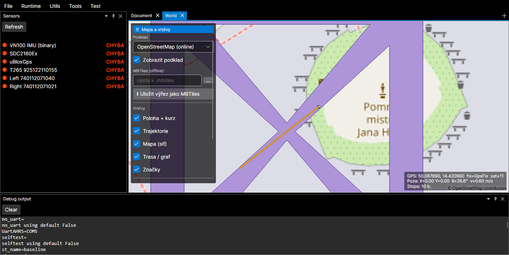
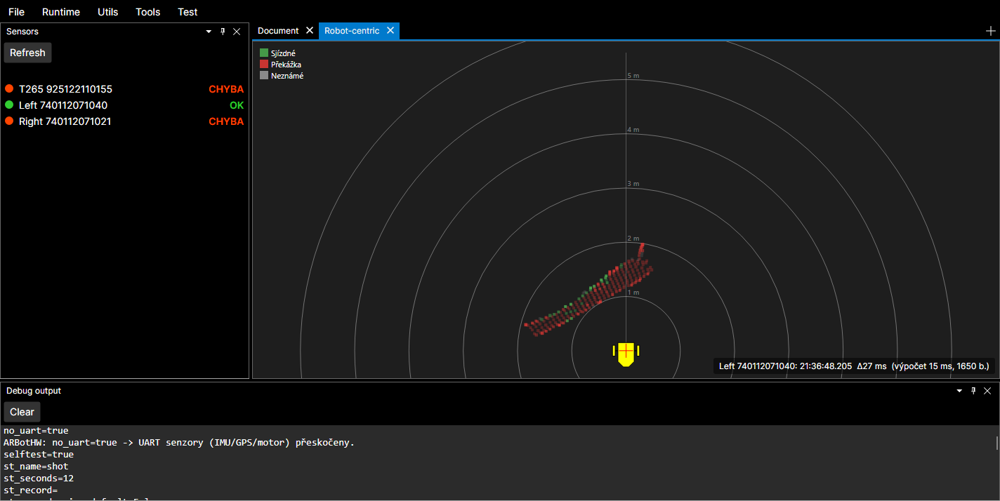
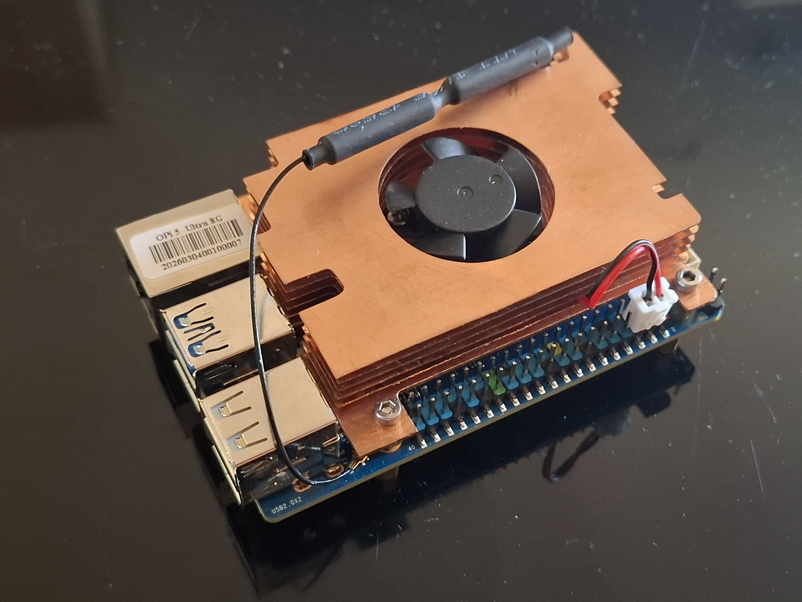
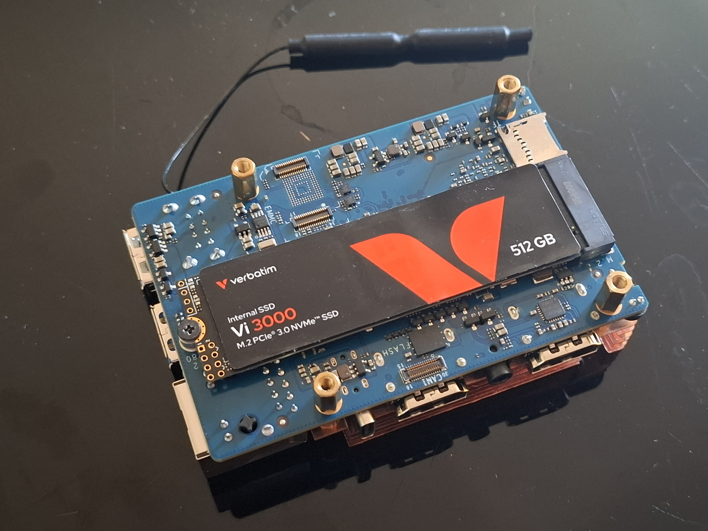

# DevLog — deníček vývoje

Chronologický **záznam postupu vývoje den po dni** — stručné shrnutí, *co* se ten den dělalo,
*proč* a *v jakém stavu* to skončilo. Slouží jako souvislý příběh projektu napříč sezeními
i lidmi (viz [CLAUDE.md](../CLAUDE.md), pravidlo „vše v repozitáři").

**Vztah k [decisions.md](decisions.md):** deník rozhodnutí drží *proč* u netriviálních
rozhodnutí (trvalé odůvodnění). DevLog drží *časovou osu* — co se který den udělalo, na čem se
pokračuje, co je otevřené. **Neduplikuj** — když den přinesl zásadní rozhodnutí, shrň ho jednou
větou a **odkaž** do `decisions.md`; detaily domény odkaž do příslušného `doc/*.md`.

## Jak psát záznamy (pravidla)

- **Jeden nadpis `## RRRR-MM-DD` na den práce.** Absolutní datum (ne „včera"). **Nejnovější nahoru**
  (nad tuto sekci s pravidly to nepatří — přidávej pod čáru níže, na začátek seznamu dnů).
- **Zapisuj na konci pracovního sezení** (nebo když dokončíš smysluplný kus). Když už dnešní
  datum má nadpis, **připiš k němu** další odrážku, nezakládej druhý.
- **Formát dne:** krátký souhrn v odrážkách. Doporučené položky (vynech, co nedává smysl):
  - **Hotovo:** co se dokončilo a ověřilo (build/testy/na zařízení).
  - **Rozpracováno / další krok:** kde se pokračuje příště.
  - **Rozhodnutí:** jedna věta + odkaz do [decisions.md](decisions.md), pokud padlo zásadní rozhodnutí.
  - **Odkazy:** dotčené soubory, `doc/*.md`, commit (`git` hash), issue.
- **Stav ověření uváděj pravdivě** — co je odsimulované vs. co je nutné ověřit na HW (viz CLAUDE.md).
- **Obrázky: nový záznam = nový soubor.** Obrázek v `doc/media/`, na který se odkazuje starší záznam,
  se **nepřepisuje** (pokud o to není výslovně požádáno) — každý den/záznam má vlastní název souboru
  (např. `world-view-road-width.png`, ne znovu `world-view.png`). *Proč:* přepsáním se odkaz pod
  starším datem začne odkazovat na pozdější práci — stalo se, že pod 6. 8. byl `world-view.png`,
  který po úpravě 7. 8. ukazoval šířky cest, jež k 6. 8. neexistovaly. Když jeden obrázek sdílí víc
  záznamů, rozdělit na dva.
- **Čeština**, věcně a stručně (deník, ne esej). Nezapisuj to, co se dá vyčíst z gitu jedním
  příkazem — přidávej *kontext a záměr*, který v diffu není.

> **Pokyn pro Claude / asistenta:** DevLog průběžně **sám udržuj**. Na konci sezení, ve kterém
> vznikla smysluplná změna, přidej (nebo doplň) záznam pro dnešní den dřív, než skončíš. Starší
> sezení mohou být požádána o zpětné doplnění — chybějící dny klidně dorekonstruuj z git historie
> a označ je `(zpětně z gitu)`.

---

## 2026-08-11

- **Occupancy + lokální plánování dotaženo do runtime.** Přidán `LocalNavigator` (vyšší řídicí smyčka
  jako `MessageProcessor` na vlastním vlákně): odebírá `CameraFrame` z `ControlLoop.Output`, pro **každý
  snímek zvlášť** si vyžádá pózu z EKF v čase jeho pořízení, zapíše do gridu, přepočte EDT, naplánuje
  a hotový `IRegulator` atomicky předá do `ControlLoop.Regulator`. Fronta `DropOldest` — když plánovač
  nestíhá, zpracuje se nejnovější snímek. Zapojeno v `ARBotRuntime.WireRun` (+ `BuildColorProjectionResolver`
  pro semantický kanál, `ARBotRuntime.Navigator` pro UI).
- **`AsyncFusionEngine.GetStateAt` vrací `null` mimo okno historie** místo tiché „nejlepší snahy"
  (bazový, až o sekundu starý stav). `ControlLoop` na `null` zastaví (bezpečný stav), `LocalNavigator`
  snímek zahodí. Hranice okna sama je uvnitř — dotaz přesně na `tBase` platí, jinak by první tik
  zbytečně zastavil (odhalil to existující test `OnTick_CallsDrive_AndEmitsDerivedMessages`).
- **Zprávy + vizualizace:** `OccupancyGridMsg` (oba kanály v lokálním pořadí, 2 Hz) a `LocalPlanMsg`
  (cíl, waypointy, stav, odstup, doba výpočtu) — obojí do záznamu, takže ve View jde zpětně vidět, co
  robot věděl a kudy chtěl jet. Vrstvy jsou ve **world pohledu** (viz revize níže), occupancy jako
  rastr (PNG → `MRaster`), plán jako čára + cíl; cíl se zadává **Ctrl + klikem** do mapy.
- **Revize po review — dvě opravy:** (a) vrstvy původně šly do robot-centrického pohledu, kde by se
  world-kotvená akumulovaná mapa s každou zatáčkou **otáčela**; přesunuty do world pohledu, kde leží
  pevně a sedí na podklad. (b) „plán bez dráhy regulátor nepřepisuje" byla **bezpečnostní díra** —
  mapa se mezitím změnila a na rozjeté trase už mohla být překážka, přičemž watchdog dobrzdí až za
  500 ms (+ ~1 m brzdné dráhy). Nově se rozjetá dráha každý cyklus ověřuje proti aktuální mapě a při
  kolizi v dosahu brzdné dráhy se řízení zahodí okamžitě (`AbortedCollision`). Rozhodnutí:
  [decisions.md 2026-08-11](decisions.md).
- **Testy chytily samy sebe:** tři testy navigátoru procházely **naprázdno** — pomocná metoda volala
  `MessageTarget.Stop()`, který frontu trvale uzavře (`TryComplete`), takže druhý „pump" v testu tiše
  nedělal nic a asserty typu „nic se nezměnilo" platily triviálně. Přepsáno na `Session` (start jednou,
  stop až na konci) + počítadla `ProcessedFrames`/`DroppedFrames`, na která se dá deterministicky čekat.
  Ověřeno i opačně: s vypnutou kolizní kontrolou test skutečně padá.
- **Zaznamenán otevřený úkol: Pitch/Roll patří do stavu EKF.** `ControlLoop.Consume` bere Roll/Pitch
  z „posledního došlého" `IMUState`, který **nenese identitu zdroje** (`IMUState` není `INamedMessage`),
  takže při dvou IMU (VN100 + T265) není poznat od kterého vzorek je a mezi tiky to může přeskakovat
  mezi čidly s jinou montáží a kvalitou. Navíc to obchází fúzi — bez gatingu, bez kovariance a bez
  dopředikování do času tiku, zatímco zbytek `RobotState` fúzovaný je. Návrh řešení + kontrola dopadu
  v [ekf-fusion.md](ekf-fusion.md); odkazy doplněny i do [imu-and-frames.md](imu-and-frames.md) a do
  XML komentářů u `ControlLoop.Consume` a `RobotState.Pitch`. **Neopraveno** (je to zásah do stavového
  vektoru filtru).
- **Ověřeno:** `ARBot.Common.Tests` **415/415** pod x64, build ARBot (x64) i HALArmbian (OrangePI) zeleno,
  self-test (`selftest=true st_seconds=8 no_uart=true`) potvrdil, že runtime s novým uzlem čistě
  nastartuje, vykresluje (59 renderů) a skončí. **Kamery nejsou namontované** → celý řetěz je
  odsimulovaný nad syntetickou kamerou; výkon na OrangePI zbývá změřit.
- **Globální oprava typu `Word` → `World`.** Historický překlep se táhl přes celou vizuální/geometrickou
  cestu (`WordPoints`, `WordPointsCount`, `WordObstaclePoints*`, `WordPoint`/`WordPoint2D`,
  `CameraToWordTransform`, `WordToWordTransform`, `rotationWord2Cam`) — 300 výskytů ve 28 souborech
  včetně `NativeFuncs` (`.cpp`/`.hpp`, komentáře v `.asm`/`.S`) a dvou `doc/*.md`. Přejmenováno jen
  tam, kde `Word` znamenalo *svět*; **nedotčeno** zůstalo 16bitové „word" v `MMR`/`IMMR`,
  `dword`/`word ptr` v assembleru, „odvození ve wordu" v `SimpleModel` (Word dokument) a `ThirdParty`.
  Jde o čistě jmenné přejmenování — `ComputeInfo` je `LayoutKind.Sequential` (jména polí ABI neovlivní)
  a binární formáty zpráv (`PathEdgeMsg`) se nemění. Stejným tahem opraven i překlep
  `Trasnformation` → `Transformation` (`IModelState`, `RobotState`, `ModelState`, `EKFModel3State`).
  **Ověřeno:** `ARBot.Common.Tests` 419/419 pod x64, build `ARBot.Common` i `ARBot` (x64) zeleno.

## 2026-08-10

- **Návrh occupancy gridu a lokálního plánování (zatím jen na papíře).** Probrán celý řetěz od
  `CameraFrame` po `RegulatorWayPoint[]`: kartézský grid 5 cm kotvený ve světě (kruhový buffer,
  posun bez rotace), **dva rovnocenné kanály** `LOcc` (z hloubky) + `LRoad` (z RGB) jako log-odds
  ve `sbyte`, distance transform pro odstupy, A\* s cenou = jízdní čas + čas otočení, string-pulling
  na waypointy s `MaxPositionError` = skutečná volná rezerva. Klíčové: „skrz neznámo se smí plánovat,
  ale nesmí se do něj vjet" se neřeší zvláštním pravidlem, ale invariantem *nejeď rychleji, než z čeho
  zastavíš na hranici potvrzeně průjezdného*. Hystereze plánu zamítnuta (držet plán nad starší mapou =
  riziko kolize); stabilita se řeší započtením otočení do ceny. Zadání implementace v novém
  [occupancy-and-local-planning.md](occupancy-and-local-planning.md) (9 fází), rozhodnutí v
  [decisions.md 2026-08-10](decisions.md). **Kód zatím žádný** — příští krok je fáze 1 (`OccupancyGrid`).
- **Implementováno algoritmické jádro occupancy + lokálního plánování** (`Src/ARBot.Common/Occupancy/`):
  `OccupancyGrid` (kruhový buffer, dva log-odds kanály v `sbyte`), `OccupancyIntegrator` (gather zápis
  obou kanálů z `CameraFrame`), `ClearanceField` (exaktní EDT Felzenszwalb–Huttenlocher),
  `LocalPathPlanner` (A\*, string-pulling → `RegulatorWayPoint[]`) + tři konfigurace. `Profile.PrefDist`
  = 0,8 m. `CameraFrame` **FormatVersion 3 → 4** (serializovaný popis projekce `CameraProjectionInfo`).
  Ověřeno: `ARBot.Common.Tests` **399/399** pod x64, build ARBot (x64) i HALArmbian (OrangePI) zeleno.
  Zbývá napojení na runtime (`LocalNavigator`, zprávy, vizualizace, cíl z UI) a **ověření výkonu na HW**.
- **Návrh se při implementaci opravil: azimutové hranice gridu jsou geometricky neproveditelné.**
  U sklopené kamery není sloupec obrazu konstantním azimutem — azimut pozemního bodu se na jednom
  sloupci mění s řádkem skoro o celou šířku buňky, takže jediná hodnota na hranici je systematicky
  špatná. Odhalil to test, který hranice měl ověřit. Místo nich se azimut hledá **projekcí bodu země
  do obrazu a odečtením sloupce**, což mapování z `BuildGrid` invertuje přesně (stejný vzor už
  používá `PathEdgeFinder`). Rozhodnutí: [decisions.md 2026-08-10](decisions.md).
- **Dvě chyby nalezené při implementaci (opraveny):** (a) `CameraProjection.Transform` promítal i body
  **za** kamerou — chybí kontrola `Z > 0`, perspektivní dělení záporným Z převrátí znaménka, takže bod
  4 m za robotem vyšel jako pixel před ním (latentní i pro `PathEdgeFinder`); (b) `CameraFramePool.CopyInto`
  nekopíroval nově přidané pole rámce, takže `Projection` se do záznamu nedostala — pool je na přidávání
  polí do `CameraFrame` systematicky náchylný, stojí za pozornost při každém dalším poli.
- **Oprava `CameraProjection` — záměna přetížení `ToDistort(int,int)` / `(float,float)`.** Dvě chyby
  najednou: (a) konstruktor plnil `toDistortCache` přes int přetížení, které četlo *právě plněnou,
  ještě prázdnou* cache → cache zůstala **celá nulová** a `UnDistort<T>(Image<T>)` vracel konstantní
  obraz; (b) větev „mimo rozsah" volala sama sebe (nekonečná rekurze) a navíc škálovala `Fx/PPx`
  podruhé. Bez živého dopadu — `UnDistort` nikdo mimo `CameraProjection` nevolá a hloubková cesta
  (`camera2DToCamera3DCache`) se plní přímým výpočtem. Nalezeno při přípravě serializace projekce do
  `CameraFrame`. Ověřeno: nové testy proti původnímu kódu selžou, s opravou projdou; `ARBot.Common.Tests`
  pod x64 **328/328**. Odkazy: `Src/ARBot.Common/Coordinates/CameraProjection.cs`,
  `Src/ARBot.Common.Tests/Common/CameraProjectionDistortTest.cs`.

## 2026-08-09

- **PathEdges do `CameraFrame` (oprava zahazovaného výpočtu).** Revize odvozených entit snímku odhalila,
  že `cu.PathEdges(...)` v `D435Camera` výsledek odjakživa zahazovalo a `PathEdgeFinder` (bez call-situ
  v runtime) si hrany počítal duplicitně sám. Výpočet přesunut do `CameraFrameProcessor` (volitelný
  `IComputeUnit`, **bez fallbacku**), výsledek nově v `CameraFrame.PathEdges` a serializuje se s rámcem
  (**FormatVersion 3**, čtecí větve v1/v2 zachovány). `PathEdgeFinder.Process` bere předem spočtené
  `Items[].Edges`; pooly (`CaptureFramePool`/`CameraFramePool`) hrany nulují/předávají referencí jako
  `Grid`. `ARBotRuntime` dává procesoru per-kamera `NativeComputeUnit`. Rozhodnutí + odůvodnění:
  [decisions.md 2026-08-09](decisions.md). Ověřeno: build x64 + OrangePI (HALArmbian) zeleno, testy
  `ARBot.Common.Tests` 326/326 (nové: roundtrip v3 s hranami, čtení v2 bez hran, procesor s fake
  `IComputeUnit` vč. škálování do RGB). **Na HW neověřeno** (výkon nativního `FindPathEdge` na vlákně
  kamery per snímek — sledovat `compute_ms` v traversability CSV).
- **Úklid `D435Camera`: odstraněna kamerová `BackProject` větev** (obě HAL). Mrtvý dev kód — probability
  i hrany počítá `CameraFrameProcessor`; s větví odešla i property `BackProject`, `resizedColorImage`
  a zakomentovaný zbytek `cu.PathEdges` (nová cesta už potvrzena testy). Následně odstraněno i pole `cu`
  a konstruktory s `IComputeUnit` (žádný volající je nepředával; hlavní konstruktor je nyní
  `D435Camera(string sn, CameraSettings rgb)`). Build x64 (ARBot, Record, HAL.Tests) + OrangePI zeleno.

## 2026-08-07

- **Šířka cesty v mapě (proměnná, přes šířku v uzlu).** Do `OsmNav.Graph.Node` přidána `Width` [m] —
  cesta tak může být na začátku/konci různě široká (interpolace podél hrany) a v křižovatce se hrany
  **hladce napojí** (sdílí šířku uzlu). `GraphBuilder.BuildNetwork(..., defaultWidthMeters=2.0)`: šířku
  uzlu spočítá jako **max přes incidentní cesty** (default, nebo z OSM tagu `width`/`est_width` — parsuje
  metry; uzel s vlastním `width` tagem má přednost). Přeneseno do `MapMsg.MapNode.WidthMeters`. Render ve
  World: cesty jako **vyplněné pásy proměnné šířky** (lichoběžník na hranu + kotouč v uzlu), vše
  **sjednoceno** (`MultiPolygon.Union()`) → uniformní průhlednost + jeden vnější obrys; šířka [m] × `1/cos(lat)`
  (Mercator). V panelu pole **„Šířka cesty [m]"** (`DefaultRoadWidthMeters`, `NumericUpDown`) se uplatní
  při načtení. Ověřeno: OsmNav testy 76/76, screenshot (vzorová `.osm`: obvod `width=6`, diagonály default 2
  → viditelný taper + hladké křižovatky). Build x64 zeleno.

  

- **Fix UI: panel „Mapa a vrstvy" přetékal.** Tělo panelu (`ScrollViewer`) mělo pevný `MaxHeight=440`,
  takže na nižším okně obsah přetékal pod mapu bez scrollbaru. Nově se `MaxHeight` odvíjí od výšky mapy
  (`$parent[Grid].Bounds.Height` − chrome, přes `SubtractConverter`) → scrollbar naskočí přesně, když se
  obsah nevejde; jinak se panel roztáhne dle obsahu. Ověřeno screenshotem na zmenšeném okně.
- **Sjednocení převodu domény→zpráva na konvenci `ToLogMessage()`.** `MapMsg` (viz 2026-08-06) původně
  konvertoval statickou tovární metodou `MapMsg.FromRoadNetwork(RoadNetwork)`. Přepsáno na projektovou
  konvenci: konverzi vlastní **doména** — `RoadNetwork.ToLogMessage()` → `MapMsg`; `MapMsg` je zpět čisté
  pasivní DTO (nezná `RoadNetwork`, odpadla závislost `Logs → Graph`). Konvenci jsem zaznamenal do
  [architecture.md](architecture.md) (sekce „Převod doménového stavu na zprávu") a [CLAUDE.md](../CLAUDE.md).
  Build x64 zeleno.

## 2026-08-06

- **World (geo) pohled — nový dokovatelný dokument `WorldViewDocument`.** Analogie robot-centrického
  pohledu, ale v geografickém rámci nad mapovým podkladem. Menu **Tools → World**.

  

  *(Screenshot pořízen bezobslužně režimem `worldshot=true` — otevře World, nakrmí syntetickou
  trajektorií + polohou nad Prahou, hluboko přiblíží na robota a uloží `doc/media/world-view.png`.)*
  - **Hotovo (odsimulováno x64, build zeleno):**
    - Mapový engine **Mapsui** (`Mapsui.Avalonia12` 5.1.0 + `Mapsui.Nts` + `BruTile.MbTiles`) — ověřena
      kompatibilita s Avalonia 12.0.3 (dedikovaný balíček `Mapsui.Avalonia12`).
    - Přepínatelný **podklad**: OSM online / offline MBTiles / žádný. Vypnutí podkladu (nebo zdroj `None`)
      **nevytvoří žádnou dlaždicovou vrstvu** ⇒ na OrangePI žádné pokusy o internet; na ARM (`#if IsARM64`)
      je i výchozí podklad `None`.
    - **Vrstvy** (vypínatelné): poloha+kurz (`GPSState`+`RobotStateMsg`), trajektorie (GPS stopa),
      trasa/graf a značky (`GraphNavigationMsg`). Backpressure „latest-wins" jako u ostatních dokumentů.
    - View hostuje Mapsui `MapControl` v code-behind (mimo design-time), ovládací panel + info v XAML
      (compiled bindings ověřeny buildem).
  - **Poznámka k datům:** `GraphNavigationMsg` se zatím na `Stream` neemituje (OsmNav není napojen na
    řídicí smyčku) → vrstvy trasa/graf/značky jsou připravené, ale prázdné, dokud data nepotečou.
    Poloha + trajektorie fungují živě (GPS + `RobotStateMsg` přes `ControlLoop.EmitDerived`).
  - **Nutno ověřit na zařízení:** Mapsui renderuje přes SkiaSharp — na ARM64 ověřit nativní SkiaSharp assety.
  - **Rozhodnutí:** volba Mapsui (vs. vlastní tile control) — viz [decisions.md](decisions.md).
  - **Odkazy:** `Src/ARBot/ViewModels/WorldViewDocument.cs`, `Src/ARBot/Views/WorldViewDocumentView.axaml(.cs)`,
    menu v `MainWindowViewModel`/`MainWindow.axaml`, [doc/world-view.md](world-view.md).
  - **Doplněk:** ovládací panel je **sbalovací** (přepínač „☰ Mapa a vrstvy", stav `PanelExpanded`), aby
    nebránil pohledu na mapu. Přidán **vestavěný export výřezu do MBTiles** (tlačítko „⬇ Uložit výřez jako
    MBTiles"): stáhne dlaždice OSM aktuálního výřezu z13–19 a zapíše `.mbtiles` (`sqlite-net`), s tvrdým
    stropem počtu dlaždic (5000), throttlingem a User-Agent (OSM tile usage policy). Slouží k rychlému
    pořízení offline podkladu bez externích nástrojů. Odsimulováno x64 (build zeleno); reálné stahování
    a chování okna neověřeno tady (GUI).
  - **Fix (runtime):** `sqlite-net` (z `BruTile.MbTiles`) padal při prvním `SQLiteConnection` na
    `You need to call SQLitePCL.raw.SetProvider()` — bundle balíček se transitivně nepřitáhl. Řešeno
    jednorázovou explicitní inicializací `SQLitePCL.raw.SetProvider(new SQLite3Provider_e_sqlite3())`
    (`EnsureSqliteProvider`) před zápisem exportu i před čtením offline MBTiles. Ověřeno koncově izolovaným
    konzolovým testem s týmiž verzemi balíčků (SQLitePCLRaw 3.0.2). Pozn.: na ARM64 ověřit nativní
    `e_sqlite3` assety na zařízení.
  - **Vizualizace mapy z OsmNav (`MapMsg`):** nová zpráva `MapMsg` (uzly v LLA stupních + hrany) +
    konverze ze sítě (obousměrné hrany se deduplikují na jednu úsečku). Registrována v
    `MessageCatalog`. World dokument má vrstvu **„Mapa (síť)"** (jedna `MultiLineString` featura, efektivní
    i pro velkou síť; přestavuje se jen při nové mapě) a tlačítko **„Načíst OSM mapu…"** (`LoadOsmMapAsync`:
    `.osm` → `OsmXmlReader` → `GraphBuilder` pěší profil → `RoadNetwork` → `MapMsg` → vrstva, parsování na
    pozadí). Souřadnice jsou geografické → kreslí se přímo (bez zarovnávání lokálního rámce). Ověřeno
    screenshotem (worldshot načte malou vzorovou `.osm` síť). OsmNav zatím na Stream `MapMsg` neemituje —
    vrstva ožije i z runtime, až se OsmNav napojí; teď se plní ručním načtením. Panel zvětšen → tělo je
    rolovatelné (ScrollViewer).
  - **Robot jako tvar + hluboký zoom:** robot se v mapě kreslí jako **metrický polygon** ze sdíleného
    `RobotGlyph.OutlineMeters` (místo trojúhelníku) — orotovaný o kurz, převedený do Mercatoru s korekcí
    `1/cos(lat)` (reálná velikost, škáluje se se zoomem). Povoleno **hlubší přiblížení** nad rámec dlaždic
    (`OverrideZoomBounds`, ~z23), protože ~0,5 m robot je při běžném zoomu subpixelový. `RobotGlyph` dostal
    veřejný `OutlineMeters` (jediný zdroj tvaru). Build x64 zeleno, `WorldViewDocument` bez varování.

## 2026-08-04

- **Integrace `Maps/OsmNav` do `ARBot.Common` + testy.** Do projektu nakopírován modul OSM navigace
  z jiného projektu (`Maps/OsmNav/…`: Geo, Graph, Osm, Routing, Navigation, Colider) a jeho testy.
  Zaintegrováno do stávajících projektů (žádný samostatný `.csproj` — SDK globbing).
  - **Hotovo:**
    - Přemapování namespaců podle konvence odvozené od cesty: `OsmNav.Core.Geo/Graph`, `OsmNav.Osm/Routing/
      Navigation` a odchylný `Colider` → `ARBot.Common.Maps.OsmNav.{Geo,Graph,Osm,Routing,Navigation,Colider}`.
    - Zdroj neměl `ImplicitUsings` (cílový projekt je taky nemá) → doplněny explicitní `using` (System,
      Collections.Generic, Linq; +System.IO u `OsmXmlReader`) a `#nullable enable` do souborů s nullable anotacemi.
    - Testy převedeny z **xUnit → NUnit** (74 testů, 22 souborů): `[Fact]→[Test]`, `Assert.Equal(…,N)→
      Assert.That(…, Is.EqualTo(…).Within(1e-N))`, `Assert.Single`, `Contains/DoesNotContain`, `False/Empty/
      InRange/Same/…`. Konverzní část paralelizována přes subagenty s jednotnou převodní tabulkou.
    - **Kolize jmen `Point2D`:** existuje `ARBot.Common.Point2D` v kořenovém namespace; ten podle pravidel
      C# přebíjí `using`-importovaný `…OsmNav.Colider.Point2D` (file-scoped namespace testů je vnořen pod
      `ARBot.Common`). Dočasně vyřešeno přesunem `using …OsmNav.Colider;` **pod** `namespace …;` (viz níže,
      poté zrušeno sloučením typů).
    - Odstraněny přenesené build artefakty (`obj/`, `bin/`).
  - **Ověřeno:** `dotnet build` + `dotnet test` pod `x64` — OsmNav 74/74 prošlo; celá sada 316 passed /
    4 skipped / 0 failed. Čistě algoritmické (bez HW), na zařízení netřeba ověřovat.

- **Sjednocení `Point2D` (float) — provedeno.** Místo dvou planárních bodových typů ponechán sdílený
  `ARBot.Common.Point2D` (float) a OsmNav double-verze smazána. Vyžádalo si to přepis `MotionArc` do
  algebry bod/vektor (`Point2D` pozice + `Vector2D` posun), a to **bez alokací** — `Vector2D` je class,
  tak se posuny/rotace/vzdálenosti počítají v lokálních `double` (helpery `Offset`/`Rotate`/`Hypot`).
  Přesnostní kompromis (float u téměř rovných oblouků, ~mm) je vědomý a funkčně neškodný. Detaily a *proč*
  viz [decisions.md](decisions.md) (záznam 2026-08-04). Kolize jmen tím definitivně zmizela (workaround v testech vrácen).
  `Point2DTests` přepsán na sdílenou algebru. **Ověřeno x64:** OsmNav 76/76, celá sada 318 / 4 skip / 0 fail.

- **Sjednocení `Point2DF` → `Point2D` — provedeno.** Odstraněn druhý float bodový typ (`Point2DF`),
  který sloužil jen jako blittable nosič pro nativní interop (`Depth2XYZ`/`DepthTransform*`/`Segment2`)
  a tabulku `Camera2DToCamera3D`. Bezpečné: identický nativní layout (ABI beze změny), žádné operátory
  ani `.Distance` se nepoužívaly, přesnost stejná (oba float). Upraveny `ICameraProjection`/`CameraProjection`,
  `NativeComputeUnit`, `HALWindows/D435CameraProjection`; `HALArmbian` dědí → beze změny (ARM build netřeba).
  Detaily viz [decisions.md](decisions.md) (2026-08-04). **Ověřeno x64:** Common + HALWindows build zeleno,
  testy 318 / 4 skip / 0 fail (nativní interop testy s `Point2D[]` prošly).

- **Doménová dokumentace OsmNav — hotová.** Přidán [osm-nav.md](osm-nav.md) (mapa kódu + stav integrace +
  shrnutí `Colideru`, který PDF nepokrývá) a odkaz z [CLAUDE.md](../CLAUDE.md) rozcestníku. Dokument
  nedupluje autoritativní [OsmNav-popis.pdf](OsmNav-popis.pdf) (návrh routing/navigation strany) — odkazuje
  na něj a doplňuje pohled z kódu (klikací odkazy na typy, konvence, otevřené úkoly).
  - **Další krok:** začlenění do řídicí smyčky (`ControlLoop`): zdroj polohy → `Navigator` → regulátor
    ([path-following.md](path-following.md)) + `Colider` jako brzda; zdroj `.osm` dat a `Obstacle` seznamu.
  - **Odkazy:** `Src/ARBot.Common/Maps/OsmNav/`, `Src/ARBot.Common.Tests/OsmNav.Tests/`, `doc/osm-nav.md`.

- **Sjednocení geo: OsmNav `GeoPoint`/`GeoMath` → `LLA` — provedeno.** Odstraněn vlastní geotyp OsmNav
  (stupně, value struct) ve prospěch systémového `LLA` (radiány), který produkuje lokalizace (GPS/EKF) a
  používají mapy/`ARBotState` — čistý šev pro pozdější napojení na řídicí smyčku. Haversine → `GreatCircle.Distance`
  (numericky identické), projekce na úsek → **double** equirectangular (`GeoReference.ToLocal` vrací float
  `Point2D` → shazovalo oracle testy, proto vlastní double; finálně jako `LLA.ProjectOntoSegment`).
  Přidán `LLA.FromDegrees`. Dotčeno 6 zdrojů + testy. Detaily viz [decisions.md](decisions.md) (2026-08-04).
  **Ověřeno x64:** OsmNav 76/76, celá sada 321 / 4 skip / 0 fail; HALWindows build zeleno.

- **`ProjectOntoSegment` přesunut do `LLA` + názvosloví geometrie sjednoceno.** Na přání „věci na jednom
  místě" projekce přesunuta z `GeoSegment` (smazán) do `LLA` (instanční, vedle `Distance`). Při té
  příležitosti opraven matoucí název `Intersect` = *projekce* (ne průsečík): `MapWay.Intersect` a
  `NavigationBase.Intersect` → `ProjectOntoLine`; `Intersection` (Line2D/LineSegment2D = skutečný průsečík)
  a `Graph.Intersect` (jiná doména) beze změny. Konvence: `ProjectOntoLine`/`ProjectOntoSegment` vs
  `Intersection`. Detaily [decisions.md](decisions.md) (2026-08-04). **Ověřeno x64:** 321 / 4 skip / 0 fail, `ARBot` build zeleno.

- **Doplněn skalární operátor `*` do `ARBot.Common.Point2D`** (float i double, komutativně — parity
  s existujícím `/`; byl i v původním OsmNav `Point2D`). `MotionArc` **záměrně zůstává** na `double`
  mezivýpočtech (jedno zaokrouhlení na float až při uložení pozice → přesnější u `d − Radius`), nový
  operátor přes něj tedy nevede; je k dispozici pro obecné použití. Testy v `Common/Point2D.cs` /
  `Tests/Point2DTest.cs`. **Ověřeno x64:** 321 / 4 skip / 0 fail.

## 2026-08-02

- **Nový regulátor sledování dráhy (Fáze 1–5 z 6).** Návrh přediskutován do detailu, pak realizace.
  Cíl: vést robota **dráhou z waypointů**, projet každý uzel v rámci `ε` (`MaxPositionError`) **max.
  rychlostí** (bez zastavování v uzlech). Architektura: plán (geometrie rohů + brzdná obálka) + exekuce
  (feedforward + přeplánování z `IModelState`), **žádná proporcionální steering smyčka** (ta v tomto
  setupu kmitá).
  - **Hotovo (build + 237 testů zeleno pod x64):**
    - Fáze 1 — `IRegulator.Control` narovnán na jeden waypoint (pryč `MaxWayPoints`/pole), přesná
      dokumentace dnešního chování. Staré regulátory beze změny.
    - Fáze 2 — `IMotionProfile` + `TrapezoidMotionProfile` (matematika z `Regulator`), 5 **paritních** testů.
    - Fáze 3 — `IPathPlanner.Plan` → `PathResult`: rohy kruhovým obloukem `R=ε·cos(θ/2)/(1−cos(θ/2))`
      (osekání na ½ úseku), vrcholové stropy, **zpětná brzdná obálka** (dopředný průchod se nepočítá).
      9 testů vč. příkladu 2 m + 10 cm.
    - Fáze 4 — `PathResult.Control`: lokalizace + lookahead `L_d=τ_look·v` + zásah přes profil. 4 **simulační**
      testy (přímka, 90° roh, start natočený pryč, S-dráha) — průjezd v ε, dojezd/stop, nekmitá.
    - Fáze 5 — `ControlLoop.Path` jako settable property (atomická výměna vyšší smyčkou), watchdog
      (`Profile.PathControlTimeOut` → dobrzdění po poslední trase), `null` = stání. `ARBotRuntime` + testy
      přepnuty; +2 testy (stání, watchdog).
  - **Rozhodnutí:** feedforward místo pure-pursuit, oblouk místo klotoidy, jen zpětná obálka, `τ_look≈3·Ts`,
    property-based path swap — viz [decisions.md](decisions.md) (2026-08-02).
  - **Další krok:** Fáze 6 (tento zápis + decisions + odkaz z CLAUDE.md — hotovo). **Otevřené / čeká na HW:**
    ověření dynamiky motorů, sweep `τ_look ∈ {0,2;0,3;0,5 s}` na record/replay + selftestu, a **vyšší smyčka
    (plánovač trasy z mapy/OSM)**, která bude `ControlLoop.Path` reálně plnit — zatím robot stojí.
  - **Odkazy:** [path-following.md](path-following.md), `Src/ARBot.Common/Regulators/*`,
    `Src/ARBot.Common/Runtime/ControlLoop.cs`, `Src/ARBot.Common/Configuration/Profile.cs`.

- **Sjednocení regulátorů (navazuje).** `IRegulator` splynul s `IPathController` (jedno rozhraní
  `Control(IModelState)+IsFinished`, cíl drží regulátor uvnitř). `PointRegulator` (bodový, přes
  `IMotionProfile`) **nahradil** `Regulator` i `SimplRegulator` — ty **smazány** po důkazu parity;
  vznikl `SqrtMotionProfile` (odmocninový zákon konzistentně). `ControlLoop.Path` → `ControlLoop.Regulator`.
  Nižší smyčka teď transparentně reguluje na bod (`PointRegulator`) i na dráhu (`PathResult`). Build + 242
  testů zeleno (parita překlopena na golden/closed-form). Viz [decisions.md](decisions.md) (2026-08-02, sjednocení).

## 2026-08-01

- **Robot-centrický pohled: konec překrývajících se buněk.** Buňky polárního gridu se v
  [`RobotCentricControl`](../Src/ARBot/Views/Controls/RobotCentricControl.cs) kreslily jako **čtverec
  u těžiště** se stranou = radiální tloušťka prstence → u robota se překrývaly (šířka čtverce ≥ 5 cm
  je u malých vzdáleností mnohem víc než azimutová rozteč sousedních buněk) a přes vnitřní hranici
  do předchozího prstence (těžiště je posunuté k bližší hraně). **Datový překryv to nebyl** — grid je
  čistá partice. **Hotovo:** buňka se teď kreslí jako svůj skutečný půdorys = **mezikruhová výseč**
  (radiální pásmo z `RadialEdges` × azimutový slot), výseče se díky sdíleným hranicím dokonale skládají.
  Azimutové úhly grid neukládá → renderer je **rekonstruuje z ložisek buněk** (bez změny datového modelu
  / serializace, funguje i ve View/replay); fallback na čtverce při málo datech. Ověřeno buildem (x64,
  clean compile); vizuální kontrola na živém běhu čeká (app v době úpravy běžela). Detail v
  [traversability-grid.md](traversability-grid.md#vizualizace-robot-centrický-pohled). Rozhodnutí
  renderer-only rekonstrukce vs. ukládat `AzimuthEdges` do gridu — zvolena rekonstrukce (menší zásah).
- **Analýza + rozhodnutí (bez kódu):** root-cause GC pauz (200–455 ms, ~13 % snímků) — porovnáním se
  starým **ARBot2** (WPF/.NET 4.8) zjištěno, že nejde o framework ani recyklaci bufferů (starý app taky
  `new`oval per snímek), ale o **architekturu**: starý byl pull + synchronní + jeden živý frame + málo
  vláken (nízký churn), nový je push async fan-out + frame v mnoha frontách + hodně vláken (vysoký
  dlouho žijící LOH churn).
- **Rozhodnutí (návrh):** přejít na **synchronní vlákno-per-kamera** vizuální cestu — `ICameraFrameProcessor`
  volaný v kameře, grid v `CameraFrame`, kamery pullované `ControlLoop`em, **poolované buffery + kopie
  s release** (klíč: GC tlak ≠ memcpy — zisk je v recyklaci, ne ve vyhýbání se kopiím; robot vždy
  nahrává + UI = dva async odběratelé, každý má vlastní pool kopií). → [decisions.md 2026-08-01](decisions.md).
- **Další krok:** implementace inkrementálně dle sekvence v rozhodnutí (1: `ICameraFrameProcessor` + grid
  v `CameraFrame`; 2: konzumenti na `CameraFrame.Grid`; 3: pull přes `ControlLoop`; 4: pooling + kopie).
- **Kroky 1–2 hotové** (čistý agent) — `ICameraFrameProcessor`/`CameraFrameProcessor`, grid v `CameraFrame`
  (v2), konzumenti přepnutí. Změřeno na HW: **`wait` avg 37→13 ms** (mizí fronta), `compute` teď měří
  BackProject+grid dohromady (~51 ms p50), **GC špičky trvají** (max ~494 ms) — cíl kroku 4 (pooling).
  Otevřeno: udělat **BackProject volitelný**, pokud je jen pro viz (~25 ms/snímek). Detaily v
  [plan-camera-vision-refactor.md](plan-camera-vision-refactor.md).
- **Hotovo (krok 1+2 dle [plan-camera-vision-refactor.md](plan-camera-vision-refactor.md)):** grid je nyní
  součástí `CameraFrame` (`PolarTraversabilityGrid`, bez dědičnosti `Message`); `CameraFrame` FormatVersion
  **1→2** (grid serializován uvnitř rámce, `FromData` větví v1=bez gridu / v2=s gridem — staré `.rec` čitelné).
  Nový `ICameraFrameProcessor`/`CameraFrameProcessor` počítá **synchronně na vlákně kamery** probability
  (`ImageProbability`) i polární grid — jádro `BuildGrid` přeneseno 1:1 z `DepthTraversabilityProcessor`
  (včetně nativní SIMD cesty). `D435Camera` (obě platformy) dostala `FrameProcessor` a volá ho v
  `GetMeasurement`. `WireRun`: staré async stupně `BackProjectProcessor` + `DepthTraversabilityProcessor`
  **vyřazeny z grafu**, procesor nastaven kamerám; konzumenti (`RobotCentricDocument`/`Control`,
  `ImageDocument`) čtou `frame.Grid`. `PolarTraversabilityGridMsg` + `DepthTraversabilityProcessor`
  **smazány** (logika ověřena přenesenými testy `CameraFrameProcessorTest` vč. `NativeTransform_MatchesManaged`),
  odebrán z `MessageCatalog`. `BackProjectProcessor` **ponechán** (používá `ARBot.Record`). Diagnostický CSV
  přesunut do procesoru, per-kamera (`traversability-timing-<kamera>.csv`).
- **Ověřeno:** build x64 (app + oba testovací projekty) i OrangePI (HALArmbian) zelený; testy **222** zelených
  (Common 210/4 skip, HAL 12/1 skip). **Neověřeno na HW** (agent nemá kameru) — vizuální shoda gridu/overlaye
  v UI a latence v `logs/*.csv` je **HW brána** dle plánu (kroky 3–4 = pull + pooling ještě nezačaty).
- **Rozhodnutí (od člověka):** **BackProject (probability) je vstup pro řízení robota** → počítá se vždy,
  nedělá se z něj volitelný/on-demand výpočet (uzavírá otevřenou otázku „jen viz vs. řízení"). →
  [decisions.md 2026-08-01](decisions.md).
- **Krok 3 hotový** (dle [plan-camera-vision-refactor.md](plan-camera-vision-refactor.md)): kamery **vyňaty**
  z grafu (`SensorMessageSource`); `ControlLoop` je na tiku **pulluje** přes nové rozhraní `ICameraPullSource`
  (Common, drží směr závislostí — implementaci `HwCameraPullSource` naplní `ARBotRuntime` čtením
  `ARBotHW.Current` za běhu) a **celý `CameraFrame`** (raw + grid) forwardne na `Stream` pro záznam/UI.
  Pull vrací null, když není nový snímek. Nový test `ControlLoopTests.OnTick_PullsCameras_AndForwardsFrameToOutput`.
- **Krok 4 hotový** (kontrakt potvrzen člověkem — varianta „per-consumer pool + release"): `CaptureFramePool`
  (triple-buffer v obou `D435Camera` — recyklované RGB/Depth buffery místo `new` per grab; `CameraFrameProcessor`
  recykluje probability i resize buffer, prob je tak per-slot triple-bufferovaná). Každý async odběratel
  (`RecordingTarget`, `ImageDocument`) má **vlastní `CameraFramePool`**: v `Post()` synchronně memcpy do
  poolované kopie (grid předán referencí — je per-snímek immutable), po zpracování `Release`; vyschnutí poolu =
  best-effort drop. `RobotCentricDocument` kopii nedělá (čte jen grid). Unit testy `CameraFramePoolTest`.
- **Ověřeno:** build **x64 i OrangePI** (app) zelený; testy **217** zelených (Common + 6 nových pool/pull testů).
  **HW ověření pod zátěží stále čeká** (agent nemá kameru) — **klíčová brána kroku 4**: `logs/traversability-
  timing-*.csv` bez periodických 200–455 ms špiček (churn ~0) a integrita záznamu ve View (obraz i grid bez
  tearingu). Dokud neproběhne, je krok 4 „hotový v kódu", ne „ověřený".
- **Root-cause 200 ms záseků NALEZEN na HW** (uživatel pustil sw, špičky v `compute_ms` přetrvaly: max 345 ms,
  ~11 % snímků >100 ms; `wait_ms` malý ~13 ms → pull funguje). Pooling kamerových bufferů (krok 4) nepomohl,
  protože **churn byl jinde**: **`MessageWriter.Write` serializoval KAŽDOU zprávu přes novou `MemoryStream` +
  `ms.ToArray()`** — u `CameraFrame` (~1,8 MB nekomprimované) to bylo několik **LOH** alokací na snímek
  (~90 MB/s při 16 fps) na vlákně recorderu → periodická blokující gen2 GC pauzující i vlákno kamery uprostřed
  `Process`. **Fix:** `MessageWriter` serializuje do **jedné znovupoužité `MemoryStream`** a zapisuje přímo
  z `GetBuffer()` (0 alokací/zprávu; wire formát beze změny — 29 record/replay testů zelených). Navíc
  doplněno **poolování transientů v `BuildGrid`** (`acc` ~79 KB, `dev`, `List` bodů roviny) — sekundární
  churn na vlákně kamery. **Ponaučení:** pooling image bufferů je zbytečný, dokud serializace re-alokuje
  celý snímek; **serializace byla dominantní zdroj (40×).** → [decisions.md 2026-08-01](decisions.md).
- **Ověřeno po fixu:** build x64 i OrangePI zelený, testy **217** zelené. **Znovu ověřit na HW pod zátěží**
  (`logs/*.csv`): očekáváme zmizení periodických >100 ms špiček v `compute_ms`.
- **DEFINITIVNÍ DIAGNÓZA na HW (GC instrumentace).** Do diagnostického CSV doplněny sloupce
  `cam_alloc_kb` (alokace vlákna kamery v `Process`), `proc_alloc_kb` (všechna vlákna) a `gen2`
  (proběhla-li gen2 GC). Čistý běh (1665 snímků, UART senzory vypnuté, robot-centric otevřené, bez
  záznamu, bez interakce): **`compute_avg` 40,5 ms, gen2 = 0 na VŠECH snímcích, jen 0,24 % >100 ms
  (vše warmup seq 0).** `cam_alloc_kb` po warmupu **58 KB/snímek** (jen `grid.Cells`, gen0) — pooling
  probability potvrzen (358→58 KB od seq 3). **Ustálená cesta kamera→procesor je čistá.**
- **Root-cause záseků = dva tranzientní přispěvatelé, ne ustálený churn:** (1) **odpojené UART senzory**
  (IMU/GPS/motor) házely výjimky v těsné smyčce — `Debug.WriteLine(ex.ToString())` alokoval stack-trace
  string na jejich vláknech → periodický gen2 (uživatel potvrdil: vypnutí zkrátilo záseky, `wait` 14→1,2 ms);
  (2) vyšší alokační tlak před poolingem (acc 79 KB + prob 300 KB/snímek) tlačil gen2 — teď poolnuto.
- **Zpevnění (produkce):** `SensorBase` error smyčka — exponenciální backoff (mrtvý senzor polluje ~1×/s
  místo 50×/s) + throttlované logování `ex.Message` (ne `ex.ToString()`) → odpojený/spadlý senzor za běhu
  už nealokuje ani nežere CPU. `RobotCentricControl` cachuje štětce (bylo až 1650 `new SolidColorBrush`/
  render) + pera. Build+testy zelené.
- **Stav:** ustálený churn cíleně vyřešen (gen2=0). Zbývá 58 KB/snímek (`grid.Cells`, gen0, žádná gen2) —
  ponecháno; poolování gridu by vyžadovalo kopii u konzumentů za marginální zisk.
- **Self-test harness** (návrh uživatele) — bezobslužné, reprodukovatelné měření výkonu: parametr
  `selftest=true` → aplikace sama otevře zadaná okna, pustí Run, po `st_seconds` zastaví, zapíše souhrn
  z CSV do `logs/selftest-result.txt` a ukončí se. Parametrizovatelné varianty (`st_record`, `st_images`,
  `st_robot`, `no_uart`) → A/B měření bez ruční obsluhy. Kód: `Src/ARBot/Diagnostics/SelfTest.cs`,
  `MainWindowViewModel.SelfTest.cs`; přepínač `no_uart` v `ARBotHW`. Návod + doporučené varianty:
  [selftest.md](selftest.md). Build x64 i OrangePI zelený.
- **Diagnostiku lze vypnout** parametrem `diag=false` (soutěž) — vypne CSV i GC měření na vlákně kamery
  (`ARBotRuntime` nepředá cestu CSV; `CameraFrameProcessor` pak neměří `DateTime.Now`/GC).
- **Změřeno agentem (self-test, 5 variant à 20 s, `no_uart` kde uvedeno):** `compute avg` 19–23 ms,
  **>100 ms = 0 % ve VŠECH variantách**, max ≤ 48 ms — periodické 200–1098 ms záseky **pryč**. `gen2`
  během Process: baseline/record/uart = **1** (⇒ fix `MessageWriter` i zpevnění `SensorBase` potvrzeny),
  **images = 12, full = 52** — jediný zbývající churn je `WriteableBitmap` per snímek v `ImageDocument`
  (zvýší gen2 při otevřeném okně Images, ale zatím **bez** >100 ms špičky). Další optimalizace (nepovinná):
  recyklace `WriteableBitmap` (TODO ve `Views/README.md`).
- **Ověřeno počítadly (ne jen analýza):** doplněna diag počítadla UI (`ImageDocument.DiagFramesIngested/
  DiagBitmapsCreated`, `RobotCentricControl.DiagRenders`) do souhrnu self-testu. Potvrzeno: v `images`
  variantě `ImageDocument` reálně tvořil ~397 `WriteableBitmap`/15 s → to je zdroj gen2. Zároveň odhaleno,
  že churnoval **i jako neviditelný tab na pozadí** (VM `Ingest` neběží přes Avalonia `Control.Render`,
  takže není frameworkem gatován viditelností).
- **Self-test umí screenshot + video** (návrh uživatele) — pro ilustrace do deníčku. `st_shot=true`
  vyrenderuje hlavní okno do PNG (`ScreenCapture` přes Avalonia `RenderTargetBitmap`); `st_video=true`
  nahraje krátké video. **Video pipeline:** je-li k dispozici **ffmpeg** (auto-detekce PATH → Shotcut →
  winget → override), vytvoří se **komprimovaný GIF** (palettegen, ~117 KB) nebo **mp4**
  (`st_video_format=mp4`, ~34 KB) — obojí ověřeno vytažením snímku zpět. Bez ffmpeg fallback na
  **vestavěný `GifWriter`** (nekomprimovaný LZW s periodickým Clear kódem — korektní, jen velký;
  ověřeno přes GDI+). Ukázka (robot-centrický grid s živými daty z levé kamery):

  

- **#1 hotové — gate renderu na viditelnost tabu.** `DocumentBase.IsActive` (nastavuje `DockFactory`
  z `ActiveDockableChanged` = aktivní tab `DocumentDock`); `ImageDocument` si **nejnovější vždy pamatuje**
  (`pending`, poolovaná kopie, 0 GC), ale **renderuje jen když je aktivní**; při zviditelnění
  (`OnActiveChanged`) hned vyrenderuje zapamatovaný snímek. **Změřeno:** Images na pozadí = **0 bitmap,
  gen2=1** (dřív 397/23); Images aktivní = renderuje (387 bitmap) živě i on-show. `RobotCentric` gate
  nepotřebuje (jeho render běží přes `Control.Render`, Avalonia ho gatuje sama). Self-test má nový přepínač
  `st_images_active`. Build x64 i OrangePI + 217 testů zelené.

## 2026-07-30

- **Hotovo:** polární grid sjízdnosti **zapojen do runtime pipeline** — v **Run** ho počítá graf
  (`DepthTraversabilityProcessor`; projekce se sestavuje **líně z připojené kamery** +
  `Profile.Left/RightCameraTransform`), ve **View** se grid jen **přehrává** ze záznamu (nepřepočítává).
  Build + testy zelené (x64, 206/4 skip).
- **Hotovo:** robot-centrická **vizualizace** — dokument přejmenován z `Traversability*` na obecný
  `RobotCentricDocument`/`RobotCentricControl` (plátno pro budoucí robot-centrické vrstvy — RGB
  sjízdnost, okraje vozovky); tvar robotu vytažen do sdíleného `RobotGlyph` (parametr orientace →
  použitelný i pro world view). Ptačí pohled: robot dole, vpřed nahoru, buňky dle třídy + důvěra.
- **Hotovo:** **overlay gridu přes depth** v `ImageDocument` jako vrstva `"<kamera>/Traversability"`
  (rasterizace z `PolarTraversabilityGridMsg` do velikosti depth, per-pixel alfa) — bez samostatného
  obrázku tříd v záznamu, zarovnání přes `ColumnsPerCell` × `RadialEdge.Row`.
- **Hotovo:** `RadialEdges` rozšířeny z `float` na `RadialEdge {Range, Row}` (řádek depth obrazu, kde
  se hranice láme) → umožní kreslit overlay bez zpětné projekce. Drobná optimalizace: `RadialBin`
  půlením intervalu místo lineárně (volá se na každý pixel).
- **Ověřeno na živé kameře** (kamera připojená): overlay i robot-centrický pohled už zobrazují data;
  prahy klasifikace, šumový model a přesnost zarovnání řádků se teprve doladí.
- **Ladění dle zpětné vazby z HW:** oprava orientace robotu v `RobotGlyph` (WPF Y↓ → math Y↑, byl
  vzhůru nohama); vizualizace ukazují **stáří zprávy** (Δ = teď − `TimeStamp`) pro diagnostiku latence;
  vstup `DepthTraversabilityProcessor` přepnut na **`DropOldest`/kap. 2** (neomezená fronta rostla a
  grid se zpožďoval za realtime — best-effort viz stupeň má počítat vždy nejnovější snímek).
- **Ladění #2:** robot je dozadu delší než dopředu (počátek = osa otáčení) → `RobotGlyph` publikuje
  `Forward/Rear/SideExtentMeters`, `RobotCentricControl` nechá dole místo na zadní dosah (nebyl vidět
  celý). Přidána diagnostika latence: `PolarTraversabilityGridMsg.ComputeMs` (NEserializovaná doba
  `BuildGrid`) zobrazená vedle Δ → k odlišení vlastního výpočtu od čekání ve frontě / GC pauz.
  Bimodální Δ (30↔500 ms) ukazuje na **GC pauzy** z alokací per-snímek, ne na TPL (stupně běží na
  dedikovaných `LongRunning` vláknech, ne na threadpoolu) — potvrdit `ComputeMs` a pak řešit alokace.
  Čísla na obrazovce skáčou a nejdou spárovat → `DepthTraversabilityProcessor` navíc píše **CSV log**
  `logs/traversability-timing.csv` (sloupce `seq;capture;camera;wait_ms;compute_ms;cells`; `wait` =
  pořízení→start výpočtu, tj. fronta/hopy/GC) — `logs/` je už v `.gitignore`.
- **Diagnóza z CSV (448 vzorků, 1 kamera):** `compute` podlaha ~16–50 ms (75 % < 50 ms), ale ~8 %
  snímků špička 200–455 ms s NÍZKÝM `wait` → pauza padá dovnitř výpočtu; špičky periodické ~každých 5 s
  = **Gen2/LOH GC** z per-snímek alokací (image buffery kamer ~1,5 MB/snímek → LOH). Není to TPL.
- **Experiment Server GC — ZAMÍTNUT:** zkusil jsem `ServerGarbageCollection=true` (x64). Data z CSV to
  **zhoršila** (compute avg 50→66 ms, >100 ms z 8 % na 20 %, bimodální rozdělení se rozmazalo do
  spojitého ocasu 0–500 ms) — background GC vlákna při mnoha stupních pipeline přesytila CPU, výpočetní
  vlákno je častěji odscheduleno (wall-clock compute roste). Vráceno na **Workstation + Concurrent**
  (default). Trvalé řešení špiček je **snížit alokace** (pooling image bufferů v driveru kamery), ne
  měnit GC režim; pro headroom na 2 kamery navíc nativní depth→pointcloud (`DepthTransform2Impl`).
- **Krok A — nativní depth→pointcloud (hotovo):** `PolarGridConfig.UseNativeTransform` = `DepthTransform2Impl`
  (SIMD) se **znovupoužitým** `Point4D[]` bufferem místo managed per-pixel transformu (žádná alokace/snímek).
  Z asm ověřeno: **mm→m interně** + výstup v **opačném pořadí** (`cloud[len-1-p]`) — ošetřeno indexem.
  **Ekvivalence managed↔native** ověřena testem (`BuildGrid_NativeTransform_MatchesManaged`); v runtime
  zapnuto, managed cesta ponechána jako fallback. Zbývá: pooling bufferů kamer (krok B) na GC špičky.
- **Dopad A (změřeno z CSV):** CPU cena výpočtu klesla ~3× — `compute_ms` **min 16→5 ms**, mode <30 ms,
  205 snímků <10 ms (managed nikdy pod 16). Ale **wall-clock avg/ocas beze změny** (~52 ms avg, ~13 %
  >100 ms, max 483) — dominuje **GC** (špičky mají vysoký `compute`, NÍZKÝ `wait` → pauza padá dovnitř
  výpočtu). A tedy dal headroom (2 kamery), latenční ocas spraví až krok B (alokace bufferů kamer).
- **Rozhodnutí:** View = jen přehrávání gridu (přepočet ze záznamu odložen — živé intrinsics se
  nezaznamenávají), Run = živé intrinsics. → [decisions.md 2026-07-29](decisions.md) (doplněno 2026-07-30).
- **Zavedení DevLogu** — tenhle deníček + pravidla + odkaz z CLAUDE.md.
- **Odkazy:** `Src/ARBot/Robot/ARBotRuntime.cs`, `Src/ARBot/ViewModels/{RobotCentricDocument,ImageDocument}.cs`,
  `Src/ARBot/Views/Controls/{RobotCentricControl,RobotGlyph}.cs`, `Src/ARBot/Views/RobotCentricDocumentView.axaml*`,
  `Src/ARBot.Common/Vision/{PolarTraversabilityGridMsg,PolarGridConfig,DepthTraversabilityProcessor}.cs`,
  [doc/traversability-grid.md](traversability-grid.md).

- **Hotovo (zapojení prezentace senzorů):** dokumenty GPS/motory/kamera zapojeny do panelu Sensors
  přes `CreateSensorDocument` (`MainWindowViewModel`), aktualizován
  [Views/README.md](../Src/ARBot/Views/README.md). (Jediné dnešní kusy dané senzorové práce —
  `MainWindowViewModel`+`README` mají mtime 07-30; zbytek vznikl dřív, viz níže.)
- **Oprava datace DevLogu:** senzorová/HAL práce byla nejdřív omylem zapsaná celá pod 07-30;
  **zpětně rozdělena k reálným datům podle časů změn souborů** — 07-12/13 (Armbian porty + prezentace
  senzorů, commit `16490f9`), 07-21 (D435 hot-plug), 07-24 (senzory v `ARBotHW`), 07-25 (dokumenty).
- **Ověření (celé senzorové práce):** buildy x64 i OrangePI zelené; na HW zbývá ověřit hot-plug,
  načtení net40 `VectorNav.dll` na ARM64, podporu T265 v nativní librealsense 2.53 (T265 v 2.50+
  odebrán — riziko), rovnoměrnost GPS a `System.IO.Ports` na Armbianu.

## 2026-07-29 _(zpětně z gitu)_

- **Hotovo:** návrh a implementace **polárního gridu sjízdnosti** z hloubkové kamery
  (`DepthTraversabilityProcessor`: depth → point cloud → polární grid → `PolarTraversabilityGridMsg`),
  robot-centrický a per-kamera; geometrie + klasifikace ověřeny syntetickým testem.
- **Rozhodnutí:** klíčová návrhová rozhodnutí (robot-centrický, per-kamera, azimut = konstantní
  počet sloupců, radiální Δr, confidence + edge range). → [decisions.md 2026-07-29](decisions.md).
- **Odkazy:** `Src/ARBot.Common/Vision/{DepthTraversabilityProcessor,PolarTraversabilityGridMsg,PolarGridConfig}.cs`,
  `Src/ARBot.Common.Tests/Vision/`, [doc/traversability-grid.md](traversability-grid.md).

## 2026-07-28 _(odhad — práce v pracovním stromu, bez vlastního commitu; HEAD na `4c69ea8`)_

- **Hotovo (record/replay runtime dotažen do Run+View):** `ARBotRuntime` (jeden veřejný `Stream`,
  režimy Run/View, `Start/Stop`), `RoleRouter`+`RelaySource` (router přes `IPrimaryMessage`), přesun
  `IMotorControl` → `ARBot.Common.Devices` + `DummyMotors`, **thread-safe `AsyncFusionEngine`**
  (fúze i řízení běží paralelně, žádná umělá serializace), `RobotState : IModelState`,
  **best-effort záznam** (per-typ drop v `Post`, `T_out`/`Name` v `MessageIndex`), `IScheduler`+
  `ControlLoop` (řízení jako periodický uzel; fúze přestala tikat — `PumpTicks` odstraněn),
  `FileMessageSource.SeekTo` (index-aware) + migrace `ImageDocument` na odběr `Stream`u.
  Build x64 + testy zelené. Detail v [doc/record-replay.md](record-replay.md).
- **Rozhodnutí:** řízení běží **nezávisle na měřeních** (periodická smyčka nad schedulerem vzorkuje
  odhad EKF přes `GetStateAt(t_k)`, funguje i při výpadku měření); fúze jen agreguje/predikuje.
- **Hotovo (dokumentace):** [doc/record-replay.md](record-replay.md) rozšířen o **„Implementační
  kontrakt"** (skeletony API, rozhodnutí, gotchas, pořadí kroků, výchozí volby); rozsah **Run+View**,
  **Simulate odložen** s hookem `T_in`+`T_out` v záznamu. Návrh prověřen opakovaným review z čistého kontextu.
- **Oprava repa:** `.gitignore` omylem ignoroval **zdrojový** `Src/ARBot.Common/Logs/` (VS pravidlo
  `[Ll]ogs/`) → celý message model (`Message`, `Blob`, `RobotStateMsg`, …) nebyl trackovaný; přidána
  negace `!Src/ARBot.Common/Logs/` a soubory přidány do gitu (build z čistého klonu teď projde).
- **Hotovo (record/replay UI dotažení):** `ImageDocument` — **oddělený overlay pro levou a pravou
  kameru** (`LeftOverlay*`/`RightOverlay*`, vlastní výběr vrstvy i info; průhlednost sdílená).
- **Hotovo:** **ReplayNavTool** — během Play se aktualizuje slider i textová pozice (poll `Cursor`
  `DispatcherTimer`em + napojen `Completed`); přidán **virtualizovaný grid** záznamů z indexu
  (Seq / typ / jméno / čas), klik na řádek = seek, výběr synchronní se sliderem (`ScrollIntoView`
  sleduje přehrávání). `IndexEntry` pole → **auto-properties** (binding přímo do gridu bez VM řádků).
- **Hotovo:** stavově podmíněné příkazy **Run/View/Stop** (Run/View jen v klidu, Stop jen za běhu).
- **Rozhodnutí:** `CameraFrame` se zaznamenává **bez komprese** (`None`) — šetří CPU; ~1,8 GB/min
  (2× D435 @10 Hz) se na NVMe vejde na hodiny (dost pro testy i soutěžní jízdu). Komprese zůstává
  připravená (`ImageMsg.Compression` Jpeg/Png/Deflate) k zapnutí, když bude potřeba šetřit místo.
- **Ověřeno:** build x64 0 chyb; testy Common 201 / HAL 12 zelené (živě v aplikaci zatím neověřeno).
- **Odkazy:** `Src/ARBot/ViewModels/{ImageDocument,ReplayNavTool,MainWindowViewModel}.cs`,
  `Src/ARBot/Views/{ImageDocumentView,ReplayNavToolView}.axaml*`,
  `Src/ARBot.Common/Communication/MessageIndex.cs`, `Src/ARBot.Common/Devices/CameraFrame.cs`.

## 2026-07-27 _(zpětně z gitu)_

- **Hotovo:** record/replay — serializace `ImageMsg` + `CameraFrame`, responzivita UI
  (backpressure „latest-wins + Background flush"), stavové příkazy Run/View. Commit `4c69ea8`.
- **Rozhodnutí:** `Blob` → `ImageMsg`; verzování zpráv (`Message.Verze`); Run rozdělen na
  „Run without log / Run and log". → [decisions.md 2026-07-25](decisions.md).
- **Odkazy:** [doc/record-replay.md](record-replay.md).

## 2026-07-25 _(zpětně, dle časů změn souborů)_

- **Hotovo:** dokumenty **prezentace senzorů** — `GpsDocument`, `MotorControlDocument`,
  `CameraDocument` (ViewModely, mirror `IMUDocument`). Kamerový dokument s přepínačem **RGB/hloubka**
  (Gray16 → grayscale). Obnova **událostí `MeasurementArived`** (ne pollováním `DispatcherTimer`em)
  → rovnoměrné zobrazení, jak data chodí z driveru. (Views náčrtem už ~07-11/12, ViewModely zde.)
- **Odkazy:** `Src/ARBot/ViewModels/{GpsDocument,MotorControlDocument,CameraDocument}.cs`.

## 2026-07-24 _(zpětně z gitu)_

- **Hotovo:** vytvoření **řídicí smyčky** a **zárodku systému zpráv** (pipeline
  `MessageSource`/`Target`, role, taps) s podporou vizualizace. Commity `50b5660`, `b714d9a`.
- **Rozhodnutí:** řídicí smyčka + UART odolné vůči nedostupným portům. → [decisions.md 2026-07-25](decisions.md).
- **Odkazy:** [doc/record-replay.md](record-replay.md), [doc/architecture.md](architecture.md).
- **Hotovo (senzory v `ARBotHW`):** sjednocené wiring VN100/GPS/motorů (port přes parametr) + větev pro
  **OrangePI** (VN100 přes sdílený `Uart` — System.IO.Ports jede i na Linux/ARM, ne `UartNative`);
  kamerové vlastnosti přetypovány na rozhraní `ICamera`/`IIMU` (příprava překladu app pro ARM).
  → `Src/ARBot/Robot/ARBotHW.cs`.

## 2026-07-21 _(zpětně, dle časů změn souborů)_

- **Hotovo:** **D435 odolná proti hot-plugu** (obě platformy) — lazy (re)connect ve smyčce, detekce
  odpojení přes `Context.QueryDevices` + timeout `TryWaitForFrames`, `Teardown` pipeline zahodí a
  znovu vytvoří, `IsError` = `!connected`, bez busy-loopu (stejný vzor jako T265 z 07-12/13).
- **Odkazy:** `Src/ARBot.{HALWindows,HALArmbian}/Devices/Camera/D435Camera.cs`.

## 2026-07-13 _(zpětně z gitu)_

- **Hotovo:** dotažení portů na Armbianu a prezentace senzorů v UI. Commit `16490f9`.
- **Hotovo (VN100 na OrangePI):** `VectorNav.dll` je **MSIL/AnyCPU managed** (ne x64/Windows) →
  reference povolena i pro `OrangePI`, VN100 soubory se přestaly z ARM buildu vylučovat (`ARBot.HAL.csproj`).
- **Hotovo (T265 na Armbian):** `T265TrackingCamera` zduplikován do HALArmbian (jako D435, wrapper
  RealSense 2.53). ⚠ T265 byl v librealsense 2.50+ odebrán — reálnou podporu v 2.53 nutno ověřit na HW.
- **Hotovo (HAL kamery/senzory):** **T265 odolná proti hot-plugu** (lazy reconnect; odpojení se u T265
  projeví jen timeoutem, ne výjimkou → kontrola přítomnosti + zahození pipeline); **GPS „blokové" čtení**
  opraveno (`UBXMessage.Parse` četl payload částečně `Read(buf,0,len)` → desync; nově blokující
  `u.Read(len)`, plynulých ~10 Hz); rozhraní `IGPS`/`IMotorControl` dostaly `MeasurementArived`,
  `ICamera : ISensor`.
- **Odkazy:** `Src/ARBot.HAL/ARBot.HAL.csproj`, `Src/ARBot.{HALWindows,HALArmbian}/Devices/Camera/T265TrackingCamera.cs`,
  `Src/ARBot.HAL/Devices/GPS/uBlox/UBXMessage.cs`, `Src/ARBot.HAL/{IGPS,IMotorControl,ICamera}.cs`.

## 2026-07-11 _(zpětně z gitu)_

- **Hotovo:** restrukturalizace projektu. Commit `960f97c`.

## 2026-07-10

- **Hotovo (VN100 / IMU):** druhý driver `VN100IMUBinary` (binární výstup VN-100) — navíc čte
  **attitude uncertainty (YprU)** → `IMUState.OrientationUncertainty` (zdroj kovariance R pro
  orientaci ve fúzi). Vyjasněny **souřadnicové framy**: body **FLU**, world **ENU** + matematická
  orientace. Montáž VN100 (X vzad) + uložená **reference frame rotation `diag(-1,1,-1)`** → výstup
  robotem zarovnaný FRD/NED; driver převádí (yaw azimut→ENU math, gyro/accel/mag FRD→FLU). Decode
  ověřen syntetickým paketem, framy read-only diagnostikou (`VNRRG`, COM5@115200, reg 26 ve flash).
- **Hotovo (UI):** `IMUDocument` — kompas + umělý horizont kreslené z kvaternionu, ostatní číselně;
  vlastní controly `CompassControl`/`ArtificialHorizonControl` + sdílený `SensorStatusControl`
  (indikátor `ISensor`). Otevírání detailu **dvojklikem** v panelu Sensors (mapování senzor→dokument,
  rozšiřitelné).
- **Hotovo (refaktor UI):** `DocumentBase`/`ToolBase` s `ViewType` (`IViewProvider`); `ViewLocator`
  tvoří view podle typu → **inline DataTemplaty z `App.axaml` nahrazeny samostatnými `UserControl`y**
  ve `Views/` (design-time náhled přes `Design.DataContext`, `Design.IsDesignMode` guardy).
- **Hotovo (dokumentace):** `CLAUDE.md` rozcestník + doménové `doc/*.md` + `Views/README.md`.
- **Rozhodnutí:** IMU frame se řeší **na senzoru** (reference frame rotation), ne SW offsetem;
  `SensorAdapters` + řídicí smyčka patří do aplikace `ARBot` (potřebují Common i HAL).
- **Ověření:** build x64 + Fusion/HAL testy zelené; VN100 čtení ověřeno na HW (heading OK po factory
  resetu — dřívější „180° na severu" byla stará konfigurace senzoru, ne chyba kódu).
- **Odkazy:** commity `b36c698`, `76c8b89`, `6491ddd`; [doc/imu-and-frames.md](imu-and-frames.md),
  [Src/ARBot/Views/README.md](../Src/ARBot/Views/README.md).

## 2026-07-08

- **Hotovo:** do EKF přidán **NIS + gating** odlehlých měření; klíčový je **měkký režim (Soft)** —
  místo tvrdého zahození se odlehlému měření nafoukne `R` (`R'=R·NIS/práh`), takže se filtr z dlouhého
  výpadku (např. GPS) **vždy zotaví** (tvrdý `Reject` umí trvale zaseknout — „lockout"). Bezstavové →
  skládá se s replayem. Testy (lockout recovery) zelené. Commit `069071c`.
- **Odkazy:** `Src/ARBot.Common/Fusion/{Gating,Ekf}.cs`, [doc/ekf-fusion.md](ekf-fusion.md).

## 2026-07-07

- **Hotovo:** **EKF senzorická fúze** napsaná od nuly (`ARBot.Common/Fusion`) — generický `Ekf`
  (predikce/korekce, Joseph form, čisté `PredictStep`/`UpdateStep` pro replay) → `EKFModel`
  `[X,Y,θ,v,ω]` (near-constant-velocity, `Q(dt)` škáluje s časem; **v,ω jako stavy** → robustní vůči
  smyku), měřicí modely per senzor, `AsyncFusionEngine` (zpracování dle **času pořízení**, checkpointy
  + líný přepočet, out-of-sequence přes replay, okno ~1 s, `GetStateAt` do budoucna i rekonstrukce
  minulosti), `SlipDetector`, `GeoReference` (LLA→ENU). MathNet, čistě managed (ARM-safe). Testy zelené (x64).
- **Kontext:** legacy EKF nekompiloval (chybějící `Matrix`, vazby na WPF) — přepis hlavně kvůli
  **lepšímu asynchronnímu zpracování** senzorů s různými kmitočty a latencí (kamery) místo pevného 10 Hz taktu.
- **Rozhodnutí:** `v`/`ω` jsou stavy (ne vstup) kvůli smyku; adaptivní odhad R/Q z reziduí **odložen**
  (je stavový, konfliktní s bezstavovým replayem → zatím jen NIS gating).
- **Hotovo (souběžně — HAL reorg + UI diagnostika + Armbian NeoPixel; commit `ee60186`):** větší dávka
  napříč HAL a UI (zpětně dohledáno pickaxe — celé sezení skončilo v jednom commitu, navazující sezení
  soubory dál upravovala 07-10/11/13/27):
  - **HAL reorganizace:** kamery/joystick/NeoPixel přesunuty do `Devices/{Camera,Joystick,NeoPixel}`,
    **namespace sjednoceny s adresářovou strukturou** (RootNamespace `ARBot.HAL`; `RealSenseNativeResolver`
    → `ARBot.HAL`), opraveni konzumenti (`D435TestDocument`, `D435CameraTest`).
  - **Panel Debug output:** dokovací nástroj `DebugOutputTool` + `RelayTraceListener` napojený na
    `Trace.Listeners`; v `Program.cs` `.LogToTrace()` nahrazeno `FilteredTraceLogSink`, který přeposílá logy
    Avalonie do Trace, ale **filtruje oblast `Binding`** — jinak by panel zaplavily neškodné binding-warningy
    z Dock.Avalonia themy (bindí na volitelné, běžně null `DockCapabilityPolicy`/`OriginalOwner`). Diagnostika
    D435 na Armbianu: `DiagCam` (log do souboru) → `Debug.WriteLine` (jde teď i do panelu).
  - **Panel Sensors + menu Tools:** `SensorStatusTool` zobrazuje `ARBotHW.Current.Sensors` (jméno + `IsError`,
    barevný indikátor, periodický refresh); přidáno menu **Tools → Sensors overview** (`OpenSensors`).
  - **Dock UX:** robustní (znovu)otevírání panelu ve všech stavech (viditelný / pinnutý / skrytý / v plovoucím
    okně / zavřený) **bez duplikátů** — dokování vůči stabilnímu `DocumentDock` přes `SplitToDock`. Zprovozněna
    **plovoucí okna** (`DefaultHostWindowLocator = () => new HostWindow()` v `DockFactory.InitLayout`) — bez toho
    se vytažený nástroj „ztratil". Chování Docku (collapse rozpouští proporcionální dok, hide vs. remove, pinned
    kolekce) dohledáno dekompilací Dock `FactoryBase`.
  - **Armbian NeoPixel (WS2812):** doimplementován `ArmbianSpiNeoPixelDriver` — přes `/dev/spidev0.0`;
    `System.Device.Spi.SpiDevice` **vstupuje jako parametr** (vlastník = volající), `WriteData` pošle buffer
    sub-bitů jedním zápisem; balíček `System.Device.Gpio`. SPI na Pi viz
    [OrangePi5Ultra/POSTUP.md](../OrangePi5Ultra/POSTUP.md) (overlay `spi0-m2-cs0-spidev`, DIN→SPI0_MOSI).
  - **Komentáře:** doplněny do `NeoPixelProcessor` (animační smyčka LED — blinkry, KnightRider, Alert).
  - **Ověření:** buildy zelené (ARBot x64, HALArmbian OrangePI, HAL.Tests). Na HW/později zbývá: NeoPixel
    časování (`PulseConfig` vs. SPI clock) a reálný běh na Pi; v samotné appce je `IsX64` nedefinováno (blok
    v `ARBotHW.Init()` se nepřekládá) → panel Sensors je na vývojovém stroji bez HW prázdný / „CHYBA".
  - **Odkazy:** `Src/ARBot/ViewModels/{DebugOutputTool,RelayTraceListener,SensorStatusTool,DockFactory,MainWindowViewModel}.cs`,
    `Src/ARBot/FilteredTraceLogSink.cs`, `Src/ARBot/{Program.cs,App.axaml}`, `Src/ARBot/Views/MainWindow.axaml`,
    `Src/ARBot/Robot/NeoPixelProcessor.cs`, `Src/ARBot.HALArmbian/Devices/NeoPixel/ArmbianSpiNeoPixelDriver.cs`,
    `Src/ARBot.{HALWindows,HALArmbian}/Devices/{Camera,Joystick}/*` (namespace).
- **Odkazy:** `Src/ARBot.Common/Fusion/*`, `Src/ARBot.Common.Tests/Fusion/`, commity `fc3eb47` (EKF),
  `ee60186` (HAL+UI), [doc/ekf-fusion.md](ekf-fusion.md).

## 2026-07-05 _(doplněno zpětně)_

- **Hotovo:** **D435 kamera běží v ARBot aplikaci na reálném Orange Pi** — živý RGB stream, ověřeno
  na HW (`ed02517`). Funkční celý řetězec `OrangePI` → `HALArmbian` → wrapper 2.53 →
  `librealsense2.so` + `libNativeLib.so`.
- **Platforma `OrangePI`** (Armbian/ARM64) + přepínač `IsARM64` (stejný styl jako `IsX64`/`IsX86`)
  napříč `ARBot`, `ARBot.HAL`, `ARBot.HALArmbian`, `ARBot.Common`, `ThirdParty/Intel.RealSense`
  (v `ARBot.slnx` vč. vyloučení Windows-only projektů). Platforma **nemění managed výstup** (portable
  IL) — jen přepíná define + výběr HAL; app se na Pi nasazuje framework-dependent (`dotnet ARBot.dll`).
- **Platform-dedikovaný HAL:** `OrangePI` → `HALArmbian` (RealSense **2.53**), jinak `HALWindows`
  (**2.47**). *Proč dvě verze wrapperu:* managed `Intel.RealSense.dll` musí verzí odpovídat native
  `librealsense2.so` — dle `rs.h` je zaručeně ABI-kompatibilní jen rozdíl v *patch*; 2.47↔2.53 je
  *minor* (riziko „api version mismatch" / tichého driftu struktur `rs2_intrinsics`/`extrinsics`).
  ARM wrapper 2.53 proto zkompilován ze zdrojů `librealsense v2.53.1` do net10.0
  (`ThirdParty/Intel.RealSense`) — cmake C# bindings jsou Visual-Studio-only.
- **D435Camera** portována do `HALArmbian`; `RealSenseNativeResolver` mapuje P/Invoke jména na Linuxu
  (`realsense2`→`librealsense2.so`, `NativeLib.dll`→`libNativeLib.so`).
- **Ladění GUI:** D435 dokument nejdřív nezobrazoval obraz → `DllNotFoundException('NativeLib.dll')`
  při zpracování snímku (aplikaci chyběl resolver — měly ho jen testy) → resolver doplněn do
  `HALArmbian`. Přidán i overlay s číslem snímku pro rychlou vizuální diagnostiku.
- **Build fixy pro ARM:** `FTDISpi.handle` pod `#if IsX64`, `VectorNav`/`VN100IMU` jen mimo `OrangePI`
  (Windows-only HW s knihovnou mimo repo).
- **HW test:** nový `ARBot.HAL.Tests` — headless integrační test D435 (`[Category("Hardware")]`,
  graceful skip bez kamery).
- **Rozhodnutí:** platform-dedikovaný HAL + dvě verze RealSense wrapperu podle cílové platformy.
- **Odkazy:** `ed02517`, `Src/ARBot.HALArmbian/*`, `Src/ThirdParty/Intel.RealSense/`,
  `Src/ARBot/ARBot/{App.axaml,ViewModels/D435TestDocument.cs}`, `OrangePi5Ultra/POSTUP.md`,
  [doc/build-and-platforms.md](build-and-platforms.md).

## 2026-07-03 _(doplněno zpětně)_

- **Hotovo:** **NUnit testy pro `NativeComputeUnit`** (P/Invoke vrstva nad `NativeLib`) + oprava
  warningu CA1060 (P/Invoke deklarace přesunuty do vnořené `NativeMethods`) (`92449d7`).
- **Oprava nativní knihovny** (odhaleno testy):
  - **x64:** doplněn chybějící `EXPORT` u `TransformPoint4DImpl`, `Depth2XYZImpl`, `XYZ2PlaneImpl`,
    `ClearAggregateImpl` v `asm_win_x64.asm` — nebyly v exportech DLL (runtime `EntryPointNotFound`;
    latentní bug i v `D435CameraProjection`).
  - `CalcPlaneParams` v `native_funcs.cpp` — ochrana proti singularitě (`d==0`), shoda s managed
    `PlaneParams.Calc()`.
  - **ARM (`asm_linux_arm64.S`):** hlavně **špatná calling convention** — psáno x86-stylem místo
    AAPCS64 (float/double v jiných registrech, HFA `Point4D`, `float r` v `s0`) u `XYZ2PlaneImpl`
    a `AggregateObstaclesImpl`; + `×32` offset bug v `ClearAggregateImpl`/`ExtractObstaclesImpl`.
- **Ověřeno:** x64 Windows, ARM přes **Docker/QEMU** i **reálný Orange Pi** (32 passed, 4 skip).
- **Nález:** `NativeComputeUnit.Segment` cesta padá na x64 (`AccessViolation`), třída se v produkci
  nepoužívá a není `IDisposable` → Segment testy ponechány `[Ignore]`.
- **Odkazy:** `92449d7`, `Src/ARBot.Common.Tests/NativeComputeUnitTest.cs`, `Src/NativeFuncs/*`.

## 2026-07-02 _(doplněno zpětně)_

- **Hotovo (D435 Test v UI):** menu **Test → „D435 Test"** otevře **Dock dokument** napojený na
  `D435Camera(sn=null)` a zobrazuje **RGB stream** (`CameraFrame.ImageRGB` BGR32 → Avalonia
  `WriteableBitmap`, aktualizace na UI vlákně přes `Dispatcher.UIThread`). App `ARBot` nově referencuje
  `ARBot.HALWindows` a **zůstává `net10.0`** (cross-platform buildable — HALWindows je taky `net10.0`).
  `e094112`. Výchozí bod pro následné portování kamery na ARM (viz 07-05).
- **Hotovo (nasazení nativní knihovny):** `NativeLib.dll` (z `NativeFuncs/bin`) se **kopíruje do
  outputu** (transitivně do app/HALWindows/testů) — jinak P/Invoke za běhu hlásil `DllNotFoundException`.
  Řešeno `<None CopyToOutputDirectory>` v `ARBot.Common.csproj`.
- **Hotovo (sjednocení kamer na `SensorBase`):** `ICamera` sjednoceno se `SensorBase` — `ImageGrabed`
  → **`MeasurementArived`** (`EventHandler<CameraFrame>`); `D435Camera : SensorBase<CameraFrame>,
  ICamera`, `T265TrackingCamera : SensorBase<IMUState>, IIMU`, `T265TrackingCameraNative` **samostatně**
  `SensorBase<IMUState>` (blokující `GetMeasurement` nad `T265Grab`, už nedědí z managed T265). Odpadl
  duplikovaný task/loop/`GetLastMeasurement`/`Dispose`; smazán `ImageGrabedEventArgs`. Kamery tak mají
  bookkeeping (`FrameNum`/periody) i `MeasurementArived` zdarma z base.
- **Ověření:** build + testy zelené (x64); **na reálné kameře zde neověřeno** (živý stream ověřen až
  v navazujícím sezení při ARM portu, `ed02517`).
- **Odkazy:** `Src/ARBot/ARBot/ViewModels/{D435TestDocument,DockFactory,MainWindowViewModel}.cs`,
  `Src/ARBot.HAL/ICamera.cs`, `Src/ARBot.HALWindows/{D435Camera,T265TrackingCamera,T265TrackingCameraNative}.cs`,
  `Src/ARBot.Common/ARBot.Common.csproj`, [doc/build-and-platforms.md](build-and-platforms.md).

## 2026-06-30 _(doplněno zpětně)_

- **Hotovo (zprovoznění HAL vrstvy):** projekty `HAL`/`HALWindows`/`HALZBoard`/`HALArmbian` zařazeny do
  buildu (`ARBot.slnx`); doplněny `<Platforms>AnyCPU;x64;x86</Platforms>` — bez nich VS projekty
  **přeskakoval** („Skipped": solution x64 → projekt neměl x64 konfiguraci) a nevznikaly DLL. `3833705`.
- **Hotovo (přesuny do HAL):** NMEA zprávy `Common → HAL`; `Uart` do **sdíleného HAL** na
  **`System.IO.Ports`** (cross-platform → netřeba rozhazovat per-platforma); `using HAL` →
  `using ARBot.HAL` (sjednocení namespace). Reference FTD2XX_NET, Intel.RealSense (+ kopie nativní
  `realsense2.dll`), vndotnetlib.
- **Hotovo (WPF → System.Numerics):** kamery (D435, T265), `VN100IMU` a `CameraProjection` přepsány
  z WPF `System.Windows.Media.Media3D` (`Matrix3D`/`Vector3D`/`Quaternion`) na `System.Numerics`
  (`Matrix4x4`/`Vector3`/`Quaternion`) — app i HAL tak netáhnou WPF.
- **Hotovo (`MeasurementArived`):** událost přidána do `IIMU`; `SensorBase` dostal hook `OnMeasurement`,
  který ji vyvolává (VN100IMU a další senzory ji tím mají zadarmo).
- **Hotovo (UI scaffolding):** `MainWindow` menu (File/Utils/Test) + **dokovací engine Dock 12**
  (`DockFactory`, `DockControl`, `DockFluentTheme`).
- **Hotovo (HALWindows štíhlejší):** `net10.0-windows` → **`net10.0`** (WPF už netřeba) — aby app mohla
  HALWindows referencovat a **zůstat cross-platform**; odebrány nepoužívané reference (AForge,
  Microsoft.CSharp, System.Net.Http, System.Data.DataSetExtensions, Bytecode, UsbWrapper). `521db4b`.
- **Ověření:** build celého solution x64 zelený. RealSense/SharpDX/FTDI jsou Windows-only až za běhu.
- **Pozn.:** tohle byl **první** bring-up HAL; hlubší reorganizace (kamery/joystick/NeoPixel do
  `Devices/*`, další sjednocení namespace) proběhla v navazujícím sezení (`ee60186`, 07-07).
- **Odkazy:** `Src/ARBot/ARBot.slnx`, `Src/ARBot.HAL*/*`,
  `Src/ARBot/ARBot/{App.axaml,Views/MainWindow.axaml,ViewModels/*}`, [doc/architecture.md](architecture.md).

## 2026-06-24 _(doplněno zpětně)_

- **Hotovo (odstranění vlastní `Common.Matrix`):** smazána home-grown třída `ARBot.Common.Common.Matrix`
  (~2000 ř. netestovaného kódu); živí uživatelé přepsáni na **MathNet.Numerics** / **System.Numerics** —
  `ECEF` (už nededí z Matrix, čistý 3-vektor), `Transformation` (3×3/3×1 → `Matrix<double>`), `ICP`,
  `Intrinsics`, `MapWay`, `IEKFStepInfo` + `EKFStepMsg` (`Matrix<double>`, wire-format logu zachován).
  Mrtvý generický EKF framework (`EKF.cs`/`EKFStep.cs`) vyloučen z buildu. `d772350`, `a379776`.
- **Hotovo (migrace testů na NUnit):** staré VS/MSTest testy (`Point2DTest`, `Line2DTest`,
  `ConversionsTest`) převedeny na **NUnit** (constraint model `Assert.That`), přejmenovány do schématu
  `Metoda_Scenar_Ocekavani` a okomentovány; nový `Vector2DTest`; do `Point2D` doplněna value-rovnost
  (`IEquatable`, `==`/`!=`) + explicitní konverze na `Matrix<double>`. Charakterizační testy
  `Transformation`/`ECEF` přeneseny z legacy `Tests1` jako síť před migrací.
- **Rozhodnutí:** vlastní `Matrix` → **MathNet** (mikro-benchmark: MathNet ~2,5× rychlejší i na malých
  EKF maticích 6/13, prověřené dekompozice, méně údržby); pro fixní 3D geometrii zůstává System.Numerics.
- **Ověření:** build x64 + testy zelené (86 na tomto stavu).
- **Odkazy:** `Src/ARBot.Common/Coordinates/{ECEF,Transformation,Intrinsics}.cs`,
  `Src/ARBot.Common/SLAM/ICP.cs`, `Src/ARBot.Common/Logs/{EKFStepMsg,Message}.cs`,
  `Src/ARBot.Common.Tests/*Test.cs`.

## 2026-06-23 _(zpětně z gitu)_

- **Hotovo:** úvodní commit a **založení repa** (`.gitattributes`/`.gitignore`/README/LICENSE).
  `98d6c14`, `9b1be0e`.
- **Hotovo (OS/device bring-up Orange Pi 5 Ultra — Armbian/KDE; ops, mimo repo):** zprovozněna cílová
  HW platforma pro ARBot.

  
  
  
  Práce běžela napříč **~06-17→06-23** (rekonstrukce z časů souborů a Pi logů;
  v gitu jen anchor 06-23 — `setup-orangepi.sh` mtime + úvodní commit). V repu je z toho jen
  `OrangePi5Ultra/setup-orangepi.sh` + `POSTUP.md` — **idempotentní recovery celého setupu** pro případ
  reinstalace.
  - **RealSense SDK:** `librealsense` **2.53.1** zkompilován ze zdrojů (poslední verze s D435 **i** T265 —
    T265 odebrán v 2.54.1), RSUSB backend, flagy pro **GCC 15 / CMake 4** (`-DCMAKE_POLICY_VERSION_MINIMUM=3.5`,
    `-include cstdint`). **D435 i T265 ověřené na reálném HW** (`rs-enumerate-devices`). → podklad pro
    app-side 07-05 (D435 v appce) a 07-13 (T265 na Armbianu).
  - **USB:** „mrtvý" USB3-A port = OTG řadič (`fc000000`) default v peripheral režimu → overlay
    **`dwc3-host`** (OTG→host), port oživen a ověřen kamerou na USB3. 3. USB3 řadič `fcd00000` je natrvalo
    disabled (sdílí combo-PHY s onboard 2.5G ethernetem, `pcie@fe180000`) — ne vada, nechán být.
  - **SPI pro NeoPixel:** overlay `spi0-m2-cs0-spidev` → `/dev/spidev0.0` (WS2812 přes MOSI = GPIO1_B1).
    → podklad pro app-side `ArmbianSpiNeoPixelDriver` (07-08).
  - **GPU:** overlay `panthor-gpu` (Mali-G610/Valhall; panfrost ho neumí) → konec softwarového renderingu
    (`kwin_wayland` ~198 %→~11 % CPU).
  - **Síť/služby:** WiFi na backend **`iwd`** (wpa_supplicant 2.11 × Rockchip `bcmdhd` FullMAC = selhání
    WPA2 handshake) + systemd drop-in „počkej na `wlan0`" (SDIO race při bootu); Samba share (nahrávání
    appky / čtení logů); RustDesk direct-IP access (offline, port 21118); .NET 10 SDK; `nvtop`.
    WiFi-only kvůli ESET falešnému „ARP poisoning" při dual-homingu (ethernet+WiFi na jedné podsíti).
  - **Overlay háček:** overlaye `rk3588-*.dtbo` (dwc3-host, spi0) × `overlay_prefix=rockchip-rk3588` →
    nutno zkopírovat pod `rockchip-rk3588-*.dtbo`, jinak je Armbian tiše přeskočí (setup skript to řeší).
  - **Pozn.:** `POSTUP.md` byl později doplněn jinou session (mtime 07-03); `setup-orangepi.sh` zůstal
    z tohoto bring-upu (mtime 06-23).
- **Odkazy:** `OrangePi5Ultra/setup-orangepi.sh`, `OrangePi5Ultra/POSTUP.md`; návazné app-side dny
  07-05 (D435 v appce), 07-08 (NeoPixel driver), 07-13 (T265/VN100 na Armbianu).
