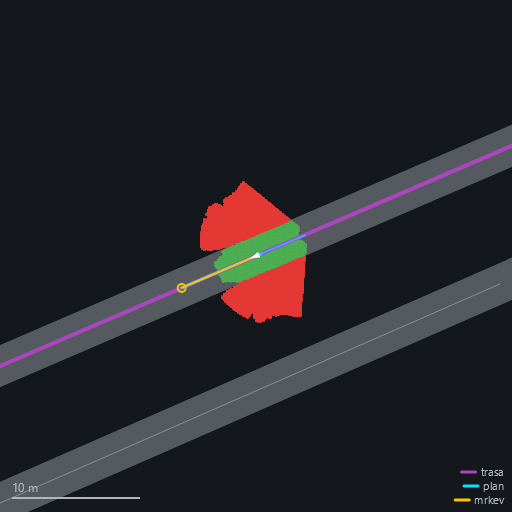
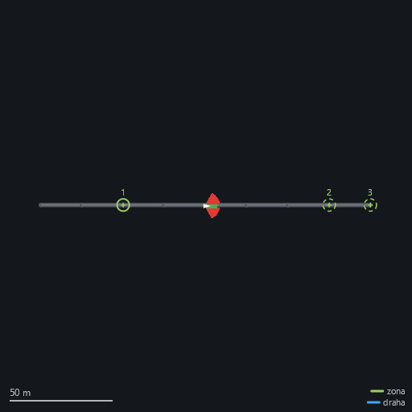

# Runtime bez UI — `ARBot.Headless`

Řídicí runtime robota (`ARBotRuntime`, `ARBotHW`, řídicí smyčka, fúze, navigace, mise, záznam)
spustitelný **bez Avalonie**: na OrangePi přes ssh, jedním příkazem, bez displeje. Vzniklo
4. 9. 2026 podle [plan-runtime-headless.md](plan-runtime-headless.md) (fáze 1 a 2).

**Proč:** Avalonia bez displeje na zařízení vůbec nenastartuje, takže „spustit přes ssh" dřív
nešlo. Druhý důvod je odlehčení: Avalonia, Dock, Mapsui, fonty a renderovací smyčka stojí paměť
i CPU, které řízení nepotřebuje. **Kolik**, se změří až na zařízení — `PerfMsg` nese CPU procesu,
takže srovnání UI proti headless bude přímo v záznamu ([perf-monitoring.md](perf-monitoring.md)).

## Co to je a co ne

- **Jen Run.** Prohlížení záznamů (`Mode.View`) zůstává v UI na Windows a v `ARBot.Analyze`.
- **Na zařízení běží jako služba systemd** (`arbot`), zapnutá po bootu, s `Restart=always`.
  Do 4. 9. 2026 tu stálo pravé opak („žádný systemd, žádná služba") a důvod byl, že robot, který
  se sám znovu rozjede, je horší než robot, který stojí. **Ten důvod platí dál** — jen ho nově drží
  něco jiného: bez zadané mise runtime nastartuje, rozjede senzory a **stojí**, dokud mu člověk
  misi nevybere. Restartovaný proces se tedy nerozjede. Viz [decisions.md](decisions.md),
  5. 9. 2026, a [deploy/README.md](../deploy/README.md).
- **Konzole je jediný displej.** `Trace` má `ConsoleTraceListener`, takže vše, co runtime hlásí
  do `Trace` (stav senzorů, mise, plánovač, `record=`), jde na stdout a zároveň přes
  `TraceInfoBridge` do záznamu. `Debug.WriteLine` v Release mlčí (pravidlo v CLAUDE.md).
- **Chování Run je totožné s UI** — obě aplikace volají tentýž `ARBotRuntime.Current.Start(Mode.Run)`
  nad tímtéž `ARBot.Runtime`; headless jen nemá odběratele v UI.

## Architektura

```
ARBot.Common ← ARBot.HAL ← ARBot.HALWindows | ARBot.HALArmbian ← ARBot.Runtime ← ARBot (Avalonia UI)
                                                                              ← ARBot.Headless (konzole)
```

| projekt | typ | obsah | platformy |
|---|---|---|---|
| `ARBot.Runtime` | knihovna | `ARBot.Robot.*` (runtime, HW), `CrashLog`, `RuntimeBootstrap`; kopíruje `config/`, `OSM/` | `x64`, `x86`, `OrangePI` |
| `ARBot` | WinExe (Avalonia) | Views, ViewModels, Diagnostics, tenký `Program.cs` | `x64`, `OrangePI` |
| `ARBot.Headless` | Exe (konzole) | `Program.cs` | `x64`, `OrangePI` |
| `ARBot.Runtime.Tests` | NUnit | `RuntimeBootstrapTests` | jen `x64` |

Detail vrstev v [architecture.md](architecture.md).

### `RuntimeBootstrap.TryConfigure`

Společný začátek obou aplikací: složí `ParamStore` z příkazové řádky, vypíše účinnou konfiguraci
do předaného `log` (UI `Debug.WriteLine`, headless `Trace.WriteLine` — obě mají `[Conditional]`,
proto se předávají lambdou) a přenese `maxspeed=` / `safedist=` do `Profile` **beze změny logiky**
proti dřívějšímu `Program.Main`. Vrací `null`, nebo hlášku „Chyba konfigurace: …"; o ukončení
procesu rozhoduje volající (kód `RuntimeBootstrap.ExitCodeBadConfig` = 2 v obou aplikacích).
Pořadí `CrashLog.Install()` → `TryConfigure` → aplikace je záměrné, viz komentář ve třídě
a [configuration.md](configuration.md).

### Co dělá `ARBot.Headless/Program.cs`

1. `Trace.Listeners.Clear()` a pak `ConsoleTraceListener`. ⚠️ **To `Clear()` je podstatné:** výchozí
   `DefaultTraceListener` píše na Linuxu do **syslogu**, takže pod systemd (journal sbírá stdout
   i syslog) byl **každý řádek v journalu dvakrát**. Na Windows to vidět není — tam týž listener
   píše do debuggeru. Nalezeno na Orange Pi 5. 9. 2026.
2. `CrashLog.Install()`.
3. `RuntimeBootstrap.TryConfigure(...)`; při chybě hláška na stderr a **návrat 2**.
4. **Zámek jedné instance** (`<dataroot>/arbot.lock`); když ho drží někdo jiný, hláška a **návrat 3**.
   Bere se hned po konfiguraci (potřebuje `dataroot=`) a **před hardwarem** — viz `SingleInstanceLock`.
5. Úvodní řádek: režim HW (`virtualhw=`), mise (`mission=`), záznam (`record=`), náhled (`web=`).
   Se zapnutou misí výstraha, že mise začne bez dalšího pokynu; bez mise naopak informace, že se
   čeká na výběr na stránce (a varování, když je náhled vypnutý, protože pak není čím vybrat).
6. `ARBotHW.Current.WaitReady()` a pak `ARBotRuntime.HwSettleMs` (3 s) na ustálení — **jedna
   konstanta pro autorun v UI i headless**. Kamery a porty se otevírají líně, bez čekání by Run
   startoval nad polovičním HW.
7. **Run — nadvakrát, nebo najednou** (viz [Výběr mise](#výběr-mise-dvoufázový-běh) níž):
   se zadanou `mission=` jeden `Start(Mode.Run)` jako dosud; bez ní nejdřív `Start(Mode.Run,
   ARBotRuntime.NoRecord)` (robot stojí, **nenahrává se**) a po volbě mise `Start(Mode.Run)` znovu.
8. Čeká na `Console.CancelKeyPress` (Ctrl+C), `SIGTERM` (`kill <pid>`, `systemctl stop`) nebo
   `SIGHUP` (zavřená ssh session). První signál spustí řádné ukončení; proces si nechá
   `Cancel = true`, aby ho .NET nezabil dřív, než doběhne `Stop()`. Signál během čekání na HW nebo
   na volbu mise ukončí proces bez Run.
9. `ARBotRuntime.Current.Stop()` — dojede fronty, uzavře záznam, zastaví motory. **Návrat 0.**
10. Neošetřená výjimka projde `CrashLog` (zapíše `logs/crash-*.log` **v datovém adresáři**, dopíše
    záznam, zastaví zdroje) a proces spadne s nenulovým kódem — jako UI. **Nativní pád (SIGSEGV)
    `CrashLog` nezachytí** — zůstane po něm jen záznam v journalu a core dump.

**Parametry:** vše z registru ([configuration.md](configuration.md)). `autorun=true` se **ignoruje
s hláškou** (Run startuje vždy). UI parametry `selftest=`, `open=`, `worldshot=`, `telemetryshot=`
a `st_*` se ignorují tiše — registr je zná, start neshodí.

### Datový adresář (`dataroot=`)

Proti `dataroot=` se řeší **všechny relativní cesty** — záznamy, `logs/`, profily, mapy — místo
kořene repa / adresáře aplikace. Je to kvůli **nasazení stínovou kopií**: binárky běží z kopie
bokem (běžící .NET binárku nejde přepsat, assembly jsou memory-mapped), ale data musí zůstat
v původním adresáři, jinak by se s každou novou kopií ztrácela.

⚠️ **Bere se jen z příkazové řádky** a **dřív než `config=`** — proti datovému adresáři se hledá
i profil. `dataroot` **v profilu je chyba při startu** s vysvětlením; tiše ignorovat by znamenalo,
že cesty míří jinam, než člověk napsal.

Jedna vědomá mezera: `CrashLog.Install()` běží **před** načtením konfigurace, takže pád *před* ní
skončí vedle aplikace (ve stínové kopii, která se při příštím startu přepíše). Prohodit pořadí by
znamenalo, že pád při čtení konfigurace nezanechá stopu vůbec žádnou.

### Zámek jedné instance

`<dataroot>/arbot.lock`, držený otevřený s `FileShare.None` po celý běh; druhá instance skončí
**kódem 3**. Bez něj byla zákeřná past: vedle běžící služby pustí člověk aplikaci ručně přes ssh,
**port náhledu se ošetří sám** („bez nahledu" a jede se dál) — takže zvenčí to vypadá, že vše běží,
jen stránka ukazuje první proces, zatímco druhý už sáhl na tytéž UARTy a kamery.

Zámek souboru, ne pidfile: .NET to na Unixu mapuje na `flock`, takže **padá s procesem** a po
tvrdém zabití nezůstane viset. Do souboru se píše PID a čas — je to forenzní údaj, za běhu ho
`FileShare.None` nepustí přečíst.

### Hlídač zatuhnutí (`hangwatch=`, od 14. 9. 2026)

`HangWatchdog` je **sourozenec `CrashLog`**: ten zachytí pád (operaci, která skončila špatně),
tohle ten opak — operaci, která **neskončila vůbec**. `ARBotRuntime.Start(Mode.Run)` je obalený
`HangWatchdog.Guard("Start(Run)", hangwatch)`; když se do `hangwatch` sekund nevrátí, jde do
`Trace` (tedy do journalu i do záznamu) hlášení a vedle něj **minidump procesu** do
`<dataroot>/logs/hang-*.dmp`, ve kterém jsou zásobníky všech vláken.

⚠️ **Nic to neléčí ani neodblokuje** — jen zapíše důkaz. Zatuhlá operace zůstane zatuhlá.

**Proč zrovna takhle.** 14. 9. 2026 se runtime při volbě mise ze stránky zasekl uvnitř `Start()`:
v journalu doběhlo `corridor=false` a `mission=track` **už nikdy nepřišlo**, ačkoli mezi nimi je
běžně 5 ms (naměřeno na témž záznamu o dvě kola dřív). Proces žil dál — vlákno kamery logovalo
ještě dvě minuty — ale **stránka přestala odpovídat**, takže obsluha neměla jak zjistit cokoli víc
a robota vypnula; tím zmizel i stav, ze kterého by to šlo přečíst. Dohledávat to **odkazem na
stránce nejde**: stránka je přesně to, co při zatuhnutí chybí. V terénu je u robota často jen
mobil, takže jediné, co pomůže, je aby si důkaz **pořídil robot sám**.

Tři rozhodnutí, která z toho plynou:

- **Arm je před zámkem**, ne uvnitř: zatuhnout se dá i na čekání na `gate`, když ho drží předchozí
  `Start`, a navenek to vypadá úplně stejně.
- **Jen `Run`**, ne `View`: `WireView` staví index nad gigabajtovým záznamem, takže tam je dlouhý
  start legitimní a hlídač by vyráběl falešné poplachy.
- **Výchozích 20 s je o řády víc než měřená skutečnost** (desítky ms). Hlídač má chytat zatuhnutí,
  ne pomalost — falešný poplach stojí minidump a řádek v journalu, který příští pátrání svede ze
  stopy. Když operace nakonec doběhne, hlídač to **dopíše** („nakonec dobehlo po N s"), aby po ní
  nezůstalo viset obvinění. `hangwatch=0` vrací přesně dosavadní chování.

Dump je **minidump** (`createdump -n`), ne plný core: zásobníky a moduly jsou to, kvůli čemu se
sbírá, a plný core procesu s běžně 5+ GB (page cache záznamu) by se sbíral minuty a vozil špatně.
`createdump` se bere z `RuntimeEnvironment.GetRuntimeDirectory()`, takže o něj nasazení nemusí
pečovat. ⚠️ **Na systémech s `yama`** (`/proc/sys/kernel/yama/ptrace_scope ≥ 1`) si potomek nesmí
vzít `ptrace` na rodiče a dump nevznikne — Orange Pi yama nemá (ověřeno 14. 9. 2026), jinde by to
chtělo `prctl(PR_SET_PTRACER)`, který odsud nezavoláme. Selhání se hlásí, netiší.

✅ **Na zařízení hlídač poprvé běžel 17. 9. 2026 — a zaplatil se hned napoprvé.** V 16:21:42
vystřelil na zásek při volbě mise `track`, pořídil `logs/hang-Start-Run-20260917-162142.dmp`
a z jeho zásobníků je příčina určená na řádek: **ABBA deadlock mezi zámkem `TrackMission`
a zámkem `WebStatus`** (mise drží svůj zámek a publikuje do fan-outu, stránka drží svůj a ptá se
mise na `PhaseText`). Bez dumpu by to z ničeho jiného vidět nebylo — přesně ten případ, pro který
hlídač vznikl. Podrobnosti `prov-deadlock-mise-webstatus` v [registru](ukoly.md).

✅ **Opraveno týž den, z obou stran.** Mise skládá zprávu pod zámkem a **publikuje až mimo něj**;
drží to `using` rozsah (`Publikace()`), takže se na to nedá zapomenout ani při `return` uprostřed
zámku, a vnořená volání (`Abort` zevnitř `OnGlobalNav`) podle `Monitor.IsEntered` mlčí, aby
publikoval vždy jen nejvnějšnější rozsah. `WebStatus.ToJson` si stav mise **ofotí před** svým
zámkem (`NactiMisi`). Jedna strana by stačila, ale invariant má platit oběma směry — a je to
pravidlo, které si `RelaySource` píše sám: *fan-out běží na vlákně producenta, takže se do něj
nesmí vstupovat s drženým zámkem*. ⚠️ Týká se to jen `TrackMission` a `RobotourMission`;
`FreeRunMission` ani `MagCalMission` nemají zámek žádný. Na zařízení to neběželo.

⚠️ **Zásek ZA během ale nechytí.** Token se po dokončení `Start(Run)` zahodí, takže zásek z téhož
dne v 16:12 (4 s po startu, `records/test/20260917-161234.rec`) žádný dump nemá. Léčba (neudělaná)
je tep z běžící smyčky — `Scheduler` tiká 10×/s, takže „poslední tik je starší než N s" je levný
a jednoznačný příznak. Viz `prov-zatuhnuti-za-behu-mise`.

⚠️ **Dump se na Pi nerozebere bez nástroje a Pi nemá internet.** `dotnet-dump` pro linux-arm64 je
jeden soubor — stáhnout na PC z `https://aka.ms/dotnet-dump/linux-arm64`, poslat `scp` do `/tmp`
a spustit tam; analyzovat ho na Windows **nejde** (chybí DAC pro linux-arm64, `dotnet-dump` skončí
na „Failed to load data access module").

### ⚠️ Služba se po pěti restartech v pěti minutách vzdá

Jednotka má systemd výchozí `StartLimitBurst=5` / `StartLimitIntervalUSec=5min` (`RestartUSec=5s`).
Šestý start v tom okně skončí `Start request repeated too quickly` → `start-limit-hit` a služba
zůstane ve stavu **`failed`** — tedy **`Restart=always` ji už nevrátí** a robot je mrtvý až do
ručního `systemctl reset-failed arbot && systemctl start arbot` (nebo rebootu).

Našlo se to 14. 9. 2026 tím, že to zabilo reprodukční test, ne v provozu — ale **v provozu je to
horší**: crash loop (a dvě SIGSEGV při `Stop()` téhož dne ukazují, že to není hypotéza) robota
v terénu **trvale odstaví**, a jediné, co obsluha uvidí, je mrtvá stránka. Zvážit `StartLimitBurst=0`
(bez limitu) nebo delší `RestartSec`; limit má smysl proti nekonečné smyčce, ale u robota, který se
bez služby neumí ani ohlásit, je léčba horší než nemoc.

## Spuštění

Build / publish (z Windows):

```bash
dotnet build Src/ARBot.Headless/ARBot.Headless.csproj -p:Platform=x64
dotnet publish Src/ARBot.Headless/ARBot.Headless.csproj -p:Platform=OrangePI -r linux-arm64 --self-contained false -o <cíl>
```

Publish pro `linux-arm64` má ~45 MB a obsahuje `config/`, `OSM/`, `ARBot.HALArmbian`,
`libSkiaSharp.so`, `libSystem.IO.Ports.Native.so`. ⚠️ **`libNativeLib.so` v něm z tohoto stroje
není** — `ARBot.Common.csproj` ji kopíruje jen `Exists`, a `.so` se cross-kompiluje ve WSL
([build-and-platforms.md](build-and-platforms.md)). **Bez ní Run spadne hned při startu**
(`DllNotFoundException` v `NativeComputeUnit`) — naběhlo se na to na Pi 5. 9. 2026; nasazovací
skript ji proto doplní z datového adresáře.

**Nasazení na zařízení dělá [`deploy/nasad.ps1`](../deploy/nasad.ps1)** (publish s razítkem verze →
`scp` → restart služby); postup a rozvržení adresářů je v [deploy/README.md](../deploy/README.md).
Ruční spuštění vedle běžící služby skončí kódem 3 (zámek).

Na zařízení ručně (ssh), se zastavenou službou:

```bash
sudo systemctl stop arbot
dotnet ~/arbot-headless-run/ARBot.Headless.dll dataroot=/home/ales/arbot config=config/pi-provoz.cfg
```

Na Windows pro zkoušku v simulaci:

```bash
dotnet Src/ARBot.Headless/bin/x64/Debug/net10.0/ARBot.Headless.dll virtualhw=true mission=freerun map=OSM/SyntetickyRovny.osm record=records/headless-test.rec
```

### Launch profily (Visual Studio, `dotnet run`)

`Src/ARBot.Headless/Properties/launchSettings.json` má **devět profilů** jako obdobu těch v UI
aplikaci: virtuální HW s náhledem, mise FreeRun (rovná mapa i koridor s nálevkou), FreeRun se
záznamem, Robotour, koridor s cílem, dvě mapy s korelací, a **profil bez náhledu** jako baseline
pro srovnání CPU. První profil je bez parametrů, tedy skutečný hardware.

Profily s náhledem mají **`webopen=true`**, což po nastartování serveru otevře stránku ve výchozím
prohlížeči. Parametr je **výchozí vypnutý**: na zařízení bez displeje nemá prohlížeč kde vyskočit.
Selhání se jen ohlásí do `Trace` a běh pokračuje.

⚠️ **`launchBrowser` v `launchSettings.json` tohle neumí** — naměřeno 4. 9. 2026: `dotnet run`
u konzolové aplikace tu vlastnost **ignoruje** (počet procesů prohlížeče se nezměnil, zatímco
`commandLineArgs` z profilu se použily). Je to vlastnost web projektů. I kdyby ji Visual Studio
u konzolového projektu respektovalo, otevřelo by prohlížeč **hned při startu procesu**, tedy dřív,
než server naslouchá — headless nejdřív čeká na HW a tři sekundy na ustálení. `webopen=true`
otevírá stránku **až po úspěšném bindu**, což je ten správný okamžik.

**Pozor při `dotnet run`:** když se profil nenačte (třeba kvůli chybě v JSON), `dotnet run`
aplikaci spustí **bez argumentů**, tedy se **skutečným hardwarem**. Hláška o vadném profilu proletí
mezi ostatními řádky; poznat to jde na úvodním řádku podle `HW: skutecny`.

**Ukončení:** Ctrl+C v ssh, nebo `kill <pid>` z druhé session. Zavření ssh session pošle `SIGHUP`,
který se chová stejně (řádný `Stop()`); kdo chce běh přežívající odpojení, pustí ho pod `tmux`/`nohup`
— ale pak nemá jak robota zastavit jinak než `kill` z druhé session nebo nouzovým tlačítkem.

**Návratové kódy:** `0` řádně ukončeno signálem, `2` vadná konfigurace (hláška na stderr),
jiný = pád (viz `logs/crash-*.log`).

**Kde hledat stopy:** `logs/crash-<datum>.log` vedle aplikace (`CrashLog`), záznam podle `record=`
(relativně proti `RepoPaths.RootOrBase()`, což je na zařízení adresář aplikace), stdout ssh session
(rozumné je ho přesměrovat: `… 2>&1 | tee logs/beh.log`).

## Výběr mise (dvoufázový běh)

Bez zadané `mission=` běží headless **nadvakrát**:

```
FÁZE A   Start(Run) s mission=none, BEZ ZÁZNAMU
         robot stojí (žádný producent mrkve → žádná mrkev)
         stránka ukazuje senzory, kameru, půdorys — a nabízí VÝBĚR MISE
   ↓     POST /mission?m=… (jen při drženém nouzovém zastavení)
FÁZE B   Start(Run) znovu, už s misí a SE ZÁZNAMEM
         robot se rozjede, až člověk nouzové zastavení uvolní
```

Se zadanou `mission=` se nic nemění — jeden `Start`, hned se záznamem. Dokumentované spuštění
z příkazové řádky tedy zůstává, jaké bylo.

**Proč fáze A vůbec běží, a nečeká se jen tak:** stav nouzového zastavení chodí jako
`MotorStateBase.IsEmergencyStop`, tedy **zprávou ze stupně, který před Runem neběží** (skutečné
senzory zakládá `ARBotHW.SetRealHW` až z `ARBotRuntime.Start`). Bez běžícího Runu by nebylo na čem
pojistku postavit. Navíc je to funkce, ne cena: před vypuštěním robota je stránka se senzory
a snímkem kamery přesně to, co člověk chce vidět.

**Proč se fáze A nenahrává:** záznam roste ~19 MB/s, takže deset minut čekání na úkol by znamenalo
~11 GB. Jeden `.rec` = jedna mise. Slouží k tomu `ARBotRuntime.NoRecord` (prázdný řetězec jako cesta
záznamu = „nenahrávej ani podle `record=`"; `null` dál znamená „vezmi `record=`").

**Pojistka: misi lze vybrat jen při DRŽENÉM nouzovém zastavení.** Web tedy misi *nastaví*, ale
rozjede ji vždy až člověk stojící u robota tím, že stop uvolní. Gate se vyhodnocuje **i na serveru**
(odpověď 409), ne jen v JavaScriptu — klientská kontrola je pohodlí, tahle je pojistka. Mlčící
motor **není** „stop není stisknutý": bez čerstvé zprávy (do 3 s) se vybírat nedá.

| stav | co stránka řekne |
|---|---|
| stop stisknutý, zpráva čerstvá | výběr mise povolen |
| stop uvolněný | „nejdřív stiskni nouzové zastavení" |
| motory nehlásí stav | „motory nehlásí stav - misi nelze vybrat" |

Seznam misí bere stránka z **registru parametrů** (`ParamRegistry.Mission.Def.AllowedValues` bez
`none`), takže nová mise se objeví tím, že se přidá do registru — žádný druhý seznam, který by se
rozešel. Volba jde do `ParamStore` jako `ParamOrigin.Runtime`, takže se objeví v účinné konfiguraci
(a tím i v záznamu) jako `mission=freerun  (zvoleno za behu)` — kdyby se předala Startu bokem,
záznam by tvrdil `mission=none`, i když se jelo. Druhá volba se odmítne (409).

**Robotour se rozjíždí sám** (pokyn autora 5. 9. 2026): `StartMission()` volá `ARBotRuntime` hned
po založení mise, takže to platí pro UI, příkazovou řádku i výběr z webu. Do té doby ji spouštělo
**jediné místo v repu** — tlačítko *Start mise* v UI panelu — takže v headless zůstala navždy v `Idle`
a robot stál, zatímco úvodní řádek hlásil, že se rozjede. Bezpečné to je proto, že auto-start robota
**nerozjede**: automat jde `Idle → ArmingAtDepot` (čeká na kvalitní fix) → `AwaitingEStop` (čeká, až
člověk stop **stiskne**).

## Stav ověření

**Windows, 4. 9. 2026 (fáze 1 a 2):**

- Build celého `ARBot.slnx` pod `x64` i `OrangePI` bez chyb; `ARBot.Common.Tests` 1 131 zelených
  (baseline), `ARBot.Runtime.Tests` 4.
- UI po přesunu: self-test s virtuálním HW, `mission=robotour`, `open=robotour,debug`, Run 10 s → Stop
  → exit 0, bez crash logu (78/86 snímků sjízdnosti, 79 překreslení robot-centric pohledu).
- Past 3 (kopírování `config/`, `OSM/` z knihovny do výstupu exe) ověřena smazáním obou složek
  v `Src/ARBot/bin/…` a rebuildem: vrátily se z `ARBot.Runtime` (2/2 profily, 18/18 map).
- Headless s virtuálním HW, `mission=freerun`, `record=`: 25 s běhu, mise se rozjela (0,80 m/s),
  Ctrl+C (`GenerateConsoleCtrlEvent`) → **`Stop()` trval 4 ms**, proces skončil 19 ms po signálu,
  **kód 0**. Záznam 476 MB + 240 KB index, `ARBot.Analyze types` ho přečte celý bez hlášení
  poškození: 5 034 zpráv (`RobotStateMsg` 217, `FreeRunMsg` 258, `LocalPlanMsg` 258, `PerfMsg` 21,
  `Info` 46, `GroundTruthMsg` 217 …).
- `config=neexistuje.cfg` → kód 2, stderr „Chyba konfigurace: Konfiguracni soubor '…' neexistuje."
- Publish `-p:Platform=OrangePI -r linux-arm64` projde.

**Windows, 4. 9. 2026 (fáze 3, webový náhled):**

- `ARBot.Common.Tests` 1 155 zelených, `ARBot.Runtime.Tests` 36 (13 `HttpMini`, 10 server přes
  `HttpClient`, 9 `WebStatus`, 4 bootstrap); build `x64` i `OrangePI` bez chyb.
- Běh s `virtualhw=true mission=freerun map=OSM/SyntetickyRovny.osm web=8080` a otevřenou stránkou
  v prohlížeči: půdorys kreslí síť cesty, occupancy grid, trajektorii, mrkev i robota; snímek kamery
  přijde a **přepínač na „cesta z RGB" ukáže čistě oddělenou vozovku** (bílá) od trávy (černá).
  Mise jela správně — odchylka −0,491 m proti požadovaným −0,500, šířka koridoru 2,017 m proti 2,0 m
  v mapě.
- Všechna tři **měřítka** proklikaná: 2 m ukáže volný pruh mezi překážkami, 50 m celou trasu;
  u kamery se skupina měřítek skryje. **Senzory** hlásily pět zdrojů (Left, Right, VirtualMotors,
  VirtualGPS, VirtualIMU) bez chyby a věk měření pod 0,2 s. Barvení chyby a ticha ověřeno
  podstrčenými daty: `IsError` je červeně, měření starší 3 s oranžově.
- CPU procesu **13,9 % bez publika, 14,3 % s obnovovanou stránkou**.
- 404 na neznámou cestu, 405 na `GET /stop`, JPEG na obě obrazové vrstvy, PNG 7 kB na půdorys.
- **Tlačítko Zastavit robota** na stránce ukončilo proces: `web: prislo POST /stop`,
  `Stop()` trval 4 ms, kód 0.
- Neplatný port (`web=80`, `web=99999`) → kód 2 s hláškou. **Obsazený port** (druhá instance na
  témž portu) → hláška „bez nahledu" a `Run bezi`, tedy robot jede dál.

**Orange Pi, 5. 9. 2026 — první běh runtime na zařízení mimo UI.** Ověřeno (Armbian, .NET 10.0.9,
aarch64, verze `1.0.247.19186`):

- **Služba systemd** `arbot` běží, je `enabled`, `ExecStartPre` (stínová kopie, 17 MB) prošel.
  `systemctl stop` → **SIGTERM → řádné ukončení za 7 ms** a „Deactivated successfully" — tím padla
  otevřená otázka, jestli `PosixSignalRegistration` na ARM funguje.
- **Skutečné senzory** hlásí čerstvá data: VN100 IMU, SDC2160Ex, uBloxGps a obě D435 se stářím pod
  0,05 s. `WaitReady()` + 3 s stačilo; kamery se připojují ~15 s po startu a do té doby jsou
  poctivě `IsError`. **T265 je v chybě** („5 s bez pózy, restart pipeline") — stav HW, ne runtime.
- **Náhled celý:** `world.png` se nakreslil **včetně textu měřítka** (fonty SkiaSharpu na ARM byly
  označené za nejnejistější místo), `camera.jpg` vrátil živý snímek z D435 (640×480, 17 kB).
  První požadavek na snímek může vrátit 204 — zájem se hlásí až on a kopíruje se **příští** snímek.
- **Verze** v hlavičce stránky i v `logs/crash-*.log`; **crash log v datovém adresáři**.
- **Zámek instance**: ruční běh vedle služby → kód 3.
- **Fáze A**: robot stojí, nenahrává, stránka nabízí výběr mise s drženým stopem. **CPU 6,2 %**
  s otevřenou stránkou (proti 13,9 % na Windows v simulaci — jiný stroj i jiná zátěž, nesrovnávat).

**Čtyři vady, které se daly najít jen na zařízení:** chybějící `libNativeLib.so` (pád při startu),
zdvojený journal (`DefaultTraceListener` → syslog), architektura „x64" v crash logu na ARM64
a rozbitý `tar | ssh` v PowerShellu. Všechny opravené, detail v
[plan-headless-provoz.md](plan-headless-provoz.md), Task 6.

**Co zbývá ověřit:**

1. **Celý průchod misí na zařízení** — stisk stopu → výběr mise → uvolnění → jízda. Zkoušel se jen
   v simulaci; na robotu se zatím jelo pouze do fáze A.
2. **Start po skutečném rebootu** (jednotka je `enabled`, reboot se nezkoušel).
3. **Nativní pád při souběhu s RealSense Viewrem.** 5. 9. 2026 proces spadl na **SIGSEGV**
   (`code=dumped, status=11/SEGV`) ve chvíli, kdy byl na Pi otevřený *RealSense Viewer* — ten si
   bere D435 i T265 na USB. `CrashLog` nativní pád nezachytí, takže po něm zůstal jen záznam
   v journalu a core dump. Souvislost není prokázaná, jen časově sedí; **zkusit znovu bez Viewru**.
   Služba se po opakovaných pádech sama vzdala (`StartLimitBurst=5`) a zůstala ve stavu `failed` —
   to je správně.
4. Odečíst z `PerfMsg` CPU procesu proti běhu s UI na témž stroji.
5. Chování přes WiFi s několika prohlížeči naráz.

## Webový náhled (`web=<port>`)

Stránka na mobilu nebo notebooku ukáže, **co robot právě dělá**, a nabídne dva zásahy: **vybrat
misi** (jen při drženém nouzovém zastavení) a **ukončit proces**. Hotové 4. 9. 2026 (fáze 3) podle
[plan-headless-web.md](plan-headless-web.md), rozšířené 5. 9. 2026 (fáze 4) podle
[plan-headless-provoz.md](plan-headless-provoz.md). **Ve výchozím stavu je vypnutý** (`web=0`).

```bash
dotnet ARBot.Headless.dll config=config/orangepi.cfg mission=robotour web=8080
```

Pak se z mobilu otevře `http://<ip Pi>:8080/`.

Shora dolů: **hlavička** na jeden řádek (vlevo název, vpravo verze, build, doba běhu a systémový
čas), **stav mise**, případný **výběr mise**, **lišta**, **obrázek**, **senzory** a tabulka stavu.
Obnovuje se každou sekundu.

- **Hlavička** odpovídá na „co tu vlastně běží": verze binárky s git hashem a příznakem `dirty`
  (na zařízení se nasazuje často a z rozpracované kopie), datum buildu, doba běhu procesu — podle
  které se pozná restart — a čas. **Když server neodpovídá, hlavička zčervená a název se změní na
  „ARBot - neodpovídá"**; živé údaje (doba běhu, čas) zmizí, verze a build zůstanou. Zbytek stránky
  zůstává stát: po pádu je to jediné, z čeho jde poznat, co robot dělal, když skončil.
- **Stav mise**: jaká mise, v jaké fázi a oranžově **„čeká se na: …"** (kvalitní fix GPS, stisknutí
  nouzového zastavení, QR kód, uvolnění stopu, dojezd k cíli). Bez mise „mise: žádná".
- **„zastaveno: …"** (od 13. 9. 2026) — **držená zastavení** (`StopHold`, viz
  [path-following.md](path-following.md)) i s důvodem. Robot může stát bez nouzového zastavení
  a bez konce mise — třeba po dobu restartu kamer — a bez téhle řádky to vypadá jako zásek,
  který se začne hledat na špatném místě. Vlastní řádek, ne součást stavu mise: držet stop jde
  i bez mise.
- **Lišta**: vlevo přepínače — co se ukazuje (**půdorys | kamera | cesta**) a u půdorysu ještě
  měřítko (**2 m | 10 m | 50 m**, u kamery se skryje); vpravo **Emergency stop** (jen při
  `virtualhw=true`) a červený **Terminate**.
- **Emergency stop** je virtuální nouzové zastavení pro simulaci — panel *Tools → Virtuální senzory*
  je v UI aplikaci, kterou headless nemá, a bez něj by se ta pojistka nedala vyzkoušet. Drží se
  **po celou dobu běhu**, ne jen při výběru mise: Robotour potřebuje stisk a uvolnění na **každém**
  stanovišti, takže kdyby zmizel s panelem výběru, nešlo by projít ani první servisní okno. Držený
  stop je **oranžový** (červená patří destruktivnímu *Terminate*). Se skutečným HW se tlačítko
  nekreslí a server požadavek odmítá — dálkové ovládání nouzového zastavení na skutečném robotu
  nesmí existovat.
  - ⚠️ **Stop drž, dokud stránka nenapíše „připravena k odjezdu".** Výběr mise runtime **přestaví**
    (nový záznam, nová mise) a mise si stisk hlídá až od svého startu — když se tlačítko uvolní
    hned po výběru, nová mise zastihne stop už uvolněný a zůstane čekat na *stisknutí*. S fyzickým
    tlačítkem to nehrozí (drží se rukou), s tlačítkem na stránce ano. Poznat to jde z fáze:
    *čeká na stisknutí* × *připravena k odjezdu*.
  - ⚠️ **Bez virtuálního HW tlačítko nic nezastaví** a do 12. 9. 2026 přesto odpovídalo
    „stisknuto": stav estop se čte z **motorů**, a ty bez mapy vůbec nevzniknou. Server teď
    odpoví **409** a řekne, že chybí `map=`.
- **Terminate** ukončí proces. Pod systemd se za ~5 s vrátí (a mezitím se obnoví stínová kopie),
  takže je to zároveň nejrychlejší cesta k nasazení nové verze; kdo chce robota nechat stát, dá
  `systemctl stop arbot`.
- **Power off** (fialové, jen když to `poweroffcmd=` povoluje) **vypne celé zařízení**. Robot nemá
  klávesnici ani displej a vytažení napájení za běhu znamená useknutý záznam a nedopsaný souborový
  systém; aplikace proto **nejdřív zastaví runtime** (dojede fronty, uzavře záznam, zastaví motory)
  a teprve pak dá systému pokyn. Barva je jiná než u *Terminate* schválně — po *Terminate* se robot
  vrátí, po *Power off* se sám nezapne. Selhání (chybějící sudo, zakázaný polkit) se ukáže na
  stránce; robot, který na „vypnout" mlčky nic neudělá, je horší než ten, který řekne proč.
- **GPS v tabulce stavu**: druh fixu, počet družic, DOP a sigma, se kterou fúze polohu bere —
  nebo **„GPS se NEPOUŽÍVÁ"** s důvodem, když neprojde branou kvality
  ([ekf-fusion.md](ekf-fusion.md#kvalita-gps-fixu-brána-a-sigma-podle-dop-2026-09-06)). Přibylo
  6. 9. 2026, kdy odhad polohy ujel ~570 m se stojícím robotem a ze stránky **nešlo poznat, jestli
  robot vůbec má fix** — muselo se to hledat čtením kódu.


*Snímek z běhu v simulaci (`virtualhw=true mission=freerun`, rovná mapa): zelená je potvrzeně
sjízdné, červená blokované, šedá síť cest z mapy, modrá ujetá dráha, žlutá mrkev.*

| cesta | co vrací |
|---|---|
| `GET /` | stránka (hlavička, stav mise, výběr mise, lišta, obrázek, senzory, stav) |
| `GET /camera.jpg` | poslední snímek; `?cam=<jméno>` vybere kameru, `?layer=prob` pošle **pravděpodobnost cesty z RGB** místo barvy |
| `GET /world.png` | půdorys: occupancy grid pod sítí cest, **trasa navigace**, **dráha z lokálního plánovače**, **zóny mise**, póza, mrkev, ujetá dráha, měřítko a legenda; `?scale=2\|10\|50` volí přiblížení |
| `GET /status.json` | týž stav jako hlavička, tabulka a senzory — pro obnovení bez reloadu i pro skriptovaný dohled |
| `POST /mission?m=<mise>` | vybere misi; **409** bez drženého stopu nebo když už mise běží, **400** u neznámé mise a u `none` |
| `POST /virtualestop?on=true\|false` | virtuální nouzové zastavení; **404** se skutečným HW, **409** když virtuální HW neběží (nejsou motory — typicky chybí `map=`) |
| `POST /stop` | zastaví runtime a ukončí proces, jako Ctrl+C |
| `POST /poweroff` | zastaví runtime a **vypne celé zařízení**; **404** když to `poweroffcmd=` nepovoluje, **500** s důvodem, když příkaz selže |

### Co se na půdorysu kreslí a proč zrovna v tomhle pořadí

Od 12. 9. 2026 je na obrázku vidět i to, **co se robot chystá udělat** — na dvou různých měřítkách:

| Barva | Co to je | Jak daleko dopředu mluví |
|---|---|---|
| šedé pruhy | síť cest z mapy | statická mapa |
| červená / zelená | occupancy grid: neprůjezdné / potvrzeně volné | co robot vidí teď |
| **fialová** | **trasa globální navigace** po síti cest (`GraphNavigationMsg`, hrany `Path`) | desítky až stovky metrů |
| modrá | ujetá dráha | kudy už jel |
| **azurová** | **dráha z lokálního plánovače** (`LocalPlanMsg.WayPoints`) + kolečko v každém uzlu | jednotky metrů |
| **světle zelená** | **zóny, které mají být dosaženy** — kružnice o dojezdovém poloměru s popiskem | celá mise |
| žlutá | mrkev (cíl lokální vrstvy) a spojnice k ní | okamžitý cíl |
| bílá | robot (trojúhelník ve směru kurzu) | — |



*Výřez 40 m (měřítko 10 m) za jízdy mise Track v simulaci. Vlevo dole měřítko, vpravo dole legenda.
Přehled po trase je na [stejném obrázku v měřítku 50 m](media/headless-plan-view-prehled-20260912.png),
kde je vidět celá trasa včetně odbočky.*

**Kreslí se v tomhle pořadí odzadu dopředu**, takže lokální plán je nade vším kromě robota — je to
odpověď na otázku, kvůli které náhled vznikl. Trasa je až **nad** gridem: když se překrývají, je
podstatnější vidět, kam robot míří, než jednu buňku mapy.

**Uzly lokálního plánu se kreslí schválně.** Jejich rozestup je výsledek vyhlazování dráhy
(`smooth=`, viz [occupancy-and-local-planning.md](occupancy-and-local-planning.md)), takže z obrázku
je vidět i to, jestli plánovač dráhu slučuje, nebo ji seká na centimetry.

⚠️ **Obojí má práh stáří a po jeho uplynutí z obrázku zmizí** — plán 2 s, trasa 10 s
(`WebStatus.PlanFreshSec` / `RouteFreshSec`; trasa chodí jen jednou za 2 s, proto delší práh).
Bez toho by po konci mise na půdorysu zůstal viset úmysl, který už neplatí, a to je horší než
prázdný obrázek.

**Legenda** vpravo dole vypisuje jen to, co se doopravdy kreslí. Je v PNG, ne ve stránce, aby platila
i tam, kde se obrázek jen uloží. Bez diakritiky záměrně: písmo bere Skia ze systému a na zařízení
není jisté, že nějaký font „á" má.

⚠️ **Položka musí být ke každé kreslené čáře.** První verze legendy vynechala právě **ujetou dráhu**,
takže modrá čára za robotem zůstala jediná nepopsaná — a přitom je to ta, která se odstínem plete
s azurovým lokálním plánem. Doplněno 12. 9. 2026; hlídá to `UjetaDrahaMaPolozkuVLegende`.

### Zóny, které mají být dosaženy (od 12. 9. 2026)

Při dohledu nad závodem v terénu je z půdorysu potřeba poznat, **kam robot musí dojet** — mrkev
říká jen, kam míří v příštích metrech. Místa mise se proto kreslí jako **kružnice o dojezdovém
poloměru** (`NavigatorOptions.ArrivalRadiusMeters`, tedy o tom, jak blízko stačí dojet, aby
navigace ohlásila `Arrived`) s krátkým popiskem nad ní.



*Mise Track se třemi místy, výřez 200 m (měřítko 50 m). Místo „1" je aktivní (plná čára), zbytek
seznamu čárkovaně. Poloměr 3 m je při tomhle měřítku 8 px, proto má každá zóna i křížek ve středu.*

- **Aktivní zóna je plnou čarou, ostatní čárkovaně.** Bez toho by z obrázku nebylo poznat, které
  místo robot řeší teď a která jsou zbytek seznamu.
- **Zdroj je mise, když nějakou hlásí:** `TrackMsg` nese **celý seznam** míst (od verze 2),
  `MissionMsg` depo / nakládku / vykládku (aktivní podle fáze automatu). Teprve když mise žádná
  místa nemá (FreeRun, `goal=` z příkazové řádky, běh bez mise), kreslí se **cíl globální
  navigace**.
- ⚠️ **Ty dva zdroje se záměrně nesčítají.** Cíl navigace je totiž místo mise **přichycené na síť
  cest**, takže by vedle sebe vyšly dvě kružnice pár metrů od sebe a nikdo by nevěděl, která je ta,
  na které záleží. Přednost má to, co zadal člověk.
- **Poloměr jde ze zprávy** (`GlobalNavMsg.GoalRadiusM`, verze 2). Dokud první zpráva navigace
  nedojde, bere se `NavigatorOptions.DefaultArrivalRadiusMeters` — opsaná trojka by se tiše
  rozešla s nastavením. Ve **starším záznamu** (verze 1) je poloměr nula a nakreslí se jen značka
  středu; poloha je pravdivá pořád.
- **Kreslí se nad gridem**, ačkoli podle pořadí „jak daleko dopředu údaj mluví" by patřily úplně
  dozadu: grid je poloprůhledný a plné pole červených buněk by z kroužku udělalo nečitelnou
  skvrnu. Čitelnost pro člověka tady vyhrává nad konvencí pořadí.

⚠️ **Na zařízení to neběželo** — ověřeno buildem, testy a během v simulaci (`mission=track` nad
`OSM/SyntetickyRovny.osm`).

Síť cest se kreslí **věrně mapové geometrii**: každý úsek je kapsle s lineárně interpolovanou
polosirkou mezi uzly (jako `RoadScene`), takže rozšiřující se cesta je trychtýř a v křižovatce se
hrany hladce napojí. Uzel s neurčenou šířkou (0) se kreslí na 0,5 m, aby nebyl nevidět.

### Když se stránka „zasekne" (přestane se aktualizovat čas)

⚠️ **Nejčastěji to není zásek, ale vyčerpané CPU.** Server běží na
<see cref="ThreadPriority.BelowNormal"/> a spojení serializuje, takže když procesu dojde procesor,
stránka přestane dostávat data jako první — a vypadá to jako zamrznutí, ačkoli robot jede dál.

Změřeno 13. 9. 2026 v simulaci na vývojovém PC:

| co běží | CPU procesu |
|---|---|
| `virtualhw` + malá mapa (`Hviezdoslavova.osm`, 96 uzlů cest) + záznam + náhled | **~2,4 jádra** |
| totéž nad `HajeRovne.osm` (3771 uzlů cest) | **CPU na doraz, stránka neodpovídá vůbec** |

U té velké mapy se to podařilo reprodukovat spolehlivě a příčina je v zásobnících vidět:
`SyntheticFrameRenderer.Trace` — **render virtuální kamery**, který pro každý paprsek prochází
scénu. Rostoucí mapa ho prodražuje, kdežto na skutečném robotu (kde snímky dává D435) tahle cena
neexistuje. **Simulace nad velkou mapou tedy není měřítko výkonu robota.**

**Jak to příště chytit** — proces žije, takže stačí vypsat zásobníky:

```bash
dotnet tool install -g dotnet-stack
dotnet-stack report -p <pid>
```

Když v nich je `SyntheticFrameRenderer` nebo `CameraFrameProcessor`, je to CPU (viz výše). Když
`Monitor.Enter`, je to zámek a patří to nahlásit. Druhý zdroj je `PerfMsg` v záznamu
(`perf=`, výchozí zapnuto): nese CPU procesu a zameškané takty za každou sekundu, takže po záseku
jde zpětně poznat, kdy se to začalo sypat.

#### Zásek 17. 9. 2026 — stránka odpovídala, čas v ní neběžel

Druhý případ téhož příznaku, a **není to CPU**. V záznamu `20260917-161234.rec` je vidět, že
v 16:12:38 obsluha uvolnila nouzové zastavení, mise Track odjela — a **do 20 ms po té hlášce
přestaly proudit všechny zprávy najednou**: IMU ve 4,074 s záznamu, motory 4,078, GPS 4,068, obě
kamery, řídicí smyčka i koridor. Dál žilo jediné vlákno: dotazování odpojené T265, jehož hlášky
tekly do záznamu ještě **140 s**. Web i zapisovač záznamu tedy byli naživu, produkce dat ne — přesně
to, co obsluha popsala („nehlásila, že nemá konektivitu, ale čas neběžel").

**Co ta data prozrazují o místě záseku.** Vlákno T265 je taky `SensorBase` jako ostatní senzory
a běželo dál; jediné, čím se od nich liší, je, že **nic nepublikuje** (dotaz vždy selže a jen
loguje). Všechna vlákna, která publikují, stojí. `Info` z `TraceInfoBridge` jde přímo na `Stream`,
kdežto měření jdou navíc přes `RoleRouter` do `processing` (`RelaySource` — fan-out **na vlákně
producenta**), a to je společná větev všeho, co umlklo. Blokující odběratel ale ze statického
čtení vidět není: stupně mají vlastní frontu `DropOldest` a `RecordingTarget` je `DropNewest`,
takže žádný `Post` blokovat nemá. **Bez zásobníků vláken se dál nedostaneme** — a právě ty chybí,
protože hlídač je odzbrojený (viz výše).

⚠️ **Neplést s předchozím odstavcem:** u vyčerpaného CPU robot jede dál a jen stránka zaostává;
tady se zastavilo i řízení. Rozliší to `PerfMsg` v záznamu a `dotnet-stack report`.

**Zásahy jdou jen přes `POST`** — `GET` na `/stop` i `/mission` vrací 405, aby je nevyvolal prefetch
prohlížeče nebo náhled odkazu. Hodnota jde **query stringem**, ne tělem: `HttpMini` čte jen
hlavičku a kvůli jednomu řetězci nemá smysl do něj přidávat čtení těla.

**Vrstva „cesta z RGB"** je ten kanál, který jde do occupancy gridu (`CameraFrame.ImageProbability`,
plní `CameraFrameProcessor`, čte `OccupancyIntegrator`) — tedy co robot považuje za cestu ještě
před fúzí do mapy. Je to nejrychlejší odpověď na otázku „vidí vůbec cestu?".

**Měřítko** je délka úsečky vlevo dole na půdorysu a **výřez je její čtyřnásobek**: 2 m je detail na
manévrování (výřez 8 m), 10 m běžný pohled (40 m, výchozí), 50 m přehled po trase (200 m). Přepočet
drží `PlanViewRenderer.SpanForScaleBar`, takže popisek tlačítka vždy odpovídá tomu, co je nakreslené.

**Senzory** jsou jeden údaj na senzor ve tvaru **`Left: OK/75ms`** — jméno, stav z hardwaru
(`ISensor.IsError`) a **věk jeho poslední zprávy**. Obojí je potřeba, protože každé odpovídá na
jinou otázku: `IsError` řekne, že senzor hlásí poruchu, zatímco věk odhalí **senzor, který hlásí OK
a přitom už nic neposílá** — a to je ta horší porucha. Chyba je červeně, měření starší **3 s**
oranžově; ten prah je volný záměrně, protože GPS jde 5 Hz a kamery pod 30 Hz.

Věk se páruje se senzorem podle **jeho rozhraní**, ne podle jména: `ICamera` → `CameraFrame:<jméno>`,
`IIMU` → `IMUState:<jméno>`, `IGPS` → `GPSState`, `IMotorControl` → `MotorStateBase`. Jména senzorů
a druhy zpráv se totiž neshodují (`VirtualIMU` posílá `IMUState`). U kamer i IMU se rozlišuje ještě
jménem, protože jich může být víc — kvůli tomu `IMUState` dostal 4. 9. 2026 pole `Name` (verze zprávy
2, viz [record-replay.md](record-replay.md#verzování-zpráv-serializace--povinný-princip)). Měření,
ke kterému se žádný senzor nenašel, se ukáže zvlášť jako `IMUState: —/12s`.

Věk je „jak dávno zpráva vyšla do streamu" a měří se **proti `TimeBase.Now`**, tedy touž základnou,
jakou používá zbytek aplikace (pravidlo v [CLAUDE.md](../CLAUDE.md)). Není to čas pořízení — ten je
o dobu zpracování v pipeline starší.

Na `ARBotHW.Current` se sahá jen přes `ARBotHW.HasCurrent` — čtení té vlastnosti instanci jinak
**založí a spustí init hardwaru**, což by náhled dělat neměl.

⚠️ **Pool kopií snímků musí mít kapacitu aspoň „počet kamer + 1".** `CameraFrame` nese poolované
buffery, takže si náhled pořizuje kopii z `CameraFramePool`; drží se poslední snímek z **každé**
kamery a na novou kopii je potřeba volný slot. S kapacitou 2 a dvěma kamerami se po prvním snímku
z každé **všechny další tiše zahazovaly a obraz na stránce zamrzl** (nalezeno 4. 9. 2026). Dnes je
kapacita 4 a vyčerpání se hlásí do `Trace`; hlídá to `DveKamery_SeObeAktualizuji`.

⚠️ **Bez hesla, na všech rozhraních.** Přístup chrání **heslo k WiFi**. Kdokoli v té síti může
robota zastavit a **od 5. 9. 2026 mu i vybrat misi** — to druhé ale jen ve chvíli, kdy někdo drží
nouzové zastavení, a rozjede se robot až jeho uvolněním. Web tedy misi *nastaví*, nespustí. Do té
doby tu stálo „rozjet robota z webu nikdy nepůjde"; změnu i její odůvodnění drží
[decisions.md](decisions.md), 5. 9. 2026.

### Proč to nekrade výkon řízení

Server je odběratel streamu, který v `Post` jen uloží referenci na poslední zprávu daného druhu.
**Kreslí se teprve v obsluze požadavku**, takže když se nikdo nekouká, náhled nekreslí ani nekóduje.
Snímek kamery se navíc **nekopíruje vůbec**, dokud si o něj někdo nepožádá (`CameraFrame` nese
poolované buffery, takže kopie být musí — ale jen při zájmu, deset sekund od posledního požadavku).
Vlákno serveru je `IsBackground` s prioritou `BelowNormal`, spojení se obsluhují po jednom.

Naměřeno na Windows v simulaci: **13,9 % CPU procesu bez publika, 14,3 % s otevřenou stránkou**,
tedy náhled při sledování stojí asi **0,4 procentního bodu**.

Kód je ve dvou vrstvách: kreslení v `ARBot.Common/Rendering` (`PlanViewRenderer`, `OccupancyPng` —
funkce zpráv, takže na to vidí i `ARBot.Analyze`), HTTP v `ARBot.Runtime/Web` (`HttpMini`,
`WebStatus`, `WebPreviewServer`).

**`HttpListener` se schválně nepoužil.** Na Windows bez administrátorských práv nepřijme jiný prefix
než `localhost` (`http://+:port/` skončí „Přístup byl odepřen", naměřeno), takže by se ladil jiný
stav, než jaký běží na Pi. Místo něj je vlastní GET/POST server nad `TcpListener`, který se chová
na obou platformách stejně a nepotřebuje URL ACL.

**Když se port nepovede obsadit**, jde hláška do `Trace` a **robot jede dál bez náhledu** — stejná
zásada jako u záznamu. Neplatný port (`web=80`, `web=99999`) je naopak **chyba při startu** s kódem 2:
proces běží jako běžný uživatel, takže privilegovaný port by selhal až za běhu.
