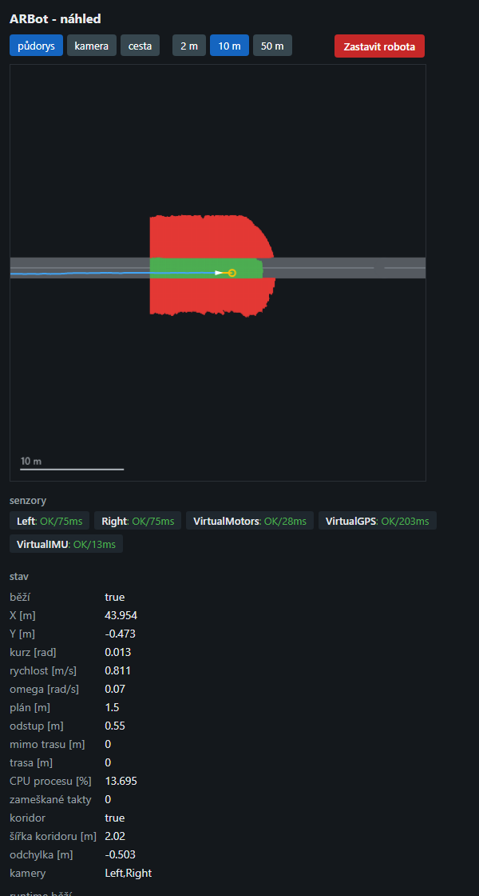

# Runtime bez UI — `ARBot.Headless`

Řídicí runtime robota (`ARBotRuntime`, `ARBotHW`, řídicí smyčka, fúze, navigace, mise, záznam)
spustitelný **bez Avalonie**: na OrangePi přes ssh, jedním příkazem, bez displeje. Vzniklo
4. 9. 2026 podle [plan-runtime-headless.md](plan-runtime-headless.md) (fáze 1 a 2).

**Proč:** Avalonia bez displeje na zařízení vůbec nenastartuje, takže „spustit přes ssh" dřív
nešlo. Druhý důvod je odlehčení: Avalonia, Dock, Mapsui, fonty a renderovací smyčka stojí paměť
i CPU, které řízení nepotřebuje. **Kolik**, se změří až na zařízení — `PerfMsg` nese CPU procesu,
takže srovnání UI proti headless bude přímo v záznamu ([perf-monitoring.md](perf-monitoring.md)).

## Co to je a co ne

- **Jen Run.** Prohlížení záznamů (`Mode.View`) zůstává v UI na Windows a v `ARBot.Analyze`.
- **Žádný systemd, žádná služba, žádný restart po pádu.** Spouští se vždy uživatelským příkazem
  (ssh + příkaz). Robot, který se sám znovu rozjede, je horší než robot, který stojí. Viz
  [decisions.md](decisions.md), 4. 9. 2026.
- **Konzole je jediný displej.** `Trace` má `ConsoleTraceListener`, takže vše, co runtime hlásí
  do `Trace` (stav senzorů, mise, plánovač, `record=`), jde na stdout a zároveň přes
  `TraceInfoBridge` do záznamu. `Debug.WriteLine` v Release mlčí (pravidlo v CLAUDE.md).
- **Chování Run je totožné s UI** — obě aplikace volají tentýž `ARBotRuntime.Current.Start(Mode.Run)`
  nad tímtéž `ARBot.Runtime`; headless jen nemá odběratele v UI.

## Architektura

```
ARBot.Common ← ARBot.HAL ← ARBot.HALWindows | ARBot.HALArmbian ← ARBot.Runtime ← ARBot (Avalonia UI)
                                                                              ← ARBot.Headless (konzole)
```

| projekt | typ | obsah | platformy |
|---|---|---|---|
| `ARBot.Runtime` | knihovna | `ARBot.Robot.*` (runtime, HW), `CrashLog`, `RuntimeBootstrap`; kopíruje `config/`, `OSM/` | `x64`, `x86`, `OrangePI` |
| `ARBot` | WinExe (Avalonia) | Views, ViewModels, Diagnostics, tenký `Program.cs` | `x64`, `OrangePI` |
| `ARBot.Headless` | Exe (konzole) | `Program.cs` | `x64`, `OrangePI` |
| `ARBot.Runtime.Tests` | NUnit | `RuntimeBootstrapTests` | jen `x64` |

Detail vrstev v [architecture.md](architecture.md).

### `RuntimeBootstrap.TryConfigure`

Společný začátek obou aplikací: složí `ParamStore` z příkazové řádky, vypíše účinnou konfiguraci
do předaného `log` (UI `Debug.WriteLine`, headless `Trace.WriteLine` — obě mají `[Conditional]`,
proto se předávají lambdou) a přenese `maxspeed=` / `safedist=` do `Profile` **beze změny logiky**
proti dřívějšímu `Program.Main`. Vrací `null`, nebo hlášku „Chyba konfigurace: …"; o ukončení
procesu rozhoduje volající (kód `RuntimeBootstrap.ExitCodeBadConfig` = 2 v obou aplikacích).
Pořadí `CrashLog.Install()` → `TryConfigure` → aplikace je záměrné, viz komentář ve třídě
a [configuration.md](configuration.md).

### Co dělá `ARBot.Headless/Program.cs`

1. `Trace.Listeners.Add(new ConsoleTraceListener())`.
2. `CrashLog.Install()`.
3. `RuntimeBootstrap.TryConfigure(...)`; při chybě hláška na stderr a **návrat 2**.
4. Úvodní řádek: režim HW (`virtualhw=`), mise (`mission=`), záznam (`record=`); se zapnutou misí
   výstraha **„robot se rozjede bez dalšího pokynu"** (stejná jako u autorunu v UI).
5. `ARBotHW.Current.WaitReady()` a pak `ARBotRuntime.HwSettleMs` (3 s) na ustálení — **jedna
   konstanta pro autorun v UI i headless**. Kamery a porty se otevírají líně, bez čekání by Run
   startoval nad polovičním HW.
6. `ARBotRuntime.Current.Start(Mode.Run)` — přesně jednou. Cestu záznamu řeší `record=` uvnitř `Start`.
7. Čeká na `Console.CancelKeyPress` (Ctrl+C), `SIGTERM` (`kill <pid>`) nebo `SIGHUP` (zavřená ssh
   session). První signál spustí řádné ukončení; proces si nechá `Cancel = true`, aby ho .NET
   nezabil dřív, než doběhne `Stop()`. Signál během čekání na HW ukončí proces bez Run.
8. `ARBotRuntime.Current.Stop()` — dojede fronty, uzavře záznam, zastaví motory. **Návrat 0.**
9. Neošetřená výjimka projde `CrashLog` (zapíše `logs/crash-*.log` vedle aplikace, dopíše záznam,
   zastaví zdroje) a proces spadne s nenulovým kódem — jako UI.

**Parametry:** vše z registru ([configuration.md](configuration.md)). `autorun=true` se **ignoruje
s hláškou** (Run startuje vždy). UI parametry `selftest=`, `open=`, `worldshot=`, `telemetryshot=`
a `st_*` se ignorují tiše — registr je zná, start neshodí.

## Spuštění

Build / publish (z Windows):

```bash
dotnet build Src/ARBot.Headless/ARBot.Headless.csproj -p:Platform=x64
dotnet publish Src/ARBot.Headless/ARBot.Headless.csproj -p:Platform=OrangePI -r linux-arm64 --self-contained false -o <cíl>
```

Publish pro `linux-arm64` má ~45 MB a obsahuje `config/`, `OSM/`, `ARBot.HALArmbian`,
`libSkiaSharp.so`, `libSystem.IO.Ports.Native.so`. ⚠️ **`libNativeLib.so` v něm z tohoto stroje
není** — `ARBot.Common.csproj` ji kopíruje jen `Exists`, a `.so` se cross-kompiluje ve WSL
([build-and-platforms.md](build-and-platforms.md)). Stejně to má i UI aplikace; na zařízení ji
autor dosud dodával vedle.

Na zařízení (ssh), v adresáři s aplikací:

```bash
dotnet ARBot.Headless.dll config=config/orangepi.cfg mission=robotour record=Records/jizda.rec
```

Na Windows pro zkoušku v simulaci:

```bash
dotnet Src/ARBot.Headless/bin/x64/Debug/net10.0/ARBot.Headless.dll virtualhw=true mission=freerun map=OSM/SyntetickyRovny.osm record=records/headless-test.rec
```

### Launch profily (Visual Studio, `dotnet run`)

`Src/ARBot.Headless/Properties/launchSettings.json` má **devět profilů** jako obdobu těch v UI
aplikaci: virtuální HW s náhledem, mise FreeRun (rovná mapa i koridor s nálevkou), FreeRun se
záznamem, Robotour, koridor s cílem, dvě mapy s korelací, a **profil bez náhledu** jako baseline
pro srovnání CPU. První profil je bez parametrů, tedy skutečný hardware.

Profily s náhledem mají **`webopen=true`**, což po nastartování serveru otevře stránku ve výchozím
prohlížeči. Parametr je **výchozí vypnutý**: na zařízení bez displeje nemá prohlížeč kde vyskočit.
Selhání se jen ohlásí do `Trace` a běh pokračuje.

⚠️ **`launchBrowser` v `launchSettings.json` tohle neumí** — naměřeno 4. 9. 2026: `dotnet run`
u konzolové aplikace tu vlastnost **ignoruje** (počet procesů prohlížeče se nezměnil, zatímco
`commandLineArgs` z profilu se použily). Je to vlastnost web projektů. I kdyby ji Visual Studio
u konzolového projektu respektovalo, otevřelo by prohlížeč **hned při startu procesu**, tedy dřív,
než server naslouchá — headless nejdřív čeká na HW a tři sekundy na ustálení. `webopen=true`
otevírá stránku **až po úspěšném bindu**, což je ten správný okamžik.

**Pozor při `dotnet run`:** když se profil nenačte (třeba kvůli chybě v JSON), `dotnet run`
aplikaci spustí **bez argumentů**, tedy se **skutečným hardwarem**. Hláška o vadném profilu proletí
mezi ostatními řádky; poznat to jde na úvodním řádku podle `HW: skutecny`.

**Ukončení:** Ctrl+C v ssh, nebo `kill <pid>` z druhé session. Zavření ssh session pošle `SIGHUP`,
který se chová stejně (řádný `Stop()`); kdo chce běh přežívající odpojení, pustí ho pod `tmux`/`nohup`
— ale pak nemá jak robota zastavit jinak než `kill` z druhé session nebo nouzovým tlačítkem.

**Návratové kódy:** `0` řádně ukončeno signálem, `2` vadná konfigurace (hláška na stderr),
jiný = pád (viz `logs/crash-*.log`).

**Kde hledat stopy:** `logs/crash-<datum>.log` vedle aplikace (`CrashLog`), záznam podle `record=`
(relativně proti `RepoPaths.RootOrBase()`, což je na zařízení adresář aplikace), stdout ssh session
(rozumné je ho přesměrovat: `… 2>&1 | tee logs/beh.log`).

## Stav ověření

**Windows, 4. 9. 2026 (fáze 1 a 2):**

- Build celého `ARBot.slnx` pod `x64` i `OrangePI` bez chyb; `ARBot.Common.Tests` 1 131 zelených
  (baseline), `ARBot.Runtime.Tests` 4.
- UI po přesunu: self-test s virtuálním HW, `mission=robotour`, `open=robotour,debug`, Run 10 s → Stop
  → exit 0, bez crash logu (78/86 snímků sjízdnosti, 79 překreslení robot-centric pohledu).
- Past 3 (kopírování `config/`, `OSM/` z knihovny do výstupu exe) ověřena smazáním obou složek
  v `Src/ARBot/bin/…` a rebuildem: vrátily se z `ARBot.Runtime` (2/2 profily, 18/18 map).
- Headless s virtuálním HW, `mission=freerun`, `record=`: 25 s běhu, mise se rozjela (0,80 m/s),
  Ctrl+C (`GenerateConsoleCtrlEvent`) → **`Stop()` trval 4 ms**, proces skončil 19 ms po signálu,
  **kód 0**. Záznam 476 MB + 240 KB index, `ARBot.Analyze types` ho přečte celý bez hlášení
  poškození: 5 034 zpráv (`RobotStateMsg` 217, `FreeRunMsg` 258, `LocalPlanMsg` 258, `PerfMsg` 21,
  `Info` 46, `GroundTruthMsg` 217 …).
- `config=neexistuje.cfg` → kód 2, stderr „Chyba konfigurace: Konfiguracni soubor '…' neexistuje."
- Publish `-p:Platform=OrangePI -r linux-arm64` projde.

**Windows, 4. 9. 2026 (fáze 3, webový náhled):**

- `ARBot.Common.Tests` 1 155 zelených, `ARBot.Runtime.Tests` 36 (13 `HttpMini`, 10 server přes
  `HttpClient`, 9 `WebStatus`, 4 bootstrap); build `x64` i `OrangePI` bez chyb.
- Běh s `virtualhw=true mission=freerun map=OSM/SyntetickyRovny.osm web=8080` a otevřenou stránkou
  v prohlížeči: půdorys kreslí síť cesty, occupancy grid, trajektorii, mrkev i robota; snímek kamery
  přijde a **přepínač na „cesta z RGB" ukáže čistě oddělenou vozovku** (bílá) od trávy (černá).
  Mise jela správně — odchylka −0,491 m proti požadovaným −0,500, šířka koridoru 2,017 m proti 2,0 m
  v mapě.
- Všechna tři **měřítka** proklikaná: 2 m ukáže volný pruh mezi překážkami, 50 m celou trasu;
  u kamery se skupina měřítek skryje. **Senzory** hlásily pět zdrojů (Left, Right, VirtualMotors,
  VirtualGPS, VirtualIMU) bez chyby a věk měření pod 0,2 s. Barvení chyby a ticha ověřeno
  podstrčenými daty: `IsError` je červeně, měření starší 3 s oranžově.
- CPU procesu **13,9 % bez publika, 14,3 % s obnovovanou stránkou**.
- 404 na neznámou cestu, 405 na `GET /stop`, JPEG na obě obrazové vrstvy, PNG 7 kB na půdorys.
- **Tlačítko Zastavit robota** na stránce ukončilo proces: `web: prislo POST /stop`,
  `Stop()` trval 4 ms, kód 0.
- Neplatný port (`web=80`, `web=99999`) → kód 2 s hláškou. **Obsazený port** (druhá instance na
  témž portu) → hláška „bez nahledu" a `Run bezi`, tedy robot jede dál.

**Na OrangePi nic z toho neběželo** — první spuštění je na autorovi a bude to zároveň první běh
runtime mimo UI. Co ověřit:

1. Start přes ssh podle příkazu výše; že `config/` a `OSM/` leží u aplikace a profil se načte.
2. Že `WaitReady()` + 3 s stačí i pro skutečné kamery a porty (v UI to stačilo pro autorun).
3. Ctrl+C a `kill <pid>`: záznam se uzavře (`.rec` + `.rec.idx` čitelné v `ARBot.Analyze`),
   motory se zastaví, kód 0. Zavření ssh session (`SIGHUP`) totéž.
4. Odečíst z `PerfMsg` CPU procesu proti běhu s UI. Ty 0,4 procentního bodu za náhled jsou
   z Windows; na ARM může kreslení a kódování stát víc.
5. Zda na zařízení `PosixSignalRegistration` pro `SIGTERM`/`SIGHUP` funguje (na Windows ano,
   mapované na konzolové události).
6. **Náhled na zařízení:** že se stránka otevře z mobilu na `http://<ip>:<port>/`, že SkiaSharp
   na Armbianu nakreslí i **text měřítka** (fonty na ARM jsou nejnejistější místo celého náhledu)
   a jak se to chová přes WiFi s několika prohlížeči naráz.

## Webový náhled (`web=<port>`)

Stránka na mobilu nebo notebooku ukáže, **co robot právě dělá**, a nabídne jediný zásah:
zastavit. Hotové 4. 9. 2026 (fáze 3) podle [plan-headless-web.md](plan-headless-web.md).
**Ve výchozím stavu je vypnutý** (`web=0`).

```bash
dotnet ARBot.Headless.dll config=config/orangepi.cfg mission=robotour web=8080
```

Pak se z mobilu otevře `http://<ip Pi>:8080/`.

Stránka má **jeden obrázek** a nad ním lištu: vlevo přepínače, vpravo červené **Zastavit robota**.
Přepínače jsou dvě skupiny — co se ukazuje (**půdorys | kamera | cesta**) a u půdorysu ještě
měřítko (**2 m | 10 m | 50 m**, u kamery se skryje). Pod obrázkem jsou **senzory** a tabulka stavu;
obnovuje se každou sekundu.



*Snímek z běhu v simulaci (`virtualhw=true mission=freerun`, rovná mapa): zelená je potvrzeně
sjízdné, červená blokované, šedá síť cest z mapy, modrá ujetá dráha, žlutá mrkev.*

| cesta | co vrací |
|---|---|
| `GET /` | stránka (jeden obrázek, přepínače, senzory, stav, Zastavit) |
| `GET /camera.jpg` | poslední snímek; `?cam=<jméno>` vybere kameru, `?layer=prob` pošle **pravděpodobnost cesty z RGB** místo barvy |
| `GET /world.png` | půdorys: occupancy grid pod sítí cest, póza, mrkev, ujetá dráha, měřítko; `?scale=2\|10\|50` volí přiblížení |

Síť cest se kreslí **věrně mapové geometrii**: každý úsek je kapsle s lineárně interpolovanou
polosirkou mezi uzly (jako `RoadScene`), takže rozšiřující se cesta je trychtýř a v křižovatce se
hrany hladce napojí. Uzel s neurčenou šířkou (0) se kreslí na 0,5 m, aby nebyl nevidět.
| `GET /status.json` | týž stav jako tabulka a senzory, pro obnovení bez reloadu i pro skriptovaný dohled |
| `POST /stop` | zastaví runtime a ukončí proces, jako Ctrl+C |

**Vrstva „cesta z RGB"** je ten kanál, který jde do occupancy gridu (`CameraFrame.ImageProbability`,
plní `CameraFrameProcessor`, čte `OccupancyIntegrator`) — tedy co robot považuje za cestu ještě
před fúzí do mapy. Je to nejrychlejší odpověď na otázku „vidí vůbec cestu?".

**Měřítko** je délka úsečky vlevo dole na půdorysu a **výřez je její čtyřnásobek**: 2 m je detail na
manévrování (výřez 8 m), 10 m běžný pohled (40 m, výchozí), 50 m přehled po trase (200 m). Přepočet
drží `PlanViewRenderer.SpanForScaleBar`, takže popisek tlačítka vždy odpovídá tomu, co je nakreslené.

**Senzory** jsou jeden údaj na senzor ve tvaru **`Left: OK/75ms`** — jméno, stav z hardwaru
(`ISensor.IsError`) a **věk jeho poslední zprávy**. Obojí je potřeba, protože každé odpovídá na
jinou otázku: `IsError` řekne, že senzor hlásí poruchu, zatímco věk odhalí **senzor, který hlásí OK
a přitom už nic neposílá** — a to je ta horší porucha. Chyba je červeně, měření starší **3 s**
oranžově; ten prah je volný záměrně, protože GPS jde 5 Hz a kamery pod 30 Hz.

Věk se páruje se senzorem podle **jeho rozhraní**, ne podle jména: `ICamera` → `CameraFrame:<jméno>`,
`IIMU` → `IMUState:<jméno>`, `IGPS` → `GPSState`, `IMotorControl` → `MotorStateBase`. Jména senzorů
a druhy zpráv se totiž neshodují (`VirtualIMU` posílá `IMUState`). U kamer i IMU se rozlišuje ještě
jménem, protože jich může být víc — kvůli tomu `IMUState` dostal 4. 9. 2026 pole `Name` (verze zprávy
2, viz [record-replay.md](record-replay.md#verzování-zpráv-serializace--povinný-princip)). Měření,
ke kterému se žádný senzor nenašel, se ukáže zvlášť jako `IMUState: —/12s`.

Věk je „jak dávno zpráva vyšla do streamu" a měří se **proti `TimeBase.Now`**, tedy touž základnou,
jakou používá zbytek aplikace (pravidlo v [CLAUDE.md](../CLAUDE.md)). Není to čas pořízení — ten je
o dobu zpracování v pipeline starší.

Na `ARBotHW.Current` se sahá jen přes `ARBotHW.HasCurrent` — čtení té vlastnosti instanci jinak
**založí a spustí init hardwaru**, což by náhled dělat neměl.

⚠️ **Pool kopií snímků musí mít kapacitu aspoň „počet kamer + 1".** `CameraFrame` nese poolované
buffery, takže si náhled pořizuje kopii z `CameraFramePool`; drží se poslední snímek z **každé**
kamery a na novou kopii je potřeba volný slot. S kapacitou 2 a dvěma kamerami se po prvním snímku
z každé **všechny další tiše zahazovaly a obraz na stránce zamrzl** (nalezeno 4. 9. 2026). Dnes je
kapacita 4 a vyčerpání se hlásí do `Trace`; hlídá to `DveKamery_SeObeAktualizuji`.

**Zastavení je jen přes `POST`**, aby ho nevyvolal prefetch prohlížeče nebo náhled odkazu.

⚠️ **Bez hesla, na všech rozhraních.** Kdokoli v té síti může robota **zastavit**; rozjet ho z webu
nejde a nikdy nesmí jít. Je to vědomé rozhodnutí (robot je na uzavřené síti, zastavení je ta
bezpečnější strana) — viz [decisions.md](decisions.md).

### Proč to nekrade výkon řízení

Server je odběratel streamu, který v `Post` jen uloží referenci na poslední zprávu daného druhu.
**Kreslí se teprve v obsluze požadavku**, takže když se nikdo nekouká, náhled nekreslí ani nekóduje.
Snímek kamery se navíc **nekopíruje vůbec**, dokud si o něj někdo nepožádá (`CameraFrame` nese
poolované buffery, takže kopie být musí — ale jen při zájmu, deset sekund od posledního požadavku).
Vlákno serveru je `IsBackground` s prioritou `BelowNormal`, spojení se obsluhují po jednom.

Naměřeno na Windows v simulaci: **13,9 % CPU procesu bez publika, 14,3 % s otevřenou stránkou**,
tedy náhled při sledování stojí asi **0,4 procentního bodu**.

Kód je ve dvou vrstvách: kreslení v `ARBot.Common/Rendering` (`PlanViewRenderer`, `OccupancyPng` —
funkce zpráv, takže na to vidí i `ARBot.Analyze`), HTTP v `ARBot.Runtime/Web` (`HttpMini`,
`WebStatus`, `WebPreviewServer`).

**`HttpListener` se schválně nepoužil.** Na Windows bez administrátorských práv nepřijme jiný prefix
než `localhost` (`http://+:port/` skončí „Přístup byl odepřen", naměřeno), takže by se ladil jiný
stav, než jaký běží na Pi. Místo něj je vlastní GET/POST server nad `TcpListener`, který se chová
na obou platformách stejně a nepotřebuje URL ACL.

**Když se port nepovede obsadit**, jde hláška do `Trace` a **robot jede dál bez náhledu** — stejná
zásada jako u záznamu. Neplatný port (`web=80`, `web=99999`) je naopak **chyba při startu** s kódem 2:
proces běží jako běžný uživatel, takže privilegovaný port by selhal až za běhu.
