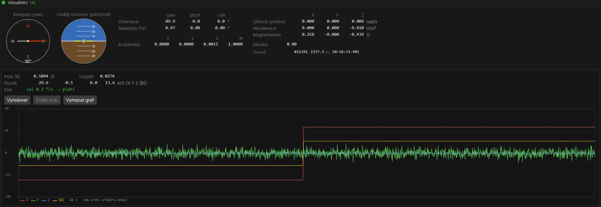

# IMU, souřadnicové systémy a VN100

## Souřadnicové konvence (platí v celém projektu)

- **World = ENU**: X na východ, Y na sever, Z nahoru. Orientace **matematicky**:
  0 = východ, roste **proti** směru hodinových ručiček (+CCW).
- **Body = FLU**: X vpřed, Y vlevo, Z nahoru.
- Převod orientace ↔ **azimut** (0 = sever, +CW, jako kompas) přes
  `Conversions.Orientation2Azimut` / `Azimut2Orientation`.
- `YawPitchRoll.Yaw` = matematická orientace (0 = východ, +CCW) — NE „vzhledem k severu".

## Projekce kamery: kde je posunutí kamery (`CameraProjection`)

`SetOrientation(transform)` si z montážní matice odvodí `rotationWorld2Cam` jako **inverzi celé
transformace, tedy včetně translace** (`M41..M43` se před inverzí vrací zpět). `Vector3.Transform`
translaci matice uplatňuje — **posunutí kamery se proto už NESMÍ odečítat ručně**. Přesně na tom
`Transform` do 2026-08-14 padal: `new Vector3(x - offset.X, y - offset.Y, -offset.Z)` ho započetlo
podruhé, bod na zemi se promítl ~95 px vedle a blízké body metoda zahodila jako „mimo obraz". Chyba
je úměrná posunutí kamery, takže na kameře v počátku (typická testovací projekce) není vidět vůbec.

Invariant, který to hlídá: **`Transform` musí být inverzní k mapování `Camera2DToCamera3D` +
`Transformation`** (paprsek protnutý s rovinou `z = 0`) — z toho se rendruje virtuální scéna
i staví polární grid. Testuje `VirtualHwOccupancyTest.ProjekceTamZpet_JeInverzniKRenderu`.

### Otevřený úkol (→ registr): ověřit `TransformBack`

Stav a data vede [registr úkolů](ukoly.md); tady je jen seznam, co se téhle oblasti týká.

- **[Projekce kamery měla čtyři skryté chyby](ukoly.md#vid-cameraprojection-vady)** —
  `CameraProjection.TransformBack` (pixel → bod na zemi) měl stejnou třídu chyby jako opravený
  `Transform`: aplikoval `rotation` — matici **s translací** — na *směrový vektor* paprsku
  (`Vector3.Transform(point, rotation)`), takže se do směru přičetlo posunutí kamery; při ladění
  occupancy vracela metoda pro většinu pixelů `false` a pro zbytek nesmyslné souřadnice (pro bod
  zhruba (1; 2) m vyšlo (76; 152)). Používá ho `TargetPoly` (polygon dosahu kamery na vozovce);
  správný test je round-trip po vzoru `VirtualHwOccupancyTest.ProjekceTamZpet_JeInverzniKRenderu`
  (proti mapování `Camera2DToCamera3D` + `Transformation`, tedy proti témuž invariantu jako
  u `Transform`). Báze se nakonec přepsala tak, aby hloubku používala — viz
  **[Zpětná projekce pixelu ignorovala hloubku](ukoly.md#vid-zpetna-projekce-hloubka)**, kde zbývá
  ověření na skutečné D435.

## IMUState — které pole je v jakém framu

`ARBot.Common/Models/IMUState.cs` (viz `<remarks>` třídy):

- **BODY frame** (surová měření senzoru): `Magnetometer`, `Acceleration`,
  `AngularAcceleration`, `AngularVelocity`.
- **Referenční frame ZDROJE** (není u všech senzorů stejný): `Rotation`, `Velocity`,
  `Translation`.
  - **VN100** (má magnetometr): `Rotation` je absolutní atitude v ENU (sever z mag).
  - **T265** (nemá magnetometr): vlastní VIO frame — pitch/roll absolutní (gravitace),
    ale **yaw a poloha jen relativní** (bez severu, NENÍ ENU). Fúze z T265 bere pitch/roll
    absolutně, yaw/polohu jen jako relativní (delta) nebo po zarovnání.
- `OrientationUncertainty` (yaw/pitch/roll 1σ, rad) = zdroj kovariance R pro orientaci.

> **Pozor — `IMUState` nenese identitu zdroje** (je `SensorStateBase`, ale ne `INamedMessage`).
> Při dvou IMU (VN100 + T265) tedy nelze poznat, od kterého vzorek je. `ControlLoop` z toho plní
> `RobotState.Pitch`/`Roll` metodou „poslední došlé vyhrává" — mezi tiky to může přeskakovat mezi
> čidly s jinou montáží a kvalitou. (Pitch/roll jsou u obou absolutní z gravitace, takže nejde o chybu
> framu, ale o nekonzistenci kvality — a hlavně to obchází fúzi.) Otevřený úkol a návrh řešení:
> [ekf-fusion.md → Pitch/Roll patří do stavu EKF](ekf-fusion.md).

## VN100 (VectorNav)

Dva drivery v `ARBot.HAL/Devices/AHRS/`:

- **`VN100IMU`** — ASCII výstup.
- **`VN100IMUBinary`** — binární výstup; navíc čte **attitude uncertainty (YprU)** →
  `IMUState.OrientationUncertainty`. Bere VN **Ypr** (yaw = azimut z magnetometru),
  převádí na ENU math (`Azimut2Orientation`) a surové gyro/accel/mag **FRD→FLU**
  (negace Y, Z → `AngularVelocity.Z` je rovnou ENU yaw rate CCW+, `Acceleration.Z` +g nahoru).

### Montáž a reference frame na konkrétním robotu (ověřeno)

- Fyzická montáž VN100: **X dozadu**, Y vpravo, Z nahoru.
- Na senzoru je uložená (ve flash, přežívá vypnutí) **reference frame rotation
  `diag(-1,1,-1)`** → výstup je robotem zarovnaný **FRD** (X vpřed, Y vpravo, Z dolů) / NED.
- Připojení: **COM5, 115200**. Registr 26 (reference frame rotation) je aktivní a uložený;
  ověřeno read-only diagnostikou (VNRRG).
- Živý binární paket začíná `FA 14 00 07 02 03 …` = skupiny Imu|Attitude, masky
  `0x0700` (Mag|Accel|Gyro) a `0x0302` (Ypr|YprU|YprRate) — přesně layout, který
  `VN100IMUBinary` dekóduje.

> Pozn.: dřívější „yaw 180° na severu" byla stará/špatná konfigurace senzoru; po factory
> resetu + novém nastavení reference frame je heading správně. Frame se řeší na senzoru
> (reference frame rotation), NE softwarovým offsetem.

### ⚠️ Kurz z VN100 byl 6. 9. 2026 o **−59°** vedle (naměřeno)

Z pozorování autora „kurz robotu nesouhlasí s jeho reálným kurzem podle mapy“. Měřeno nad
`records/test/20260906-082403.rec` příkazem `ARBot.Analyze heading` (včetně bloků, které kvůli
tomu vznikly — viz [record-replay.md](record-replay.md#heading-nesedí-absolutní-reference-kurzu)).

**Co je změřeno:**

- **`IMU yaw − GPS kurz` = −59,2°** (688 vzorků nad 0,3 m/s, směrodatná odchylka jednoho
  vzorku 9,7°). Ve fyzikálním směru: kompas ukazuje o 59° **po směru hodinových ručiček**
  proti skutečnému směru jízdy.
- **Je to konstantní posun, ne otočené znaménko.** Model `yaw = +kurz + a` má zbytkový rozptyl
  14,6°, `yaw = −kurz + a` 27,0°. Robot jel tam a zpět: při kurzu ≈−157° vyšel rozpor −60,3°,
  při kurzu ≈+22° −58,3° — tedy **stejně před otáčkou i po ní**.
- **Chyba není v GPS.** Dopplerův kurz sedí na směr posunu polohy na +2,9° (33 oken po 1,5 m);
  to jsou dvě nezávislé větve řešení v přijímači.
- **Chyba není v našem kódu.** Mezi oběma záznamy se v cestě VN100 (driver, `IMUState`,
  `Conversions`) změnilo jen přidání `Name` (commit `2316de1`); yaw se počítá stejně a týž
  analyzátor čte oba záznamy.
- **Chyba není ani v gyru / sledování otáčení.** Kdyby yaw špatně sledoval rotaci, rozpor by se
  otáčkou o 180° změnil; nezměnil se. Špatně je **absolutní reference kurzu**.
- **Předtím přitom jel správně:** týž senzor v `records/test/20260902-230138.rec` (2. 9. 2026)
  měl `IMU yaw − GPS kurz` = **−0,25° ± 4,3°**. Není to tedy trvalá vlastnost montáže ani
  převodu rámců — mezi 2. a 6. 9. se něco změnilo **na senzoru nebo na robotu**.
- **Samotné magnetické pole se přitom nezměnilo:** `|B|` p50 0,446 → 0,436 G a sklon p50
  59,6° → 61,6° mezi oběma záznamy, tedy stejně. Kurz přepočtený **z pole** je proti GPS
  +12,7° (2. 9.) a −5,6° (6. 9.) — v obou případech řádově deklinace (~+5°), ne −59°.
  Rozdíl **kurz z pole − yaw ze senzoru** naopak vyskočil z +18,8° na +58,4°.
  → **Magnetometr měří skoro totéž co dřív, ale vlastní atitudové řešení VN100 se od něj
  odtáhlo o ~59°.**
- **Ten přepočet je ověřený proti zdravému senzoru:** v delším záznamu z téhož večera
  (`records/20260902-222601.rec`, **41 916 vzorků**) je `kurz z pole − yaw` **+4,25° ± 8,2°**,
  tedy řádově deklinace. Když senzor funguje, sedí jeho yaw na jeho vlastní pole — takže
  +58,4° ze 6. 9. není artefakt měřidla. *(Kurz z GPS je v tomhle záznamu nepoužitelný — robot
  se ploužil 0,33 m/s a sd rozporu je 131°.)*

**Co to znamená pro robota:** fúze kurz **neváží, přebírá ho** — `odhad − IMU yaw` je
**−0,01° ± 0,21°** (3 237 vzorků), zatímco `odhad − GPS kurz` je −59,1°. Chyba kompasu jde
tedy 1:1 do `RobotState.Theta`, tedy do mapového pohledu, do mrkve i do korelace s mapou. Sedí to
s poměrem „kompas přehlasuje GPS kurz ~4 000:1“ z [ekf-fusion.md](ekf-fusion.md).

**Co ještě není rozhodnuté** (a nesmí se to tvrdit):

- **Měkké železo není vyloučené.** Záznam pokrývá jen dva směry jízdy o 180°, a chyba
  z měkkého železa má **dvě** periody na otáčku — v protisměru tedy vypadá stejně jako
  konstantní posun. Vyloučené je **tvrdé** železo (jedna perioda → v protisměru opačné
  znaménko). Rozhodne **projetá smyčka** přes všech osm oktantů.
- **Proč se řešení VN odtáhlo od pole, není prokázáno.** Kandidáti k ověření **read-only**
  přes `VNRRG` (žádný zápis do flash): registr **35** (VPE Basic Control — heading mode
  Absolute / Relative / Indoor; v Relative je yaw vedený od zapnutí a má právě takový
  „náhodný“ konstantní offset), **44** (Magnetometer Calibration Control — HSI mode; adaptivní
  kalibrace může zkonvergovat špatně), **23** (magnetická kompenzace) a **26** (reference frame
  rotation). Porovnat s exportem `vn100-2026-7-8-nastavei z arbot2.sencfg` v rootu repa.
- **Vedlejší nález, který tím není vysvětlen:** medián `|a|` je **10,51 m/s²** v obou
  záznamech, tedy **o 7,2 % nad *g*** (9,807). Na kurz to přímo nemá vliv (svislice je směr,
  ne velikost), ale je to další ukazatel, že se na kalibraci senzoru nelze spolehnout.
  Podobně sklon pole 61–62° proti tabulkovým ~66° v ČR.

**Další krok:** projet **smyčku** (všech osm oktantů) a pustit `ARBot.Analyze heading` — report
pak vydá i harmonický rozklad a rozliší konstantní posun od železa. Do té doby nemá smysl
nic „opravovat“ softwarově: offsetem v kódu by se zabetonovala hodnota, o které se ví, že se
mezi 2. a 6. 9. sama změnila.

#### Co o sobě řekl sám senzor (`ARBot.Analyze vn100`, 6. 9. 2026)

Záznam nese i to, co senzor tvrdí o vlastní přesnosti, a jeho gyroskop — takže se dá zeptat
dál, pořád bez sáhnutí na železo. Popis metody:
[record-replay.md](record-replay.md#vn100-prověření-samotného-senzoru-ze-záznamu).

**1. Senzor si je jistý — a to je sám o sobě nález.** `YprU` (jeho vlastní 1σ pro yaw):

| záznam | `YprU` yaw p50 | skutečná chyba kurzu |
|---|---|---|
| `20260902-222601` | **0,053°** | ~0 (yaw sedí na pole na +4,2°) |
| `20260902-225743` | 0,106° | — |
| `20260902-230138` | 0,139° | −0,25° proti GPS |
| `20260906-082403` | **0,233°** (max 0,671°) | **−59,2° proti GPS** |

Senzor tedy zhoršení **zaznamenal** (4× větší σ), ale hlásí pořád **čtvrt stupně**, když je
o 59° vedle. A protože `DefaultMeasurementMapper` bere `imu.OrientationUncertainty?.X`
**přímo jako σ měření `IMU/heading`**, je to zároveň vysvětlení, proč fúze kurz přebírá
1:1: senzor si řekl o důvěru 0,23° a dostal ji.

**2. Zpětná vazba od magnetometru je slabá i tehdy, když je.** Zesílení `K` z regrese
`(Δyaw/Δt − ω_z)` na `(kurz z pole − yaw)`:

- `20260902-225743`: **K = +0,0021 ± 0,00044 1/s (4,8σ)**, tedy časová konstanta **~480 s**.
- `20260906-082403`: **K = +0,00018 ± 0,00035 1/s (0,5σ)**, tedy slučitelné s nulou.

⚠️ **Nesmí se z toho udělat „zpětná vazba se vypnula“** — ta dvě čísla se liší jen asi na
**2σ** a šum ve vysvětlující proměnné (kurz z pole je sám zašuměný) tlačí `K` **systematicky
k nule**. Co z toho **platí pevně**: i v tom lepším případě je časová konstanta **řádu minut**,
takže **kurz, se kterým senzor naběhne, ovládá celý pětiminutový běh**. To sedí s tím, co
`heading` vidí model-free: rozpor proti GPS byl po minutách −54 / −61 / −61 / −49 / −59 —
**neklesal**, i když měl 59° na to, aby ho pole stáhlo.

**3. Klidový bias gyra** (rychlost z GPS pod 5 cm/s): −35 až +25 °/h napříč záznamy.
Řádově desítky °/h — na 59° za 5 minut to nestačí ani zdaleka, takže **chyba není nabraná
za běhu, ale už při náběhu**. *(Číslo 270 °/h z `20260902-230138` je z 25 vzorků a neváží.)*

**Co z toho plyne pro další krok.** Chování odpovídá senzoru, který kurz vede převážně
integrací gyra od hodnoty při zapnutí a pole do něj míchá jen velmi pomalu — tedy přesně to,
co dělá VPE s nízkou šířkou pásma nebo heading mode jiný než *Absolute*. **Prokázat to ze
záznamu už nejde**; je na to potřeba přečíst registry na připojeném senzoru (read-only `VNRRG`,
registry **35**, **44**, **23**, **26**).

### ✅ Příčina nalezena na živém senzoru (6. 9. 2026): dva registry nesedí s exportem

Registry přečtené read-only na robotu (`deploy/vnprobe.sh`, služba `arbot` na tu chvíli
zastavená) proti referenčnímu exportu `vn100-2026-7-8-nastavei z arbot2.sencfg` v kořeni repa.
**Ze čtrnácti přečtených registrů se liší právě dva — a oba jsou kurzově kritické:**

| registr | export (známý dobrý stav) | senzor 6. 9. 2026 | |
|---|---|---|---|
| **35** VPE Basic Control | `1,` **`0 (Absolute)`** `,1,1` | `1,` **`1`** `,1,1` | ⛔ **Relative** |
| **23** Magnetometer Compensation | matice s diagonálou `1,222 / 1,175 / 1,081`, bias `(−0,274; −0,058; 0,076)` | jednotková matice, bias `(0;0;0)` | ⛔ **vymazána** |
| 26 Reference Frame Rotation | `diag(−1; 1; −1)` | `-1,0,0,0,1,0,0,0,-1` | ✅ sedí |
| 21 referenční vektory | `(0,234; 0; 0,4212) (0; 0; −9,79375)` | totéž | ✅ sedí |
| 36 VPE mag tuning | `(4;4;4)(5;5;5)(5,5;5,5;5,5)` | totéž | ✅ sedí |
| 44 Mag Calib Control | `0 (Off) 1 (NoOnboard) 5` | `0,1,5` | ✅ sedí |

**1. Heading mode je `Relative`, má být `Absolute`.** Hodnoty potvrzuje SDK v repu
(`vectornav-sdk-1-2-0/cpp/include/vectornav/Interface/Registers.hpp`:
`Absolute = 0, Relative = 1, Indoor = 2`) i sám export, který nulu popisuje jako `(Absolute)`.
V *Relative* není yaw kurz k magnetickému severu, ale k tomu, **kde senzor naběhl** — což přesně
vysvětluje všechno naměřené: **konstantní** posun (nezávislý na kurzu), který se **nemění během
jízdy**, ale **liší se mezi sezeními**, a nulová zpětná vazba od magnetometru.

**2. Kalibrace magnetometru (tvrdé/měkké železo) je pryč.** Export nesl matici s diagonálou
1,08–1,22 a bias `−0,274 G` — to není kosmetika, ten bias je **víc než polovina zemského pole**.
Teď je tam jednotková matice a nula — přečtená **přímo z registru 23**, což je ten důkaz.
A onboard HSI je vypnuté (reg 44 `Off`), takže to nemá co nahradit.

⚠️ **Doplněk z 11. 9. 2026: druhý argument, který se tu původně uváděl, NEPLATÍ.** Psalo se, že
to potvrzuje i shoda registru **27** (kompenzované pole) s **54** (údajně syrové) —
`(0,1263; 0,1425; 0,3520)` proti `(0,1263; 0,1455; 0,3507)`, „takže se nekompenzuje nic".
Změřeno při nasazování kalibrace: **registr 54 se mění podle registru 23 stejně jako 27**, tedy
oba nesou pole **po** kompenzaci. Jejich shoda proto platí **vždy** a o obsahu registru 23
neříká nic. Surové pole se ze senzoru dostane jedině tak, že se do registru 23 dočasně zapíše
identita. Závěr z 6. 9. tím nepadá (registr 23 se čte přímo), padá jen ta jeho druhá opora.
Viz [decisions.md](decisions.md), 11. 9. 2026. Odtud i to, že změřené `|B| = 0,400 G` je **17 %
pod** referencí, kterou má senzor v registru 21 (`0,482 G`), a odtud i nález ze záznamu, že
kurz přepočtený z pole má vlastní chybu závislou na kurzu (±~27°).

⚠️ **Jedna věc tomu na první pohled odporuje a patří sem, ne pod koberec:** *v tu chvíli*
yaw na pole seděl. Registr 27 dal yaw `−51,86°` a z jeho vlastního pole a zrychlení vychází
magnetický azimut `−51,9°` — shoda na 0,2°. V *Relative* módu ale VN kurz při náběhu
z magnetometru **inicializuje** a teprve pak ho vede gyrem; robot od zapnutí **stál**, takže
za tu dobu nemá kde nabrat rozdíl (klidový bias gyra je desítky °/h). Rozejde se to až
**otáčením** — a přesně to se stalo v tom záznamu. Nemá tedy smysl brát „teď to sedí" jako
protidůkaz; **rozhodne až měření po projeté smyčce.**

**Co tím padá:** domněnka, že se něco změnilo v magnetickém prostředí nebo v našem kódu.
Změnila se **konfigurace senzoru** — oba registry jsou na továrních hodnotách, zatímco zbytek
profilu (rámce, tuning, referenční vektory) je pořád ten z exportu. Vypadá to tedy na **částečný
factory reset**, ale **čím a kdy, se z toho určit nedá**; jen že mezi 2. a 6. 9.

**Vedlejší nález, který tím vysvětlený NENÍ:** `|a| = 10,519 m/s²` proti gravitační referenci
`−9,79375` z registru 21, tedy **+7,4 %**. Kompenzace zrychlení (reg 25) je jednotková
**i v exportu**, takže to není ztracená kalibrace, ale stav, který tu byl už předtím. Na kurz
přímo vliv nemá (svislice je směr, ne velikost), ale pitch/roll a detekce klidu na tom stojí.
✅ **Rozloženo 10. 9. 2026** (`ARBot.Analyze magcal` nad `20260910-170809.rec`, akcelerometr
proložený koulí přes 9 583 klidných vzorků při otáčení a naklánění robota): **NENÍ to izotropní
měřítko** — střed [−0,03; 0,00; **+0,27**] m/s² a poloměr 10,23 m/s² (+4,3 %), sd po korekci
0,054 m/s². Bias 0,27 m/s² v ose Z natočí svislici z akcelerometru při náklonu 30–40° o
**0,8–1,0°** — a to už na směr vliv má: shodilo to kritérium sklonu kalibrace magnetometru
(viz [plan-vn100-kalibrace.md](plan-vn100-kalibrace.md), fáze 1c). Elipsoida akcelerometru se
z náklonů do 40° neurčí, takže zisky jednotlivých os známé nejsou. Kompenzace (registr 25) se
**nezapisuje** — stejná zásada jako u registru 23: vědomý ruční krok, ne vedlejší účinek rozboru.

**Otevřený úkol — zkalibrovat akcelerometr** (přání autora, 10. 9. 2026): registr 25 má tentýž
tvar jako 23 (matice 3×3 + bias, `C·(a − b)`), takže `MagCalFit` jde použít i na něj — koule dá
bias a společné měřítko už z dnešních dat (`ARBot.Analyze magcal`, blok 7), ale plná elipsoida
potřebuje robota **obrátit na bok a na záda**, tedy senzor v ruce nebo demontovaný. Co se tím
spraví: pitch/roll z VPE, detekce klidu, řádky mřížky kalibrace magnetometru a systematika sklonu
po řádcích (~1°). ⚠️ Co se tím **nespraví**: rozptyl sklonu při otáčení rukou (dynamika) ani jeho
podlaha 0,45° v klidu — proto byl sklon z brány kalibrace vyřazen, viz
[decisions.md](decisions.md). Zápis do registru 25 a do flash je zase vědomý ruční krok.

#### Co s tím — a proč to diagnostika sama neopravila

Oprava je **zápis** do senzoru (`VNWRG,35` a obnova `VNWRG,23`) plus **uložení do flash**
(`VNWNV`), aby přežila vypnutí. To je **záměrně mimo `deploy/vnprobe.sh`**, který posílá jen
`VNRRG`: konfigurace železa se mění vědomě a ručně, ne vedlejším účinkem diagnostiky. Navíc:

- **Hodnoty z exportu jsou z ARBot2 a je jim rok** (8. 7. 2026, sériové číslo 100016133).
  Bias `−0,274 G` platí pro **tehdejší** železo kolem senzoru; na dnešním robotu může být jiný.
  Obnovit je je rozumný **první krok** (zjevně lepší než nula), ale správně se má kalibrace
  **změřit znovu** — otáčením robotu, tedy touž smyčkou, kterou stejně chce `heading`.
- **Dokud je heading mode `Relative`, nemá smysl měřit nic dalšího** — yaw není absolutní kurz,
  takže každé měření „biasu kompasu" musí vyjít jako náhodné číslo z posledního zapnutí.
  Gate v [ekf-fusion.md](ekf-fusion.md) („chyby senzorů jako stavy EKF") tím zůstává otevřený
  a je teď jasnější proč.
- **Až po opravení obou registrů** projet smyčku a pustit `ARBot.Analyze heading` a `vn100` —
  teprve tehdy říkají to, k čemu byly napsané.

#### ✅ Opraveno a zapsáno do flash (6. 9. 2026, na pokyn autora)

Autor doplnil, že **kalibraci magnetometru vymazal záměrně** — VN100 mimo robota hlásila špatný
směr, což sedí: kalibrace popisuje železo *kolem senzoru na robotu*, takže mimo něj je špatně.
Na heading mode si nevzpomněl. Obojí obnoveno skriptem `deploy/vnrestore.sh` (ten na rozdíl od
`vnprobe.sh` **zapisuje**) a uloženo do flash (`VNWNV`):

| | zapsáno | zpětné čtení |
|---|---|---|
| reg 35 | `1,0,1,1` (Absolute) | `$VNRRG,35,1,0,1,1` ✅ |
| reg 23 | matice + bias z exportu | `$VNRRG,23,1.222,0.005,…,0.076` ✅ |

**Že heading mode opravdu začal fungovat, je vidět na chování, ne jen na zpětném čtení:** kurz
se po zápisu **rozjel** z azimutu −51° přes −76 / −96 / −117 a **za ~100 s se usadil na −128,5°**,
kde zůstal i po restartu procesu. V *Relative* by se nehnul — VPE ho teď táhne k magnetickému poli.
Ta doba usazení je zároveň praktický důsledek: **po zapnutí (a po každé velké magnetické změně)
potřebuje kurz řádově dvě minuty, než se srovná** — sedí to s časovou konstantou „řádu minut"
naměřenou ze záznamu.

⚠️ **Co tím ale prokázané NENÍ: že je ta kalibrace správná.** Zapnutím se kurz otočil o ~78° a
stojící robot nemá proti čemu to rozhodnout. Čísla po kompenzaci: `|B| = 0,549 G` proti referenci
`0,482 G` v registru 21 (**+14 %**) a sklon **55,6°** proti 60,9°; bez kompenzace to bylo 0,400 G
(−17 %) a 63,3°. Ani jedno nesedí — jenže **měřeno uvnitř budovy**, kde pole deformuje sama stavba,
takže tady se to rozhodnout nedá. Kalibrace je navíc **rok stará a z ARBot2**.
**Rozhodne až venku:** projet smyčku, nahrát záznam a pustit `ARBot.Analyze heading` a `vn100`.
Kdyby kurz venku neseděl, je další krok **změřit kalibraci znovu** (otáčením robotu), ne vracet
tuhle.

⚠️ **Trvalost zápisu je ověřená jen zpětným čtením** — registr se čte z RAM, ne z flash. Skutečný
test je **vypnout a zapnout robota** a přečíst reg 35 znovu (`deploy/vnprobe.sh`).

⚠️ **`VNWNV` ukládá celou sadu registrů, jak je právě v RAM**, tedy i to, co do ní zapsal driver
při startu (`ADOR=0` v reg 06 a binární výstup 1 v reg 75). Je to neškodné — driver si je stejně
píše při každém startu — ale flash se tím v těchto položkách rozešla s exportem.

### ⚠️ Deklinace se NEZAPOČÍTÁVÁ nikde — kurz z VN100 je magnetický (2026-09-06)

Přečteno na živém senzoru (`deploy/vnprobe.sh`):

```
$VNRRG,21,0.234,0,0.4212,0,0,-9.79375     <- referenční vektor pole (NED)
$VNRRG,83,0,0,0,0,1000,0.000,+0,+0,+0     <- Reference Vector Configuration
```

- **Registr 21** je referenční pole, ke kterému VPE kurz zarovnává: `N = 0,234`,
  **`E = 0`**, `D = 0,4212` (z toho `|B| = 0,482 G`, sklon 60,9°). **Nulová východní složka
  znamená, že v referenci není deklinace** → hlášený yaw je azimut k **magnetickému** severu.
- **Registr 83**: `useMagModel = 0`, `useGravityModel = 0` — **model pole (WMM) je vypnutý**,
  takže registr 21 nikdo nepřepočítává a deklinace se tam nedostane ani dodatečně.

**A náš kód ji nepřidává taky:** `DefaultMeasurementMapper` bere `ypr.Yaw` tak, jak je, a
`Profile.DeklinaceDeg` je nula, která **se v ostrém kódu nepoužívá nikde** (jen ve starém
`SimpleModel` a v zakomentovaném `EKFModel2`) — tedy past: parametr, který vypadá, že něco dělá.

Skutečný azimut = magnetický + deklinace, u nás řádově **+5° na východ** (přesnou hodnotu pro
dané místo a datum dá WMM kalkulátor).

#### Připraveno: `IMagneticModel.SetModelParams(LLA)`

Zapnout model v senzoru umí obě verze driveru — `VN100IMU` i `VN100IMUBinary` implementují
`IMagneticModel` a sestavení příkazu (registr 83) je ve **společném `VnCommands`**, aby se ty
dva drivery nerozešly. Kryje to **9 testů** (`VnCommandsTest`), které porovnávají výsledný
řetězec znak po znaku — bez UARTu a bez hardwaru.

⚠️ **Původní `SetModelParams` v ASCII driveru NIKDY NEMOHL FUNGOVAT** a nikdo si toho nevšiml,
protože ho nikdo nevolal. Tři nezávislé chyby, každá má teď svůj test:

| chyba | důsledek |
|---|---|
| posílal `$VNRRG,83,…` | `VNRRG` je **čtecí** příkaz — nic nenastavil |
| formát `{0:N3}` | vkládá **oddělovač tisíců**, takže výška 1234,5 m → `1,234.500`, tedy čárka doprostřed čárkami odděleného příkazu |
| posílal `lla.Latitude` přímo | `LLA` je v **radiánech**, VN čeká **stupně** → poloha někde u rovníku |

**Nevolá to zatím nikdo, a je to záměr:** model pole potřebuje **polohu**, kterou driver při
startu nezná — smysl to má až po prvním kvalitním fixu GPS, takže volání si musí zařídit runtime.
A zápis do registru je **nestálý**; trvalé uložení (`VNWNV`) je vědomý ruční krok
(`deploy/vnrestore.sh`), ne něco, co má driver dělat při každém startu.

**Než se to zapne, změř smyčku.** Deklinace je vázaná na **svět**, zbytkové tvrdé železo na
**tělo** robota — a `ARBot.Analyze heading` je právě od toho, aby je rozlišil. Konstantní člen,
který vytiskne, **je deklinace plus zbytková chyba dohromady**; nastavovat model naslepo znamená
zabetonovat do senzoru číslo, které nikdo neproměřil.

#### ✅ Model pole se od 8. 9. 2026 nastavuje sám (`magmodel=`, výchozí `true`)

`MagModelInit` (`ARBot.Runtime`) zavolá `SetModelParams` **jednorázově po prvním fixu, který
projde branou kvality** — a to tímtéž verdiktem `DefaultMeasurementMapper.PositionRejectReason`,
jaký používá fúze a webový náhled (druhá brána by se s tou první rozešla).

⚠️ **Tím se otáčí rozhodnutí odstavce výše** („nenastavovat, dokud se nezměří smyčka").
Důvody, proč to je vědomé a ne přehlédnutí:

1. **Smyčka je projetá** (7. 9. 2026, `20260907-170728.rec`) a rozebraná: chyba kurzu je
   **27,2° / 25,2° harmonické z železa na těle**, tedy o řád víc než deklinace. Předpoklad toho
   odstavce je tedy splněný a jeho závěr byl „deklinace je malá ryba" — ne „nikdy ji nezapínat".
2. **Nezabetonovává se nic neproměřeného.** Model si deklinaci **dopočítá z WMM** podle polohy
   a data; není to číslo, které bychom vymysleli. A `VNWNV` se **záměrně neposílá**, takže zápis
   je nestálý a nastaví se při každém běhu podle aktuální polohy a data — pravidlo „uložení do
   flash je vědomý ruční krok" zůstává nedotčené.
3. **Přibyl druhý, nezávislý důvod, který ten odstavec neznal:** registr 21 znamená sklon
   **60,9°**, ačkoli pro ČR je ~**65,7°**, a **VPE porovnává měřený sklon proti té referenci**.
   Kalibrace magnetometru udělá `|B|` a sklon *konstantní*, ale nezmění, že ta konstanta je o 5°
   mimo — takže i po perfektní kalibraci může VPE magnetometr dál částečně dusit. To je
   podezření na vadu „VPE se táhne za vlastním polem 206 s" a je to důvod zapnout model
   **před** terénní kalibrací, ne po ní.

⚠️ **Bod 3 je hypotéza, ne zjištění.** Jak silně VPE reaguje na *konstantní* odchylku sklonu,
z dokumentace vyčíst nejde a změřit se to dá jedině na senzoru. **Celé to na HW neběželo**;
`magmodel=false` vrací chování do 8. 9. 2026, takže A/B je jeden přepínač.

⚠️ **A ten bod 3 se ze záznamu ověřit zkusil — oporu NEDOSTAL** (8. 9. 2026, nový blok **2b**
v `ARBot.Analyze vn100`, který rozpadá zesílení `K` po koších odchylky od registru 21). Hypotéza
předpovídala monotónní **pokles** `K` s rostoucí odchylkou; `K` s odchylkou `|B|` monotónně
**roste** (−0,0012 → −0,0020 → +0,0027 → +0,0062 1/s) a u odchylky sklonu není monotónní vůbec.
⚠️ **Vyvrácení to ale není a je změřené, proč:** podíl rozptylu odchylky `|B|`, který vysvětlí
kurz, je **η² = 0,910** — odchylka je z 91 % funkcí kurzu (dělá ji tvrdé železo), takže „`K`
klesá s odchylkou" a „`K` závisí na kurzu" jsou skoro totéž měření. Kontrolní rozpad podle kurzu
dá `K` v rozpětí −0,0054 … +0,0219 1/s, tedy **širším** než rozpad podle odchylky. Zbývající dva
důvody pro `magmodel=true` platí dál; **přeměřit po kalibraci** má smysl, protože až tvrdé železo
zmizí, spadne i η² a rozpad začne rozlišovat. Čísla: [plan-vn100-kalibrace.md](plan-vn100-kalibrace.md).

⚠️ Po nastavení se kurz **skokem změní o deklinaci** a VPE se na novou referenci dotahuje
~100–170 s. Proto se to dělá při prvním dobrém fixu, ne až za jízdy.

**Co změřit na zařízení:** `IMU yaw − GPS kurz` se má zlepšit **přesně o deklinaci** (~+5°).
Když se zlepší o jiné číslo, byly ty dvě chyby smíchané — a právě to ten odstavec výše hlídal.

### ⚠️ Projetá smyčka venku (7. 9. 2026): kurz je pořád vedle — zbývá **železo na robotu**

Tohle je to měření, na které čekaly dva otevřené závěry z 6. 9.: „absolutní přesnost prokázaná
není" a „novou kalibraci změřit otáčením robotu". Záznam `records/test/20260907-170728.rec`
(452 s FreeRunu venku, `Absolute` + **vymazaná** kompenzace magnetometru, ujeto ~105 m se zatáčkami,
rozptyl kurzu 146° kruhové sd), nástroje `ARBot.Analyze heading --nogt` a `vn100`.

**Kurz je vedle, a GPS to není.** `IMU yaw − GPS kurz` má p50 **−24,0°**, střed −18,1°,
**sd 18,6°** a rozsah −57,7 … +28,6°. Že chybuje IMU a ne GPS, rozhoduje **třetí, nezávislá
cesta** — směr, kterým se skutečně posunula poloha:

| dvojice | rozdíl |
|---|---|
| GPS Doppler − směr posunu polohy | **0,31° ± 6,19°** ✅ |
| IMU yaw − směr posunu polohy | −13,53° ± 20,42° |
| odhad fúze − IMU yaw | **−0,01° ± 0,06°** |

Poslední řádek je ten podstatný pro chování robota: fúze kurz z kompasu **nevažuje, přebírá**,
takže ta chyba jde 1:1 do mapy i do mrkve. Senzor si přitom hlásí `YprU` (yaw 1σ) p50 **0,151°** —
tedy je **~120× přesvědčenější, než jaká je jeho skutečná chyba**, a `DefaultMeasurementMapper`
si to bere jako σ měření `IMU/heading`. O tu slepou důvěru si senzor řekl sám.

**Vada je v POLI, a je vázaná na tělo robota.** Rozpor závisí na kurzu, což je podpis železa:

| model / veličina | hodnota | mělo by být |
|---|---|---|
| 1. harmonická (**tvrdé železo**) | **27,2°** | 0 |
| 2. harmonická (**měkké železo**) | **25,2°** | 0 |
| `|B|` (p50 / rozsah) | 0,455 G / **0,363–0,511** | ~0,49 G a **konstantní** |
| sklon pole (p50 / rozsah) | 57,2° / **46–83°** | ~66° a konstantní |
| kurz z pole − kurz z GPS | −3,5° ± **29,6°** | ~+5° (deklinace) |

Gyro je v pořádku: klidový bias **−4,6 °/h**, tedy v katalogové in-run stabilitě. Takže je to
magnetometr, ne inerciálka.

✅ **A kalibrace to spravit může — protože motory to skoro nejsou.** To byla reálná obava:
rušení, které se mění s proudem, není v tělesovém rámci konstantní, takže ho otáčením robotu
nezměříš ani neodečteš. Změřeno (`ARBot.Analyze vn100`, blok 4) proti proudu motorů ze
`MotorStateBase`:

```
|B| na proudu:      −0,00258 ± 0,00010 G/A   (25,7 σ od nuly, rozsah proudu 13,1 A)
|B| jízda − stání:  −0,015 G                 (mediány 0,445 vs 0,460)
```

Závislost **je statisticky jistá, ale malá**: 0,015 G z celkového rozpětí `|B|` 0,148 G, tedy
řádově desetina. Zbytek je **statické** železo — a to je přesně to, co hard/soft-iron kalibrace
umí odečíst. **Další krok je tedy změřit novou kalibraci otáčením robotu**, ne stínění ani
přesun senzoru.

⚠️ **Druhá vada: VPE se táhne za vlastním polem řádově minuty.** Zesílení zpětné vazby
`K = 0,00485 ± 0,00074 1/s`, tedy **časová konstanta 206 s**. Ve výsledku `kurz z pole − yaw`
kolísá po minutách +10 / +2 / −10 / +1,5 / **+30 / +46 / +37** / +5°, takže po každé zatáčce nebo
magnetické změně je yaw desítky stupňů vedle **i proti svému vlastnímu magnetometru**. Sedí to
s poznámkou „po zapnutí počítej s ~2 minutami" z 6. 9., jen to zjevně platí i **za jízdy**.
Dokud je konstanta takhle dlouhá, je krátkodobá σ 0,15° nesmysl dvakrát.

⚠️ ~~To kalibrace neopraví.~~ ✅ **Opraveno 10. 9. 2026 po přečtení dokumentace VN
(`doc/Vectornav/`): to tvrzení bylo NEPODLOŽENÉ a nazývat tu vadu „oddělenou" bylo předčasné.**
Manuál (kap. 3.3.5) říká o Absolute Mode přesný opak: při **dlouhodobé** magnetické poruše
*„causing the magnetic-based yaw to **slew over** to an erroneous heading estimate"* — a
nezkalibrované tvrdé železo 0,28 G je z pohledu filtru přesně taková dlouhodobá porucha. Navíc:
*„If a valid HSI calibration is not performed prior to use, the behavior of these heading modes
can be impacted and **may not operate as expected**."* K tomu jsou v registru 35 **dvě zapnuté
adaptivní vrstvy** (`vnrestore.sh` píše `35,1,0,1,1`, tedy Absolute + `FilteringMode`
AdaptivelyFiltered + `TuningMode` Adaptive), o kterých manuál píše:
- **adaptivní filtrování** *„will inherently add some delay to the input measurement"* — přímo
  zpoždění, a je to **nastavitelné**;
- **adaptivní ladění** *„monitors both the magnetic and acceleration measurements over an
  extended period of time to estimate the time-varying level of uncertainty"* — tedy při
  „rušeném" poli utlumí magnetometr, což se navenek projeví právě jako dlouhá časová konstanta.

Jsou to tedy **tři kandidáti na příčinu a dva z nich kalibrace odstraní**. Pořadí kroků se tím
nemění (nejdřív kalibrace, pak přeměřit `K`), ale závěr „je to samostatná vada" **neplatí,
dokud se `K` nepřeměří po kalibraci**. Levný rozhodovací pokus, když by `K` zůstalo: zapsat
`$VNWRG,35,1,0,0,0` (Absolute + Unfiltered + Static) a přeměřit — tím se obě adaptivní vrstvy
vyloučí naráz.

**Praktický důsledek pro řízení**: dokud je kurz vedle, nemá smysl ladit rychlostní obálku
lokálního plánovače — grid i mrkev se kreslí tímhle kurzem. Viz nález ze stejného záznamu
v [occupancy-and-local-planning.md](occupancy-and-local-planning.md).

### ✅ Po kalibraci (12. 9. 2026): železo je pryč, zbývá **konstantní posun −3,7°**

První měření po zápisu kalibrace z 11. 9. Tři záznamy z téhož odpoledne, binárka
`1.0.254.18962`, `magmodel=true` (registr 83 se nastavil hned po prvním fixu, kurz je tedy
k **pravému** severu):

| záznam | co to je |
|---|---|
| `records/test/20260912-124738.rec` | 660 s, mise FreeRun, jízda venku |
| `records/test/20260912-125851.rec` | 660 s, mise Track, jízda venku |
| `records/test/20260912-131024.rec` | 224 s, **statické otáčení robotem rukou** (motory stojí) |

#### 1. Kvalita kalibrace: zbytkové železo ≤ 0,6 %

Statické otáčení je jediný ze tří záznamů, který pokrývá azimuty, takže se nad ním dá spustit
`ARBot.Analyze magcal` a **proložit zbytek** — kolik železa v poli ZŮSTALO poté, co senzor
aplikoval registr 23. Pokrytí vyšlo úplné (24/24 azimutových košů, 5 náklonových skupin, z toho
4 odkloněné, náklony na obě strany, otočeno −769°):

| veličina | naměřeno | práh / cíl |
|---|---|---|
| koule — podmíněnost | **8,0** | < 10⁴ |
| koule — zbytkové **tvrdé železo** | **0,0023 G** (0,46 % `|B|`) | 0 |
| elipsoida — podmíněnost | **91,4** | < 10⁴ |
| elipsoida — `sd(|B|)` po korekci | **0,0019 G** | < 0,005 |
| elipsoida — zbytková matice `C` (při `--bref=0.4981`) | **I ± 0,004**, mimodiagonální ≤ 0,0061 | I |
| `|B|` přes celé otočení | 0,490–0,509 G, rozpětí **0,019 G** | konstantní |

Rozpětí `|B|` bylo 7. 9. **0,148 G** — kalibrace ho srazila **7,8×**. Zbytkové železo v tělesovém
rámci je tedy ≤ 0,6 %, což dává do kurzu **nanejvýš ~0,4°**. Kalibrace je dobrá.

⚠️ Dvě výhrady k tomu měření: `--bref` se musí zadat (výchozí 0,4818 je stará hodnota registru 21
před `magmodel`; pro tohle místo vyšlo `|B|` 0,4981 G) a kontrola **rozpůlením dat dala 2,16°
proti prahu 2** — první polovina záznamu má podmíněnost 402,7, tedy obsluha zjevně nejdřív otáčela
na rovině a teprve pak nakláněla. Druhá polovina sama o sobě dá `C ≈ I` (podmíněnost 94).

**Motory rušení prakticky nedělají** (`vn100`, blok 4): `|B|` na proudu je **−0,00029 ± 0,00002**
resp. **+0,00018 ± 0,00004 G/A** proti −0,00258 ± 0,00010 G/A ze 7. 9., `|B|` jízda − stání
**−0,001 G** (bylo −0,015). Znaménko se mezi oběma záznamy **otáčí**, takže po odečtení statického
železa už tam žádná skutečná vazba na proud nezbyla.

#### 2. Výsledný kurz: z −24° na −3,7°, ale bias zůstal

| veličina | 7. 9. (před kalibrací) | 12. 9. FreeRun | 12. 9. Track |
|---|---|---|---|
| `IMU yaw − GPS kurz` p50 | −24,0° | **−3,60°** | **−3,05°** |
| … střed / sd | −18,1° / 18,6° | −4,90° / 10,67° | −2,79° / 5,14° |
| 1. harmonická (tvrdé železo) | 27,2° | **3,57°** | **2,95°** |
| 2. harmonická (měkké železo) | 25,2° | **2,92°** | 11,55° ⚠️ |
| `IMU yaw − směr posunu polohy` | −13,53° ± 20,42° | −4,34° ± 7,28° | −2,95° ± 5,62° |
| `Doppler − směr posunu polohy` | 0,31° ± 6,19° | 0,12° ± 9,52° | −0,07° ± 9,34° |
| `odhad fúze − IMU yaw` | −0,01° ± 0,06° | 0,00° ± 0,06° | 0,01° ± 0,07° |
| `YprU` (yaw 1σ) p50 | 0,151° | 0,059° | 0,061° |

Třetí, nezávislá cesta (směr, kterým se posunula poloha) dál říká, že **chybuje IMU, ne GPS**.
A poslední dva řádky drží dohromady starou vadu: fúze kurz **nevažuje, přebírá**, takže ten bias
jde 1:1 do mapy i do mrkve — a senzor si přitom hlásí σ 0,06°, tedy je proti své skutečné chybě
**~60× přesvědčenější**. Po kalibraci je ta slepá důvěra ještě víc mimo než před ní.

⚠️ Ta 2. harmonická 11,55° u mise Track je **artefakt pokrytí**, ne měkké železo: jízda byla tam
a zpět, takže z osmi košů kurzu mají data jen dva (n = 2381 a 2373) a harmonický rozklad nemá
z čeho počítat. U FreeRunu, kde jsou obsazené všechny, vyšlo 2,92°.

#### 3. Zbytek **není** železo — je to konstanta plus místo

Kdyby zbývalo tvrdé železo, musel by rozpor při dvou opačných směrech jízdy vyjít **souměrně
kolem nuly**. Rozpad podle směru (dva koše s daty, ~180° od sebe) a podle **místa** (koše 5 × 5 m):

| | FreeRun | Track |
|---|---|---|
| střed ze dvou opačných směrů | **−4,0°** | **−2,8°** |
| půlrozdíl mezi nimi (podpis tvrdého železa) | −1,0° | **+0,9°** |
| η² — podíl rozptylu vysvětlený **místem** | 0,191 | 0,170 |
| sd mezi buňkami 5 × 5 m | 4,97° | 2,88° |
| sd uvnitř buňky | 10,25° | 6,37° |

Půlrozdíl **mění mezi běhy znaménko**, a je desetkrát menší než střed — tvrdé železo to tedy
není. Zbývá **konstantní posun −3,7° ± 1°** (běh od běhu se liší o 2,1°), na který se přikládá
**místní porucha pole** v řádu jednotek stupňů (necelá pětina rozptylu) a šum 6–10° na vzorek.

Konstantu tímhle měřením **nejde rozložit** na její tři možné příčiny, protože všechny tři
vypadají stejně: (a) pootočení senzoru proti podélné ose podvozku, (b) zbytek kalibrace, (c)
systematické šikmé jetí robotu (kurz těla ≠ směr pohybu). Rozliší je až jízda **s otočením
robotu na místě o 180°** mezi dvěma průjezdy téhož úseku — (c) se tím otočí, (a) a (b) ne.

#### 4. VPE už se netáhne minuty (206 s → 53 s)

Zesílení zpětné vazby yaw k vlastnímu magnetometru (`vn100`, blok 2) vyšlo na obou jízdních
záznamech shodně **K = 0,0186 ± 0,0022** a **0,0188 ± 0,0021 1/s**, tedy časová konstanta
**53 s** proti dřívějším **206 s**. Na výstupu je to vidět líp než na samotném K: `kurz z pole
− yaw` se po minutách drží na **3,2–5,9°** (FreeRun) a **3,2–4,8°** (Track), kdežto 7. 9.
kolísal +10 / +2 / −10 / +1,5 / +30 / +46 / +37 / +5°.

Platí tedy to, co 10. 9. napovídala dokumentace VN (manuál kap. 3.3.5): dlouhá konstanta byla
**z velké části důsledek nezkalibrovaného železa**, ne samostatná vada. Zbylých 53 s je pořád
hodně a zbývají na ně dvě adaptivní vrstvy v registru 35 — levný pokus je `$VNWRG,35,1,0,0,0`
(Absolute + Unfiltered + Static) a přeměřit.

#### 4b. Deklinace zbytek NEVYSVĚTLÍ — korekce jde na opačnou stranu

Nabízí se, že těch −3,7° je nezapočtená deklinace (v Praze ~**+5,4° východně**, WMM 2026). Není:
v konvenci projektu (ENU, matematická orientace) se magnetický kurz převádí na pravý **odečtením**
deklinace, protože magneticky vztažený kurz čte o `D` **výš** než pravý.

| | FreeRun | Track |
|---|---|---|
| `IMU yaw − GPS kurz` (naměřeno) | −4,90° | −2,79° |
| po **odečtení** deklinace (mag → pravý) | **−10,3°** | **−8,2°** |
| po přičtení deklinace (pravý → mag) | +0,50° | +2,61° |

Třetí řádek vypadá lákavě, ale je to směr **pravý → magnetický** — dával by smysl jen kdyby byl
GPS kurz magnetický. Není, a je to i v datech: `Doppler − směr posunu polohy` = **0,12° / −0,07°**,
a směr posunu se počítá ze zeměpisných souřadnic, tedy je k pravému severu **z konstrukce**. Ta
kontrola proto testuje i severní referenci, nejen vnitřní konzistenci GPS.

⚠️ **Naopak se tím opravuje dřívější tvrzení**, že `kurz z pole − yaw` = +3,7° ≈ deklinace
*dokazuje*, že senzor deklinaci započítává (`ARBot.Analyze heading` počítá kurz z pole jako
**magnetický**). Jako důkaz to neobstojí: ty tři rozdíly (`pole − yaw`, `pole − GPS`, `yaw − GPS`)
jsou **algebraicky závislé** — jejich součet je z definice nula — takže nesou jen **dvě** nezávislá
čísla a nerozliší dvě možnosti:

- **deklinace se aplikuje** → zbytková chyba v tělesovém rámci je −4,9° / −2,8°;
- **neaplikuje se** → tatáž chyba je −10,3° / −8,2°.

Na odpověď „pomohla by deklinace?" to nemá vliv (odečíst 5,4° je špatný směr tak jako tak), ale
mění to, jak velký zbytek zbývá vysvětlit.

✅ **Změřeno na živém senzoru 12. 9. 2026 večer** (`deploy/vnprobe.sh`, read-only `VNRRG`).
Deklinace se **aplikuje** — ale je **špatná**:

```
$VNRRG,21,0.199158,0.0119037,0.447158,7.1384E-05,9.1246E-05,-9.81002
$VNRRG,83,1,1,0,0,1000,2026.693,+50.03377850,+014.52639480,+00306.653
```

| | naměřeno | poznámka |
|---|---|---|
| registr 83, `UseMagModel` | **1** | model pole je zapnutý |
| registr 21, východní složka | **0,0119 G** (nenulová) | deklinace **v referenci JE** |
| → deklinace z referenčního vektoru | **3,42°** | WMM pro Prahu 2026 dává ~5,3° |
| → `\|B\|` | **0,4896 G** | starý default `--bref=0.4818` je tedy neaktuální |
| → sklon | **65,95°** | stará hodnota byla 60,9° |

⚠️ **Vestavěný model pole VN je zastaralý o ~1,9°.** Senzor dostal rok 2026,693 a přesto
počítá deklinaci **3,42°**; ~5,3° odpovídá WMM2025 pro dnešek a rozdíl 1,9° je při sekulární
změně ~0,17°/rok zhruba **11 let**, tedy epocha ~2015. (Hodnota ~5,3° je z paměti — pro závěr
„je to zastaralé" ji **ověř kalkulátorem NOAA**; to, že senzor používá 3,42°, změřené je.)

**Na odpověď to nic nemění, naopak ji utahuje.** Dopočítání chybějící deklinace rozpor
**zhorší**: −4,90° → **−6,78°** (FreeRun) a −2,79° → **−4,67°** (Track). Zbytková chyba
v tělesovém rámci je tedy o 1,9° **větší**, než se zdálo.

⚠️ **Znaménko je tady past a vypadá obráceně, než je** (naslapl na to autor 12. 9. a stálo to
jedno kolo dohadování). V **azimutové** soustavě je intuice správná: senzor použije malé `D_s`,
takže azimut **podhodnotí** a chybějících 1,9° se k němu **přičítá**. Jenže do záznamu jdou obě
veličiny v **matematické** orientaci (ENU, 0 = východ, +CCW) — VN přes
`Conversions.Azimut2Orientation` (`π/2 − azimut`) a u-blox jako `Math.Atan2(VelocityN, VelocityE)` —
a převod `90° − A` to **překlopí**. Robot mířící na pravý sever, `D_true` = 5,3°, `D_s` = 3,42°:

| krok | hodnota |
|---|---|
| magnetický azimut robotu | `A_m` = 0 − 5,3 = **−5,30°** |
| co senzor vydá (`A_m + D_s`) | `A_out` = **−1,88°** → azimut **podhodnotil** o 1,88° |
| po převodu v driveru (`90 − A_out`) | yaw = **+91,88°** |
| GPS (`atan2(V_N, V_E)`, jízda na sever) | **+90,00°** |
| **yaw − GPS** | **+1,88°** |

✅ **A nemusí se to brát na víru — rozhodnou to data.** Report tiskne `kurz z pole − yaw`, kde
„kurz z pole" je **magnetický** kurz z téhož magnetometru v té samé konvenci, takže ten rozdíl
**musí** být přesně ta deklinace, kterou senzor použil:

| | předpověď | naměřeno |
|---|---|---|
| deklinace se v math konvenci **odečítá** | **+3,42°** (= `D_s` z registru 21) | **+3,74°** / **+3,91°** |
| deklinace se **přičítá** | −3,42° | — |

Shoda na **0,3–0,5°** proti druhé možnosti 7,2° vedle. ✅ Tím se zároveň uklidila dřívější
poznámka, že „+3,7 proti očekávaným +5,4 je mezera 1,7°, kterou dělá naše svislice
z akcelerometru": **žádná mezera 1,7° nebyla**, očekávaná hodnota nikdy nebyla 5,4° ale `D_s` = 3,42°.
Že to sedne takhle těsně, je samo o sobě potvrzení, že celý řetěz (registr 21 → senzor → driver
→ report) čteme správně.

✅ **A padá tím i výhrada u bodu 5:** registr 21 hlásí sklon **65,95°**, ne starých 60,9° —
neshoda proti naměřeným 62,3–63,2° je tedy **skutečná**.

⚠️ **Registr 83 je ve FLASH, ačkoli podle návrhu být neměl.** `MagModelInit` ho záměrně
zapisuje bez `VNWNV` („nastaví se při každém běhu podle aktuální polohy a data"), jenže
`deploy/vnrestore.sh --magcal` z 11. 9. udělal `VNWNV` a **perzistoval i registr 83**. Pozná se to
na roku: 2026,693 = den 254 = **11. 9.**, a přesto to přežilo reboot Pi. Prakticky to nevadí
(`MagModelInit` ho při prvním dobrém fixu stejně přepíše čerstvými hodnotami a místo je totéž),
ale **před prvním fixem teď každý běh jede na poloze a datu z 11. 9.** místo na tovarním
`(0,234; 0; 0,4212)`. Dobrá zpráva z toho je, že odpolední záznamy měly model zapnutý
**od prvního vzorku**, ne až od prvního fixu.

⚠️ Ze **starších** záznamů z téhož dne by se to ověřit nedalo: `records/20260912-120110.rec`
i `-122932.rec` mají `no_uart=true` a COM porty, tedy je to simulace na Windows, ne robot.

#### 5. ⚠️ Sklon pole nesedí na model o 3° — a `magmodel` to zhoršil

| veličina | naměřeno | WMM pro místo |
|---|---|---|
| sklon na rovině v klidu (statické otáčení) | **62,3°** | ~65,9° |
| sklon p50 za jízdy | 62,85° / 63,25° | ~65,9° |
| `|B|` p50 | 0,498 G (statika) / 0,488–0,490 G (jízda) | ~0,489 G |

`|B|` sedí, sklon je o **3–3,6° menší**. Před `magmodel` držel registr 21 sklon **60,9°**, tedy
byl naměřené hodnotě **blíž** než nová WMM reference — nastavením modelu pole se tahle konkrétní
neshoda **zvětšila** (přestože se tím opravila deklinace, což byl ten důležitější zisk).
✅ **Ověřeno čtením registru 21** (12. 9. 2026 večer, viz bod 4b): reference hlásí sklon
**65,95°** a `\|B\|` **0,4896 G**, takže neshoda ~3° je **skutečná** a tenhle odstavec platí.
⚠️ **Akcelerometr to potvrdil naprosto nezávisle** — registr 27 na stojícím robotu dává
`\|acc\|` = **10,524 m/s²**, tedy **+7,3 %** proti `g`, a registr 25 (kompenzace akcelerometru) je
**jednotkový s nulovým biasem**, tedy se nic neopravuje. Ze záznamů vyšlo +6,9 %; dvě nezávislé
cesty na destinu procenta. VPE
měřený sklon proti registru 21 porovnává, takže je to kandidát na zbytek té 53s konstanty.

Proložení elipsoidy přitom říká, že pole je v tělesovém rámci **koule** na 1,9 mG, takže to není
anizotropie magnetometru. Zbývají dvě vysvětlení a obě jsou pravděpodobně ve hře:

- **svislice z akcelerometru je nakloněná** — v klidu je mezi `−acc` a „dolů" z atitudy **1,89°**,
  a akcelerometr má `|a|` v klidu **10,487 m/s² proti g = 9,807**, tedy **+6,9 %**; proložení
  koule dá střed `[0,015; −0,006; 0,264] m/s²` a měřítko 0,9593 (osy čtou o 4,2 % víc);
- **místní porucha pole** — mezi statickým stanovištěm a jízdou se `|B|` liší o 2 % a sklon o 1°,
  což sedí s η² z bodu 3.

Kalibrace **akcelerometru** (registr 25) je tím pádem další otevřený úkol, a není kosmetický:
sklon do kurzu propadá tím víc, čím je robot nakloněnější.

#### 6. ⚠️ NÁLEZ: `UncompMag` v binárním výstupu je **taky kompenzovaný** — druhá kalibrace by tu první smazala

Tím se zavírá otevřená otázka z 10. 9. („zůstává otevřené, jestli je `UncompMag` v binárním
výstupu taky kompenzovaný — na tom stojí příští kalibrace"). Odpověď: **je**.

`IMUState.Magnetometer` (registr 20, kompenzovaný) a `IMUState.MagnetometerRaw` (binární pole
`UncompMag`) jsou v záznamu **bit po bitu shodné** — přes 22 445 vzorků statického otáčení je
`max |raw − comp| = 0,000000 G` a nejmenší čtverce pro model `comp = C·raw + d` vrátí `C = I`,
`d = 0` se zbytkem 0. Že registr 23 přitom **funguje**, je jisté z druhé strany: zapsaná
kalibrace nese `|b| = 0,123 G`, a kdyby se neaplikovala, proložení koule by to železo dnes zase
našlo — najde 0,0023 G, a rozpětí `|B|` spadlo 0,148 → 0,019 G.

✅ **Potvrzeno i na živém senzoru 12. 9. 2026** (`vnprobe.sh`), a to třetí, nezávislou cestou:
registr 54 („surová měření" podle ICD) dává `(0,0349; −0,1658; 0,4712)`, registr 27
(„kompenzovaná") `(0,0361; −0,1680; 0,4712)` — liší se o **0,0025 G**, což je šum mezi dvěma
okamžiky. Kdyby registr 23 ležel mezi nimi, musely by se lišit řádově víc: aplikace zapsané
kalibrace na registr 54 dá `(0,159; −0,207; 0,434)`, tedy v X **4× jinou hodnotu**. Registr 54
je tedy kompenzovaný stejně jako `UncompMag`.

**Důsledek je vážný.** `MagCalCollector.Add` sbírá `MagnetometerRaw ?? Magnetometer`, tedy
**kompenzované** pole, a `MagCalMission.WriteToSensor()` zapisuje `LastResult.ToVnwrg23()`
**přímo** do registru 23 — `Reg23Before` se jen nese do zprávy, neskládá se. Druhé spuštění
`mission=magcal` by tedy dobrou kalibraci **přepsalo maticí blízkou jednotkové** (přesně tu
vyrábí proložení už zkompenzovaného pole) a kurz by se vrátil k chybě ±25°.

✅ **Léčba hotová 12. 9. 2026** — vybralo se mazání (autor), tedy první z obou cest:

- registr 23 se na **začátku mise vymaže** (zapíše se jednotka) a měří se opravdu ze syrového
  pole — odpovídá to tomu, jak se postupovalo ručně 10./11. 9.;
- ~~nebo výsledek **skládat**: `C_nová = C₁·C₀`, `b_nová = b₀ + C₀⁻¹·b₁`.~~ **Zamítnuto:**
  skládání potřebuje znát přesně konvenci registru 23 **a** rámcovou transformaci `T` mezi fitem
  a registrem — a **právě ten rámec už jednou kousl** (bias v X a Y měl obrácené znaménko, takže
  se offset *přičítal*). Mazání tuhle past nemá;
- opravit i text v `MagCalReport`: „pole: SUROVE (MagnetometerRaw) — výsledek je ABSOLUTNÍ
  kalibrace, nezávisle na tom, co bylo v registru 23" **neplatí**; nad záznamem s nenulovým
  registrem 23 je to **reziduum**. (Jako měřidlo zbytkového železa je to naopak přesně to, co
  bylo potřeba — viz bod 1.) Totéž pravidlo platí pro **offline rozbor**: `ARBot.Analyze magcal`
  je absolutní kalibrace jen nad záznamem, kde byl registr 23 **jednotkový** — záznamy z 10. 9.
  takové byly (vymazáno 6. 9.), proto z nich zapsaná kalibrace sedí.

⚠️ **Samotné vymazání registru 23 ale nestačí** — bez těchhle tří věcí je léčba horší než nemoc.
Všechny tři jsou od 12. 9. 2026 v `MagCalMission`:

1. **Zapisuje se jen do RAM, ne do flash** (`WriteMagCompensation` bez `SaveToFlash()`). Výpadek
   napájení pak sám vrátí starou kalibraci z flash — pojistka zadarmo. Totéž platí pro návrat.
2. **Registr 23 se vrací, když se nová kalibrace nezapíše** (`ObnovReg23()` ze `Stop()`).
   Bez návratu by **nedokončená mise** — a to je přesně to, co se v poli 10. 9. dvakrát
   stalo — nechala robota jezdit **bez kalibrace** až do restartu senzoru, tedy ve stavu, který
   6. 9. dělal chybu kurzu ±25°. Po **úspěšném** zápisu se nevrací nic (v registru je to, co si
   obsluha vyžádala) — a platí to i když pak selže uložení do flash, protože zahodit novou
   kalibraci kvůli tomu by bylo horší.
3. **Nemaže se, když registr 23 nejde přečíst** — nebylo by co vracet. Mise pak **NEZAČNE**
   (`MagCalPhase.NotCleared`), stejně jako u nečitelného registru 21; stránka i log řeknou proč.
   Totéž, když samo mazání selže — a pořadí v `StartMission` je proto takové, že se registr 23
   řeší **před** zapnutím palubní HSI, takže po neúspěchu není co uklízet.

Kryje to sedm testů v `MagCalMissionTests` (vymazání jen do RAM, obě větve „mise nezačne",
návrat, jeho idempotence, „po úspěšném zápisu se nevrací", „po neúspěšném zápisu se vrací")
a upravený `VirtualMagCalEndToEndTest`. Generátor syntetické otáčky se kvůli tomu vytáhl do
sdíleného `MagCalSamples` — mise potřebuje stav `Usable`, aby šlo ověřit chování po zápisu, a ten
se jinak než přes zprávy navodit nedá.

✅ **Registr 44 je při tom čistý a řešit se nemusí:** `VnCommands` mu posílá
`ApplyCompensation = ApplyDisable`, takže palubní HSI počítá jen do registru 47 a do výstupního
pole **nezasahuje**. Druhá cesta kontaminace tedy neexistuje.

✅ **Sběr dat vymazání nerozbije:** mapa pokrytí se klíčuje yawem **integrovaným z gyra**
a náklonem z akcelerometru (`MagCalCoverage.RowOf`), ne atitudou senzoru — i když se po vymazání
kurz rozjede o desítky stupňů, pokrytí i verdikt platí dál. `BRefG` z registru 21 je nedotčený.

### ⚠️ Kalibrace přestala účinkovat — nové tvrdé železo (nal. 15. 9. 2026 v záznamu ze 14. 9.)

Rozbor `records/test/20260914-170945.rec` (13 min jízdy, mise Track na Hviezdoslavově) a
`20260914-170611.rec`. **Kalibrace zapsaná 11. 9. a ověřená 12. 9. už není účinná** — mezi
12. 9. 13:14 a 14. 9. 17:06 přibylo na robotu tvrdé železo.

Důkaz je **model-free**, nezávislý na jakémkoli proložení — velikost zemského pole je konstanta:

| veličina (`ARBot.Analyze vn100 --bref=0.4897 --incl=65.95`) | 12. 9. (`20260912-131024`) | 14. 9. (`20260914-170945`) |
|---|---|---|
| `\|B\|` p50 (stání, proud < 0,5 A) | **0,498 G** | **0,614 G** |
| `\|B\|` rozpětí přes záznam | 0,490–0,509 (**0,019 G**) | 0,547–0,724 (**0,177 G**) |
| sklon pole | ~62,3°, sd 1,7° | 52,8–87,1° |
| `YprU` (yaw 1σ, co o sobě senzor tvrdí) | 0,057° | 0,222° |
| zbytkové tvrdé železo (koule, `magcal`) | **0,0023 G** | **0,4810 G** |
| 1. / 2. harmonická chyby kurzu (`heading`) | 3,6° / 2,9° | **12,8° / 8,1°** |
| `IMU yaw − GPS kurz` p50 | −3,6 / −3,1° | **−15,6°**, sd 13,0° |

Referenční `\|B\|` z registru 21 je 0,4897 G, takže při stání **přebývá 0,12 G** a přes záznam
se `\|B\|` mění o **0,18 G** — víc než před kalibrací (7. 9. bylo rozpětí 0,148 G).

⚠️ **Rozklad toho offsetu na složky ale NEVĚŘ** — proložení koule dá `[0,036; −0,154; −0,454] G`,
ale ta třetí složka je z běžné jízdy skoro neměřitelná (na rovině 60 436 z 77 891 vzorků) a
podmíněnost 117 sama nestačí — táž past, která 10. 9. vrátila bias vedle o 476 787 G. Vodorovná
složka z fitu (0,158 G) navíc **nesedí** s 1. harmonickou chyby kurzu: 12,8° při vodorovné složce
pole ~0,20 G odpovídá jen ~0,044 G. Platný závěr je proto **„je tam velký konstantní offset"**,
ne jeho dvanáctka — tu musí dát `mission=magcal` s ručním otáčením a náklony na obě strany.

⚠️ **Závislost na proudu je ZDANDĚNÁ zdánlivá.** Report ji vyčíslí na +0,00543 G/A (43,6 σ) v jednom
běhu a **−0,01523 G/A (45,8 σ) v druhém** — opačné znaménko túž den. Je to záměna s kurzem: blok 2b
měří, že **η² = 0,927** rozptylu odchylky `\|B\|` vysvětlí sám kurz. Robot jel s větším proudem
jiným směrem, než když stál — tedy **je to těleso, ne motory**, a kalibrovatelné to je.
*(Poučení: koeficient na proudu nemá smysl číst dřív, než se odečte kurz.)*

✅ **Odtud i to, že se „směr robotu pomalu ustaloval":** VPE uvnitř senzoru se táhne za vlastním
polem se **zesílením `K` = 0,0029 ± 0,0003 1/s, tedy τ = 345 s** (obě nahrávky ze 14. 9. shodně),
kdežto 12. 9. po kalibraci bylo `K` řádově 0,2 1/s. Sedí to s tím, co se změřilo 12. 9. — dlouhá
časová konstanta byla z velké části **důsledek nezkalibrovaného železa** (206 s → 53 s), a teď je
zpátky a horší. Po zatáčce je tedy yaw desítky stupňů vedle a srovnává se **minuty**.

⚠️ **Nejde o naše nastavení nejistot.** Měří to nový blok `ARBot.Analyze heading --bin=`
(*VYVOJ ROZPORU V CASE*): `odhad − IMU yaw` je ve většině košů **0–4° se sd pod 1,5°**, takže fúze
kurz pořád **přebírá z kompasu** — `imuheadingstd=5` a `imuheadinghz=1` vazbu jen povolily
(přes celý běh 2,15° ± 8,60° proti dřívějším ±0,06°), nepřevzaly ji. A `IMU yaw − GPS kurz`
se **neusazuje**: −11,7 → −14,3 → −12,5 → −31,4 → −33,4 → −15,2° po minutách. Ustalování
by vypadalo jako klesající |rozpor|; tohle je bloudění.

#### ✅ Je to KABELY ke kamerám — ale jejich železem, ne jejich proudem (změřeno 15. 9. 2026)

Autor upřesnil, že 13. 9. se neprohodily kamery, ale **kabely k nim**, a nadhodil, že jsou možná
moc blízko magnetometru. Záznam to rozhodne, protože kabel vede **proud**, a ten teče teprve, když
kamera běží — a nahrávání začíná **dřív, než se D435 připojí**. V `20260914-170945.rec` jdou první
snímky až v **6,5 s**, takže je tam šest sekund pole *bez proudu v kabelech*. Měří to nový blok 5
`ARBot.Analyze vn100` (*JE POLE VAZANE NA KAMERY*).

```
    cas [s]  kamera           z/v  n_pred  n_po   dMag [mG]              |dMag|   zmena atitudy
       6.5  Left 740112071040 ZAP    300   300   [  4.8, -3.6, -2.3]        6.4   yaw 0.3 dg, naklon 0.0 dg
       6.7  Right 740112071021 ZAP   300   300   [  4.4, -3.5, -2.2]        6.0   yaw 0.2 dg, naklon 0.5 dg
```

**Rozsvícení obou kamer posune pole o 6,4 mG**, a to při robotu, který stojí (yaw 0,3°, náklon 0,0°).
Proti vodorovnému offsetu ~160 mG je to **4 %**, tedy nanejvýš ~1,8° kurzu. ⚠️ A je to **horní
mez** — USB se napájí a enumeruje dřív, než dorazí první snímek, takže okno těsně před ním už může
mít kameru pod proudem.

⚠️ **Hrana je rozmazaná na obě strany a širší okno to NEZPŘESNÍ, ale zkazí** — proto jsou
`--camwin=` / `--camdead=`. Při `camwin=5,5` vyjde 22,7 mG, jenže se do okna dostane **6° otočení
robotu**, a to je zemská složka, ne kabel; blok takový řádek sám označí *ROBOT SE HYBAL, NEPLATI*.
Platný je jen nejtěsnější řádek. Napříč všemi variantami je nejstabilnější složka `z` (−2,3 až
−3,1 mG) — ta se otáčením v rovině nemění, takže je to nejpoctivější odhad příspěvku kamer.

**Železo v kabelu to ale vysvětluje, a měření pro to mluví:**

- Rušení je **konstantní vektor v tělese** — po jeho odečtení je `sd(|B|)` **0,0040 G** (běh 17:06)
  resp. **0,0203 G** (17:09). Statické železo (ocelové stínění, niklované konektory, **feritové
  jádro** na USB3 kabelu) se takhle chová; proud ne.
- **Vodorovná složka sedí v obou bězích téhož dne:** `(0,059; −0,157)` a `(0,036; −0,154) G`,
  tedy **~0,16 G**. Proti vodorovné složce zemského pole 0,199 G to samo dá chybu kurzu
  až **±53°** — což je řád toho, co se měří.
- ⚠️ **Složka `z` je v obou bězích nesmysl a nesmí se z ní počítat**: −0,454 vs −0,722 G. Běžná
  jízda náklon nemá (17:06: „naklonove skupiny: 1, chybi naklon"), takže `z` není měřená.
  Z mediánu `|B|` vychází spíš ~−0,15 G, tedy `|b| ≈ 0,23 G`.

**Další krok — v tomhle pořadí:** (1) dát kabely do polohy, ve které mají zůstat, a odvést je od
VN100, co to jde; (2) **ověřit to měřením, ne pohledem** — minutový záznam s jednou pomalou otočkou
robotem na místě a `ARBot.Analyze magcal`: rozpětí `|B|` přes otočku bylo 12. 9. **0,019 G**, teď
je **0,177 G**; (3) teprve pak `mission=magcal`, a **s náklony na obě strany**, jinak zůstane `z`
neměřená přesně tak, jak je vidět výš. Kalibrovat dřív, než kabely zůstanou na místě, znamená
kalibrovat stav, který už nebude platit.

⚠️ **Stínit ani přesouvat senzor není potřeba** — to je léčba na rušení závislé na proudu, a to
je tady změřeně 4 % problému. Zbytek je statické železo, které kalibrace odstraní; cena je, že
**platnost kalibrace je od teď vázaná na polohu kabelů**.
⚠️ Vedlejší nález, zatím nevysvětlený: **klidový bias gyra −161 a −453 °/h** ve dvou bězích
ze 14. 9. proti **+13 °/h** 12. 9. a −4,6 °/h 7. 9. — VN100 má in-run stabilitu řádu jednotek °/h.
„Klid" se poznává prahem na úhlovou rychlost, takže to může být i vibrace stojícího robotu
s motory pod napětím; přeměřit na skutečně vypnutém robotu.

### Živé měření rušení magnetometru (panel IMU, od 15. 9. 2026)

Hledat železo nad záznamem jde až potom; **na robotu je potřeba vidět pole hned**, protože test
vypadá tak, že člověk drží kabel v ruce a hýbe s ním. Na to je panel v dokumentu **IMU** (panel
*Sensors* → dvojklik na IMU):



- **Pole `|B|`** a **rozpětí** `|B|` přes okno grafu. Zemské pole je konstanta, takže při pomalé
  otočce robotem je rozpětí **přímo míra tvrdého železa** — 12. 9. 2026 (po kalibraci) 0,019 G,
  14. 9. **0,177 G**.
- **Rozdíl** X / Y / Z / `|B|` proti **nule** v **mG**. Tlačítko *Vynulovat* vezme průměr posledního
  půl sekundy za referenci; postup je „robot stojí → Vynulovat → pohnout kabelem → přečíst rozdíl".
- **Graf posledních 60 s** — odchylky všech čtyř veličin od reference, svislá čárkovaná čára značí
  okamžik nulování.
- **Řádek „Klid"** s `|ω|` a otočením od nuly. ⚠️ **Bez něj by měřidlo lhalo:** magnetometr měří
  pole **v rámci robotu**, takže pootočení o 1° udělá ve vodorovné složce **~3,5 mG** — víc než
  celý hledaný efekt (kabely ke kamerám: 6,4 mG). Řádek je červený a říká *ROBOT SE HÝBE, NEPLATÍ*,
  dokud robot nestojí; **neznámá úhlová rychlost se počítá jako „neplatí"**, ne jako klid.

⚠️ **Proč se v mG a proč vektor, ne `|B|`:** hledané rušení je jednotky až desítky mG proti poli
~490 mG, takže v gaussech se ztratí v zaokrouhlení; a `|B|` je **slepé** na příspěvek kolmý na
pole — v simulaci je to vidět přímo na obrázku, kde šum v `Y` ±10 mG nechá `|B|` beze změny.

⚠️ **Sklon pole (inklinace) se tu záměrně nepočítá**, ačkoli je to druhá veličina, která má být
konstantní: počítá se z **akcelerometru**, a ten má na tomhle robotu změřený bias (+7 % ve
velikosti, 0,27 m/s² v Z), takže by do měřidla vnesl vlastní chybu. Sklon patří do offline rozboru
(`ARBot.Analyze vn100`), kde jde oddělit.

Logika je v `ARBot.Common/Diagnostics/MagTrace.cs` (tedy v `Common`, aby šla otestovat — 11 testů
v `MagTraceTests`, včetně toho, že se vložené rušení vrátí zpátky a že otočení robotu shodí
verdikt), vykreslení v `ARBot/Views/Controls/MagnetometerChartControl.cs`. Sbírá se **na vlákně
senzoru**, ne až v UI: `IMUDocument` má backpressure a mezilehlá měření zahazuje, takže by
statistika přes okno i rozpětí `|B|` počítaly jen z toho, co stihlo UI.

⚠️ **V simulaci se `|B|` samo od sebe NEHNE — a není to vada panelu.** Šum virtuálního
magnetometru sedí na **kurzu** (`VirtualImu` počítá pole z už zašuměného headingu), takže vektor
jen rotuje a jeho velikost je **konstrukcí konstantní**: `rozpětí` i `Rozdíl |B|` zůstanou na nule,
ačkoli složky X/Y šumí o ±10 mG. Vyzkoušet to jde **vnuceným tvrdým železem** — *Tools → Virtuální
senzory → Systematické chyby → tvrdé železo X/Y/Z [mG]* (přidáno 15. 9. 2026). Na obrázku výš je
skok 0 → 60 mG v X: `|B|` **0,4818 → 0,5094 G**, `rozpětí` 0,0276 a `Rozdíl |B|` 13,6 mG.

⚠️ **Dvě pasti v grafu, které se projeví až po naplnění okna** (obě opravené 15. 9. 2026):
- **Časová osa musí být celé okno, ne rozsah dat.** Dokud se buffer plní, je dat míň než okno,
  takže měřítko z `TDo − TOd` se při plnění plynule mění a po naplnění skokem ustane — křivka při
  každém překreslení mění šířku. Osa se proto kotví na nejnovější vzorek a je vždy `Okno` dlouhá.
- **Svislá osa potřebuje hysterezi.** Počítat ji pokaždé znovu z maxima v okně znamená přeskakovat
  mezi stupni (10 → 20 → 10) pokaždé, když špička do okna vstoupí nebo z něj vypadne, a celá křivka
  při tom skokem změní výšku. Nahoru se pouští hned (jinak by se ořízla), dolů teprve když se data
  vejdou pod polovinu současné osy.
- ⚠️ A referencí pro `|B|` **není délka referenčního vektoru**: bez nuly je referencí průměrný
  *vektor*, a `|průměr|` je při šumu vždy menší než průměr z `|·|`, takže by křivka `|B|` seděla
  mimo nulu o `σ²/(2|B|)`.

⚠️ **Ověřeno jen v simulaci** (virtuální IMU posílá pole od 8. 9. 2026, viz
[virtual-hw.md](virtual-hw.md)); **na skutečném VN100 to neběželo**.

### Konfigurace senzoru

Konfigurace VN100 (včetně reference frame rotation a binárního výstupu) je uložena
**ve flash senzoru** a přežívá vypnutí — v kódu se persistentně nezapisuje. Export
nastavení z VectorNav Control Center je v rootu repa
(`vn100-2026-7-8-nastavei z arbot2.sencfg`). Diagnostika jde dělat read-only přes
`VNRRG` (žádný zápis/flash) — např. registry 1 (model), 6/7 (async), 8/9/27 (YPR/qtn/YMR),
26 (reference frame rotation).
