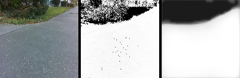

# Sémantická segmentace sjízdnosti (`backproject=nn`)

Převod **barva → pravděpodobnost sjízdnosti** je v ARBot3 za rozhraním
[`IBackProject`](../Src/ARBot.Common/Common/IBackProject.cs) a existují k němu tři implementace,
které se přepínají parametrem `backproject=`:

| | `hist` (výchozí) | `nn` | `npu` |
|---|---|---|---|
| třída | `BackProject` | `OnnxBackProject` | `RknnBackProject` |
| jak | zpětná projekce z histogramu barev (tabulka 4096 hodnot) | neuronová síť přes ONNX Runtime (CPU) | **tatáž síť na NPU RK3588** |
| rozlišení výstupu | plný snímek (640×480) | rozlišení modelu (128×128) | 128×128 |
| co potřebuje | nic | soubor `.onnx` (`nnmodel=`) | `.rknn` (`npumodel=`) + `librknnrt.so`, **jen Orange Pi** |
| čas / snímek (**Orange Pi**) | **2,5 ms** | **10,2 ms** | **3,3 ms** |
| čas / snímek (Windows x64) | 2,4 ms | 11,3 ms | — |

Všechny vrací **spojitou** hodnotu 0..255, ne rozhodnutí ano/ne — occupancy fúze pracuje v log-odds
a mezilehlé hodnoty umí využít.

✅ **Změřeno na Orange Pi 7. 9. 2026.** CPU cesta tam stojí **10,2 ms**, tedy prakticky totéž co na
vývojovém PC (A76 na 2,4 GHz zvládá int8 jádra ORT dobře). **NPU je 3,1× rychlejší (3,3 ms)** a za
běhu runtime stojí proti histogramu **jen +1,2 až +1,5 ms** — tedy skoro nic. Detaily:
[Naměřeno na zařízení](#-naměřeno-na-zařízení-7-9-2026-orange-pi-5-ultra).

## Model

V `models/` je model **Model61.1** přenesený z ARBot2 (únor 2021). Rozbor jeho TFLite souboru:

- **U-Net s MobileNetV2 bloky** (inverted residual: `expand` → `depthwise` → `project`),
  encoder 128 → 2 px, decoder zpět na 128 se skip-concat.
- 53× `Conv2D`, 24× `DepthwiseConv2D`, 6× `ResizeNearestNeighbor`, 4× `Concatenate`, `Logistic`.
- **112,5 MMAC** na snímek (MobileNetV2 @224² má pro srovnání ~300 MMAC).
- Vstup `[1,128,128,3]`, výstup `[1,128,128,2]`; **kanál 1 = sjízdno**.

Varianty souboru:

| soubor | k čemu |
|---|---|
| `Model61.1.tflite` | **dynamické tvary** (`Shape`→`StridedSlice`→`Mul`→`ResizeNN`) — deklarovaný výstup `[1,1,1,2]` je jen placeholder. Pro převod **nepoužitelný**. ⚠️ A **není to float**, ačkoli se to tu dřív psalo: `SaveTFLite` ho vyrábí s `optimizations=[Optimize.DEFAULT]` **bez** `representative_dataset`, tedy **dynamic-range kvantizací** — váhy int8, počítá se ve floatu. |
| `Model61.1_int8.tflite` | plně kvantovaný, statické tvary — **zdroj pro převod** |
| `Model61.1_int8.onnx` | převedený, int8 vnitřek (840 KB) — výchozí `nnmodel=` |
| `Model61.1_int8_deq.onnx` | **taky z `_int8.tflite`**, jen s `--dequantize`: kvantované váhy se rozbalí zpět do float (2,6 MB) — pro A/B |

⚠️ **`_deq` není původní float model.** Obě `.onnx` varianty pocházejí z **kvantovaného**
souboru; `--dequantize` jen rozbalí int8 váhy do float, takže **přesnost zůstává jako u int8**
a mění se jen aritmetika (a tím rychlost na dané platformě). **Referenční float model v repu
není žádný** — `Model61.1.tflite` má dynamické tvary *a* int8 váhy (viz tabulka výše).

### Odkud se berou ty dynamické tvary (a jak se jich zbavit)

Dekodér pětkrát zdvojnásobí rozlišení (`UpSampling2D(size=(2,2))`). `SaveTFLite` volá
`TFLiteConverter.from_keras_model(model)` **bez udání vstupního tvaru**, takže konvertor nemohl
spočítat vnitřní velikosti a místo *„zvětši na 8×8"* zapsal *„zjisti velikost vstupu, vynásob
dvěma a zvětši na to"* — odtud ten řetěz `Shape → StridedSlice → Mul → ResizeNN`, pětkrát.
Je to jako recept, který místo „forma 24 cm" říká „forma dvakrát širší než ta předchozí": upéct
se dá, ale **velikost výsledku z receptu nevyčteš**. Proto `tf2onnx` neprojde a proto soubor
deklaruje nesmyslný výstup 1×1 px.

**V tom souboru se to opravit nedá** (tvary tam jsou zapečené) — musí se **exportovat znovu
z Kerasu s pevným `tf.TensorSpec((1,128,128,3))`**, pak si exporter velikosti spočítá sám,
zapíše je jako konstanty a ten řetěz zmizí jako mrtvý kód. Hotové to má
[`Src/Colab/ExportFloatModel.ipynb`](../Src/Colab/ExportFloatModel.ipynb), který navíc **ověří,
že tvary jsou skutečně statické** (spočítá zbylé `Shape`/`Slice` uzly a pustí model na šumu),
místo aby to tvrdil.

EdgeTPU varianta (`*_edgetpu.tflite`) je kompilát pro Coral a **nekonvertuje se** — je to slepá
ulička, stejně jako celá třída `EdgeTPUSemanticSegmentation` (P/Invoke do `EdgeTPUDll.dll`,
jen `IsX64`), která v `ARBot.Common.csproj` zůstává vyřazená z překladu.

### ✅ Polovina toho výpočtu je zbytečná (9. 9. 2026)

Model61.1 stojí **112,5 MMAC**, ale **57,2 MMAC z toho stačí** — zbytek je práce, kterou lze
odstranit tak, že se na výsledku **nezmění ani jeden pixel**. Nic se nepřetrénovává. Dělá to
[`models/onnxopt.py`](../models/onnxopt.py) dvěma úpravami nad float ONNX:

| úprava | proč je exaktní | kolikrát |
|---|---|---|
| **Conv 1×1 se přesune před nearest-`Resize`** | nearest upsampling jen kopíruje pixely, konvoluce 1×1 pracuje pixel po pixelu — **komutují**, jen se to spočítá nad 4× menším obrazem | 6× (každý stage dekodéru začíná `UpSampling2D` a hned za ním je `expand`) |
| **dvě sousední Conv 1×1 bez nelinearity mezi nimi se sloučí** | `W2(W1x+b1)+b2 = (W2W1)x + (W2b1+b2)` | 16× |

**Naměřeno** (Windows x64, ONNX Runtime, 1 vlákno, `ORT_ENABLE_ALL`):

| model | MMAC | uzlů | soubor | inference p50 | rozdíl rozhodnutí |
|---|---|---|---|---|---|
| Model61.1 float | 112,5 → **57,2** (−49,2 %) | 138 → 122 | 2,63 → 1,79 MB | 3,29 → **2,09 ms** (−36 %) | **0** z 819 200 px |
| Model96.2 float | 3 836,6 → **2 125,3** (−44,6 %) | 65 → 53 | 2,05 → 1,25 MB | 62,7 → **38,0 ms** (−39 %) | **0** z 819 200 px |

Největší rozdíl pravděpodobnosti je 1,2 × 10⁻⁶, což je šum float32. **Kontrola je součástí
nástroje** (`--check`) a měří **shodu rozhodnutí**, ne shodu čísel — u přeskládané aritmetiky
se čísla lišit musí, rozhodnutí ne.

#### ✅ Potvrzeno měřidlem v repu (`ARBot.Analyze backproject --truth`, 9. 9. 2026)

| model | přesnost | IoU | precision | recall | FP | FN |
|---|---|---|---|---|---|---|
| `Model61.1_int8.onnx` (dnešní výchozí) | 88,23 % | 0,846 | 0,891 | 0,943 | 7,89 % | 3,88 % |
| `Model61.1_float.onnx` | 88,16 % | 0,844 | 0,894 | 0,938 | 7,61 % | 4,23 % |
| **`Model61.1_float_opt.onnx`** | **88,16 %** | **0,844** | **0,894** | **0,938** | **7,61 %** | **4,23 %** |
| `Model96.2_float.onnx` | 95,35 % | 0,935 | 0,953 | 0,981 | 3,32 % | 1,33 % |
| **`Model96.2_float_opt.onnx`** | **95,35 %** | **0,935** | **0,953** | **0,981** | **3,32 %** | **1,33 %** |

**Celý report je proti zdrojovému modelu shodný znak po znaku** — nejen souhrn, ale i všech
50 řádků per snímek a rozptylové percentily. Totéž platí nad **záznamem** (jiná data než
testset): shoda rozhodnutí s histogramem i podíl sjízdné plochy vyjdou na tři desetinná místa
stejně jako u zdroje (98,761 / 99,384 % resp. 65,002 / 35,870 %).

**Čas** (`ARBot.Analyze backproject <záznam> --limit=60`, Windows x64 **Release**, p50 přes obě
kamery — je to čas **celého** převodu barva → pravděpodobnost, ne jen inference):

| model | p50 | proti float |
|---|---|---|
| `Model61.1_int8.onnx` | 3,620 ms | |
| `Model61.1_int8_deq.onnx` | 2,714 ms | |
| `Model61.1_float.onnx` | 3,614 ms | |
| **`Model61.1_float_opt.onnx`** | **2,423 ms** | **−33 %** |
| `Model96.2_float.onnx` | 62,436 ms | |
| **`Model96.2_float_opt.onnx`** | **37,785 ms** | **−39 %** |
| histogram (pro kontext) | ~2,9 ms | |

⚠️ **Tahle časová čísla nejsou srovnatelná s dřívějšími** „11,3 / 6,9 / 8,0 ms"
[z 7. 9. 2026](#-a-za-skutečného-běhu-runtime-7-9-2026) — jiný stroj a jiný záznam, absolutně
jsou 3× nižší. **Relativní pořadí ale drží**: int8 na x86 prohrává s rozbaleným floatem
(3,62 : 2,71 dnes, 11,3 : 6,9 tehdy). Srovnávat se smí jen řádky v jedné tabulce.

**Odkud se ta redundance vzala:** `GenericModel20` staví MobileNetV2 blok, ale **bez
residuálního spojení** a s `expansion=1`. Lineární bottleneck (`project` conv záměrně bez
aktivace) má v MobileNetV2 smysl právě proto, že za ním je `add` residuálu; bez něj následuje
hned `expand` conv dalšího bloku — taky 1×1, taky lineární. **Dvě lineární mapy za sebou jsou
jedna lineární mapa**, takže polovina těch 1×1 konvolucí v modelu nepočítá nic navíc. Není to
chyba převodu — je to v samotné architektuře a `ORT_ENABLE_ALL` to nenajde (jinak by se časy
nezměnily).

⚠️ **Na int8/NPU cestu se to nedá přenést bez přeměření.** Sloučení zvětšuje rozsah vah
(`W2W1`) a ubírá jedno mezistupňové zaokrouhlení, takže kvantizaci může pomoct i uškodit.
Postup je: optimalizovat **float** ONNX → `onnx2rknn.py` → změřit `--truth`. `Model61.1_int8.onnx`
pochází z `.tflite`, tam se to použít nedá vůbec.

#### ✅ Zapnuto ve výchozí konfiguraci (9. 9. 2026)

`nnmodel=` má nově default **`models/Model61.1_int8_deq_opt.onnx`** (bylo `Model61.1_int8.onnx`).
Vybraný je podle měření — z variant vychází nejlépe na **obou** osách:

| `nnmodel=` | přesnost | IoU | čas p50 (3 běhy) |
|---|---|---|---|
| `Model61.1_int8.onnx` (dřívější default) | 88,23 % | 0,846 | 3,61 / 3,76 / 3,88 ms |
| `Model61.1_int8_deq.onnx` | 88,22 % | 0,845 | 2,70 ms |
| **`Model61.1_int8_deq_opt.onnx`** (dnešní) | **88,22 %** | **0,845** | **1,73 / 1,90 / 1,72 ms** |
| `Model61.1_float.onnx` | 88,16 % | 0,844 | 3,65 ms |
| `Model61.1_float_opt.onnx` | 88,16 % | 0,844 | 2,39 / 2,40 / 2,39 ms |

Proti dřívějšímu defaultu je to **−54 % času při přesnosti o 0,01 p. b. jinde**, tedy v šumu.
Varianta z `_int8_deq` je zvolená proto, že je z obou optimalizovaných **rychlejší i přesnější**
než ta z `_float`; „int8" v názvu znamená jen **odkud pochází** (z kvantovaného `.tflite`),
počítá se ve floatu.

⚠️ **Ten rozdíl 1,73 vs 2,39 ms je naměřený, ale NEVYSVĚTLENÝ.** Oba modely mají po optimalizaci
**týž graf** (122 uzlů, stejné typy operací, 57,2 MMAC) a liší se jen ve třech bias tenzorech
(224 hodnot z 436 tisíc), což čas vysvětlit nemůže. Hypotéza na denormalizovaná čísla ve vahách
je **vyvrácená měřením** (v obou modelech nula denormálů). Rozdíl je reprodukovatelný přes tři
běhy, takže to není šum — příčina je ale neznámá, a proto se na tom rozhodnutí nemá stavět víc,
než že „na Windows je tahle varianta rychlejší".

⚠️ **Na ARM to přeměřené NENÍ — a tam bylo pořadí obrácené.** Před optimalizací na Orange Pi:
int8 **10,2 ms**, `_deq` 15,0, float 16,1 (na x86 přitom int8 prohrával). Podíl −49 % násobení
by `_deq_opt` dostal na ~7,7 ms, tedy pod int8, ale **to je extrapolace, ne měření**. Staré
chování vrátí `nnmodel=models/Model61.1_int8.onnx`. Riziko je přitom malé: výchozí `backproject=`
je `hist`, a na zařízení se síť provozuje po cestě `npu`.

⚠️ **`npumodel=` optimalizovaný není.** `onnxopt.py` pracuje nad `.onnx`, takže nový `.rknn`
se musí převést z `Model61.1_float_opt.onnx` přes `onnx2rknn.py` — a to chce rknn-toolkit2 na
Linuxu. Navíc **není známo, kolik z těch −49 % NPU vůbec využije** (RKNN si plánuje sám).
Nejzajímavější je to u **Model96.2**, který dnes na NPU stojí 44 ms a půlí snímkovou frekvenci;
zdroj (`Model96.2_float_opt.onnx`) je připravený v `models/`.

**Hlídá to test, ne jen skript:** `VychoziModelZRegistruExistujeAJdeNacist` (chytí model
zapomenutý v repu nebo v nasazení — bez něj by se to poznalo teprve na robotu a vypadalo by to
jako porucha kamery) a `OptimalizovanyModelRozhodujeStejneJakoZdrojovy` (porovná výchozí model
se zdrojovým, takže regrese v `onnxopt.py` selže v testech, ne jako *tiše horší segmentace*).

⚠️ **V runtime to nejelo a na Pi nebylo.** Model má nezměněné I/O (`[1,128,128,3]` →
`[1,128,128,2]`, float, statické tvary), kontrakt `OnnxBackProject` splňuje, měřidlem v repu
prošel a testy jsou zelené — ale **běh runtime nad ním ani měření na zařízení neproběhly**.

**Praktický důsledek pro Model96.2:** ten dnes na NPU stojí 44 ms a **půlí snímkovou frekvenci**
(16,5 proti 29 sn/s). −45 % MMAC je přesně na tomhle místě nejzajímavější — ale jestli se úspora
na NPU projeví v témž podílu jako na CPU, není známo (RKNN plánuje sám).

### ✅ Mrtvé neurony: jsou, ale nejsou problém (9. 9. 2026)

Změřeno na `models/testset` (50 snímků) přes vyvedení všech 48 `Relu` tenzorů jako výstupů:
**28 ze 4 016 ReLU kanálů (0,70 %) je vždy nulových**, 31 (0,77 %) má nulu ve víc než 99 %
případů, 63 (1,57 %) ve víc než 90 %. Prořezání těch mrtvých by ušetřilo **1,94 MMAC = 1,7 %**,
tedy proti úpravě výše nic — **priorita je jasná a je to strukturální redundance, ne mrtvé váhy**.

Zajímavé je jejich **rozložení**: v encoderu nula až po poslední stupeň, a hustota roste tam,
kde je síť nejužší:

| blok | kanálů | mrtvých |
|---|---|---|
| `decoder_4_1`, `decoder_5_0` | 16 | **3 (19 %)** |
| `decoder_3_1` | 32 | 2 (6 %) |
| `decoder_0_0`, `decoder_0_1`, `encoder_5_1` | 128–256 | 3 (1–2 %) |

Poslední bloky dekodéru tedy jedou na **13 kanálech z 16**. Mrtvý `expand` kanál navíc zabíjí
i `depth` kanál za sebou (depthwise je per-kanál, takže nad konstantní nulou zbude jen bias) —
proto se u `decoder_3_1` / `decoder_4_0` / `decoder_4_1` / `decoder_5_0` mrtvé **indexy shodují**.

**Silnější nález než mrtvé neurony je ale redundance živých.** Z 16 kanálů, které vstupují do
`final_conv`, **stačí jeden**: postupná ablace (nulování sloupců váhy `final_conv`) vypne 15 z 16
a přesnost jde z **88,20 % na 88,18 %** (IoU 0,8451 → 0,8445); při 13 vypnutých je dokonce
*nepatrně lepší*. Důvod je změřený: ty kanály jsou kopie téhož signálu — mediánová korelace
mezi nimi je **|r| = 0,98** (74 % párů nad 0,95) a **97,2 % rozptylu je v jedné hlavní
komponentě**, 99,7 % ve dvou.

⚠️ **Neznamená to, že se ty bloky dají odstranit** — to se zkusilo a rozbije to model
(přeskočení `decoder_5_1` sráží přesnost na 13,6 %). Informace tam teče, jen je na výstupu
zploštěná do jednoho směru. Znamená to, že **poslední bloky dekodéru jsou předimenzované na
kanály** a při přetrénování by 16 → 4 nemělo nic ztratit; jsou to přitom nejdražší uzly modelu
(4 × 4,19 MMAC na plném 128×128).

## Proč ONNX Runtime

Model je TFLite, takže nasnadě je TFLite runtime — ten by ale znamenal **vlastní nativní knihovnu
na obě platformy** (Windows x64 pro simulaci, ARM64 pro zařízení) a k tomu managed wrapper.
NuGet `Microsoft.ML.OnnxRuntime` nese nativní knihovnu pro `win-x64` i `linux-arm64` v jednom
balíčku, takže **v simulaci i na robotu běží týž kód** — a to je u téhle vrstvy podstatnější než
poslední milisekunda: vizuální cestu se ladí nad záznamy na Windows.

Cena: publish pro OrangePI naroste ze 45 MB na **70 MB** (`libonnxruntime.so` má 24,5 MB).

Na NPU jde tatáž síť přes `librknnrt.so` — jiná knihovna, tentýž kontrakt a týž postprocessing;
viz [NPU](#npu-backprojectnpu).

## Kontrakt modelu: float na hranici, int8 uvnitř

`OnnxBackProject` **vědomě nepodporuje kvantované I/O** a na model s `uint8` vstupem zahlásí chybu.
Důvod: kvantovaný vstup znamená, že volající musí znát `scale` a `zero_point` modelu a kvantizovat
sám — přesně to dělal ARBot2 ručně v C++ (`EdgeTPUDll/EdgeTPU.cpp`). Špatná konstanta by se
neprojevila jako chyba, ale jako **tiše horší segmentace**.

Skript `models/tflite2onnx.py` proto po převodu **zahodí úvodní `DequantizeLinear` a závěrečný
`QuantizeLinear`**: vnitřek modelu zůstane int8, ale na hranici se mluví v reálných jednotkách —
vstup 0..1, výstup pravděpodobnost. C# strana pak nemá žádné magické konstanty.

U tohoto modelu byla vstupní kvantizace `scale=0,00452162  zero_point=9`, tedy **ne** identita
0..255 → posílat syrové bajty by byl systematický posun (gain 1,15, offset −0,04).

### Převod

```bash
python -m venv .venv && .venv/bin/pip install tensorflow-cpu==2.15.1 tf2onnx==1.16.1 onnx==1.16.1 onnxruntime
.venv/bin/python models/tflite2onnx.py models/Model61.1_int8.tflite models/Model61.1_int8.onnx --check <obrazek.png>
```

Na Windows to nejde (tf2onnx potřebuje TensorFlow a Python 3.11) — dělá se to **ve WSL**,
stejně jako cross-compile nativní knihovny (viz [build-and-platforms.md](build-and-platforms.md)).

`--check` porovná výsledek proti původnímu TFLite. Naměřeno při zavedení:
**shoda rozhodnutí 99,1 %**, průměrný rozdíl pravděpodobnosti 0,011 (na reálném obrázku;
na náhodném šumu je rozdíl větší, ale tam je model nerozhodný a číslo nic neznamená).

## Předzpracování a postprocessing

Původně převzaté z ARBot2 (`EdgeTPUDll/EdgeTPU.cpp`, funkce `SemanticSegmentation`) jako jediné
reference, jak byl model **skutečně používán**. ✅ **Od 7. 9. 2026 je to potvrzené proti tréninku**
(viz [Jak model vznikl](#jak-model-vznikl-trénovací-notebook)) — ARBot2 to opsal správně:

- **Pořadí kanálů RGB.** Zdroj je `BGR32` (bajty B, G, R, X) a do tenzoru se plnilo
  `src[+2], src[+1], src[+0]`. Trénink čte obrázky `tf.image.decode_jpeg`, což dává **RGB** —
  takže tady už není co měřit a přepínač `nnchannels=rgb|bgr` zůstává jen jako pojistka pro
  jiný model. *(Dokud se to nevědělo, byl to reálný risk: na šedivé cestě a zelené trávě se obě
  pořadí liší jen o jednotky procent, protože R a B jsou u obojího nízké, takže **omyl by nebyl
  vidět jako chyba**.)*
- **Normalizace `v/255`**, kvantizaci si dělá model sám (viz výše). Trénink dělá
  `tf.image.convert_image_dtype(..., tf.float32)`, tedy rovněž 0..1.
- **Výstup se normalizuje součtem kanálů.** Není to kosmetika: ARBot2 rozhodovalo
  `out[0] < out[1]`, kdežto práh 128 nad surovým kanálem 1 by dal **jiný výsledek** — model končí
  sigmoidou, takže součet kanálů není přesně 1 (naměřený rozsah 0,85 až 1,18). Po normalizaci
  odpovídá práh 128 přesně původnímu rozhodnutí. Hlídá to test
  `FillProbability_PrahJeStejneRozhodnutiJakoArgmax`.

### ✅ Změřeno, co se z postprocessingu dá vytěžit (9. 9. 2026)

Tři věci, které se nabízejí jako „zlepšení zdarma" — a jen jedna z nich něco dá:

| varianta | přesnost | IoU | FP (vymyšlená cesta) |
|---|---|---|---|
| **normalizace součtem, práh 128/255** (dnešní provozní bod) | 88,20 % | 0,8451 | 7,45 % |
| softmax místo normalizace součtem | 88,22 % | 0,8454 | 7,50 % |
| `out[1] > out[0]` (přímo jako ARBot2) | 88,22 % | 0,8454 | 7,50 % |
| flip-TTA (dvě inference na snímek) | 88,27 % | 0,8457 | 7,33 % |
| práh **0,40** místo 0,50 | **88,65 %** | **0,8565** | **10,38 %** |
| práh 0,625 | 86,63 % | 0,8163 | **4,05 %** |

- **Softmax by nepomohl** (+0,02 p. b.) — dnešní normalizace součtem je tedy v pořádku
  a rozhodnutí ji nechat je teď podložené měřením, ne úsudkem.
- **Flip-TTA je zamítnutá měřením**: +0,07 p. b. za **dvojnásobek** ceny inference. Nezkoušet.
- **Práh 0,5 opravdu není optimum** — 0,40 dá +0,45 p. b. a +0,011 IoU. ⚠️ **Ale je to horší
  provozní bod pro robota**, ne lepší: falešně přidaná cesta jde ze 7,45 na 10,38 %, a to je
  ta *nebezpečná* chyba (viz `SegmentationMetrics`). Zajímavý je spíš opačný směr —
  práh 0,625 srazí FP na **4,05 %** (recall 0,86) za 1,6 p. b. přesnosti. **Je to volba
  provozního bodu, ne oprava**, a rozhodnout ji má měření za jízdy, ne per-pixel přesnost
  na stojícím robotu.

⚠️ **Hodnota, kterou occupancy fúze bere jako důvěru, není kalibrovaná pravděpodobnost.**
Změřeno po koších (ECE 0,049, ale rozdělené systematicky): v pásmu **0,20–0,30** model tvrdí
~26 % a cesta tam je ve **1,6 %** případů, v pásmu 0,30–0,40 tvrdí 35 % proti skutečným 20 %,
kdežto v pásmu **0,40–0,50** tvrdí 44 % proti skutečným **53 %**. Nad 0,8 už sedí na jednotky
promile. Do log-odds gridu tedy jde v dolní polovině **příliš mírné** „tady cesta není".
Léčba je jednoparametrová (teplota/Plattova kalibrace nad tou 50snímkovou sadou), ale
⚠️ **měřit se to musí na datech z D435** — tahle sada je z kamery ARBot2 z let 2019–2022.

## Zapojení do pipeline

`ARBotRuntime.BuildBackProject()` vybere implementaci podle `backproject=` a **každá kamera
dostane vlastní instanci** — `Process` běží synchronně na vlákně své kamery a obě implementace
drží předalokované buffery, takže sdílená instance by si data přepisovala. `OnnxBackProject` je
`IDisposable` (drží nativní session) a uklízí se spolu s `CameraFrameProcessor`.

**Chybějící nebo vadný model je chyba při startu, ne tichý návrat k histogramu** — stejný důvod
jako u neznámého klíče v profilu ([configuration.md](configuration.md)): tichý fallback by
znamenal, že A/B měření sítě by nepozorovaně měřilo histogram.

`Process` v ustáleném stavu **nealokuje** (vstup i výstup jsou `OrtValue` nad vlastními poli);
hlídá to test `Process_NealokujeVUstalenemStavu` s limitem 1 kB na snímek.

### ⚠️ Síť mění rozlišení pravděpodobnostního obrazu

Histogram vrací plný snímek (640×480), síť **128×128**. `CameraFrameProcessor` to unese —
`Size()` řídí, jak velký obraz se alokuje, a `PathEdges(prob, sx, sy)` dostává škálování — ale
mění se tím **hustota dat** pro occupancy grid i pro hranice cesty. Jeden pixel výstupu sítě
odpovídá zhruba 5×4 px původního snímku. Co to udělá s přesností hranic koridoru
([map-correlation-localization.md](map-correlation-localization.md)), **naměřené není**.

Navíc se snímek 640×480 zmenšuje na čtvercových 128×128, tedy **s deformací poměru stran**.

⚠️ **Neopravovat — je to replika tréninku, ne nedbalost.** Notebook zmenšuje celý snímek
z kamery na `shape=(128, 128)`, tedy dělá **tentýž squash 4:3 → 1:1**. Vstup 160×128 „se
správným poměrem stran" by modelu vnutil geometrii, jakou nikdy neviděl. Ze stejného důvodu
není zdarma ani vyšší rozlišení (256×256): encoder zmenšuje 64× a byl trénovaný na tom, jak
velké jsou objekty ve 128×128 — změna rozlišení mění vztah receptivního pole k velikosti
objektů. Obojí je tedy **věc přetrénování, ne konfigurace**.

Souhlasí i **metoda zmenšení**: trénink používá `tf.image.resize(..., method='nearest')`
a [`Image.Resize`](../Src/ARBot.Common/Common/Image.cs) je nearest-neighbour se `floor`.
Přechod na plošné průměrování (area/bilinear) by byl odchylka od tréninku — mohl by pomoct,
ale musel by se změřit, ne předpokládat.

## Jak model vznikl (trénovací notebook)

`Src/Colab/SemanticSegmentation.ipynb` (do repa 7. 9. 2026) je **Colab notebook, ve kterém
Model61.1 vznikl** — historie ~40 architektur, trénink, kvantizace, export do TFLite. Do té doby
byl model černá skříňka a ARBot2 jediná stopa; teď se dá dohledat, co je záměr a co náhoda.

**Data:** LabelBox projekt `ck2iqtrixgi6z08113jpu9imr`, maska **bílá = sjízdno (1)**, ostatní 0.
Testovací sada je **pevný seznam 50 snímků** vyjmenovaný jmény přímo v notebooku (cela 13),
zbytek je trénink — takže je to **reprodukovatelné rozdělení**, ne náhodné při každém běhu.
Data jsou z let 2019–2022 (podle id), tedy z kamery ARBot2, ne z dnešní D435.

**Augmentace:** náhodný zoom-crop 0,5–1,0 z celého snímku, převrácení vlevo/vpravo, jasnost
±0,2, kontrast 0,8–1,0, saturace 0,8–1,2, gaussovský šum σ = 5/255. Žádná rotace. CLAHE je
v kódu, ale **zakomentované** — použilo se jen u Model96.1.

⚠️ **Klíč k LabelBoxu do notebooku nepatří** — čte se z Colab Secrets / proměnné prostředí
(`LABELBOX_API_KEY`). Proč, a co se stalo, je v [CLAUDE.md](../CLAUDE.md).

⚠️ **Data se tím notebookem už stáhnout nedají** (změřeno 7. 9. 2026): `DownloadLabelBox2` stojí
na `project.label_generator()` a ten dotaz **na serveru LabelBoxu neexistuje** — vrací
`GraphQL validation error`. Klíč ani oprávnění v tom nejsou, `get_project()` projde. Připnutí
starého SDK nepomůže, protože se změnila serverová strana. Dnešní cesta je
`project.export()` → `ExportTask` → `get_buffered_stream()` a hotovou ji má
[`Src/Colab/ExportTestSet.ipynb`](../Src/Colab/ExportTestSet.ipynb); odtud se dá převzít, až
bude potřeba stáhnout **trénovací** data (my zatím potřebujeme jen testovací sadu).
Praktický důsledek: **trénink se dnes nedá zopakovat jedním kliknutím** — ta cela se musí
nejdřív přepsat.

### Model61.1 nebyl nejlepší — byl nejlepší, co se vešlo do Coralu

Přesnosti jsou v názvech souborů vah (metrika `sparse_categorical_accuracy`, tedy **per-pixel
přesnost** na té 50snímkové sadě, ne IoU):

| model | přesnost | architektura |
|---|---|---|
| **Model61.1** (v `models/`) | **0,9546** | `GenericModel20`, 6 stupňů, kanály 8→256, kernel 3 |
| Model61.3 | 0,9599 | **táž architektura**, jiný běh |
| Model96.1 | 0,9657 | `GenericModel25`, 2 stupně, 128 kanálů, **kernel 9**, s CLAHE |
| **Model96.2** | **0,9682** | totéž bez CLAHE |

A je tam napsané, proč se do ARBot2 dostal ten slabší — u modelů s kernelem 9:

> „kernel 9x9 daval pekne vysledky, bohuzel po kvantizaci model nebezel na Google Coral"

**Ta podmínka dnes neplatí** (Coral je pryč, jedeme ONNX). Cena je ale jinde: Model96.2 zmenšuje
obraz jen 4× a drží 128 kanálů i na plném 128×128, takže **jedna** jeho 1×1 konvoluce 128→128
stojí ~270 MMAC — víc než **celý** Model61.1 (112,5 MMAC). Odhad celku je **řádově 2–3 GMAC,
tedy 20–30× dražší**; na CPU Orange Pi to je mimo hru a je to kandidát **až pro NPU**. Přesné
číslo dá profilovací cela notebooku (počítá FLOPs), to je práce pro Colab.

**Model61.3 je proti tomu zajímavý hned:** shodné volání `GenericModel20` se shodným encoderem
i decoderem, tedy **stejná cena**, o 0,5 p. b. lepší. Jeho váhy/TFLite jsou na Google Drive
autora, ne v repu — kdyby se pořídily, je to výměna souboru a `nnmodel=`.

### V notebooku je i měřidlo proti pravdě

Vedle sítí je tam **histogram jako Keras vrstva** (`BackProjectModel` / `BackProjectLayer`, LUT
16×16×16 nad 4bitovým RGB) a `ModelAccuracy()`. Tím se vyrobilo srovnání „síť ~96 % proti
histogramu ~80 %" a **tím se dá zavřít otevřená otázka kvality** — proti ground truth, ne jen
shodou dvou metod, jak to dnes umí `ARBot.Analyze backproject`.

⚠️ **To „80 %" ale není číslo našeho dnešního histogramu.** LUT v notebooku je **binární** (0/1),
kdežto ARBot3 jede na **odstupňované** tabulce `BackProject.RoadProbability` (hodnoty 0–255)
a s jiným pořadím osí indexu. Jsou to dva různé histogramy; než se to číslo použije jako
srovnávací základ, musí se přeměřit s naší tabulkou.

*(Pozor na jména: v `BackProject` jsou tabulky **dvě** a ta jménem `RoadProbabilityNew` je
**nepoužitá** — runtime i všechna měřidla berou `RoadProbability`, viz
`ARBotRuntime.BuildBackProject()`. „New" tedy neznamená „aktuální".)*

### ⚠️ Co v tom notebooku nesedí (rozbor 9. 9. 2026)

Přečtené celé (76 cel). Nálezy setříděné podle toho, jak moc mohly ovlivnit **Model61.1**:

**1. Ztráta výstupu: `sigmoid` + `sparse_categorical_crossentropy`.** `final_conv` končí
sigmoidou, ale loss je SCC, která čeká rozdělení sčítající se na 1. Keras to **tiše srovná**:
při `from_logits=False` výstup zlogaritmuje a pošle do `sparse_softmax_cross_entropy_with_logits`,
a `softmax(log p)ᵢ = pᵢ/Σp`, tedy **normalizaci součtem** — takže se to naučí, ale gradient jde
přes saturující sigmoidu, ne přes softmax. Odtud pochází ten součet 0,85–1,18,
kvůli kterému musí `FillProbability` normalizovat. **Správně je `softmax`** (nebo `linear` +
`from_logits=True`); ⚠️ znamená to přetrénování a naměřený zisk z toho **není** (viz
[postprocessing](#-změřeno-co-se-z-postprocessingu-dá-vytěžit-9-9-2026): softmax na hotovém
modelu dá +0,02 p. b.).

**2. Validační sada = testovací sada.** `Trainer.Train` ukládá checkpoint, kdykoli
`val_sparse_categorical_accuracy` překročí dosavadní maximum — a validuje se na `test_dataset`,
tedy na těch **stejných 50 snímcích**, ze kterých pak vznikne číslo v názvu souboru. Hodnota
0,9546 je proto **výběrové maximum přes ~1000 epoch**, nikoli nezávislý odhad. Je to skutečná
metodická vada, ale ⚠️ **jako vysvětlení mezery 88,2 vs 95,5 % má malou váhu**: u Model96.2
vzniklo číslo týmž postupem a mezera tam
[není](#-mezera-882-vs-955--u-model611-jiná-trénovací-sada-uzavřeno-7-9-2026).

**3. Dropout 0,2 uvnitř každého MobileNet bloku.** `GenericModel20` vkládá `Dropout` **před
každou** konvolucí, tedy **77 dropout vrstev** v řadě (spočítáno). Do MobileNetV2 bloků dropout
nepatří (originál ho má jen před klasifikátorem) a v kombinaci s chybějícím residuálem je to
kandidát na vysvětlení, proč jsou mrtvé kanály zrovna v nejužších blocích dekodéru. Neověřené —
šlo by to jen přetrénováním.

**4. `random_contrast(lower=0.8, upper=1)`** — kontrast se v augmentaci jen **snižuje**, nikdy
nezvyšuje, kdežto saturace i jasnost jsou symetrické (0,8–1,2 resp. ±0,2). Vypadá to jako
překlep (`1` místo `1.2`), ne jako záměr.

**5. Obrázky se pro trénink zmenšují `method='nearest'`** (`load_images2`), zatímco starší
`load_images` používal `'area'`. Nearest při 640×480 → 128×128 zahodí 96 % pixelů a přinese
alias. **Neopravovat samo o sobě** — naše `Zmensi` v pipeline je s tím schválně srovnané
(viz [Síť mění rozlišení](#-síť-mění-rozlišení-pravděpodobnostního-obrazu)); změna má smysl
jen jako pár „přetrénovat + přepnout pipeline".

**6. Latentní pasti, které Model61.1 neovlivnily**, ale kousnou toho, kdo notebook rozjede:

- **`GenericModel25` je definovaný dvakrát** (cela 26 a 31) s **různými signaturami** —
  ta pozdější má navíc `kernel_reg, use_bias` na 4. a 5. místě. Volání Model82–100 jsou psaná
  pro tu první, takže po spuštění cely 31 se argumenty **posunou** (`kernel_reg=1`,
  `use_bias=0.99`, `momentum='float32'`) a vznikne jiný model, nebo to spadne. **Záleží na
  pořadí spuštění cel** — přesně ten druh chyby, který se v notebooku nepozná.
- **QAT cela používá `SparseCategoricalCrossentropy(from_logits=True)`** nad modelem, který
  **končí sigmoidou** — tedy softmax nad sigmoidou, dvojitá aktivace.
- **`SaveDataSet` prohání data `tf.keras.preprocessing.image.array_to_img`**, což každý obrázek
  **normalizuje na plný rozsah** (`x -= min; x /= max`). U snímků to mění kontrast, u masek je
  to horší: maska, kde je **všechno** sjízdné (konstanta 1), vyjde po `x -= min` jako **celá
  nesjízdná**. Takhle vznikl `ds_train1`, na kterém se dělal QAT.
- **`display()`** má dvě chyby v mrtvé větvi: `isinstance(n.dtype, np.float32)` je vždy `False`
  (má být `n.dtype == np.float32`) a uvnitř je `min()`/`max()` builtin nad 2D polem, což by
  skončilo výjimkou. Kdyby ta podmínka někdy prošla, spadne to.
- **Cely 68–70, 73–75** jsou nefunkční zbytky (`show_predictions(train, 50)` s prohozenými
  argumenty, `tf.graph_util` s neexistujícím `sess`, hls4ml experiment).

### ✅ Promítnuto do notebooku (9. 9. 2026)

Opraveno **v notebooku**, s komentářem u každé změny (proč to byla chyba a co z toho plynulo);
výstupy změněných cel jsou smazané, aby neukazovaly výsledek jiného kódu, u ostatních zůstaly.

| co | jak |
|---|---|
| `random_contrast(upper=1)` | → `1.2`, symetricky jako saturace a jasnost |
| obraz se zmenšoval `nearest` | → `area` (label zůstává `nearest` — u indexu třídy by průměr vyrobil neexistující třídy). ⚠️ **Párová změna**: kdo přetrénuje, musí přepnout i `Zmensi` v pipeline |
| **validace = testovací sada** | přidána `fnVal` — 50 snímků **vyčleněných z tréninku** s pevným seedem; `fnTest` se **nemění** (visí na něm `models/testset` i `ExportTestSet.ipynb`). `Trainer.Train` má parametr `valDS`, testovací sada se použije **jedinkrát**, až na konci |
| `SaveTFLite` „float" větev | `Optimize.DEFAULT` pryč (byla to dynamic-range kvantizace) **a** pevný vstupní tvar přes `concrete_function` — takže už nevzniknou ty [dynamické tvary](#odkud-se-berou-ty-dynamické-tvary-a-jak-se-jich-zbavit) |
| `SaveDataSet` přes `array_to_img` | explicitní škálování; maska „všechno je cesta" už nevyjde jako „nic není cesta" |
| dvojí `GenericModel25` | pozdější (pro MyNet) přejmenována na **`GenericModel25b`**, včetně obou volání. Ověřeno, že žádné jiné volání na ni neukazovalo |
| QAT `from_logits=True` nad sigmoidou | → `False` |
| `display()` mrtvá větev | `n.dtype == np.float32`, `np.min`/`np.max` místo builtinů, ochrana proti dělení nulou |
| cely 68–70 | doplněn chybějící argument `model`, TF1 kód se `sess` zakomentován s vysvětlením |

**`GenericModel20` je nedotčená** — je to definice Model61.1 a její změnou by se ten model
přestal dát postavit. Opravy architektury jsou proto v nové **`GenericModel27`** (nová cela
i s markdownem, který rozdíly vysvětluje): residuální `Add` kdekoli to jde, `project` konvoluce
se vynechá tam, kde je redundantní, **`expand` v dekodéru se počítá před `UpSampling2D`**
(komutuje s ním), `softmax` místo sigmoidy, dropout výchozí 0, debug výpisy pryč.

**Ověřeno bez TensorFlow** (na Pythonu 3.13 nejde) mockem Kerasu, který sleduje tvary a sčítá
násobení — na konfiguraci Model61.1 vrátí u `GenericModel20` přesně **112,5 MMAC**, tedy
skutečnou cenu modelu, takže jeho číslům lze věřit:

| architektura | konfigurace | MMAC | konvolucí | `Add` | `Dropout` |
|---|---|---|---|---|---|
| `GenericModel20` | Model61.1 | **112,5** | 77 | 0 | **77** |
| `GenericModel27` | **tatáž** | **60,1** (−47 %) | 60 | 7 | 0 |
| `GenericModel27` | `Model105.1` (návrh) | 60,4 | 60 | 7 | 0 |
| `GenericModel27` | trojice v encoderu | 102,7 | 78 | 13 | 0 |

Těch 60,1 MMAC je těsně nad 57,2, na které jde srazit hotový Model61.1 přes `onnxopt.py` —
rozdíl je právě cena těch sedmi `project` konvolucí, které mají za sebou `Add`, a tam už
redundantní nejsou. ⚠️ **Mock přitom vyvrátil dvě věci, které se sem předtím napsaly:** dropout
vrstev je **77**, ne ~36, a **při dvou blocích na stupeň nevznikne v encoderu ani jeden
residuál** (poslední blok stupně má stride 2, první mění šířku) — všech 7 je v dekodéru.
Encoderové residuály začnou vznikat teprve při třech blocích na stupeň, což stojí +70 %.

⚠️ **Z `GenericModel27` nebyl natrénován žádný model.** Je to návrh; jak si stojí v přesnosti,
se neví, a `Model105.1` je v notebooku zakomentované volání. Trénink navíc nelze spustit
jedním kliknutím, dokud se nepřepíše stahování dat z LabelBoxu (viz výše).

## Jak měřit

Dvě různé otázky, dvě různá měřidla — a **nesmí se zaměnit**: shoda s histogramem říká, jak moc
se metody rozcházejí, přesnost proti pravdě říká, **která se mýlí**.

**Proti pravdě** (`models/testset/`, od 7. 9. 2026):

```bash
ARBot.Analyze backproject --truth=models/testset [--png=<prefix>]
```

Záznam nepotřebuje. Vypíše pro **síť i histogram** přesnost per-pixel, **IoU**, precision a recall
— souhrnně i per snímek — a s `--png` uloží srovnání **nejhoršího** snímku (vstup | pravda |
histogram | síť); průměr totiž neřekne, *jak* se metoda mýlí, a to je to, co se opravuje.

Hlavní čísla jsou **na rozměru výstupu sítě (128×128)** s pravdou zmenšenou nejbližším sousedem —
tak to počítal notebook, jinak by nebyla srovnatelná s jeho 0,9546. Histogram se měří **i v plném
rozlišení**, protože to je jeho skutečný provozní bod; ty dvě sekce výstupu se nesmí míchat.

⚠️ **Přesnost per-pixel je u téhle úlohy zrádná sama pro sebe:** když je na snímku 80 % plochy
sjízdné, odpověď „všechno je cesta" má přesnost 0,80. Proto se tiskne i IoU a rozpad chyby na
**cestu přidanou, kde není** (nebezpečné) a **cestu zamlčenou** (jen opatrné) — to jsou různě
drahé chyby. Jádro měření je [`SegmentationMetrics`](../Src/ARBot.Common/Vision/SegmentationMetrics.cs)
v `Common`, ne v nástroji, **aby šlo testovat proti známým odpovědím** (9 testů): špatně počítaná
metrika se neprojeví jako chyba, ale jako výsledek, který vypadá rozumně.

Formát sady a jak ji pořídit: [`models/testset/README.md`](../models/testset/README.md).

### ✅ Naměřeno proti pravdě (7. 9. 2026, 50 snímků, na rozměru sítě)

| | přesnost | IoU | precision | recall | cesta přidaná (FP) | cesta zamlčená (FN) |
|---|---|---|---|---|---|---|
| **síť** (`Model61.1_int8`) | **88,2 %** | **0,846** | 0,891 | 0,943 | **7,9 %** | 3,9 % |
| histogram | 78,0 % | 0,752 | 0,767 | 0,975 | **20,3 %** | 1,7 % |
| „všechno je cesta" | 68,7 % | — | — | — | — | — |

**Síť vyhrává, a rozhoduje o tom ta správná chyba:** histogram **vymýšlí cestu, kde není,
2,6× častěji** (20,3 % proti 7,9 % plochy) — a to je u robota ta nebezpečná chyba. Jeho o málo
lepší recall (0,975) je jen důsledek toho, že říká „cesta" skoro všude: medián jeho predikce je
92,2 % plochy proti pravdě 83,2 %.

**Bez toho triviálního řádku by se to číslo přečetlo špatně.** Odpověď „všechno je cesta" má na
téhle sadě přesnost **68,7 %**, takže histogramových 78 % je nad nicneděláním jen o 9 p. b.,
zatímco síť o 19,5. Proto se přesnost per-pixel netiskne samotná.

**Histogram vyšel 78,0 % proti ~80 % z notebooku** — tak blízko, že to potvrzuje celý měřicí
řetěz (naše odstupňovaná LUT si vede skoro stejně jako binární z notebooku).

### ✅ Mezera 88,2 vs 95,5 % u Model61.1: jiná trénovací sada (uzavřeno 7. 9. 2026)

Číslo v názvu vah slibuje 95,5 %, na naší cestě model dává 88,2 %. **Vysvětlení podal autor:
trénovací sada se v čase měnila, takže Model61.1 (únor 2021) byl skoro jistě trénován
i testován na JINÝCH datech než Model96.2 a než dnešní `models/testset`.** Ta dvě čísla se tedy
neporovnávají — každé platí na jiné sadě.

Sedí to se dvěma nezávislými pozorováními:

- Seznam `fnTest` v notebooku obsahuje id z **června 2022**, ačkoli model je z **února 2021** —
  tehdejší testovací sada byla nutně jiná a dnes ji nelze zrekonstruovat.
- **Model96.2 mezeru NEMÁ**: notebook 0,9682, checkpoint v názvu 0,9643, naše měření **0,9680**.
  Prošel přitom **toutéž cestou** (týž export, totéž předzpracování, tentýž nástroj) — kdyby
  chyba byla v ní, projevila by se u obou.

⚠️ **K tomu 0,9680 patří upozornění (9. 9. 2026): je to `Model96.2.onnx` (z `.tflite`), ne
`Model96.2_float.onnx` (z `.h5`) — a ty dva NEJSOU tentýž model.** Změřeno týmž měřidlem:

| soubor | zdroj | přesnost | IoU |
|---|---|---|---|
| `Model96.2.onnx` | `.tflite`, dynamic-range | **96,80 %** | 0,955 |
| `Model96.2_float.onnx` | `.h5` přes `keras2onnx.py` | **95,35 %** | 0,935 |

**Jsou to jiné váhy, ne jiný převod:** dvě vrstvy, které jsou ve float v obou souborech (první
`Conv` 3→128 a `final_conv` 128→2), se liší o **4,2 %**; chyba převodu by dala nulu nebo
prohozené kanály, ne malý rozptýlený rozdíl. Sedí to i s názvy: `.h5` v repu nese **0,9643**,
kdežto notebook u Model96.2 uvádí **0,9682**, takže `.tflite` pochází z **lepšího checkpointu**,
který jako `.h5` v repu **není**. To „naše měření 0,9680" tedy platí, jen se váže na soubor
z `.tflite`.

⚠️ **A z toho plyne otevřená nesrovnalost u NPU:** dokumentace vede
`Model96.2_float.onnx` jako **zdroj pro `Model96.2.rknn`**, ale ten float model na CPU dává
95,35 %, kdežto RKNN varianta má naměřeno **96,66 %**. Kvantizace do fp16 model o 1,3 p. b.
zlepšit nemůže, takže **buď je ta stopa o zdroji nepřesná, nebo se to číslo měřilo jinak**.
Rozhodne to jen běh na Pi — bez NPU se to odsud neověří.

⚠️ **Je to vysvětlení, ne důkaz.** Dohledat by to šlo jedině porovnáním časů modelu a datasetu
v LabelBoxu; **rozhodnutí autora je nedohledávat to a brát to jako fakt**. Praktický důsledek:
u Model61.1 se **nesmí tvrdit „model dává 95 %"** — na dnešní sadě dává 88,2 % a to je to jediné
číslo, které o něm něco vypovídá.

Cesta k tomu závěru je proměřená, tohle **nezkoušej znovu**:

| hypotéza | verdikt |
|---|---|
| **kvantizace** (int8 proti float) | ❌ float model z `.h5` dá **88,16 %** proti int8 **88,23 %** — rozdíl 0,07 p. b., a float je o vlásek *horší* |
| **jiný checkpoint** v `.tflite` | ❌ měřeno přímo na `.h5`, jehož jméno to číslo nese |
| **naše rekonstrukce sady** | ❌ na **originálním `ds_train`** vyjde **88,15 %**, na našem exportu 88,16 % — export je věrný |
| **pořadí kanálů** | ❌ RGB 88,2 % proti BGR **77,2 %**; RGB je správně (dřív jen odvozeno z tréninku, teď změřeno) |
| **vzorkování při zmenšení** | ❌ střed bloku (jako `tf.image.resize`) proti rohu (jako `Image.Resize`) dá 88,22 vs 88,16 % — **0,06 p. b.** |
| **novější snímky v sadě jsou těžší** | ❌ naopak: na `cl4*` (2022) má síť 89,6 %, na `ck*` (2019–21) jen 87,4 % |

`--truththreshold=` (masky 0/1 v `ds_train` proti 0/255 v `models/testset`) a `--resizecenter`
zůstaly v nástroji právě proto, aby se ta měření dala zopakovat.

Poslední neproměřená cesta byla „změřit to jejich kódem" (`ModelAccuracy` v Colabu nad `.h5`).
**Nedělá se** — odpověď už dalo vysvětlení výše a i kdyby jejich metrika dala 95 %, řeklo by to
jen to, co víme: že platí na jiné sadě.

### ⚠️ Verdikt „síť vyhrává" není napříč sadou stejný

| podmnožina | síť | histogram |
|---|---|---|
| `ck*` — 32 snímků, 2019–2021 | **87,4 % / IoU 0,812** | 71,2 % / 0,659 |
| `cl4*` — 18 snímků, červen 2022 | 89,6 % / 0,886 | **90,3 % / 0,899** |

**Na novějších snímcích je histogram nepatrně lepší než síť.** Celkovou výhru sítě tedy táhne
starší, rozmanitější část sady; na novější části jsou obě metody vyrovnané. Než se z toho udělá
závěr o kvalitě, chybí popis těch dvou podmnožin — proč jsou pro barvu snadné.

**Histogram v plném rozlišení dá 78,2 % / IoU 0,754**, tedy proti 128×128 rozdíl v šumu — zmenšení
na rozměr sítě ho na téhle metrice **nestojí nic**. O přesnosti *hranic* to nevypovídá, ta se měří
jinde ([map-correlation-localization.md](map-correlation-localization.md)).

**Nejhorší snímek je poučný sám o sobě**
([obrázek](media/truth-ckhfbvg54001g3r63mnib1vhv.png)): listnatý lesní podklad, kde pravda říká
**nic není sjízdné** — a histogram tvrdí 93 %, protože suché listí mu padá do barev cesty. Síť dá
25 %. Je to zároveň důkaz, že ta nulová maska je **správná, ne rozbitá**.

**Nad záznamem** (shoda s histogramem, čas na tomto stroji):

```bash
ARBot.Analyze backproject <zaznam.rec> --limit=80 --png=<prefix>
```

Vypíše — **za každou kameru zvlášť** — čas obou převodů, **shodu rozhodnutí** při prahu 128
a podíl sjízdné plochy; `--png` uloží jeden obrázek se vstupem, histogramem a sítí vedle sebe.
`--model=` vybere jiný model, `--bgr` přehodí pořadí kanálů, `--skip` se podívá dál do záznamu
(prvních pár desítek snímků často pochází z jednoho místa).

**Srovnávací obrázek** — čísla řeknou *o kolik* se metody liší, obrázek *čím*:

```bash
ARBot.Analyze backproject <zaznam.rec> --compare=models/Model61.1_int8.onnx,models/Model96.2.onnx               --pocet=5 --kamera="Left 740112071040" --png=doc/media/<nazev>.png
```

Řádek = snímek (rozprostřené po celém záznamu), sloupce = vstup, histogram a každý model.
Ukázka a rozbor: [devlog 7. 9. 2026](devlog.md).

Statistika je **zvlášť za každou kameru** — míchat je dohromady je past: 6. 9. 2026 měla pravá
D435 zamrzlý barevný stream (viz [hardware.md](hardware.md)), takže polovina snímků byla tentýž
obraz a průměr přes obě kamery vypadal podezřele stabilně. Report proto počítá i **kolik různých
obrazů** kamera dodala a na jediný obraz upozorní.

**Simulace** — `records/20260823-182213.rec` (80 snímků, Release, 6. 9. 2026):

| | čas p50 | shoda s histogramem | podíl sjízdné plochy |
|---|---|---|---|
| `Model61.1_int8.onnx` (int8) | 11,3 ms | 97,4 % | 53,3 % (histogram 55,0 %) |
| `Model61.1_int8_deq.onnx` (rozbalený do float) | 6,9 ms | 97,5 % | 53,2 % |
| histogram | 2,4 ms | — | 55,0 % |

**Venku, ze zařízení** — `records/test/20260906-082403.rec`, levá (funkční) kamera, 7. 9. 2026:

| | čas p50 | shoda s histogramem | podíl sjízdné plochy |
|---|---|---|---|
| síť (int8) | 10,5–14,8 ms | **89,6 %** (p50; min 24 %) | 70–75 % |
| histogram | 2,4 ms | — | 80–85 % |



*Vlevo vstup, uprostřed histogram, vpravo síť.* Tady je vidět, **v čem se liší**: histogram
rozhoduje per-pixel podle barvy, takže na skutečném asfaltu **zrní** (jednotlivé černé pixely
uprostřed cesty) a hranice trávy je roztřepená; síť má kontext, dá souvislou plochu a měkký
přechod. Na simulované scéně tenhle rozdíl vidět není — tam má histogram jednolitě šedou cestu.

⚠️ **Čísla nejsou verdikt „síť je lepší".** Ground truth k záznamu není, takže shoda 89,6 % říká
jen, jak moc se obě metody rozcházejí, ne kdo má pravdu. Na zarostlé ploše bez zjevné cesty
(`--skip=2000`) je síť **nejistá** (výstup kolem 0,5), zatímco histogram tvrdí 80 % sjízdné —
a která odpověď je správná, se z těch dat nepozná. Simulační shoda 97,4 % je hlavně **kontrola
implementace** (špatné pořadí kanálů nebo chybějící normalizace by ji srazily).

Záznam `20260902-222601.rec` je k porovnání nepoužitelný — je natočený **za tmy** (histogram tam
označí 92 % plochy za sjízdnou, shoda vyjde 41 %).

**Na robotu**: `ARBot.Analyze` se sice ze solution pro `OrangePI` **vylučuje**, ale samotný projekt
tu platformu má, takže se dá publikovat zvlášť a měřit **přímo na zařízení** — přesně tak vznikla
čísla níž:

```bash
dotnet publish Src/ARBot.Analyze/ARBot.Analyze.csproj -c Release -p:Platform=OrangePI \
       -r linux-arm64 --self-contained false -o <cíl>
# na Pi, proti záznamu i proti pravdě (cesty absolutní - bez .git se relativní řeší jinak):
dotnet ARBot.Analyze.dll backproject ~/arbot/records/<zaznam>.rec --limit=60 --model=<...>.onnx
dotnet ARBot.Analyze.dll backproject --truth=<...>/testset --model=<...>.onnx
```

Alternativa za skutečného běhu: pustit s `backproject=nn` a číst `traversability-timing-*.csv`
(sloupec `compute_ms`) nebo panel *Tools → Výkon*, viz [perf-monitoring.md](perf-monitoring.md).

### ✅ Naměřeno na zařízení (7. 9. 2026, Orange Pi 5 Ultra)

RK3588, vendor kernel 6.1.115, 8 jader, .NET 10.0.109. Měřeno nad `20260906-153657.rec` (60 snímků,
tři běhy každé varianty) **za běžící služby `arbot`** (robot stál, zátěž ~14 % jednoho jádra):

| varianta | **Orange Pi** | Windows x64 | přesnost proti pravdě |
|---|---|---|---|
| **`Model61.1.rknn` (NPU)** | **3,3 ms** | — | 87,71 % / IoU 0,838 |
| `Model61.1_int8.onnx` (int8) | 10,2 ms | 11,3 ms | 88,23 % / IoU 0,846 |
| `Model61.1_int8_deq.onnx` | 15,0 ms | 6,9 ms | 88,22 % / IoU 0,845 |
| `Model61.1_float.onnx` | 16,1 ms | 8,0 ms | 88,16 % / IoU 0,844 |
| histogram | 2,5 ms | 2,4 ms | 78,04 % / IoU 0,752 |

Tři věci, které z toho plynou:

1. **Výchozí `int8` je na Pi ta správná volba — a je to obráceně než na x86.** Na ARM64 vyhrává
   int8 o 47 %, na x86 prohrával o 64 %. Rozptyl mezi běhy je pod 1 %, takže to není náhoda.
   Kdyby se výchozí model vybíral podle měření z vývojového PC, vybral by se **špatně**.
2. **Přesnost je na všech třech variantách stejná** (88,16–88,23 %), takže kvantizace nestojí
   prakticky nic — a mezi Pi a Windows vyšla **na setinu procenta shodně**, tedy ORT dává na obou
   platformách tytéž výsledky.
3. **Cena je přijatelná.** Dvě kamery po 30 snímcích/s = ~61 % jednoho jádra z osmi, tedy asi
   **7,6 % celkového CPU**. Pro srovnání: samotná služba ve fázi čekání bere ~14 % jednoho jádra.

### ✅ A za skutečného běhu runtime (7. 9. 2026)

Služba `arbot` zastavena, `ARBot.Headless` puštěn ručně s provozním profilem (`pi-provoz.cfg`,
tedy **bez mise** — robot stál), 90 s na variantu, obě D435. Zdroj čísel je
`logs/traversability-timing-*.csv`, prvních 20 snímků zahozeno jako rozehřátí:

| | `compute_ms` p50 | p90 | snímková frekvence | alokace/snímek |
|---|---|---|---|---|
| `backproject=hist` | 8,1 / 8,3 ms | 14,3 / 14,7 | 27,9 / 28,5 sn/s | 105 kB |
| `backproject=nn` (CPU) | 16,5 / 16,4 ms | 18,6 / 18,1 | 29,2 / 29,2 sn/s | 65 kB |
| **`backproject=npu`** | **9,3 / 9,8 ms** | 24,4 / 16,2 | 28,7 / 29,3 sn/s | 67 kB |

**NPU stojí proti histogramu jen +1,2 až +1,5 ms** — tedy skoro nic, a to včetně celého
předzpracování a přenosu. Proti CPU síti ušetří ~7 ms na snímek. Obě kamery dohromady:
~0,57 jádra proti 0,99 (CPU síť) a 0,49 (histogram).

⚠️ U NPU je vyšší **rozptyl** — p90 levé kamery 24,4 ms proti 18,6 u CPU. Medián drží, ale ojedinělé
snímky trvají déle; příčina není dohledaná (podezření na soupeření o přenosovou cestu, ne o výpočet).

*(Předchozí měření hist/nn ze stejného dne dalo 8,7/15,7 ms — rozdíl proti tabulce je běh od běhu,
scéna se mezi měřeními nemění, ale zátěž systému ano.)*

(dvě čísla = levá / pravá kamera; `compute_ms` je **celé** zpracování snímku, tedy polární grid
z hloubky + převod barvy + hranice cesty)

1. **Přírůstek je jen +6,2 až +7,0 ms, ačkoli samotná inference stojí 10,2 ms.** Není to chyba
   měření: se sítí se **ušetří jinde** — odpadne histogram přes plný snímek (2,5 ms) a hlavně
   `PathEdges` běží nad 128×128 místo 640×480, tedy nad **24× méně body**. Cena přechodu na síť
   je proto nižší, než by se z ceny inference čekalo.
2. **Snímky se neztrácejí.** Kamery drží 30 sn/s v obou variantách; se sítí je frekvence dokonce
   nepatrně vyšší (rozdíl je v šumu, ale rozhodně nepadá).
3. **Řídicí smyčka si nestěžovala** — `perfwarn=70` nepřekročen, v logu žádné varování o zameškaných
   taktech, gen2 GC 3–6 za běh v obou variantách.
4. **Alokace klesly** (70 kB proti 105 kB na snímek), protože pravděpodobnostní obraz je 24× menší.

Celková cena obou kamer: ~0,95 jádra z osmi (**~12 % CPU**) proti ~0,55 jádra (~7 %) u histogramu.

## Otevřené otázky
- ~~**Pořadí kanálů** je převzaté z ARBot2, ne ověřené měřením.~~ **Zavřeno 7. 9. 2026** — trénink
  čte `decode_jpeg`, tedy RGB. Viz [Předzpracování](#předzpracování-a-postprocessing).
- **Kvalita modelu na dnešních datech** je neznámá — ale úžeji, než se dosud psalo. Model **měl**
  naměřenou výhodu: 0,9546 per-pixel proti ~0,80 histogramu na pevné 50snímkové sadě
  ([viz výše](#v-notebooku-je-i-měřidlo-proti-pravdě)). Neznámé je, jak si ta výhoda stojí na
  **datech z D435 v roce 2026** — jiná kamera, jiné scény, a trénovací data jsou z 2019–2022.
  Na venkovním záznamu dává síť zjevně čistší obraz cesty, na zarostlé ploše je nerozhodná;
  bez ground truth k **našim** záznamům je to pořád jen rozpor dvou metod.
- **Dopad menšího rozlišení** na hranice cesty a occupancy grid není naměřený. Pozor: **není to
  věc konfigurace** — vyšší rozlišení vstupu znamená přetrénování, viz
  [Síť mění rozlišení](#-síť-mění-rozlišení-pravděpodobnostního-obrazu).
- ~~**Testovací sada s ground truth v repu ještě není.**~~ **Zavřeno** — sada je v `models/testset`
  a měřidlo proti ní projeté ([viz výše](#-naměřeno-proti-pravdě-7-9-2026-50-snímků-na-rozměru-sítě)).
- ~~**Neběželo to jako součást runtime na zařízení.**~~ **Zavřeno 7. 9. 2026** — A/B za běhu
  ([viz výše](#-a-za-skutečného-běhu-runtime-7-9-2026)): +6,2 až +7,0 ms na snímek, snímková
  frekvence drží 30 sn/s, žádné varování řídicí smyčky.
- **Nejelo se s tím.** Všechna měření jsou ze **stojícího** robota; jak se síť chová za jízdy
  (rozmazání, měnící se expozice, stíny) naměřené není. A hlavně: **nikdy to neřídilo** — že
  segmentace vypadá líp, ještě neznamená, že podle ní robot pojede líp.
- ~~**Optimalizovaný graf neprošel měřidlem v repu.**~~ **Zavřeno 9. 9. 2026** — prošel a report
  je **shodný znak po znaku** se zdrojovým modelem, čas −33 % (Model61.1) a −39 % (Model96.2).
- ~~**Optimalizovaný graf není v `models/` ani v konfiguraci.**~~ **Zavřeno 9. 9. 2026** — soubory
  jsou v `models/` a `nnmodel=` má nový default (−54 % času proti dřívějšímu, přesnost v šumu),
  krytý dvěma testy.
- 🔧 **NEDODĚLEK: optimalizované modely přeložit do RKNN, změřit na Pi a případně nastavit
  `npumodel=`.** Dnešní `npumodel=models/Model61.1.rknn` je převod **neoptimalizovaného** modelu;
  optimalizace se dělá nad `.onnx`, takže NPU z ní zatím nemá nic. Postup:
  1. **Převést** (Linux/WSL, rknn-toolkit2 — na Windows to nejde, viz
     [Převod modelu](#převod-modelu)):
     ```bash
     .venv/bin/python models/onnx2rknn.py models/Model61.1_float_opt.onnx models/Model61.1_opt.rknn --dataset testset/img
     .venv/bin/python models/onnx2rknn.py models/Model96.2_float_opt.onnx models/Model96.2_opt.rknn --dataset testset/img
     ```
     Zdroj **musí** být `_float_opt`, ne `_int8_deq_opt` — RKNN chce float model a kvantizuje si sám.
  2. **Změřit přesnost i čas na Pi** proti dnešním `.rknn`:
     `ARBot.Analyze backproject --truth=models/testset --model=models/Model61.1_opt.rknn`
     a čas nad záznamem. ⚠️ **Přesnost se musí přeměřit, ne předpokládat**: sloučení vah zvětšuje
     jejich rozsah a ubírá jedno mezistupňové zaokrouhlení, takže kvantizace se může chovat
     jinak oběma směry. A ⚠️ **kolik z těch −49 % násobení NPU vůbec využije, se neví** — RKNN si
     plánuje sám, takže zrychlení nemusí být v témž podílu jako na CPU.
  3. **Nastavit v konfiguraci** (`npumodel=`) — **jen když měření na Pi vyjde lépe**, stejným
     způsobem, jakým se 9. 9. 2026 přepnul `nnmodel=`.

  **Nejvíc je v tom pro Model96.2**: na NPU stojí 44 ms a **půlí snímkovou frekvenci** (16,5 proti
  29 sn/s), takže −45 % násobení je přesně tam, kde by se to vyplatilo. ⚠️ Tam se ale musí nejdřív
  vyjasnit, **z kterého checkpointu dnešní `.rknn` vlastně vznikl** — vede se jako převod
  z `Model96.2_float.onnx` (95,35 %), ale má naměřeno 96,66 %, tedy víc než jeho údajný zdroj
  (viz [výše](#-mezera-882-vs-955--u-model611-jiná-trénovací-sada-uzavřeno-7-9-2026)); jinak by se
  srovnávaly dva různé modely a vyšlo by, že „optimalizace zhoršila přesnost".
- **CPU cesta s novým defaultem nejela v runtime ani na zařízení.** ⚠️ **Na ARM je to nezměřené
  a tam bylo pořadí variant obrácené** (int8 10,2 ms proti 16,1 u floatu, kdežto na x86 int8
  prohrával) — takže nový `nnmodel=` může být na Orange Pi pomalejší, než se čeká. Extrapolace
  z −49 % násobení říká ~7,7 ms, tedy pod int8, ale je to extrapolace. Staré chování vrátí
  `nnmodel=models/Model61.1_int8.onnx`.
- **Proč je `_int8_deq_opt` o 27 % rychlejší než `_float_opt`, když mají týž graf i týž počet
  násobení**, není vysvětlené — reprodukovatelné přes tři běhy, ale hypotéza na denormalizovaná
  čísla je vyvrácená měřením.
- **Kalibrace pravděpodobnosti** je změřeně nepoctivá v dolní polovině rozsahu a jde do log-odds
  occupancy gridu jako důvěra; jednoparametrová léčba je snadná, ale **musí se měřit na D435**,
  ne na sadě z ARBot2.
- **Volba provozního prahu** (dnes 128/255) není naměřená proti tomu, co robotovi škodí —
  jen proti per-pixel přesnosti. Vyšší práh výrazně ubírá falešně přidané cesty.

## NPU (`backproject=npu`)

Orange Pi 5 Ultra má **RK3588** s NPU: tři jádra po ~2 TOPS. Táž síť na něm běží **3,1× rychleji
než na CPU** (3,3 proti 10,2 ms) a za běhu runtime stojí proti histogramu jen +1,2 až +1,5 ms.
Implementace: [`RknnBackProject`](../Src/ARBot.Common/Vision/Nn/RknnBackProject.cs).

### Driver je v jádře, ale hledá se jinde, než člověk čeká

```
CONFIG_ROCKCHIP_RKNPU=y                    # zabudovaný, proto NENÍ v lsmod
/sys/devices/platform/fdab0000.npu         # a rknpu_dev.11.auto
/sys/class/devfreq/fdab0000.npu            # běží na 1,0 GHz (škála 0,3-1,0 GHz)
/dev/dri/renderD129  ->  DRIVER=RKNPU      # zařízení je DRM node
```

⚠️ **Nehledej `/dev/rknpu*`** — dřív to tady stálo jako kontrola a je to **špatně**: RKNPU se
vystavuje jako **DRM render node**, takže absence `/dev/rknpu` vypadá jako „driver chybí", ačkoli
je v jádře natvrdo. `lsmod` také nic nenajde (`=y`, ne `=m`) a `dmesg` bez rootu mlčí.

### Co je potřeba na zařízení

**`librknnrt.so`** (userspace runtime, 7,7 MB) — v systému není, musí se dodat vedle binárky.
Bere se z [airockchip/rknn-toolkit2](https://github.com/airockchip/rknn-toolkit2)
(`rknpu2/runtime/Linux/librknn_api/aarch64/`) a **jeho verze musí odpovídat toolkitu**, kterým se
model převedl (zde 2.3.2 na obou strnách).

✅ **Nasazení to řeší od 7. 9. 2026.** Knihovna je v repu (`Src/ThirdParty/RKNN`, stejný důvod
jako u RealSense DLL) a `nasad.ps1` ji kopíruje vedle binárek, odkud si ji vezme stínová kopie;
modely (`*.onnx`, `*.rknn`) jdou do datového adresáře, takže výchozí `npumodel=models/Model61.1.rknn`
sedí bez zadávání cesty. Ověřeno celým řetězem — viz [deploy/README.md](../deploy/README.md).

### Převod modelu

```bash
python -m venv .venv && .venv/bin/pip install rknn-toolkit2 "setuptools<81" "onnx==1.14.1" "tensorflow-cpu==2.14.0"
.venv/bin/python models/onnx2rknn.py models/Model61.1_float.onnx models/Model61.1.rknn --dataset testset/img
```

🔧 **Tenhle `.rknn` je z NEOPTIMALIZOVANÉHO modelu** — převod optimalizovaných variant
(`Model61.1_float_opt.onnx`, `Model96.2_float_opt.onnx`), jejich měření na Pi a případné nastavení
`npumodel=` je vedené jako [nedodělek](#otevřené-otázky). Optimalizace se dělá nad `.onnx`, takže
NPU z ní zatím nemá nic; zdrojem pro převod **musí** zůstat `_float_opt`, ne `_int8_deq_opt`
(důvod je hned v bodě 1 níž).

Tři věci, o které se cesta „ponaučila“ a které nejsou z dokumentace zjevné:

1. **Zdrojem musí být FLOAT model, ne kvantovaný.** U kvantovaného TFLite RKNN ohlásí
   `std_values are ignored` a odmítne `do_quantization` — vstup pak chce už kvantovaný, tedy
   s magickými konstantami na straně C#. Tomu se celá tahle vrstva vyhýbá
   ([viz Kontrakt](#kontrakt-modelu-float-na-hranici-int8-uvnitř)).
2. **RKNN umí u ONNX jen NCHW.** Náš model je NHWC (pochází z TFLite) a RKNN to hlásí matoucí
   hláškou *„The len of mean_values ([0,0,0]) for input 0 is wrong, expect 128!“* — bere si totiž
   výšku za počet kanálů. Skript proto před vstup vloží `Transpose` a přepíše vstup grafu na
   NCHW; **výstup nechává NHWC** a volající posílá pořád NHWC (runtime si přerovnání udělá sám
   podle `rknn_input.fmt`), takže C# strana se nemění.
3. **Normalizaci dělá NPU** (`mean=0, std=255`), takže `RknnBackProject.FillInput` posílá **syrové
   bajty 0..255** — na rozdíl od ONNX cesty, kam jdou hodnoty 0..1. Kdyby se to zaměnilo, model by
   viděl skoro černou a výsledek by byl tiše špatný, ne chyba; hlídá to test.

### Proč P/Invoke a ne C++ shim

Starší zápis v tomhle dokumentu doporučoval tři funkce v `libNativeLib.so`. Při implementaci se
ukázalo, že to není potřeba: z celého `rknn_api` stačí pět volání a dvě malé struktury
(`rknn_input`, `rknn_output`), které se roky nemění. Shim by znamenal cross-compile C++ navíc,
aniž by cokoli zjednodušil. Jediná velká struktura (`rknn_tensor_attr`) se používá jen při startu
na zjištění tvarů a její nesouhlas by se poznal hned — kontroluje se, že rozměry dávají smysl.

**Každá kamera dostane vlastní jádro NPU** (`rknn_set_core_mask`, maska 1 / 2 / 4 podle pořadí
kamery) — jinak by si stály frontu na jednom. V logu je to vidět jako `jadro NPU maska 1` / `2`.

### Co NPU nezměnilo

**Přesnost je prakticky stejná**: 87,71 % / IoU 0,838 proti 88,23 % / 0,846 u CPU int8, tedy
−0,5 p. b. RKNN použil vlastní kvantizaci (a varoval na *outlier value* v jedné vrstvě), ale
prakticky to nic nestojí. ⚠️ Kalibrační sada byla **tatáž**, na které se pak měřila přesnost —
RKNN model tedy měl mít výhodu, a přesto je nepatrně horší; jinou označkovanou sadu nemáme.

### ✅ Model96.2 na NPU (7. 9. 2026): +8,6 p. b. přesnosti za polovinu snímkové frekvence

Autor dodal podklady pro **Model96.2** — `.tflite`, `_int16.tflite` a hlavně **Keras checkpoint
`.h5`**. Model je **34× dražší** (3 837 MMAC proti 112,5) a jinak stavěný: 25 konvolucí, 12
depthwise a **jediný** `ResizeNearestNeighbor` (61.1 jich má šest).

| model | kde | čas (nástroj) | `compute_ms` za běhu | fps | přesnost |
|---|---|---|---|---|---|
| Model61.1 | NPU int8 | 3,3 ms | 9,3 / 9,8 ms | 28,7 / 29,3 | 87,71 % / IoU 0,838 |
| **Model96.2** | **NPU fp16** | **44 ms** | **65,6 / 54,4 ms** | **16,5 / 16,9** | **96,66 % / IoU 0,953** |
| Model96.2 | CPU | 637 ms | — | — | 96,80 % / IoU 0,955 |
| Model96.2 | NPU int8 | 22,4 ms | — | — | ⚠️ **37,83 % / IoU 0,187** |
| histogram | CPU | 2,5 ms | 8,1 / 8,3 ms | 27,9 / 28,5 | 78,04 % / IoU 0,752 |

**Co to znamená:**

1. **NPU udělalo z nepoužitelného modelu skoro použitelný** — 637 → 44 ms, tedy **14,5×**. Tohle je
   ten dřív jen tušený argument pro NPU, teď podložený číslem: na CPU by Model96.2 nešel ani uvažovat.
2. **Přesnost je o 8,6 p. b. vyšší** než u 61.1 a hlavně **falešně přidaná cesta klesla ze 7,9 %
   na 2,0 %** — to je pro robota to podstatné číslo (vymyšlená cesta tam, kde není).
3. ⚠️ **Ale půlí to snímkovou frekvenci**: 16,5 sn/s proti 29. Robot vidí méně často; jestli to
   vadí, se z těchhle dat říct nedá — nikdy s tím nejelo.
4. ⚠️ **Mezera „naměřeno vs. notebook" u tohohle modelu MIZÍ.** Notebook uvádí 0,9682, checkpoint
   v názvu 0,9643, naše měření **0,9680**. U Model61.1 přitom zbývá nevysvětlených 7,3 p. b.
   (88,2 proti 95,5). Ať je příčina té mezery jakákoli, **Model96.2 jí netrpí**.

#### Snímková frekvence kamer (`camerafps=`)

Aby šel dražší model vůbec provozovat, jde od 7. 9. 2026 **snížit frekvenci kamer** — parametr
`camerafps=` (6, 15, 30 nebo 60; jinou hodnotu D435 nezná a pipeline by nenastartovala, proto to
hlídá registr už při startu). Nastaví se přímo v `EnableStream`, tedy **na kameře**, ne zahazováním
hotových snímků.

Naměřeno s Model96.2 na NPU (45 s na variantu):

| | skutečná frekvence | `compute_ms` p50 |
|---|---|---|
| `camerafps=30` (výchozí) | 16,8 / 15,9 sn/s | 62,3 / 69,3 ms |
| `camerafps=15` | 14,8 / 14,7 sn/s | 67,0 / 56,8 ms |

⚠️ **Parametr nezvyšuje propustnost — dělá ji předvídatelnou.** Při 30 sn/s se skoro polovina
snímků zahodí (kamera dodá 30, zpracuje se 16); při 15 se zpracuje skoro všechno, ale výsledná
frekvence je *o dva snímky nižší*. Zisk není v rychlosti, ale v tom, že se nevytěžuje USB,
dekódování a zápis do záznamu prací, která se zahodí. Kdo chce maximum snímků, ať nechá 30.

Ověřeno i s Model61.1 (`camerafps=15` → 14,3 / 12,9 sn/s proti 27,2 při 30), takže parametr
funguje nezávisle na modelu.

#### ⚠️ int8 kvantizace tenhle model ROZBIJE

`Model96.2_int8.rknn` je 2× rychlejší než fp16 (22,4 proti 44 ms), ale přesnost spadne na
**37,83 % / IoU 0,187** — recall 0,209, tedy model přestane cestu poznávat. `optimization_level=2`
(což RKNN sám doporučuje) na tom **nic nezmění**, zkoušeno.

Nebyla to náhoda ani chyba v naší cestě: **týž postup dá u Model61.1 87,71 %**, takže je to
vlastnost modelu. Autorova varianta `Model96.2_int16.tflite` to ostatně naznačovala předem —
int16 aktivace se dělají právě tehdy, když int8 nestačí. **Na NPU proto musí běžet fp16.**

#### Cesta k float modelu vede přes `.h5`

`Model96.2.tflite` **není float**, ačkoli má float I/O: v ONNX z něj je **35× `DequantizeLinear`**,
tedy dynamic-range kvantizace (váhy int8, počítá se ve floatu) — stejně jako u `Model61.1.tflite`.
RKNN takový model odmítne kvantizovat („If a quantized model has been import, please set
do_quantization = False"), takže by na NPU zbyl jen fp16.

Skutečné float váhy jsou jen v Keras checkpointu, a proto přibyl
[`models/keras2onnx.py`](../models/keras2onnx.py): načte `.h5`, vyexportuje s **pevným** tvarem
`(1,128,128,3)` a ověří, že tvary opravdu statické vyšly. Pro CPU cestu (`Model96.2.onnx`) to
potřeba nebylo — tam se kvantované váhy použijí, jak jsou.

### Co tím padlo a co zůstává

Argument „NPU je podmínka pro lepší model“ **je tím naplněný**: `Model96.2` je na CPU
nepoužitelný (637 ms) a na NPU běží za 44 ms s přesností 96,66 %. Cena je poloviční snímková
frekvence (16,5 místo 29 sn/s) — a **jestli to řízení vadí, se neví**, protože s tím nikdy nejelo.
To je teď hlavní otevřená otázka celé téhle vrstvy: ne rychlost, ale jestli lepší segmentace
při poloviční frekvenci znamená lepší jízdu.

## Kód

- [`Src/ARBot.Common/Vision/Nn/OnnxBackProject.cs`](../Src/ARBot.Common/Vision/Nn/OnnxBackProject.cs) — implementace
- [`Src/ARBot.Common.Tests/Vision/OnnxBackProjectTest.cs`](../Src/ARBot.Common.Tests/Vision/OnnxBackProjectTest.cs) — testy (integrační se přeskočí, když model chybí)
- [`Src/ARBot.Analyze/BackProjectReport.cs`](../Src/ARBot.Analyze/BackProjectReport.cs) — měřidlo nad záznamem
- [`Src/ARBot.Analyze/BackProjectReportTruth.cs`](../Src/ARBot.Analyze/BackProjectReportTruth.cs) — měřidlo proti pravdě (`--truth=`)
- [`Src/ARBot.Common/Vision/SegmentationMetrics.cs`](../Src/ARBot.Common/Vision/SegmentationMetrics.cs) — metriky (testované jádro)
- [`models/tflite2onnx.py`](../models/tflite2onnx.py) — převod modelu z TFLite (int8 cesta)
- [`Src/Colab/SemanticSegmentation.ipynb`](../Src/Colab/SemanticSegmentation.ipynb) — trénovací notebook (Colab), ve kterém model vznikl
- [`Src/Colab/ExportTestSet.ipynb`](../Src/Colab/ExportTestSet.ipynb) — export testovací sady s ground truth z LabelBoxu
- [`Src/Colab/ExportFloatModel.ipynb`](../Src/Colab/ExportFloatModel.ipynb) — export **float** modelu z `.h5` do ONNX s pevnými tvary
- `ARBotRuntime.BuildBackProject()` — výběr implementace
