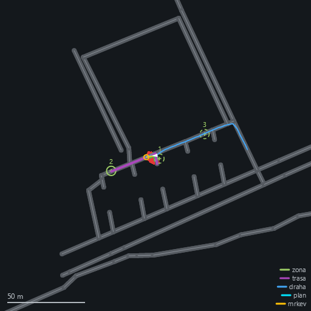

# Mise Track — objezd míst ze souboru

**Co dělá:** přečte seznam zeměpisných souřadnic ze souboru `*.track`, ke každé najde **nejbližší
místo na síti cest** a postupně k nim jede. Po dosažení jednoho pokračuje na další; slovo
`repeat` na konci souboru znamená „začni znovu od prvního", takže robot jezdí dokola.

**Kód:** `Src/ARBot.Common/Missions/TrackMission.cs` (automat), `TrackPlan.cs` (čtení souboru),
`TrackPhase.cs`, `TrackConfig.cs`, `Src/ARBot.Common/Logs/TrackMsg.cs` (zpráva do streamu
a záznamu). Napojení v `ARBot.Runtime/Robot/ARBotRuntime.cs`, `case "track"`.

**Zapíná se** selektorem misí — mise se vylučují, proto selektor a ne booleovské přepínače
(viz [CLAUDE.md](../CLAUDE.md)):

```bash
mission=track track=OSM/Hviezdoslavova.track map=OSM/Hviezdoslavova.osm
```

✅ **Stav: hotové a projeté v simulaci** (8. 9. 2026, 36 testů) — robot objel všechna tři místa
seznamu a po `repeat` začal druhé kolo, bez jediné výjimky v logu. ⚠️ **Na zařízení to
neběželo.**

**Soubory `*.track` leží u map v `OSM/`, ne v `config/`** (přesunuto 12. 9. 2026). Je to tak
správně: seznam míst **patří ke konkrétní mapě** — jeho body musí ležet na její síti cest, jinak
je mise odmítne (`trackoffroad=`, 50 m). Když ležel v `config/`, vypadal jako nastavení běhu, které
jde libovolně kombinovat s libovolnou mapou — a přesně tak se to taky jednou stalo: soubor
pojmenovaný po jedné mapě obsahoval body z druhé a mise se přerušila hláškou
„*lezi 272 m od site cest*", což vypadá jako porucha navigace, ne jako záměna souboru.

## Formát souboru

Jeden bod na řádek jako `sirka,delka` ve **stupních**, volitelně poslední řádek `repeat`:

```
50.0337431,14.5257403
50.0336719,14.5253072
50.0338847,14.5261453
repeat
```

- Prázdné řádky a řádky začínající `#` se přeskakují.
- Oddělovač složek smí být čárka, středník, mezera nebo tabulátor (soubor píše člověk a kopíruje
  ho z mapy, kde je oddělovač podle nástroje jiný). **Desetinný oddělovač je vždy tečka** — čárka
  odděluje šířku od délky, takže `50,03,14,52` je čtveřice čísel, ne dvojice.
- Relativní cesta se řeší proti datovému adresáři (`dataroot=`), jako u ostatních souborů.

**⚠️ Stupně jsou tady záměr, ne nedbalost.** Projekt drží zeměpisné souřadnice
[všude v radiánech](imu-and-frames.md) a převod patří jen na **okraje** — a tenhle soubor okraj
je: píše ho člověk, který si souřadnice zkopíroval z mapy. Převod se proto dělá hned při čtení
a dál už se nese `LLA` v radiánech.

**⚠️ Nesrozumitelný řádek je CHYBA, ne tiché přeskočení** — mise se v takovém případě vůbec
nezaloží a runtime řekne, který řádek je vadný. Tatáž zásada jako u konfiguračních profilů
([configuration.md](configuration.md)): kdyby se vadný řádek přeskočil, robot by objel **jinou**
trasu, než člověk zadal, a poznalo by se to jen tím, co v ní **není**.

Kontroluje se i **rozsah** souřadnic (šířka ±90°, délka ±180°), protože záměna šířky a délky je
nejčastější omyl a v Čechách se **nepozná podle pádu**: `14,5` je platná šířka (Nigérie) a robot
by „nejbližší místo na mapě" hledal tam, kde žádná mapa není, a jen hlásil `NoRoute`.

`repeat` musí být **poslední** neprázdný řádek. Kdyby smělo být uprostřed, řádky za ním by byly
nedosažitelné a soubor by tvrdil něco jiného, než robot dělá. `repeat` s jediným bodem je taky
chyba — robot by dojel na to jedno místo a hlásil dojezd pořád znovu.

## Průběh mise

| Fáze | Co se děje | Čeká na |
|---|---|---|
| `Idle` | mise ještě nezačala | pokyn ke startu |
| `AwaitingEStop` | robot stojí, regulátor je zahozený | **stisk** nouzového zastavení |
| `AwaitingEStopRelease` | stop drží | **uvolnění** stopu = pokyn „jed" |
| `Driving` | jede k *n*-tému místu | dojezd (`Arrived`) |
| `Finished` | objela všechna místa (bez `repeat`) | — |
| `Aborted` | přerušeno, důvod je ve zprávě | — |

**Mise startuje sama** (jako Robotour), ale **volba mise robota nerozjede**: první pohyb vždy
vyžaduje člověka u robota, který nouzové zastavení stiskne a zase uvolní. Je to tatáž zásada,
jakou drží webová volba mise (viz [CLAUDE.md](../CLAUDE.md), headless provoz) — jen tady ji drží
sám automat, takže platí i když se mise zadá z příkazové řádky.

**Mezi body se nezastavuje** — po `Arrived` se jen přepne cíl. Zadání mise zní „až místo dosáhne,
pojede na další", a `Cancel()` by robota zbytečně dobrzdil a zase rozjel. Zastavuje se teprve na
konci (bez `repeat`), a to **dvoufázově**: nejdřív se zruší cíl (robot dobrzdí *řízeně* po dráze,
která už existuje) a `Regulator = null` se nastaví teprve, až robot skutečně stojí. Vzor
i zdůvodnění je u [Robotouru](robotour-mission.md).

## Přichycení na síť — proč a proč s limitem

„Najdi nejbližší místo na mapě" není kosmetika, je to **oprava vady, která by misi zasekla**.
Souřadnice v souboru je bod, který si člověk klikl na mapě, ne bod na cestě. Robot tam dojet
nemůže — jede po síti — a `Navigator` přitom měří dojezd proti **surovému** cíli
(`GoalField.GoalPoint`), takže při odsazení větším než dojezdový radius by `Arrived` nenastalo
**nikdy** a mise by u prvního bodu uvízla navždy (jízda k cíli sama timeout nemá). Past je
dohledaná u [Robotouru](robotour-mission.md) 27. 8. 2026; Track jezdí ze stejného důvodu na
**přichycený** cíl.

Přichycení se dělá **znovu u každého bodu**, ne jednou dopředu: trasa se počítá z aktuální polohy
robota, a ta je u druhého bodu jiná.

⚠️ **Bod dál od sítě než `trackoffroad=` (výchozí 50 m) misi PŘERUŠÍ** — nepřeskočí se. Samotné
přichycení (`NearestEdge`) žádný limit nemá, takže přichytit jde **cokoliv**: bod uprostřed pole
300 m od silnice se přichytí k té silnici, vyjde jako dosažitelný a robot by odjel někam úplně
jinam, než člověk zadal, a **ohlásil dojezd**. Limit je to, co z přichycení dělá kontrolu.

**50 m je úsudek, ne měřená hodnota**, a je volnější než 15 m u Robotouru záměrně: bod z QR kódu
je místo, kde stojí člověk s krabicí *u cesty*, kdežto bod v `.track` si člověk klikl na mapě —
třeba do středu křižovatky nebo na roh budovy. Odstup jde do záznamu (`TrackMsg.OffRoadM`), takže
se dá nastavit z dat místo úsudkem.

## Parametry

| Parametr | Výchozí | Význam |
|---|---|---|
| `mission=track` | `none` | zapne misi |
| `track=<cesta>` | — | soubor se seznamem míst; **bez něj se mise nezaloží** |
| `trackoffroad=<m>` | 50 | největší přípustný odstup místa od sítě cest |

Mise se **nezaloží** (a runtime to napíše do `Trace`) když: není globální navigace (chybí `map=`
nebo `GeoReference`), není zadané `track=`, nebo soubor nejde přečíst. Vadný seznam je důvod misi
nezaložit, ne jezdit podle jeho čitelné části.

## Poruchy — nikdy tiché zaseknutí

| Situace | Reakce |
|---|---|
| `NoRoute` z globální navigace | mise se **přeruší** (zotavovací manévr neexistuje, takže zastavení je jediná bezpečná odpověď) |
| bod dál od sítě než limit | mise se **přeruší**, důvod říká *který* bod a jeho souřadnice |
| jízda k jednomu místu trvá nad `DrivingTimeoutSec` (600 s) | mise se **přeruší** |
| čekání na člověka (stisk/uvolnění stopu) | **timeout nemá** — čeká se, jak dlouho je potřeba |

Nouzové zastavení **za jízdy** tímto automatem nehýbe — o zastavení se stará `ControlLoop` a po
uvolnění se jede dál k témuž cíli. Mise o stopu za jízdy vědět nemusí (stejně jako Robotour).

## Přichycení všech míst PŘEDEM (13. 9. 2026)

Bod ze souboru je místo, které si člověk klikl na mapě, takže může ležet kdekoli — na střeše,
uprostřed pole, v rybníce. Robot jede po síti a `Navigator` měří dojezd proti cíli, takže bod mimo
síť je **nedosažitelný**. Proto se každé místo **přichycuje** (kolmý průmět na nejbližší hranu) a
bod dál než `trackoffroad=` (50 m) misi přeruší.

**Nově se to dělá pro všechna místa najednou, při odjezdu** — dřív až v okamžiku, kdy na bod
přišla řada. Rozdíl je praktický: se seznamem, jehož páté místo leží mimo síť, robot objel čtyři
místa a teprve pak misi přerušil, někde daleko od člověka, který ho poslal. Dnes to řekne dřív,
než se pohne:

```
Track: mise PRERUSENA - misto 2/3 (50.0337431,14.5257403) lezi 372 m od site cest,
       limit je 50 m. Je ten bod na ceste?
```

Dvě věci, na kterých to stojí:

- **Přichycení je čistá geometrie** (nejbližší hrana), takže na poloze robota nezávisí a spočítat
  předem ho jde. **Dosažitelnost ano** — jestli na cíl vede trasa, závisí na tom, kde robot právě
  je — takže ta se zkouší dál až při odjezdu na konkrétní bod.
- ⚠️ **Nedělá se to už při volbě mise, ale až při odjezdu**, protože `IRouteProbe.Probe` počítá
  i dosažitelnost, a tedy **potřebuje pózu**. Bez ní vrací nuly — takže kontrola při startu tiše
  prošla a do logu se vypsalo „nejvetsi odstup 0,0 m" i pro bod 370 m od cesty. Ta past se chytila
  při ověřování v simulaci; dnes se navíc rozlišuje „přichyceno s odstupem 0" od „**nepodařilo se
  přichytit**" a to druhé se hlásí.

## Zpráva `TrackMsg`

Jde do streamu, tedy současně **do webového náhledu i do záznamu**: fáze, index místa, počet míst,
kolo, kolik se už objelo, **surový i přichycený cíl**, odstup od sítě, délka trasy, důvod přerušení
a doba běhu. Verze formátu **2**, registrovaná v `MessageCatalog`.

Surový i přichycený cíl se nesou oba, protože bez obou se nedá vyložit, kam robot vlastně jel.

**Verze 3 (13. 9. 2026) přidala místa PŘICHYCENÁ na síť** (`SnappedLatitudes` /
`SnappedLongitudes`). Nesou se vedle surových, protože každé odpovídá na jinou otázku: surové je
to, **co člověk zadal**, přichycené to, **kam robot opravdu jede** a proti čemu se měří dojezd.
Z nich se kreslí zóny na půdorysu — do verze 2 se kreslily surové, takže zóna ležela vedle cesty
a na obrázku to vypadalo, že se nepřichycuje vůbec. Důvod, proč se tehdy poslat nedaly, mezitím
padl: mise přichycuje všechna místa předem. ⚠️ Jednotlivé místo může být **nulové**, i když pole
prázdné není — přichytit se nemuselo podařit právě u něj.

**Verze 2 (12. 9. 2026) přidala celý seznam míst** (`AllLatitudes` / `AllLongitudes`, v radiánech),
ne jen to, které se právě obsluhuje. Kreslí se z něj **zóny na půdorysu** webového náhledu
(viz [headless.md](headless.md)) — a právě objezd jako celek je při dohledu nad závodem potřeba
vidět dopředu, ne až po bodech. Ve verzi 1 se čte prázdný seznam a nakreslí se jen aktuální místo.

Dvě věci, které z toho plynou:

- `AllLatitudes` / `AllLongitudes` jsou **surová** místa ze souboru; přichycená přibyla ve
  verzi 3 jako samostatná dvojice polí. Rozdíl mezi nimi je měřítko toho, o kolik se cíl posunul —
  a proto se nesou obě.
- Seznam je v **každé** zprávě, ne jen v první. Odběratel „latest-wins" (náhled) drží poslední
  zprávu, takže seznam poslaný jednou by při první periodické zprávě zmizel. Pole se ale počítají
  jednou v konstruktoru mise a pak už jen předávají — seznam se za běhu nemění.

**Proč vlastní zpráva a ne `MissionMsg`:** ta je robotourovská (depo, QR kód, nakládka)
a rozšiřovat ji o cizí pole by znamenalo, že polovina zprávy je vždy prázdná a nikdo neví, která.
FreeRun má z téhož důvodu `FreeRunMsg`.

## Proč samostatná mise a ne „Robotour bez QR"

Robotour je stavový automat **doručení** — kotví depo, čte kódy, otevírá servisní okno pro člověka
a má tři zastavení s totožným průběhem. Track nemá ani jedno z toho: nekotví depo (cíle jsou
absolutní souřadnice, ne odsazení od startu), nikdo s ním v průběhu nemluví a mezi body
nezastavuje. Ze dvou automatů by vznikl jeden s prázdnými větvemi.

Společné je jen **hlášení stavu**, a to už rozhraní má — `IMissionStatus`
(`MissionName` / `PhaseText` / `WaitingFor` / `Elapsed`), takže webový náhled i UI umějí říct
„jaká mise, v jaké fázi a na co čeká" bez znalosti konkrétní mise. **Společný řídicí předek misí se
záměrně nezavádí** (viz [robotour-mission.md](robotour-mission.md)): FreeRun produkuje mrkev pro
lokální plánovač, Robotour i Track LLA cíl pro globální navigaci.

## Vyzkoušení v simulaci

```bash
mission=track track=OSM/Hviezdoslavova.track virtualhw=true map=OSM/Hviezdoslavova.osm web=8080
```

Na stránce náhledu stisknout a uvolnit **virtuální nouzové zastavení** (je v liště, protože
`virtualhw=true`) — to je pokyn „jed". Panel stavu mise pak ukazuje `jede k mistu 2/3, kolo 1`.

`OSM/Hviezdoslavova.track` je ukázka s body **na síti** `OSM/Hviezdoslavova.osm`: změřeno
**3,7 / 7,0 / 5,8 m** od nejbližšího uzlu sítě (mise hlásí přichycení o 2,1 a 0,4 m) a 91–155 m od
startu robota, který stojí ve středu obálky uzlů mapy (`BuildOriginFromMap`).



*Půdorys z webového náhledu (výřez 200 m) po dosažení prvního místa: zelené kružnice jsou **zóny,
které mají být dosaženy** (aktivní plnou čarou), fialová trasa globální navigace vede k místu 2,
modrá je ujetá dráha. Viz [headless.md](headless.md).*

⚠️ **Soubor se musí párovat s tou správnou mapou.** Tytéž body jsou od sítě `OSM/HajeRovne.osm`
**367–389 m** (a od `OSM/haje.osm` 272 m), tedy hluboko nad limitem `trackoffroad=50` — mise by se
po uvolnění stopu přerušila. Ten limit dělá svou práci, ale hláška („*lezi 272 m od site cest*")
se snadno přečte jako porucha, proto ta místa **leží vedle sebe v `OSM/`**.

## Projeto v simulaci (8. 9. 2026)

```bash
mission=track track=config/haje.track virtualhw=true map=OSM/HajeRovne.osm web=8099
```

*(Tehdejší cesta a mapa — seznam se od té doby přesunul do `OSM/`. Log níž je ze záznamu toho běhu,
proto jsou v něm body Hájů, ne ty z dnešní ukázky.)*

Stisk a uvolnění virtuálního nouzového zastavení (`POST /virtualestop?on=true` / `on=false`), pak
už jen sledování stránky. Log mise:

```
Track: cil 1/3 (50.0242211,14.5220884), prichyceno o 0.0 m, trasa 258 m.
Track: dosazeno misto 1/3 (50.0242211,14.5220884), celkem 1.
Track: cil 2/3 (50.0230604,14.5219038), prichyceno o 0.0 m, trasa 245 m.
Track: dosazeno misto 2/3 (50.0230604,14.5219038), celkem 2.
Track: cil 3/3 (50.0238890,14.5229165), prichyceno o 0.0 m, trasa 171 m.
Track: dosazeno misto 3/3 (50.0238890,14.5229165), celkem 3.
Track: repeat -> zacina kolo 2.
Track: cil 1/3 (50.0242211,14.5220884), prichyceno o 0.0 m, trasa 177 m.
```

Ověřilo se tím: mise se **nerozjede** volbou (stála 22 s ve `AwaitingEStop` / `AwaitingEStopRelease`),
**uvolnění stopu je pokyn „jed"**, stránka ukazuje `jede k mistu 2/3, kolo 1`, přepínání bodů je
**bez zastavení** (rychlost drží 1,2 m/s i přes hranici bodu) a **`repeat` opravdu začne od
prvního**. Jedno místo trvalo 170–240 s při trase 170–260 m.

**Odstup od sítě vyšel 0,0 m u všech bodů** — a je to očekávané, ne podezřelé: body ukázky jsou
záměrně vybrané jako **uzly cest** z `HajeRovne.osm`, takže na síti přímo leží. Limit
`trackoffroad=` tím tedy **prověřený není** (jen jeho testy).

## Otevřené úkoly (→ registr)

Stav a data vede [registr úkolů](ukoly.md); tady je jen seznam, co se téhle oblasti týká.

- **[Mise Track — objezd míst ze souboru](ukoly.md#mise-track)** — celá mise na zařízení projetá
  18. 9. 2026 (`20260918-154028.rec`: dvě celá kola včetně `repeat`, 6 míst za 5 min; druhý běh
  5 míst za 8 min) s kalibrovaným kompasem; jízdy 12. a 14. 9. seznam neobjely kvůli kurzu
  rozbitému železem od kabelů ([registr](ukoly.md#hw-zelezo-od-kabelu-kamer)).
- **[Mise Track — objezd míst ze souboru](ukoly.md#mise-track)** — `trackoffroad=` nastavit
  z naměřených odstupů místo úsudku (údaj je v záznamu).
- (bez tématu v registru) **Rozbor záznamu** (`ARBot.Analyze track`) — jak dlouho trvalo které místo, kolik kol se ujelo,
  jaké byly odstupy. Vzor: `ARBot.Analyze freerun`.
- **[Mise Track — objezd míst ze souboru](ukoly.md#mise-track)** — volba mise ze stránky bez
  `track=` dnes skončí tím, že se mise nezaloží a stránka o tom nic neřekne (jen `Trace`); buď
  doplnit hlášku na stránku, nebo ze seznamu misí `track` schovat, když soubor není zadaný.

## Odkazy

- [robotour-mission.md](robotour-mission.md) — vzor automatu, dvoufázové zastavení, přichycení cíle
- [global-navigation-runtime.md](global-navigation-runtime.md) — `GlobalNavigator`, LLA cíl → mrkev
- [mission-freerun.md](mission-freerun.md) — druhá mise, která jezdí bez mapy
- [configuration.md](configuration.md) — parametry a proč je neznámá hodnota chyba při startu
