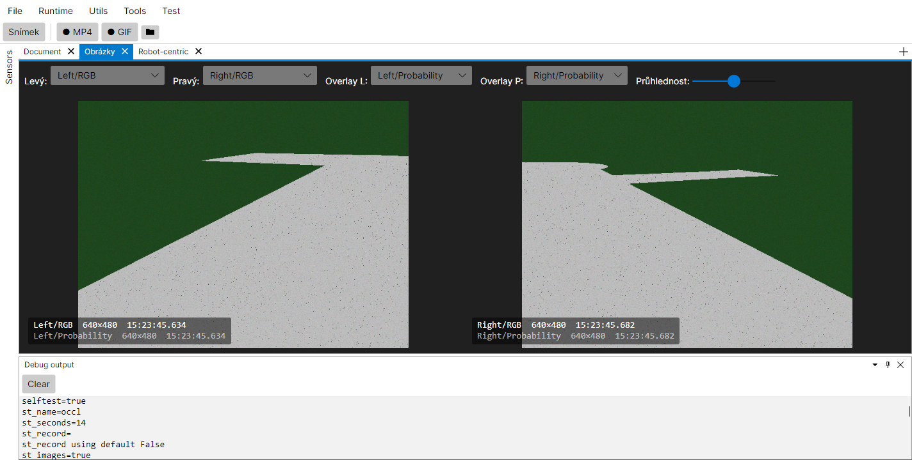
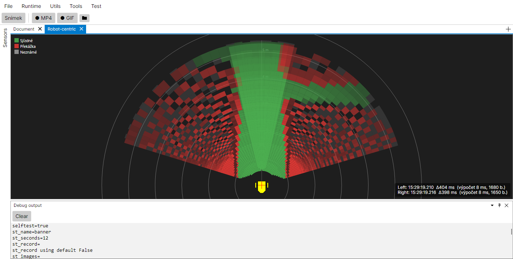

# Virtuální HW (simulované senzory)

Simulované senzory, které se v aplikaci tváří jako reálné — robot „vidí" scénu odvozenou
z načtené OsmNav mapy, **jezdí po ní** a měří se zašuměnými GPS/IMU/odometrií, bez připojeného
hardwaru. Obyvatelé: **`VirtualCamera`** (náhrada D435), **`VirtualMotors`**, **`VirtualGps`**
a **`VirtualImu`** nad společným ground-truth modelem **`SimulatedRobot`**.

> **Stav (2026-08-13): implementováno a otestováno včetně uzavřené smyčky.**
> Běh celé aplikace se simulovaným HW zatím neověřen.

## Účel

Tři doložené případy užití (určují míru věrnosti):

1. **Vývoj vizuální cesty bez HW** — ladit řetěz depth → polární grid → occupancy →
   lokální plánování na počítači bez kamer. Rozhoduje **geometrická** věrnost, ne
   fotorealismus.
2. **Reprodukovatelné automatické testy** — deterministický vstup pro testy vizuální
   cesty. Šum proto musí být seedovatelný a vypnutelný.
3. **Uzavřená smyčka** — robot v simulaci skutečně jede: regulátor řídí motory, ty posouvají
   ground truth, senzory ho zašuměně měří a fúze ho odhaduje zpět.

Mimo rozsah: fotorealistický vzhled, jiné objekty než vozovka a okolní tráva, prokluz kol
a dynamika podvozku.

## Architektura

Renderer je oddělený od kamery — tři jednotky s jasnou hranicí:

| Kde | Co | Proč tam |
|---|---|---|
| `ARBot.Common/Vision/Synthetic/RoadScene.cs` | Geometrie scény v lokální ENU rovině: úseky vozovky (osa + šířka) postavené z `RoadNetwork` přes `GeoReference` + prostorový index | Čistý algoritmus bez HW → `Common` (směr závislostí `Common ← HAL ← app`) |
| `ARBot.Common/Vision/Synthetic/SyntheticFrameRenderer.cs` | Vlastní vykreslení: (scéna, póza, projekce) → naplní `Image<BGR32>` + `Image<Gray16>` | Jádro, které se testuje deterministicky. Nezná `ICamera` ani senzory |
| `ARBot.HAL/Devices/Camera/VirtualCamera.cs` | `SensorBase<CameraFrame>, ICamera` — časování snímků, capture pool, `CreateProjector()` / `CreateDepthProjector()` | Bez platformní závislosti → do **`ARBot.HAL`**, ne do `HALWindows`/`HALArmbian`. Jedna kopie pro x64 i OrangePI a **nezávislá na Intel.RealSense** |
| `ARBot.Common/Simulation/SimulatedRobot.cs` | **Ground truth**: skutečná póza (X, Y, Θ), rychlosti kol, integrály enkodérů; `Drive`, `SetAcceleration`, `Advance(t)` | Čistý model pohybu bez HW → `Common`. Thread-safe: motory do něj píšou z řídicí smyčky, senzory čtou každý ze svého vlákna |
| `ARBot.HAL/Devices/MotorDriver/VirtualMotors.cs` | `IMotorControl` — příkazy do simulátoru, zpět `MotorStateBase` (odometrie) | Slupka nad modelem, stejný vzor jako `VirtualCamera` |
| `ARBot.HAL/Devices/GPS/VirtualGps.cs` | `IGPS` — pravá póza → `GeoReference` → LLA + šum → `GPSState` | |
| `ARBot.HAL/Devices/AHRS/VirtualImu.cs` | `IIMU` — pravý kurz jako kvaternion + `omega` z gyra + šum → `IMUState` | |

### Projekce

`CameraProjection` (`ARBot.Common/Coordinates`) implementuje `ICameraProjection`
i `IDepthCameraProjection` a staví se jen z `Intrinsics` + matic — bez RealSense.
`VirtualCamera` si vyrobí syntetické intrinsics ve stylu D435 (pinhole,
`Distortion.None`, `Fx = (W/2) / tan(HFOV/2)`) a **tutéž instanci použije k vykreslení
i vrátí z `CreateProjector()` / `CreateDepthProjector()`**.

To je záměr, ne úspora: vize dostane přesně tu projekci, kterou byl obraz myšlen, takže
neshoda v hloubkové cestě je skutečná chyba, ne artefakt simulace.

## Šev: `SetNoHW` / `SetRealHW` / `SetVirtualHW`

```csharp
// ARBotHW
public HwMode Mode { get; }                    // None / Real / Virtual
public void SetNoHW();                         // uvolní VŠECHNO (kamery i UART senzory)
public void SetRealHW();                       // skutečné kamery + IMU/GPS/motor
public void SetVirtualHW(VirtualHWOptions o);  // simulované senzory
```

**Po startu aplikace neběží žádný hardware** (`HwMode.None`) — `Init()` jen zjistí porty
a nic neotevře. Co se založí, určuje `ARBotRuntime.RequestedHwMode`, a stane se to
až v `ARBotRuntime.Start(Run)`.

`SetRealHW` i `SetVirtualHW` volají na začátku `SetNoHW()`, takže **přepnutí je čisté v obou
směrech**. Dřív to byla jednosměrka: `SetRealHW` zakládal kamery jen `if (LeftCamera == null)`,
a po virtuálním HW ta pole null nejsou — skutečné kamery se tedy už nikdy nevrátily. Proto taky
po přechodu Run → View zůstávaly viset virtuální kamery a renderovaly na pozadí.

`SetNoHW` uvolňuje i **UART porty** (`UartAHRS`/`UartMotor`/`UartGPS`); bez toho by je následný
`SetRealHW` nemohl znovu otevřít.

### Volba režimu

- **Parametr `virtualhw=true`** → požadovaný režim `Virtual`; bez něj `Real`.
  Samostatný parametr na „žádný HW" nemá smysl — to je stav po startu, než se pustí Run.
- **Menu `Runtime → Hardware`** (Žádný / Reálný / Virtuální) mění požadovaný režim; přepínat
  lze **jen se zastaveným runtime**. `Žádný` uvolní HW hned, ostatní dva se projeví až při Startu.
- **Bez mapy se virtuální HW nezaloží a zůstane `None`** — záměrně *ne* fallback na reálný,
  aby se při žádosti o simulaci nerozjely skutečné kamery.
- **`Start(View)` hardware uvolní** — přehrávání záznamu ho nepotřebuje.

Obojí prochází existujícími `CameraStop()` / `CameraStart()`, které už dnes slouží
k výměně kamer za běhu — nezavádí se nový životní cyklus.

`VirtualHWOptions` nese **vše potřebné**:

- `RoadNetwork Network` — scéna,
- `GeoReference Origin` — počátek lokální ENU roviny,
- `Func<DateTime, RobotState> PoseAt` — zdroj pózy,
- montážní transformace kamer (jinak z `Profile.Left/RightCameraTransform`),
- parametry vzhledu a šumu (viz níže).

### Pořadí volání

`ARBotHW.Current` vzniká v `ARBotRuntime.Start()` **dřív** než `AsyncFusionEngine`.
`SetVirtualHW` proto volá `ARBotRuntime.Start()` až **za** vytvořením enginu, takže
`PoseAt = t => engine.GetStateAt(t)` jde předat rovnou v opcích a nic se nedodrátovává dodatečně.

**Právě proto menu jen nastavuje požadovaný režim a nezakládá HW samo.** Virtuální hardware
nejde vytvořit dřív než fúzi (zdroj pózy) a mapu, takže jediné místo, kde to jde udělat
konzistentně pro oba režimy, je `Start`.

### `GeoReference` není věcí kamery

Kamera si referenci **nezakládá** — dostane ji hotovou v `VirtualHWOptions` a jen ji použije.

Deklarovaný domov je `FusionConfig.GeoReference`, jehož komentář slibuje, že ji „GPS adapter
založí z prvního platného fixu". **To dnes nikdo nedělá** — pole nikdo nečte ani nenastavuje
a `GeoReference.ToLocal` se používá jen ve `WorldViewDocument`, který si referenci staví ad hoc
z GPS a pózy. Fúze bere `PositionMeasurement` rovnou v metrech, takže převod LLA → ENU zatím
nikde přes `GeoReference` neteče.

Až vlastník počátku vznikne (GPS adapter nebo virtuální GPS), v kameře se nemění nic.

### Sdílená `RoadNetwork` v runtime

`ARBotRuntime` drží načtenou síť v `RoadNetwork` a její počátek v `MapOrigin` (obojí veřejné,
`null` bez mapy) — naplní je při startu z `.osm` podle parametrů. Je to první krok k otevřenému
úkolu z [osm-nav.md](osm-nav.md) → „Napojení na řídicí smyčku".

Načtená síť se navíc publikuje na `Stream` jako `MapMsg` (`ARBotRuntime.MapMessage`) — až
**úplně nakonec** `WireRun`, kdy je připojený záznam i otevřené dokumenty. World view ji tedy
vykreslí sám a současně se uloží do záznamu, takže se **přehraje i ve View**. Pohled otevřený
až za běhu by jednorázovou zprávu prošvihl (Stream zprávy nepřehrává), proto si ji při otevření
vyzvedne z `ARBotRuntime.MapMessage`.

`WorldViewDocument` si pořád **umí** načíst mapu i vlastní cestou (file picker) — ta cesta zůstává.

Vedle navigační sítě drží runtime ještě `VisionRoadNetwork` / `VisionMapMessage` (parametr
`visionmap=`) — síť **jen pro render kamer**. Ta se na `Stream` **nepublikuje**; world view si ji
vyzvedává přímo z runtime. Viz „Dvě mapy" níž.

### Parametry příkazové řádky

| Parametr | Význam |
|---|---|
| `virtualhw=true` | zapne simulovaný HW (kamery, motory, GPS, IMU) místo reálného |
| `map=<cesta.osm>` | **navigační** mapa: robot podle ní jede, koreluje s ní occupancy grid a určuje počátek lokální ENU roviny (bez ní zůstane reálný HW) |
| `visionmap=<cesta.osm>` | mapa, **ze které renderují kamery** — když je zadaná, jinak renderují z `map=`. Vnucená chyba mapy pro test korelátoru; do streamu ani do záznamu nejde. Viz níž |
| `roadwidth=<m>` | výchozí šířka cesty pro uzly bez `width` (default 3) |
| `start=lat,lon[,kurz]` | známá počáteční póza → vloží se do EKF (**platí i pro reálný HW**); bez ní se v simulaci přichytí na nejbližší cestu |
| `goal=lat,lon` | **cíl jízdy** — protějšek `start=`. Bez něj robot stojí (`Regulator` zůstane `null`), takže bezobslužné běhy měřily jen statickou scénu. S mapou jde cíl globální navigaci (trasa po síti), bez ní přímo lokálnímu plánovači |
| `poseerror=vpřed,vlevo[,stupně]` | umělá chyba pózy vnucená do renderu kamer (metry v rámci robotu, kurz ve stupních) — viz níž |
| `camerapose=truth\|fusion` | z které pózy kamery renderují: `truth` (**výchozí od 22. 8. 2026**) = z **ground truth** (`SimulatedRobot`), `fusion` = z **odhadu** fúze (staré chování) — viz níž |
| `wheelslip=vlevo,vpravo` | prokluz kol (1 = ideál): násobek mezi tím, co kolo naměří, a tím, oč se robot skutečně posune — viz [Systematické chyby](#systematické-chyby-prokluz-kol-a-bias-imu-22-8-2026) |
| `imubias=kurzDeg,gyroDegZaS` | systematická chyba IMU: konstantní posun kurzu a offset gyra — viz tamtéž |
| `corridortol=konstanta,přírůstek` | práh inlieru RANSACu pro hranice cesty: konstanta [m] + přírůstek na metr vzdálenosti bodu [m/m]. Slouží k proměření, ne k běžnému provozu — viz [map-correlation-localization.md](map-correlation-localization.md#otevřené-úkoly) |
| `imunoise=kurzDeg,gyroDegZaS` | σ šumu IMU (default 1°, 0,5 °/s). **σ kurzu zároveň říká fúzi, jak moc kompasu věřit** — rozhoduje o tom, jestli má korekce kurzu z koridoru vůbec šanci, viz [Kurz](#kurz-proč-ho-koridor-neopraví-22-8-2026) |
| `gpsnoise=polohaM,rychlostMps` | σ šumu GPS (default 1,5 m, 0,1 m/s) |

Zapnutí je **best-effort**: chybějící nebo vadná mapa simulaci jen nezapne (a zaloguje důvod),
nikdy neshodí start aplikace.

**Relativní cesta se řeší proti kořenu repa** (složka s `.git`), ne proti pracovnímu adresáři —
o to se stará `PathParam.Value` (`RepoPaths.Resolve`), přes který se `map=` i `visionmap=` čtou (`ParamRegistry.Map`, `VisionMap`).
Absolutní cesta se nechá, jak je. Díky tomu jsou cesty v `launchSettings.json` relativní
(`map=OSM\SyntetickyKoridor.osm`), a tedy přenositelné mezi pracovními kopiemi. Mimo repo
(nasazení na zařízení) je základem `AppContext.BaseDirectory` — tam se používají absolutní cesty.

> **Past u cest k mapám** (stála čas 21. 8. 2026, projevila se jako
> `virtualni HW: ... -> zadny HW`):
> - **Zdvojený parametr = platí první.** (Platilo do 31. 8. 2026, kdy `Program.GetParam` bralo `args.FirstOrDefault(...)`. Dnes `ParamStore.Build` zapisuje dvojice z příkazové řádky v pořadí a přepisuje, takže vyhraje **POSLEDNÍ**; past je tedy obrácená, ale pořád tichá.) Tehdy:
>   když se v příkazovém řádku octne `map=` dvakrát (typicky slepením dvou příkazů), tiše vyhraje ten
>   první a druhý se ignoruje. Bez varování.
>
> Hláška při nezapnutí proto říká, **co přesně** chybí (`ARBotRuntime.DescribeMissingMapReason`):
> nenalezená `map=` vs. `visionmap=` bez `map=` vs. žádná mapa zadaná.

### Syntetické testovací mapy v `OSM/`

Mapy pro `map=` / `visionmap=`, které **nejsou reálné místo**, ale měřicí přístroj se známou
geometrií. Všechny mají počátek (uzel 1) na 50.029 / 14.52 a osu ve směru východ, takže jsou mezi
sebou srovnatelné; podrobnosti, geometrie po uzlech a příkazy ke spuštění jsou v hlavičce každého
souboru. Geometrii rovných map hlídá test `SyntetickeMapyTests` (parametrizovaný — další rovná mapa
je jeden řádek v `RovneMapy`).

| mapa | geometrie | k čemu |
|---|---|---|
| [`SyntetickyKoridor.osm`](../OSM/SyntetickyKoridor.osm) | úseky různé šířky, křižovatka, slepý konec, nálevka 1 → 3 m | první testovací mapa; pro měření rovnoběžnosti **nevhodná** (nálevka zamítá 20 % cyklů) |
| [`SyntetickyRovny.osm`](../OSM/SyntetickyRovny.osm) | jeden rovný úsek **160 m × 2,0 m**, uzly po 20 m | hlavní mapa pro hranovou lokalizaci a jízdu: 60 s čisté jízdy bez zamítnutí |
| [`SyntetickyRovny2m.osm`](../OSM/SyntetickyRovny2m.osm) | jeden rovný úsek **2 m × 1,5 m**, uzly po 0,5 m (3. 9. 2026) | krátký úsek „na stole": užší cesta s koncem hned v dohledu kamery. **Pro jízdu není** — robot startuje ve středu a má před sebou 1 m |
| [`SyntetickyKoridorPosunuty.osm`](../OSM/SyntetickyKoridorPosunuty.osm) | Koridor s **náhodným** posunem uzlů do 1 m | `visionmap=` — robustnost korelace proti deformaci |
| [`SyntetickyRovnyPosunuty.osm`](../OSM/SyntetickyRovnyPosunuty.osm) | Rovný 160 m s **tuhou translací** +0,60 / −0,40 m | `visionmap=` — falsifikovatelná předpověď pro `MapCorrelator` |

**Pravidla pro další syntetickou mapu**, která vyplynula z těch stávajících:
- **Šířku zadat na každém uzlu**, ne jen na cestě — `RoadScene` interpoluje pološířku mezi uzly,
  takže jediný uzel s jinou šířkou udělá nálevku.
- **Robot startuje ve středu obálky uzlů** (`BuildOriginFromMap`), z délky *L* je ve směru jízdy
  jen *L/2*; na *N* s jízdy při rychlosti *v* je třeba `2·(N·v + 10 m)`. Střed ať padne na uzel.
- Souřadnice počítat inverzí `GeoReference.ToLLA` a psát na **9 desetinných míst** (zpětný převod
  pak sedí pod 0,05 mm; při 8 místech je to 0,5 mm).
- **V XML komentáři nesmí být `--`** — příkazy `ARBot.Analyze` s dvojitou pomlčkou v hlavičce
  shodí `OsmXmlReader` a mapa se nenačte (kouslo 3. 9. 2026).

## Z které pózy kamery renderují (`camerapose=`, 22. 8. 2026)

**Výchozí je `truth`:** kamera renderuje ze **ground truth** (`SimulatedRobot`), tedy tak, jak to
dělá reálná kamera — je přišroubovaná k robotu, ne k odhadu. Chyba odhadu je proto v obraze
viditelná, a tím **měřitelná**.

`camerapose=fusion` (staré chování) renderuje z `engine.GetStateAt(t)`, tedy **z odhadu fúze**.
Má to jeden zásadní důsledek: **chyba odhadu je pro kameru neviditelná**, protože posun odhadu
posune i obraz. Chyba se pak musí vnucovat do *pozorování* (`poseerror=`, `visionmap=`) a nejde
změřit, jestli korekce **konvergují**.

Naměřeno s hranovou lokalizací (`corridor=true`, jedna mapa): bez korekcí odhad ujede 0,31 m,
s korekcemi drží chybu na **1 mm (sd 7 mm)**. Detail a druhý test (chyba mapy vs. lokální vrstva):
[map-correlation-localization.md](map-correlation-localization.md#camerapose-a-dva-testy-které-díky-němu-jdou-22-8-2026).

> **Proč se výchozí hodnota změnila** (22. 8. 2026). Původně zůstal výchozí `fusion`, aby se
> nezměnil význam dřívějších experimentů. Jenže tím byl výchozím režimem simulace právě ten,
> ve kterém lokalizaci **změřit nelze** — kamera přišroubovaná k odhadu je fyzikální nesmysl
> a chybu odhadu strukturálně skrývá. Měřit se má ve výchozím stavu; kdo potřebuje reprodukovat
> starší běh, zadá `camerapose=fusion`. Záznamy pořízené do 22. 8. 2026 běžely na `fusion`.

### Póza v metadatech snímku — jiná lambda než renderovací (23. 8. 2026)

Od 23. 8. 2026 nese `CameraFrame` **odhad pózy z fúze v okamžiku pořízení**
(`PoseAtCaptureX/Y/Theta` + `HasPose`, formát verze 6). Plní ho **obě** kamery — virtuální
i `D435Camera` — z lambdy `ICamera.EstimatedPoseAt`, kterou drátuje `ARBotHW.EstimatedPoseAt`.

**Nesmí se splést s `camerapose=`.** Ta určuje **renderovací** pózu virtuální kamery a je to ve
výchozím stavu *ground truth*. Metadatová póza je **vždy odhad z fúze**; jinak by se na virtuálním
HW stampovala skutečnost, na reálném odhad, a obě větve by se chovaly jinak. Proto dvě lambdy:

| | zdroj | k čemu |
|---|---|---|
| `VirtualHWOptions.PoseAt` | `camerapose=` (default ground truth) | z čeho se **renderuje** |
| `ICamera.EstimatedPoseAt` | vždy `engine.GetStateAt` | **metadatum** snímku pro vizualizaci |

**Výhradně diagnostika — nesmí vstoupit do řízení ani do fúze.** Kdyby měření odvozené ze snímku
tuhle pózu použilo, opravovala by se póza měřením, které ji už v sobě má — přesně ta kruhovost,
kvůli které se koridor počítá v rámci robotu.

**Proč to tedy je.** Aby se hraniční body daly nakreslit do mapy pózou **toho** snímku. Kamery
nejsou svázané a jejich snímky jsou až stovky ms od sebe; jedna „poslední známá" póza pro obě
posouvá starší sadu. Naměřeno na záznamu z 23. 8. (pózy dohledané z `RobotStateMsg`, tedy
**podhodnoceně**): rozdíl póz obou kamer p50 0,037 m, ale rozdíl **kurzu** p90 3,2° a max 12,3° —
a kurz se s dálkou násobí, takže na dosahu 8 m je celková chyba kreslení **p50 0,15 m, p90 0,61 m,
max 2,03 m**. Spočítá to `ARBot.Analyze poses <záznam>`.

**Póza musí cestovat ve snímku**, párovat ji podle razítka nejde: rekonstrukce stavu při **seeku**
dodává poslední zprávu pro každý klíč `(MsgName, Name)`, tedy dva snímky s různými časy, ale jen
jednu `RoadCorridorMsg` — ta se trefí nejvýš s jedním z nich. Ze stejného důvodu to nesmí být jen
runtime pole: při seeku se rámec čte náhodně z offsetu a emituje přímo na `Stream`, tedy neprojde
zpracováním. Viz [record-replay.md](record-replay.md).

**Chybějící póza snímek nezahazuje.** U renderu bez pózy skutečně není co renderovat, takže tam se
snímek přeskočí — ale to je ta *renderovací* póza. Metadatová póza je jen metadatum: když ji fúze
nezná, snímek projde s `HasPose = false`. Na reálném robotu by opak znamenal vyhazovat obraz kvůli
diagnostice.

## Pohyb: `SimulatedRobot` a virtuální motory

Model pohybu je **ideální plus rampa zrychlení** — žádný prokluz ani systematická chyba.
Rychlost každého kola se rampuje k cíli podle `SetAcceleration`, pak se integruje unicycle:

```
v = (vL + vR) / 2        omega = (vR − vL) / rozchod
X += v·cosΘ·dt           Y += v·sinΘ·dt           Θ += omega·dt
```

### Motory jsou přesná inverze odometrie

`VirtualMotors.Drive(v, difSpeed)` rozloží příkaz na `vR = v + difSpeed`, `vL = v − difSpeed`.
Když pak `DefaultMeasurementMapper` spočítá z hlášených rychlostí kol `omega = (vR − vL)/rozchod`,
vyjde **přesně to `omega`, které chtěl regulátor** (`difSpeed = omega·rozchod/2`). Je to táž
symetrie jako u kamery (renderer = inverze rozbalení hloubky) a ze stejného důvodu: neshoda pak
znamená skutečnou chybu, ne artefakt simulace.

Dvojitou negaci ve skutečném driveru (`SDC2160Ex.Drive` posílá `-CalcSpeed(...)` u obou složek —
kompenzace zapojení motorů) simulace **nekopíruje**; to je detail hardwaru, ne konvence rozhraní.

> **Pozor na zastaralý komentář.** `IMotorControl.Drive` v první větě tvrdí „Positive value -
> right rotation, left motor is faster", ale hned pod tím uvádí `difSpeed = omega·rozchod/2`
> a MicroBasic skript v jednotce má u rotační rychlosti „kladná hodnota je v matematickém smyslu".
> Platí formule: **kladné `difSpeed` = otáčení doleva (CCW)**. První věta je relikt.

### Start robota — známá póza jde rovnou do EKF

Parametr `start=lat,lon[,kurzDeg]` **není věcí simulace**: pokud je zadaný, vloží se poloha
rovnou do filtru přes `AsyncFusionEngine.InitializePosition` a kurz se pošle jako
`HeadingMeasurement`. Platí to **i pro reálný robot** — když vím, kam jsem ho postavil, nemá
smysl to filtru tajit a čekat, až polohu určí první GPS fix. Následná měření polohu jen korigují.

Je to přesně případ, pro který `InitializePosition` vznikla: filtr startuje s `P0 = I` (σ = 1 m),
takže první fix stovky metrů daleko by gating zahodil a robot by se „nenašel". Rozhodnutí
„téhle poloze už věřím" patří volajícímu.

Kurz se **inicializuje taky** (`AsyncFusionEngine.InitializeHeading`), od 19. 8. 2026.

> **Změna rozhodnutí.** Do té doby se kurz jen posílal jako měření s odůvodněním „na rozdíl od
> polohy je jeho chyba omezená a filtr si ho srovná". Neplatí to ze dvou důvodů. Za prvé: při
> `P0 = I` je σ kurzu **1 rad (57°)**, takže měření o 170° vedle — a přesně to nastane, když robot
> míří na západ — má NIS ~8,7 proti χ²(1; 0,95) = 3,84 a po zapnutí gatingu by se **zahodilo**.
> Je to tatáž latentní past, jakou u polohy popisuje `InitializePosition`. Za druhé: „filtr si ho
> srovná" znamená, že po nějakou dobu je kurz špatný — a `LocalNavigator` mezitím zapisuje do
> **world-ukotveného** occupancy gridu buňky s tím špatným kurzem. První korelace s mapou z nich
> vycházela s **opačným znaménkem**. Když kurz znám, není důvod ho filtru tajit a nechat ho k němu
> dojít přes měření. Podrobně v [map-correlation-localization.md](map-correlation-localization.md).

Bez `start=` se póza hádá **jen v simulaci**: robot se přichytí na nejbližší hranu sítě
(`RoadNetwork.NearestEdge`) od středu mapy a natočí se podél ní, takže vždy stojí na cestě.
Na reálném HW se bez zadání nic neinicializuje a zůstává původní chování (první GPS fix).

Vedlejší, ale praktický efekt: kamera bere pózu z fúze, takže **bez inicializace by nedodávala
snímky až do prvního fixu**. Se zadaným startem jede od začátku.

## Senzory: GPS a IMU

Obojí čte ground truth a přidává šum; frekvence jsou blízko skutečným zařízením.

| Senzor | Takt | Co produkuje |
|---|---|---|
| `VirtualImu` | 100 Hz | `IMUState`: `Rotation` (kvaternion z pravého kurzu), `AngularVelocity.Z` = `omega`, `OrientationUncertainty.X` = σ kurzu |
| `VirtualGps` | 5 Hz | `GPSState`: `Latitude`/`Longitude` ve **stupních**, `Quality = GpsFix`, `Speed`, `NumberOfSatellites`, `Hdop` |
| `VirtualMotors` | 50 Hz | `MotorStateBase`: rychlosti kol + integrály enkodérů, `IsEmergencyStop = false` |

**Tři pasti, které testy hlídají** (všechny jsou v kódu explicitně varované):

- `GPSState.Latitude/Longitude` jsou ve **stupních**, `LLA` drží radiány. Mapper na to má
  varování velkými písmeny — chyba znamená posun o stovky kilometrů bez jediného hlášení.
- `IMUState.Rotation` je kvaternion, ze kterého mapper bere `YPR().Yaw`; musí vyjít přesně
  skutečný kurz v ENU konvenci.
- `AngularVelocity.Z` je v **body** rámci.

Šum je stejného druhu jako u kamery — čistá funkce `(seed, pořadí vzorku, kanál)`, každá složka
vypnutelná nulou. Volba „ideální motory" se týká **modelu pohybu**, ne senzorů: odometrie hlásí
přesné rychlosti kol, ale GPS a IMU šum mají, jinak by fúze neměla co opravovat.

| Parametr | Default |
|---|---|
| σ polohy GPS | 1,5 m |
| σ rychlosti GPS | 0,1 m/s |
| σ kurzu IMU | 1° |
| σ gyra | 0,5 °/s |
| družic ve fixu | 12 |
| HDOP | 0,9 |
| bias kurzu IMU | 0 (vypnuto) |
| bias gyra | 0 (vypnuto) |
| prokluz kol | 1 (ideál) |
| nouzové zastavení | vypnuto |

Družice a HDOP jsou **jen kosmetika pro UI a logy** — simulace geometrii družic nemodeluje.
Konstanty tam přesto jsou proto, že prázdná (nulová) hodnota v telemetrii vypadá jako rozbitý
údaj; HDOP se do virtuálního fixu doplnil až 17. 8. 2026, starší záznamy ze simulace mají nulu.

### QR kód ve scéně: svislé desky (26. 8. 2026)

[`SyntheticBillboard`](../Src/ARBot.Common/Vision/Synthetic/SyntheticBillboard.cs) je **svislá deska
s texturou** ve scéně; [`QrBillboard.Create`](../Src/ARBot.Common/Vision/Qr/QrBillboard.cs) z textu
vyrobí QR kód. Desky žijí v `SyntheticSceneOptions.Billboards` a mění se **za běhu**.

**Proč to vzniklo:** simulace QR kód nerenderovala, takže krok mise Robotour, ve kterém robot čte
kód, se nedal projít ani ručně — vedený otevřený úkol z původního návrhu („dekodér nad reálným
obrazem potřebuje buď železo, nebo QR ve virtuální kameře"). Podnět autora, 26. 8. 2026.

**Jak se to kreslí.** Renderer je paprskový, takže deska přidává jen průsečík s **svislou rovinou**:
parametr podél paprsku je tentýž jako u vodorovných rovin, takže se dá **přímo porovnat** se
vzdáleností vozovky/trávy a rozhodnout, co je blíž. Textura se vzorkuje **nejbližším sousedem** — QR
je binární vzor s ostrými hranami a rozmazání je právě to, co dekodéru vadí. Barva desky se
**nešumí**: stojan se v reálu nechová jako tráva a šum by dekodéru jen ubíral úspěšnost.

> **Deska se kreslí JEN do barvy, ne do hloubky** (rozhodnutí). Je to *vizuální značka*, ne fyzický
> objekt: kdyby psala hloubku, stala by se překážkou v occupancy gridu a mohla by ovlivnit detekci
> koridoru i plánování — tedy zkreslit právě to, co se v simulaci měří. Cena: nedá se na ní měřit
> vizuální dojezd. Až to bude potřeba, je to samostatný krok — a bude chtít vlastní rozhodnutí,
> protože pak už to překážka **je**. Hlídá to test (hloubka se přidáním desky nesmí změnit).

**Jak to pustit.** Panel *Tools → Mise Robotour* má v servisním okně sekci „QR kód do virtuální
kamery": text kódu, dvě tlačítka s **hotovými kódy stanovišť** (nakládka / vykládka), vzdálenost
vpravo a výška. Deska se postaví **vpravo od robota čelem k němu**, protože se čte z pravé kamery, a
**zmizí sama, až se kód přečte**. Je to pomůcka v UI, ne součást mise — mise o virtuálních kamerách
nadále neví nic.

> **Vzdálenost 1,0 m je naměřená, ne zvolená** (autor, 27. 8. 2026): z původních 1,2 m se kód
> **nepřečetl**. Vzdálenost řídí, kolik pixelů na modul zbyde po projekci a podvzorkování scanneru
> (`Downscale`), takže dál = menší modul = dekodér neuspěje. Když se kód nedaří přečíst, tohle je
> první věc, kterou zkusit.
>
> **Hotové kódy jsou vázané na současnou testovací mapu** (leží na cestě východně od depa, ~50 a
> ~100 m). Nad jinou mapou dají cíl mimo síť a mise je zamítne — proto zůstává textové pole plně
> editovatelné. Dřívější předvyplnění „~50 m severně od depa" **skončilo**: na rovné testovací mapě
> je to 50 m *od cesty*, takže by ho limit `MaxTargetOffRoadM` (15 m) zamítal pokaždé.

Ověřeno testem, který uzavírá celou cestu: kód se postaví do scény → virtuální kamera vyrenderuje
barevný obraz → `ZXingQrDecoder` ho z toho obrazu **přečte zpátky**
([`SyntheticQrRenderTests`](../Src/ARBot.Common.Tests/Vision/Synthetic/SyntheticQrRenderTests.cs)).

> ⚠️ **Past, na kterou se tu dá narazit:** kamery renderují z instance
> `ARBotHW.ActiveVirtualScene`, která **nemusí** být `VirtualScene` (`SetVirtualHW` bere
> `options.Scene ?? VirtualScene`). Psaní do té druhé je **tichá** vada — už jednou stála půl dne
> (24. 8. 2026). Kdo mění scénu za běhu, musí použít `ActiveVirtualScene`.

### Nouzové zastavení v simulaci (26. 8. 2026)

`VirtualSensorOptions.EmergencyStop` — virtuální motory hlásí nouzové zastavení, jako by obsluha
držela tlačítko. Přepíná se **za běhu** v panelu *Tools → Virtuální senzory*.

Ovládá se **červeným tlačítkem nouzového zastavení** (žlutá podložka, červená houba), ne
zaškrtávátkem — od 27. 8. 2026, podnět autora. Funkčně je to pořád přepínač (`ToggleButton` nad
touž vlastností), změnil se jen vzhled: je to jediné ovládání v simulaci, které má protějšek na
skutečném stroji, takže má vypadat jako on.

> **Aretaci ukazuje TVAR, ne jen text:** uvolněná hlava je vystouplá (větší, světlejší, vrhá stín),
> zaaretovaná zapuštěná (menší, tmavší, vnitřní stín) — tak, jak vypadá zmáčknuté tlačítko na
> železe. Text vedle to jen pojmenuje a řekne, jak se odjišťuje (klik; na stroji otočením).
> Šablona `ToggleButton`u je proto **minimální** (jen `ContentPresenter`) — kdyby z Fluent tlačítka
> zbyl chrom, kreslil by se zaoblený obdélník kolem houby.

**Proč to vzniklo:** celý handshake [mise Robotour](robotour-mission.md) stojí na tom, že obsluha
stop **zmáčkne** a pak **uvolní** (servisní okno, čtení QR, potvrzení cíle). Do 26. 8. 2026 hlásily
[`VirtualMotors`](../Src/ARBot.HAL/Devices/MotorDriver/VirtualMotors.cs) příznak **natvrdo jako
`false`**, takže se servisní okno v simulaci nedalo projít vůbec — mise uvízla na *Čeká na nouzové
zastavení*.

**Kola to nezastavuje samo.** Příznak je jen *vstup*: o zastavení se stará `ControlLoop`, který pod
stopem posílá `Drive(0, …)`, takže simulovaný robot dobrzdí svou rampou — přesně jako na železe.
Díky tomu se v simulaci dá vyzkoušet i **dvoufázové zastavení na stanovišti** (mise zahodí regulátor
teprve, až kola opravdu stojí).

### Systematické chyby: prokluz kol a bias IMU (22. 8. 2026)

Do 22. 8. 2026 uměla simulace **jen bílý šum**. To je málo: šum má nulovou střední hodnotu, takže
si ho fúze vyprůměruje a chyba odhadu **kolísá kolem pravdy, ale nikam neroste**. Případ, který má
hranová lokalizace léčit — pomalu rostoucí chyba polohy a kurzu — v simulaci vůbec nevznikl, a
proto se musel vnucovat ručně (`poseerror=`). To je ale *známá odpověď*, ne skutečná úloha.

Přibyly dva systematické zdroje chyby. Oba jsou ve výchozím stavu **vypnuté** (drift se zapíná
vědomě, ne omylem) a oba jdou měnit **za běhu** — z příkazové řádky i z panelu *Tools → Virtuální
senzory*.

| Zdroj | Parametr | Co dělá |
|---|---|---|
| prokluz kol | `wheelslip=vlevo,vpravo` | násobek mezi tím, co kolo **naměří** (enkodér), a tím, oč se robot **skutečně** posune |
| bias kurzu | `imubias=kurzDeg,·` | konstantní posun kurzu — špatně zkalibrovaný magnetometr |
| bias gyra | `imubias=·,gyroDegZaS` | konstantní offset úhlové rychlosti; fúze ho **integruje** → rostoucí chyba kurzu |

**Prokluz: co je nominální a co skutečné.** `SimulatedRobot` od té doby rozlišuje dvojí pohled na
tentýž pohyb:

- **nominální** (`LeftWheelSpeed`, `RightWheelSpeed`, enkodéry) = to, co kolo udělalo. Tohle je
  vstup odometrie — ta o prokluzu neví;
- **skutečný** (`Speed`, `AngularSpeed`, poloha, kurz) = po prokluzu. Tohle měří GPS a gyro.

Rozdíl mezi nimi **je** ta chyba, kterou má fúze najít. Stejný prokluz na obou kolech dělá chybu
měřítka dráhy (robot ujede míň, než kola naměřila, ale jede rovně); různý vlevo/vpravo dělá
**drift kurzu**, i když odometrie tvrdí, že se jede rovně. Druhý případ je ten zajímavý.

> Prokluz drží `SimulatedRobot` (v `Common`), zatímco nastavení žije v `VirtualSensorOptions`
> (v `HAL`) — směr závislosti nedovolí, aby o sobě věděly. Přenáší je proto
> `ARBotHW.ApplyVirtualSensorOptions()`, které se volá při zapnutí virtuálního HW a po každé změně
> z UI nebo příkazové řádky. Šum a biasy se přenášet nemusí: senzory čtou tutéž instanci nastavení
> při každém vzorku.

### Ground truth v záznamu (`GroundTruthMsg`, 22. 8. 2026)

Chyba lokalizace = skutečnost minus odhad. Odhad v záznamu byl (`RobotStateMsg`), **skutečnost
nikde** — takže se konvergence dala posoudit jen tak, že se chyba předem vnutila známou hodnotou
a hledalo se, jestli ji korelátor ohlásí. Jakmile kamery renderují z ground truth a chybu vyrábí
šum a prokluz, žádná „známá odpověď" neexistuje.

`ControlLoop` proto emituje `GroundTruthMsg` — skutečnou pózu, rychlosti, kumulativní enkodéry
a nastavený prokluz. Klíčové je, že jde ven **na témže tiku a se stejným časovým razítkem** jako
`RobotStateMsg`: rozdíl obou zpráv v jednom taktu je tedy přímo chyba odhadu a nemusí se nic
interpolovat.

- Zdrojem je `ControlLoop.GroundTruthAt` — záměrně `Func`, ne odkaz na simulovaného robota: řídicí
  smyčka nemá důvod vědět o simulaci a virtuální HW se dá za běhu zapnout i vypnout. Při reálném
  HW je funkce nastavená, ale vrací `null`, takže se nic neemituje.
- Zpráva je **odvozená** (při replay se regeneruje, není replay-vstup). Ve starších záznamech
  chybí; analýza si s tím musí poradit.
- V telemetrii jsou sloupce `truth X/Y/theta/v` a `prokluz L/P` — poslední dva proto, aby ze
  záznamu šlo dohledat, s jakou vnucenou chybou experiment běžel.

### Panel „Virtuální senzory" (Tools → Virtuální senzory)

Nastavení šumu a systematických chyb + **živé měření skutečné chyby lokalizace**: skutečnost,
odhad, jejich rozdíl a statistika (n, průměr, RMS, maximum) od posledního vynulování. Klesající
RMS = korekce konvergují; RMS, které se drží, znamená, že jen šumí.

Frekvence senzorů (`GpsRateHz`, `ImuRateHz`) se čtou **jen při založení senzoru**, takže v panelu
nejsou — jejich změna by nic neudělala. Šum, biasy a prokluz se čtou při každém vzorku.

### Rychlost kol měří driver (oprava, `MotorStateBase` verze 2)

Do verze 1 hlásil `MotorStateBase` v `LeftEncoder`/`RightEncoder` **přírůstek od posledního
vyzvednutí** a rychlost z něj dopočítával jako `LeftEncoder / FramePickupPeriod`.
`FramePickupPeriod` se ale odvozuje od `lastPickupTimeStamp`, který nastavuje **jedině
`GetLastMeasurement()`** — a v runtime se motory odebírají **událostí** (`MotorSource`),
takže je nevyzvedával nikdo kromě UI dokumentu `MotorControlDocument`. Bez otevřeného okna
motorů tak `LeftWheelSpeed` vracela 0 a do EKF teklo `Velocity(0)` a `AngularRate(0)`
padesátkrát za sekundu; s otevřeným oknem se rychlost počítala přes interval překreslování UI.
Týkalo se to **i reálného robota**.

Od verze 2 platí:

- **rychlost kol je vlastní pole zprávy**, které plní driver ze **svého** vzorkovacího intervalu.
  Rychlost je tak vlastnost měření v jeho čase, ne vlastnost toho, kdo a kdy si ho přečetl —
  což je podstatné pro EKF i `SlipDetector`;
- **enkodéry jsou kumulativní**, takže si libovolný odběratel spočítá přírůstek přes svůj
  interval, a nepřijde o něj, ani když nějaký vzorek přeskočí.

Tím zmizel sdílený stav mezi oběma cestami odběru, místo aby se zdvojoval. Mimochodem přesně
takhle to dělal původní (dnes zakomentovaný) driver `MD23` — `left + last.LeftEncoder`
kumulativně a rychlost zvlášť; odchýlil se až `SDC2160Ex`.

Starší záznamy (verze 1) se načtou dál, ale **rychlosti kol v nich nejsou** a zpětně je nelze
dopočítat: enkodér je v nich přírůstek a doba vyzvednutí se neserializovala.

### Časování

`SimulatedRobot` integruje **na vyžádání**: `Advance(t)` pod zámkem, každý senzor si před čtením
posune stav na svůj čas. Hodiny jsou `TimeBase.Now`, tedy tytéž, které razítkují snímky kamery.
Za běhu to bitově reprodukovatelné není (`dt` z reálných hodin); v testech se `Advance(t)` volá
s explicitními časy, takže tam determinismus je.

### Póza kamery (historie rozhodnutí)

Původně brala kamera pózu z `engine.GetStateAt(t)`, ne z ground truth — vědomé rozhodnutí
s nepříjemným důsledkem: obraz vždy „seděl" s odhadem, takže **chyba lokalizace nebyla v obraze
vidět**. Od 22. 8. 2026 je výchozí `camerapose=truth` a `PoseAt` míří na `SimulatedRobot`
(viz [výše](#z-které-pózy-kamery-renderují-camerapose-22-8-2026)); staré chování zůstává
dostupné pod `camerapose=fusion`.

Praktický důsledek režimu `fusion`: `GetStateAt` vrací `null`, dokud fúze nemá inicializovanou
polohu, takže kamera začne dodávat snímky **až po prvním virtuálním GPS fixu** (do té doby snímky
přeskakuje). V režimu `truth` toto omezení odpadá — ground truth existuje od začátku.

### Umělá chyba pózy (`poseerror`)

Předchozí odstavec má nepříjemný důsledek pro **korelaci occupancy gridu s mapou**: obraz i
ukotvení gridu vycházejí z téže pózy, takže grid s mapou souhlasí vždycky a korelátor hlásí
`Dx = Dy = 0` **strukturálně** — i kdyby byl rozbitý. Ve virtuálním HW tedy jeho výsledek sám
o sobě nic nedokazuje (viz [map-correlation-localization.md](map-correlation-localization.md)).

Léčba je vnutit do **renderovací** cesty známý posun:

```
kamera renderuje z:  P_odhad ⊕ e          grid se ukotví na:  P_odhad (beze změny)
```

Obsah gridu se tím proti mapě posune o `−e`, což je přesně totéž, jako kdyby robot ve skutečnosti
stál na `P_odhad + e`. Protože korelátor hlásí „skutečná poloha = odhad + D", musí vyjít **`D = e`**
— predikce se známou odpovědí. Ověřeno na jednotky milimetrů (tabulka měření je ve specifikaci
korelace).

**Rámec je robotu** (FLU: vpřed, vlevo, kurz), protože otevřená vada „falešná podélná jistota" je
právě o rozdílu podél vs. napříč cesty. Do světových složek to převádí
`VirtualPoseError.ExpectedWorldOffset(theta)`.

Kód: [`ARBot.Common/Simulation/VirtualPoseError.cs`](../Src/ARBot.Common/Simulation/VirtualPoseError.cs)
(čistá funkce, má testy), sdílená instance na `ARBotHW.VirtualPoseError`, vlepená v `ARBotRuntime`
do `PoseAt`. Nastavit ji jde dvěma cestami:

- **`poseerror=vpřed,vlevo[,stupně]`** na příkazové řádce — pro reprodukovatelné bezobslužné měření.
- **Nástroj nad virtuální kamerou** — dvojklik na `Left`/`Right` v panelu Sensors otevře
  `VirtualCameraDocument`: standardní náhled plus panel, kde jde chybu měnit za běhu a kde se
  **očekávané** hodnoty ukazují vedle **naměřených** z `MapCorrelationMsg`.

Tři vlastnosti, na kterých záleží:

- **Sdílená oběma kamerami.** Kdyby měla levá jinou chybu než pravá, fúzovaný grid by nedával smysl.
- **Nemutuje stav fúze.** `Apply` vrací kopii — jinak by injektáž prosákla zpátky do filtru
  a experiment by se sežral sám.
- **GPS a IMU dál měří pravdu.** Kdyby se zkazily i ony, filtr se rozjede a známá odpověď zmizí.
  Chyba je záměrně jen na straně obrazu.

### Dvě mapy — vnucená chyba do mapy pro kameru (`visionmap=`)

**Hotové** (21. 8. 2026). Vnucená chyba pózy výš má principiální slabinu: „kamerina představa o tom,
kde je" v realitě **neexistuje**. Protože kamera renderuje z odhadu, posunutí odhadu posune i obraz —
hlášený posun se nevynuluje a smyčka je kruhová. Naměřeno: `Dx` stálo celý běh na 0,800 a korekce se
po první zamítaly.

Správnější je vnutit chybu do něčeho, co **může být špatně i v realitě** — do **mapy**. Tedy dvě mapy:
jedna, na které robot naviguje (`map=`), a druhá, kterou vidí kamery (`visionmap=`).

```bash
ARBot.exe virtualhw=true mapcorr=true map=OSM/SyntetickyKoridor.osm visionmap=OSM/SyntetickyKoridorPosunuty.osm
```

**Jak je to udělané.** `visionmap=` je **samostatný `.osm` soubor**, ne posunutý počátek téže sítě.
Runtime ho načte do `ARBotRuntime.VisionRoadNetwork` (vedle navigační `RoadNetwork`) a
`ARBotRuntime.CameraRoadNetwork` = `VisionRoadNetwork ?? RoadNetwork` jde do
`VirtualHWOptions.Network`, odkud si ho bere `RoadScene` pro render. Do fúze, navigace ani korelace
tato síť **nevstupuje** — je jen zdrojem obrazu.

*Proč druhý soubor a ne posun počátku* (původní návrh): posun počátku umí jen translaci (a s trochou
práce rotaci), zatímco druhý soubor umí **libovolnou deformaci** — právě tu, kterou má
[`OSM/SyntetickyKoridorPosunuty.osm`](../OSM/SyntetickyKoridorPosunuty.osm) (každý uzel posunutý
náhodně do 1 m, tabulka posunů je v hlavičce toho souboru). Navíc je vnucená chyba **zapsaná
v datech**, ne v parametru, takže je reprodukovatelná a dá se z výsledku odečíst.

**Dvě posunuté dvojnice a k čemu je která** (od 24. 8. 2026):

| dvojnice | posun | k čemu |
|---|---|---|
| [`SyntetickyKoridorPosunuty.osm`](../OSM/SyntetickyKoridorPosunuty.osm) | **náhodný per uzel** do 1 m | robustnost proti deformaci |
| [`SyntetickyRovnyPosunuty.osm`](../OSM/SyntetickyRovnyPosunuty.osm) | **tuhá translace** +0,60 / −0,40 m | falsifikovatelná předpověď |

Rozdíl je podstatný a dlouho byl otevřený bod: `MapCorrelator` hledá **jedno** 3-DOF `(dx, dy, φ)`
na celý grid, takže nad náhodně deformovanou mapou nemá jednu správnou odpověď — dostane vážený
kompromis podle toho, které úseky má právě v gridu. Nad tuhou translací ji má, a je známá:
korelace musí najít `(dx, dy) = (−0,60, +0,40) m, φ = 0`. Znaménko je opačné než posun, protože
mapa vize je posunutá *proti* té, podle které robot jede. Rotace je nulová záměrně — nejjednodušší
případ, který má vyjít; teprve až sedne, má smysl zkoušet pootočenou mapu.

⚠️ **Posunutou dvojnici nikdy nedávej do `map=`.** Posun mění střed obálky uzlů, tedy i počátek
lokální ENU roviny (viz odstavec níž) — celý rámec by se posunul spolu s mapou a vnucená chyba by
zmizela. Jako `visionmap=` je to správně: počátek drží originál z `map=`.

**Počátek lokální ENU roviny určuje dál jen `map=`.** `visionmap=` na něj nesahá — jinak by se lišil
počátek, ve kterém se počítá, od toho, který se zaznamená, a všechna lokální data by se ve View
kreslila posunutá. Důsledek: `visionmap=` **bez** `map=` virtuální HW nerozjede (nemá počátek). To je
záměr — rozdíl obou map je právě to, co se měří.

**Do záznamu `visionmap` nejde.** `VisionMapMessage` se **záměrně nepublikuje na `Stream`**: záznam má
popisovat, co robot věděl a viděl, ne kulisu, ve které jsme ho zkoušeli. Druhá `MapMsg` ve streamu by
navíc přepsala tu navigační (odběratelé si drží poslední zprávu podle typu) a ve View by z ní vyšel
jiný počátek. World view si ji proto bere **přímo z runtime** (`WorldViewDocument.SetVisionMap`) —
při otevření a při změně sezení.

**Vidět je to ve World pohledu** jako vrstva **„Mapa (vize)"**: navigační síť je fialový pás, vizuální
mapa **oranžová kontura** nad ním. Mezera mezi nimi *je* vnucená chyba — nesouhlas na přímý pohled
místo abstraktního čísla.


> **Kreslí se kontura, ne plocha.** Mapsui 5.1 u polygonu výplň nevypne — `VectorStyle.Fill = null`
> ani `new Brush(alfa 0)` nepomůže, ploška se vykreslí **bíle** a navigační síť pod ní zmizí (ověřeno
> na snímcích 21. 8. 2026). Proto se z tvaru bere jeho hranice (`Geometry.Boundary`) a kreslí se jako linie
> (`VectorStyle.Line`), která žádnou výplň nemá.

**Co to umožní.** Hlášený posun zůstane konstantní, ale z *poctivého* důvodu: posunutou mapu nelze
spravit posunutím robota. Z vnuceného posunu se tím stane **pravda pro odhad posunu mapa↔GPS**
(návrh v [decisions.md](decisions.md)) a jde ověřit falsifikovatelná předpověď — posun má
zkonvergovat k vnucené hodnotě, zatímco póza má zůstat na GPS.

> **Past: posun drž pod polovinou šířky cesty.** Occupancy grid sleduje to, co vidí kamera (posunutou
> mapu), zatímco mrkev sleduje pravou. Při velkém posunu se dostanou do konfliktu — mrkev tahá robota
> tam, kde grid říká „mimo cestu", a lokální plánovač může odmítnout jet. Pak už experiment neměří
> identifikaci posunu, ale řešení konfliktu.

`VirtualPoseError` tím **nezaniká** — ověřuje jinou věc (že korelátor odchylku vůbec najde, což už
doložil na jednotky milimetrů). Viz tabulka tří experimentů v
[map-correlation-localization.md](map-correlation-localization.md).

> **Až se zapnou korekce** (`MapCorrelatorConfig.SendCorrections = true`), přestane to být statická pravda:
> korelátor začne odhad tlačit, kamera renderuje z odhadu, a vnucený posun se rozjede do zpětné
> vazby. Pak to měří **konvergenci smyčky**, ne přesnost odhadu — jiný experiment, který je potřeba
> číst jinak.

## Model světa

### Scéna (`RoadScene`)

Z `RoadNetwork` se **jednorázově** postaví seznam úseků v lokální ENU rovině:

- uzly přes `GeoReference.ToLocal`,
- šířka lineárně interpolovaná mezi `Node.Width` obou konců,
- obousměrné hrany se deduplikují (stejně jako v `RoadNetwork.ToLogMessage`).

Dotaz `IsRoad(x, y)`: bod leží na vozovce, když je jeho vzdálenost od osy některého úseku
menší než polovina lokální šířky — vozovka je tedy **sjednocení kapslí**.

Úseky jsou v uniformní mřížce; per snímek se předfiltrují na ty v dosahu kamery (typicky
jednotky), takže per-pixel test je triviální.

### Rasterizace (`SyntheticFrameRenderer`)

Pro každý pixel jeden paprsek a **dvě vodorovné roviny** — vozovka `z = 0`, tráva
`z = GrassHeight`:

1. Směr paprsku v prostoru kamery z `Camera2DToCamera3D[y, x]` — **tytéž tabulky, kterými
   vize hloubku zpátky rozbaluje**. Do světa se otočí maticí z `SetOrientation`, počátek
   je pozice kamery.
2. Spočítá se průsečík s oběma rovinami. Kandidát je ten, jehož bod odpovídá svému povrchu
   (na rovině vozovky musí `IsRoad` platit, na rovině trávy neplatit); z platných kandidátů
   vyhraje **bližší**.
3. Paprsek nad horizont nebo dál než `MaxRange` → hloubka **0** (neplatný pixel), jak se
   chová reálná D435.

Vyvýšená tráva tím dostane i **správnou okluzi**: na hraně vozovky je svislá stěna, která
ukrojí kousek vozovky za sebou. Vyplyne to ze dvou rovin samo, bez kódu navíc.

**Jednotky hloubky:** `Image<Gray16>` v **milimetrech**, 0 = neplatné — shodně s
`CameraProjection.GetPointCloud` a `CameraFrameProcessor` (obojí převádí `d * 0.001f`).

**RGB** se rastruje stejným paprskem, řeší se jen materiál: vozovka šedá, všechno ostatní
zelené — **včetně oblohy nad horizontem** (obloha jako samostatná barva je jeden parametr,
až bude potřeba). RGB a hloubka mají vlastní rozlišení i intrinsics (jako D435:
640×480 / 480×270).

### Svislá stěna na rozhraní cesty a trávy (23. 8. 2026)

`Trace` střílí paprsek proti **dvěma rovinám** a každý zásah přijme jen s podmínkou:

- zásah roviny **vozovky** (z = 0) platí, jen když bod leží **na cestě** (`roadHere`),
- zásah roviny **trávy** (z = `GrassHeightM` ± drsnost) platí, jen když bod na cestě **není**
  (`!grassOnRoad`).

Jenže `GrassRoughnessM` (výchozí 3 cm) obě roviny **rozdvojí**, takže jejich průsečíky s paprskem
nejsou v témže místě. U paprsků mířících přesně na hranici cesty pak může zásah vozovky padnout
**těsně ven** a zásah trávy **těsně dovnitř** — a neprojde ani jeden. Výsledek je
`Surface.None`, tedy **hloubka 0** v tenké čáře podél celé hranice.

Změřeno na rovném úseku (pravá kamera, 480×270, počítáno pod horizontem, tedy bez oblohy):

| drsnost trávy | šum hloubky | nul pod horizontem |
|---|---|---|
| 0 | 0 | **0** |
| 0,03 m | 0 | **744** |
| 0 | 0,003 m | 0 |
| 0,03 m | 0,003 m | 744 |

Drsnost to tedy dělá celá, šum hloubky s tím nemá nic společného (přičítá se až po testu zásahu).

**Proč na tom záleží.** Detektor hranic hledá právě ty pixely, takže mu chybí hloubka přesně tam,
kde ji potřebuje: **22,9 % všech detekovaných sloupců nemá metrický bod** (měřeno přes celý záznam
`20260822-230538`, 103 503 sloupců). Rozpad příčin:

| příčina | podíl |
|---|---|
| platný bod | 75,5 % |
| **hloubka 0** | **22,9 %** |
| dál než 8 m (`ColorPixelTo3D.maxRangeM`) | 1,6 % |
| blíž než 0,6 m | 0,0 % |
| mimo hloubkový obraz / 0xffff | 0,0 % |

Hranová lokalizace tak přichází o čtvrtinu důkazů — a ne náhodně, ale systematicky na hranici.
Je to **vada simulace**, ne detektoru ani zpětné projekce: skutečná kamera tenhle šev nemá
(vozovka a tráva jsou tu táž rovina, žádná hloubková nespojitost tam není).

**Opraveno: chyběla svislá stěna.** První návrh („vzít bližší zásah") byl špatně — vedl by k tomu,
že se tráva rendruje **blíž**, než ve skutečnosti je. Správně je fyzika: tráva není papír, má výšku,
takže na okraji cesty stojí **svislá stěna** a paprsek do ní narazí. `Trace` proto v tom případě
dopočítá zásah stěny **bisekcí na `IsRoad`** mezi oběma průsečíky — hledá bod, kde paprsek
v horizontální rovině překročí okraj cesty. Ten leží **vždy mezi nimi**, takže se tráva nikdy
nerendruje blíž, než kde je. Stěna se počítá jako `Surface.Grass` (je to boční stěna trávníku).

24 půlení stačí: při rozsahu jednotek metrů je přesnost pod desetinu milimetru, tedy hluboko pod
rozlišením hloubky. Cena je zanedbatelná — větev se uplatní jen na tenké čáře pixelů podél hranice.

**Výsledek na datech** (tentýž běh, 40 s, ujeto ~24 m):

| | před | po |
|---|---|---|
| sloupců s platným bodem | 75,5 % | **96,7 %** |
| chybějící hloubka | 22,9 % | **1,3 %** (zbytek u horizontu, za dosahem) |
| příčný nesouhlas přijatých koridorů | 0,024 m | **0,007 m** |
| naměřená šířka (mapa 1,99–2,00 m) | 2,02 m | **1,98 m** |
| `TooFewInliers` | 18 | **4** |
| chyba polohy p50 | 0,151 m | **0,055 m** |
| **`NotParallel`** | 79 | **115** |

**Ale pozor: `NotParallel` se zhoršil.** Zaplněné díry přidaly body i ve vzdálené části hranice —
a to je právě ta rozptýlená část (viz
[map-correlation-localization.md](map-correlation-localization.md#otevřené-úkoly)). Takže odstranění
artefaktu je jednoznačně správně a kvalita *přijatých* koridorů znatelně stoupla, ale hlavní
problém — vážit hraniční body podle vzdálenosti — to neřeší, spíš ho vytáhlo víc na světlo.

**Hlídají to tři testy** (`SyntheticFrameRendererTests`): drsnost trávy nesmí ubrat žádný pixel
s hloubkou; každý platný pixel leží na vozovce, na trávě, nebo na stěně mezi nimi (a stěna je tenká
čára, ne plocha); a žádný pixel nesmí být blíž než rovina trávy ani dál než rovina vozovky —
analyticky, protože pro vodorovné roviny platí `s(h)/s(0) = (eye.Z − h)/eye.Z`.

### Rychlost renderu: šum byl 71 % práce (23. 8. 2026)

Virtuální kamery dodávaly jen **6,8 Hz**, přestože `VirtualCameraOptions.FrameRateHz` říká 30 —
což byl kořen problémů s párováním snímků obou kamer (viz
[map-correlation-localization.md](map-correlation-localization.md)). Měření jednoho snímku
(hloubka 480×270 + barva 640×480, syntetický koridor):

| co | čas |
|---|---|
| celý snímek, vše zapnuto | **93 ms** |
| bez barevného šumu | 37 ms |
| bez veškerého šumu | **27 ms** |

**Šum tedy stál 66 ms z 93, tedy 71 % času simulované kamery** — a největší položkou byl barevný
šum, protože se volá **třikrát na pixel** (640×480×3 = 922 tisíc vzorků na snímek). Celkem si
kamera řekne o ~1,5 milionu normálních vzorků na snímek.

**Příčina byla v generátoru.** `DeterministicNoise.Gaussian` počítal Box–Mullera **ze dvou hashů**:
8× `Mix` + `Log` + `Sqrt` + `Cos`, tedy **38 ns na vzorek**.

**Náprava — kvantilová tabulka.** Prvek *i* je inverzní distribuční funkce v bodě (i+0,5)/N
(Acklamova aproximace, počítá se jednou při startu). Výběr prvku hashem tedy dává přesně normální
rozdělení a stojí **jeden hash a jedno čtení z pole**. Tabulka má 4096 položek = 16 kB, aby se
vešla do L1 — větší (65536 = 256 kB) dávala kvůli výpadkům cache 12 ns místo 7.

| | před | po |
|---|---|---|
| `Gaussian` | 38 ns | **7 ns** |
| snímek (render) | 93 ms | **51 ms** |
| **snímková frekvence kamery** | 6,8 Hz | **10,0 Hz** |
| rozestup k nejbližšímu snímku druhé kamery | p50 21 ms, max 136 | p50 24 ms, **max 125** |

Dopad na hranovou lokalizaci (táž 40s trasa): `NoPair` **20 → 1**, přijatých měření **159 → 178**,
chyba polohy p50 0,046 → **0,036 m**, chyba kurzu 0,40 → **0,23°**.

> **`Gaussian` vrací jiné hodnoty než dřív.** Je to jiná realizace téhož rozdělení, takže záznamy
> pořízené před 23. 8. 2026 mají jiný šum. Vlastnost, na které záleží — čistá funkce
> `(seed, vzorek, index, kanál)`, tedy reprodukovatelnost a paralelizovatelnost — platí dál.

**Zbývá** (neřešeno): ani 10 Hz není 30. Render bez šumu je pořád 27 ms na snímek, tedy ~70 ns na
pixel za paprsek, dvě roviny a dotaz do scény. Nabízí se paralelizace po řádcích — na vývojovém
stroji by pomohla hodně, na OrangePI se čtyřmi jádry by ale brala výkon řídicí smyčce, takže to
chce rozmyslet. Drsnost trávy se navíc počítá pro **každý** pixel, i když paprsek trávu netrefí
(~7 ms na snímek).

### Šum a determinismus

Šum **nejde ze sekvence `Random`**, ale z hashe `(seed, frameIndex, pixelIndex)`. Důsledek:
výsledek nezávisí na pořadí zpracování ani na počtu vláken → jde renderovat paralelně
a snímek je bitově reprodukovatelný.

Tři nezávislé složky, každá vypnutelná nulou:

- šum senzoru na hloubce,
- drsnost trávy (rozptyl její výšky),
- šum barvy.

Při pevném seedu a nulovém šumu vyjde geometricky přesný obraz — deterministický vstup
pro testy.

### Parametry (s výchozími hodnotami)

| Parametr | Default | Poznámka |
|---|---|---|
| Rozlišení RGB / hloubky | 640×480 / 480×270 | jako `D435Camera` |
| HFOV RGB / hloubky | dle D435 | určuje `Fx`/`Fy` |
| `MaxRange` | 10 m | dál → hloubka 0 |
| Výška trávy | **0 m** | tráva leží v rovině vozovky; nad nulou vzniká svislá stěna. **Chceš-li trávu jako překážku, nastav 0,20–0,30 m** — 0,15 m ani hodnoty nad 0,52 m nefungují, viz past 1 a 2 níž. Parametr `grassheight=` |
| Drsnost trávy | 0,03 m | rozptyl výšky (per pixel, viz omezení níže). Parametr `grassrough=` |
| Šum hloubky | 0,003 m | šum senzoru. Parametr `depthnoise=` |
| Barva vozovky / trávy | šedá / zelená | |
| Amplituda šumu barvy | malá | 0 = čisté barvy |
| `Seed` | pevný | reprodukovatelnost |
| Snímková frekvence | 30 Hz | takt smyčky |

#### ⚠️ Jakou výšku trávy nastavit (naměřeno 24. 8. 2026)

> **🐞 Do 24. 8. 2026 nefungovalo NIC z této sekce** — a stálo to půl dne hledání. `grassheight=`,
> `grassrough=` ani `depthnoise=` **neměly žádný efekt**, ať se zadaly z příkazové řádky nebo
> z panelu *Tools → Virtuální senzory*: `VirtualHWOptions.Scene` měla výchozí hodnotu
> `new SyntheticSceneOptions()`, takže `options.Scene ?? VirtualScene` v `ARBotHW.SetVirtualHW`
> se **nikdy** nespadl na sdílenou instanci. Kamery renderovaly s výchozí scénou, zatímco parametry
> se tiše zapisovaly do `ARBotHW.VirtualScene`, ze kterého nikdo nerenderoval. Parser přitom hodnotu
> přijal a vypsal, takže to vypadalo, že se aplikovala.
>
> **Jak se to našlo:** ne úvahou (tři hypotézy padly), ale změřením toho, co v běhu skutečně
> vzniklo — `ARBot.Analyze grid` čte polární grid **serializovaný ve snímcích**, tedy přesně to, co
> vidělo UI. Buňky v trávě měly `MeanZ` p50 **−0,001 m** při nastavené trávě 0,25 m, což vylučuje
> chybu klasifikace a ukazuje výš, do renderu. Po opravě: `MeanZ` **0,247 m** a v trávě
> **90 163 buněk `Obstacle` proti 456 `Free`** (dřív 547 proti 120 501).
>
> `Sensors` stejnou vadu nemá (výchozí hodnotu nemá, takže `??` funguje) — proto prokluz kol
> a biasy IMU z panelu fungovaly. `SetVirtualHW` teď navíc vypisuje, **s čím se opravdu renderuje**,
> aby taková regrese byla vidět hned.

Výška trávy **není monotónní** — čísla níž jsou naměřená v testech
(`SyntetickeSceneTraversabilityTests`) a platí pro knihovnu; nad opravenou aplikací zatím
přeměřená nejsou.

**Past 1: nízká tráva na úzké cestě se ztrácí.** Naměřeno se skutečnou montáží (levá kamera yaw 29°,
sklon −20,2°, výška 0,522 m), buňky bezpečně v trávě:

| šířka cesty | výška trávy | buňky v trávě `Free` | `Obstacle` |
|---|---|---|---|
| 2,0 m | **0,15 m** | **317** | 136 |
| 2,0 m | 0,20 m | 62 | 389 |
| 2,0 m | 0,25 m | 1 | 440 |
| 4,0 m | 0,15 m | 0 | 175 |

Na 4m cestě 0,15 m funguje bez problému, na 2m ne — efekt je tedy **závislý na šířce cesty**.

> **Mechanismus zatím NEZNÁME.** První výklad („referenční rovina se proloží trávou, protože blízké
> pole je na úzké cestě převážně tráva") **je vyvrácený měřením**: do fitu jde 591 buněk z cesty
> (průměrné *z* 0,002 m) proti 162 z trávy (0,141 m), tedy cesta dominuje 78 : 22. Vyvrácené je
> i podezření na nativní transform (`UseNativeTransform`) — managed i nativní cesta dávají čísla
> bit za bit stejná. Nehádej dál bez měření; čísla v tabulce platí, výklad chybí.

**Past 2: nad výškou kamery (0,522 m) tráva z hloubky mizí.** Renderer střílí paprsek proti *rovině*
`z = GrassHeightM`: `s = (height − eye.Z) / dir.Z`. Kamera je sklopená dolů, takže `dir.Z < 0`; když
je tráva výš než kamera, je čitatel kladný a `s` vyjde **negativní** — zásah se zahodí. Svislá stěna
na okraji cesty, která by to zachránila, je podmíněná `hitGrass`, tedy taky nesplnitelná. Rovinu pak
dosáhnou jen paprsky mířící mírně vzhůru, a ty narazí daleko — často za `MaxRange`:

| výška trávy | `Obstacle` buňky v trávě |
|---|---|
| 0,25 m | 10 |
| 0,40 m | 3 |
| **0,52 m** (= výška kamery) | **0** |
| 0,80 m | 7 |
| 1,00 m | 6 |
| **1,50 m** | **0** (v místě trávy nevznikne ani jedna buňka) |

Obojí hlídají testy `TravaPresneNaLimituFituRoviny_seSchovaDoReferencniRoviny` a
`TravaVyssiNezKamera_zHloubkyZmizi_neniPrekazkou` — **dokumentují dnešní chování, ne správné**.
Kdyby se model trávy přepsal na *objem* `z ∈ [0, h]` (svislá stěna vždy, když paprsek horizontálně
překročí okraj a jeho `z` je pod vrškem trávy), past 2 zmizí a asserty se mají obrátit.

**~~Past 3: barevný obraz výšku trávy ignoruje.~~ Opraveno 24. 8. 2026.** `SyntheticFrameRenderer.RenderColor`
protínal jen rovinu vozovky `z = 0`, takže se tráva chovala jako **papír bez výšky**: vyvýšená tráva
nezakrývala cestu za sebou a `grassheight=` neměla na vizuální cestu (probability → `PathEdges` →
koridor) žádný vliv. Teď používá tentýž `Trace` jako hloubka — tedy obě roviny včetně svislé stěny
na okraji — jen bez omezení dosahu, protože barevná kamera vidí až k horizontu.

Na křižovatce je to hned vidět: odbočka za pásem trávy je zaclonená.



A takhle to vypadá na konci řetězu — vyvýšená tráva (0,40 m) je po obou stranách **překážka**,
koridor cesty zůstává **sjízdný**:



> ⚠️ **Vyvýšená tráva zdraží render 2,2×** (naměřeno: 89 → 40 snímků za 15 s), protože barva teď
> střílí proti dvěma rovinám a na hranici cesty bisektuje. Pro `grassheight=0` **a** `grassrough=0`
> je proto rychlá cesta s jedním průsečíkem, ekvivalentní původnímu kódu — výchozí stav tedy nestojí
> nic navíc (136 snímků za 15 s). Kdo trávu zvedne, platí; je to opt-in.
>
> Hlídá to test `RenderColor_VyvysenaTrava_zakryvaVozovkuZaSebou`. Pozor při psaní podobného testu:
> **na rovné cestě zaclonit nelze** — paprsek podél osy trávu nikdy nemine. Geometrie musí trávu
> položit *mezi* kameru a cestu (test staví robota 4 m vedle 2m cesty) a tráva musí být **pod**
> úrovní kamery, jinak ji paprsek minie (viz past 2).

**Past 4 (kosmetická, ale zavádějící).** Hlášení „Scéna je dokonalá rovina — zpětná projekce hranic
je exaktní" se počítá jen z `DepthNoiseM <= 0 && GrassRoughnessM <= 0` — `GrassHeightM` v podmínce
**není**. Se zvýšenou trávou scéna rovina není a zpětná projekce hranic exaktní není (hraniční pixel
může trefit stěnu trávy, ne okraj vozovky).

#### Ideální rovina jako měřicí režim (`depthnoise=`, `grassrough=`, `grassheight=`)

Tři parametry příkazové řádky (a stejné tři posuvníky v panelu *Tools → Virtuální senzory*, kde
platí **hned** — renderer čte tutéž instanci při každém pixelu):

```bash
ARBot.exe virtualhw=true map=OSM/SyntetickyKoridor.osm depthnoise=0 grassrough=0 grassheight=0
```

**Nač to je.** Hraniční body cesty se do metrů přepočítávají **zpětnou projekcí přes měřenou
hloubku** (`ColorPixelTo3D`), zatímco semantický kanál occupancy gridu se promítá **dopředu na
rovinu země** ([OccupancyIntegrator](../Src/ARBot.Common/Occupancy/OccupancyIntegrator.cs)). To
jsou dvě různé geometrie a jejich rozdíl je hlavní důvod, proč nakreslené hranice nesedí s hranicí
v lokální mapě. Se `depthnoise=0`, `grassrough=0` **a `grassheight=0`** je scéna dokonalá rovina, oba směry splynou
a rozdíl se dá izolovat — zbývá už jen časování pózy.

> **Vyřadit hloubku úplně nejde**, i když by se to nabízelo. `Free` vyžaduje **oba** kanály pod
> prahem (`Blocked` stačí jeden — viz [OccupancyGrid.StateAt](../Src/ARBot.Common/Occupancy/OccupancyGrid.cs)),
> takže bez geometrického kanálu by žádná buňka nebyla sjízdná a plánovač by neměl po čem jet.
> Proto se hloubka nevyřazuje, jen se z ní dělá ideální rovina.

**Změřeno 23. 8. 2026:** hranice v lokální mapě je na téhle mapě **už dnes čistě semantická** —
z 35 097 blokovaných buněk blokuje geometrie **0** (na jiném záznamu 16 z 43 505, tedy 0,04 %)
a všech 65 přechodů `Free↔Blocked` má blokovanou stranu ze semantiky. Protože `grassheight=0`,
scéna nemá žádnou překážku, takže geometrie nemá co blokovat. Simulace „hloubka hlásí hladkou
rovinu" dá **totožné** počty buněk. Spočítá to `ARBot.Analyze occupancy <záznam>`.

#### Jak vysoká tráva je vidět jako překážka

Klasifikátor polárního gridu povoluje odchylku výšky `MaxHeightDev(r) = 0,03 + 0,02·r`
([PolarGridConfig](../Src/ARBot.Common/Vision/PolarGridConfig.cs)). Výchozích **0,10 m tedy
projde jako překážka jen zhruba do 3,5 m**; dál se vejde do tolerance a bunky vyjdou jako
sjízdné. Ověřeno testem: při 0,25 m je tráva překážkou v celém dosahu gridu (5,5 m).

Není to chyba rendereru — geometrie odpovídá (round-trip test to potvrzuje). Je to vlastnost
klasifikátoru a je dobré ji mít na paměti při volbě výšky trávy: pro ladění detekce okraje
cesty na větší vzdálenost je potřeba tráva vyšší než výchozí hodnota.

## `VirtualCamera`

Tenká slupka nad rendererem:

- drží `CaptureFramePool` (stejně jako `D435Camera`),
- v `GetMeasurement()` odměří takt, vezme pózu přes `PoseAt`, zavolá renderer,
- vyplní `Name`, `TimeStamp`, `RGBTimeStamp`, `DepthTimeStamp`,
- **zavolá `FrameProcessor?.Process(frame)`** — aby byla pipeline identická s reálnou kamerou.

**Nemá `Swap`.** Reálné `Swap = true` u levé kamery je artefakt fyzické montáže; virtuální
kamera rovnou renderuje podle montážní transformace z `Profile`.

## Testy

`ARBot.Common.Tests` (kde už žijí OsmNav testy):

- **`RoadScene`** — převod uzlů do lokální roviny, `IsRoad` na ose a za okrajem,
  interpolace šířky mezi uzly.
- **Round-trip (nejcennější)** — vyrenderovat hloubku pro známou pózu nad rovnou vozovkou,
  prohnat ji `CameraProjection.GetPointCloud` a ověřit, že se body vrátí na `z ≈ 0` na vozovce
  a na `z ≈ GrassHeight` mimo ni. Testuje, že si renderer a vize rozumí — ne že renderer
  souhlasí sám se sebou.
- **Determinismus** — stejný seed + póza → identická data; jiný seed → jiná.
- **Nulový šum** — hloubka přesně na rovině (analyticky ověřitelné).
- **Klasifikace** — tráva projde `PolarTraversabilityGrid` jako nesjízdná, vozovka jako sjízdná.

K pohybu a senzorům:

- **`SimulatedRobot`** — jízda rovně posune polohu o `v·t`; otáčení na místě mění kurz o `omega·t`
  a **doleva** pro kladné `difSpeed`; rampa zrychlení omezí přírůstek rychlosti.
- **Motory jsou inverzí odometrie** — `Drive(v, difSpeed)` → `MotorState` → mapper → zpět `v`
  a `2·difSpeed/rozchod`.
- **GPS round-trip** — pravé (x, y) → `GPSState` → mapper se stejnou `GeoReference` → zpět (x, y)
  v mezích šumu. Chytá past se stupni.
- **IMU round-trip** — pravý kurz → `IMUState` → mapper → `HeadingMeasurement` se stejným yaw
  (ošetřené přetečení přes ±π).
- **Uzavřená smyčka (hlavní)** — simulátor + všechny tři senzory + **skutečný `AsyncFusionEngine`
  a `DefaultMeasurementMapper`** → jízda rovně i v oblouku → odhad fúze sleduje ground truth
  v dané toleranci. Tenhle test říká, jestli to celé funguje; ostatní jen lokalizují chybu.
- **`SetVirtualHW`** — po zavolání jsou `hw.Motor`, `hw.GPS` i `hw.IMU` virtuální a `Sensors`
  je obsahuje.

K systematickým chybám a ground truth (22. 8. 2026):

- **Prokluz kol** — výchozí stav je ideální; symetrický prokluz zkrátí dráhu a **nestočí** kurz,
  asymetrický kurz stočí, **zatímco oba enkodéry hlásí tutéž dráhu** (odometrie o stočení neví);
  nominální a skutečné rychlosti se rozejdou.
- **`ToLogMessage`** — zpráva nese skutečnost (ne nominál) a nastavený prokluz.
- **`GroundTruthMsg` round-trip** — přes `MessageWriter`/`MessageReader` a katalog; zpráva musí
  být v `CommonDefaults`, jinak by se při přehrávání tiše přeskočila jako neznámý typ.
- **`ControlLoop`** — se zdrojem skutečnosti emituje ke každému `RobotStateMsg` právě jednu
  `GroundTruthMsg` **se stejným časem** (bez shody času by rozdíl nebyl chyba odhadu, ale chyba
  plus posun v čase); bez zdroje neemituje nic navíc.
- **Bias IMU** — bias kurzu posune hlášený kurz, bias gyra hlásí otáčení i u **stojícího** robota.

## Stav ověření

| Co | Jak ověřeno |
|---|---|
| `RoadScene`, `SyntheticFrameRenderer` | `ARBot.Common.Tests` na `x64` (13 testů vč. round-tripu a klasifikace) |
| `SimulatedRobot` | `ARBot.Common.Tests` (3 testy: přímá jízda, otáčení, rampa) |
| Prokluz kol, `ToLogMessage` | `ARBot.Common.Tests` (5 testů, 22. 8. 2026) |
| `GroundTruthMsg` (serializace, katalog) | `ARBot.Common.Tests` (2 testy) |
| `ControlLoop` emituje ground truth párovaně | `ARBot.Common.Tests` (2 testy) |
| Bias kurzu a gyra, výchozí hodnoty | `ARBot.HAL.Tests` (3 testy) |
| `camerapose=truth` jako výchozí, `GroundTruthMsg` v záznamu, bias IMU | **ověřeno** (22. 8. 2026, 6 self-testů po 30 s se záznamem) — viz A/B níž |
| Prokluz kol za běhu | **ověřeno** (22. 8. 2026, jízda 40 s s `goal=`): enkodéry 17,89 m proti skutečným 17,71 m |
| `goal=lat,lon` | **ověřeno** (22. 8. 2026): bez něj ujeto 0,00 m, s ním 16,3 m po síti k zadanému uzlu |
| Panel „Virtuální senzory" | **jen překlad** — okno za běhu neotevřeno (self-test ho neotevírá) |
| `VirtualCamera` | `ARBot.HAL.Tests` (3 testy, bez HW) |
| `VirtualMotors` | `ARBot.HAL.Tests` (2 testy vč. round-tripu přes mapper) |
| `VirtualGps`, `VirtualImu` | `ARBot.HAL.Tests` (3 testy, round-trip přes mapper) |
| **Uzavřená smyčka přes skutečnou fúzi** | `ARBot.HAL.Tests` (1 test; chyba polohy ~0,2 m, kurzu ~0,01 rad po jízdě rovně i v oblouku) |
| Drátování v `ARBotHW` / `ARBotRuntime` | **jen překlad** (`x64` i `OrangePI`) |
| Běh aplikace se simulovaným HW | **ověřeno** (self-test `x64`, 21. 8. 2026) |
| Dvě mapy (`visionmap=`) — render z jiné mapy | **ověřeno za běhu** (21. 8. 2026): A/B self-test se stejným `map=`, jednou bez `visionmap=` a jednou s ním → robot-centrický grid se prokazatelně liší, zopakované A je identické. Do streamu nejde (v kódu se `Publish` volá jen pro `MapMessage`) |
| Vrstva „Mapa (vize)" ve World pohledu | **ověřeno za běhu** (21. 8. 2026, snímek výš) — vrstva se naplní z runtime i když pohled vznikl před Startem |

### A/B se stojícím robotem (22. 8. 2026)

> **Pozor, co ta čísla jsou.** V těchto bězích **robot nikam nejel** — ujetá dráha podle ground
> truth i podle enkodérů je **0,00 m**. Vznikly totiž ještě předtím, než přibyl parametr
> `goal=lat,lon`: self-test spustil Run, ale cíl navigace nikdo nezadal, takže `Regulator` zůstal
> `null` a robot stál (bezpečný stav). Měří se tedy **usazení odhadu u stojícího robota**.
>
> Praktický důsledek: **prokluz kol se v nich neprojeví vůbec** (stojící kolo nemá jak
> proklouznout). Chyba polohy 0,30 m je čistě šum GPS — proto vychází ve všech těchto bězích na
> 3 desetinná místa **stejně**, ať se nastaví cokoli. Právě ta shoda to prozradila.
> Měření za jízdy je [níž](#ab-za-jízdy-22-8-2026).

Dva self-testy po 30 s, jediný rozdíl je `corridorsend=`. Chyba se počítá **ze záznamu** jako
`GroundTruthMsg − RobotStateMsg` v témže taktu — přesně to, co do 22. 8. 2026 nešlo.

| | chyba polohy p50 (po třetinách) | p50 celkem |
|---|---|---|
| `corridorsend=false` | 0,241 → 0,324 → 0,256 m | **0,304 m** |
| `corridorsend=true` | 0,080 → 0,019 → 0,021 m | **0,027 m** |

Příčná korekce z koridoru tedy funguje: usadí odhad na osu cesty a drží ho tam na jednotky
centimetrů, zatímco bez ní odhad zůstane tam, kam ho posadil šum GPS. Za jízdy to ověřené není.

### A/B za jízdy (22. 8. 2026)

S `goal=lat,lon` už jde měřit i za pohybu. Dvě jízdy po 40 s po `SyntetickyKoridor.osm`
(ujeto 16–18 m), prokluz pravého kola 2 %, jediný rozdíl je `corridorsend=`.

**Prokluz se konečně projevil.** Enkodéry hlásí **17,89 m**, skutečně ujeto **17,71 m** — odometrie
o ~1 % přestřeluje, přesně jak má při prokluzu 0,98 na jednom z kol. Tím je prokluz ověřený i za
běhu, ne jen jednotkovými testy.

| | chyba polohy p50 (po třetinách) | p50 celkem | ujeto |
|---|---|---|---|
| `corridorsend=false` | 0,302 → 0,323 → 0,060 m | **0,268 m** | 17,71 m |
| `corridorsend=true` | 0,448 → 0,126 → 0,126 m | **0,130 m** | 16,55 m |

**Ale opatrně s výkladem.** Medián korekce zhruba půlí, jenže po třetinách je obrázek smíšený —
v poslední třetině je běh **bez** korekcí lepší (0,060 vs 0,126 m). Obě jízdy navíc ujedou jinou
dráhu, takže v tomtéž čase nejsou na tomtéž místě a porovnání bod po bodu neplatí. Na čisté měření
by se muselo srovnávat proti **ujeté dráze**, ne proti času. Zatím tedy: *korekce za jízdy zjevně
neškodí a nejspíš pomáhají*, ale silnější tvrzení z těchto dvou běhů nevytáhnu.

Za jízdy taky výrazně klesne úspěšnost koridoru: `FixReason=Ok` jen **34 z 426** cyklů (8 %) proti
~90 u stojícího robota. Neprozkoumáno.

Záznamy: `20260822-225028.rec` (s korekcemi), `20260822-224944.rec` (bez).

### Kurz: proč ho koridor neopraví (22. 8. 2026)

V A/B výše **chyba kurzu zůstala stejná** (0,12° v obou bězích). Prozkoumáno čtyřmi běhy; nejde
o jednu příčinu, ale o dvě, a obě jsou poučné.

**1. Nebylo co opravovat — virtuální IMU je nerealisticky dobrý kompas.** `VirtualImu` hlásí
**absolutní** kurz (pravda + bílý šum σ = 1°, žádný drift) při **100 Hz**. Sto nezávislých vzorků
za sekundu se zprůměruje na σ_ef = 1°/√100 = **0,1°** — a naměřená chyba kurzu je 0,12°. Vnucený
bias gyra 0,2 °/s se v kurzu vůbec neprojeví, protože absolutní měření kurzu integrovanou rychlost
přehlasuje.

**2. I když je co opravovat, koridor je přehlasovaný.** Běh s `imubias=5,0` (kompas se mýlí
o 5°): koridor chybu **změří správně** (nesouhlas s mapou 4,8° proti skutečným 5°) a **pošle ji**
(90 měření, σ 0,5°) — a přesto chyba kurzu ve fúzi zůstane **4,96°**, tedy korekce odstraní ~1 %.

Rozvaha přes informační toky (informace = frekvence / σ²) to vysvětlí do dvou desetinných míst:

| zdroj | frekvence | σ | informace [deg⁻²s⁻¹] |
|---|---|---|---|
| IMU kurz | 100 Hz | 1° | 100 |
| koridor kurz (nominálně) | ~3 Hz | 0,5° | 12 |
| koridor kurz **po soft gatingu** | ~3 Hz | 2,45° | **0,5** |

Chybějící faktor je **`GateMode.Soft`** ([Ekf.cs:111](../Src/ARBot.Common/Fusion/Ekf.cs:111)):
při překročení prahu nafoukne `R` o `w = NIS / práh`. Tady je NIS = (4,8/0,5)² ≈ 92 a práh
χ²(1; 0,95) = 3,84, takže `w ≈ 24` → σ vyroste 4,9× na 2,45°. Výsledná predikce zbytkové chyby
je 5° × 100/100,5 = **4,97°** — naměřeno 4,96°.

> **Soft gating je u velkých chyb sebemařící.** Čím větší je skutečná chyba, tím větší NIS, tím
> víc se σ nafoukne a tím slabší korekce — přesný opak toho, co je potřeba. Soft se zavedl
> 22. 8. ráno proto, že `Reject` zahazoval 77 % korekcí; propustnost to opravilo, ale slepotu vůči
> velkým a **pravdivým** odchylkám ne. Týká se to i příčné složky — tam to jen není vidět, protože
> polohu nikdo jiný tak tvrdě nedrží.

**3. Důkaz, že samotná korekce kurzu je v pořádku.** Tentýž bias 5°, ale oslabený kompas
(`imunoise=10,0.5`, tedy σ 10° místo 1°):

| | chyba kurzu p50 (po třetinách) | p50 celkem |
|---|---|---|
| `corridorsend=false` | 4,99 → 4,68 → 4,68° | **4,76°** |
| `corridorsend=true` | 0,71 → 0,59 → 0,48° | **0,58°** |

Koridor odstraní 88 % biasu a chyba dál klesá. Na cestě kurzu tedy nic rozbité není — problém je
**relativní váha**.

**Co z toho plyne pro skutečný robot.** VN100 dává yaw taky jako absolutní kurz, jenže jeho chyba
**není** bílý šum s nulovou střední hodnotou: je to bias magnetometru, rušený kovem a motory,
korelovaný v čase. Simulace dnes dává kompasu σ, které je poctivé vůči jeho *šumu*, ale mlčky
tvrdí nulový *bias* — a fúze žádný stav biasu kurzu nemá. Aby korekce kurzu z koridoru měla na
skutečném robotu vůbec šanci, musí být buď σ kompasu podstatně větší než jeho krátkodobý šum,
nebo musí bias kurzu přibýt do stavu EKF.

## Otevřené / budoucí

- **Drsnost trávy je per pixel, ne per místo v terénu** — výška se rozhazuje podle pixelu
  a snímku, takže při pohybu robota „bliká" místo aby byla svázaná se zemí. Pro rozptyl výšky
  v buňce polárního gridu (kvůli čemuž tam je) to stačí; pro časovou konzistenci mezi snímky ne.
  Oprava: hashovat podle kvantované světové polohy zásahu a jednou zpřesnit průsečík.
- ~~**Koridor za jízdy skoro nic nepošle**~~ — **vyřešeno, vada v kódu žádná nebyla.** `NoPair`
  spravilo párování kamer a „nerovnoběžnost ~11° na rovném úseku" byla **nálevka v testovací mapě**
  (rozšíření 1 → 3 m na délce 10 m dává přesně 11,42°; naměřeno 11,3°). Nad mapou s konstantní
  šířkou je to 100 % `Ok` po prvních 60 s. Detail:
  [map-correlation-localization.md → Otevřené úkoly](map-correlation-localization.md#otevřené-úkoly).
- **A/B za jízdy je zašuměné** — dvě jízdy se stejným zadáním ujedou různou dráhu (17,7 vs 16,6 m),
  takže se nedají porovnat bod po bodu. Na čisté měření by bylo potřeba porovnávat proti ujeté
  dráze, ne proti času.
- **σ kompasu je poctivé vůči šumu, ne vůči biasu** — `VirtualImu` hlásí absolutní kurz s bílým
  šumem, takže při 100 Hz vyjde efektivní σ 0,1° a **žádný jiný zdroj kurzu nemá šanci** (viz
  [Kurz](#kurz-proč-ho-koridor-neopraví-22-8-2026)). Skutečný VN100 má bias, ne bílý šum. Buď dát
  kompasu σ odpovídající biasu, nebo přidat bias kurzu do stavu EKF.
- **Dynamika podvozku** — model je jinak ideální (rampa zrychlení, žádné boční síly).
- **Obloha jako samostatná barva** (dnes zelená jako tráva).
- **Objekty mimo vozovku** (překážky, zdi) — dnes scéna zná jen vozovku a trávu.

## Rampa je v (dopředná, rozdíl), ne po kolech

**Nalezeno 18. 8. 2026** rozborem záznamu `20260818-093903.rec`: robot dostal požadavek na zatáčku
+30 °/s, ale otáčel se jen +5,8 °/s — a přitom fúze, odometrie i směrnice `theta` spolu souhlasily
do desetiny. Kola prostě příkaz nevykonala.

**Příčina:** `SimulatedRobot.Step` rampoval **každé kolo zvlášť**. Dokud je aspoň jedno kolo pod
limitem zrychlení, rozdíl rychlostí (a tím `ω`) se dorovná; **jakmile jsou saturovaná obě, rozdíl se
zmrazí** — obě kola se mění stejným krokem. V tom záznamu řídicí smyčka požádala současně o skok
rychlosti 1,20 → 0,17 m/s a o zatáčku, obě kola šla na dorazovou deceleraci (0,5 m/s²) a rozdíl
zůstal dvě sekundy zmražený. Nešlo o asymetrii vlevo/vpravo: při zatáčce doprava byl rozdíl ustavený
**dřív**, než kola do limitu narazila.

**Skutečný řadič to tak nedělá** — a to rozhodlo. `Src/RoboRun/RizeniDiffPodvozku.mbs` (tentýž
skript je v komentáři u [`SDC2160Ex`](../Src/ARBot.HAL/Devices/MotorDriver/SDC2160Ex.cs)) rampuje
**zvlášť dopřednou a zvlášť rotační složku**, každou svou akcelerací (`var 1` / `var 2`; náš driver
posílá do obou tutéž hodnotu), a saturaci řeší tak, že **ustoupí dopředná rychlost**:

```basic
'pri otaceni omezim doprednou rychlost, aby nebyla prekrocena maximalni mozna rychlost kazdeho z kol
if curSpeed>1000000-Abs(curRotSpeed) then curSpeed=1000000-Abs(curRotSpeed)
```

Totéž je i v C# variantě [`SDC2160.Drive`](../Src/ARBot.HAL/Devices/MotorDriver/SDC2160.cs)
(„pokud by bylo kolo rychlejsi jak maxPossibleSpeed, tak sniz doprednou rychlost"). **Rotace má
absolutní přednost** — i na cestě nouzového zastavení, kde se `reqRotSpeed` nuluje teprve až robot
stojí. Protože jsou obě rampy nezávislé, náraz do akceleračního limitu v dopředné složce nemůže
rotační rampu vůbec zdržet: skutečný řadič rozdíl kol nikdy nezmrazí.

**Simulace to teď kopíruje.** Stav je `(speedForward, speedDif)`, každá složka má svou rampu, a po
rampě se dopředná složka srazí na `±(maxWheelSpeed − |speedDif|)`. `maxWheelSpeed` chodí z
`VirtualHWOptions.MaxWheelSpeed` (default `Profile.MaxTheoreticalSpeed` — týž zdroj, jaký dostává
driver jako `maxPossibleSpeed`); dřív simulace strop rychlosti kola **neměla vůbec**.

Pokryto testy v `ARBot.Common.Tests/Simulation/SimulatedRobotTests.cs`: regrese na tento nález
(na starém modelu vracela 0,0 rad/s místo 0,428), zrcadlová symetrie a saturace (rotace se drží,
dopředná ustoupí, žádné kolo nepřekročí maximum).

**Pojistka je na hostovi, ne ve skriptu.** Hodnota zrychlení jde do rampy v řídicí jednotce
(`curSpeed += time * acceleration`) a nesmyslná hodnota tam nadělá víc škody než chybějící příkaz:
**záporná** by rampu hnala od cíle až na saturaci, tedy na plnou rychlost opačným směrem;
**nula** rampu zmrazí, takže už jedoucí robot nezastaví ani pod nouzovým zastavením (a protože se
rotace nuluje až při `curSpeed = 0`, jel by dál i v zatáčce). Skript se proti tomu bránit nemůže —
když je rampa mrtvá, nemá čím brzdit. Hlídá to proto
[`MotorAcceleration.ToUnits`](../Src/ARBot.HAL/Devices/MotorDriver/MotorAcceleration.cs), společný
pro oba drivery: bere velikost (zápornou hodnotu nepustí) a nikdy neposílá nulu — i malé zrychlení,
které by se zaokrouhlilo k nule, zvedne na 1 a zapíše to do Debug outputu.

## Přesun robota za běhu (Shift + klik ve World pohledu)

Vývojářská pomůcka: **Shift + klik** do mapy přesune *simulovaného* robota na to místo, aby se dala
zkoušet scénáře bez restartu běhu (Ctrl + klik zůstává cílem plánovače). **Kurz se nemění** — klik
dává jen polohu.

Platí jen v **Run s virtuálním HW**; ve View a s reálným hardwarem
[`ARBotRuntime.TeleportSimulatedRobot`](../Src/ARBot/Robot/ARBotRuntime.cs) vrátí `false` a napíše
důvod do Debug outputu. Pohled o runtime nic neví — jen se zeptá přes `TeleportRequested`.

Podstatné je, že se **nemění jen poloha**. Tři věci na sobě závisí a musí se srovnat naráz:

| Co | Proč |
|---|---|
| `SimulatedRobot.X/Y` (ground truth) | odtud měří virtuální senzory |
| `engine.InitializePosition(x, y, …)` (fúze) | jinak by EKF držel starou polohu a s teleportem se „přetahoval" — je to tatáž cesta, jakou se vkládá startovní póza |
| rozjetá dráha + regulátor | dráha vede odjinud; regulátor se nuluje hned (robot stojí), dráhu zahodí navigátor na svém vlákně přes `RequestPathReset()` |

**Occupancy grid se nečistí.** Integrátor ho na novou pózu vycentruje sám při dalším snímku a nově
vstoupivší pruhy vynuluje; při skoku delším než je grid (12,8 m) se tím vyčistí celý. Po krátkém
skoku tedy část staré mapy zůstane — vědomé rozhodnutí (2026-08-18), protože `Recenter` už dělá to
podstatné a zvláštní mazání by bylo další cesta ke stejnému cíli.

**Trajektorie v mapě** se při skoku pózy delším než 2 m začne kreslit znovu (stopa je záznam
*spojitého* pohybu, čára přes půl mapy by ji jen znečitelnila).
